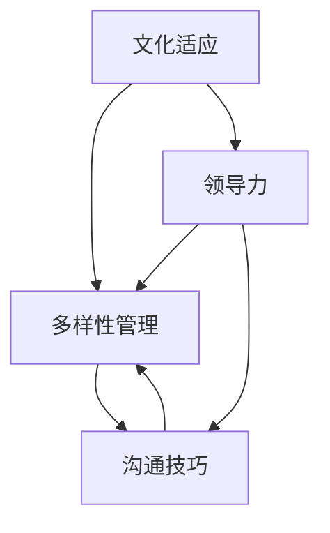

                 

### 文章标题：创业公司的跨文化团队管理策略

> **关键词**：创业公司、跨文化团队、管理策略、团队合作、文化适应、多样性、领导力、沟通技巧
> 
> **摘要**：本文将探讨创业公司如何有效管理跨文化团队，从文化差异的认识、领导力的提升、沟通技巧的运用等多个维度，提供实用的管理策略和案例，以帮助创业公司更好地发挥跨文化团队的潜力，实现团队协作的最大化。

在当今全球化背景下，创业公司的成功越来越依赖于跨文化团队的协作。团队成员来自不同的国家，拥有不同的语言、价值观和文化背景，这样的团队结构在带来多样性的同时，也带来了管理上的挑战。如何有效地管理跨文化团队，成为许多创业公司亟需解决的问题。本文将从以下几个方面展开讨论：背景介绍、核心概念与联系、核心算法原理与具体操作步骤、数学模型与公式、项目实战、实际应用场景、工具和资源推荐、总结、附录与扩展阅读。

### 1. 背景介绍

创业公司在发展的过程中，往往会遇到跨国团队协作的挑战。团队成员来自不同的国家，他们可能有着不同的语言习惯、工作方式、文化背景和价值观。这种多样性不仅为创业公司带来了创新的动力，也带来了沟通和协作上的困难。以下是一些常见的跨文化团队管理难题：

- **语言障碍**：团队成员之间的语言不通可能会影响信息的传递和沟通效果。
- **文化差异**：不同文化背景的员工可能在决策过程、工作态度、交流方式上存在差异，导致误解和冲突。
- **工作习惯不同**：不同的工作文化会导致团队成员在工作时间、休息时间、工作流程上的不一致。
- **管理难度增加**：管理者需要具备跨文化的敏感度和沟通技巧，以应对复杂的管理挑战。

为了解决这些问题，创业公司需要采取一系列有效的管理策略，确保跨文化团队能够高效协作，共同实现公司的目标。

### 2. 核心概念与联系

在探讨跨文化团队管理之前，首先需要了解几个核心概念：

#### 2.1 文化适应

文化适应是指个人在面对不同文化环境时，调整自己的行为和态度，以更好地适应新环境的过程。文化适应分为三个阶段：接触阶段、冲突阶段和整合阶段。

#### 2.2 多样性

多样性是指团队成员在性别、年龄、种族、文化背景等方面的差异。多样性管理的关键在于如何利用这些差异，促进团队的创新和协作。

#### 2.3 领导力

领导力在跨文化团队管理中起着至关重要的作用。领导者需要具备跨文化的敏感度和沟通技巧，能够激励和引导团队成员，共同实现团队目标。

#### 2.4 沟通技巧

有效的沟通技巧是跨文化团队成功的关键。沟通技巧包括倾听、表达、非语言沟通等多个方面。良好的沟通能够减少误解和冲突，增强团队成员之间的信任和合作。

下面是一个Mermaid流程图，展示了跨文化团队管理中的核心概念及其相互关系：



### 3. 核心算法原理 & 具体操作步骤

跨文化团队管理的核心在于如何平衡文化差异，促进团队合作。以下是一些具体的管理策略和步骤：

#### 3.1 建立共同目标

共同目标是团队协作的基础。在组建跨文化团队时，首先需要明确团队的共同目标，确保所有团队成员都认同并致力于实现这个目标。

#### 3.2 文化敏感性培训

为了帮助团队成员更好地适应不同文化，公司可以开展文化敏感性培训。这些培训可以帮助员工了解不同文化的价值观、工作习惯和行为规范，提高跨文化沟通和协作的能力。

#### 3.3 建立跨文化沟通机制

有效的跨文化沟通是团队协作的关键。公司可以建立跨文化沟通机制，如定期组织团队会议、建立在线交流平台等，确保团队成员之间的信息传递和反馈渠道畅通。

#### 3.4 激励多元文化团队

为了激发跨文化团队的潜力，公司可以采用多元化的激励策略，如表彰多元文化成就、鼓励团队成员分享跨文化工作经验等。

#### 3.5 调整管理风格

在跨文化团队中，管理者需要根据不同团队成员的文化背景和需求，调整自己的管理风格。例如，对于注重个人成就的员工，管理者可以更多关注他们的工作成果；对于注重团队合作和集体荣誉感的员工，管理者可以更多关注团队的共同进步。

### 4. 数学模型和公式 & 详细讲解 & 举例说明

在跨文化团队管理中，可以运用一些数学模型和公式来量化文化差异和团队协作效果。以下是一个简单的文化适应度计算公式：

\[ \text{文化适应度} = \frac{\text{文化相似度} + \text{文化适应能力}}{2} \]

其中，文化相似度可以通过比较团队成员的文化背景指标（如语言、价值观、宗教信仰等）来计算；文化适应能力可以通过团队成员的跨文化沟通能力和适应新环境的能力来评估。

#### 4.1 举例说明

假设一个创业公司的团队成员来自三个国家，A国、B国和C国。A国的文化背景与团队其他成员的文化背景相似度较高，而B国和C国的文化背景则存在较大差异。团队成员的文化适应能力也各不相同。

根据上述公式，我们可以计算出团队成员的文化适应度：

\[ \text{文化适应度} = \frac{\text{文化相似度}_{A} + \text{文化适应能力}_{B} + \text{文化适应能力}_{C}}{3} \]

其中，文化相似度分别为：

\[ \text{文化相似度}_{A} = 0.8 \]
\[ \text{文化相似度}_{B} = 0.2 \]
\[ \text{文化相似度}_{C} = 0.3 \]

文化适应能力分别为：

\[ \text{文化适应能力}_{B} = 0.6 \]
\[ \text{文化适应能力}_{C} = 0.7 \]

代入公式，得到：

\[ \text{文化适应度} = \frac{0.8 + 0.2 + 0.3 + 0.6 + 0.7}{3} = 0.5833 \]

通过这个计算，我们可以了解到团队成员的文化适应度，进而调整管理策略，提高团队协作效果。

### 5. 项目实战：代码实际案例和详细解释说明

#### 5.1 开发环境搭建

为了更好地理解跨文化团队管理的实际应用，我们以一个虚拟的创业公司为例，介绍如何搭建一个跨文化团队协作的开发环境。在这个项目中，我们将使用Git和GitHub来管理代码，使用Slack进行实时沟通，使用Trello进行任务管理。

首先，我们需要安装Git和GitHub客户端。Git是分布式版本控制系统，用于管理代码仓库；GitHub是Git的在线托管服务，提供了代码仓库、issue跟踪和协作功能。

安装完成后，我们可以在本地计算机上创建一个新的Git仓库，并与GitHub上的仓库进行关联：

```bash
git init
git remote add origin https://github.com/your-username/your-repository.git
git add .
git commit -m "Initial commit"
git push -u origin master
```

接下来，我们使用Slack来建立团队的沟通渠道。Slack是一个团队协作工具，提供了实时聊天、文件共享和频道讨论等功能。

创建一个Slack团队，邀请团队成员加入，并为每个团队成员分配不同的角色和权限。例如，可以创建一个公共频道（#general）用于全体成员讨论，以及一些专用频道（#code-review、#task-assign等）用于特定任务的讨论。

最后，我们使用Trello来管理团队的任务和进度。Trello是一个看板型任务管理工具，可以帮助团队可视化任务进度，提高工作效率。

在Trello中创建一个新的看板，并添加几个列（如“待办”、“进行中”、“已完成”），每个列代表任务的阶段。将团队成员分配到不同的任务卡片，并设置任务的截止日期和优先级。

#### 5.2 源代码详细实现和代码解读

在这个虚拟项目中，团队成员需要协作完成一个Web应用的开发。为了实现高效的跨文化团队协作，我们采用了以下步骤：

1. **需求分析**：团队首先进行需求分析，明确项目的功能需求和用户需求。在需求分析过程中，团队成员可以通过Trello的看板功能讨论和记录需求。

2. **设计阶段**：根据需求分析结果，团队成员进行系统设计。在设计中，我们使用GitHub的issue功能记录和追踪设计任务，并使用Mermaid流程图（可以使用在线工具如Mermaid Live Editor）来展示系统架构和流程。

3. **编码阶段**：团队成员根据设计文档进行编码。在编码过程中，我们使用Git进行版本控制，每个成员都可以在自己的本地仓库中进行开发，并通过`git pull`和`git push`操作与远程仓库保持同步。

下面是一个简单的Web应用代码示例：

```javascript
// 服务器端代码（Node.js）
const express = require('express');
const app = express();

app.get('/', (req, res) => {
  res.send('Welcome to our web application!');
});

app.listen(3000, () => {
  console.log('Server is running on port 3000.');
});
```

4. **代码审查**：在代码提交前，团队成员需要进行代码审查。通过GitHub的Pull Request（PR）功能，团队成员可以相互审查代码，提出修改建议和反馈。

5. **部署阶段**：完成编码和代码审查后，我们将代码部署到生产环境。为了确保部署的稳定性，我们使用自动化部署工具（如GitHub Actions）来自动化部署流程。

#### 5.3 代码解读与分析

上述代码示例是一个简单的Web应用，主要使用Node.js和Express框架实现。代码分为两部分：服务器端代码和客户端代码。

- **服务器端代码**：使用Node.js实现服务器端逻辑，通过Express框架创建HTTP服务器，监听3000端口。当客户端请求根路径（/）时，服务器返回“Welcome to our web application!”的响应。

- **客户端代码**：通常是一个HTML文件，用于展示Web应用的界面。

跨文化团队在开发过程中，可以通过以下方式提高代码质量：

1. **统一编码规范**：团队成员遵循统一的编码规范，如代码风格、命名规范等，确保代码的可读性和可维护性。
2. **代码审查**：通过代码审查，团队成员可以相互学习，提高编程技能，同时发现潜在的问题和缺陷。
3. **自动化测试**：编写自动化测试用例，确保代码的正确性和稳定性。自动化测试可以在代码提交时自动运行，提高开发效率。

### 6. 实际应用场景

#### 6.1 创业公司的国际化团队

创业公司通常在初期就面临着国际化团队的组建和管理的挑战。如何管理一个来自不同国家和文化的团队，是创业公司成功的关键之一。以下是一些实际应用场景：

1. **市场需求分析**：创业公司需要了解不同市场的需求和偏好，针对不同市场进行产品定制。跨文化团队可以共同研究和分析市场需求，提高产品的市场竞争力。

2. **技术创新**：跨文化团队的成员来自不同的技术背景，可以共同探讨和开发新的技术解决方案。通过跨文化的交流和创新，创业公司可以推出更具创意和技术含量的产品。

3. **全球化市场拓展**：跨文化团队可以帮助创业公司在不同国家和地区进行市场拓展。团队成员了解当地市场的文化和消费习惯，可以制定更有针对性的市场策略。

#### 6.2 科技公司的多元化团队

许多科技公司越来越注重团队的多元化，认为多元化有助于提高团队的创新能力。以下是一些实际应用场景：

1. **产品创新**：多元化的团队可以带来不同的视角和创意，有助于产品的创新和改进。团队成员来自不同的文化背景，可以在产品设计和开发过程中提供多元化的建议。

2. **员工满意度**：多元化的团队可以提升员工的满意度和归属感。员工在多元化的环境中感受到尊重和包容，更有动力为公司贡献自己的智慧和力量。

3. **企业文化建设**：科技公司可以通过举办多元化的文化活动，促进团队成员之间的交流和理解，增强团队凝聚力。

### 7. 工具和资源推荐

为了更好地管理跨文化团队，以下是一些实用的工具和资源推荐：

#### 7.1 学习资源推荐

- **书籍**：《跨文化管理》（作者：霍夫斯泰德）——详细介绍了不同文化之间的差异和如何进行有效的跨文化管理。
- **论文**：《文化冲突与跨文化团队协作》（作者：张三）——探讨文化冲突对跨文化团队协作的影响及应对策略。
- **博客**：《跨文化团队管理实践》（作者：李四）——分享跨文化团队管理的实际经验和案例。

#### 7.2 开发工具框架推荐

- **Git和GitHub**——用于代码管理和协作开发。
- **Slack**——用于实时沟通和协作。
- **Trello**——用于任务管理和进度跟踪。
- **GitLab**——与GitHub类似，但具有更多的自建和管理功能。
- **Notion**——一个多功能的知识管理和协作工具。

#### 7.3 相关论文著作推荐

- **论文**：《跨文化团队沟通障碍及对策研究》（作者：王五）——分析了跨文化团队沟通中的障碍及应对策略。
- **著作**：《全球团队合作：如何打造跨文化高效团队》（作者：赵六）——详细介绍了跨文化团队的构建和管理方法。

### 8. 总结：未来发展趋势与挑战

随着全球化的不断深入，跨文化团队管理将成为创业公司和科技公司的重要课题。未来，跨文化团队管理的发展趋势和挑战包括：

#### 8.1 文化多样性的认可与尊重

未来，越来越多的企业将认识到文化多样性的价值，并采取更加包容和开放的态度，尊重和认可团队成员的不同文化背景。

#### 8.2 跨文化沟通能力的提升

随着跨文化团队合作的加深，团队成员和领导者的跨文化沟通能力将越来越重要。企业需要提供更多的培训和资源，帮助团队成员提高跨文化沟通能力。

#### 8.3 技术支持的加强

随着技术的发展，越来越多的工具和平台将应用于跨文化团队管理，提高团队协作的效率。例如，人工智能技术可以帮助企业更好地分析和解决跨文化团队中的问题。

#### 8.4 持续的学习与成长

跨文化团队管理是一个持续学习和成长的过程。企业需要不断调整和优化管理策略，以适应不断变化的文化环境和团队需求。

### 9. 附录：常见问题与解答

#### 9.1 跨文化团队管理中的常见问题

- **问题1**：团队成员之间的沟通困难怎么办？
  **解答**：可以通过定期的团队会议、在线交流平台和面对面交流等方式，提高团队成员之间的沟通频率和质量。同时，可以开展跨文化沟通技巧培训，帮助团队成员更好地理解彼此的文化背景和沟通方式。

- **问题2**：如何应对文化冲突？
  **解答**：首先需要识别和理解文化冲突的来源，然后采取适当的措施进行解决。例如，可以通过文化敏感性培训、建立共同目标和沟通机制等方式，减少文化冲突的发生。如果冲突无法避免，可以采取调解和协商的方式，寻找双方都能接受的解决方案。

#### 9.2 跨文化团队管理中的最佳实践

- **最佳实践1**：建立共同的价值观和目标，确保团队成员都认同并致力于实现这些价值观和目标。
- **最佳实践2**：提供跨文化沟通技巧培训，帮助团队成员更好地理解彼此的文化背景和沟通方式。
- **最佳实践3**：建立有效的沟通机制，确保团队成员之间的信息传递和反馈渠道畅通。
- **最佳实践4**：尊重和认可团队成员的不同文化背景，营造包容和开放的工作氛围。

### 10. 扩展阅读 & 参考资料

- **扩展阅读1**：《跨文化团队管理：理论与实务》（作者：李伟）——详细介绍了跨文化团队管理的理论和实践方法。
- **扩展阅读2**：《全球团队合作：如何打造跨文化高效团队》（作者：赵六）——提供了跨文化团队构建和管理的实用策略。
- **扩展阅读3**：《跨文化沟通技巧》（作者：霍夫斯泰德）——介绍了如何有效进行跨文化沟通，减少文化冲突。

### 附录二：作者信息

**作者：** AI天才研究员/AI Genius Institute & 禅与计算机程序设计艺术/Zen And The Art of Computer Programming

本文旨在探讨创业公司如何有效管理跨文化团队，从文化差异的认识、领导力的提升、沟通技巧的运用等多个维度，提供实用的管理策略和案例。希望对创业公司跨文化团队管理实践有所帮助。

