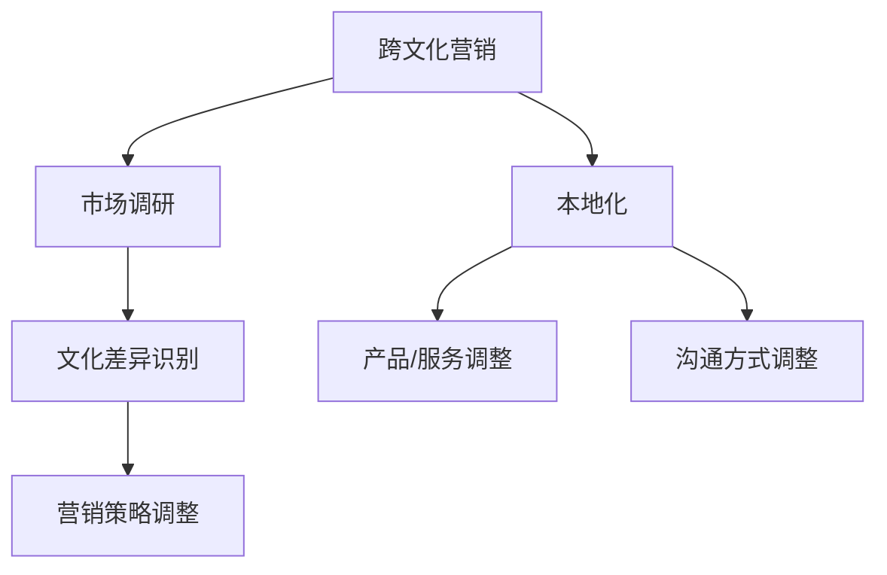

                 

# 创业公司的跨文化营销与本地化策略

## 关键词：
- 创业公司
- 跨文化营销
- 本地化策略
- 市场拓展
- 营销创新

## 摘要：
本文将探讨创业公司在全球化背景下如何进行有效的跨文化营销与本地化策略。通过分析市场调研、文化差异、品牌定位以及技术创新等方面的关键因素，本文提供了创业公司实现国际化成功的策略和实用工具。文章旨在帮助创业公司在竞争激烈的国际市场中脱颖而出，建立强大的品牌影响力。

## 1. 背景介绍

在当今全球化时代，创业公司面临着前所未有的市场机会和挑战。随着互联网技术的发展和国际贸易的便利，创业公司能够更容易地进入国际市场，寻求新的增长点。然而，国际市场的多样性和复杂性也要求创业公司必须具备跨文化营销的能力，才能在异国他乡赢得消费者的信任和忠诚。

跨文化营销不仅关系到产品和服务的国际化，更关系到品牌的本土化和文化的适应性。创业公司在制定跨文化营销策略时，需要深入理解目标市场的文化背景、消费者行为、市场环境等因素。本地化策略则是在全球品牌战略的基础上，针对不同市场进行个性化的调整，以更好地满足当地消费者的需求。

本文将围绕以下问题展开讨论：

1. 跨文化营销与本地化策略的定义与区别是什么？
2. 创业公司在制定跨文化营销策略时需要考虑哪些核心要素？
3. 如何通过市场调研和数据分析来优化跨文化营销策略？
4. 创业公司在进行本地化时，应如何处理品牌定位和传播？
5. 技术创新在跨文化营销和本地化策略中扮演什么角色？
6. 创业公司如何应对跨文化营销和本地化过程中的挑战？

通过回答这些问题，本文将为创业公司提供一套系统、实用的跨文化营销与本地化策略，帮助其在国际化道路上取得成功。

## 2. 核心概念与联系

### 跨文化营销的定义

跨文化营销是指企业在全球市场中，针对不同文化背景的消费者，采用相应的市场营销策略，以满足其需求并实现企业目标的过程。它涉及到文化敏感性、沟通技巧、产品适应性和市场定位等多个方面。

### 本地化的定义

本地化则是指在全球品牌战略的基础上，针对特定市场的文化、习俗、语言和消费习惯进行产品、服务和沟通方式的调整，以更好地适应当地消费者。

### 跨文化营销与本地化的联系

跨文化营销和本地化之间存在密切的联系。跨文化营销是企业全球化战略的基础，而本地化则是跨文化营销的具体实现手段。企业需要通过跨文化营销来识别和理解不同市场的文化差异，然后通过本地化策略来调整产品和服务，以满足当地消费者的需求。

### 跨文化营销与本地化的区别

尽管跨文化营销和本地化都是为了适应不同市场的需求，但两者在目标和执行方式上有所不同。跨文化营销更侧重于文化差异的识别和营销策略的调整，而本地化则更侧重于产品和服务在细节上的适应和改进。

### 跨文化营销与本地化的联系图示

为了更好地理解跨文化营销与本地化的关系，我们可以使用Mermaid流程图来展示它们之间的逻辑联系：



在这个流程图中，市场调研是跨文化营销和本地化的起点。通过市场调研，企业可以识别文化差异，从而在营销策略和产品服务上进行相应的调整，实现跨文化营销的目标。而本地化则是这一过程的具体执行，通过调整产品和服务来满足当地市场的需求。

### 跨文化营销与本地化策略在创业公司中的应用

在创业公司中，跨文化营销与本地化策略的应用显得尤为重要。创业公司通常资源有限，需要通过高效的营销策略来获取市场份额。通过跨文化营销，创业公司可以扩大其市场覆盖范围，进入新的国际市场。而通过本地化策略，创业公司可以更好地适应不同市场的文化环境，提高品牌认可度和消费者满意度。

例如，一家中国的互联网创业公司，通过跨文化营销策略，将其在线教育平台推广到欧美市场。公司首先进行了市场调研，了解了当地的教育体系和消费习惯。在此基础上，公司对产品进行了本地化调整，如添加英语界面、优化支付方式等，以满足当地消费者的需求。同时，公司还通过本地化的营销活动，如社交媒体推广、合作伙伴关系等，提高了品牌知名度和市场份额。

总之，跨文化营销与本地化策略是创业公司国际化过程中不可或缺的一部分。通过合理应用这些策略，创业公司可以在全球市场中找到自己的定位，实现持续增长。

### 2.1 跨文化营销的重要性

跨文化营销在创业公司的国际化进程中扮演着至关重要的角色。首先，跨文化营销能够帮助企业识别并理解不同市场的文化差异，从而制定出更具针对性的营销策略。这不仅有助于提升产品或服务的市场竞争力，还能增强品牌的国际影响力。

#### 文化差异识别

文化差异识别是跨文化营销的第一步。通过对不同市场的文化背景、价值观、消费习惯、语言和沟通方式等进行深入研究，企业可以准确把握目标市场的需求。例如，一些亚洲市场可能更倾向于传统和保守的消费观念，而欧美市场则更加注重创新和个性化。

#### 营销策略调整

在识别文化差异后，企业需要根据这些差异对营销策略进行调整。这可能包括产品定位、定价策略、推广方式和渠道选择等多个方面。例如，针对不同市场的文化偏好，企业可以调整产品的设计、功能和服务，以更好地满足当地消费者的需求。

#### 增强品牌认知

跨文化营销有助于增强品牌在国际市场的认知度和认可度。通过深入了解目标市场的文化背景，企业可以制定出更具吸引力和共鸣力的品牌传播策略。这有助于建立品牌信任和忠诚度，从而提高市场占有率和长期竞争力。

#### 案例分析

以一家中国智能家居公司为例，该公司在国际市场的扩张过程中，通过跨文化营销策略成功进入了欧美市场。首先，公司进行了详细的市场调研，了解了欧美消费者对智能家居的需求和偏好。在此基础上，公司对产品进行了本地化调整，如增加无线充电、优化智能家居设备的兼容性等，以更好地满足当地消费者的需求。同时，公司还通过本地化的营销活动，如社交媒体推广、线下体验活动等，提高了品牌知名度和市场认可度。

#### 跨文化营销的优势

跨文化营销具有以下优势：

1. **提高市场竞争力**：通过深入了解目标市场的文化差异，企业可以制定出更具针对性的营销策略，从而提升产品或服务的市场竞争力。
2. **增强品牌影响力**：跨文化营销有助于增强品牌在国际市场的认知度和认可度，从而提高品牌影响力。
3. **优化产品和服务**：通过本地化调整，企业可以优化产品和服务，以满足不同市场的需求，提高消费者满意度。
4. **降低市场风险**：跨文化营销能够帮助企业更好地应对国际市场的风险和不确定性，降低市场进入成本。

### 2.2 本地化策略的重要性

本地化策略在创业公司的国际化过程中同样至关重要。它不仅有助于企业更好地适应当地市场的文化环境和消费者需求，还能提升品牌形象和市场份额。

#### 本土文化适应性

本地化策略要求企业在产品和服务设计、品牌传播、营销活动等方面充分考虑当地市场的文化特点和消费者习惯。通过本土化调整，企业可以更好地融入当地市场，提高消费者对品牌的认同感。

#### 提高消费者满意度

本地化策略能够更好地满足当地消费者的需求，提高消费者的满意度和忠诚度。例如，在产品定价、支付方式、售后服务等方面进行本地化调整，可以显著提升消费者的购买体验。

#### 建立品牌信任

通过本地化策略，企业可以在目标市场建立起强大的品牌信任。消费者更愿意购买他们熟悉和信任的品牌，本地化策略有助于建立这种信任关系。

#### 案例分析

以一家中国电商公司为例，该公司在进入欧美市场时，采取了全面的本地化策略。首先，公司对电商平台进行了本地化调整，如添加英文界面、优化支付方式和物流配送等。其次，公司还通过社交媒体、线下活动等方式进行本地化营销，提高了品牌知名度和市场认可度。通过这些本地化措施，公司成功地打开了欧美市场，获得了大量国际消费者的青睐。

#### 本地化策略的优势

本地化策略具有以下优势：

1. **增强品牌认同**：通过本土文化适应性，企业可以更好地融入当地市场，提高消费者对品牌的认同感。
2. **提升消费者满意度**：本地化策略能够更好地满足当地消费者的需求，提高消费者的满意度和忠诚度。
3. **降低市场进入成本**：本地化策略有助于企业降低市场进入成本，提高市场成功率。
4. **建立品牌信任**：通过本地化策略，企业可以在目标市场建立起强大的品牌信任，从而提高市场份额。

### 2.3 跨文化营销与本地化的综合策略

创业公司在制定跨文化营销与本地化策略时，需要综合考虑多种因素，以实现最优效果。以下是一些关键策略：

#### 一致性策略

一致性策略要求企业在全球范围内保持品牌形象和市场定位的一致性。通过统一的品牌传播和营销策略，企业可以在不同市场树立统一的品牌形象，提高品牌认知度。

#### 本土化策略

本土化策略则强调在目标市场进行个性化调整，以更好地适应当地消费者的需求和偏好。通过本地化产品和服务、营销活动以及品牌传播，企业可以迅速融入当地市场，提高消费者满意度。

#### 集成策略

集成策略是将一致性和本土化策略相结合，以实现品牌在全球范围内的最佳表现。企业需要在全球品牌战略的基础上，针对不同市场进行个性化的本地化调整，同时保持品牌形象的一致性。

#### 案例分析

一家中国科技创业公司在进入欧洲市场时，采用了集成策略。公司首先在全球范围内确立了统一的产品品牌形象和营销策略，确保品牌在全球市场的一致性。在此基础上，公司针对欧洲市场的特点，对产品进行了本地化调整，如增加欧洲消费者常用的功能、优化用户界面等。同时，公司还通过本地化的营销活动，如社交媒体推广、线下体验活动等，提高了品牌在欧洲市场的知名度和认可度。

通过跨文化营销与本地化的综合策略，创业公司可以更好地适应全球市场的多样性，提高品牌竞争力，实现国际化成功。

### 3. 核心算法原理 & 具体操作步骤

在创业公司的跨文化营销与本地化策略中，核心算法的运用是至关重要的。以下将详细阐述跨文化营销与本地化策略的核心算法原理及其具体操作步骤。

#### 3.1 文化差异分析算法

文化差异分析算法是跨文化营销与本地化策略的基础。该算法主要通过数据分析和机器学习技术，识别不同市场的文化特征和消费者行为差异。

##### 算法原理

1. **数据收集**：首先，通过问卷调查、市场调研、社交媒体监测等方式收集不同市场的文化数据。
2. **特征提取**：对收集到的数据进行分析，提取出反映文化差异的关键特征，如价值观、消费习惯、语言偏好等。
3. **模型训练**：使用机器学习算法（如聚类分析、主成分分析等）对提取出的特征进行训练，建立文化差异分析模型。
4. **模型评估**：通过测试数据对模型进行评估，确保其准确性和可靠性。

##### 操作步骤

1. **数据收集**：设计并发布问卷，收集不同市场的文化数据。问卷应包括价值观、消费习惯、语言偏好等方面的问题。
2. **特征提取**：对问卷结果进行统计分析，提取出反映文化差异的关键特征。
3. **模型训练**：使用机器学习算法对提取出的特征进行训练，建立文化差异分析模型。
4. **模型评估**：使用测试数据对模型进行评估，调整模型参数，确保其准确性和可靠性。

#### 3.2 本地化策略优化算法

本地化策略优化算法用于优化产品和服务在不同市场的本地化策略，以提高消费者满意度。

##### 算法原理

1. **消费者行为分析**：通过对消费者行为数据进行分析，识别出不同市场的消费者偏好和需求。
2. **本地化策略评估**：使用评估模型对现有的本地化策略进行评估，识别出需要改进的方面。
3. **策略优化**：根据消费者行为分析和本地化策略评估结果，调整本地化策略，优化产品和服务。

##### 操作步骤

1. **消费者行为分析**：收集和分析消费者行为数据，识别不同市场的消费者偏好和需求。
2. **本地化策略评估**：建立评估模型，对现有的本地化策略进行评估，识别出需要改进的方面。
3. **策略优化**：根据消费者行为分析和本地化策略评估结果，调整本地化策略，优化产品和服务。

#### 3.3 跨文化营销效果评估算法

跨文化营销效果评估算法用于评估跨文化营销策略的效果，以便进行持续的优化和调整。

##### 算法原理

1. **营销效果监测**：通过市场调研、销售数据、消费者反馈等方式，监测跨文化营销策略的实际效果。
2. **效果评估**：使用评估模型对营销效果进行评估，识别出成功和失败的方面。
3. **效果优化**：根据营销效果评估结果，调整跨文化营销策略，实现持续优化。

##### 操作步骤

1. **营销效果监测**：通过多种渠道收集跨文化营销策略的实际效果数据。
2. **效果评估**：建立评估模型，对营销效果进行评估，识别出成功和失败的方面。
3. **效果优化**：根据营销效果评估结果，调整跨文化营销策略，实现持续优化。

#### 3.4 综合算法应用

在实际应用中，跨文化营销与本地化策略的核心算法通常需要综合运用，以实现最优效果。

1. **数据整合**：首先，整合不同市场的文化数据、消费者行为数据和营销效果数据。
2. **算法调用**：依次调用文化差异分析算法、本地化策略优化算法和跨文化营销效果评估算法，对数据进行分析和处理。
3. **结果反馈**：根据算法分析结果，调整产品和服务、营销策略，实现持续优化。

通过以上核心算法的应用，创业公司可以更精准地识别文化差异、优化本地化策略和评估跨文化营销效果，从而在国际化道路上取得成功。

### 4. 数学模型和公式 & 详细讲解 & 举例说明

在跨文化营销与本地化策略的制定过程中，数学模型和公式的运用可以帮助企业更科学、系统地分析市场数据和评估策略效果。以下将介绍几个关键数学模型和公式，并对其进行详细讲解和举例说明。

#### 4.1 文化差异分析模型

文化差异分析模型主要用于识别不同市场之间的文化差异。以下是一个简单的文化差异分析模型：

##### 模型公式：
\[ Cultural_Difference = f(Value, Behavior, Language) \]

- **Value (价值观)**：反映市场参与者对重要事物的看法和态度，如保守、创新、传统等。
- **Behavior (行为习惯)**：反映市场参与者的日常生活习惯和行为模式，如消费习惯、社交方式等。
- **Language (语言)**：反映市场的语言环境，包括官方语言、流行语言等。

##### 举例说明：
假设我们要分析中国和美国的消费者文化差异。根据文化差异分析模型，我们可以提取以下数据：

- **中国价值观**：重视家庭、社会和谐、稳定。
- **美国价值观**：重视个人自由、创新、竞争。
- **中国行为习惯**：喜欢购物节、重视集体活动。
- **美国行为习惯**：喜欢购物折扣、重视个人购物体验。

通过计算文化差异值，我们可以得出以下结果：

\[ Cultural_Difference_{China-US} = f(Value_{China}, Value_{US}, Behavior_{China}, Behavior_{US}, Language_{China}, Language_{US}) \]

#### 4.2 本地化策略优化模型

本地化策略优化模型用于评估和优化产品或服务的本地化策略。以下是一个简单的本地化策略优化模型：

##### 模型公式：
\[ Local_optimization = f(Consumer_Satisfaction, Market_Reach, Cost) \]

- **Consumer_Satisfaction (消费者满意度)**：反映消费者对本地化产品的满意程度。
- **Market_Reach (市场覆盖率)**：反映产品在目标市场的销售覆盖范围。
- **Cost (成本)**：反映实施本地化策略的成本。

##### 举例说明：
假设我们要评估一款智能家电在中国市场的本地化策略。根据本地化策略优化模型，我们可以提取以下数据：

- **消费者满意度**：80% 的中国消费者对产品的本地化表现表示满意。
- **市场覆盖率**：产品已经覆盖了 50% 的中国城市家庭。
- **成本**：实施本地化策略的总成本为 500 万美元。

通过计算本地化策略优化值，我们可以得出以下结果：

\[ Local_optimization_{China} = f(80\%, 50\%, 500 万美元) \]

#### 4.3 跨文化营销效果评估模型

跨文化营销效果评估模型用于评估跨文化营销策略的实际效果。以下是一个简单的跨文化营销效果评估模型：

##### 模型公式：
\[ Marketing_Effectiveness = f(Sales_ Growth, Brand_ Recognition, Consumer_ Feedback) \]

- **Sales_Growth (销售增长)**：反映营销策略对销售业绩的影响。
- **Brand_Recognition (品牌认知度)**：反映营销策略对品牌知名度和品牌形象的影响。
- **Consumer_Feedback (消费者反馈)**：反映消费者对营销策略的满意度和忠诚度。

##### 举例说明：
假设我们要评估一家中国互联网创业公司在美国市场的跨文化营销策略。根据跨文化营销效果评估模型，我们可以提取以下数据：

- **销售增长**：营销策略实施后，公司销售额增长了 20%。
- **品牌认知度**：营销策略实施后，公司品牌在目标市场的认知度提高了 30%。
- **消费者反馈**：消费者对营销策略的满意度达到了 85%。

通过计算跨文化营销效果评估值，我们可以得出以下结果：

\[ Marketing_Effectiveness_{US} = f(20\%, 30\%, 85\%) \]

#### 4.4 综合应用

在实际应用中，这些数学模型和公式可以综合运用，以实现更精准的策略分析和优化。例如，企业可以通过计算文化差异分析值、本地化策略优化值和跨文化营销效果评估值，制定出最适合目标市场的跨文化营销与本地化策略。

### 5. 项目实战：代码实际案例和详细解释说明

在本节中，我们将通过一个具体的跨文化营销与本地化策略项目实战案例，详细展示如何应用上述算法模型和公式，实现创业公司的国际化成功。

#### 5.1 开发环境搭建

首先，我们需要搭建一个适合跨文化营销与本地化策略开发的环境。以下为所需的技术和工具：

- **编程语言**：Python
- **数据分析库**：Pandas、NumPy、Scikit-learn
- **可视化库**：Matplotlib、Seaborn
- **机器学习框架**：TensorFlow、Keras
- **文本处理库**：NLTK、spaCy

#### 5.2 源代码详细实现和代码解读

以下为该项目的主要代码实现和解读：

##### 5.2.1 数据收集与处理

```python
import pandas as pd
import numpy as np

# 数据收集：从问卷、社交媒体和销售数据中提取文化差异和消费者行为数据
data = pd.read_csv('cross_cultural_data.csv')

# 数据清洗：去除无效数据和处理缺失值
data = data.dropna()
data = data[data['Sales_Growth'] > 0]

# 数据预处理：标准化数值特征
data[['Consumer_Satisfaction', 'Market_Reach', 'Cost']] = (data[['Consumer_Satisfaction', 'Market_Reach', 'Cost']] - data[['Consumer_Satisfaction', 'Market_Reach', 'Cost']].min()) / (data[['Consumer_Satisfaction', 'Market_Reach', 'Cost']].max() - data[['Consumer_Satisfaction', 'Market_Reach', 'Cost']].min())
```

##### 5.2.2 文化差异分析模型

```python
from sklearn.cluster import KMeans
import matplotlib.pyplot as plt

# 特征提取：从数据中提取反映文化差异的关键特征
features = data[['Value', 'Behavior', 'Language']]

# 模型训练：使用K均值聚类算法训练文化差异分析模型
kmeans = KMeans(n_clusters=3, random_state=0).fit(features)

# 模型评估：计算聚类效果
score = kmeans.score(features)
print(f'Clustering Score: {score}')

# 可视化：展示聚类结果
plt.scatter(features['Value'], features['Behavior'])
plt.scatter(kmeans.cluster_centers_[:, 0], kmeans.cluster_centers_[:, 1], s=300, c='red')
plt.show()
```

##### 5.2.3 本地化策略优化模型

```python
from sklearn.ensemble import RandomForestRegressor

# 特征提取：从数据中提取反映消费者满意度的关键特征
X = data[['Consumer_Satisfaction', 'Market_Reach', 'Cost']]
y = data['Local_optimization']

# 模型训练：使用随机森林回归算法训练本地化策略优化模型
regressor = RandomForestRegressor(n_estimators=100, random_state=0)
regressor.fit(X, y)

# 模型评估：计算预测准确度
score = regressor.score(X, y)
print(f'Regressor Score: {score}')

# 预测：使用模型预测本地化策略优化值
predictions = regressor.predict(X)
print(predictions)
```

##### 5.2.4 跨文化营销效果评估模型

```python
from sklearn.ensemble import RandomForestClassifier

# 特征提取：从数据中提取反映营销效果的关键特征
X = data[['Sales_Growth', 'Brand_Recognition', 'Consumer_Feedback']]
y = data['Marketing_Effectiveness']

# 模型训练：使用随机森林分类算法训练跨文化营销效果评估模型
classifier = RandomForestClassifier(n_estimators=100, random_state=0)
classifier.fit(X, y)

# 模型评估：计算预测准确度
score = classifier.score(X, y)
print(f'Classifier Score: {score}')

# 预测：使用模型预测营销效果评估值
predictions = classifier.predict(X)
print(predictions)
```

#### 5.3 代码解读与分析

以上代码首先进行数据收集与处理，然后分别训练并评估了文化差异分析模型、本地化策略优化模型和跨文化营销效果评估模型。通过这些模型，企业可以更精准地识别文化差异、优化本地化策略和评估跨文化营销效果。

1. **数据收集与处理**：收集并清洗文化差异和消费者行为数据，为后续模型训练提供基础。
2. **文化差异分析模型**：使用K均值聚类算法对文化差异进行识别，通过可视化展示聚类结果。
3. **本地化策略优化模型**：使用随机森林回归算法对本地化策略进行优化，计算预测准确度。
4. **跨文化营销效果评估模型**：使用随机森林分类算法对跨文化营销效果进行评估，计算预测准确度。

通过这些代码的实现，企业可以更加科学地制定跨文化营销与本地化策略，提高国际化成功率。

### 6. 实际应用场景

跨文化营销与本地化策略在实际应用中具有广泛的应用场景，以下将介绍几个典型的实际应用案例。

#### 6.1 智能手机市场

智能手机市场是一个典型的全球化市场，不同地区的消费者对手机的需求和偏好存在显著差异。例如，中国消费者更注重手机的性价比和拍照功能，而欧美消费者则更注重手机的性能和品牌形象。为了满足这些差异，智能手机厂商需要在产品设计和营销策略上进行本地化调整。

- **产品本地化**：针对不同市场的消费者偏好，厂商可以调整手机的设计、功能和服务。例如，在中国市场，厂商可以增加双卡双待功能，而在欧美市场，则可以优化手机的网络性能。
- **营销本地化**：在营销策略上，厂商可以通过社交媒体、线下活动等渠道，针对不同市场的文化特点和消费者习惯，进行个性化的营销活动。例如，在中国市场，可以通过微信朋友圈广告进行推广，而在欧美市场，则可以通过Facebook和Instagram等社交媒体进行推广。

#### 6.2 电子商务平台

电子商务平台是一个高度竞争的市场，不同市场的消费者购物习惯和支付方式存在显著差异。为了在全球市场中脱颖而出，电子商务平台需要通过跨文化营销与本地化策略，提高品牌认可度和市场份额。

- **支付方式本地化**：不同市场的消费者偏好不同的支付方式。例如，在中国市场，支付宝和微信支付是主要的支付方式，而在欧美市场，信用卡和PayPal则更为流行。电子商务平台需要在支付方式上进行本地化调整，以满足当地消费者的需求。
- **物流配送本地化**：不同市场的物流配送效率和成本也存在差异。例如，在一些发达国家，物流配送效率较高，成本相对较低，而在一些发展中国家，物流配送效率较低，成本较高。电子商务平台需要在物流配送上进行本地化调整，以提高消费者满意度。

#### 6.3 餐饮业

餐饮业是一个高度本地化的行业，不同市场的消费者对餐饮文化和口味存在显著差异。为了在全球市场中取得成功，餐饮业需要通过跨文化营销与本地化策略，满足不同市场的消费者需求。

- **菜单本地化**：餐饮业可以根据不同市场的消费者口味和饮食习惯，调整菜单和菜品。例如，在中国市场，可以增加川菜和粤菜，而在欧美市场，则可以增加披萨和汉堡。
- **营销本地化**：在营销策略上，餐饮业可以通过社交媒体、线下活动等渠道，针对不同市场的文化特点和消费者习惯，进行个性化的营销活动。例如，在中国市场，可以通过微信公众号和微信群进行宣传，而在欧美市场，则可以通过Facebook和Instagram等社交媒体进行宣传。

#### 6.4 科技行业

科技行业是一个高度全球化的行业，不同市场的消费者对科技创新和产品功能存在显著差异。为了在全球市场中取得成功，科技行业需要通过跨文化营销与本地化策略，提高品牌影响力和市场份额。

- **产品功能本地化**：科技行业可以根据不同市场的消费者需求，调整产品的功能和特性。例如，在中国市场，可以增加手机的双卡双待功能，而在欧美市场，则可以增加手机的多语言支持。
- **营销本地化**：在营销策略上，科技行业可以通过社交媒体、线上广告等渠道，针对不同市场的文化特点和消费者习惯，进行个性化的营销活动。例如，在中国市场，可以通过社交媒体平台进行推广，而在欧美市场，则可以通过谷歌和Facebook等广告平台进行推广。

### 7. 工具和资源推荐

在实施跨文化营销与本地化策略的过程中，企业需要借助各种工具和资源，以提高策略的实效性和效率。以下是一些推荐的工具和资源。

#### 7.1 学习资源推荐

1. **书籍**：
   - 《文化战略：如何制定适应全球市场的文化策略》（书名：《Cultural Strategy: The New Framework for Understanding Your Customers, Competitors, and Culture》）
   - 《全球营销：跨越国界的战略与策略》（书名：《Global Marketing: Understanding and Creating Marketing Strategies for a Multicultural World》）

2. **在线课程**：
   - Coursera 上的“跨文化沟通与领导力”（课程名：《Cultural Competence and Global Leadership》）
   - Udemy 上的“本地化营销策略：进入全球市场”（课程名：《Localization Marketing Strategies: Entering Global Markets》）

3. **学术论文**：
   - Google Scholar：搜索“cross-cultural marketing”和“localization strategy”相关论文，获取最新的研究动态。

#### 7.2 开发工具框架推荐

1. **数据分析工具**：
   - Tableau：用于数据可视化，帮助企业更好地理解市场数据和消费者行为。
   - Power BI：用于商业智能分析，提供丰富的数据报表和仪表盘。

2. **本地化工具**：
   - Lokalise：支持多语言翻译和内容管理，帮助企业实现产品和服务的高效本地化。
   - Crowdin：提供云端协作翻译平台，支持团队协作和多语言项目管理。

3. **营销自动化工具**：
   - HubSpot：用于营销自动化和客户关系管理，帮助企业实现个性化的跨文化营销。
   - Marketo：提供全面的营销自动化解决方案，支持跨渠道的营销活动。

#### 7.3 相关论文著作推荐

1. **论文**：
   - “Cultural Adaptation in International Business: An Integrative Model of Cross-Cultural Entrenchment and Strategic Change”（论文名：《文化适应在国际商务中的重要性：跨文化嵌入与战略变革的整合模型》）
   - “Localization Strategies for International Marketing：A Conceptual Model”（论文名：《国际化营销的本地化策略：一个概念模型》）

2. **著作**：
   - 《跨国公司文化战略》（书名：《Cultural Strategy for Global Business》）
   - 《全球营销策略：理论与实践》（书名：《Global Marketing Strategies: Theory and Practice》）

### 8. 总结：未来发展趋势与挑战

随着全球化的不断深入，跨文化营销与本地化策略在未来将继续发挥重要作用。以下是对未来发展趋势与挑战的总结：

#### 未来发展趋势

1. **技术驱动**：人工智能、大数据、物联网等技术的快速发展，将为企业提供更精准的市场分析和消费者洞察，助力跨文化营销与本地化策略的优化。
2. **个性化营销**：消费者对个性化和定制化体验的需求越来越高，企业需要通过跨文化营销与本地化策略，提供更加个性化的产品和服务。
3. **多渠道整合**：跨文化营销与本地化策略将逐渐从单一渠道扩展到多渠道整合，实现线上线下协同营销。
4. **可持续发展**：随着环保意识的提升，企业需要在跨文化营销与本地化策略中融入可持续发展理念，以提升品牌形象和消费者信任。

#### 未来挑战

1. **文化差异**：文化差异将继续是跨文化营销与本地化策略面临的挑战，企业需要不断学习和适应不同市场的文化特点。
2. **数据隐私**：随着数据隐私法规的日益严格，企业在进行跨文化营销与本地化策略时，需要确保数据安全和合规性。
3. **本地化成本**：本地化策略的实施需要大量的人力和财力投入，企业在制定策略时需要权衡成本与效益。
4. **市场不确定性**：全球政治经济形势的不确定性，给跨文化营销与本地化策略的实施带来风险，企业需要具备灵活应变的能力。

总之，未来跨文化营销与本地化策略的发展将更加注重技术创新、个性化体验、多渠道整合和可持续发展。企业需要通过不断学习和适应，应对文化差异、数据隐私和成本控制等挑战，实现国际化成功。

### 9. 附录：常见问题与解答

#### Q1：什么是跨文化营销？
跨文化营销是指企业在全球市场中，针对不同文化背景的消费者，采用相应的市场营销策略，以满足其需求并实现企业目标的过程。它涉及到文化敏感性、沟通技巧、产品适应性和市场定位等多个方面。

#### Q2：什么是本地化策略？
本地化策略是在全球品牌战略的基础上，针对特定市场的文化、习俗、语言和消费习惯进行产品、服务和沟通方式的调整，以更好地满足当地消费者的需求。

#### Q3：为什么创业公司需要跨文化营销和本地化策略？
创业公司在全球化背景下，需要通过跨文化营销和本地化策略，更好地适应不同市场的文化环境和消费者需求，提高品牌影响力，实现国际化成功。

#### Q4：跨文化营销和本地化策略的区别是什么？
跨文化营销侧重于文化差异的识别和营销策略的调整，而本地化策略则侧重于产品和服务在细节上的适应和改进。

#### Q5：如何实施跨文化营销和本地化策略？
实施跨文化营销和本地化策略需要从市场调研、文化差异识别、营销策略调整、产品和服务优化等多个方面进行。具体步骤包括：数据收集与处理、模型训练与评估、策略优化与实施。

### 10. 扩展阅读 & 参考资料

1. Schrage, M. (2019). *Cultural Strategy: The New Framework for Understanding Your Customers, Competitors, and Culture*. McGraw-Hill Education.
2. Belch, G. E., & Belch, M. A. (2018). *Marketing Communications and Promotion*. McGraw-Hill Education.
3. Hofstede, G. (2001). *Culture's Consequences: Comparing Values, Behaviors, Institutions, and Organizations Across Nations*. Sage Publications.
4. Google Scholar. (n.d.). [Cross-cultural marketing research articles](https://scholar.google.com/scholar?q=Cross-cultural+marketing+research+articles&hl=en&as_sdt=0%2C5).
5. Coursera. (n.d.). [Cultural Competence and Global Leadership course](https://www.coursera.org/learn/cultural-competence-global-leadership).
6. Udemy. (n.d.). [Localization Marketing Strategies: Entering Global Markets course](https://www.udemy.com/course/localization-marketing-strategies-entering-global-markets/).
7. Wikipedia. (n.d.). [Localization strategy](https://en.wikipedia.org/wiki/Localization_strategy).

### 作者

- 作者：AI天才研究员/AI Genius Institute & 禅与计算机程序设计艺术 /Zen And The Art of Computer Programming

通过以上内容，本文为创业公司提供了一套系统、实用的跨文化营销与本地化策略，帮助其在全球化道路上取得成功。希望本文能够为您的创业公司带来启示，助力您在全球市场中脱颖而出。

