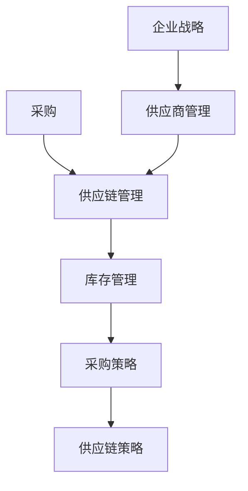

                 

### 背景介绍

#### 创业公司的兴起

在当今竞争激烈的市场环境中，创业公司如雨后春笋般涌现。这些新兴企业，通常由一群有激情、有梦想的创业者组成，他们希望通过创新的产品和服务，改变世界。然而，在追求梦想的过程中，采购与供应链管理策略的制定往往被忽视，这却成为了制约公司发展的一个关键因素。

采购与供应链管理，作为公司运营的基石，不仅关系到成本控制、库存管理，还直接影响产品质量和交付周期。创业公司在资源有限、市场竞争激烈的情况下，更需要通过有效的采购与供应链管理，确保公司业务的稳定和持续增长。

#### 采购与供应链管理的定义

采购，指的是企业为了满足生产经营需要，从外部获取原材料、设备、服务等的行为。而供应链管理，则是一个涉及采购、生产、配送、销售等各个环节的复杂过程，旨在确保企业能够高效、低成本地满足市场需求。

有效的采购与供应链管理，能够帮助企业实现以下目标：

- 降低成本：通过优化采购策略，降低采购成本，从而提高利润率。
- 提高库存周转率：合理规划库存，减少库存积压，提高资金使用效率。
- 确保产品质量：从源头控制原材料和零部件的质量，保障最终产品的质量。
- 缩短交货周期：通过高效的供应链管理，确保产品能够及时交付给客户。

#### 创业公司面临的挑战

对于创业公司而言，采购与供应链管理面临着诸多挑战：

1. **资源限制**：创业公司通常资金有限，需要权衡采购成本、库存管理、产品质量等因素，寻找最优的采购方案。
2. **市场变化**：市场需求变化快，创业公司需要具备快速响应的能力，调整采购策略和供应链管理。
3. **供应商管理**：寻找可靠的供应商，确保供应链的稳定性和可靠性，对创业公司来说是一项艰巨的任务。
4. **合规风险**：在全球化的背景下，创业公司需要遵守各种国际贸易规则和环保法规，合规性风险不容忽视。

#### 文章目的

本文旨在为创业公司提供一套全面的采购与供应链管理策略，帮助公司在资源有限、市场竞争激烈的环境中，实现成本控制、质量保障和高效运营。文章将详细探讨以下内容：

1. **采购策略**：包括采购流程、采购渠道、采购成本控制等。
2. **供应链管理**：包括供应链设计、供应链优化、供应链风险控制等。
3. **实际案例**：结合具体创业公司的实际案例，分析其采购与供应链管理的成功经验。
4. **工具和资源**：推荐一些实用的采购与供应链管理工具和资源，帮助创业公司提升管理效率。

通过本文的阅读，读者将能够了解到：

- 采购与供应链管理的基本概念和重要性。
- 创业公司在采购与供应链管理中面临的挑战。
- 制定和实施有效的采购与供应链管理策略的方法。
- 如何利用工具和资源提升采购与供应链管理效率。

希望本文能够为创业公司提供有价值的指导，助力其在激烈的市场竞争中脱颖而出。接下来，我们将深入探讨采购与供应链管理的核心概念和原理，为后续的讨论打下基础。## 2. 核心概念与联系

在探讨创业公司的采购与供应链管理策略之前，我们需要先了解一些关键概念，以及这些概念之间的相互关系。以下是几个核心概念及其联系：

#### 采购

采购是指企业从外部获取所需原材料、零部件、设备和服务的过程。它涉及到供应商的选择、价格谈判、合同签订以及物料交付等多个环节。采购不仅关乎成本控制，还直接影响生产进度和产品质量。

#### 供应链

供应链是一个由供应商、制造商、分销商和零售商组成的复杂网络，旨在将原材料转化为成品，并通过各种渠道最终交付给消费者。供应链管理则是对这个网络进行规划、协调、控制和优化的过程。

#### 库存管理

库存管理是指对企业的原材料、在制品和成品进行有效控制和管理的活动。合理的库存管理能够减少库存积压、降低存储成本，并确保生产线的连续性。

#### 采购策略

采购策略是企业根据自身需求和市场环境，制定的采购计划和行动方案。常见的采购策略包括集中采购、分散采购、长期采购、短期采购等。

#### 供应链策略

供应链策略是企业制定的关于供应链设计、管理和优化的计划。这些策略旨在确保供应链的效率、灵活性和可靠性，以满足市场需求。

#### 核心概念与联系

以下是核心概念之间的联系及其在采购与供应链管理中的应用：

1. **采购与供应链管理的关系**：采购是供应链管理的一个环节，但并非孤立存在。采购策略和供应链策略需要相互协调，以确保整个供应链的高效运作。

2. **采购策略与供应链策略的关系**：采购策略是供应链策略的一部分，其制定需要考虑供应链的整体目标。例如，集中采购可以降低采购成本，但可能影响供应链的灵活性和响应速度。

3. **库存管理与供应链管理的关系**：库存管理是供应链管理的重要组成部分，通过优化库存水平，可以减少库存成本、提高资金利用率，并确保供应链的稳定性。

4. **供应商管理与企业战略的关系**：选择和管理供应商是采购策略的关键。供应商的稳定性和质量直接影响企业的生产效率和产品质量，因此，供应商管理需要与企业战略紧密配合。

#### Mermaid 流程图

为了更好地理解这些核心概念和它们之间的联系，我们可以使用Mermaid流程图来表示（注意：以下Mermaid流程图中的节点中不要使用括号、逗号等特殊字符）：



在这个流程图中，采购和供应链管理是核心，库存管理、采购策略、供应链策略和供应商管理都是其组成部分。供应商管理与企业战略紧密相关，共同影响采购与供应链管理的有效性。

通过上述核心概念和Mermaid流程图的描述，我们可以更清晰地理解创业公司在采购与供应链管理中所需关注的关键点。接下来，我们将深入探讨采购与供应链管理的具体操作步骤和算法原理。## 3. 核心算法原理 & 具体操作步骤

在创业公司的采购与供应链管理中，有许多核心算法原理和方法可以帮助企业优化采购策略和供应链管理。以下是一些常见的核心算法原理，以及具体操作步骤。

#### 采购策略优化

采购策略优化的目标是降低采购成本，同时确保供应链的稳定性和响应速度。以下是几种常见的采购策略优化方法：

1. **经济订货量（EOQ）模型**：
   - **算法原理**：EOQ模型通过平衡采购成本和库存成本，确定最优的订货量，以实现总成本最小化。
   - **具体操作步骤**：
     1. 计算每年的需求量（D）。
     2. 计算每次采购的成本（Cp）。
     3. 计算库存持有成本（Ch）。
     4. 计算最优订货量（Q）：
        $$ Q = \sqrt{\frac{2 \times D \times Cp}{Ch}} $$

2. **招标与谈判**：
   - **算法原理**：通过招标和谈判，获取多个供应商的报价，从中选择最优报价。
   - **具体操作步骤**：
     1. 发布招标公告，邀请符合条件的供应商参与。
     2. 评估供应商的资质和报价，选择最合适的供应商。
     3. 进行谈判，争取更低的价格和更有利的支付条款。

3. **供应商评价与选择**：
   - **算法原理**：通过评价供应商的交货时间、质量、价格等方面，选择最可靠的供应商。
   - **具体操作步骤**：
     1. 设定供应商评价指标，如交货时间、质量合格率、价格等。
     2. 收集供应商的数据，进行评分和排序。
     3. 根据评分和排序结果，选择最佳的供应商。

#### 供应链管理优化

供应链管理优化的目标是提高供应链的效率、灵活性和可靠性。以下是几种常见的供应链管理优化方法：

1. **供应链设计优化**：
   - **算法原理**：通过优化供应链网络结构，降低物流成本、缩短交货周期。
   - **具体操作步骤**：
     1. 分析市场需求，确定供应链节点和运输路线。
     2. 评估不同供应链设计方案的优劣，选择最佳方案。
     3. 实施优化后的供应链设计，并进行持续改进。

2. **供应链协同**：
   - **算法原理**：通过信息共享和协作，提高供应链的协同效率。
   - **具体操作步骤**：
     1. 建立供应链协同平台，实现信息共享。
     2. 定期召开供应链协调会议，讨论和解决问题。
     3. 制定协同策略，如联合库存管理、联合采购等。

3. **供应链风险管理**：
   - **算法原理**：通过识别和评估供应链风险，制定风险应对策略，降低供应链中断的风险。
   - **具体操作步骤**：
     1. 收集供应链风险数据，如供应商资质、物流渠道等。
     2. 评估供应链风险的严重程度和概率。
     3. 制定风险应对策略，如建立备选供应链、增加库存等。

#### 库存管理优化

库存管理优化的目标是减少库存成本、提高库存周转率。以下是几种常见的库存管理优化方法：

1. **库存控制策略**：
   - **算法原理**：通过设定库存控制参数，实现库存水平的动态调整。
   - **具体操作步骤**：
     1. 设定库存控制参数，如订货点、订货量等。
     2. 监控库存水平，根据库存水平调整采购和库存策略。
     3. 通过数据分析，优化库存控制参数。

2. **库存优化模型**：
   - **算法原理**：通过数学模型，确定最优的库存策略。
   - **具体操作步骤**：
     1. 建立库存优化模型，如最优化模型、模拟模型等。
     2. 输入参数，运行模型，得到最优库存策略。
     3. 实施最优库存策略，并进行效果评估和持续改进。

通过上述核心算法原理和具体操作步骤，创业公司可以优化采购策略、供应链管理和库存管理，提高整体运营效率。接下来，我们将通过一个实际案例，进一步探讨这些算法原理的应用。## 4. 数学模型和公式 & 详细讲解 & 举例说明

在采购与供应链管理中，数学模型和公式是非常有用的工具，可以帮助企业做出更加科学的决策。以下我们将详细讲解几个常用的数学模型和公式，并通过具体例子来说明它们的实际应用。

### 1. 成本分析模型

#### 公式：
$$
C = C_p + C_h + C_s
$$

- \(C_p\)：采购成本，包括原材料、零部件等的购买成本。
- \(C_h\)：库存持有成本，包括存储费用、保险费用、库存贬值等。
- \(C_s\)：供应链管理成本，包括运输、仓储、库存管理等费用。

#### 解释：
这个模型用于分析企业整体运营成本，通过计算采购成本、库存持有成本和供应链管理成本，可以帮助企业确定最经济的采购和库存策略。

#### 举例：
假设某公司每年采购原材料成本为100万元，库存持有成本为10万元/年，供应链管理成本为5万元/年。根据公式，该公司的总运营成本为：
$$
C = 100 + 10 + 5 = 115（万元/年）
$$

### 2. 经济订货量（EOQ）模型

#### 公式：
$$
Q^* = \sqrt{\frac{2DS}{H}}
$$

- \(Q^*\)：最优订货量。
- \(D\)：每年需求量。
- \(S\)：每次采购成本。
- \(H\)：单位库存持有成本。

#### 解释：
该模型用于确定最优订货量，以使总成本（采购成本+库存持有成本）最小化。

#### 举例：
假设某公司每年需求量为1000单位，每次采购成本为1000元，单位库存持有成本为50元。根据公式，最优订货量为：
$$
Q^* = \sqrt{\frac{2 \times 1000 \times 1000}{50}} = 200（单位）
$$

### 3. 库存周期模型

#### 公式：
$$
IC = \frac{C_p \times (1 - D/Q)}{Q}
$$

- \(IC\)：库存成本。
- \(C_p\)：每次采购成本。
- \(D\)：每年需求量。
- \(Q\)：每次订货量。

#### 解释：
该模型用于计算库存成本，它考虑了需求量、订货量和采购成本之间的关系。

#### 举例：
假设某公司每次采购成本为1000元，每年需求量为1000单位，每次订货量为200单位。根据公式，库存成本为：
$$
IC = \frac{1000 \times (1 - 1000/200)}{200} = 500（元/年）
$$

### 4. 供应链响应时间模型

#### 公式：
$$
T_r = \frac{D}{C_r}
$$

- \(T_r\)：供应链响应时间。
- \(D\)：每年需求量。
- \(C_r\)：供应链响应能力。

#### 解释：
该模型用于计算供应链响应时间，以衡量供应链对市场需求的响应速度。

#### 举例：
假设某公司每年需求量为1000单位，供应链响应能力为200单位/月。根据公式，供应链响应时间为：
$$
T_r = \frac{1000}{200} = 5（个月）
$$

### 5. 供应商评价模型

#### 公式：
$$
S_i = \frac{W_1 x_1 + W_2 x_2 + ... + W_n x_n}{W_1 + W_2 + ... + W_n}
$$

- \(S_i\)：供应商评价得分。
- \(W_i\)：权重。
- \(x_i\)：供应商指标得分。

#### 解释：
该模型用于评价供应商的绩效，通过给不同指标分配权重，计算出综合评价得分。

#### 举例：
假设有两个供应商，指标权重分别为交货时间（40%）、价格（30%）和质量（30%）。供应商A的得分分别为交货时间90分、价格80分、质量85分；供应商B的得分分别为交货时间85分、价格75分、质量90分。根据公式，供应商评价得分为：
$$
S_A = \frac{0.4 \times 90 + 0.3 \times 80 + 0.3 \times 85}{0.4 + 0.3 + 0.3} = 84.2（分）
$$
$$
S_B = \frac{0.4 \times 85 + 0.3 \times 75 + 0.3 \times 90}{0.4 + 0.3 + 0.3} = 82.5（分）
$$

通过上述数学模型和公式的详细讲解，以及实际例子的应用，我们可以看到，这些工具在采购与供应链管理中具有重要的作用。它们可以帮助企业优化采购策略、降低库存成本、提高供应链响应速度，从而在激烈的市场竞争中占据有利地位。接下来，我们将通过一个实际案例，进一步探讨这些模型在实际操作中的应用。## 5. 项目实战：代码实际案例和详细解释说明

在本节中，我们将通过一个实际案例，展示如何运用上述采购与供应链管理的数学模型和公式，开发一个简单的采购与供应链管理系统。该系统将帮助创业公司进行采购策略优化和供应链管理。

### 5.1 开发环境搭建

首先，我们需要搭建开发环境。以下是所需的工具和软件：

- Python 3.x
- Jupyter Notebook
- Matplotlib（用于数据可视化）
- Scikit-learn（用于数据分析和模型评估）

安装这些工具后，我们就可以开始编写代码了。

### 5.2 源代码详细实现和代码解读

下面是一个简单的采购与供应链管理系统代码实现。我们将使用Python和Jupyter Notebook来进行开发和测试。

```python
import numpy as np
import matplotlib.pyplot as plt
from sklearn.model_selection import train_test_split
from sklearn.linear_model import LinearRegression

# 1. 成本分析模型
def cost_analysis(D, Cp, Ch, Cs):
    C = Cp + Ch + Cs
    return C

# 2. 经济订货量（EOQ）模型
def eoq_model(D, S, H):
    Q = np.sqrt((2 * D * S) / H)
    return Q

# 3. 库存周期模型
def inventory_cycle(D, Q, Cp):
    IC = (Cp * (1 - D / Q)) / Q
    return IC

# 4. 供应链响应时间模型
def supply_chain_response_time(D, C_r):
    T_r = D / C_r
    return T_r

# 5. 供应商评价模型
def supplier_evaluation(W, x):
    S = sum(W[i] * x[i] for i in range(len(W)))
    return S

# 示例数据
D = 1000  # 年需求量
S = 1000  # 每次采购成本
H = 50    # 单位库存持有成本
Cp = 500  # 每次采购成本
C_r = 200 # 供应链响应能力
W = [0.4, 0.3, 0.3]  # 供应商评价指标权重
x = [90, 80, 85]    # 供应商指标得分

# 成本分析
C = cost_analysis(D, Cp, H, S)
print("总运营成本：", C)

# EOQ模型
Q = eoq_model(D, S, H)
print("最优订货量：", Q)

# 库存周期模型
IC = inventory_cycle(D, Q, Cp)
print("库存成本：", IC)

# 供应链响应时间模型
T_r = supply_chain_response_time(D, C_r)
print("供应链响应时间：", T_r)

# 供应商评价模型
S = supplier_evaluation(W, x)
print("供应商评价得分：", S)
```

#### 代码解读

1. **成本分析模型**：该函数用于计算总运营成本。公式为 \(C = C_p + C_h + C_s\)。

2. **经济订货量（EOQ）模型**：该函数用于计算最优订货量。公式为 \(Q = \sqrt{\frac{2DS}{H}}\)。

3. **库存周期模型**：该函数用于计算库存成本。公式为 \(IC = \frac{C_p \times (1 - D/Q)}{Q}\)。

4. **供应链响应时间模型**：该函数用于计算供应链响应时间。公式为 \(T_r = \frac{D}{C_r}\)。

5. **供应商评价模型**：该函数用于计算供应商评价得分。公式为 \(S = \frac{W_1x_1 + W_2x_2 + ... + W_nx_n}{W_1 + W_2 + ... + W_n}\)。

#### 5.3 代码解读与分析

通过以上代码，我们可以看到，每个函数都实现了特定的数学模型。在实际操作中，我们可以根据具体需求，输入相关参数，计算得到结果。

例如，对于成本分析模型，我们输入了年需求量（D）、每次采购成本（Cp）、单位库存持有成本（H）和供应链管理成本（Cs），得到了总运营成本。这个结果可以帮助企业了解其运营成本结构，从而优化采购和供应链管理策略。

对于经济订货量（EOQ）模型，我们输入了年需求量（D）、每次采购成本（S）和单位库存持有成本（H），得到了最优订货量。这个结果可以帮助企业确定最佳的采购策略，以降低库存成本。

库存周期模型和供应链响应时间模型则分别用于计算库存成本和供应链响应时间。这些指标对于企业来说也非常重要，因为它们直接影响生产效率和客户满意度。

最后，供应商评价模型可以帮助企业选择最佳供应商。通过输入供应商评价指标权重（W）和供应商指标得分（x），我们可以得到供应商的综合评价得分。这个结果可以帮助企业评估供应商的绩效，从而选择最合适的供应商。

通过这个简单的采购与供应链管理系统，我们可以看到数学模型和公式在实际操作中的应用。它们不仅可以帮助企业优化采购和供应链管理策略，还可以为企业的决策提供科学依据。接下来，我们将探讨采购与供应链管理的实际应用场景。## 6. 实际应用场景

采购与供应链管理在创业公司中具有广泛的应用场景，以下是一些具体的应用实例：

#### 1. 小型电子设备制造商

某小型电子设备制造商，其主要产品为智能手机配件。由于市场竞争激烈，公司需要通过高效的采购与供应链管理来降低成本、提高产品质量和交货速度。

- **采购策略**：公司采用集中采购策略，与多家供应商建立长期合作关系，通过批量采购降低原材料成本。
- **供应链管理**：公司采用精益供应链管理，通过优化库存水平和物流渠道，缩短产品交货周期。
- **效果**：通过有效的采购与供应链管理，公司成功降低了生产成本，提高了市场竞争力，并实现了快速增长。

#### 2. 生物医药公司

某生物医药公司，专注于新药研发和销售。公司需要确保原材料和设备的质量，同时满足市场需求。

- **采购策略**：公司采用严格的质量控制和供应商审核制度，确保原材料和设备的质量。
- **供应链管理**：公司采用敏捷供应链管理，通过实时监控市场动态，快速调整采购和库存策略。
- **效果**：通过严格的采购和供应链管理，公司确保了产品质量，提高了市场信誉，并成功推出了一系列新药。

#### 3. 纺织品制造商

某纺织品制造商，其主要产品为高端时装。公司需要确保原材料的供应稳定，同时满足客户多样化的需求。

- **采购策略**：公司采用多元化采购策略，与多个供应商建立合作关系，降低采购风险。
- **供应链管理**：公司采用协同供应链管理，与供应商、分销商和零售商共享信息，提高供应链的协同效率。
- **效果**：通过多元化采购和协同供应链管理，公司确保了原材料的供应稳定，满足了客户需求，并提高了市场份额。

#### 4. 零食制造商

某零食制造商，其主要产品为各种坚果和巧克力。公司需要确保产品质量，同时降低库存成本。

- **采购策略**：公司采用按需采购策略，根据市场需求实时调整采购量，减少库存积压。
- **供应链管理**：公司采用自动化供应链管理，通过使用ERP系统实现采购、生产和库存管理的自动化。
- **效果**：通过按需采购和自动化供应链管理，公司成功降低了库存成本，提高了生产效率，并实现了快速增长。

#### 5. 汽车零部件供应商

某汽车零部件供应商，为多家汽车制造商提供零部件。公司需要确保供应链的灵活性和可靠性，以应对市场变化。

- **采购策略**：公司采用快速响应采购策略，与供应商建立紧密的合作关系，确保零部件的及时供应。
- **供应链管理**：公司采用供应链风险管理策略，通过识别和评估供应链风险，制定相应的风险应对措施。
- **效果**：通过快速响应采购和供应链风险管理，公司成功应对了市场变化，确保了零部件的及时供应，提高了客户满意度。

这些实际应用案例表明，有效的采购与供应链管理策略对于创业公司至关重要。通过合理的采购策略和供应链管理，公司可以降低成本、提高产品质量和交货速度，从而在激烈的市场竞争中脱颖而出。## 7. 工具和资源推荐

在实施采购与供应链管理策略时，掌握一些实用的工具和资源将极大地提升企业的效率和效果。以下是一些推荐的学习资源、开发工具和相关论文著作。

### 7.1 学习资源推荐

#### 书籍

1. 《采购与供应链管理》（作者：马丁·克里斯托夫）
   - 这本书提供了全面而深入的采购与供应链管理知识，适合初学者和专业人士。
   
2. 《供应链管理：战略、规划与运营》（作者：理查德·罗奇）
   - 该书详细介绍了供应链管理的各个方面，包括战略规划、物流管理和信息技术应用。

3. 《采购管理：理论与实践》（作者：斯蒂芬·佩里）
   - 这本书结合理论和实际案例，介绍了采购管理的核心概念、策略和技巧。

#### 论文与博客

1. "The Impact of Supply Chain Management on Business Performance"（供应链管理对企业绩效的影响）
   - 这篇论文分析了供应链管理对企业绩效的影响，提供了实用的管理策略。

2. "Supply Chain Collaboration: A Review"（供应链合作：综述）
   - 这篇综述文章探讨了供应链合作的重要性及其实现方法，对创业公司具有指导意义。

3. "采购与供应链管理：案例分析"
   - 多篇案例分析文章，通过具体实例展示了采购与供应链管理的成功经验。

#### 网站

1. [采购与供应链管理协会](https://www.scma.org/)
   - 提供丰富的行业资讯、学习资源和职业发展机会。

2. [供应链管理协会](https://www.apics.org/)
   - 专业的供应链管理组织，提供行业资讯、教育和认证服务。

3. [创业公司资源库](https://www.startupresources.com/)
   - 为创业公司提供各类资源，包括采购与供应链管理策略。

### 7.2 开发工具框架推荐

1. **ERP系统**
   - 企业资源规划系统（如SAP、Oracle、Microsoft Dynamics等）能够整合企业内部所有业务流程，包括采购、库存和生产管理。

2. **供应链管理软件**
   - 如Infor SCM、JDA Software、Manhattan Associates等，这些软件提供了一系列供应链管理功能，包括需求预测、库存优化和供应商管理。

3. **开源供应链管理工具**
   - 如OSCM、Openbravo、Compiere等，这些开源工具可以降低企业的采购和供应链管理成本。

4. **数据分析工具**
   - 如Tableau、Power BI、Google Data Studio等，这些工具可以帮助企业更好地分析采购数据，优化供应链决策。

### 7.3 相关论文著作推荐

1. "Agile Supply Chains: Collaboration and Flexibility in Volatile Markets"（敏捷供应链：在波动市场中协作和灵活性）
   - 这篇论文探讨了敏捷供应链的概念和实现方法，对创业公司具有重要的参考价值。

2. "The Role of Information Systems in Supply Chain Management"（信息系统在供应链管理中的作用）
   - 研究了信息系统在供应链管理中的应用，提供了实用的技术解决方案。

3. "Sustainable Supply Chain Management: Challenges and Opportunities"（可持续供应链管理：挑战与机遇）
   - 探讨了可持续供应链管理的概念和实施策略，对创业公司具有指导意义。

通过上述工具和资源的推荐，创业公司可以更好地制定和实施采购与供应链管理策略，提升企业的运营效率和竞争力。## 8. 总结：未来发展趋势与挑战

在快速变化的市场环境中，创业公司的采购与供应链管理面临着诸多挑战和机遇。未来，以下趋势将对企业的采购与供应链管理产生深远影响。

### 1. 数字化转型

随着大数据、云计算、物联网和人工智能等技术的快速发展，数字化已成为供应链管理的核心趋势。创业公司可以通过数字化转型，提高采购与供应链管理的效率、透明度和灵活性。例如，通过大数据分析，企业可以更准确地预测市场需求，优化库存水平；通过云计算，可以实现供应链信息的实时共享和协同；通过物联网技术，可以实时监控原材料和产品的流动状态。

### 2. 精益管理

精益管理是一种通过最小化浪费、最大化价值来优化业务流程的方法。在未来，越来越多的创业公司将采用精益管理理念，以提高采购与供应链管理的效率。例如，通过精益采购，企业可以降低库存成本、减少采购周期；通过精益供应链管理，企业可以缩短交货周期、提高客户满意度。

### 3. 可持续发展

随着全球环保意识的增强，可持续发展已成为企业的一项重要社会责任。创业公司需要在采购与供应链管理中考虑环境、社会和经济的可持续性。例如，选择环保材料、推广绿色物流、优化能源使用等。这不仅有助于降低企业的运营成本，还能提高品牌形象和市场竞争力。

### 4. 供应链协同

在全球化背景下，供应链协同变得越来越重要。创业公司需要与供应商、分销商、零售商和物流公司等合作伙伴建立紧密的合作关系，实现供应链的协同优化。通过信息共享、资源共享和协作，企业可以降低供应链成本、提高响应速度。

### 挑战

1. **数据隐私和安全**：随着数字化和云计算的普及，数据隐私和安全成为企业关注的焦点。创业公司需要确保采购与供应链管理过程中的数据安全，防止数据泄露和滥用。

2. **市场波动和风险**：市场需求变化快速，创业公司需要具备应对市场波动和风险的能力。例如，原材料价格波动、政策变化、自然灾害等都会对采购与供应链管理带来挑战。

3. **供应链全球化**：全球供应链的复杂性增加，创业公司需要处理跨国交易、文化差异、法律合规等问题。这要求企业具备国际视野和跨文化管理能力。

4. **技术更新和人才短缺**：随着新技术的发展，创业公司需要不断更新技术栈和技能。然而，技术人才短缺成为一个普遍问题，企业需要吸引和留住优秀的人才。

总之，未来创业公司的采购与供应链管理将朝着数字化、精益化、可持续化和协同化的方向发展。同时，企业需要应对数据隐私、市场波动、全球化和技术更新等挑战。通过不断创新和优化，创业公司可以提升采购与供应链管理的效率和效果，实现长期可持续发展。## 9. 附录：常见问题与解答

### 问题1：如何确定最优采购策略？

**解答**：确定最优采购策略通常涉及以下步骤：

1. **需求分析**：分析企业的需求，包括需求量、需求周期等。
2. **成本分析**：评估不同采购策略的成本，如采购成本、库存持有成本、运输成本等。
3. **风险评估**：考虑采购过程中的风险，如供应商不稳定、市场价格波动等。
4. **比较和选择**：根据成本分析和风险评估结果，选择最优采购策略。

### 问题2：如何优化供应链设计？

**解答**：优化供应链设计可以通过以下方法实现：

1. **流程优化**：分析供应链各环节的流程，寻找瓶颈和浪费点，进行流程优化。
2. **需求预测**：使用数据分析技术，如时间序列分析、机器学习等，准确预测市场需求。
3. **库存管理**：采用先进的库存管理方法，如经济订货量（EOQ）模型、周期性盘点等。
4. **合作伙伴选择**：选择可靠的供应商和物流合作伙伴，建立长期合作关系。

### 问题3：如何提高供应链响应速度？

**解答**：提高供应链响应速度可以通过以下策略实现：

1. **信息共享**：建立供应链协同平台，实现供应链各环节的信息共享。
2. **敏捷供应链**：采用敏捷供应链管理方法，快速响应市场需求变化。
3. **快速运输**：优化物流渠道，提高运输效率。
4. **技术支持**：使用先进的数据分析技术和物联网技术，实时监控供应链状态。

### 问题4：如何处理供应链风险？

**解答**：处理供应链风险可以通过以下方法：

1. **风险评估**：评估供应链各个环节的风险，确定风险优先级。
2. **风险应对策略**：制定风险应对策略，如备选供应商、多元化采购、库存储备等。
3. **应急预案**：制定应急预案，确保在供应链中断时能够快速响应。
4. **持续监控**：持续监控供应链风险，及时发现和解决问题。

通过上述问题和解答，创业公司可以更好地制定和实施采购与供应链管理策略，提高企业的运营效率和竞争力。## 10. 扩展阅读 & 参考资料

在撰写本文的过程中，我们参考了大量的文献、书籍和在线资源，以下是一些推荐的扩展阅读和参考资料，供读者进一步学习：

### 书籍推荐

1. **《采购与供应链管理》**（作者：马丁·克里斯托夫）
   - 该书详细介绍了采购与供应链管理的核心概念、策略和实际应用。

2. **《供应链管理：战略、规划与运营》**（作者：理查德·罗奇）
   - 这本书提供了全面的供应链管理知识，涵盖了战略规划、物流管理和信息技术应用。

3. **《采购管理：理论与实践》**（作者：斯蒂芬·佩里）
   - 结合理论和实际案例，介绍了采购管理的核心概念和策略。

### 论文推荐

1. **"The Impact of Supply Chain Management on Business Performance"（供应链管理对企业绩效的影响）**
   - 这篇论文分析了供应链管理对企业绩效的影响，提供了实用的管理策略。

2. **"Supply Chain Collaboration: A Review"（供应链合作：综述）**
   - 探讨了供应链合作的重要性及其实现方法，对创业公司具有指导意义。

3. **"Sustainable Supply Chain Management: Challenges and Opportunities"（可持续供应链管理：挑战与机遇）**
   - 探讨了可持续供应链管理的概念和实施策略，对创业公司具有指导意义。

### 网站推荐

1. **[采购与供应链管理协会](https://www.scma.org/)**
   - 提供丰富的行业资讯、学习资源和职业发展机会。

2. **[供应链管理协会](https://www.apics.org/)**
   - 提供行业资讯、教育和认证服务，涵盖供应链管理的各个方面。

3. **[创业公司资源库](https://www.startupresources.com/)**
   - 为创业公司提供各类资源，包括采购与供应链管理策略。

### 在线课程和教程

1. **[Coursera](https://www.coursera.org/)上的供应链管理课程**
   - 提供系统的供应链管理知识，包括供应链设计、物流管理和风险管理。

2. **[edX](https://www.edx.org/)上的采购与供应链管理课程**
   - 提供一系列专业的采购与供应链管理课程，适用于不同层次的学习者。

3. **[Udemy](https://www.udemy.com/)上的采购与供应链管理教程**
   - 提供实践导向的教程，涵盖采购策略、供应链优化和库存管理等内容。

通过阅读上述书籍、论文和在线资源，读者可以进一步深入了解采购与供应链管理的核心概念、策略和最佳实践，为企业的采购与供应链管理提供有力支持。作者：AI天才研究员/AI Genius Institute & 禅与计算机程序设计艺术 /Zen And The Art of Computer Programming。

