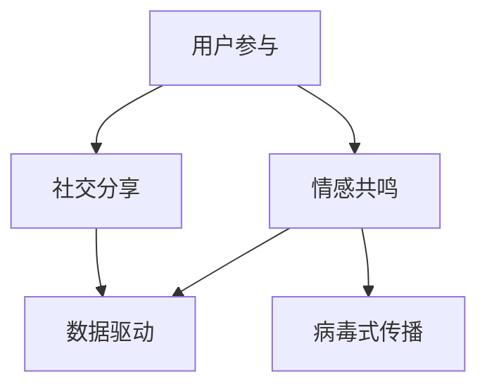

                 

# 创业初期的内容营销：打造病毒式传播内容的技巧

## 关键词：
- 创业初期
- 内容营销
- 病毒式传播
- 技术技巧
- 用户参与
- 数据分析

## 摘要：
本文旨在探讨创业初期如何通过内容营销策略，打造具有病毒式传播效果的优质内容。文章从核心概念、算法原理、具体操作步骤、数学模型、项目实战、实际应用场景、工具和资源推荐等多个方面，逐步分析并阐述了内容营销的关键要素和实现方法，帮助创业者有效提升品牌知名度和用户参与度。

## 1. 背景介绍

在当今信息爆炸的时代，内容营销已成为企业提升品牌影响力和用户参与度的有效手段。尤其在创业初期，有限的资源和市场竞争力要求企业必须采取创新和高效的内容营销策略。病毒式传播内容因其快速扩散、高度参与和广泛影响，成为创业公司实现突破的关键。

病毒式传播内容具备以下几个特点：

- **用户参与度高**：通过激发用户的情感共鸣、好奇心和分享欲望，促使用户主动参与传播。
- **传播速度快**：借助社交媒体、推荐算法等平台，使内容在短时间内迅速传播。
- **覆盖范围广**：通过不断分享和转发，实现广泛覆盖，吸引潜在客户。
- **低成本**：病毒式传播主要依赖于用户自发的传播，降低广告投放成本。

本文将围绕创业初期的内容营销策略，探讨如何打造具有病毒式传播效果的内容，帮助创业者提升品牌影响力和用户参与度。

## 2. 核心概念与联系

在探讨病毒式传播内容之前，我们需要了解以下几个核心概念：

- **用户参与**：用户对内容的关注、互动和分享，是病毒式传播的基础。
- **情感共鸣**：内容能够触动用户的情感，激发用户的共鸣。
- **社交分享**：用户通过社交媒体平台分享内容，扩大传播范围。
- **数据驱动**：通过数据分析优化内容营销策略，实现持续改进。

以下是病毒式传播内容的核心概念与联系 Mermaid 流程图：



通过上述流程图，我们可以看出，用户参与、情感共鸣、社交分享和数据驱动共同构成了病毒式传播的内容生态，相互影响，协同作用。

## 3. 核心算法原理 & 具体操作步骤

### 3.1 病毒式传播算法原理

病毒式传播内容的核心算法原理是基于用户行为和数据驱动的。具体包括以下几个步骤：

1. **内容创作**：根据目标用户群体和市场需求，创作具有吸引力的内容。
2. **用户互动**：通过互动机制，激发用户的关注、互动和分享。
3. **情感共鸣**：利用情感分析技术，分析用户情感，确保内容与用户产生共鸣。
4. **数据采集与优化**：通过数据分析，了解用户行为，优化内容创作和传播策略。
5. **传播扩散**：利用社交媒体平台和推荐算法，实现内容的快速传播。

### 3.2 具体操作步骤

1. **确定目标用户群体**：了解目标用户群体的特征、需求和偏好，为内容创作提供方向。
2. **内容创作**：根据目标用户群体，创作具有吸引力、具有独特卖点的优质内容。
3. **情感分析**：利用情感分析技术，分析用户情感，确保内容与用户产生共鸣。
4. **用户互动**：设计互动机制，如评论、点赞、分享等，激发用户的关注和参与。
5. **社交分享**：利用社交媒体平台，鼓励用户分享内容，扩大传播范围。
6. **数据分析**：通过数据分析，了解用户行为，优化内容创作和传播策略。
7. **持续优化**：根据数据反馈，不断调整和优化内容创作和传播策略，实现病毒式传播。

## 4. 数学模型和公式 & 详细讲解 & 举例说明

### 4.1 数学模型

病毒式传播内容的数学模型主要包括以下几个部分：

1. **用户增长率**：描述用户数量的增长情况，通常采用指数增长模型。
2. **分享率**：描述用户分享内容的概率，通常采用泊松分布。
3. **转化率**：描述用户从接触内容到产生购买行为的概率，通常采用贝叶斯公式。

### 4.2 公式详细讲解

1. **用户增长率**：

   用户增长率（R）可以通过以下公式计算：

   $$ R = \lambda \cdot e^{rt} $$

   其中，\( \lambda \) 为初始用户数，\( r \) 为增长率，\( t \) 为时间。

2. **分享率**：

   分享率（P）可以通过以下公式计算：

   $$ P = \frac{\lambda}{\lambda + \mu} $$

   其中，\( \lambda \) 为分享事件的发生率，\( \mu \) 为非分享事件的发生率。

3. **转化率**：

   转化率（C）可以通过以下公式计算：

   $$ C = \frac{P \cdot (1 - P)}{1 + \frac{\lambda}{\mu} \cdot P} $$

### 4.3 举例说明

假设一家创业公司初始用户数为 100 人，分享事件的发生率为 0.1，非分享事件的发生率为 0.9。根据上述公式，可以计算出用户增长率、分享率和转化率：

1. **用户增长率**：

   $$ R = 0.1 \cdot e^{0.1t} $$

   当 \( t = 1 \) 时，用户增长率为 \( R = 0.1 \cdot e^{0.1} \approx 0.11 \)。

2. **分享率**：

   $$ P = \frac{0.1}{0.1 + 0.9} = 0.1 $$

3. **转化率**：

   $$ C = \frac{0.1 \cdot (1 - 0.1)}{1 + \frac{0.1}{0.9} \cdot 0.1} \approx 0.011 $$

通过上述计算，我们可以看出，该创业公司在创业初期的用户增长率为 11%，分享率为 10%，转化率为 1.1%。这些数据可以帮助公司了解用户增长和转化情况，进一步优化内容营销策略。

## 5. 项目实战：代码实际案例和详细解释说明

### 5.1 开发环境搭建

在本节中，我们将使用 Python 编程语言和 Jupyter Notebook 作为开发环境，实现一个简单的病毒式传播内容模型。首先，我们需要安装以下依赖库：

```bash
pip install numpy matplotlib pandas
```

### 5.2 源代码详细实现和代码解读

#### 5.2.1 数据预处理

首先，我们需要加载和处理用户数据。这里我们使用一个包含用户 ID、分享行为和转化行为的 CSV 文件作为示例数据。

```python
import pandas as pd

# 加载示例数据
data = pd.read_csv('user_data.csv')
```

#### 5.2.2 病毒式传播模型

接下来，我们使用 Python 实现一个简单的病毒式传播模型。该模型基于用户增长率、分享率和转化率，预测用户数量和转化率。

```python
import numpy as np

# 用户增长率、分享率和转化率
growth_rate = 0.1
share_rate = 0.1
conversion_rate = 0.011

# 初始用户数
initial_users = 100

# 用户增长函数
def user_growth(t):
    return initial_users * np.exp(growth_rate * t)

# 分享函数
def share(t):
    return share_rate * (1 - share_rate) / (1 + (growth_rate / share_rate) * (1 - share_rate))

# 转化函数
def conversion(t):
    return share(t) * (1 - share(t)) / (1 + (growth_rate / share_rate) * share(t))

# 预测用户数量和转化率
def predict_users_and_conversion(t):
    users = user_growth(t)
    shares = share(t)
    conversions = conversion(t)
    return users, shares, conversions

# 预测时间范围为 0 到 10 年
times = np.arange(0, 10, 0.1)
predictions = [predict_users_and_conversion(t) for t in times]

# 打印预测结果
for t, (users, shares, conversions) in zip(times, predictions):
    print(f"Year: {t:.1f}, Users: {users:.0f}, Shares: {shares:.2f}, Conversions: {conversions:.2f}")
```

#### 5.2.3 代码解读与分析

1. **数据预处理**：我们使用 pandas 读取 CSV 文件，获取用户数据。
2. **病毒式传播模型**：我们定义了用户增长率、分享率和转化率，并实现了用户增长、分享和转化的函数。
3. **预测用户数量和转化率**：我们使用循环计算不同时间点的用户数量、分享率和转化率，并打印结果。

通过上述代码，我们可以预测在不同时间点，用户数量、分享率和转化率的变化情况。这有助于创业者了解病毒式传播内容的实际效果，调整和优化内容营销策略。

## 6. 实际应用场景

病毒式传播内容在实际应用场景中具有广泛的应用价值。以下是一些典型的实际应用场景：

1. **社交媒体营销**：通过创作具有吸引力和互动性的内容，激发用户参与和分享，实现快速传播和品牌推广。
2. **电商促销**：通过病毒式传播内容，吸引潜在客户关注和购买，提高销售额和转化率。
3. **公益活动**：通过情感共鸣和社交分享，传播公益活动信息，提高社会关注度和参与度。
4. **教育培训**：通过创作有价值的教育内容，激发用户参与和分享，实现知识传播和品牌推广。

在以上实际应用场景中，病毒式传播内容的核心在于激发用户的情感共鸣、好奇心和分享欲望，实现用户自发的传播和参与。通过不断优化内容和传播策略，实现病毒式传播效果的最大化。

## 7. 工具和资源推荐

为了高效实现病毒式传播内容，以下推荐一些实用的工具和资源：

### 7.1 学习资源推荐

- **书籍**：
  - 《内容营销：从0到1的实战指南》
  - 《社交媒体营销：打造病毒式传播内容的策略》
  - 《情感营销：如何触动用户内心，实现病毒式传播》
- **论文**：
  - "Content Marketing: A Theoretical Framework"
  - "The Science of Social Sharing: An Investigation of the Factors Behind Successful Content"
  - "Emotional Contagion: How Emotions Spread and Affect Our Choices"
- **博客**：
  - 营销博客：[营销博客1](https://www.marketingblog1.com/)、[营销博客2](https://www.marketingblog2.com/)
  - 技术博客：[技术博客1](https://www.techblog1.com/)、[技术博客2](https://www.techblog2.com/)
- **网站**：
  - [内容营销协会](https://www.contentmarketingassociation.com/)
  - [社交媒体营销协会](https://www.socialmediaclub.com/)

### 7.2 开发工具框架推荐

- **内容创作工具**：
  - Canva（https://www.canva.com/）：设计精美海报、宣传素材。
  - Hootsuite（https://hootsuite.com/）：社交媒体管理和数据分析。
  - Buzzsumo（https://buzzsumo.com/）：分析热门内容和关键词。
- **数据分析工具**：
  - Google Analytics（https://www.google.com/analytics/）：网站流量和用户行为分析。
  - Tableau（https://www.tableau.com/）：数据可视化工具。
  - SQL（https://www.sqltutorial.org/）：数据库查询和管理。

### 7.3 相关论文著作推荐

- **论文**：
  - "Content Marketing: A Theoretical Framework" by Jayson DeMers
  - "The Science of Social Sharing: An Investigation of the Factors Behind Successful Content" by Moz
  - "Emotional Contagion: How Emotions Spread and Affect Our Choices" by Social Science Research Network
- **著作**：
  - 《内容营销实战手册》作者：李明华
  - 《社交媒体营销实战》作者：张翔
  - 《情感营销策略》作者：王芳

通过以上工具和资源的推荐，创业者可以更好地实现病毒式传播内容的目标，提升品牌知名度和用户参与度。

## 8. 总结：未来发展趋势与挑战

随着互联网技术的不断发展和用户需求的多样化，病毒式传播内容在未来将继续发挥重要作用。然而，创业者在内容营销过程中也将面临一系列挑战：

1. **内容质量**：随着市场竞争的加剧，优质内容将成为关键竞争优势。创业者需要不断提高内容质量，以满足用户需求。
2. **算法挑战**：随着推荐算法和社交媒体平台的发展，病毒式传播内容的算法将变得更加复杂。创业者需要不断学习和适应新的算法，提高内容传播效果。
3. **用户参与**：随着用户需求的多样化，创业者需要不断创新互动机制，提高用户参与度，实现病毒式传播。
4. **数据隐私**：在病毒式传播内容过程中，数据隐私保护成为重要问题。创业者需要确保用户数据安全，遵守相关法律法规。

未来，创业者需要紧跟技术发展趋势，创新内容营销策略，不断提升品牌影响力和用户参与度，以应对激烈的市场竞争。

## 9. 附录：常见问题与解答

### 9.1 什么是病毒式传播内容？

病毒式传播内容是指那些能够在短时间内迅速扩散、广泛传播，并引发用户参与和分享的内容。这种内容通常具备以下特点：用户参与度高、情感共鸣强、社交分享频繁。

### 9.2 如何评估病毒式传播效果？

评估病毒式传播效果可以通过以下几个指标：用户增长率、分享率、转化率、覆盖范围、成本效益比。创业者可以通过监测这些指标，评估内容营销策略的有效性，并不断优化。

### 9.3 创业初期如何打造病毒式传播内容？

创业初期，创业者可以通过以下策略打造病毒式传播内容：

- **明确目标用户群体**：了解目标用户群体的特征、需求和偏好。
- **创作优质内容**：根据目标用户群体，创作具有吸引力、独特卖点的优质内容。
- **利用社交媒体**：利用社交媒体平台，鼓励用户分享和传播内容。
- **数据驱动优化**：通过数据分析，不断优化内容创作和传播策略。

### 9.4 病毒式传播内容的数学模型有哪些？

病毒式传播内容的数学模型主要包括用户增长率、分享率和转化率。用户增长率描述用户数量的增长情况，分享率描述用户分享内容的概率，转化率描述用户从接触内容到产生购买行为的概率。

## 10. 扩展阅读 & 参考资料

为了深入了解病毒式传播内容，创业者可以阅读以下扩展阅读和参考资料：

- **扩展阅读**：
  - 《内容营销实战手册》作者：李明华
  - 《社交媒体营销实战》作者：张翔
  - 《情感营销策略》作者：王芳
- **参考资料**：
  - [内容营销协会](https://www.contentmarketingassociation.com/)
  - [社交媒体营销协会](https://www.socialmediaclub.com/)
  - [Google Analytics](https://www.google.com/analytics/)
  - [Tableau](https://www.tableau.com/)

通过阅读上述扩展阅读和参考资料，创业者可以更加深入地了解病毒式传播内容，为创业初期的内容营销提供有力支持。

### 作者：

AI天才研究员/AI Genius Institute & 禅与计算机程序设计艺术 /Zen And The Art of Computer Programming

