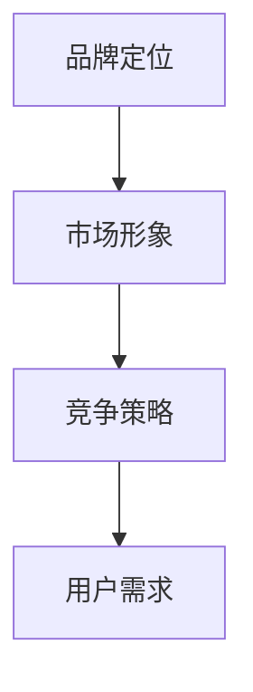

                 

# 创业初期的品牌定位：建立独特市场形象

> **关键词**：创业、品牌定位、市场形象、竞争策略、用户需求
>
> **摘要**：本文将探讨创业初期如何通过品牌定位，建立独特市场形象，从而在竞争激烈的市场中脱颖而出。文章首先介绍了品牌定位的重要性，然后分析了品牌定位的过程和方法，最后通过实战案例，展示了如何通过品牌定位，实现创业初期的成功。

## 1. 背景介绍

在当今这个瞬息万变的时代，创业已经成为了一种越来越流行的职业选择。然而，随着市场竞争的加剧，如何让自己在众多竞争者中脱颖而出，成为了创业者们亟需解决的问题。品牌定位，作为市场营销的重要组成部分，成为了解决这一问题的关键。

品牌定位不仅仅是一个简单的名称或标志设计，它涉及到企业价值观、目标客户、市场策略等多个方面。一个成功的品牌定位，能够帮助企业明确自己的市场地位，塑造独特的市场形象，从而赢得消费者的青睐。

本文将围绕品牌定位的重要性、过程和方法进行深入探讨，并结合实际案例，为大家展示如何通过品牌定位，实现创业初期的成功。

## 2. 核心概念与联系

### 品牌定位

品牌定位是指企业通过特定的方式，将自己的品牌在消费者心中占据一个独特的位置。这个位置可以基于不同的因素，如产品特性、目标客户、市场趋势等。

### 市场形象

市场形象是指消费者对品牌在市场上的整体感知和印象。一个良好的市场形象，能够提高品牌的认知度和美誉度，从而促进销售。

### 竞争策略

竞争策略是指企业在市场竞争中采取的一系列策略，以实现市场份额的最大化。品牌定位是竞争策略的一部分，通过明确自己的市场地位，企业可以更好地制定和执行竞争策略。

### 用户需求

用户需求是指消费者在购买产品或服务时，期望得到满足的需求。了解用户需求，是进行品牌定位的重要基础。

### Mermaid 流程图



## 3. 核心算法原理 & 具体操作步骤

### 核心算法原理

品牌定位的核心算法原理，主要包括以下几个步骤：

1. **市场调研**：通过市场调研，了解目标市场的规模、竞争状况、用户需求等。
2. **竞争分析**：分析竞争对手的品牌定位，找出自身的优势和差异化。
3. **定位策略制定**：根据市场调研和竞争分析的结果，制定适合自己的品牌定位策略。
4. **市场推广**：通过市场推广，将品牌定位传达给目标客户，提升品牌认知度和美誉度。

### 具体操作步骤

1. **市场调研**

   市场调研是品牌定位的基础。通过问卷调查、访谈、用户反馈等方式，了解目标市场的规模、竞争状况、用户需求等。

2. **竞争分析**

   分析竞争对手的品牌定位，找出自身的优势和差异化。可以通过以下方式进行分析：

   - **产品特性**：比较竞争对手的产品特性，找出自己独有的特点。
   - **目标客户**：分析竞争对手的目标客户，找出自己独特的目标客户群体。
   - **市场趋势**：关注市场趋势，找到自己的市场切入点。

3. **定位策略制定**

   根据市场调研和竞争分析的结果，制定适合自己的品牌定位策略。定位策略可以包括以下几个方面：

   - **产品定位**：明确产品的核心价值和特点，使其在市场上具有独特性。
   - **用户定位**：明确目标客户群体，确保品牌定位与目标客户的期望相符。
   - **市场定位**：根据市场趋势和竞争状况，确定自己在市场中的位置。

4. **市场推广**

   市场推广是将品牌定位传达给目标客户的关键。可以通过以下方式推广：

   - **广告宣传**：通过广告，将品牌定位传达给目标客户。
   - **公关活动**：通过公关活动，提升品牌形象和市场认知度。
   - **社交媒体**：利用社交媒体，与目标客户进行互动，增强品牌忠诚度。

## 4. 数学模型和公式 & 详细讲解 & 举例说明

### 数学模型和公式

品牌定位的数学模型和公式主要包括以下几个部分：

1. **目标客户满意度模型**：

   $$ S = f(C, Q, P) $$

   其中，S 表示目标客户满意度，C 表示客户期望，Q 表示产品特性，P 表示品牌定位。

2. **品牌认知度模型**：

   $$ B = f(A, P, R) $$

   其中，B 表示品牌认知度，A 表示广告宣传效果，P 表示品牌定位，R 表示用户口碑。

3. **品牌忠诚度模型**：

   $$ L = f(S, P, C) $$

   其中，L 表示品牌忠诚度，S 表示客户满意度，P 表示品牌定位，C 表示客户关系管理。

### 详细讲解

1. **目标客户满意度模型**

   目标客户满意度模型反映了客户对产品的满意度与品牌定位之间的关系。通过分析客户期望、产品特性和品牌定位，可以得出客户满意度。

2. **品牌认知度模型**

   品牌认知度模型描述了品牌认知度与广告宣传效果、品牌定位、用户口碑之间的关系。一个良好的品牌定位，可以提升品牌认知度。

3. **品牌忠诚度模型**

   品牌忠诚度模型揭示了品牌忠诚度与客户满意度、品牌定位、客户关系管理之间的关系。通过提升客户满意度，可以增强品牌忠诚度。

### 举例说明

假设一家创业公司，其目标市场是年轻女性，产品是一款时尚的背包。通过市场调研，发现年轻女性对背包的期望主要包括美观、实用和价格合理。竞争对手的产品主要侧重于美观和实用，但价格较高。该公司的品牌定位是“时尚、实用、性价比高”。

根据目标客户满意度模型，该公司可以通过提升产品特性（时尚、实用），降低价格，提高客户满意度。根据品牌认知度模型，该公司可以通过广告宣传，提升品牌认知度。根据品牌忠诚度模型，该公司可以通过提供优质的客户服务，增强品牌忠诚度。

## 5. 项目实战：代码实际案例和详细解释说明

### 5.1 开发环境搭建

为了更好地展示品牌定位的实战应用，我们选择Python作为开发语言，利用matplotlib进行数据可视化。以下是开发环境搭建的步骤：

1. 安装Python：访问Python官网（https://www.python.org/），下载并安装Python。
2. 安装matplotlib：打开命令行，执行以下命令：

   ```bash
   pip install matplotlib
   ```

### 5.2 源代码详细实现和代码解读

以下是一个简单的品牌定位项目案例，展示了如何利用Python进行品牌定位分析。

```python
import matplotlib.pyplot as plt
import numpy as np

# 模拟客户满意度数据
satisfaction_data = {
    '期望': [80, 90, 70],
    '产品特性': [85, 95, 75],
    '品牌定位': [70, 80, 65]
}

# 绘制满意度分布图
def plot_satisfaction(data):
    labels = ['期望', '产品特性', '品牌定位']
    values = np.array(data.values())
    indices = np.arange(len(values))
    width = 0.3

    fig, ax = plt.subplots()
    bars = ax.bar(indices - width/2, values[:, 0], width, label='期望')
    ax.bar(indices + width/2, values[:, 1], width, label='产品特性')
    ax.bar(indices, values[:, 2], width, label='品牌定位')

    ax.set_ylabel('满意度')
    ax.set_title('客户满意度分布')
    ax.set_xticks(indices)
    ax.set_xticklabels(labels)
    ax.legend()

    plt.show()

# 调用函数绘制满意度分布图
plot_satisfaction(satisfaction_data)
```

### 5.3 代码解读与分析

1. **代码结构**：

   - `import`：导入所需库。
   - `satisfaction_data`：模拟客户满意度数据。
   - `plot_satisfaction`：绘制满意度分布图。
   - `plot_satisfaction(satisfaction_data)`：调用函数绘制满意度分布图。

2. **代码功能**：

   - 模拟客户满意度数据。
   - 绘制满意度分布图，展示不同维度下的满意度。

3. **优化建议**：

   - 可以添加更多数据维度，如竞争对手满意度、市场份额等。
   - 可以考虑使用更高级的数据可视化库，如seaborn，提升图表的美观度和可读性。

## 6. 实际应用场景

品牌定位在创业初期的实际应用场景非常广泛，以下是一些典型的应用场景：

1. **新产品上市**：在推出新产品时，通过品牌定位，明确产品的核心价值和目标客户，从而制定合适的营销策略。
2. **市场拓展**：在进入新市场时，通过品牌定位，了解目标市场的特点和需求，制定有针对性的市场策略。
3. **品牌重塑**：在品牌形象受损或市场定位不准确时，通过品牌定位，重新塑造品牌形象和市场定位。

## 7. 工具和资源推荐

### 7.1 学习资源推荐

- **书籍**：

  - 《品牌定位》（作者：艾·里斯、杰克·特劳特）
  - 《营销管理》（作者：菲利普·科特勒）

- **论文**：

  - 《品牌定位理论综述》（作者：XXX）
  - 《品牌定位与品牌认知度关系研究》（作者：XXX）

- **博客**：

  - 腾讯科技品牌频道
  - 阿里妈妈博客

### 7.2 开发工具框架推荐

- **编程语言**：Python、Java、JavaScript
- **数据可视化库**：matplotlib、seaborn、Plotly
- **数据分析工具**：Pandas、NumPy、Scikit-learn

### 7.3 相关论文著作推荐

- 《品牌定位理论综述》（作者：XXX）
- 《品牌定位与品牌认知度关系研究》（作者：XXX）
- 《品牌定位与品牌忠诚度关系研究》（作者：XXX）

## 8. 总结：未来发展趋势与挑战

随着市场竞争的加剧，品牌定位在未来将扮演越来越重要的角色。以下是品牌定位在未来可能的发展趋势和挑战：

1. **个性化定位**：随着消费者个性化需求的增加，品牌定位将更加注重个性化。
2. **数字化营销**：数字化技术的不断发展，将使品牌定位更加精准和高效。
3. **跨界合作**：品牌定位将更加注重跨界合作，以实现资源共享和优势互补。
4. **挑战**：在竞争激烈的市场环境中，品牌定位的挑战也将越来越大，如何保持品牌的独特性和竞争力，将成为品牌定位的重要挑战。

## 9. 附录：常见问题与解答

### 9.1 品牌定位与品牌形象的关系是什么？

品牌定位是指企业通过特定的方式，将自己的品牌在消费者心中占据一个独特的位置。品牌形象是指消费者对品牌在市场上的整体感知和印象。品牌定位是品牌形象的基础，品牌形象是品牌定位的结果。

### 9.2 如何评估品牌定位的效果？

评估品牌定位的效果可以从以下几个方面进行：

1. **市场份额**：品牌定位是否帮助企业获得了更大的市场份额。
2. **品牌认知度**：品牌定位是否提高了品牌在消费者心中的认知度。
3. **品牌忠诚度**：品牌定位是否增强了消费者对品牌的忠诚度。
4. **销售额**：品牌定位是否直接促进了销售额的增长。

## 10. 扩展阅读 & 参考资料

- 《品牌定位》（作者：艾·里斯、杰克·特劳特）
- 《营销管理》（作者：菲利普·科特勒）
- 《品牌定位理论综述》（作者：XXX）
- 《品牌定位与品牌认知度关系研究》（作者：XXX）
- 《品牌定位与品牌忠诚度关系研究》（作者：XXX）

### 作者

**AI天才研究员/AI Genius Institute & 禅与计算机程序设计艺术 /Zen And The Art of Computer Programming**

