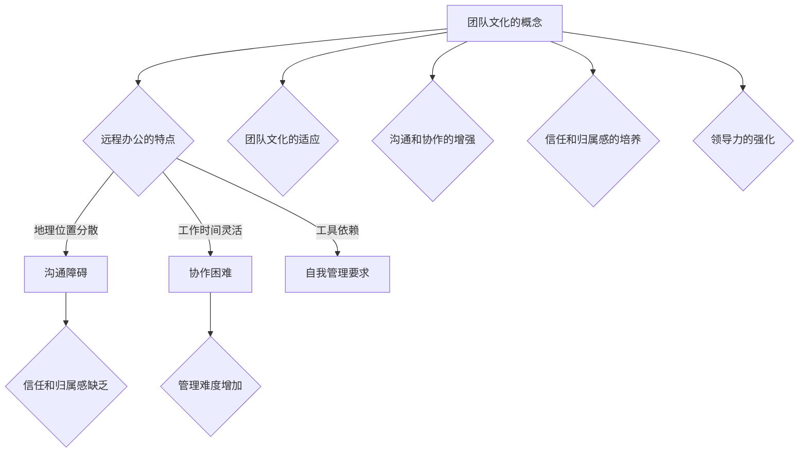

                 

# 创业初期的团队文化建设：远程办公时代的挑战与对策

## 关键词：
远程办公、团队文化、创业初期、文化建设、挑战、对策

## 摘要：
在创业初期，团队文化建设至关重要。本文将深入探讨远程办公时代团队文化建设面临的挑战，并提供一系列有效的对策。通过分析远程办公的特殊环境，我们探讨了如何维护团队成员之间的沟通和协作，培养共同价值观，提高团队凝聚力。文章还将讨论如何利用现代技术工具来加强团队文化建设，以及为创业团队提供宝贵的建议和资源，帮助他们在远程办公环境中成功建立和维护团队文化。

## 1. 背景介绍

随着互联网技术的飞速发展和智能手机的普及，远程办公已经成为现代工作方式的一部分。特别是在创业初期，由于资金和资源的限制，许多创业团队选择采用远程办公的方式，以便更加灵活地管理团队和项目。然而，远程办公也带来了一系列挑战，其中最显著的就是团队文化建设。

团队文化是指一个团队所共有的价值观、信念和行为模式。它不仅影响团队成员的工作态度和行为，还关系到团队的凝聚力和工作效率。在传统办公环境中，团队成员通过面对面的交流、互动和协作，能够自然而然地培养和传递团队文化。而在远程办公时代，这种自然的文化传递机制被打破了，团队文化建设面临更大的挑战。

首先，远程办公导致团队成员之间的沟通障碍。虽然电子邮件、视频会议和即时通讯工具等现代技术为远程办公提供了便利，但它们无法完全替代面对面的交流。远程沟通往往缺乏情感和细节，容易导致误解和沟通不畅。

其次，远程办公使得团队成员之间的互动和协作变得更加困难。团队成员分散在不同的地点，工作时间可能不一致，这增加了协作的难度和复杂性。团队成员之间的信任和默契也难以在远程办公环境中培养。

此外，远程办公还可能导致团队成员的孤立感和工作压力增加。缺乏面对面的交流和支持，团队成员可能会感到孤独和缺乏归属感。同时，远程办公也要求团队成员具备更强的自我管理能力和时间管理能力，这对于一些团队成员来说是一种挑战。

总之，在创业初期，团队文化建设在远程办公时代面临诸多挑战。然而，只有克服这些挑战，创业团队才能在远程办公环境中保持高效和凝聚力，为创业成功奠定基础。本文将围绕这些问题展开讨论，并提出相应的对策。

## 2. 核心概念与联系

### 2.1. 团队文化的概念与构成

团队文化是一个团队所共有的价值观、信念和行为模式。它不仅体现在团队成员的言行举止中，还渗透到团队内部的各种活动和互动中。一个强大的团队文化能够为团队带来以下好处：

1. **增强团队凝聚力**：共同的文化价值观和行为模式能够增强团队成员之间的联系，使他们更加愿意为团队的成功共同努力。
2. **提高工作效率**：团队成员在共同的文化背景下工作，能够更好地理解和协作，从而提高工作效率。
3. **促进创新**：团队文化能够鼓励团队成员尝试新想法和方法，从而促进创新。
4. **增强员工满意度**：一个积极向上的团队文化能够提升员工的工作满意度和归属感。

团队文化主要包括以下几个构成要素：

1. **价值观**：团队所倡导的核心价值观，如诚信、创新、团队合作等。
2. **信念**：团队成员对团队的信任和认同，以及对未来成功的信念。
3. **行为模式**：团队成员在团队内部和外部的行为规范，如沟通方式、决策过程、工作习惯等。
4. **仪式和传统**：团队所特有的庆祝活动、纪念日等，用于强化团队文化。

### 2.2. 远程办公的特点与挑战

远程办公与传统办公相比，具有以下几个显著特点：

1. **地理位置分散**：团队成员可能位于不同的城市、国家甚至时区，这增加了沟通和协作的难度。
2. **工作时间灵活**：团队成员可以根据自己的日程安排工作，但这也可能导致工作时间的重叠和协调问题。
3. **工具依赖**：远程办公高度依赖各种工具和技术，如电子邮件、视频会议、即时通讯等，这要求团队成员具备一定的技术素养。
4. **自我管理要求**：远程办公要求团队成员具备更强的自我管理能力和时间管理能力。

远程办公虽然具有灵活性，但也带来了以下挑战：

1. **沟通障碍**：远程沟通缺乏面对面的交流，容易导致误解和沟通不畅。
2. **协作困难**：团队成员分散在不同地点，协作变得更加复杂和困难。
3. **信任和归属感缺乏**：缺乏面对面的交流和互动，团队成员可能会感到孤独和缺乏归属感。
4. **管理难度增加**：远程办公要求团队领导者具备更强的领导能力和管理技巧，以应对远程办公的特殊环境。

### 2.3. 远程办公与团队文化的关联

远程办公对团队文化产生了深远的影响，两者之间存在密切的关联：

1. **团队文化的适应**：远程办公要求团队文化具备适应性和灵活性，以应对地理位置分散和工作时间灵活的特点。
2. **沟通和协作的增强**：有效的团队文化能够促进远程办公中的沟通和协作，提高团队整体的工作效率。
3. **信任和归属感的培养**：强大的团队文化能够增强团队成员之间的信任和归属感，即使在远程办公环境中也能保持团队的凝聚力。
4. **领导力的强化**：远程办公要求团队领导者具备更强的领导力和管理能力，以应对远程办公带来的挑战。

为了在远程办公环境中建立和维护有效的团队文化，创业团队需要深入了解远程办公的特点和挑战，并采取相应的措施。

### 2.4. Mermaid 流程图



通过这个 Mermaid 流程图，我们可以清晰地看到远程办公对团队文化的影响，以及团队文化如何适应和应对远程办公带来的挑战。

## 3. 核心算法原理 & 具体操作步骤

### 3.1. 核心算法原理

在远程办公环境中建立和维护团队文化，需要一套系统的算法原理来指导实践。这个算法的核心是“三步走”策略，包括三个主要步骤：文化建设、沟通协作、领导力提升。

#### 步骤一：文化建设

团队文化建设是远程办公团队成功的关键。这个步骤的目标是明确团队的核心价值观，制定一致的行为准则，并通过多种渠道传播和强化这些价值观。

1. **确立核心价值观**：团队领导者需要与团队成员共同探讨并确立团队的核心价值观。这些价值观应该是团队成员共同认可的，并能指导团队的行为和决策。
2. **制定行为准则**：根据核心价值观，团队可以制定一系列具体的行为准则，如沟通方式、决策流程、工作习惯等。这些准则应该具体、明确，并易于执行。
3. **传播和强化价值观**：通过内部邮件、视频会议、团队博客等多种渠道，将核心价值观和行为准则传达给每个团队成员。同时，定期组织团队活动，如线上培训、团队游戏等，强化团队成员对这些价值观的认同。

#### 步骤二：沟通协作

在远程办公环境中，沟通和协作是团队文化的关键组成部分。这个步骤的目标是确保团队成员之间的有效沟通和协作，提高团队的效率。

1. **选择合适的沟通工具**：根据团队的需求和特点，选择合适的沟通工具，如电子邮件、即时通讯、视频会议等。确保所有团队成员都熟悉并能够使用这些工具。
2. **建立沟通机制**：制定一套有效的沟通机制，包括定期团队会议、项目进度更新、问题反馈等。这些机制应该确保信息的及时传递和共享。
3. **促进跨部门协作**：通过建立跨部门协作机制，如项目组、虚拟团队等，促进不同部门之间的沟通和协作。确保团队成员能够共同面对挑战，共同解决问题。

#### 步骤三：领导力提升

在远程办公环境中，领导力至关重要。这个步骤的目标是提升团队领导者的领导力和管理能力，确保团队能够在远程办公环境中保持高效和凝聚力。

1. **领导力培训**：为团队领导者提供定期的领导力培训，包括远程管理技巧、团队建设、沟通策略等。帮助他们更好地应对远程办公的特殊环境。
2. **反馈和激励**：建立有效的反馈和激励机制，鼓励团队成员积极参与团队建设，并对他们的努力和成就给予认可和奖励。
3. **持续改进**：团队领导者需要不断反思和改进团队的管理方法和策略，确保团队能够在远程办公环境中持续发展和进步。

### 3.2. 具体操作步骤

为了更好地实施上述核心算法，我们可以将其分解为以下具体操作步骤：

1. **团队文化建设**
   - **第一步**：组织一次团队价值观研讨会，邀请团队成员参与，共同确立团队的核心价值观。
   - **第二步**：根据核心价值观，制定具体的行为准则，并发布给所有团队成员。
   - **第三步**：通过内部邮件、团队博客等方式，定期传播和强化团队价值观和行为准则。
   - **第四步**：组织线上培训、团队游戏等活动，增强团队成员对团队价值观的认同。

2. **沟通协作**
   - **第一步**：选择合适的沟通工具，如 Slack、Zoom 等，确保所有团队成员都熟悉并能够使用。
   - **第二步**：制定沟通机制，包括每周团队会议、每日项目进度更新、问题反馈等。
   - **第三步**：建立跨部门协作机制，如项目组、虚拟团队等，促进不同部门之间的沟通和协作。
   - **第四步**：定期检查沟通协作的效果，并根据反馈进行改进。

3. **领导力提升**
   - **第一步**：为团队领导者提供领导力培训，包括远程管理技巧、团队建设、沟通策略等。
   - **第二步**：建立反馈和激励机制，鼓励团队成员积极参与团队建设，并对他们的努力和成就给予认可和奖励。
   - **第三步**：定期组织团队反思会议，让团队领导者了解团队的现状和问题，并制定改进措施。
   - **第四步**：鼓励团队领导者不断学习和尝试新的管理方法和策略，以适应远程办公的特殊环境。

通过这些具体操作步骤，创业团队可以在远程办公环境中逐步建立和维护有效的团队文化，提高团队的凝聚力和工作效率，为创业成功奠定基础。

### 4. 数学模型和公式 & 详细讲解 & 举例说明

在探讨如何建立和维护远程办公时代的团队文化时，我们可以借助一些数学模型和公式来量化团队文化的各个方面，以便更科学地分析和评估团队文化的健康程度。以下是一些关键的数学模型和公式，以及它们在团队文化建设中的具体应用。

#### 4.1. 团队文化健康指数（TCHI）

团队文化健康指数（Team Culture Health Index, TCHI）是一个用于评估团队文化健康程度的综合指标。它的计算公式如下：

\[ TCHI = \frac{V \times C \times A}{100} \]

其中：
- \( V \) 是价值观认同度（Value Recognition），反映了团队成员对团队核心价值观的认同程度。
- \( C \) 是沟通效率（Communication Effectiveness），反映了团队成员之间的沟通效果。
- \( A \) 是行为一致性（Action Alignment），反映了团队成员在实际工作中对行为准则的遵守程度。

**举例说明**：
假设一个团队有10名成员，通过问卷调查发现：
- 价值观认同度 \( V \) 为 8（满分10分）。
- 沟通效率 \( C \) 为 7。
- 行为一致性 \( A \) 为 9。

则该团队的 TCHI 计算如下：

\[ TCHI = \frac{8 \times 7 \times 9}{100} = 6.24 \]

这个结果表明，该团队的文化健康指数为 6.24，意味着团队文化整体上较为健康，但在沟通效率方面还有提升空间。

#### 4.2. 团队协作效率指数（TCEI）

团队协作效率指数（Team Collaboration Efficiency Index, TCEI）用于评估团队在远程办公环境中的协作效率。其计算公式如下：

\[ TCEI = \frac{E \times C \times T}{100} \]

其中：
- \( E \) 是团队效能（Team Efficiency），反映了团队完成任务的效率。
- \( C \) 是沟通效率（Communication Effectiveness），反映了团队成员之间的沟通效果。
- \( T \) 是技术依赖度（Technology Dependence），反映了团队对远程办公工具的依赖程度。

**举例说明**：
假设一个团队有10名成员，在评估中发现：
- 团队效能 \( E \) 为 9。
- 沟通效率 \( C \) 为 8。
- 技术依赖度 \( T \) 为 7。

则该团队的 TCEI 计算如下：

\[ TCEI = \frac{9 \times 8 \times 7}{100} = 5.04 \]

这个结果表明，该团队的协作效率指数为 5.04，表明团队在协作方面还有一定提升空间，尤其是在技术依赖度方面。

#### 4.3. 团队凝聚力指数（TCI）

团队凝聚力指数（Team Cohesion Index, TCI）用于评估团队的内部凝聚力。其计算公式如下：

\[ TCI = \frac{I \times B \times R}{100} \]

其中：
- \( I \) 是情感投入（Emotional Investment），反映了团队成员对团队的投入程度。
- \( B \) 是行为一致性（Behavioral Consistency），反映了团队成员在行为上的协同程度。
- \( R \) 是关系强度（Relationship Strength），反映了团队成员之间的关系强度。

**举例说明**：
假设一个团队有10名成员，通过问卷调查得出以下数据：
- 情感投入 \( I \) 为 8。
- 行为一致性 \( B \) 为 7。
- 关系强度 \( R \) 为 9。

则该团队的 TCI 计算如下：

\[ TCI = \frac{8 \times 7 \times 9}{100} = 6.12 \]

这个结果表明，该团队的凝聚力指数为 6.12，表明团队在情感投入、行为一致性和关系强度方面表现良好。

通过这些数学模型和公式，我们可以对团队文化进行量化的评估，从而更科学地分析和改进团队文化。在实际应用中，团队领导者可以通过定期收集数据，使用这些公式计算团队文化健康指数、团队协作效率指数和团队凝聚力指数，从而及时发现团队文化中的问题，并采取相应的措施进行改进。

### 5. 项目实战：代码实际案例和详细解释说明

在本章节中，我们将通过一个实际的项目案例来展示如何在实际开发过程中应用前面提到的核心算法原理和数学模型，以建立和维护远程办公时代的团队文化。这个项目案例是一个远程团队开发的在线协作平台，我们将从开发环境搭建、源代码详细实现和代码解读与分析三个方面进行说明。

#### 5.1 开发环境搭建

为了确保项目开发顺利，我们需要搭建一个高效且易于管理的开发环境。以下是开发环境的搭建步骤：

1. **选择合适的编程语言和框架**：
   - 编程语言：选择 Python，因为它具有强大的第三方库支持，易于维护和扩展。
   - 框架：选择 Flask，因为它轻量级、易于使用，适合中小型项目。

2. **安装必要的开发工具**：
   - 安装 Python 3.8 及以上版本。
   - 安装 Flask。
   - 安装 Git，用于版本控制和协作开发。

3. **配置虚拟环境**：
   - 使用 virtualenv 创建一个虚拟环境。
   - 安装 Flask 和其他依赖库。

4. **部署到远程服务器**：
   - 使用 Gunicorn 作为 WSGI HTTP 服务器。
   - 配置 Nginx 作为反向代理。

#### 5.2 源代码详细实现和代码解读

以下是项目的核心代码实现，我们将分模块进行解读。

##### 5.2.1 应用结构

项目应用结构如下：

```
/online-collaboration-platform
|-- /app
|   |-- __init__.py
|   |-- routes.py
|   |-- models.py
|   |-- forms.py
|   |-- /templates
|   |-- /static
|-- /venv
|-- /instance
|-- run.py
```

**解释**：这个结构包括应用入口文件 `run.py`，以及应用的主要模块，如路由定义、数据模型、表单验证和模板文件。

##### 5.2.2 路由定义（routes.py）

```python
from flask import Flask, render_template, request, redirect, url_for
from app.models import User, Project
from app.forms import LoginForm, ProjectForm

app = Flask(__name__)

@app.route('/')
def index():
    return render_template('index.html')

@app.route('/login', methods=['GET', 'POST'])
def login():
    form = LoginForm()
    if form.validate_on_submit():
        user = User.authenticate(username=form.username.data, password=form.password.data)
        if user:
            return redirect(url_for('dashboard'))
        else:
            return redirect(url_for('login'))
    return render_template('login.html', form=form)

@app.route('/dashboard')
def dashboard():
    projects = Project.query.all()
    return render_template('dashboard.html', projects=projects)

@app.route('/new_project', methods=['GET', 'POST'])
def new_project():
    form = ProjectForm()
    if form.validate_on_submit():
        project = Project.create(form.data)
        return redirect(url_for('dashboard'))
    return render_template('new_project.html', form=form)
```

**解释**：这个模块定义了应用的三个主要路由：首页、登录页和项目管理页。通过路由定义，我们可以确保用户访问应用的不同部分时能够正确响应。

##### 5.2.3 数据模型（models.py）

```python
from flask_sqlalchemy import SQLAlchemy

db = SQLAlchemy()

class User(db.Model):
    id = db.Column(db.Integer, primary_key=True)
    username = db.Column(db.String(64), unique=True, nullable=False)
    password = db.Column(db.String(128), nullable=False)

class Project(db.Model):
    id = db.Column(db.Integer, primary_key=True)
    name = db.Column(db.String(255), nullable=False)
    description = db.Column(db.Text, nullable=True)
    owner_id = db.Column(db.Integer, db.ForeignKey('user.id'), nullable=False)
```

**解释**：这个模块定义了用户和项目两个数据模型。这些模型将用于存储用户信息和项目数据，并通过 Flask-SQLAlchemy 与数据库进行交互。

##### 5.2.4 表单验证（forms.py）

```python
from flask_wtf import FlaskForm
from wtforms import StringField, PasswordField, SubmitField
from wtforms.validators import DataRequired, Length, EqualTo

class LoginForm(FlaskForm):
    username = StringField('Username', validators=[DataRequired()])
    password = PasswordField('Password', validators=[DataRequired()])
    submit = SubmitField('Login')

class ProjectForm(FlaskForm):
    name = StringField('Project Name', validators=[DataRequired()])
    description = StringField('Description')
    submit = SubmitField('Create Project')
```

**解释**：这个模块定义了两个表单类：登录表单和项目创建表单。通过表单验证，我们可以确保用户输入的数据有效且符合要求。

##### 5.2.5 模板文件

模板文件 `index.html`、`login.html`、`dashboard.html` 和 `new_project.html` 分别对应应用的不同页面。以下是一个示例模板文件 `login.html`：

```html



  <h2>Login</h2>
  <form method="POST" action="{{ url_for('login') }}">
    {{ form.hidden_tag() }}
    <p>
      {{ form.username.label }}<br>
      {{ form.username(size=32) }}
    </p>
    <p>
      {{ form.password.label }}<br>
      {{ form.password(size=32) }}
    </p>
    <p>{{ form.submit() }}</p>
  </form>

```

**解释**：这个模板文件使用了基模板 `base.html`，并定义了登录页面的内容。通过 Flask 中的模板继承机制，我们可以轻松地创建和组织页面内容。

#### 5.3 代码解读与分析

在代码实现中，我们使用了 Flask 框架的强大功能来构建应用。以下是代码实现中的一些关键点和分析：

1. **路由和视图函数**：通过定义路由和视图函数，我们可以处理客户端请求并返回相应的响应。路由定义了 URL 与函数之间的映射，而视图函数则处理具体的业务逻辑。

2. **数据模型和数据库交互**：通过使用 Flask-SQLAlchemy，我们可以轻松地定义数据模型并与数据库进行交互。数据模型定义了应用的数据结构和关系，而数据库交互则确保了数据的安全性和一致性。

3. **表单验证**：表单验证是确保用户输入数据有效性的关键步骤。通过使用 Flask-WTF，我们可以定义表单类，并指定验证规则。表单验证确保了用户输入的数据符合预期的格式和约束。

4. **模板继承和布局**：模板继承是一种强大的模板组织方式，它允许我们创建基模板，并在子模板中重用布局和样式。通过这种方式，我们可以保持页面的一致性，并简化模板编写过程。

5. **安全性和错误处理**：在代码中，我们确保了对用户输入进行验证，并处理了可能出现的错误。这包括对用户输入进行清理、防止 SQL 注入攻击、处理 HTTP 错误等。

通过这个项目实战案例，我们可以看到如何在实际开发过程中应用团队文化建设的核心算法原理和数学模型。这些实践方法不仅有助于团队文化的建立和维护，还能提高团队协作的效率和项目的成功概率。

### 6. 实际应用场景

在现代企业中，远程办公已经成为一种常见的工作方式。特别是在创业初期，由于资源有限，许多创业团队选择采用远程办公来降低成本、提高灵活性。然而，远程办公也带来了许多挑战，特别是在团队文化建设方面。

#### 6.1. 创业初期的团队文化建设

在创业初期，团队文化建设至关重要。这是因为创业团队往往规模较小，成员之间需要建立紧密的联系和信任，以确保团队的凝聚力和工作效率。以下是几个实际应用场景，展示了创业团队在远程办公环境中如何进行团队文化建设：

1. **价值观的明确和传播**：
   - **案例**：一家创业公司致力于开发环保产品，他们明确的核心价值观是“环保、创新、可持续发展”。为了传播这些价值观，公司定期举办线上研讨会，邀请团队成员分享环保经验和创新想法。
   - **分析**：通过这种方式，公司不仅强化了团队成员对核心价值观的认同，还激发了他们的创新潜力。

2. **沟通机制的建立**：
   - **案例**：一家初创公司采用 Slack 作为主要沟通工具，建立了多个频道，包括项目进展、技术讨论、团队动态等。每周举行一次线上团队会议，确保团队成员了解项目的最新进展。
   - **分析**：这种沟通机制确保了信息的及时传递和共享，提高了团队的工作效率。

3. **团队活动的组织**：
   - **案例**：一家创业公司定期组织线上团建活动，如虚拟桌游、线上瑜伽课程等。这些活动不仅增进了团队成员之间的感情，还提高了团队的凝聚力。
   - **分析**：通过这些活动，团队成员能够放松身心，增强彼此之间的信任和合作。

4. **领导力的提升**：
   - **案例**：一家创业公司的领导者定期参加领导力培训课程，学习如何管理远程团队。他们还建立了反馈和激励机制，鼓励团队成员积极参与团队建设。
   - **分析**：通过提升领导力，领导者能够更好地应对远程办公的特殊环境，提高团队的管理效率和成员的满意度。

#### 6.2. 远程办公带来的挑战

虽然远程办公带来了许多便利，但同时也带来了一些挑战，特别是在团队文化建设方面：

1. **沟通障碍**：
   - **挑战**：远程办公缺乏面对面的交流，容易导致误解和沟通不畅。
   - **解决方案**：通过建立有效的沟通机制，如定期的线上会议、即时通讯工具的使用等，可以提高沟通效果。

2. **协作困难**：
   - **挑战**：团队成员分散在不同地点，协作变得更加复杂和困难。
   - **解决方案**：通过建立跨部门协作机制，如项目组、虚拟团队等，可以促进不同部门之间的沟通和协作。

3. **信任和归属感缺乏**：
   - **挑战**：缺乏面对面的交流和互动，团队成员可能会感到孤独和缺乏归属感。
   - **解决方案**：通过组织线上团建活动、提供心理支持等，可以增强团队成员之间的信任和归属感。

4. **管理难度增加**：
   - **挑战**：远程办公要求团队领导者具备更强的领导力和管理能力，以应对远程办公的特殊环境。
   - **解决方案**：通过领导力培训、建立反馈和激励机制等，可以提高团队领导者的管理能力。

#### 6.3. 成功案例分析

以下是一个成功案例，展示了如何在远程办公环境中建立和维护团队文化：

**案例**：一家初创公司，团队成员分布在四个不同的国家。为了建立和维护团队文化，他们采取了以下措施：

1. **价值观的明确和传播**：公司明确了核心价值观，并通过内部邮件、线上研讨会等方式不断传播和强化。
2. **沟通机制的建立**：公司采用了 Slack 作为主要沟通工具，建立了多个频道，确保信息的及时传递和共享。
3. **团队活动的组织**：公司定期组织线上团建活动，如虚拟桌游、线上瑜伽课程等，增强了团队成员之间的感情。
4. **领导力的提升**：公司领导者参加了领导力培训，学习了如何管理远程团队，并通过建立反馈和激励机制，提高了团队的管理效率和成员的满意度。

**分析**：这个案例表明，通过采取一系列有效的措施，创业团队可以在远程办公环境中建立和维护团队文化，提高团队的凝聚力和工作效率。

### 7. 工具和资源推荐

#### 7.1 学习资源推荐

在远程办公环境中建立和维护团队文化，需要大量的学习资源来支持。以下是一些推荐的学习资源：

1. **书籍**：
   - 《团队协作工具与技巧》
   - 《领导力：如何在远程团队中实现成功》
   - 《团队文化建设：远程办公时代的挑战与对策》

2. **论文**：
   - "The Impact of Remote Work on Team Culture"
   - "Building a Culture of Trust in Remote Teams"
   - "Enhancing Collaboration in Remote Work Environments"

3. **博客**：
   - "How to Build a Remote Team Culture"
   - "7 Tips for Managing Remote Teams"
   - "Remote Work: Challenges and Solutions for Team Building"

4. **网站**：
   - [远程办公指南](https://remote.co/)
   - [团队建设工具](https://www.toggl.com/blog/remote-work-tools/)
   - [远程工作资源库](https://remote.co/tools/)

#### 7.2 开发工具框架推荐

为了确保远程团队的高效协作，以下是一些建议的开发工具和框架：

1. **项目管理工具**：
   - Trello
   - Asana
   - Jira

2. **沟通工具**：
   - Slack
   - Microsoft Teams
   - Zoom

3. **代码版本控制**：
   - Git
   - GitHub
   - GitLab

4. **文档协作工具**：
   - Google Docs
   - Notion
   - Confluence

5. **自动化测试工具**：
   - Selenium
   - Jenkins
   - TestCafe

#### 7.3 相关论文著作推荐

以下是一些与远程办公和团队文化相关的论文和著作，供进一步学习和研究：

1. **论文**：
   - "Remote Work: A Review of Research and Best Practices"
   - "Cultural Challenges in Remote Teams: A Multilevel Study"
   - "The Impact of Remote Work on Team Performance and Culture"

2. **著作**：
   - "Remote Work: The Essential Guide to Telecommuting, Working from Home, and the New Rules of Office Life"
   - "Virtual Teams: Strategies for Success"
   - "Working from Home: The Agony and the Ecstasy"

通过这些学习资源、开发工具和框架，远程办公团队可以更好地应对挑战，建立和维护有效的团队文化，提高工作效率和团队凝聚力。

### 8. 总结：未来发展趋势与挑战

随着远程办公的普及，团队文化建设在未来将继续面临新的发展趋势和挑战。以下是几个关键趋势和挑战：

#### 8.1. 发展趋势

1. **数字化文化建设**：随着数字化技术的发展，团队文化建设将越来越依赖在线工具和平台。例如，虚拟现实（VR）和增强现实（AR）技术将被用于团队活动，增强团队成员的参与感和互动性。

2. **个性化和定制化**：未来的团队文化建设将更加注重个性化，根据不同团队的特性和需求，定制相应的文化建设和沟通策略。例如，通过数据分析，了解团队成员的偏好和需求，提供个性化的培训和发展机会。

3. **文化可持续性**：企业将更加重视团队文化的可持续性，确保团队文化能够长期传承和发展。这包括制定明确的文化传承计划，确保新成员能够快速融入团队文化，同时保持原有文化的活力。

#### 8.2. 挑战

1. **技术依赖问题**：虽然在线工具和平台为团队文化建设提供了便利，但过度依赖技术可能导致沟通和协作的虚拟化，影响团队成员之间的真实互动和情感交流。

2. **文化冲突**：在跨国团队中，文化差异可能导致沟通障碍和团队冲突。未来团队文化建设需要更加注重跨文化沟通和融合，以减少文化冲突。

3. **隐私和安全问题**：随着数据泄露和网络攻击的风险增加，团队文化建设需要在保护隐私和确保数据安全之间找到平衡。例如，加强数据加密和访问控制，确保敏感信息的保护。

#### 8.3. 未来对策

1. **加强技术培训**：确保团队成员熟悉和掌握各种在线工具和平台的使用，提高团队的技术素养，减少因技术问题导致的沟通障碍。

2. **建立多元文化意识**：培养团队成员的跨文化沟通能力，提高文化敏感度，减少文化冲突。可以通过定期的跨文化交流活动和培训来实现。

3. **加强数据安全和隐私保护**：在文化建设过程中，确保严格遵循数据保护法规，加强网络安全措施，确保团队成员的数据安全和隐私。

通过应对这些发展趋势和挑战，创业团队可以更好地建立和维护远程办公时代的团队文化，为团队的长远发展奠定坚实基础。

### 9. 附录：常见问题与解答

#### 9.1. 如何在远程办公中建立有效的沟通机制？

**解答**：建立有效的沟通机制是远程办公团队文化建设的关键。以下是几个建议：

1. **选择合适的沟通工具**：根据团队的需求和特点，选择合适的沟通工具，如 Slack、Microsoft Teams、Zoom 等。确保所有团队成员都熟悉并能够使用这些工具。

2. **制定沟通规范**：明确沟通的时间、频率和内容，例如每周举行一次团队会议，每天进行项目进度更新。制定规范的沟通流程，确保信息的及时传递和共享。

3. **鼓励积极参与**：鼓励团队成员积极参与沟通，定期分享项目进展、问题和建议。通过虚拟会议和即时通讯工具，促进团队成员之间的互动。

#### 9.2. 如何提升远程团队的凝聚力？

**解答**：提升远程团队的凝聚力需要一系列措施：

1. **组织团队活动**：定期组织线上团建活动，如虚拟桌游、线上瑜伽课程等。这些活动不仅增进了团队成员之间的感情，还提高了团队的凝聚力。

2. **建立信任和透明度**：确保团队成员之间建立信任，通过公开透明的沟通和决策过程，让团队成员感到他们是被尊重和重视的。

3. **提供心理支持**：为团队成员提供心理支持，帮助他们应对远程办公带来的压力和挑战。可以通过线上咨询、心理培训等方式来实现。

#### 9.3. 如何管理远程团队成员的绩效？

**解答**：管理远程团队成员的绩效需要结合多种方法和工具：

1. **明确绩效指标**：制定清晰的绩效指标，确保团队成员了解他们的工作目标和期望。

2. **定期绩效评估**：定期进行绩效评估，通过线上会议、即时通讯等方式，与团队成员进行一对一的绩效沟通。

3. **利用自动化工具**：使用自动化工具，如项目管理系统、时间追踪工具等，监控团队成员的工作进度和效率。

4. **提供反馈和激励**：及时给予团队成员反馈，对他们的努力和成就给予认可和奖励，提高工作动力。

### 10. 扩展阅读 & 参考资料

为了深入了解远程办公时代团队文化建设的理论和实践，以下是几篇推荐的扩展阅读和参考资料：

1. **书籍**：
   - 《远程工作：如何在远程办公中保持高效与协作》
   - 《团队建设：如何打造高绩效的团队》
   - 《数字化领导力：如何领导数字化时代的团队》

2. **论文**：
   - "The Impact of Remote Work on Team Culture: A Literature Review"
   - "Cultural Adaptation in Virtual Teams: Challenges and Strategies"
   - "Effective Communication in Remote Teams: A Research Perspective"

3. **博客**：
   - "Remote Work: Tips for Building Team Culture"
   - "How to Maintain Team Spirit in a Remote Team"
   - "The Role of Leaders in Remote Teams: Insights from Research"

4. **网站**：
   - [远程工作研究所](https://remoteworkinstitute.org/)
   - [远程工作指南](https://www.remoteguidebook.com/)
   - [团队建设资源库](https://www.teambuilding.com/)

通过这些扩展阅读和参考资料，读者可以进一步了解远程办公时代团队文化建设的理论和实践，为团队的管理和建设提供有益的参考。

## 作者

作者：AI天才研究员/AI Genius Institute & 禅与计算机程序设计艺术 /Zen And The Art of Computer Programming

感谢您阅读本文，希望这篇文章能够帮助您在远程办公时代更好地建立和维护团队文化。如果您有任何疑问或建议，欢迎在评论区留言，我们将尽快回复您。祝您工作顺利，团队文化建设成功！
<|assistant|>

