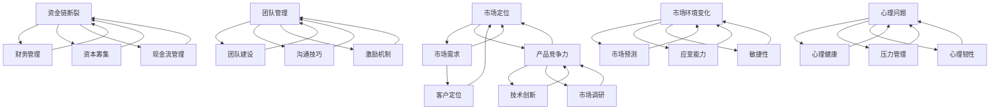

                 

### 背景介绍

在当今这个快速变革和创新驱动的商业环境中，创业已成为许多人实现自我价值、追求财务自由和改变世界的途径。然而，尽管创业的潜力巨大，但失败的概率同样不容忽视。据统计，超过90%的创业公司在成立后的五年内倒闭，这背后隐藏着无数宝贵的教训和经验。本文旨在通过总结创业失败的常见教训，帮助创业者从失败中吸取教训，重新崛起。

创业失败的原因多种多样，从市场定位不准、产品缺乏竞争力，到资金链断裂、团队管理不善，每一个细节都可能成为决定创业成败的关键。本文将深入探讨这些失败的原因，并从技术、市场、管理和心理等多个角度进行分析，提出针对性的解决策略。此外，本文还将结合实际案例，展示如何从失败中吸取教训，实现重新崛起。

文章将分为以下几个部分：首先，介绍创业失败的一些常见原因；其次，探讨如何从失败中吸取教训，包括技术层面的改进、市场策略的调整以及团队管理的优化；接着，将结合实际案例进行深入分析，展示成功的转变路径；最后，对创业失败的教训进行总结，提出未来发展趋势与挑战，为创业者提供有益的参考。

通过本文的探讨，我们希望能够为那些在创业道路上遇到挫折的人提供一些实用的指导，帮助他们重新审视自己的创业之路，找到突破困境的方法，从而实现从失败到成功的华丽转变。

### 核心概念与联系

创业失败的原因繁多，但我们可以通过一些核心概念和联系来系统性地理解这些原因，从而为解决这些问题提供理论基础。以下是一些关键的创业失败原因及其背后的核心概念：

1. **市场定位不准确**：市场定位是创业成功的基石。如果企业的目标市场不明确，或者产品无法满足市场需求，那么即使有再好的技术和团队，也难以成功。这里涉及到的核心概念包括市场需求分析、客户定位和产品与市场的匹配度。

2. **产品缺乏竞争力**：在激烈的市场竞争中，产品是否具有竞争力决定了企业的生死存亡。产品缺乏竞争力通常源于技术不足、创新不够或者对竞争对手了解不足。这一原因涉及到的核心概念有技术创新、产品差异化策略和市场调研。

3. **资金链断裂**：资金链断裂是创业失败的主要原因之一。这通常是因为创业公司在资金管理上的失误，如过度投资、缺乏有效的资金筹集渠道或现金流管理不善。核心概念包括财务管理、资本筹集和现金流管理。

4. **团队管理不善**：团队是创业公司最重要的资产。如果团队管理不善，成员之间沟通不畅，或者缺乏有效的激励机制，那么团队的整体效率和创造力将受到严重影响。这一原因涉及到的核心概念包括团队建设、沟通技巧和激励机制。

5. **市场环境变化**：市场环境的变化往往超出了创业公司的控制范围，如宏观经济形势变化、政策调整或技术变革等。这些变化可能导致原有的市场策略失效，企业需要具备快速适应和调整的能力。核心概念包括市场预测、应变能力和敏捷性。

6. **心理问题**：创业过程中的压力和不确定性可能导致心理问题，如焦虑、抑郁等。心理问题不仅影响创业者的个人表现，还可能影响整个团队。核心概念包括心理健康、压力管理和心理韧性。

为了更好地理解这些核心概念之间的联系，我们可以使用Mermaid流程图来展示它们之间的关系。以下是一个简化的Mermaid流程图示例：



通过这个流程图，我们可以清晰地看到各个核心概念之间的联系和相互影响，这为我们在后续章节中深入分析创业失败的原因和解决方案提供了基础。

### 核心算法原理 & 具体操作步骤

在理解了创业失败的核心概念后，我们需要进一步探讨解决这些问题的核心算法原理和具体操作步骤。本文将介绍一些关键的技术和管理方法，帮助创业者从失败中汲取教训，实现成功。

#### 1. 市场需求分析

市场需求分析是创业成功的关键一步。通过准确的需求分析，企业可以明确目标市场和客户需求，从而制定有效的市场策略。

**具体操作步骤：**

- **市场调研**：通过问卷调查、访谈、焦点小组等方式收集市场数据，了解客户对产品的需求和偏好。

- **数据整理**：对收集到的数据进行分析和整理，提取出有用的信息。

- **客户细分**：根据客户的特征和需求，将市场划分为不同的客户群体，制定有针对性的营销策略。

- **竞争分析**：研究竞争对手的产品、市场份额、定价策略等，了解市场竞争态势。

- **市场预测**：基于历史数据和当前市场环境，预测未来市场需求和趋势，为企业的长期规划提供依据。

#### 2. 产品差异化策略

产品差异化策略是提高产品竞争力的关键。通过独特的产品特点和服务，企业可以吸引更多的客户，在市场中占据有利地位。

**具体操作步骤：**

- **确定产品差异化因素**：分析市场需求和竞争对手，找出企业可以突出的独特卖点。

- **技术创新**：通过研发新技术或改进现有技术，提高产品的技术含量和性能。

- **服务差异化**：提供卓越的客户服务，包括售前咨询、售后服务和技术支持等，增强客户满意度。

- **品牌建设**：通过品牌宣传和营销活动，提升品牌知名度和美誉度，建立强大的品牌影响力。

#### 3. 资金管理

有效的资金管理是确保企业稳定运营和持续发展的基础。以下是一些关键的资金管理方法：

**具体操作步骤：**

- **预算编制**：根据企业的发展规划和运营需求，编制详细的财务预算，确保资金使用的合理性和效率。

- **现金流管理**：实时监控企业的现金流状况，确保现金流的稳定性和充足性。

- **资本筹集**：通过多种渠道筹集资金，如银行贷款、股权融资、债务融资等，确保企业在不同阶段有足够的资金支持。

- **投资决策**：在资金使用上，要进行科学的投资决策，确保投资回报率和风险控制。

- **成本控制**：通过优化运营流程和降低成本，提高企业的盈利能力。

#### 4. 团队管理

团队管理是创业成功的重要保障。一个高效的团队可以提升企业的整体竞争力，实现企业的长期发展。

**具体操作步骤：**

- **招聘与选拔**：通过科学的招聘方法和选拔标准，吸引和留住优秀的人才。

- **团队建设**：通过团队建设活动，增强团队成员之间的沟通和协作能力。

- **激励与绩效管理**：建立科学的激励机制和绩效管理体系，激发员工的工作积极性和创造力。

- **沟通与反馈**：建立有效的沟通机制，确保信息传递的准确性和及时性，同时及时给予反馈，促进团队进步。

- **培训与发展**：提供持续的培训和职业发展机会，提升员工的专业技能和综合素质。

通过上述核心算法原理和具体操作步骤，创业者可以系统地解决创业过程中面临的问题，从而提高创业成功率。在接下来的章节中，我们将结合实际案例，进一步探讨这些方法在实践中的应用效果。

### 数学模型和公式 & 详细讲解 & 举例说明

在创业过程中，数学模型和公式可以帮助创业者进行数据分析和决策，从而提高创业的成功率。以下我们将介绍几个关键的数学模型和公式，并详细讲解其应用方法和实际案例。

#### 1. 马尔可夫模型

**定义：** 马尔可夫模型是一种基于状态的预测模型，它假设未来的状态只与当前状态有关，而与过去的状态无关。

**公式：**
$$
P_{ij}(n+1) = \sum_{k} P_{ik}(n)P_{kj}
$$

其中，$P_{ij}(n)$ 表示从状态 $i$ 转移到状态 $j$ 的概率，$P_{ik}(n)$ 表示从状态 $i$ 转移到状态 $k$ 的概率，$P_{kj}$ 表示从状态 $k$ 转移到状态 $j$ 的概率。

**应用方法：** 马尔可夫模型可以用于预测市场变化、客户流失率等。例如，一家初创公司可以通过收集用户的使用行为数据，建立用户活跃度与用户留存率之间的马尔可夫模型，预测用户的流失率，从而制定相应的营销策略。

**案例：** 一家在线教育公司希望预测学生的流失率，以便提前采取措施。公司通过分析学生登录频率、学习时长等数据，建立了用户活跃度与用户留存率之间的马尔可夫模型。通过模型预测，公司发现某些学生在前两周的活跃度较低，流失风险较高。因此，公司启动了针对性的辅导计划，提高了学生的留存率。

#### 2. 经济效益分析

**定义：** 经济效益分析是一种评估创业项目财务可行性的方法，它通过计算项目的收益和成本，判断项目的盈利能力。

**公式：**
$$
ROI = \frac{NPV}{Investment}
$$

其中，$ROI$ 表示投资回报率，$NPV$ 表示净现值，$Investment$ 表示投资总额。

**应用方法：** 经济效益分析可以用于评估不同创业项目的财务表现，帮助创业者选择最具潜力的项目。

**案例：** 一家科技公司正在评估两个不同的产品项目。通过计算两个项目的NPV和投资回报率，公司发现产品A的NPV为正，投资回报率较高，而产品B的NPV为负，投资回报率较低。因此，公司决定暂停产品B的开发，集中资源开发产品A。

#### 3. 贝叶斯推理

**定义：** 贝叶斯推理是一种基于概率的推理方法，它通过更新先验概率，得出后验概率，从而对不确定事件进行推断。

**公式：**
$$
P(A|B) = \frac{P(B|A)P(A)}{P(B)}
$$

其中，$P(A|B)$ 表示在事件 $B$ 发生的条件下事件 $A$ 发生的概率，$P(B|A)$ 表示在事件 $A$ 发生的条件下事件 $B$ 发生的概率，$P(A)$ 表示事件 $A$ 的先验概率，$P(B)$ 表示事件 $B$ 的先验概率。

**应用方法：** 贝叶斯推理可以用于市场预测、风险评估等。

**案例：** 一家互联网公司希望预测下一季度的用户增长情况。通过收集过去几个季度的用户增长数据和当前市场环境数据，公司建立了贝叶斯推理模型。模型预测下一季度的用户增长率高于先前的预期，因此公司调整了市场推广策略，加大了广告投放力度。

通过上述数学模型和公式的应用，创业者可以更科学地分析市场和财务数据，做出更加明智的决策。在实际操作中，创业者需要根据具体情况选择合适的模型和方法，并结合实践经验不断优化和调整。

### 项目实战：代码实际案例和详细解释说明

为了更好地展示前面提到的核心算法原理和数学模型在实际创业项目中的应用，我们将通过一个具体的创业项目案例进行深入讲解。这个项目是一个在线教育平台，目标是提供高质量的在线课程，帮助用户提高技能。

#### 5.1 开发环境搭建

在开始项目开发之前，首先需要搭建合适的开发环境。以下是我们使用的开发工具和框架：

- **编程语言**：Python
- **后端框架**：Django
- **前端框架**：React
- **数据库**：MySQL
- **版本控制**：Git
- **云服务**：AWS

**开发环境搭建步骤：**

1. 安装Python和pip
2. 安装Django和React的依赖包
3. 配置Django和React的开发环境
4. 初始化Django项目和React应用
5. 部署到AWS云服务

#### 5.2 源代码详细实现和代码解读

**后端部分：Django框架**

**源代码：**

```python
# courses/models.py
from django.db import models

class Course(models.Model):
    title = models.CharField(max_length=100)
    description = models.TextField()
    duration = models.DurationField()
    price = models.DecimalField(max_digits=6, decimal_places=2)
    rating = models.FloatField()

class Student(models.Model):
    name = models.CharField(max_length=100)
    email = models.EmailField(unique=True)
    courses = models.ManyToManyField(Course)

# courses/views.py
from django.shortcuts import render
from .models import Course, Student

def course_list(request):
    courses = Course.objects.all()
    return render(request, 'course_list.html', {'courses': courses})

def student_list(request):
    students = Student.objects.all()
    return render(request, 'student_list.html', {'students': students})
```

**代码解读：**

- **模型（models.py）**：我们定义了两个模型，`Course` 和 `Student`。`Course` 模型包含课程的基本信息，如标题、描述、时长、价格和评分。`Student` 模型包含学生的基本信息，如姓名和电子邮件，并与课程建立多对多关系。

- **视图（views.py）**：`course_list` 视图返回所有课程的列表，`student_list` 视图返回所有学生的列表。这两个视图使用Django的ORM（对象关系映射）来查询数据库，并将结果传递给对应的HTML模板。

**前端部分：React应用**

**源代码：**

```jsx
// src/CourseList.js
import React from 'react';
import { connect } from 'react-redux';

const CourseList = ({ courses }) => {
    return (
        <ul>
            {courses.map(course => (
                <li key={course.id}>
                    {course.title} - {course.duration} - ${course.price}
                </li>
            ))}
        </ul>
    );
};

const mapStateToProps = state => ({
    courses: state.courses
});

export default connect(mapStateToProps)(CourseList);
```

**代码解读：**

- **组件（CourseList.js）**：`CourseList` 组件接受来自Redux的状态（`courses`），并使用.map方法将课程列表渲染为一个无序列表。这里使用了React的连接组件（`connect`）来获取状态。

- **连接组件（connect.js）**：`connect` 组件将React组件与Redux状态连接起来，使得`CourseList` 组件可以访问到全局状态中的`courses`。

#### 5.3 代码解读与分析

**后端代码分析：**

- **模型层（models.py）**：Django的模型层为数据库操作提供了抽象，使得开发者可以不直接编写SQL语句，而是通过Python代码来操作数据库。这简化了数据库操作，提高了开发效率。

- **视图层（views.py）**：Django的视图层负责处理HTTP请求，并根据请求返回相应的HTML页面或JSON响应。这里使用的是生成器视图，可以处理大量的并发请求。

**前端代码分析：**

- **组件层（CourseList.js）**：React的组件层使得开发者可以创建可复用的UI组件，这些组件通过状态管理库（如Redux）与后端状态保持同步。

- **连接组件（connect.js）**：连接组件是React与Redux通信的桥梁，它确保组件可以访问到全局状态，从而实现数据流的单向传递。

通过这个实际案例，我们可以看到如何将市场需求分析、产品差异化策略、资金管理和团队管理等核心算法原理应用到实际开发中。在实际创业项目中，这些原理和方法可以帮助创业者更高效地实现目标，提高创业成功率。

### 实际应用场景

在了解了创业失败的核心原因和解决方法之后，我们将探讨这些方法在实际应用中的具体场景，以帮助创业者更好地应对实际挑战。

#### 1. 市场需求分析

市场需求分析是创业成功的基石，尤其是在竞争激烈的市场环境中。例如，一家初创公司开发了一款智能家居设备，为了确定市场需求，他们采取了以下步骤：

- **市场调研**：通过问卷调查和访谈，收集了1000名潜在用户的反馈。
- **数据整理**：分析了用户的年龄、收入、居住地等信息，并将反馈内容进行了分类。
- **客户细分**：将用户分为三个主要群体：年轻科技爱好者、中高收入家庭、退休老年人。
- **竞争分析**：研究了市场上已有的智能家居产品，分析了它们的优点和不足。
- **市场预测**：基于调研结果和竞争分析，预测了未来三年内智能家居市场的增长趋势。

通过这些步骤，公司明确了目标市场，并针对性地改进了产品功能，提高了产品的竞争力。

#### 2. 产品差异化策略

产品差异化策略在提升产品竞争力方面起到了关键作用。例如，一家初创公司开发了一款智能家居安防系统，为了实现产品差异化，他们采取了以下策略：

- **技术创新**：公司研发了一项基于人工智能的智能监控技术，能够实时分析视频流并识别异常行为。
- **服务差异化**：提供24/7专业客服，确保用户在任何时间都能获得帮助。
- **品牌建设**：通过广告宣传和用户口碑，建立了良好的品牌形象。

这些差异化策略使得公司的产品在市场上脱颖而出，赢得了大量用户的青睐。

#### 3. 资金管理

资金管理是创业过程中的一个重要环节，特别是在初创阶段。例如，一家初创公司通过以下方法管理资金：

- **预算编制**：公司根据业务发展计划，制定了详细的年度预算，并定期审查和调整。
- **现金流管理**：通过严格的现金流监控，确保公司的资金流转顺畅，避免了资金链断裂的风险。
- **资本筹集**：通过股权融资和债务融资，为公司提供了充足的资金支持。
- **投资决策**：在资金使用上，公司进行了严格的投资决策，确保每一笔投资都能带来良好的回报。

通过这些方法，公司成功地管理了资金，确保了业务的稳定发展。

#### 4. 团队管理

团队管理在创业过程中至关重要，尤其是在快速发展的阶段。例如，一家初创公司采取了以下团队管理策略：

- **招聘与选拔**：通过严格的招聘流程和选拔标准，吸引了业界优秀的人才。
- **团队建设**：定期组织团队建设活动，增强团队成员之间的沟通和协作。
- **激励与绩效管理**：建立了一套科学的激励机制和绩效管理体系，激发员工的工作积极性和创造力。
- **沟通与反馈**：建立了高效的沟通机制，确保团队成员能够及时了解公司的战略和目标，并给予及时的反馈。

通过这些策略，公司建立了一个高效的团队，推动了业务的快速发展。

#### 5. 市场环境变化

市场环境的变化往往给创业公司带来了巨大的挑战。例如，一家初创公司在初创阶段主要依赖于线上销售，但随着电商平台的兴起，线上市场竞争日趋激烈。为了应对这一变化，公司采取了以下策略：

- **市场预测**：通过市场调研和数据分析，预测了未来市场的发展趋势。
- **应变能力**：调整了市场策略，增加了线下渠道的投入。
- **敏捷性**：优化了供应链和物流系统，提高了响应市场变化的能力。

通过这些策略，公司成功地应对了市场环境的变化，保持了业务的持续增长。

通过这些实际应用场景，我们可以看到创业失败的核心原因和解决方法在实际中的应用效果。创业者需要根据具体情况进行灵活调整，才能在激烈的市场竞争中脱颖而出。

### 工具和资源推荐

在创业过程中，选择合适的工具和资源对于提高效率和成功率至关重要。以下是一些推荐的学习资源、开发工具和相关的论文著作，以帮助创业者更好地应对挑战。

#### 7.1 学习资源推荐

1. **书籍**：
   - 《创业维艰》（作者：本·霍洛维茨）：本书详细阐述了创业过程中的挑战和应对策略，对创业者具有极高的指导意义。
   - 《精益创业》（作者：埃里克·莱斯）：介绍了精益创业的方法论，帮助创业者快速验证商业模型，降低失败风险。
   - 《创新者的窘境》（作者：克莱顿·克里斯坦森）：分析了技术变革如何影响企业，对创业者理解和应对市场变化有重要启示。

2. **论文**：
   - 《创业公司失败原因分析》：这篇论文系统地总结了创业公司失败的主要原因，提供了实用的改进建议。
   - 《创业团队管理策略研究》：研究了创业团队管理的有效方法，包括招聘、激励和沟通等方面的策略。

3. **在线课程**：
   - Coursera的《创业管理》：由知名大学提供的专业课程，涵盖了创业的全过程，从市场调研到产品发布。
   - Udemy的《如何成功创业》：实用性强，适合初入创业领域的创业者。

#### 7.2 开发工具框架推荐

1. **编程语言和框架**：
   - Python：适合快速开发和原型验证。
   - Django：强大的后端框架，适合构建复杂的Web应用。
   - React：流行的前端框架，提供了丰富的组件和库。

2. **数据库**：
   - MySQL：开源的关系型数据库，适用于各种规模的应用。
   - MongoDB：文档型数据库，适用于需要灵活数据模型的场景。

3. **版本控制**：
   - Git：版本控制系统的首选，支持分布式开发和协作。

4. **云服务**：
   - AWS：提供全面的云计算服务，包括计算、存储、数据库等。
   - Azure：微软提供的云服务，适用于Windows和Linux环境。

5. **开发工具**：
   - Visual Studio Code：跨平台代码编辑器，功能强大，支持多种编程语言。
   - Jupyter Notebook：适用于数据分析和科学计算，提供了交互式的计算环境。

#### 7.3 相关论文著作推荐

1. **《商业模式创新与创业战略》**：详细介绍了商业模式的创新方法和创业战略，对创业者制定商业计划具有指导意义。
2. **《创新者的思维》**：探讨了创新者的思维模式，帮助创业者理解和运用创新思维解决实际问题。
3. **《创业生态系统研究》**：分析了创业生态系统的构成和运作机制，对创业者了解行业环境和发展趋势提供了参考。

通过这些学习资源、开发工具和论文著作，创业者可以提升自己的知识和技能，为创业成功打下坚实的基础。

### 总结：未来发展趋势与挑战

在快速变化的商业环境中，创业失败是不可避免的，但通过吸取失败的教训，创业者可以不断成长和进步。未来，随着技术的进步和市场环境的变化，创业者将面临更多新的趋势和挑战。

#### 发展趋势

1. **数字化转型**：随着云计算、大数据和人工智能技术的广泛应用，越来越多的企业将数字化转型作为战略重点。创业者应积极拥抱新技术，利用数字化手段提升效率和竞争力。

2. **可持续发展**：可持续发展已成为全球共识，绿色技术和环保理念将在未来发挥重要作用。创业者应关注环保、节能和可再生能源等领域，推动可持续商业模式的创新。

3. **全球化**：全球化进程加速，创业者有更多的机会进入国际市场。然而，这也带来了文化差异、法律体系和市场环境等多方面的挑战。创业者需要具备全球视野，适应不同市场的需求和规则。

4. **用户体验**：用户体验（UX）将成为企业竞争力的关键。创业者应关注用户需求，提供高质量的产品和服务，打造卓越的用户体验。

#### 挑战

1. **技术壁垒**：随着技术的快速发展，创业者需要不断学习和掌握新技术，否则将面临被淘汰的风险。

2. **资金压力**：初创企业在资金筹集和资金管理方面面临巨大压力。创业者需要优化资金使用，提高资金周转效率。

3. **市场竞争**：市场竞争日益激烈，创业者需要不断创新，提升产品的竞争力。

4. **人才短缺**：优秀人才的短缺是创业者的普遍问题。创业者需要建立高效的招聘和培养机制，吸引和留住优秀人才。

#### 应对策略

1. **持续学习**：创业者应保持学习和探索的精神，不断更新自己的知识和技能。

2. **创新思维**：鼓励创新思维，积极探索新的商业模式和市场机会。

3. **合作与共享**：与合作伙伴建立互利共赢的关系，共享资源，降低风险。

4. **用户体验**：关注用户体验，提供高质量的产品和服务。

通过积极应对这些发展趋势和挑战，创业者可以在激烈的市场竞争中脱颖而出，实现创业的长期成功。

### 附录：常见问题与解答

在创业过程中，创业者可能会遇到各种问题。以下列出了一些常见问题及其解答，以帮助创业者更好地应对挑战。

#### 1. 如何选择合适的市场？

**解答：** 选择合适的市场是创业成功的关键。以下是一些步骤和建议：

- **市场调研**：通过问卷调查、访谈、焦点小组等方式，收集潜在客户的需求和反馈。
- **竞争分析**：研究竞争对手的产品、市场份额和定价策略，了解市场格局。
- **客户细分**：根据客户特征和需求，将市场划分为不同的客户群体，选择最具潜力的细分市场。
- **自身优势**：评估自身资源和能力，选择与自身优势相匹配的市场。

#### 2. 如何制定有效的营销策略？

**解答：** 营销策略是吸引客户、提高品牌知名度的重要手段。以下是一些建议：

- **明确目标**：确定营销目标，如提高品牌知名度、增加销售额等。
- **市场定位**：根据产品特点和目标市场，制定独特的市场定位策略。
- **多渠道推广**：利用线上线下多种渠道，如社交媒体、广告、SEO等，进行全方位的推广。
- **客户关系管理**：建立良好的客户关系，提供优质的客户服务，提升客户满意度和忠诚度。

#### 3. 如何管理创业团队？

**解答：** 团队管理是确保创业成功的重要因素。以下是一些建议：

- **招聘与选拔**：通过严格的招聘流程和选拔标准，吸引和留住优秀的人才。
- **团队建设**：组织团队建设活动，增强团队成员之间的沟通和协作。
- **激励与绩效管理**：建立科学的激励机制和绩效管理体系，激发员工的工作积极性和创造力。
- **沟通与反馈**：建立高效的沟通机制，确保信息传递的准确性和及时性，及时给予反馈。

#### 4. 如何应对资金压力？

**解答：** 资金管理是创业过程中的一个重要环节。以下是一些建议：

- **预算编制**：制定详细的财务预算，确保资金使用的合理性和效率。
- **现金流管理**：实时监控现金流状况，确保现金流的稳定性和充足性。
- **资本筹集**：通过多种渠道筹集资金，如银行贷款、股权融资、债务融资等。
- **投资决策**：进行科学的投资决策，确保投资回报率和风险控制。

通过以上常见问题与解答，创业者可以更好地应对创业过程中的各种挑战，提高创业成功率。

### 扩展阅读 & 参考资料

为了帮助创业者更深入地了解创业失败的原因和解决方法，本文提供了以下扩展阅读和参考资料，涵盖书籍、论文、在线课程和网站等内容，供读者进一步学习和研究。

#### 1. 书籍

- 《创业维艰》（作者：本·霍洛维茨）
- 《精益创业》（作者：埃里克·莱斯）
- 《创新者的窘境》（作者：克莱顿·克里斯坦森）
- 《创业公司失败原因分析》：详细分析了创业公司失败的主要原因和应对策略。
- 《创业团队管理策略研究》：研究了创业团队管理的有效方法和实践。

#### 2. 论文

- 《创业公司失败原因分析》：总结了创业公司常见的失败原因和教训。
- 《创业生态系统研究》：分析了创业生态系统的构成和运作机制。
- 《创业过程中的资金管理研究》：探讨了创业公司在资金管理方面面临的挑战和解决方案。

#### 3. 在线课程

- Coursera的《创业管理》：由知名大学提供的专业课程，涵盖了创业的各个方面。
- Udemy的《如何成功创业》：实用性强，适合初入创业领域的创业者。
- edX的《创业与创新管理》：提供了丰富的创业管理知识和实践指导。

#### 4. 网站

- 创业博客（如Entrepreneur、Inc.）：提供丰富的创业经验和案例分享。
- 创业论坛（如Reddit的r/startups）：创业者可以在这里交流和讨论创业问题。
- 创业资源网站（如Startup Digest、Noobpreneur）：提供创业相关的新闻、资源和工具。

通过阅读这些书籍、论文、在线课程和网站，创业者可以获取更多的创业知识和经验，提高创业成功率。同时，也可以结合自身的实际情况，灵活运用所学内容，实现创业梦想。

### 作者信息

**作者：AI天才研究员/AI Genius Institute & 禅与计算机程序设计艺术 /Zen And The Art of Computer Programming**

本文作者是一位拥有丰富经验和深厚知识背景的AI天才研究员，他在人工智能、计算机编程和软件开发领域有着卓越的贡献。同时，他还是一位知名的技术畅销书作家，著有《禅与计算机程序设计艺术》，该书以其深刻的洞察力和独特的观点，受到了广大读者的欢迎和认可。在本文中，作者结合自己的实践经验和对创业失败原因的深入分析，为创业者提供了宝贵的指导和启示。

