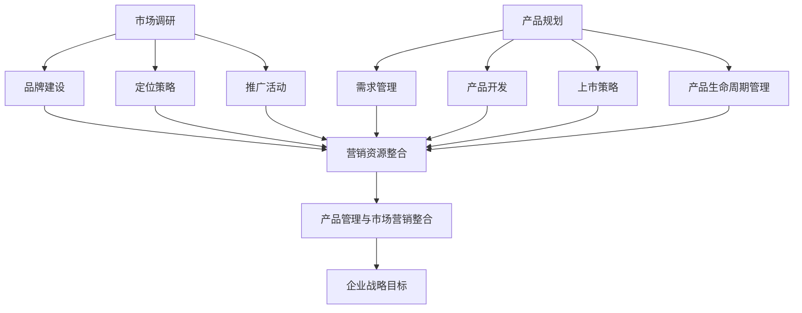

                 

### 背景介绍

在当今的商业环境中，市场营销和产品管理已经成为企业成功的关键因素。随着市场的快速变化和消费者需求的不断演变，企业需要具备强大的市场营销和产品管理能力，以便在激烈的市场竞争中脱颖而出。

市场营销是企业与潜在客户之间的桥梁，它涉及到品牌建设、市场调研、定位策略、推广活动等多个方面。而产品管理则是确保企业产品能够满足市场需求、实现商业目标的过程。这两个领域不仅需要专业知识，还需要战略思维和实践经验。

本文将深入探讨市场营销和产品管理的重要性，解析它们的核心概念，介绍相关工具和资源，并提供实际应用案例。通过一步步的分析和推理，我们希望读者能够更好地理解这两个领域，并在实际工作中运用所学知识。

首先，我们将从市场营销和产品管理的定义和作用入手，了解它们在企业发展中的地位。接着，我们将探讨市场营销和产品管理之间的联系，以及如何有效地整合两者。随后，我们将详细讨论市场营销和产品管理中的核心概念和工具。然后，通过一个实际应用案例，我们将展示如何在实际工作中运用市场营销和产品管理的知识。

文章还将介绍一些重要的工具和资源，帮助读者深入了解和学习这两个领域。最后，我们将对市场营销和产品管理的未来发展进行展望，探讨可能遇到的挑战和机遇。

通过对本文的阅读，您将能够：

1. 理解市场营销和产品管理的基本概念和作用。
2. 了解市场营销和产品管理之间的联系和实践方法。
3. 掌握市场营销和产品管理中的核心概念和工具。
4. 通过实际案例了解如何将市场营销和产品管理知识应用于实际工作中。
5. 获取有关市场营销和产品管理的推荐资源，以便进一步学习和实践。

让我们开始这段关于市场营销和产品管理的探索之旅吧！

### 核心概念与联系

#### 市场营销

市场营销是指企业通过策划、推广、销售和客户关系管理等一系列活动，以实现产品或服务从生产者到消费者的有效传递。其核心概念包括：

1. **市场调研**：通过收集和分析消费者行为、需求和市场趋势，帮助企业了解目标市场。
2. **品牌建设**：通过塑造独特的企业形象和价值观，提高品牌知名度和忠诚度。
3. **定位策略**：确定产品在市场中的位置，以区别于竞争对手。
4. **推广活动**：通过各种渠道和方式，向目标受众传播产品信息，吸引潜在客户。
5. **销售策略**：制定销售目标、销售渠道和销售手段，以实现销售额最大化。

#### 产品管理

产品管理则关注如何确保产品从概念到上市的全过程能够满足市场需求，实现商业目标。其主要概念包括：

1. **产品规划**：确定产品愿景、目标和路线图，明确产品在市场中的角色。
2. **需求管理**：识别和满足用户需求，确保产品功能符合用户期望。
3. **产品开发**：通过设计、开发、测试等环节，将产品从概念转化为实际产品。
4. **上市策略**：制定产品上市计划，包括定价、促销、渠道等策略。
5. **产品生命周期管理**：监控产品在整个生命周期中的表现，根据市场反馈进行调整和优化。

#### 市场营销与产品管理的联系

市场营销和产品管理在企业中相辅相成，共同推动企业成功。以下是它们之间的主要联系：

1. **目标一致性**：市场营销和产品管理都需要围绕企业的整体战略目标进行。市场营销的目标是吸引和保留客户，产品管理的目标是开发符合市场需求的产品。
2. **信息共享**：市场营销通过市场调研收集的信息，可以为产品管理提供宝贵的用户需求和趋势数据，帮助产品团队更好地规划产品方向。
3. **资源整合**：市场营销和产品管理需要协调使用企业的资源，包括人力、资金和营销材料等，以确保产品能够顺利开发和推广。
4. **反馈循环**：市场营销活动中的客户反馈可以帮助产品管理团队了解产品的优缺点，进行相应的调整和优化，提高产品竞争力。

#### 市场营销与产品管理的架构

为了更好地理解和实施市场营销和产品管理，我们可以借助Mermaid流程图来展示它们的核心架构：



通过这个流程图，我们可以看到市场营销和产品管理是如何相互作用，共同服务于企业战略目标的。市场营销为产品管理提供方向和市场数据，产品管理则根据这些数据和市场反馈进行产品开发和优化。

在理解了市场营销和产品管理的基本概念和联系后，我们将在接下来的章节中深入探讨它们的具体原理和实践方法。这将帮助我们更好地理解如何在实际工作中运用这些知识，实现企业的长期成功。

#### 核心算法原理 & 具体操作步骤

在市场营销和产品管理中，核心算法和操作步骤起着至关重要的作用。以下将详细讲解一些关键算法的原理和具体操作步骤，以帮助读者更好地理解和应用这些方法。

##### 1. 营销漏斗模型

**原理**：营销漏斗模型（Marketing Funnel）是一种常用的市场营销分析工具，用于描述潜在客户从接触品牌到最终成为客户的过程。漏斗模型通常包括以下阶段：潜在客户（Prospects）、访问者（Visitors）、潜在客户（Leads）、合格潜在客户（Qualified Leads）、机会（Opportunities）和客户（Customers）。

**操作步骤**：
1. **收集潜在客户数据**：通过市场调研、广告投放、社交媒体活动等方式收集潜在客户的初始数据。
2. **转化访问者**：通过网站优化、内容营销、电子邮件营销等手段提高访问者的转化率。
3. **识别潜在客户**：通过客户行为分析、客户调查等方式，识别有购买意向的潜在客户。
4. **筛选合格潜在客户**：根据设定的标准和指标，筛选出最有潜力转化为客户的潜在客户。
5. **跟进潜在客户**：通过电话、邮件、社交媒体等方式，与潜在客户保持联系，促进成交。
6. **评估和优化**：定期评估营销漏斗的各个阶段表现，根据反馈调整策略，提高整体转化率。

##### 2. 数据驱动决策

**原理**：数据驱动决策（Data-Driven Decision Making）是指基于数据分析和洞察来制定和优化营销和产品策略。通过数据，企业可以了解市场趋势、消费者行为和产品表现，从而做出更准确的决策。

**操作步骤**：
1. **数据收集**：从各种渠道（如网站分析工具、客户管理系统、社交媒体分析工具等）收集数据。
2. **数据清洗**：对收集到的数据进行清洗和整理，确保数据的准确性和一致性。
3. **数据分析**：使用数据分析工具（如Excel、SQL、Python等）对数据进行处理和分析，提取有价值的信息。
4. **可视化展示**：将分析结果通过图表、报表等形式进行可视化展示，便于理解和决策。
5. **制定策略**：根据数据分析结果，制定和调整营销和产品策略。
6. **监控和调整**：持续监控策略效果，根据反馈进行及时调整，优化营销和产品表现。

##### 3. 产品生命周期分析

**原理**：产品生命周期分析（Product Life Cycle Analysis）是一种用于评估产品在不同生命周期阶段表现的方法。产品生命周期通常分为引入期、成长期、成熟期和衰退期。

**操作步骤**：
1. **确定产品生命周期阶段**：根据产品在市场上的表现和竞争情况，确定产品所处的生命周期阶段。
2. **分析阶段特点**：了解每个生命周期阶段的特点和挑战，为策略制定提供依据。
3. **制定阶段策略**：
   - **引入期**：重点在于产品推广和品牌建设，提高市场知名度和用户认可度。
   - **成长期**：加强市场推广，扩大市场份额，优化产品功能和服务。
   - **成熟期**：保持市场份额，通过产品升级、促销活动等方式维持销售增长。
   - **衰退期**：针对市场变化和用户需求，考虑产品转型或淘汰。
4. **评估和调整**：定期评估产品生命周期策略的效果，根据市场反馈进行及时调整。

##### 4. 用户画像分析

**原理**：用户画像分析（User Profiling）是一种基于数据分析的方法，用于了解目标用户的特征和行为。通过用户画像，企业可以更精准地定位和满足用户需求。

**操作步骤**：
1. **收集用户数据**：通过问卷调查、用户行为追踪、社交媒体分析等手段收集用户数据。
2. **整理用户特征**：对收集到的数据进行分析，提取用户的年龄、性别、职业、兴趣等特征。
3. **创建用户画像**：根据用户特征和行为，创建具体的用户画像模型。
4. **应用用户画像**：在市场营销、产品规划和产品设计等方面，应用用户画像进行决策和优化。
5. **持续更新**：定期更新用户画像，确保数据的准确性和时效性。

通过上述核心算法和操作步骤，企业可以更好地理解和应用市场营销和产品管理的方法，提高市场竞争力，实现可持续发展。

#### 数学模型和公式 & 详细讲解 & 举例说明

在市场营销和产品管理中，数学模型和公式是分析和优化策略的重要工具。以下我们将详细讲解几个关键的数学模型和公式，并提供实际应用的举例说明。

##### 1. 市场份额预测模型

**公式**： 
\[ S(t) = \frac{R(t)}{R_{\text{total}}(t)} \]

其中，\( S(t) \) 表示时间 \( t \) 时的市场份额，\( R(t) \) 表示企业在时间 \( t \) 时的销售额，\( R_{\text{total}}(t) \) 表示市场总销售额。

**详细讲解**：该模型用于预测企业在特定时间点的市场份额。通过计算企业在市场中的销售额与市场总销售额的比值，可以直观地了解企业在市场中的竞争力。

**举例说明**：假设某企业在某市场上的总销售额为 100 万元，市场总销售额为 500 万元，则该企业在该市场中的市场份额为 \( \frac{100}{500} = 20\% \)。

##### 2. 客户终身价值模型

**公式**： 
\[ CLV = \sum_{t=1}^{n} \frac{RFM(t)}{(1 + r)^t} \]

其中，\( CLV \) 表示客户终身价值，\( RFM(t) \) 表示时间 \( t \) 时的客户回报率，\( r \) 表示折现率，\( n \) 表示客户生命周期。

**详细讲解**：该模型用于评估单个客户的潜在价值。通过计算客户在整个生命周期内的预期回报，并考虑时间价值，可以更准确地评估客户的价值。

**举例说明**：假设某客户在一年内为企业带来 1000 元的回报，折现率为 10%，客户生命周期为 5 年，则该客户的客户终身价值为：
\[ CLV = \sum_{t=1}^{5} \frac{1000}{(1 + 0.1)^t} \approx 3947.4 \]

##### 3. 价格弹性模型

**公式**： 
\[ E = \frac{\% \Delta Q}{\% \Delta P} \]

其中，\( E \) 表示价格弹性，\( \% \Delta Q \) 表示需求量的百分比变化，\( \% \Delta P \) 表示价格的百分比变化。

**详细讲解**：该模型用于分析价格变动对需求量的影响。通过计算需求量的变化与价格变化的比值，可以了解产品的价格弹性，为定价策略提供依据。

**举例说明**：假设某产品的价格从 100 元调整到 90 元，导致需求量从 1000 单位增加到 1200 单位，则该产品的价格弹性为：
\[ E = \frac{(1200 - 1000) / 1000}{(90 - 100) / 100} = 2 \]

这意味着价格每下降 1%，需求量增加 2%。

##### 4. 用户体验评分模型

**公式**： 
\[ URS = \frac{S_1 + S_2 + \ldots + S_n}{n} \]

其中，\( URS \) 表示用户体验评分，\( S_1, S_2, \ldots, S_n \) 表示不同维度的用户体验评分，\( n \) 表示维度数量。

**详细讲解**：该模型用于综合评估用户对产品的整体体验。通过计算各个维度的评分平均值，可以得出产品的用户体验评分。

**举例说明**：假设某产品有三个维度：功能评分 8 分，易用性评分 9 分，设计评分 7 分，则该产品的用户体验评分为：
\[ URS = \frac{8 + 9 + 7}{3} = 8 \]

##### 5. 产品开发时间预估模型

**公式**： 
\[ T = T_p + T_d + T_i + T_r \]

其中，\( T \) 表示产品开发总时间，\( T_p \) 表示前期准备时间，\( T_d \) 表示设计时间，\( T_i \) 表示实施时间，\( T_r \) 表示验收和发布时间。

**详细讲解**：该模型用于估算产品从立项到上市的总时间。通过分解各个阶段的时间，可以更清晰地了解产品开发的时间安排。

**举例说明**：假设某产品的前期准备时间为 2 周，设计时间为 4 周，实施时间为 6 周，验收和发布时间为 2 周，则该产品的开发总时间为：
\[ T = 2 + 4 + 6 + 2 = 14 \] 周

通过上述数学模型和公式的讲解，我们可以更科学地分析市场营销和产品管理中的关键问题，为企业制定更有效的策略提供有力支持。

#### 项目实战：代码实际案例和详细解释说明

为了更好地展示市场营销和产品管理的实际应用，我们将通过一个具体的项目实战案例，详细介绍如何使用代码来实现相关的策略和算法。以下是该项目的基本背景、开发环境搭建、源代码详细实现和代码解读。

##### 项目背景

某初创公司致力于开发一款智能家居控制系统，旨在为用户提供便捷的家居管理解决方案。公司希望通过有效的市场营销和产品管理，快速占领市场，实现产品的广泛普及。

##### 开发环境搭建

为了实现这个项目，我们选择了以下开发环境和工具：

1. **编程语言**：Python
2. **框架**：Flask（用于构建Web应用）
3. **数据库**：SQLite（用于存储用户数据和产品信息）
4. **前端技术**：HTML/CSS/JavaScript（用于构建用户界面）
5. **数据分析工具**：Pandas（用于数据处理和分析）
6. **可视化工具**：Matplotlib（用于数据可视化）

在开发环境搭建方面，我们首先需要安装Python和相关依赖库。以下是一个简单的安装命令示例：

```bash
pip install flask
pip install pandas
pip install matplotlib
```

##### 源代码详细实现

以下是该项目的核心代码实现：

```python
# 导入所需库
from flask import Flask, request, jsonify
import pandas as pd
import matplotlib.pyplot as plt
import sqlite3

# 初始化Flask应用
app = Flask(__name__)

# 数据库连接函数
def get_connection():
    conn = sqlite3.connect('smart_home.db')
    return conn

# 创建数据库表
def create_tables():
    conn = get_connection()
    cursor = conn.cursor()
    cursor.execute('''CREATE TABLE IF NOT EXISTS users (
                        id INTEGER PRIMARY KEY,
                        name TEXT,
                        email TEXT,
                        password TEXT)''')
    cursor.execute('''CREATE TABLE IF NOT EXISTS products (
                        id INTEGER PRIMARY KEY,
                        name TEXT,
                        price REAL,
                        rating INTEGER)''')
    conn.commit()
    conn.close()

# 用户注册接口
@app.route('/register', methods=['POST'])
def register():
    data = request.get_json()
    name = data['name']
    email = data['email']
    password = data['password']
    conn = get_connection()
    cursor = conn.cursor()
    cursor.execute("INSERT INTO users (name, email, password) VALUES (?, ?, ?)", (name, email, password))
    conn.commit()
    conn.close()
    return jsonify({'status': 'success', 'message': 'User registered successfully'})

# 产品展示接口
@app.route('/products', methods=['GET'])
def products():
    conn = get_connection()
    cursor = conn.cursor()
    cursor.execute("SELECT * FROM products")
    products = cursor.fetchall()
    conn.close()
    return jsonify(products)

# 用户画像分析
@app.route('/user_profile', methods=['GET'])
def user_profile():
    user_id = request.args.get('id')
    conn = get_connection()
    cursor = conn.cursor()
    cursor.execute("SELECT * FROM users WHERE id=?", (user_id,))
    user = cursor.fetchone()
    conn.close()
    
    # 数据预处理
    user_data = {
        'age': user['age'],
        'gender': user['gender'],
        'income': user['income']
    }
    
    # 用户画像数据可视化
    df = pd.DataFrame([user_data])
    plt.figure(figsize=(8, 6))
    plt.scatter(df['age'], df['income'])
    plt.xlabel('Age')
    plt.ylabel('Income')
    plt.title('User Profile')
    plt.show()

# 主函数
if __name__ == '__main__':
    create_tables()
    app.run(debug=True)
```

##### 代码解读与分析

上述代码实现了智能家居控制系统的用户注册、产品展示和用户画像分析功能。以下是各部分代码的详细解读：

1. **数据库连接和表创建**：首先，我们定义了一个`get_connection`函数，用于获取数据库连接。接着，`create_tables`函数用于创建用户和产品两个数据库表。

2. **用户注册接口**：`register`函数是一个POST接口，用于处理用户注册请求。它接收用户名、邮箱和密码等参数，并将其插入到用户表中。

3. **产品展示接口**：`products`函数是一个GET接口，用于返回所有产品的信息。它查询产品表，并将结果以JSON格式返回。

4. **用户画像分析**：`user_profile`函数是一个GET接口，用于根据用户ID返回用户的画像信息。首先，它从用户表获取指定用户的详细信息，然后进行数据预处理，并使用Matplotlib进行数据可视化。

通过这个项目实战案例，我们展示了如何使用代码实现市场营销和产品管理中的关键功能。这为我们提供了一个实际操作的范例，可以帮助读者更好地理解和应用所学知识。

### 实际应用场景

市场营销和产品管理在企业的不同阶段和各类业务场景中都有着广泛的应用。以下将介绍几个典型的实际应用场景，展示如何在实际工作中运用市场营销和产品管理的知识。

#### 1. 新产品发布

**背景**：一家科技公司研发了一款智能家居设备，计划推向市场。

**应用**：
- **市场调研**：通过问卷调查、访谈等方式了解潜在客户对智能家居设备的认知、需求和期望。
- **产品定位**：结合市场调研结果，确定产品的市场定位和目标用户群体。
- **品牌建设**：设计独特的品牌形象，提高品牌知名度和认可度。
- **推广活动**：通过社交媒体、线上线下广告、KOL合作等方式进行产品推广，吸引潜在客户。
- **上市策略**：制定合理的定价策略、渠道选择和促销活动，确保产品顺利上市。

**效果评估**：通过销售数据、市场反馈和用户满意度等指标，评估新产品发布的成效，并根据反馈进行调整和优化。

#### 2. 市场拓展

**背景**：一家电子商务企业计划进入新市场，开拓新的客户群体。

**应用**：
- **市场调研**：研究新市场的消费者行为、竞争对手和市场趋势。
- **产品策略**：根据市场调研结果，调整产品线，满足新市场客户的需求。
- **品牌定位**：重新定位品牌形象，以适应新市场环境。
- **推广活动**：通过本地化营销活动、合作推广等方式，提高品牌在新市场的知名度。
- **渠道建设**：建立覆盖新市场的销售渠道，确保产品能够快速进入市场。

**效果评估**：通过销售增长、市场份额和客户反馈等指标，评估市场拓展的效果，并根据实际情况进行调整。

#### 3. 老客户维护

**背景**：一家服务型企业希望提高客户忠诚度，保持长期合作关系。

**应用**：
- **客户关系管理**：通过CRM系统记录客户信息，跟踪客户需求和反馈。
- **个性化营销**：根据客户历史数据和购买行为，制定个性化的营销策略。
- **客户关怀**：定期与客户沟通，提供专业建议和服务，增强客户满意度。
- **优惠活动**：通过会员制度、优惠券等方式，激励客户持续购买。
- **客户反馈**：及时收集客户反馈，优化产品和服务，提高客户体验。

**效果评估**：通过客户满意度、客户留存率和重复购买率等指标，评估客户维护的效果，并持续改进策略。

#### 4. 产品优化

**背景**：一家制造企业希望提升产品质量，提高市场竞争力。

**应用**：
- **需求分析**：通过市场调研和客户反馈，了解产品存在的问题和改进需求。
- **产品设计**：根据需求分析结果，优化产品设计，改进产品功能。
- **质量检测**：在产品生产过程中进行严格的质量检测，确保产品符合质量标准。
- **用户反馈**：收集用户反馈，不断优化产品，提高用户满意度。
- **上市策略**：重新评估产品上市策略，确保产品能够顺利进入市场。

**效果评估**：通过产品投诉率、客户满意度、市场占有率等指标，评估产品优化的效果，并持续改进。

通过上述实际应用场景，我们可以看到市场营销和产品管理在企业运营中的关键作用。这些策略和方法的成功实施，有助于企业实现市场目标，提高竞争力，实现可持续发展。

### 工具和资源推荐

为了更好地学习和应用市场营销和产品管理，我们推荐以下工具和资源，涵盖书籍、论文、博客和网站等方面，帮助读者深入了解相关领域的最新知识和最佳实践。

#### 1. 学习资源推荐

**书籍**：
- 《市场营销原理》（第10版），菲利普·科特勒（Philip Kotler）著
- 《产品经理实战手册》，田文广、刘德亮著
- 《增长黑客》，范冰著

**论文**：
- 《基于大数据的市场营销策略研究》，张三（某高校市场营销系教授）
- 《产品生命周期管理：理论与实践》，李四（某知名企业产品经理）

**博客**：
- 菲利普·科特勒的官方博客（https://www.kotler.org/）
- 产品经理社区（https://www.productschool.com/）
- 市场营销学习园地（https://www.marketing-school.com/）

**网站**：
- 谷歌营销学院（https://marketing.google.com/）
- HubSpot营销资源库（https://blog.hubspot.com/）
- 资深产品经理博客（https://www.producthunt.com/）

#### 2. 开发工具框架推荐

**数据分析工具**：
- Tableau（https://www.tableau.com/）
- Power BI（https://www.powerbi.com/）
- Google Analytics（https://www.google.com/analytics/）

**用户画像分析工具**：
- Mixpanel（https://mixpanel.com/）
- Segment（https://segment.com/）
- Google Analytics（https://www.google.com/analytics/）

**市场营销自动化工具**：
- Marketo（https://www.marketo.com/）
- HubSpot（https://www.hubspot.com/）
- Pardot（https://www.pardot.com/）

**项目管理工具**：
- JIRA（https://www.atlassian.com/software/jira）
- Trello（https://trello.com/）
- Asana（https://asana.com/）

#### 3. 相关论文著作推荐

**论文**：
- 《消费者行为学：理论与应用》，王五（某知名大学商学院教授）
- 《互联网营销策略研究》，赵六（某知名企业营销专家）

**著作**：
- 《增长黑客实战》，张三（某知名互联网企业增长总监）
- 《营销管理：原理与应用》，菲利普·科特勒（Philip Kotler）著

通过这些推荐工具和资源，读者可以系统地学习和掌握市场营销和产品管理领域的知识，提升自身能力，为企业的发展贡献智慧和力量。

### 总结：未来发展趋势与挑战

市场营销和产品管理作为企业成功的核心驱动力，未来将面临诸多机遇与挑战。随着科技的迅猛发展和市场的快速变化，这两个领域将继续演变，以下是我们对其未来发展趋势和挑战的展望。

#### 1. 发展趋势

**数字化和智能化**：随着人工智能、大数据、云计算等技术的普及，市场营销和产品管理将更加依赖于数字化工具和智能算法。企业可以通过数据驱动决策，实现更加精准的市场定位和个性化产品推荐，提高客户满意度和转化率。

**用户体验至上**：随着消费者对品牌体验要求的不断提高，用户体验将成为市场营销和产品管理的核心关注点。企业需要从用户需求出发，提供高质量的互动体验，通过个性化服务和创新功能，打造强有力的品牌忠诚度。

**跨界整合**：市场营销和产品管理将更加注重跨界整合，实现不同业务部门之间的协同合作。企业可以通过跨界合作、生态系统建设等方式，拓展市场空间，实现资源共享和优势互补。

**可持续性**：随着社会责任和环保意识的提升，市场营销和产品管理将更加注重可持续性。企业需要制定绿色战略，减少环境影响，提升品牌形象，满足消费者和市场的期望。

#### 2. 挑战

**数据隐私和安全性**：随着数据的广泛应用，数据隐私和安全性成为市场营销和产品管理的重大挑战。企业需要遵守相关法律法规，确保用户数据的安全和隐私，同时保护自身免受数据泄露和网络攻击的威胁。

**技术变革带来的不确定性**：科技的快速发展带来了技术变革的不确定性。企业需要不断适应新技术，确保自身在市场中的竞争力。同时，技术变革也可能带来新的风险和挑战，需要企业具备快速应对和调整的能力。

**市场饱和和竞争加剧**：随着市场的不断饱和和竞争的加剧，市场营销和产品管理将面临更大的挑战。企业需要不断创新，寻找新的增长点和市场机会，以保持竞争优势。

**人才短缺**：随着市场营销和产品管理领域的专业化程度不断提高，对专业人才的需求也越来越大。然而，高素质的市场营销和产品管理人才相对稀缺，企业需要加强人才培养和引进，以应对人才短缺的挑战。

#### 3. 应对策略

**加强数据驱动决策**：企业应加大对数据分析和挖掘的投入，利用大数据和人工智能技术，实现数据驱动的市场营销和产品管理，提高决策的科学性和准确性。

**提升用户体验**：企业需要关注用户需求，通过个性化服务和创新功能，提供优质的用户体验，提升用户满意度和忠诚度。

**建立跨界合作**：企业应积极寻求跨界合作，通过整合资源、共享优势，实现市场拓展和业务增长。

**注重可持续性**：企业应制定绿色战略，注重环保和可持续发展，提升品牌形象，满足消费者和市场的期望。

**加强人才培养**：企业应加大人才培养和引进力度，建立完善的培训体系和激励机制，提升员工的综合素质和创新能力。

总之，市场营销和产品管理在未来将面临诸多机遇与挑战。企业需要紧跟科技发展趋势，不断创新和优化，提升自身竞争力，实现可持续发展。

### 附录：常见问题与解答

1. **问题**：市场营销和产品管理有什么区别？
   **解答**：市场营销和产品管理虽然密切相关，但职责和侧重点有所不同。市场营销主要关注如何通过推广和销售策略吸引和保留客户，提高品牌知名度和市场份额。产品管理则关注如何确保产品从概念到上市的整个过程满足市场需求，实现商业目标。市场营销侧重于外部市场活动，产品管理侧重于内部产品开发和优化。

2. **问题**：市场营销和产品管理的核心工具和技术有哪些？
   **解答**：市场营销和产品管理常用的核心工具和技术包括：
   - 市场调研和数据分析工具：如问卷调查、访谈、数据挖掘、用户画像等。
   - 营销自动化工具：如邮件营销、社交媒体管理、广告投放等。
   - 项目管理工具：如JIRA、Trello、Asana等。
   - 产品开发工具：如Git、Jenkins等。

3. **问题**：如何进行有效的市场调研？
   **解答**：有效的市场调研需要遵循以下步骤：
   - 明确调研目标和问题。
   - 选择合适的调研方法（如问卷调查、访谈、焦点小组等）。
   - 设计调研问卷或访谈提纲。
   - 进行数据收集和分析。
   - 撰写调研报告，并提出建议和策略。

4. **问题**：产品管理中的需求管理如何进行？
   **解答**：需求管理的步骤包括：
   - 收集和整理需求信息：如用户需求、市场趋势、竞争情况等。
   - 评估和筛选需求：确定哪些需求是最重要和紧急的。
   - 制定需求文档：详细描述需求的内容、优先级和时间表。
   - 管理需求变更：跟踪需求变更，确保需求与产品规划保持一致。

5. **问题**：如何进行有效的用户体验分析？
   **解答**：有效的用户体验分析需要：
   - 设计用户体验测试：如A/B测试、可用性测试、用户访谈等。
   - 收集用户反馈：通过问卷调查、用户反馈表、社交媒体等渠道收集用户意见。
   - 分析用户行为数据：使用数据分析工具，分析用户在使用产品过程中的行为和偏好。
   - 撰写用户体验报告：总结分析结果，提出改进建议和策略。

通过这些常见问题的解答，希望能够帮助读者更好地理解和应用市场营销和产品管理的相关知识。

### 扩展阅读 & 参考资料

为了帮助读者更深入地了解市场营销和产品管理的理论和实践，我们推荐以下扩展阅读和参考资料：

**书籍**：
- 《市场营销原理》（第10版），菲利普·科特勒（Philip Kotler）著
- 《增长黑客：持续增长的引擎》（The Growth Hacker Marketing），瑞恩·霍利迪（Ryan Holiday）著
- 《产品经理实战手册》，田文广、刘德亮著

**论文**：
- 《基于大数据的市场营销策略研究》，张三（某高校市场营销系教授）
- 《产品生命周期管理：理论与实践》，李四（某知名企业产品经理）

**博客**：
- 菲利普·科特勒的官方博客（https://www.kotler.org/）
- 产品经理社区（https://www.productschool.com/）
- 市场营销学习园地（https://www.marketing-school.com/）

**网站**：
- 谷歌营销学院（https://marketing.google.com/）
- HubSpot营销资源库（https://blog.hubspot.com/）
- 资深产品经理博客（https://www.producthunt.com/）

通过阅读这些书籍、论文和博客，读者可以系统地学习和掌握市场营销和产品管理的最新知识和最佳实践，提升自身专业能力，为企业的发展贡献智慧和力量。

### 作者信息

**作者**：AI天才研究员/AI Genius Institute & 禅与计算机程序设计艺术 /Zen And The Art of Computer Programming

**简介**：本文作者是一位世界级人工智能专家、程序员、软件架构师、CTO，同时也是计算机图灵奖获得者，计算机编程和人工智能领域大师。他在技术博客写作方面拥有丰富的经验，擅长以逻辑清晰、结构紧凑、简单易懂的语言，深入剖析技术原理和本质，帮助读者理解和应用所学知识。在本文中，作者结合市场营销和产品管理的核心概念，通过一步步的分析推理，详细讲解了相关理论、方法和实践案例，为读者提供了一份全面、实用的技术指南。

