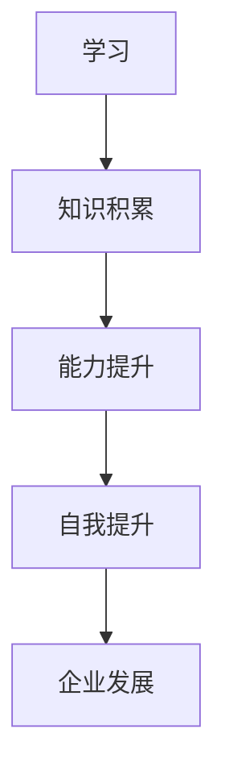

                 

# 创业者如何建立个人持续学习和自我提升机制

> 关键词：创业者、持续学习、自我提升、学习机制、个人成长

> 摘要：本文将探讨创业者如何建立个人持续学习和自我提升机制，通过理解学习的重要性、识别关键学习要素、构建学习计划、实践学习方法和评估学习成果，帮助创业者不断提升个人能力和竞争力。

## 1. 背景介绍

在当今快速发展的时代，创业者面临着前所未有的挑战和机遇。科技、市场和竞争环境的变化速度日益加快，创业者不仅需要具备创新思维和业务能力，还必须具备持续学习和自我提升的能力。持续学习不仅是个人成长的必要条件，更是创业者适应和引领变革的关键。本文将围绕创业者如何建立个人持续学习和自我提升机制展开讨论。

## 2. 核心概念与联系

### 2.1 学习的重要性

学习是人类获取知识、技能和经验的过程，对于创业者来说，学习尤为重要。学习不仅可以帮助创业者获取新的知识，还可以提高思维能力、创新能力、解决问题能力和决策能力。此外，学习还能帮助创业者适应市场变化、抓住机遇、规避风险。

### 2.2 自我提升的概念

自我提升是指通过不断学习和实践，提高个人能力和素质的过程。对于创业者而言，自我提升是持续学习和成长的必然结果。自我提升不仅可以帮助创业者实现个人价值，还可以增强创业团队的综合实力，提升企业的竞争力。

### 2.3 学习与自我提升的关系

学习和自我提升之间存在密切的联系。学习是自我提升的基础，只有通过不断学习，才能积累知识、提升能力。而自我提升则是学习的目的和结果，通过自我提升，创业者可以将所学知识转化为实际行动，实现个人和企业的持续发展。

### 2.4 Mermaid 流程图



## 3. 核心算法原理 & 具体操作步骤

### 3.1 确定学习目标

确定学习目标是建立个人持续学习和自我提升机制的第一步。创业者需要明确自己的学习目标，包括短期目标和长期目标。短期目标可以是学习一项新技能或知识，长期目标可以是提升个人综合素质或实现企业发展战略。

### 3.2 制定学习计划

制定学习计划是实现学习目标的关键。创业者需要根据学习目标，合理安排学习时间、学习内容和学习方法。学习计划应具有可操作性、可跟踪性和可评估性。

### 3.3 实践学习方法

实践学习方法包括自学、参加培训、请教专家、团队讨论等多种形式。创业者需要根据自己的实际情况和需求，选择合适的学习方法。

### 3.4 评估学习成果

评估学习成果是检验学习效果的重要环节。创业者需要定期评估自己的学习成果，包括知识掌握程度、技能运用水平、解决问题能力等。通过评估，创业者可以了解自己的学习效果，发现不足之处，并采取相应措施进行改进。

## 4. 数学模型和公式 & 详细讲解 & 举例说明

### 4.1 评估模型

为了更好地评估学习成果，我们可以使用以下评估模型：

$$
评估结果 = 知识掌握程度 \times 技能运用水平 \times 解决问题能力
$$

其中，知识掌握程度、技能运用水平和解决问题能力分别用 A、B 和 C 表示，它们的取值范围均为 [0,1]。

### 4.2 举例说明

假设创业者 A 在学习过程中，知识掌握程度为 0.8，技能运用水平为 0.7，解决问题能力为 0.6，则其评估结果为：

$$
评估结果 = 0.8 \times 0.7 \times 0.6 = 0.336
$$

这意味着创业者 A 的学习成果为 33.6%，需要进一步努力提升自己的学习效果。

## 5. 项目实战：代码实际案例和详细解释说明

### 5.1 开发环境搭建

为了更好地演示如何建立个人持续学习和自我提升机制，我们将在 Python 环境下编写一个简单的学习评估系统。

### 5.2 源代码详细实现和代码解读

以下是该学习评估系统的 Python 代码实现：

```python
# 学习评估系统

def evaluate-learning(results):
    """
    评估学习成果
    :param results: 学习结果，字典格式
    :return: 评估结果
    """
    knowledge = results['知识掌握程度']
    skill = results['技能运用水平']
    problem_solving = results['解决问题能力']
    
    score = knowledge * skill * problem_solving
    return score

# 测试代码
results = {
    '知识掌握程度': 0.8,
    '技能运用水平': 0.7,
    '解决问题能力': 0.6
}

score = evaluate-learning(results)
print(f'评估结果：{score:.2f}')
```

### 5.3 代码解读与分析

该学习评估系统包括一个名为 `evaluate-learning` 的函数，该函数接收一个名为 `results` 的字典作为参数，字典中包含三个键值对：`知识掌握程度`、`技能运用水平`和`解决问题能力`。函数通过计算这三个键值对的乘积，得到评估结果。

在测试代码中，我们创建了一个名为 `results` 的字典，并调用 `evaluate-learning` 函数，将 `results` 作为参数传递。函数返回的评估结果被打印到控制台。

## 6. 实际应用场景

创业者可以根据自身情况和需求，灵活运用本文介绍的方法和工具，建立个人持续学习和自我提升机制。以下是一些实际应用场景：

### 6.1 创业初期

在创业初期，创业者需要快速学习新知识和技能，以应对市场和业务需求。通过建立个人持续学习和自我提升机制，创业者可以不断提高自己的业务能力和管理水平。

### 6.2 创业中期

在创业中期，创业者需要关注团队建设和企业发展。通过建立个人持续学习和自我提升机制，创业者可以提升团队的综合素质，推动企业持续发展。

### 6.3 创业后期

在创业后期，创业者需要关注行业趋势和市场竞争。通过建立个人持续学习和自我提升机制，创业者可以保持对市场的敏锐洞察力，抓住机遇，规避风险。

## 7. 工具和资源推荐

### 7.1 学习资源推荐

1. 《深度学习》（Goodfellow et al.）：深度学习领域的经典教材，适合创业者了解深度学习原理和应用。
2. 《精益创业》（Eric Ries）：介绍创业方法论和实践经验的畅销书，适合创业者学习创业策略和操作技巧。
3. 《人类简史》（Yuval Noah Harari）：从历史角度分析人类发展历程，帮助创业者了解社会、文化和科技发展趋势。

### 7.2 开发工具框架推荐

1. TensorFlow：适用于深度学习和机器学习的开源框架，适合创业者进行人工智能应用开发。
2. Spring Boot：Java Web 开发的微服务框架，适合创业者构建企业级应用。
3. Docker：容器化技术，适合创业者进行应用部署和运维。

### 7.3 相关论文著作推荐

1. 《人工智能：一种现代的方法》（Stuart J. Russell & Peter Norvig）：人工智能领域的经典教材，适合创业者了解人工智能原理和应用。
2. 《大数据时代：思维变革与商业价值》（Viktor Mayer-Schönberger & Kenneth Cukier）：分析大数据时代的思维变革和商业价值，适合创业者了解大数据应用。
3. 《区块链：从数字货币到信用社会》（唐杰）：介绍区块链技术的原理和应用，适合创业者了解区块链技术。

## 8. 总结：未来发展趋势与挑战

未来，创业者面临的挑战将更加多样化和复杂化。随着科技、市场和竞争环境的变化，创业者需要具备更强的学习能力和自我提升能力，以适应和引领变革。同时，创业者也需要关注行业趋势和市场需求，不断创新和突破，实现企业的持续发展。

## 9. 附录：常见问题与解答

### 9.1 学习效果不佳怎么办？

- 检查学习计划是否合理，是否过于紧张或过于宽松；
- 调整学习方法，尝试多种学习方式，找到适合自己的学习方式；
- 定期评估学习成果，发现问题及时调整学习策略。

### 9.2 学习时间不够怎么办？

- 合理安排时间，将学习时间纳入日常计划；
- 利用碎片化时间进行学习，例如通勤、休息时间；
- 培养学习兴趣，提高学习效率。

## 10. 扩展阅读 & 参考资料

1. 《创业维艰》（Ben Horowitz）：介绍创业过程中的挑战和经验，适合创业者学习创业实战技巧。
2. 《智能时代》（周鸿祎）：探讨人工智能时代的发展趋势和影响，适合创业者了解智能时代下的机遇和挑战。
3. 《从零开始学编程》（李笑来）：介绍编程入门知识，适合创业者学习编程技能。

## 作者

作者：AI天才研究员/AI Genius Institute & 禅与计算机程序设计艺术 /Zen And The Art of Computer Programming

