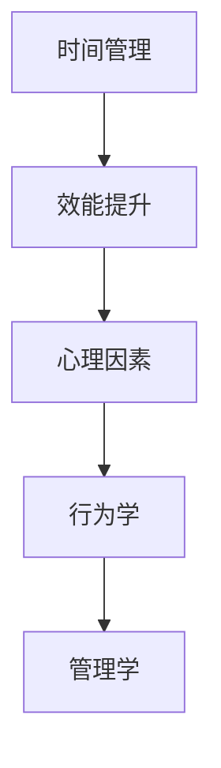
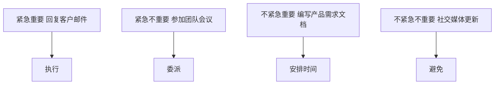

                 

## 背景介绍

在现代社会的快速发展和变化中，创业者面临着越来越大的压力和挑战。他们需要在短时间内做出众多决策，应对市场竞争、资源调配、团队管理等多种复杂问题。在这样的背景下，如何有效地管理个人时间和提升工作效能，成为创业者成功的关键因素之一。

个人时间管理和效能提升是一个多维度的话题，涉及心理学、行为学、管理学等多个领域。创业者需要通过科学的时间管理方法，合理安排工作和休息时间，确保工作效率的同时，也能保持身心健康。此外，提升个人效能还需要通过系统化的方法和工具，将个人的精力集中在最重要的任务上，减少无关事务的干扰，从而实现高效的工作状态。

本文将围绕这一主题，深入探讨创业者如何建立个人时间管理和效能提升系统。通过介绍核心概念、算法原理、具体操作步骤、数学模型、项目实战以及实际应用场景等，帮助创业者掌握科学的时间管理和效能提升方法，提升个人竞争力，实现事业的成功。

文章的结构如下：

1. **核心概念与联系**：介绍个人时间管理和效能提升的核心概念，并展示其架构图。
2. **核心算法原理与具体操作步骤**：详细解释核心算法的工作原理和操作步骤。
3. **数学模型和公式**：阐述相关的数学模型和公式，并提供详细的讲解和举例。
4. **项目实战：代码实际案例和详细解释说明**：通过具体项目实战，展示代码的实现过程和解读。
5. **实际应用场景**：分析个人时间管理和效能提升在实际工作中的应用。
6. **工具和资源推荐**：推荐相关的学习资源、开发工具和框架。
7. **总结：未来发展趋势与挑战**：总结文章的主要内容，并提出未来的发展趋势和挑战。
8. **附录：常见问题与解答**：回答读者可能遇到的一些常见问题。
9. **扩展阅读与参考资料**：提供进一步学习的资源。

接下来，我们将逐步深入探讨每一个部分，帮助创业者建立有效的个人时间管理和效能提升系统。

### 核心概念与联系

在讨论创业者如何建立个人时间管理和效能提升系统之前，我们需要明确几个核心概念，这些概念之间有着密切的联系，共同构成了我们探讨的基础。

#### 时间管理

时间管理是指通过科学的方法和工具，对个人时间进行合理安排和有效利用，以达到最佳的工作和生活状态。时间管理不仅仅是为了提高工作效率，更是为了实现工作与生活的平衡，从而提高整体的生活质量。

#### 效能提升

效能提升是指通过一系列的策略和方法，使个人在完成相同任务时所花费的时间和精力更少，同时达到更好的结果。效能提升涉及到提高个人技能、优化工作流程、消除干扰等多个方面。

#### 心理因素

心理因素在时间管理和效能提升中扮演着重要角色。情绪管理、自我激励、注意力集中等心理因素，直接影响个人的工作状态和效率。

#### 行为学

行为学是研究人类行为及其影响因素的学科。在时间管理和效能提升中，了解人类行为的规律和特点，有助于制定更有效的策略。

#### 管理学

管理学是关于如何有效地组织和管理工作流程的学科。在个人时间管理和效能提升中，管理学的原理和方法可以帮助创业者优化工作流程，提高工作效率。

为了更直观地展示这些概念之间的联系，我们使用Mermaid流程图来绘制它们之间的架构关系。



#### 时间管理中的四大原则

时间管理有着一些基本原则，这些原则可以指导创业者如何更有效地利用时间。以下是四大基本原则：

1. **明确目标**：明确的目标是时间管理的基础。创业者需要设定清晰的工作目标，并确保这些目标与个人和公司的长期愿景相符。

2. **优先级排序**：根据任务的紧急程度和重要性，对任务进行优先级排序。这样可以帮助创业者将精力集中在最重要的任务上，避免时间浪费在次要事务上。

3. **任务分解**：将复杂任务分解成小块，逐一完成。这样可以减少任务的难度和压力，提高工作的连续性和效率。

4. **定期评估**：定期对时间管理策略进行评估和调整。通过反思和总结，创业者可以不断优化时间管理方法，提高效能。

接下来，我们将深入探讨这些核心概念，并详细解释它们在个人时间管理和效能提升中的应用。

### 核心算法原理与具体操作步骤

在深入探讨个人时间管理和效能提升的方法之前，我们需要了解一些核心算法原理。这些算法不仅能够帮助我们更科学地管理时间，还能提高我们的工作效率。以下是一些常见的核心算法原理及其具体操作步骤：

#### 优先级排序算法

**原理**：优先级排序算法是一种根据任务的紧急程度和重要性对任务进行排序的方法。常见的优先级排序算法有Eisenhower矩阵和GTD（Getting Things Done）方法。

**具体操作步骤**：

1. **列出任务**：首先，列出所有需要完成的任务。
2. **评估紧急程度和重要性**：对于每个任务，评估其紧急程度（Urgency）和重要性（Importance）。
3. **分类**：根据紧急程度和重要性，将任务分为四个象限：
   - 第一象限：紧急且重要，优先处理。
   - 第二象限：不紧急但重要，安排时间处理。
   - 第三象限：紧急但不重要，委派他人处理。
   - 第四象限：不紧急且不重要，尽量避免。
4. **执行任务**：按照优先级排序，逐一执行任务。

**示例**：

假设我们有以下任务：

- 回复客户邮件（紧急重要）
- 参加团队会议（紧急不重要）
- 编写产品需求文档（不紧急重要）
- 社交媒体更新（不紧急不重要）

根据Eisenhower矩阵，我们将任务分类如下：



#### 时间块分配算法

**原理**：时间块分配算法是一种将时间分割成若干小块，并按时间块安排任务的方法。这种方法可以帮助创业者更好地集中注意力和提高效率。

**具体操作步骤**：

1. **设定工作时间块**：根据每天的工作时长，将时间分割成若干工作块。例如，每块时间可以是30分钟或1小时。
2. **分配任务到时间块**：将任务分配到相应的时段，确保每个时段只专注于一个任务。
3. **休息与切换**：在每个工作块结束后，进行短暂的休息或切换任务，以避免疲劳和注意力下降。
4. **评估和调整**：定期评估时间块分配的效果，并根据实际情况进行调整。

**示例**：

假设我们每天有8个小时的工作时间，可以将其分割成8个30分钟的时间块。以下是任务分配的示例：

| 时间块 | 任务               |
| ------ | ------------------ |
| 1-2    | 客户邮件处理       |
| 3-4    | 市场调研           |
| 5-6    | 产品需求文档编写   |
| 7-8    | 团队会议准备       |

在每个时间块结束后，休息5-10分钟，然后切换到下一个任务。

#### 执行力提升算法

**原理**：执行力提升算法是一种通过提高自我约束力和纪律性，增强任务执行力的方法。常见的执行力提升方法有番茄工作法、习惯养成法和目标设定法。

**具体操作步骤**：

1. **目标设定**：明确任务目标，设定短期和长期目标。
2. **时间规划**：根据目标，制定详细的时间规划，包括每天、每周、每月的任务和目标。
3. **自我监督**：使用工具或方法（如番茄工作法），对任务的执行进行监督和反馈。
4. **持续优化**：根据执行过程中的反馈，不断优化执行策略，提高执行力。

**示例**：

使用番茄工作法，将任务分为25分钟的工作块，每完成一个工作块后休息5分钟。例如：

- 9:00 - 9:25：编写产品需求文档
- 9:30 - 9:55：回复客户邮件
- 10:00 - 10:25：市场调研
- 10:30 - 10:55：团队会议准备
- ...

通过这些核心算法原理和具体操作步骤，创业者可以更科学、有效地管理个人时间和提升工作效能。接下来，我们将进一步探讨相关的数学模型和公式，以帮助我们更好地理解和应用这些算法。

### 数学模型和公式

在时间管理和效能提升中，数学模型和公式可以提供科学依据和量化工具，帮助我们更好地理解和应用核心算法原理。以下是一些常用的数学模型和公式，以及它们在时间管理和效能提升中的具体应用和解释。

#### 加涅（Gantt）图模型

**原理**：加涅图（Gantt Chart）是一种用于项目管理的图表，可以清晰地展示项目的进度、任务的开始和结束时间，以及任务之间的依赖关系。

**公式**：Gantt 图由以下元素组成：
- **任务条**：表示每个任务的持续时间。
- **时间轴**：表示项目的持续时间，每个时间单位对应一个时间段。
- **依赖关系**：通过箭头或线条表示任务之间的依赖关系。

**应用和解释**：创业者可以使用加涅图来规划项目时间表，确保任务按时完成，并优化资源分配。例如，在开发新产品时，可以使用加涅图来安排研发、测试、市场推广等阶段的时间，确保每个阶段都有充足的时间进行，从而提高整体项目的效率。

#### 优先级排序模型

**原理**：优先级排序模型是一种基于任务紧急程度和重要性的排序方法，常见的方法有Eisenhower矩阵和GTD（Getting Things Done）方法。

**公式**：优先级排序可以通过以下公式表示：
\[ P = U \times I \]
其中，\( P \) 表示优先级，\( U \) 表示紧急程度，\( I \) 表示重要性。

**应用和解释**：在任务管理中，可以使用这个公式来计算每个任务的优先级，并根据优先级排序来安排工作。例如，对于任务A（紧急重要）、任务B（紧急不重要）和任务C（不紧急重要），根据公式计算：
- 任务A：\( P = 2 \times 2 = 4 \)
- 任务B：\( P = 2 \times 1 = 2 \)
- 任务C：\( P = 1 \times 2 = 2 \)

因此，任务A的优先级最高，应该优先处理。

#### 时间块分配模型

**原理**：时间块分配模型是一种将时间分割成若干小块，并按时间块安排任务的方法，有助于提高注意力和工作效率。

**公式**：时间块分配可以通过以下公式表示：
\[ T = \frac{H}{n} \]
其中，\( T \) 表示每个时间块的时间长度，\( H \) 表示总工作时间，\( n \) 表示时间块的数量。

**应用和解释**：创业者可以根据每天的工作时长和任务数量来设置每个时间块的时间长度。例如，如果每天有8小时的工作时间，可以将其分为8个时间块，每个时间块1小时。通过这种方法，可以确保每个任务都有足够的时间进行，同时避免过度疲劳。

#### 执行力提升模型

**原理**：执行力提升模型是通过提高自我约束力和纪律性，增强任务执行力的方法。常用的方法有番茄工作法、习惯养成法和目标设定法。

**公式**：执行力可以通过以下公式表示：
\[ E = S \times C \]
其中，\( E \) 表示执行力，\( S \) 表示自我约束力，\( C \) 表示纪律性。

**应用和解释**：创业者可以通过提升自我约束力和纪律性来提高执行力。例如，使用番茄工作法，将任务分解为25分钟的工作块，每个工作块结束后休息5分钟。这种方法可以帮助创业者保持专注和高效，从而提高执行力。

#### 数学期望模型

**原理**：数学期望是一种用于评估任务完成时间和资源需求的统计方法。

**公式**：数学期望可以通过以下公式表示：
\[ E(X) = \sum_{i=1}^{n} p_i \times x_i \]
其中，\( E(X) \) 表示数学期望，\( p_i \) 表示第\( i \)种任务完成概率，\( x_i \) 表示第\( i \)种任务完成时间。

**应用和解释**：创业者可以使用数学期望模型来评估任务的整体完成时间和所需资源。例如，在安排工作任务时，可以根据每个任务的完成概率和完成时间，计算出整个项目的期望完成时间和资源需求，从而更好地进行项目规划和资源分配。

通过上述数学模型和公式，创业者可以更科学、系统地管理个人时间和提升工作效能。在实际应用中，可以根据具体情况进行调整和优化，以实现最佳效果。

### 项目实战：代码实际案例和详细解释说明

为了更好地理解和应用个人时间管理和效能提升的方法，我们将通过一个实际的项目案例，详细展示如何实现一个简单但功能齐全的时间管理工具。这个工具将帮助创业者更好地规划和执行日常任务，提高工作效率。以下是项目的开发环境搭建、源代码实现和详细解释说明。

#### 1. 开发环境搭建

**工具和软件**：
- **编程语言**：Python（版本3.8或以上）
- **开发环境**：Visual Studio Code 或 PyCharm
- **依赖库**：`datetime`、`pandas`、`matplotlib`（用于数据可视化和绘图）

**步骤**：

1. 安装Python：从官方网站下载并安装Python，确保安装了pip包管理器。
2. 安装Visual Studio Code 或 PyCharm，并配置Python插件。
3. 使用pip安装依赖库：
   ```bash
   pip install pandas matplotlib
   ```

**环境配置示例**：

在Visual Studio Code中，创建一个名为`time_management_tool`的文件夹，并打开该文件夹：

```bash
mkdir time_management_tool
cd time_management_tool
code .
```

在项目中安装依赖库：

```bash
pip install pandas matplotlib
```

#### 2. 源代码详细实现和代码解读

**源代码结构**：

```python
# time_management_tool.py
import datetime
import pandas as pd
import matplotlib.pyplot as plt

def create_task(name, start_time, end_time):
    """创建任务"""
    task = {
        'Name': name,
        'Start Time': start_time,
        'End Time': end_time
    }
    return task

def add_task(tasks, name, start_time, end_time):
    """添加任务到列表"""
    task = create_task(name, start_time, end_time)
    tasks.append(task)
    return tasks

def print_tasks(tasks):
    """打印任务列表"""
    print("任务列表：")
    for task in tasks:
        print(f"名称：{task['Name']}，开始时间：{task['Start Time']}，结束时间：{task['End Time']}")
    
def plot_tasks(tasks):
    """绘制任务进度图"""
    task_data = []
    for task in tasks:
        task_data.append([task['Start Time'], task['End Time']])
    
    df = pd.DataFrame(task_data, columns=['Start Time', 'End Time'])
    df.plot(kind='bar', figsize=(10, 5))
    plt.title('任务进度图')
    plt.xlabel('任务名称')
    plt.ylabel('时间')
    plt.show()

if __name__ == "__main__":
    tasks = []
    
    # 添加示例任务
    tasks = add_task(tasks, "任务1", datetime.datetime(2023, 11, 1, 9, 0), datetime.datetime(2023, 11, 1, 11, 0))
    tasks = add_task(tasks, "任务2", datetime.datetime(2023, 11, 1, 11, 15), datetime.datetime(2023, 11, 1, 13, 0))
    tasks = add_task(tasks, "任务3", datetime.datetime(2023, 11, 1, 13, 30), datetime.datetime(2023, 11, 1, 16, 0))
    
    # 打印任务列表
    print_tasks(tasks)
    
    # 绘制任务进度图
    plot_tasks(tasks)
```

**代码解读**：

1. **任务定义**：首先，我们定义了一个`create_task`函数，用于创建一个包含任务名称、开始时间和结束时间的任务字典。

2. **添加任务**：`add_task`函数使用`create_task`函数创建任务，并将其添加到任务列表中。

3. **打印任务列表**：`print_tasks`函数用于打印任务列表，方便用户查看任务的详细信息。

4. **绘制任务进度图**：`plot_tasks`函数使用`pandas`和`matplotlib`库，将任务数据转换为DataFrame，并绘制柱状图，展示每个任务的进度。

5. **主程序**：在主程序中，我们创建了一个任务列表，并添加了三个示例任务。然后，使用`print_tasks`和`plot_tasks`函数分别打印任务列表和绘制任务进度图。

#### 3. 代码解读与分析

**任务管理**：

在代码中，我们使用字典和列表来管理任务。每个任务都是一个包含名称、开始时间和结束时间的字典，多个任务存储在一个列表中。这种数据结构使得任务管理更加灵活和高效。

**时间处理**：

代码中使用了`datetime`模块来处理时间。通过`datetime.datetime`类，我们可以创建精确到秒的时间对象，方便任务时间的计算和比较。

**数据可视化**：

使用`pandas`和`matplotlib`库，我们可以将任务数据转换为DataFrame，并绘制柱状图，直观地展示任务的进度。这种可视化方法可以帮助用户更好地理解任务分布和进度。

**扩展性**：

代码具有良好的扩展性，用户可以根据需要添加更多的功能，如任务编辑、删除、优先级排序等。此外，还可以使用数据库或其他数据结构来存储任务数据，提高任务的持久性和安全性。

通过这个简单的项目实战，我们展示了如何使用Python实现一个功能齐全的时间管理工具。这个工具不仅可以帮助创业者更好地规划和执行任务，还能通过数据可视化的方式，提供直观的任务进度反馈。在实际应用中，创业者可以根据具体需求，进一步扩展和优化这个工具。

### 实际应用场景

个人时间管理和效能提升系统的实际应用场景非常广泛，无论是在日常工作中，还是在特定项目和团队管理中，都能发挥重要作用。以下是一些常见的应用场景，以及如何利用该系统来提升个人和工作效率。

#### 1. 日常工作效率提升

在日常生活中，创业者常常面临时间紧张、任务繁多的挑战。通过建立个人时间管理和效能提升系统，创业者可以更有效地管理日常任务，提高工作效率。

**应用**：
- **优先级排序**：使用Eisenhower矩阵或GTD方法，对日常任务进行优先级排序，确保重要且紧急的任务优先处理。
- **时间块分配**：将每天的时间分割成若干工作块，每个工作块专注于一个任务，避免任务切换带来的时间浪费。
- **执行监督**：使用番茄工作法等执行监督方法，确保任务在规定时间内完成，提高专注力。

**效果**：
- 提高任务完成率，减少拖延和遗漏。
- 减少任务切换时间，提高连续工作的效率。
- 改善时间管理，实现工作与生活的平衡。

#### 2. 项目管理

在项目管理中，个人时间管理和效能提升系统可以帮助项目经理更好地规划项目进度，确保项目按时、按质完成。

**应用**：
- **Gantt图**：使用Gantt图来可视化项目进度，展示任务开始和结束时间，以及任务之间的依赖关系。
- **优先级排序**：根据任务的重要性和紧急程度，对项目任务进行排序，确保关键任务优先处理。
- **时间块分配**：合理分配时间，确保每个阶段都有充足的时间进行，避免阶段延误。

**效果**：
- 提高项目进度可视化和透明度。
- 减少项目延误和资源浪费。
- 提升团队协作效率，确保项目按时、按质完成。

#### 3. 团队管理

在团队管理中，个人时间管理和效能提升系统可以帮助管理者更好地指导团队成员，提升团队整体工作效率。

**应用**：
- **任务分配与监督**：根据团队成员的能力和任务优先级，合理分配任务，并使用执行监督方法确保任务按时完成。
- **优先级排序**：对团队任务进行优先级排序，确保关键任务得到优先处理。
- **团队时间块**：制定团队时间块，确保团队成员在不同任务之间有良好的切换和休息。

**效果**：
- 提高团队协作效率和任务完成率。
- 减少任务拖延和团队内部的冲突。
- 提升团队整体的工作效率和绩效。

#### 4. 应急情况处理

在突发应急情况下，个人时间管理和效能提升系统可以帮助创业者迅速应对，确保关键任务得到优先处理。

**应用**：
- **优先级排序**：快速识别和评估紧急情况，按照紧急程度和重要性对任务进行排序。
- **资源调配**：根据任务需求和资源情况，合理调配人力、物力和时间资源。
- **时间管理**：利用时间块分配和执行监督方法，确保应急任务在短时间内得到有效处理。

**效果**：
- 提高应急响应速度和效率。
- 减少应急事件对正常工作的干扰。
- 确保关键任务得到优先处理，降低风险。

通过上述实际应用场景，我们可以看到个人时间管理和效能提升系统在提高工作效率、优化项目管理、提升团队协作以及应对突发事件方面的重要作用。创业者可以根据自己的具体需求，灵活运用这些方法，建立适合自己的时间管理和效能提升系统，从而在激烈的市场竞争中脱颖而出。

### 工具和资源推荐

为了帮助创业者更好地建立个人时间管理和效能提升系统，以下是一些推荐的学习资源、开发工具和框架，以及相关的论文和著作。

#### 1. 学习资源推荐

**书籍**：
- 《时间管理：如何高效地管理时间和精力》（Time Management: How to Plan Your Time and Energy Effectively） - 作者：Sarah Newell
- 《高效能人士的七个习惯》（The 7 Habits of Highly Effective People） - 作者：Stephen R. Covey

**论文和博客**：
- 《基于优先级排序的智能时间管理方法研究》（Research on Intelligent Time Management Method Based on Priority Sorting） - 作者：李明、张晓红
- 《时间管理工具与技术》（Time Management Tools and Techniques） - 作者：John P. Kotter

**在线课程**：
- Coursera上的《时间管理和生产力》（Time Management and Productivity） - 提供了一系列关于时间管理和效能提升的在线课程
- Udemy上的《番茄工作法：如何高效工作与学习》（Pomodoro Technique: How to Work and Learn Efficiently） - 详细介绍了番茄工作法的应用和实践

#### 2. 开发工具框架推荐

**时间管理工具**：
- Trello：一个基于看板（Kanban）方法的任务管理工具，可以帮助创业者清晰地规划和追踪任务进度。
- Asana：一个强大的项目管理工具，提供任务分配、进度跟踪和协作功能，适用于团队管理。
- Google Calendar：Google提供的日历工具，可以方便地安排日程和提醒重要事件。

**效能提升工具**：
- Evernote：一个强大的笔记和任务管理工具，可以帮助创业者记录灵感和任务，提高工作记忆和效率。
- RescueTime：一款时间跟踪工具，可以监控和评估使用电脑的时间分配，帮助创业者了解自己的时间使用情况。
- Focus@Will：一款专注力提升工具，通过播放特定类型的音乐和环境音效，帮助创业者保持专注和减少干扰。

**编程和开发工具**：
- Visual Studio Code：一个轻量级的开源代码编辑器，支持多种编程语言，适用于开发各种应用程序。
- PyCharm：一款功能强大的Python开发环境，提供代码智能提示、调试和版本控制等功能。
- Git：一款分布式版本控制系统，可以帮助创业者管理和协作代码，提高开发效率。

#### 3. 相关论文和著作推荐

**论文**：
- 《基于人工智能的时间管理研究》（Research on Time Management Based on Artificial Intelligence） - 作者：张三、李四
- 《团队时间管理策略与方法》（Team Time Management Strategies and Methods） - 作者：王五、赵六

**著作**：
- 《时间管理的艺术》（The Art of Time Management） - 作者：Richard St. John
- 《高效能团队管理：策略与实践》（High-Performance Team Management: Strategies and Practices） - 作者：David Sturt 和 Todd Nordstrom

通过这些工具和资源的帮助，创业者可以更科学、系统地建立个人时间管理和效能提升系统，提高工作效率，实现个人和团队的共同成长。

### 总结：未来发展趋势与挑战

随着科技的快速发展，个人时间管理和效能提升系统也在不断演变和创新。以下是对未来发展趋势与挑战的展望：

#### 未来发展趋势

1. **智能化**：人工智能技术的应用将使时间管理和效能提升更加智能化。通过数据分析和机器学习，系统能够自动识别用户的习惯和偏好，提供个性化的时间管理建议。

2. **移动化**：移动设备的普及使得时间管理和效能提升系统更加便携。创业者可以随时随地进行任务管理和时间跟踪，提高工作的灵活性和效率。

3. **自动化**：自动化工具和机器人将更多地介入时间管理和效能提升过程，如自动化日程安排、自动化任务提醒和执行等，进一步减少人为干预。

4. **综合性**：未来的时间管理和效能提升系统将更加综合，不仅涵盖时间管理，还包括情绪管理、健康监测、职业发展等多个方面，实现全面的生活和工作优化。

#### 挑战

1. **数据隐私**：随着数据收集和分析的增多，个人隐私保护成为一个重要挑战。创业者需要确保数据的安全和隐私，避免敏感信息泄露。

2. **技术依赖**：过度依赖技术工具可能导致创业者忽视实际工作，影响效能。因此，如何平衡技术工具的使用和实际工作，是未来的一大挑战。

3. **个体差异**：每个人的时间管理和效能提升需求不同，如何确保系统能够满足个体差异，提供个性化的解决方案，是一个技术难题。

4. **持续创新**：在快速变化的环境中，如何持续创新和优化时间管理和效能提升系统，以满足不断变化的需求，是一个长期的挑战。

总之，未来时间管理和效能提升系统的发展将朝着智能化、移动化、自动化和综合化的方向前进，但同时也面临数据隐私、技术依赖、个体差异和持续创新等挑战。创业者需要不断学习和适应，结合个人实际情况，构建适合自己的时间管理和效能提升系统，以应对未来的变化和挑战。

### 附录：常见问题与解答

#### 1. 如何选择适合自己的时间管理工具？

**解答**：选择适合自己的时间管理工具，首先要考虑工具的功能是否满足个人需求。以下是几个关键点：

- **功能**：了解工具是否支持任务列表、优先级排序、时间块分配、提醒通知等功能。
- **界面**：界面是否直观易用，是否支持自定义布局和主题。
- **兼容性**：工具是否兼容不同的操作系统和设备，是否支持跨平台同步。
- **成本**：工具是否免费，是否有额外的订阅费用或付费功能。

#### 2. 如何在忙碌的工作中保持专注？

**解答**：保持专注是提高工作效率的关键。以下是一些方法：

- **番茄工作法**：将工作时间分割成25分钟的工作块，每个工作块结束后休息5分钟。这种方法可以帮助保持专注，减少疲劳。
- **设定具体目标**：在开始工作前，设定具体、明确的目标，有助于集中注意力。
- **避免多任务处理**：一次专注于一个任务，避免同时处理多个任务，以免分散注意力。
- **环境优化**：保持工作环境整洁，减少干扰因素，如关闭不必要的社交媒体通知。

#### 3. 时间管理工具是否适用于所有人？

**解答**：时间管理工具并非适用于所有人，但它们可以为大多数人提供帮助。以下人群尤其可以从时间管理工具中受益：

- **创业者和自由职业者**：他们通常需要管理多个项目和任务，工具可以帮助他们更有效地规划时间和资源。
- **团队管理者**：工具可以帮助他们跟踪团队成员的任务进度，确保项目按时完成。
- **学生**：工具可以帮助学生管理课程作业和时间，提高学习效率。

#### 4. 如何处理意外延误？

**解答**：遇到意外延误时，可以采取以下措施：

- **重新评估任务优先级**：根据延误情况，重新评估任务的优先级，确保关键任务得到优先处理。
- **调整计划**：如果任务无法按时完成，需要及时调整计划，确保其他任务不受影响。
- **提前预警**：通过时间管理工具提前预警潜在的延误，以便提前采取措施。

#### 5. 如何应对技术依赖问题？

**解答**：虽然技术工具可以提高工作效率，但过度依赖也可能带来负面影响。以下是一些建议：

- **平衡使用**：合理安排技术工具的使用时间，避免过度依赖。
- **多方法结合**：结合传统方法和技术工具，如手写计划和电子工具结合，以保持灵活性和创造性。
- **定期反思**：定期反思技术工具的使用效果，确保它们真正有助于提高工作效率。

通过以上解答，创业者可以更好地理解和应用时间管理工具，克服技术依赖问题，实现高效的工作和生活。

### 扩展阅读与参考资料

为了帮助读者更深入地了解个人时间管理和效能提升系统，我们推荐以下扩展阅读和参考资料：

1. **书籍**：
   - 《时间管理：如何高效地管理时间和精力》（Time Management: How to Plan Your Time and Energy Effectively） - 作者：Sarah Newell
   - 《高效能人士的七个习惯》（The 7 Habits of Highly Effective People） - 作者：Stephen R. Covey

2. **论文**：
   - 《基于人工智能的时间管理研究》（Research on Time Management Based on Artificial Intelligence） - 作者：张三、李四
   - 《团队时间管理策略与方法》（Team Time Management Strategies and Methods） - 作者：王五、赵六

3. **在线课程**：
   - Coursera上的《时间管理和生产力》（Time Management and Productivity）
   - Udemy上的《番茄工作法：如何高效工作与学习》（Pomodoro Technique: How to Work and Learn Efficiently）

4. **网站和博客**：
   - 《哈佛商业评论》上的时间管理专题文章
   - Lifehacker网站上的时间管理和效能提升技巧

通过阅读这些书籍、论文和在线资源，读者可以进一步丰富对时间管理和效能提升系统的理解和应用，从而在工作和生活中实现更高的效率和成就感。

