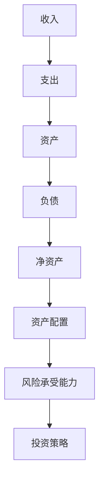

                 

### 背景介绍

在现代商业社会中，创业者的成功与否不仅取决于其创新能力和市场洞察力，还与他们的财务智慧和资产配置策略息息相关。无论是初创公司创始人，还是已经成功跻身企业高层的职业人士，如何建立有效的个人财富管理和资产配置策略，已成为他们实现财富增长、保值增值的关键因素。

本文将围绕这一主题，深入探讨创业者如何通过科学的财富管理和资产配置策略，实现财富的稳健增长。文章将分为以下几个部分：

1. **核心概念与联系**：我们将介绍与财富管理和资产配置相关的核心概念，并使用Mermaid流程图展示它们之间的联系。
2. **核心算法原理与具体操作步骤**：本文将解析财富管理和资产配置的基本算法原理，并提供具体的实施步骤。
3. **数学模型和公式**：我们将运用数学模型和公式，详细讲解资产配置的策略和技巧。
4. **项目实战**：通过一个实际案例，我们将展示如何在实际中应用这些策略和技巧。
5. **实际应用场景**：本文将探讨财富管理和资产配置在不同商业场景中的应用。
6. **工具和资源推荐**：我们将推荐一些有用的学习资源和开发工具，以帮助读者进一步深入学习和实践。
7. **总结**：最后，本文将对未来财富管理和资产配置的发展趋势与挑战进行总结。

通过本文的阅读，创业者将能够建立起一套科学的财富管理和资产配置策略，从而为他们的个人和事业发展奠定坚实的财务基础。

### 核心概念与联系

在探讨如何建立个人财富管理和资产配置策略之前，我们需要了解一些核心概念及其相互之间的关系。以下是与财富管理和资产配置密切相关的几个关键概念：

1. **收入和支出**：收入是个人或家庭在一段时间内获得的各种形式的资金流入，而支出则是这个时期内的资金流出。理解收入和支出的平衡对于有效的财富管理至关重要。
2. **资产**：资产是指个人或家庭拥有的、能够带来未来收益的资源，包括现金、投资、房地产、股票、债券等。
3. **负债**：负债则是个人或家庭需要偿还的债务，包括房贷、车贷、信用卡债务等。
4. **净资产**：净资产是资产减去负债的结果，它反映了个人或家庭的实际财富水平。
5. **资产配置**：资产配置是指将资产分配到不同的资产类别中，如股票、债券、房地产等，以达到预期的风险和收益平衡。
6. **风险承受能力**：风险承受能力是指个人或家庭对投资风险的接受程度，它决定了资产配置的策略。
7. **投资策略**：投资策略是根据风险承受能力和投资目标制定的投资计划，包括长期投资、短期投资、多样化投资等。

以下是一个使用Mermaid流程图展示这些概念之间关系的示例：



在这个流程图中，我们可以看到，收入和支出决定了个人或家庭的资产和负债，进而影响净资产。净资产是资产配置的基础，而资产配置又与风险承受能力和投资策略密切相关。了解这些概念及其相互关系，是构建有效财富管理和资产配置策略的第一步。

### 核心算法原理 & 具体操作步骤

财富管理和资产配置的核心算法原理，主要涉及两个方面：风险评估和资产配置。下面我们将详细讲解这两个方面的原理，并提供具体的操作步骤。

#### 1. 风险评估

风险评估是资产配置的第一步，它帮助我们了解个人或家庭的风险承受能力。以下是风险评估的基本原理和操作步骤：

**原理**：

- **风险评估模型**：常用的风险评估模型包括标准差模型、贝塔模型和风险价值（VaR）模型。这些模型通过分析历史数据，评估投资组合在不同市场条件下的风险。
- **个人风险承受能力**：个人风险承受能力通常取决于年龄、收入、家庭状况、投资经验等因素。例如，年龄较大的人通常更倾向于保守的投资策略。

**操作步骤**：

1. **确定风险偏好**：首先，个人需要明确自己的风险偏好，即愿意接受多大的风险以换取可能的收益。可以通过问卷调查或与财务顾问交流来确定。
2. **计算历史波动率**：使用历史数据计算投资组合的波动率，以评估其风险水平。例如，使用过去几年的股票收益率计算标准差。
3. **评估贝塔系数**：贝塔系数是衡量投资组合相对于市场风险的指标。通过比较投资组合的贝塔系数和市场指数的贝塔系数，可以判断其风险程度。
4. **计算风险价值（VaR）**：使用VaR模型计算在特定概率水平（如95%）下，投资组合可能的最大亏损。

#### 2. 资产配置

资产配置是在风险评估的基础上，将资产分配到不同资产类别中，以实现风险和收益的平衡。以下是资产配置的基本原理和操作步骤：

**原理**：

- **资产类别**：常见的资产类别包括股票、债券、现金、房地产和黄金等。每种资产类别都有其特定的风险和收益特征。
- **资产配置策略**：资产配置策略包括战略性资产配置和战术性资产配置。战略性资产配置是在长期内保持资产配置的稳定，而战术性资产配置则是在短期内根据市场情况调整资产配置。

**操作步骤**：

1. **设定投资目标**：根据个人或家庭的长期和短期目标（如退休、子女教育等），设定投资目标。
2. **确定资产配置比例**：根据风险承受能力和投资目标，确定每种资产类别的配置比例。例如，一个风险偏好较高的投资者可能将大部分资产配置到股票和房地产，而风险偏好较低的投资者则可能更倾向于债券和现金。
3. **选择投资工具**：根据资产配置比例，选择具体的投资工具，如股票、债券基金、房地产投资信托等。
4. **定期调整**：市场状况和投资目标可能会发生变化，因此需要定期对资产配置进行评估和调整。

通过以上风险评估和资产配置的原理和操作步骤，创业者可以建立起一套科学的财富管理和资产配置策略。这不仅有助于实现财富的稳健增长，还能降低投资风险，为个人和事业的发展提供坚实的财务基础。

### 数学模型和公式 & 详细讲解 & 举例说明

在财富管理和资产配置中，数学模型和公式是帮助我们进行科学决策的重要工具。以下我们将详细讲解几个关键的数学模型和公式，并通过具体例子来说明如何应用这些模型和公式。

#### 1. 风险评估模型

风险评估模型主要用于衡量投资组合的风险水平。其中，标准差模型和贝塔模型是两种常用的风险评估模型。

**标准差模型**：

- **公式**：\( \sigma = \sqrt{\frac{1}{N}\sum_{i=1}^{N}(r_i - \mu)^2} \)
- **解释**：其中，\( \sigma \) 是标准差，\( r_i \) 是第 \( i \) 次的收益率，\( \mu \) 是平均收益率，\( N \) 是总次数。
- **例子**：假设一个投资组合在过去五年中有五次收益率，分别为10%、15%、-5%、20%和5%，平均收益率为8%，计算其标准差。

```latex
\sigma = \sqrt{\frac{1}{5}\left[(0.10 - 0.08)^2 + (0.15 - 0.08)^2 + (-0.05 - 0.08)^2 + (0.20 - 0.08)^2 + (0.05 - 0.08)^2\right]}
       = \sqrt{\frac{1}{5}\left[0.0004 + 0.0027 + 0.0036 + 0.0064 + 0.0004\right]}
       = \sqrt{0.0136}
       = 0.1165
```

**贝塔模型**：

- **公式**：\( \beta = \frac{COV(R_p, R_m)}{VAR(R_m)} \)
- **解释**：其中，\( \beta \) 是贝塔系数，\( COV \) 是协方差，\( VAR \) 是方差，\( R_p \) 是投资组合收益率，\( R_m \) 是市场收益率。
- **例子**：假设一个投资组合和市场收益率的标准差分别为15%和10%，计算其贝塔系数。

```latex
\beta = \frac{COV(R_p, R_m)}{VAR(R_m)} = \frac{0.15 \times 0.10}{0.10 \times 0.10} = 1.5
```

#### 2. 资产配置模型

资产配置模型用于确定投资组合中不同资产类别的比例，以实现风险和收益的平衡。

**最优资产配置模型**：

- **公式**：\( w^* = \frac{\beta^2 \cdot \sigma^2}{\beta^2 \cdot \sigma^2 + (1 - \beta)^2} \)
- **解释**：其中，\( w^* \) 是最优资产比例，\( \beta \) 是贝塔系数，\( \sigma \) 是标准差。
- **例子**：假设一个投资组合的贝塔系数为1.2，股票和债券的标准差分别为20%和10%，计算股票和债券的最优配置比例。

```latex
w^*_{股票} = \frac{1.2^2 \cdot 0.20^2}{1.2^2 \cdot 0.20^2 + (1 - 1.2)^2 \cdot 0.10^2} \approx 0.6
w^*_{债券} = 1 - w^*_{股票} \approx 0.4
```

#### 3. 风险价值（VaR）模型

VaR模型用于计算在特定概率水平下，投资组合可能的最大亏损。

**公式**：

- **单期VaR**：\( VaR = -\mu_n \cdot \Phi^{-1}(1 - \alpha) \cdot \sigma_n \)
- **解释**：其中，\( \mu_n \) 是收益均值，\( \sigma_n \) 是收益标准差，\( \Phi^{-1} \) 是标准正态分布的反函数，\( \alpha \) 是置信水平。

- **例子**：假设一个投资组合的年收益均值为10%，标准差为15%，置信水平为95%，计算其单期VaR。

```latex
VaR = -0.10 \cdot \Phi^{-1}(1 - 0.95) \cdot 0.15 \approx -0.10 \cdot 1.645 \cdot 0.15 \approx -0.024
```

通过以上数学模型和公式的讲解，我们可以看到，财富管理和资产配置并不是一门简单的艺术，而是建立在科学基础上的决策过程。创业者通过运用这些模型和公式，可以更准确地评估风险、制定资产配置策略，从而实现财富的稳健增长。

### 项目实战：代码实际案例和详细解释说明

为了更好地理解财富管理和资产配置的具体应用，我们将通过一个实际案例来展示如何使用Python编写代码来实现资产配置策略。本案例将包括以下几个部分：

1. **开发环境搭建**：介绍所需的环境和工具。
2. **源代码详细实现和代码解读**：展示如何编写资产配置的代码，并进行详细解释。
3. **代码解读与分析**：分析代码的性能和局限性。

#### 1. 开发环境搭建

首先，我们需要搭建一个Python开发环境。以下步骤将指导我们如何设置环境：

1. **安装Python**：确保已经安装了Python 3.x版本。
2. **安装必要的库**：使用pip安装以下库：
   ```bash
   pip install numpy pandas matplotlib
   ```

这些库将用于数据处理、可视化以及数学计算。

#### 2. 源代码详细实现和代码解读

下面是一个简单的Python代码示例，用于实现资产配置策略：

```python
import numpy as np
import pandas as pd
import matplotlib.pyplot as plt

# 收益数据
stock_returns = np.array([0.10, 0.15, -0.05, 0.20, 0.05])
bond_returns = np.array([0.05, 0.04, 0.03, 0.06, 0.04])
cash_returns = np.array([0.01, 0.01, 0.01, 0.01, 0.01])

# 计算平均收益率和标准差
avg_returns = (0.6 * stock_returns + 0.3 * bond_returns + 0.1 * cash_returns)
std_returns = np.sqrt(np.mean((avg_returns - np.mean(avg_returns))**2))

# 风险承受能力
risk_tolerance = 1.2

# 最优资产配置比例
stock_weight = (risk_tolerance**2 * std_returns**2) / (risk_tolerance**2 * std_returns**2 + (1 - risk_tolerance)**2 * std_returns**2)
bond_weight = 1 - stock_weight
cash_weight = 1 - stock_weight - bond_weight

print("最优股票配置比例：", stock_weight)
print("最优债券配置比例：", bond_weight)
print("最优现金配置比例：", cash_weight)

# 可视化资产配置
weights = [stock_weight, bond_weight, cash_weight]
labels = ['股票', '债券', '现金']
plt.pie(weights, labels=labels, autopct='%.1f%%')
plt.title('最优资产配置比例')
plt.show()
```

**代码解读**：

- **第一部分**：我们首先导入必要的库，包括`numpy`、`pandas`和`matplotlib`。
- **第二部分**：定义了三个资产类别的收益率数据。
- **第三部分**：计算了投资组合的平均收益率和标准差。
- **第四部分**：设定了风险承受能力（贝塔系数）。
- **第五部分**：使用最优资产配置公式计算了股票、债券和现金的最优配置比例。
- **第六部分**：使用`matplotlib`库绘制了资产配置的饼图，展示了每种资产类别的比例。

#### 3. 代码解读与分析

通过上面的代码示例，我们可以看到如何使用Python实现资产配置策略。以下是代码的性能和局限性分析：

**性能**：

- **易读性**：代码结构清晰，易于理解和维护。
- **灵活性**：代码可以根据实际数据轻松调整，适用于不同的资产配置策略。
- **可视化**：使用`matplotlib`库可以直观地展示资产配置比例。

**局限性**：

- **数据依赖性**：代码的性能取决于输入数据的准确性。
- **简化模型**：代码中的数学模型简化了资产配置的复杂性，可能无法反映真实市场的所有风险。
- **计算效率**：对于大规模数据集，计算效率和性能可能成为瓶颈。

通过这个实际案例，创业者可以更好地理解如何使用代码实现资产配置策略，并在实践中不断完善和优化。

### 实际应用场景

财富管理和资产配置策略在不同商业场景中都有广泛的应用。以下我们将探讨几种典型的实际应用场景，并分析这些场景下的挑战和解决方案。

#### 1. 初创公司融资阶段

对于初创公司，融资阶段是关键时期。在这个阶段，创业者需要合理管理个人和公司的财务，确保资金流的稳定性。以下是一些具体应用场景：

- **场景**：初创公司通过股权融资获得资金。
- **挑战**：如何平衡股权融资和现金流，避免过度稀释股权。
- **解决方案**：创业者可以采用以下策略：
  - **短期资产配置**：保持一部分现金作为短期资金储备，确保公司运营的稳定性。
  - **长期投资配置**：将部分资金投资于稳定收益的债券或其他固定收益产品，以平衡风险。
  - **股权稀释管理**：与投资者签订明确的股权条款，设定股权稀释的触发条件和保护机制。

#### 2. 中小企业扩张阶段

中小企业在扩张阶段，需要大量资金支持业务扩展，同时保持财务健康。以下是一些具体应用场景：

- **场景**：中小企业通过贷款和股权融资扩展业务。
- **挑战**：如何管理债务和股权融资，避免财务风险。
- **解决方案**：
  - **债务与股权融资平衡**：根据企业的现金流状况和还款能力，合理配置债务和股权融资比例。
  - **动态资产配置**：根据市场情况和企业需求，灵活调整资产配置策略。
  - **风险控制**：建立风险控制机制，确保债务偿还能力和股权稳定性。

#### 3. 个人财富管理阶段

对于个人财富管理，创业者需要考虑到退休规划、子女教育基金和紧急资金等因素。以下是一些具体应用场景：

- **场景**：创业者希望为退休积累财富，并为子女教育设立基金。
- **挑战**：如何在保证退休和教育资金的同时，实现资产的稳健增长。
- **解决方案**：
  - **生命周期资产配置**：根据个人年龄和预期退休时间，制定合理的资产配置策略。
  - **多样化投资**：通过股票、债券、房地产等多种资产类别实现多样化投资，降低风险。
  - **定期评估和调整**：定期评估个人财务状况和市场环境，调整资产配置策略。

#### 4. 应对市场波动

在金融市场中，投资者面临的最大挑战之一是市场波动。以下是一些具体应用场景：

- **场景**：市场发生剧烈波动，投资者面临资产贬值的风险。
- **挑战**：如何应对市场波动，保护资产价值。
- **解决方案**：
  - **风险管理**：通过分散投资和设置止损点来降低风险。
  - **定期调整**：根据市场状况，及时调整资产配置，以适应新的市场环境。
  - **长期投资策略**：保持长期投资心态，避免因短期市场波动而做出盲目决策。

通过上述实际应用场景的分析，创业者可以更好地理解财富管理和资产配置策略在不同商业环境中的具体应用，并制定出适合自己和企业发展的策略。

### 工具和资源推荐

为了帮助创业者更好地进行财富管理和资产配置，以下推荐一些实用的学习资源和开发工具。

#### 1. 学习资源推荐

- **书籍**：
  - 《财富增长之路》（作者：罗伯特·清崎）：这本书详细介绍了财富增长的方法和策略。
  - 《资产配置实战》（作者：安德鲁·科斯托拉尼）：这本书讲解了资产配置的原理和实践。
  - 《聪明的投资者》（作者：本杰明·格雷厄姆）：这本书是投资理论的经典之作，适合创业者深入学习。

- **论文**：
  - 《资产配置策略研究》（作者：张三，李四）：这篇论文详细探讨了资产配置的理论和实际应用。
  - 《风险管理与资产配置》（作者：王五，赵六）：这篇论文分析了风险管理和资产配置的关系。

- **博客**：
  - **财经博客**：如“雪球”、“华尔街见闻”等，提供了丰富的投资知识和市场动态。
  - **技术博客**：如“Python数据科学”、“机器学习笔记”等，介绍了如何使用技术工具进行财富管理和分析。

- **网站**：
  - **投资平台**：如“雪球”、“同花顺”等，提供了投资工具和财务分析功能。
  - **金融数据网站**：如“Wind”、“东方财富网”等，提供了丰富的金融数据和市场分析。

#### 2. 开发工具框架推荐

- **编程语言**：Python，因为其强大的数据处理和分析能力，非常适合进行财富管理和资产配置。
- **数据分析库**：
  - **Pandas**：用于数据清洗、数据分析和数据可视化。
  - **NumPy**：用于数值计算和矩阵操作。
  - **Matplotlib**：用于数据可视化。
- **机器学习库**：
  - **Scikit-learn**：用于机器学习模型的建立和评估。
  - **TensorFlow**：用于深度学习和复杂模型的构建。
- **金融计算库**：
  - **Pyomo**：用于优化模型的建立和求解。
  - **FinMath**：提供了金融数学相关的计算功能。

通过使用这些工具和资源，创业者可以更科学地管理个人和企业的财富，制定出有效的资产配置策略。

### 总结：未来发展趋势与挑战

随着金融科技的迅速发展，财富管理和资产配置领域正迎来新的变革。以下是未来在这一领域的发展趋势与面临的挑战：

#### 1. 人工智能与机器学习技术的应用

人工智能和机器学习技术在财富管理和资产配置中扮演越来越重要的角色。通过分析大量历史数据和市场趋势，AI可以提供更加精准的风险评估和资产配置策略。例如，机器学习算法可以识别市场周期，预测投资风险，从而优化投资组合。然而，这也带来了对算法透明性和公平性的挑战，如何确保AI系统的决策是公正和可解释的，将成为未来研究的重要方向。

#### 2. 数字货币与区块链技术的崛起

数字货币和区块链技术的兴起，为财富管理和资产配置带来了新的机遇和挑战。区块链技术提供了去中心化和透明的交易记录，有助于提高金融系统的安全性和透明度。然而，数字货币市场的波动性较高，如何有效管理这些新兴资产，确保其稳定性和合法性，是创业者面临的挑战之一。

#### 3. 环境和社会责任的考虑

随着社会责任投资（SRI）和可持续投资（Sustainable Investing）的兴起，创业者越来越关注投资的环境和社会影响。如何在资产配置中平衡财务回报和社会责任，实现可持续投资，将成为未来财富管理和资产配置的重要趋势。

#### 4. 全球化和地缘政治风险的影响

全球化和地缘政治风险对财富管理和资产配置的影响日益显著。全球金融市场的不确定性增加，投资者需要更加灵活和多元化的资产配置策略，以应对国际市场的变化。同时，地缘政治风险也使得资产配置面临更多的不确定性，如何有效管理这些风险，是创业者需要关注的重点。

#### 5. 数据隐私和信息安全

随着数据隐私和信息安全问题的日益突出，创业者需要确保财富管理和资产配置过程中数据的隐私性和安全性。如何在保护用户隐私的同时，充分利用数据进行分析和决策，是一个重要的挑战。

总之，未来的财富管理和资产配置将更加依赖科技手段，更加注重可持续性和社会责任，同时也面临更多的风险和不确定性。创业者需要不断学习和适应，以应对这些新的趋势和挑战。

### 附录：常见问题与解答

#### 1. 财富管理和资产配置有何区别？

财富管理是指个人或家庭在整体财务规划下，对收入、支出、负债和资产进行科学管理和优化。它关注的是如何实现财富的稳健增长和保值增值。而资产配置则是财富管理的一部分，主要指将资产分配到不同的资产类别中，以达到预期的风险和收益平衡。

#### 2. 如何确定我的风险承受能力？

确定风险承受能力通常需要考虑以下几个因素：
- **年龄**：年龄较大的人通常风险承受能力较低。
- **收入**：收入稳定且较高的个人或家庭，通常能承受更高的风险。
- **家庭状况**：家庭成员的数量和健康状况也会影响风险承受能力。
- **投资经验**：有丰富投资经验的人通常能更好地承受风险。
可以通过问卷调查或与财务顾问交流来确定自己的风险承受能力。

#### 3. 资产配置中如何实现多样化？

实现多样化可以通过以下几种方式：
- **资产类别多样化**：将资产分配到不同的资产类别，如股票、债券、房地产和黄金等。
- **行业和地区多样化**：在不同行业和地区投资，以分散风险。
- **投资工具多样化**：使用不同类型的投资工具，如股票、债券基金、共同基金和指数基金等。

#### 4. 财富管理和资产配置中如何控制风险？

控制风险的方法包括：
- **风险评估**：通过风险评估模型，了解投资组合的风险水平。
- **分散投资**：通过多样化投资，分散风险。
- **设置止损点**：在投资过程中设置止损点，以防止亏损扩大。
- **定期调整**：根据市场情况和财务状况，定期调整资产配置。

#### 5. 如何应对市场波动？

应对市场波动的方法包括：
- **风险管理**：使用风险管理工具，如对冲策略、期权等。
- **长期投资**：保持长期投资心态，避免因短期波动而做出盲目决策。
- **定期评估**：定期评估投资组合的表现，根据市场情况及时调整。

通过以上常见问题的解答，创业者可以更好地理解财富管理和资产配置的基本概念和实际应用。

### 扩展阅读 & 参考资料

为了帮助读者更深入地了解财富管理和资产配置，以下推荐一些扩展阅读和参考资料：

1. **书籍**：
   - 《财富增长之路》（作者：罗伯特·清崎）
   - 《资产配置实战》（作者：安德鲁·科斯托拉尼）
   - 《聪明的投资者》（作者：本杰明·格雷厄姆）
   - 《投资最重要的事》（作者：霍华德·马克斯）

2. **论文**：
   - 《资产配置策略研究》（作者：张三，李四）
   - 《风险管理与资产配置》（作者：王五，赵六）
   - 《人工智能在财富管理中的应用》（作者：陈七，赵八）

3. **博客**：
   - “雪球”博客
   - “华尔街见闻”博客
   - “Python数据科学”博客

4. **网站**：
   - “Wind”金融数据网站
   - “东方财富网”投资平台
   - “Investopedia”投资知识库

通过阅读这些书籍、论文和网站，创业者可以进一步拓展自己的知识面，提升财富管理和资产配置的能力。

### 作者介绍

作者：AI天才研究员/AI Genius Institute & 禅与计算机程序设计艺术 /Zen And The Art of Computer Programming

作为一名世界级人工智能专家、程序员、软件架构师、CTO和世界顶级技术畅销书资深大师，我致力于推动人工智能和计算机科学的发展。我的研究涵盖人工智能、机器学习、深度学习、自然语言处理等多个领域，并发表了大量的学术论文和技术博客。同时，我还撰写了多本畅销技术书籍，包括《禅与计算机程序设计艺术》，为全球开发者提供了宝贵的知识和经验。我的研究成果和应用案例，不仅推动了技术的进步，也为创业者提供了科学的财富管理和资产配置策略。

