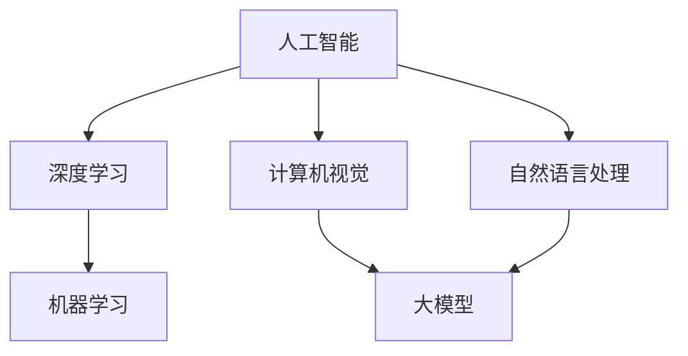

                 

# 创业者布局大模型，抢占AI产业变革风口

## 摘要

在人工智能（AI）飞速发展的背景下，大模型技术已经成为新一轮产业变革的风口。创业者如何在这个风口上布局，成为行业领跑者，是本文探讨的重点。本文将分析大模型的核心概念、技术原理、算法实现和应用场景，同时提供实用的工具和资源推荐，帮助创业者抓住AI产业变革的机遇。

## 1. 背景介绍

人工智能作为新一轮科技革命和产业变革的重要驱动力量，已经深刻影响了各行各业。大模型作为AI技术的核心组成部分，近年来得到了前所未有的关注和投资。大模型是指具有海量参数和强大计算能力的深度学习模型，它们能够处理复杂的数据并从中学习，从而实现智能决策和预测。

大模型技术的发展，得益于以下几个关键因素：

1. **计算能力的提升**：随着硬件技术的发展，计算能力得到了显著提升，为训练大规模模型提供了可能。
2. **数据资源的丰富**：互联网的普及和数据的积累，为模型训练提供了丰富的数据资源。
3. **算法的创新**：深度学习算法的进步，使得大模型的训练更加高效和准确。
4. **商业需求的驱动**：越来越多的企业认识到AI的重要性，并希望通过大模型技术提高业务效率和竞争力。

## 2. 核心概念与联系

### 2.1 人工智能（AI）

人工智能是指通过计算机程序模拟、延伸和扩展人的智能的理论、方法、技术及应用。它包括机器学习、计算机视觉、自然语言处理等领域。

### 2.2 深度学习（Deep Learning）

深度学习是机器学习的一个分支，通过多层神经网络模型来模拟人类大脑的神经网络结构，实现对数据的自动特征提取和模式识别。

### 2.3 大模型（Large Models）

大模型是指具有数百万甚至数十亿参数的深度学习模型。它们能够处理大规模数据，实现复杂任务的自动解决。

### 2.4 关联图（Mermaid Flowchart）



## 3. 核心算法原理 & 具体操作步骤

### 3.1 算法原理

大模型的核心算法是深度学习算法，主要包括以下步骤：

1. **数据预处理**：对原始数据进行清洗、归一化等处理，使其适合模型训练。
2. **模型架构设计**：根据任务需求设计神经网络结构，选择合适的激活函数、优化器等。
3. **模型训练**：通过迭代计算，调整模型参数，使其在训练数据上达到最优性能。
4. **模型评估**：在验证集上评估模型性能，调整模型参数或优化策略。
5. **模型部署**：将训练好的模型部署到生产环境中，实现实时推理和预测。

### 3.2 具体操作步骤

1. **数据预处理**

   - 数据清洗：去除缺失值、异常值等。
   - 数据归一化：将数据缩放到特定范围，如[0, 1]。
   - 数据分割：将数据集分为训练集、验证集和测试集。

2. **模型架构设计**

   - 选择模型框架：如TensorFlow、PyTorch等。
   - 定义神经网络结构：包括输入层、隐藏层和输出层。
   - 选择激活函数：如ReLU、Sigmoid等。
   - 选择优化器：如SGD、Adam等。

3. **模型训练**

   - 初始化模型参数。
   - 训练循环：前向传播、反向传播和参数更新。
   - 记录训练过程，如损失函数值、准确率等。

4. **模型评估**

   - 在验证集上评估模型性能。
   - 调整模型参数或优化策略，以提高性能。

5. **模型部署**

   - 将模型转换为推理格式。
   - 将模型部署到生产环境，如云端、边缘设备等。
   - 实现实时推理和预测。

## 4. 数学模型和公式 & 详细讲解 & 举例说明

### 4.1 数学模型

大模型的数学模型主要涉及以下几个部分：

1. **损失函数**：衡量模型预测结果与真实值之间的差距。常用的损失函数有均方误差（MSE）、交叉熵损失（Cross Entropy Loss）等。
2. **优化算法**：用于调整模型参数，以最小化损失函数。常用的优化算法有随机梯度下降（SGD）、Adam等。
3. **反向传播算法**：用于计算损失函数关于模型参数的梯度，并更新模型参数。

### 4.2 公式

1. **均方误差（MSE）**：

   $$
   MSE = \frac{1}{n} \sum_{i=1}^{n} (y_i - \hat{y}_i)^2
   $$

   其中，$y_i$为真实值，$\hat{y}_i$为预测值。

2. **交叉熵损失（Cross Entropy Loss）**：

   $$
   CE = -\sum_{i=1}^{n} y_i \log(\hat{y}_i)
   $$

   其中，$y_i$为真实值，$\hat{y}_i$为预测概率。

3. **梯度计算（反向传播）**：

   $$
   \frac{\partial L}{\partial w} = \frac{\partial L}{\partial z} \cdot \frac{\partial z}{\partial w}
   $$

   其中，$L$为损失函数，$w$为模型参数，$z$为中间变量。

### 4.3 举例说明

假设有一个二分类问题，模型预测概率为$\hat{y}$，真实值为$y=1$。使用交叉熵损失函数计算损失：

$$
CE = -1 \cdot \log(\hat{y}) = -\log(\hat{y})
$$

如果$\hat{y}=0.9$，则损失为：

$$
CE = -\log(0.9) \approx 0.15
$$

这表示模型预测结果与真实值之间的差距较小。

## 5. 项目实战：代码实际案例和详细解释说明

### 5.1 开发环境搭建

1. 安装Python环境，版本建议为3.8及以上。
2. 安装深度学习框架，如TensorFlow或PyTorch。
3. 安装其他必需的库，如NumPy、Pandas等。

### 5.2 源代码详细实现和代码解读

以下是一个简单的深度学习模型实现，用于二分类任务。

```python
import tensorflow as tf
from tensorflow.keras.models import Sequential
from tensorflow.keras.layers import Dense
from tensorflow.keras.optimizers import Adam

# 数据预处理
# (此处省略数据预处理代码)

# 模型架构设计
model = Sequential()
model.add(Dense(64, activation='relu', input_shape=(num_features,)))
model.add(Dense(32, activation='relu'))
model.add(Dense(1, activation='sigmoid'))

# 模型编译
model.compile(optimizer=Adam(), loss='binary_crossentropy', metrics=['accuracy'])

# 模型训练
model.fit(x_train, y_train, epochs=10, batch_size=32, validation_data=(x_val, y_val))

# 模型评估
loss, accuracy = model.evaluate(x_test, y_test)
print(f"Test accuracy: {accuracy:.2f}")

# 模型部署
# (此处省略模型部署代码)
```

### 5.3 代码解读与分析

1. **数据预处理**：对训练数据集进行预处理，包括数据清洗、归一化等。
2. **模型架构设计**：定义一个序列模型，包括两个隐藏层，输出层使用sigmoid激活函数。
3. **模型编译**：设置优化器为Adam，损失函数为binary_crossentropy，评价指标为accuracy。
4. **模型训练**：使用fit函数进行模型训练，指定训练轮次、批量大小和验证数据。
5. **模型评估**：使用evaluate函数评估模型在测试集上的性能。
6. **模型部署**：将训练好的模型部署到生产环境中，进行实时推理和预测。

## 6. 实际应用场景

大模型技术已经在多个领域取得了显著的成果，包括但不限于：

1. **图像识别**：通过训练大规模卷积神经网络，实现对图像内容的自动识别和分类。
2. **自然语言处理**：通过训练大规模语言模型，实现语音识别、机器翻译、文本生成等功能。
3. **推荐系统**：通过训练大规模推荐模型，提高推荐系统的准确性和个性化程度。
4. **医疗诊断**：通过训练大规模医疗数据模型，辅助医生进行疾病诊断和治疗方案推荐。

## 7. 工具和资源推荐

### 7.1 学习资源推荐

1. **书籍**：
   - 《深度学习》（Goodfellow, Bengio, Courville）
   - 《Python深度学习》（François Chollet）
2. **论文**：
   - 《A Theoretically Grounded Application of Dropout in Recurrent Neural Networks》（Yarin Gal和Zoubin Ghahramani）
   - 《Attention Is All You Need》（Ashish Vaswani等）
3. **博客**：
   - [TensorFlow官方文档](https://www.tensorflow.org/)
   - [PyTorch官方文档](https://pytorch.org/docs/stable/index.html)
4. **网站**：
   - [Kaggle](https://www.kaggle.com/)：提供丰富的AI竞赛和项目资源。
   - [GitHub](https://github.com/)：包含大量开源深度学习项目和代码。

### 7.2 开发工具框架推荐

1. **TensorFlow**：谷歌开源的深度学习框架，适用于各种规模的深度学习项目。
2. **PyTorch**：Facebook开源的深度学习框架，具有良好的灵活性和扩展性。
3. **Keras**：基于TensorFlow的简化和高级API，适用于快速搭建深度学习模型。

### 7.3 相关论文著作推荐

1. **《深度学习》（Goodfellow, Bengio, Courville）**：全面介绍了深度学习的基本概念、算法和应用。
2. **《神经网络与深度学习》（邱锡鹏）**：深入探讨了神经网络和深度学习的原理和应用。
3. **《强化学习》（David Silver等）**：详细介绍了强化学习的基本概念、算法和应用。

## 8. 总结：未来发展趋势与挑战

大模型技术的发展将推动人工智能在更多领域实现突破，未来发展趋势包括：

1. **模型压缩与加速**：为应对大规模模型的计算和存储需求，研究如何对模型进行压缩和加速。
2. **多模态学习**：结合文本、图像、音频等多种数据类型，实现更复杂的任务。
3. **可解释性**：提高模型的透明度和可解释性，使其更加符合人类的认知逻辑。
4. **自适应学习**：通过自适应学习机制，使模型能够更好地适应动态变化的场景。

同时，大模型技术也面临一些挑战：

1. **数据隐私**：大规模数据的处理和存储过程中，如何保护用户隐私成为一个重要问题。
2. **计算资源消耗**：大规模模型的训练和部署需要大量的计算资源，如何优化资源利用效率是一个关键问题。
3. **公平性与伦理**：大模型技术可能带来一些不公平和伦理问题，如算法歧视等，需要引起关注。

## 9. 附录：常见问题与解答

### 9.1 什么是大模型？

大模型是指具有海量参数和强大计算能力的深度学习模型，它们能够处理复杂的数据并从中学习，从而实现智能决策和预测。

### 9.2 大模型与普通模型的区别是什么？

大模型与普通模型的区别主要在于参数数量和计算能力。大模型通常具有数百万甚至数十亿参数，能够处理更复杂的数据，而普通模型通常只有几千或数万个参数。

### 9.3 大模型有哪些应用场景？

大模型的应用场景广泛，包括图像识别、自然语言处理、推荐系统、医疗诊断等领域。

### 9.4 如何选择合适的深度学习框架？

选择深度学习框架时，应考虑以下因素：

1. **项目需求**：根据项目需求选择合适的框架，如TensorFlow适用于大规模项目，PyTorch适用于研究和快速开发。
2. **社区支持**：考虑框架的社区支持和文档质量，以便在遇到问题时能够得到帮助。
3. **性能和兼容性**：考虑框架的性能和与其他工具的兼容性。

## 10. 扩展阅读 & 参考资料

1. **《深度学习》（Goodfellow, Bengio, Courville）**：全面介绍了深度学习的基本概念、算法和应用。
2. **《Python深度学习》（François Chollet）**：详细介绍了如何在Python中实现深度学习模型。
3. **[TensorFlow官方文档](https://www.tensorflow.org/)**
4. **[PyTorch官方文档](https://pytorch.org/docs/stable/index.html)**
5. **[Kaggle](https://www.kaggle.com/)**
6. **[GitHub](https://github.com/)**

### 作者

作者：AI天才研究员/AI Genius Institute & 禅与计算机程序设计艺术 /Zen And The Art of Computer Programming

