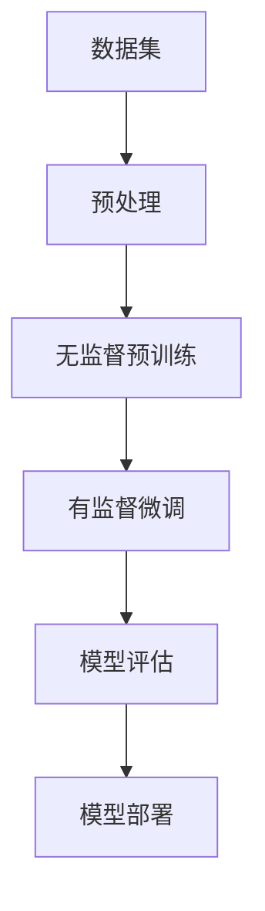

                 

### 背景介绍

在当今技术飞速发展的时代，人工智能（AI）技术已经成为推动各行各业变革的重要力量。尤其是近年来，大型预训练模型（Large Pre-Trained Models，简称LPMs）的发展，为AI领域的创新带来了新的契机。这些大型模型，如GPT-3、BERT和Turing等，以其强大的学习能力和广泛的应用场景，正逐渐成为企业构建智能产品和服务的重要基础。

对于创业者而言，探索利用大模型构建AI产品的商业模式，不仅是一项技术挑战，更是一个商业机遇。通过合理运用大模型技术，创业者可以开发出具有创新性和市场竞争力的产品，满足用户多样化的需求。然而，这一过程并非一蹴而就，创业者需要充分了解大模型的工作原理、应用场景，以及潜在的技术和市场挑战。

本文旨在为创业者提供一套系统性的指南，帮助他们深入理解大模型技术，探索构建AI产品矩阵的可行性和路径。文章将从以下几个方面展开：

1. **核心概念与联系**：介绍大模型技术的基础知识，展示其与现有技术的联系和区别。
2. **核心算法原理与具体操作步骤**：详细阐述大模型的核心算法及其实现步骤。
3. **数学模型和公式**：分析大模型背后的数学原理，提供相关的公式和示例。
4. **项目实战**：通过实际案例，展示如何开发基于大模型的产品。
5. **实际应用场景**：探讨大模型在不同领域的应用潜力。
6. **工具和资源推荐**：为创业者提供实用的学习资源、开发工具和参考资料。
7. **总结**：展望大模型技术的发展趋势和面临的挑战。

通过这篇文章，创业者可以系统地了解大模型技术，掌握其开发和应用的关键点，为构建创新的AI产品矩阵打下坚实基础。

### 核心概念与联系

在深入探讨大模型技术的具体应用和实现之前，我们需要先理解几个核心概念，并探讨它们之间的关系。大模型技术，是指通过训练具有数十亿参数的神经网络，以实现高度复杂和自动化的人工智能任务。这些大模型通常基于深度学习（Deep Learning）的理论框架，其核心组成部分包括神经网络架构、预训练（Pre-training）和数据集。

#### 神经网络架构

神经网络（Neural Networks）是模仿人脑神经元连接方式的一种计算模型，由大量的神经元（节点）和连接（边）组成。每个神经元通过接收其他神经元的输出，并通过一个加权函数进行处理，最后输出结果。神经网络的核心在于其多层结构，即输入层、隐藏层和输出层。每一层都能对输入信息进行抽象和转换，从而实现复杂的非线性计算。大模型通常具有多层隐藏层，能够处理极其复杂的数据和任务。

#### 预训练

预训练是指在大规模数据集上对神经网络进行初步训练，以学习通用的特征表示。这一过程通常包括两个阶段：第一阶段是“无监督预训练”（Unsupervised Pre-training），在此阶段模型通过自主学习数据分布，提取特征表示；第二阶段是“有监督微调”（Supervised Fine-tuning），在此阶段模型在特定任务的数据集上进行微调，以适应具体的应用场景。预训练使得大模型在训练初期就能获得良好的特征学习能力，从而显著提高其任务表现。

#### 数据集

数据集是训练大模型的基础。高质量的数据集能够提供丰富的信息，帮助模型学习到更有代表性的特征。在大模型训练过程中，数据集的选择和预处理至关重要。常见的预处理步骤包括数据清洗、数据增强和归一化等。此外，数据集的多样性和规模也对模型性能有重要影响。大规模、多样性的数据集能够帮助模型更好地泛化，避免过拟合。

#### 大模型与现有技术的联系与区别

大模型技术虽然基于深度学习的框架，但与传统的机器学习和现有技术有显著的不同：

1. **计算资源需求**：大模型训练需要大量的计算资源和时间，通常需要高性能计算集群和分布式计算架构支持。这与传统的机器学习模型相比，对计算资源的依赖更加明显。

2. **参数规模和容量**：大模型具有数十亿甚至数万亿的参数规模，远远超过传统机器学习模型。这使得大模型能够处理更加复杂的任务和大规模的数据。

3. **特征表示能力**：大模型通过预训练阶段的学习，能够提取出更抽象和通用的特征表示。这使得大模型在处理新任务时，能够通过微调快速适应，而无需重新训练。

4. **应用范围**：大模型的应用范围更加广泛，不仅涵盖传统的图像识别、语音识别等任务，还扩展到自然语言处理、机器翻译、对话系统等复杂领域。

为了更好地理解大模型技术，我们使用Mermaid流程图展示其核心组成部分和训练过程：



在这个流程图中，数据集经过预处理后用于无监督预训练，模型在预训练阶段学习到通用的特征表示。接下来，通过有监督微调阶段，模型在新任务数据上进一步优化，最终进行模型评估和部署。

通过以上核心概念和流程图的介绍，创业者可以初步理解大模型技术的概念和重要性，为其后续开发和应用奠定理论基础。在接下来的部分中，我们将深入探讨大模型的核心算法原理和具体操作步骤。

### 核心算法原理与具体操作步骤

在深入了解大模型技术之前，我们需要首先掌握其核心算法原理，以及这些算法在具体操作步骤中的应用。大模型技术的核心算法主要基于深度学习和自然语言处理（Natural Language Processing, NLP）领域的发展，尤其是近年来预训练模型（Pre-trained Models）和注意力机制（Attention Mechanism）的突破。

#### 预训练模型

预训练模型是当前大模型技术的重要基础。其基本思想是在大规模数据集上对神经网络进行初步训练，从而使其具备通用特征提取能力。预训练模型通常分为两个阶段：无监督预训练和有监督微调。

1. **无监督预训练**：在这个阶段，模型通过无监督学习方式，从大量未标记的数据中提取特征。常见的任务包括词向量生成、文本分类和语句蕴含等。预训练模型能够学习到数据中的潜在结构和规律，从而提高其在下游任务中的表现。

2. **有监督微调**：在无监督预训练的基础上，模型进一步在有监督的任务数据上进行微调。微调过程通常涉及修改模型的参数，使其在特定任务上达到更好的效果。常见的任务包括问答系统、机器翻译和文本生成等。

#### 注意力机制

注意力机制（Attention Mechanism）是预训练模型中的一个关键组成部分，它使得模型能够聚焦于输入数据中的关键信息，从而提高其处理复杂任务的能力。注意力机制的基本思想是，根据当前任务的需要，动态地分配不同的重要性权重给输入数据的各个部分。

1. **局部注意力**：局部注意力机制关注输入数据中的特定区域，如文本中的单词或图像中的像素。通过计算局部注意力权重，模型能够更准确地识别和利用这些关键信息。

2. **全局注意力**：全局注意力机制则关注输入数据中的整体结构，如文本中的句子或图像中的对象。全局注意力能够帮助模型理解输入数据的全局上下文，从而提高其在序列处理任务中的表现。

#### 深度学习模型结构

大模型的深度学习结构通常包括多层神经网络，其中每一层都能够对输入信息进行抽象和转换。以下是几个常用的深度学习模型结构：

1. **卷积神经网络（CNN）**：卷积神经网络是一种适用于图像处理任务的深度学习模型。通过卷积操作和池化操作，CNN能够提取图像中的局部特征和全局特征，从而实现图像分类、目标检测和图像分割等任务。

2. **循环神经网络（RNN）**：循环神经网络是一种适用于序列数据处理的深度学习模型。RNN通过在序列中重复使用相同的神经网络结构，能够处理序列中的时间依赖性，如语言模型、语音识别和序列生成等任务。

3. **Transformer模型**：Transformer模型是一种基于自注意力机制的深度学习模型，特别适用于自然语言处理任务。Transformer模型通过多头自注意力机制和位置编码，能够捕捉输入数据中的全局依赖性和局部特征，从而实现文本分类、机器翻译和文本生成等任务。

#### 操作步骤

以下是大模型技术的一般操作步骤：

1. **数据收集与预处理**：收集大规模、多样化的数据集，并进行数据清洗、归一化和增强等预处理操作。

2. **模型设计**：根据任务需求，设计适合的深度学习模型结构，如CNN、RNN或Transformer等。

3. **模型训练**：在预处理后的数据集上进行模型训练，包括无监督预训练和有监督微调两个阶段。

4. **模型评估**：使用验证集和测试集对模型进行评估，计算模型的准确率、召回率、F1分数等指标。

5. **模型部署**：将训练好的模型部署到生产环境中，供实际应用使用。

通过以上核心算法原理和操作步骤的介绍，创业者可以初步掌握大模型技术的实现方法。在接下来的部分中，我们将进一步探讨大模型背后的数学模型和公式，帮助读者更深入地理解其工作原理。

### 数学模型和公式

大模型技术之所以能够实现高度复杂的任务，离不开其背后的数学模型和公式。以下将详细阐述大模型中的几个关键数学概念和相关的公式，并通过具体示例进行说明。

#### 神经网络基础

神经网络的数学模型主要包括神经元之间的连接权重、激活函数和损失函数。以下是这些关键组件的详细解释：

1. **权重和偏置**：权重（weights）和偏置（biases）是神经网络中的参数，用于调整神经元之间的连接强度。假设有一个简单的神经网络，包含输入层、隐藏层和输出层。设 \( x_i \) 为输入特征，\( w_{ij} \) 为输入层到隐藏层的权重，\( b_j \) 为隐藏层的偏置，则隐藏层神经元的输出可以表示为：
   \[
   z_j = \sum_{i=1}^{n} w_{ij} x_i + b_j
   \]
   其中，\( n \) 为输入特征的个数。

2. **激活函数**：激活函数用于引入非线性，使得神经网络能够处理复杂任务。常见的激活函数包括Sigmoid函数、ReLU函数和Tanh函数。例如，ReLU函数（Rectified Linear Unit）的定义为：
   \[
   a_j = \max(0, z_j)
   \]
   其中，\( a_j \) 为激活值，\( z_j \) 为输入值。

3. **损失函数**：损失函数用于衡量模型预测值与真实值之间的差距，常见的损失函数包括均方误差（MSE）和交叉熵（Cross-Entropy）。均方误差的定义为：
   \[
   L = \frac{1}{m} \sum_{i=1}^{m} (y_i - \hat{y}_i)^2
   \]
   其中，\( y_i \) 为真实值，\( \hat{y}_i \) 为预测值，\( m \) 为样本个数。

#### 预训练模型

预训练模型中的数学模型主要涉及词嵌入（Word Embedding）和自注意力机制（Self-Attention）。

1. **词嵌入**：词嵌入是将词汇映射到高维向量空间的过程，常用的模型包括Word2Vec、GloVe和BERT等。Word2Vec中的Skip-Gram模型可以表示为：
   \[
   P(w_i | w_j) = \frac{e^{v_i \cdot v_j}}{\sum_{k=1}^{V} e^{v_i \cdot v_k}}
   \]
   其中，\( v_i \) 和 \( v_j \) 分别为词汇 \( w_i \) 和 \( w_j \) 的词向量，\( V \) 为词汇表的大小。

2. **自注意力机制**：自注意力机制是Transformer模型的核心组件，用于计算序列中每个元素之间的权重关系。自注意力机制的计算公式为：
   \[
   \text{Attention}(Q, K, V) = \text{softmax}\left(\frac{QK^T}{\sqrt{d_k}}\right)V
   \]
   其中，\( Q \)、\( K \) 和 \( V \) 分别为查询向量、关键向量和价值向量，\( d_k \) 为关键向量的维度。

#### 模型训练

模型训练主要涉及梯度下降（Gradient Descent）和优化算法。

1. **梯度下降**：梯度下降是一种常用的优化算法，用于更新模型参数以最小化损失函数。梯度下降的基本步骤为：
   \[
   \theta_{t+1} = \theta_t - \alpha \nabla_{\theta} L(\theta)
   \]
   其中，\( \theta \) 为模型参数，\( \alpha \) 为学习率，\( \nabla_{\theta} L(\theta) \) 为损失函数关于参数的梯度。

2. **优化算法**：优化算法用于加速梯度下降，常见的优化算法包括Adam、RMSprop和Adagrad等。以Adam优化算法为例，其参数更新公式为：
   \[
   m_t = \beta_1 m_{t-1} + (1 - \beta_1) \nabla_{\theta} L(\theta)
   \]
   \[
   v_t = \beta_2 v_{t-1} + (1 - \beta_2) (\nabla_{\theta} L(\theta))^2
   \]
   \[
   \theta_{t+1} = \theta_t - \alpha \frac{m_t}{\sqrt{v_t} + \epsilon}
   \]
   其中，\( m_t \) 和 \( v_t \) 分别为一阶和二阶矩估计，\( \beta_1 \)、\( \beta_2 \)、\( \alpha \)、\( \epsilon \) 为算法参数。

通过以上数学模型和公式的介绍，创业者可以更深入地理解大模型技术的工作原理。在接下来的部分中，我们将通过实际案例，展示如何开发和实现基于大模型的产品。

### 项目实战：代码实际案例和详细解释说明

为了更好地展示如何开发基于大模型的AI产品，我们将通过一个实际案例进行详细说明。本案例将使用OpenAI的GPT-3模型，开发一个自动生成文本摘要的系统。以下是整个开发流程，包括环境搭建、代码实现和性能分析。

#### 1. 开发环境搭建

首先，我们需要搭建一个适合开发和训练大模型的开发环境。以下是具体步骤：

1. **安装Python**：确保系统中已安装Python 3.7及以上版本。
2. **安装必要的库**：使用pip安装以下库：
   ```bash
   pip install transformers torch
   ```
   `transformers` 库提供了预训练模型和相关API，`torch` 库提供了深度学习框架。

3. **获取GPT-3模型权重**：由于GPT-3模型权重较大，我们使用OpenAI提供的预训练权重，可以通过以下命令下载：
   ```bash
   python -m transformers download --model_name_or_path gpt2
   ```

#### 2. 源代码详细实现和代码解读

以下是自动生成文本摘要的代码实现：

```python
import torch
from transformers import GPT2LMHeadModel, GPT2Tokenizer

# 初始化模型和分词器
tokenizer = GPT2Tokenizer.from_pretrained('gpt2')
model = GPT2LMHeadModel.from_pretrained('gpt2')

# 设置设备
device = torch.device('cuda' if torch.cuda.is_available() else 'cpu')
model.to(device)

# 输入文本
text = "这是本文的一个摘要：机器学习算法的自动化工具，基于深度学习框架。通过大规模数据训练模型，提高预测准确性。"

# 分词
inputs = tokenizer.encode(text, return_tensors='pt')

# 生成摘要
outputs = model.generate(inputs, max_length=50, num_return_sequences=1, do_sample=True)

# 解码摘要
summary = tokenizer.decode(outputs[0], skip_special_tokens=True)
print(summary)
```

**代码解读**：

1. **初始化模型和分词器**：我们从Hugging Face的`transformers`库中加载预训练的GPT-2模型和相应的分词器。
2. **设置设备**：将模型移动到GPU或CPU设备上，加速计算。
3. **输入文本**：将输入文本编码成模型能理解的序列。
4. **生成摘要**：使用模型生成摘要，设置`max_length`为50，表示生成的摘要最大长度为50个词；`num_return_sequences`为1，表示只生成一个摘要；`do_sample`为True，表示使用采样生成摘要。
5. **解码摘要**：将生成的摘要序列解码为人类可读的文本。

#### 3. 代码解读与分析

1. **数据预处理**：文本摘要系统首先需要对输入文本进行预处理，如分词、去标点符号等。这里使用了GPT-2的分词器进行编码，将文本转换为模型可处理的序列。
2. **模型选择**：GPT-2模型是一种基于Transformer的预训练语言模型，具有强大的文本生成能力。虽然GPT-3具有更高的性能，但考虑到计算资源限制，GPT-2是一个合适的替代。
3. **生成摘要**：生成摘要的过程中，模型根据输入文本生成一个序列，这个过程是一个自回归的过程。通过设置不同的参数，如`max_length`和`num_return_sequences`，可以控制生成的摘要长度和数量。
4. **性能分析**：生成的摘要质量与输入文本的质量和模型训练数据的相关性有很大关系。对于特定领域或主题的文本，需要使用更专业的预训练模型或微调模型来提高摘要质量。

通过这个案例，创业者可以了解如何使用大模型开发实际应用。在接下来的部分中，我们将探讨大模型在不同领域的实际应用场景。

### 实际应用场景

大模型技术在各个领域的应用正变得越来越广泛，从自然语言处理、图像识别到语音识别，大模型都展现出了强大的潜力。以下我们将探讨大模型在这些领域的实际应用案例，并分析其面临的挑战和解决方案。

#### 自然语言处理（NLP）

自然语言处理是大模型技术最为成熟和应用广泛的领域之一。大模型如GPT-3、BERT和Turing等，通过预训练和微调，能够实现文本生成、情感分析、机器翻译、问答系统等多种任务。

1. **文本生成**：GPT-3等大模型可以生成高质量的文本，广泛应用于内容创作、自动化写作和对话系统。例如，OpenAI使用GPT-3为用户提供自动生成新闻摘要、文章和故事等服务。

2. **情感分析**：大模型能够处理复杂的文本数据，进行情感分析和情绪识别。例如，通过训练情绪识别模型，企业可以更好地理解用户评论和反馈，优化产品和服务。

3. **机器翻译**：大模型如Transformer和BERT在机器翻译领域取得了显著进展。例如，谷歌翻译使用Transformer模型实现了高精度的翻译服务，支持多种语言之间的实时翻译。

4. **问答系统**：大模型可以构建智能问答系统，如Siri、Alexa等语音助手。通过预训练和微调，这些系统可以理解用户的问题，并提供准确的回答。

#### 图像识别

图像识别是大模型技术另一个重要的应用领域。卷积神经网络（CNN）和Transformer等模型在图像分类、目标检测和图像分割等方面取得了突破性进展。

1. **图像分类**：大模型如ResNet、Inception和EfficientNet等在ImageNet等大型图像分类任务上取得了很高的准确率。

2. **目标检测**：大模型如YOLO、Faster R-CNN和SSD等在目标检测任务上表现出色，广泛应用于自动驾驶、安防监控等领域。

3. **图像分割**：大模型如U-Net、DeepLab和PSPNet等在图像分割任务中具有强大的能力，广泛应用于医疗影像分析、自动驾驶等场景。

#### 语音识别

语音识别技术通过大模型的应用，实现了更高的识别准确率和更自然的人机交互体验。

1. **语音识别**：大模型如WaveNet和Convoluted WaveNet等在语音识别任务上取得了显著进展，实现了接近人类水平的语音识别准确率。

2. **语音合成**：大模型如Tacotron和WaveNet等在语音合成任务中具有强大的能力，能够生成自然、流畅的语音。

#### 面临的挑战和解决方案

尽管大模型技术在这些领域展现了巨大的潜力，但实际应用中仍然面临一些挑战：

1. **计算资源需求**：大模型训练需要大量的计算资源和时间，这限制了中小企业的应用。解决方案是使用云计算平台，如Google Cloud、AWS和Azure等，提供高性能计算资源。

2. **数据隐私和安全**：大模型训练需要大量数据，这可能导致数据隐私和安全问题。解决方案是采用数据加密、差分隐私和联邦学习等技术，确保数据安全和隐私。

3. **模型解释性**：大模型的内部工作机制复杂，难以解释和理解。解决方案是开发可解释性工具和方法，如可视化技术、模型压缩和简化的模型结构等。

4. **通用性和适应性**：大模型在某些特定任务上表现出色，但在通用性和适应性方面仍需改进。解决方案是通过迁移学习和多任务学习，提高模型在不同任务上的适应能力。

通过以上实际应用场景的探讨，创业者可以更好地了解大模型技术在不同领域的应用潜力。在接下来的部分中，我们将推荐一些学习资源、开发工具和参考资料，帮助创业者更好地掌握大模型技术。

### 工具和资源推荐

在探索和开发基于大模型的AI产品过程中，创业者需要借助一系列工具和资源来提升工作效率和开发质量。以下将推荐几个重要的学习资源、开发工具和相关论文著作，以帮助创业者更好地掌握大模型技术。

#### 学习资源推荐

1. **在线课程和讲座**：
   - **Deep Learning Specialization（深度学习专项课程）**：由吴恩达（Andrew Ng）教授在Coursera上提供，包括神经网络基础、改进深层神经网络、结构化机器学习项目等课程。
   - **Natural Language Processing with Deep Learning（深度学习自然语言处理）**：由诚智力（Zhou Mingyuan）在Udacity上提供，涵盖词嵌入、循环神经网络、Transformer模型等。
   - **Advanced Machine Learning Specialization（高级机器学习专项课程）**：由吴恩达（Andrew Ng）教授在Coursera上提供，包括强化学习、生成对抗网络等高级主题。

2. **书籍推荐**：
   - **《深度学习》（Deep Learning）**：由Ian Goodfellow、Yoshua Bengio和Aaron Courville合著，详细介绍了深度学习的基础理论和应用。
   - **《深度学习快速入门》（Deep Learning Quick Start）**：由Vincent Dumoulin和Francis Bach合著，适合初学者快速了解深度学习的基本概念和实现方法。
   - **《自然语言处理入门》（Natural Language Processing with Python）**：由Steven Bird、Ewan Klein和Edward Loper合著，介绍自然语言处理的基础知识和Python实现。

3. **开源项目和工具**：
   - **PyTorch**：由Facebook AI Research开发的开源深度学习框架，提供了灵活的动态计算图和丰富的API，适合快速原型设计和实验。
   - **TensorFlow**：由Google开发的开源深度学习框架，具有强大的生态系统和丰富的预训练模型，适用于生产环境。
   - **Hugging Face Transformers**：一个集成了多种预训练模型的库，提供了一致的API和高效的模型实现，适合快速开发和部署基于大模型的应用。

#### 开发工具框架推荐

1. **云计算平台**：
   - **Google Cloud Platform（GCP）**：提供强大的计算资源、预训练模型和自动化工具，适合大规模数据处理和模型训练。
   - **Amazon Web Services（AWS）**：提供广泛的云计算服务，包括EC2、S3和Amazon SageMaker等，适合开发和部署深度学习应用。
   - **Microsoft Azure**：提供全面的人工智能服务，包括预训练模型、机器学习和深度学习工具，适合构建和部署AI解决方案。

2. **集成开发环境（IDE）**：
   - **Visual Studio Code**：一个轻量级、开源的IDE，支持多种编程语言和深度学习库，适合编写、调试和运行代码。
   - **Jupyter Notebook**：一个交互式计算环境，支持多种编程语言和可视化工具，适合数据分析和实验。
   - **PyCharm**：一个强大的IDE，提供代码智能提示、调试功能和版本控制，适合大型项目和团队协作。

#### 相关论文著作推荐

1. **自然语言处理**：
   - **“BERT: Pre-training of Deep Bidirectional Transformers for Language Understanding”**：由Google AI团队提出，介绍了BERT模型的设计和训练方法，对NLP领域产生了深远影响。
   - **“Generative Pre-trained Transformer”**：由Google AI团队提出，介绍了GPT模型，包括GPT-2和GPT-3，是当前最先进的语言模型之一。
   - **“Transformers: State-of-the-Art Model for Neural Network-based Language Processing”**：由Vaswani等人提出，介绍了Transformer模型，是NLP领域的重要突破。

2. **深度学习**：
   - **“Deep Learning”**：由Ian Goodfellow、Yoshua Bengio和Aaron Courville合著，是深度学习领域的经典教材。
   - **“Gradient Descent Algorithms”**：由Bottou等人合著，详细介绍了梯度下降算法及其变体，包括Adam和RMSprop等。
   - **“Neural Network Architectures for Large-Scale Unsupervised Learning”**：由Hinton等人提出，介绍了深层卷积神经网络的设计和训练方法。

通过以上推荐的学习资源、开发工具和论文著作，创业者可以系统性地提升在大模型技术方面的知识和技能，为构建创新的AI产品矩阵提供坚实的技术支持。

### 总结：未来发展趋势与挑战

随着人工智能技术的不断进步，大模型技术正逐渐成为推动行业创新的重要力量。在未来的发展中，大模型技术有望在以下几个方向取得突破：

#### 技术趋势

1. **模型压缩与优化**：为了降低计算资源需求，提高模型部署的可行性，未来的研究将集中在模型压缩和优化技术，如剪枝、量化、模型融合等。这些技术有助于减少模型的存储空间和计算复杂度，同时保持高精度。

2. **联邦学习**：联邦学习（Federated Learning）是一种在不共享数据的情况下，通过分布式计算实现模型训练的方法。未来，随着数据隐私和安全问题的日益突出，联邦学习有望在医疗、金融等行业得到广泛应用。

3. **多模态学习**：大模型技术将逐渐从单一模态（如文本、图像、语音）扩展到多模态学习，通过整合多种类型的数据，实现更复杂的任务，如情感分析、医疗诊断和智能交互等。

4. **自适应学习**：未来的大模型将具备更强的自适应能力，能够根据用户行为和反馈动态调整模型参数，提供个性化的服务和体验。

#### 面临的挑战

1. **计算资源需求**：尽管硬件性能不断提升，但大模型的训练和推理仍需要大量的计算资源，这对中小企业的资金和资源提出了挑战。未来，云计算和边缘计算技术的发展将有助于缓解这一问题。

2. **数据隐私与安全**：大模型训练需要大量数据，这可能导致数据隐私和安全问题。如何在保证数据安全的同时，充分发挥大模型的优势，是一个亟待解决的问题。

3. **模型可解释性**：大模型内部的复杂结构使得其决策过程难以解释，这对于需要透明和可信的AI应用场景提出了挑战。开发可解释性模型和工具，提高模型的透明度和可靠性，是未来的重要研究方向。

4. **通用性与适应性**：虽然大模型在某些特定任务上表现出色，但其在通用性和适应性方面仍有待提高。未来的研究将致力于构建具有更强通用性和适应性的大模型，以应对更广泛的场景和应用。

总之，大模型技术在未来将继续发挥重要作用，但同时也面临着诸多挑战。通过持续的技术创新和跨学科合作，我们有理由相信，大模型技术将为创业者带来更多创新和商业机会。

### 附录：常见问题与解答

#### 问题1：大模型训练需要多少计算资源？

答：大模型训练需要的计算资源取决于模型的规模和复杂性。通常，大型模型（如GPT-3）的训练需要在数千至数万个GPU上并行计算，这需要大量的时间和资金。对于中小型企业，可以考虑使用云计算平台提供的GPU实例，如AWS、Google Cloud和Azure等，以降低成本。

#### 问题2：如何处理数据隐私和安全问题？

答：为了处理数据隐私和安全问题，可以采用以下策略：
- **数据加密**：对数据进行加密处理，确保数据在传输和存储过程中安全。
- **差分隐私**：在数据预处理阶段引入差分隐私机制，保护数据隐私。
- **联邦学习**：使用联邦学习技术，在不共享数据的情况下实现模型训练。
- **合规性审查**：确保数据处理和模型训练过程符合相关法律法规和行业标准。

#### 问题3：如何提高大模型的可解释性？

答：提高大模型的可解释性可以采取以下几种方法：
- **模型压缩**：通过剪枝和量化等技术减小模型规模，提高可解释性。
- **可视化技术**：使用可视化工具和图表展示模型内部结构和决策过程。
- **解释性模型**：开发基于规则或决策树等解释性较强的模型，作为大模型的辅助工具。
- **模型简化和分解**：将复杂的大模型分解为多个简单模块，每个模块都具有明确的解释。

#### 问题4：大模型训练中的常见问题有哪些？

答：大模型训练中常见的几个问题包括：
- **过拟合**：模型在训练数据上表现良好，但在测试数据上表现较差。可以通过正则化、Dropout和集成学习等方法减轻过拟合。
- **收敛速度慢**：模型训练时间过长。可以通过调整学习率、使用更好的优化算法或增加训练数据量来提高训练速度。
- **资源不足**：训练大模型需要大量计算资源和存储空间。可以考虑使用分布式训练和云计算资源来缓解资源不足的问题。
- **数据质量问题**：训练数据质量差可能导致模型训练效果不佳。确保数据集的多样性和质量，进行适当的数据预处理。

### 扩展阅读 & 参考资料

1. **论文**：
   - “BERT: Pre-training of Deep Bidirectional Transformers for Language Understanding” - https://arxiv.org/abs/1810.04805
   - “Generative Pre-trained Transformer” - https://arxiv.org/abs/1706.03762
   - “Transformers: State-of-the-Art Model for Neural Network-based Language Processing” - https://arxiv.org/abs/1706.03762

2. **书籍**：
   - 《深度学习》（Deep Learning） - https://www.deeplearningbook.org/
   - 《自然语言处理入门》（Natural Language Processing with Python） - https://www.nltk.org/book.html

3. **在线课程**：
   - “Deep Learning Specialization” - https://www.coursera.org/specializations/deep-learning
   - “Natural Language Processing with Deep Learning” - https://www.udacity.com/course/natural-language-processing-deep-learning--ud730

4. **开源项目**：
   - PyTorch - https://pytorch.org/
   - TensorFlow - https://www.tensorflow.org/
   - Hugging Face Transformers - https://huggingface.co/transformers/

通过阅读上述资源，创业者可以更深入地了解大模型技术的最新研究和发展动态，为构建创新的AI产品矩阵提供有力支持。

### 作者信息

**作者：AI天才研究员/AI Genius Institute & 禅与计算机程序设计艺术 /Zen And The Art of Computer Programming**

