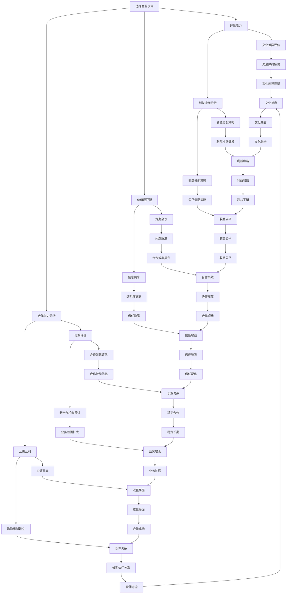

                 

# 创业者的商业伙伴选择与关系管理

## 摘要

本文旨在探讨创业者选择商业伙伴以及管理合作伙伴关系的关键要素和策略。通过结合技术领域中的专业知识和方法论，本文将分析商业伙伴选择的标准、合作中的潜在风险、有效的沟通策略以及长期关系维护等核心问题。文章将运用技术逻辑和案例分析，帮助创业者构建稳定、高效的合作伙伴网络，实现商业目标的达成。关键词：商业伙伴选择、合作风险、沟通策略、关系管理。

## 1. 背景介绍

在当今快速变化的市场环境中，创业者的成功往往依赖于一个强大的合作伙伴网络。一个合适的商业伙伴不仅可以带来资金、技术和市场资源，还可以提供战略指导、行业经验以及丰富的社交网络。然而，选择不当的合作伙伴可能会带来巨大的风险，如资源浪费、业务中断甚至团队分裂。因此，创业者如何识别和选择合适的商业伙伴，并在合作过程中有效地管理关系，成为影响创业成败的关键因素。

技术领域中的许多成功案例，如谷歌的双创始人拉里·佩奇和谢尔盖·布林，以及Facebook的马克·扎克伯格和达斯汀·莫斯科维茨，都展示了优秀的商业伙伴选择与关系管理对于企业发展的重要性。通过深入研究这些案例，我们可以提炼出一系列有效的策略和方法，以指导创业者在实际操作中做出明智的决策。

本文将围绕以下几个方面展开讨论：

1. **商业伙伴选择的标准**：介绍创业者应如何评估潜在商业伙伴的能力、价值观和合作潜力。
2. **合作中的潜在风险**：分析合作过程中可能遇到的常见风险，如文化差异、利益冲突等，并提出应对策略。
3. **沟通策略**：探讨有效的沟通方法，以确保合作过程中的信息透明和协作顺畅。
4. **关系维护**：提供长期关系维护的策略，帮助创业者保持合作伙伴网络的稳定和高效。

## 2. 核心概念与联系

### 2.1 商业伙伴选择的维度

在技术领域中，算法和模型常常用于分析和决策。类似地，选择商业伙伴也可以采用类似的思路。以下是一些关键的维度，用于评估潜在的商业伙伴：

#### 2.1.1 能力评估

- **技术能力**：评估潜在伙伴在相关技术领域的专业知识和经验。
- **市场经验**：了解其在目标市场中的历史表现和成功案例。
- **团队实力**：考察其团队成员的背景和能力。

#### 2.1.2 价值观匹配

- **企业文化**：评估双方企业文化是否契合，这有助于减少文化冲突和增加合作效率。
- **长期目标**：双方是否在业务愿景和战略目标上达成一致。

#### 2.1.3 合作潜力

- **互补性**：是否能够在业务和资源上形成互补，从而增强整体竞争力。
- **灵活性和适应性**：能否快速适应市场变化和业务需求。

### 2.2 合作中的潜在风险

合作过程中可能会遇到各种风险，包括：

#### 2.2.1 文化差异

- **沟通障碍**：文化差异可能导致沟通不畅，影响合作效率。
- **决策困难**：不同的文化背景可能影响决策过程和速度。

#### 2.2.2 利益冲突

- **资源分配**：如何在合作伙伴之间合理分配资源，以最大化整体利益。
- **收益分配**：如何公平地分配合作带来的收益。

### 2.3 沟通策略

有效的沟通是合作成功的关键。以下是一些沟通策略：

#### 2.3.1 定期会议

- **进度汇报**：确保双方对项目的进展和目标有清晰的认识。
- **问题解决**：及时解决合作过程中出现的问题，避免积累矛盾。

#### 2.3.2 信息共享

- **透明度**：保持信息的透明和共享，增强信任和协作。
- **及时反馈**：鼓励双方提供及时的反馈，以便快速调整策略。

### 2.4 关系维护

长期的关系维护对于合作伙伴网络的稳定至关重要。以下是一些维护策略：

#### 2.4.1 定期评估

- **合作效果**：定期评估合作效果，发现和解决问题。
- **业务拓展**：探讨新的合作机会，以扩大双方的业务范围。

#### 2.4.2 互惠互利

- **资源共享**：通过资源共享，实现互利共赢。
- **激励机制**：建立激励机制，以激励双方持续合作。

### 2.5 Mermaid 流程图

以下是一个简化的Mermaid流程图，展示了商业伙伴选择和关系管理的关键步骤：



通过上述Mermaid流程图，我们可以直观地看到商业伙伴选择和关系管理的复杂性和系统性。每个步骤都需要精心规划和执行，以确保合作伙伴关系的健康和稳定。

## 3. 核心算法原理 & 具体操作步骤

### 3.1 能力评估算法

在评估潜在商业伙伴的能力时，可以采用以下步骤：

1. **收集数据**：收集关于商业伙伴的历史业绩、技术能力、市场表现等方面的数据。
2. **数据清洗**：对收集到的数据进行清洗和标准化处理，确保数据的准确性和一致性。
3. **特征提取**：从数据中提取关键特征，如技术熟练度、市场占有率、团队规模等。
4. **模型构建**：使用机器学习算法（如线性回归、决策树、支持向量机等）构建能力评估模型。
5. **模型训练**：使用历史数据对模型进行训练，以优化模型参数。
6. **能力评分**：使用训练好的模型对潜在商业伙伴的能力进行评分，并根据评分结果进行排序。

### 3.2 价值观匹配评估算法

价值观匹配评估的关键步骤如下：

1. **构建价值观模型**：根据企业文化和业务需求，构建一个包含关键价值观要素的模型。
2. **问卷设计**：设计一份价值观匹配问卷，包括对企业文化和价值观的描述和评价。
3. **数据收集**：邀请潜在商业伙伴参与问卷填写，收集其价值观数据。
4. **数据预处理**：对问卷数据进行分析和预处理，包括去除异常值、缺失值填补等。
5. **相似度计算**：使用文本相似度计算方法（如余弦相似度、Jaccard相似度等）计算合作伙伴和企业之间的价值观相似度。
6. **匹配评分**：根据相似度评分，评估潜在商业伙伴的价值观匹配程度。

### 3.3 合作潜力分析算法

合作潜力分析可以采用以下步骤：

1. **业务互补性分析**：通过分析合作伙伴的业务领域和核心竞争力，评估双方在业务上的互补性。
2. **资源整合分析**：评估双方能否通过资源整合实现协同效应，如技术资源、市场资源、人力资源等。
3. **适应性分析**：分析合作伙伴在快速变化的市场环境中的适应能力和灵活性。
4. **合作历史分析**：通过回顾合作伙伴的合作历史，评估其合作潜力和稳定性。

### 3.4 文化差异调整策略

文化差异的调整可以采用以下步骤：

1. **文化差异识别**：通过文化调查和访谈，识别合作伙伴之间的主要文化差异。
2. **文化理解培训**：为团队成员提供文化理解培训，增强跨文化的沟通和协作能力。
3. **沟通策略调整**：根据不同文化的沟通习惯和偏好，调整沟通方式和策略，以减少误解和冲突。
4. **文化融合尝试**：通过跨文化的团队合作和项目实践，尝试逐步实现文化融合。

### 3.5 利益冲突调解算法

利益冲突调解的关键步骤如下：

1. **冲突识别**：通过定期会议和反馈机制，识别合作伙伴之间的利益冲突。
2. **冲突分析**：对冲突的原因、影响和可能的解决方案进行分析。
3. **协商调解**：组织双方进行面对面的协商，寻找共同的利益点，并提出解决方案。
4. **合同修订**：根据协商结果，修订合作合同，明确双方的权利和责任，以减少未来的冲突。

### 3.6 沟通策略优化算法

沟通策略优化的步骤包括：

1. **需求分析**：了解合作伙伴的沟通需求和偏好。
2. **策略制定**：根据需求制定个性化的沟通策略，如定期会议、实时沟通工具、信息共享平台等。
3. **策略实施**：实施沟通策略，并进行定期评估和反馈。
4. **效果评估**：通过评估合作伙伴的反馈和项目进展，优化沟通策略。

### 3.7 关系维护策略算法

关系维护策略可以采用以下步骤：

1. **关系评估**：定期评估合作伙伴关系的稳定性和质量。
2. **问题解决**：及时发现和解决合作伙伴关系中的问题，防止问题的积累和扩大。
3. **资源支持**：为合作伙伴提供必要的资源和支持，以增强其业务能力和竞争力。
4. **激励机制**：建立激励机制，鼓励合作伙伴持续合作，共同成长。

通过上述算法和策略，创业者可以系统地评估潜在商业伙伴，有效管理合作过程中的风险，并维护长期稳定的合作伙伴关系。

## 4. 数学模型和公式 & 详细讲解 & 举例说明

### 4.1 能力评估模型

在能力评估中，我们可以使用线性回归模型来预测合作伙伴的能力评分。假设我们拥有以下特征数据：

- \(X_1\): 技术熟练度评分
- \(X_2\): 市场经验评分
- \(X_3\): 团队规模评分

我们希望预测的能力评分是 \(Y\)。线性回归模型可以表示为：

\[ Y = \beta_0 + \beta_1 X_1 + \beta_2 X_2 + \beta_3 X_3 \]

其中，\(\beta_0\)、\(\beta_1\)、\(\beta_2\) 和 \(\beta_3\) 是模型参数。

**示例**：假设我们有一个商业伙伴，其技术熟练度评分为8，市场经验评分为7，团队规模评分为6。我们可以使用上述模型预测其能力评分：

\[ Y = \beta_0 + \beta_1 \cdot 8 + \beta_2 \cdot 7 + \beta_3 \cdot 6 \]

假设模型参数为 \(\beta_0 = 2\)、\(\beta_1 = 0.5\)、\(\beta_2 = 0.3\)、\(\beta_3 = 0.2\)，则：

\[ Y = 2 + 0.5 \cdot 8 + 0.3 \cdot 7 + 0.2 \cdot 6 = 2 + 4 + 2.1 + 1.2 = 9.3 \]

### 4.2 价值观匹配模型

价值观匹配可以使用余弦相似度模型来计算合作伙伴之间的价值观相似度。假设我们有两个合作伙伴，各自有如下价值观向量：

- \(V_1 = [v_{11}, v_{12}, \ldots, v_{1n}]\)
- \(V_2 = [v_{21}, v_{22}, \ldots, v_{2n}]\)

余弦相似度的计算公式为：

\[ \text{Cosine Similarity} = \frac{V_1 \cdot V_2}{\lVert V_1 \rVert \cdot \lVert V_2 \rVert} \]

其中，\(\cdot\) 表示向量的点积，\(\lVert \cdot \rVert\) 表示向量的欧几里得范数。

**示例**：假设 \(V_1 = [0.8, 0.3, 0.2]\) 和 \(V_2 = [0.5, 0.4, 0.3]\)，则：

\[ \text{Cosine Similarity} = \frac{0.8 \cdot 0.5 + 0.3 \cdot 0.4 + 0.2 \cdot 0.3}{\sqrt{0.8^2 + 0.3^2 + 0.2^2} \cdot \sqrt{0.5^2 + 0.4^2 + 0.3^2}} \]

\[ = \frac{0.4 + 0.12 + 0.06}{\sqrt{0.64 + 0.09 + 0.04} \cdot \sqrt{0.25 + 0.16 + 0.09}} \]

\[ = \frac{0.58}{\sqrt{0.77} \cdot \sqrt{0.5}} \]

\[ \approx \frac{0.58}{0.88 \cdot 0.707} \]

\[ \approx 0.819 \]

### 4.3 合作潜力分析模型

合作潜力分析可以使用主成分分析（PCA）来降维和识别主要影响因素。假设我们有以下特征矩阵 \(X\)，其中每行代表一个合作伙伴，每列代表一个特征：

\[ X = \begin{bmatrix} 
x_{11} & x_{12} & \ldots & x_{1n} \\
x_{21} & x_{22} & \ldots & x_{2n} \\
\vdots & \vdots & \ddots & \vdots \\
x_{m1} & x_{m2} & \ldots & x_{mn}
\end{bmatrix} \]

PCA的步骤如下：

1. **标准化特征**：对特征矩阵 \(X\) 进行标准化，使其均值为0，标准差为1。
2. **计算协方差矩阵**：计算标准化后的特征矩阵的协方差矩阵 \( \Sigma \)。
3. **计算特征值和特征向量**：求解特征值和特征向量，并按照特征值从大到小排序。
4. **构建主成分**：选择前 \(k\) 个特征向量作为主成分，构成主成分矩阵 \(P\)。
5. **数据投影**：将原始数据 \(X\) 投影到主成分空间，得到新的数据集 \(Y = X \cdot P\)。

主成分 \(Y\) 可以表示为：

\[ Y = \begin{bmatrix} 
y_{11} \\
y_{21} \\
\vdots \\
y_{m1}
\end{bmatrix} \]

其中，\(y_{ij}\) 表示第 \(i\) 个合作伙伴在第 \(j\) 个主成分上的得分。

### 4.4 沟通策略优化模型

沟通策略优化可以使用多目标优化模型来找到最优的沟通策略。假设我们有以下目标函数：

\[ \text{Minimize} \quad f_1(x) + \lambda f_2(x) \]

其中，\(f_1(x)\) 表示沟通成本，\(f_2(x)\) 表示沟通效果，\(\lambda\) 是权重参数。

沟通策略 \(x\) 可以是多种沟通方式的组合，如：

\[ x = [x_1, x_2, \ldots, x_n] \]

其中，\(x_i\) 表示第 \(i\) 种沟通方式的频率或使用率。

通过调整权重参数 \(\lambda\) 和策略参数 \(x\)，可以找到最优的沟通策略，以实现成本最小化和效果最大化。

### 4.5 关系维护策略模型

关系维护策略可以使用强化学习模型来优化合作伙伴关系的维护。假设我们有以下状态空间 \(S\) 和动作空间 \(A\)：

- **状态空间 \(S\)**：表示合作伙伴关系的状态，如满意度、信任度、合作效果等。
- **动作空间 \(A\)**：表示关系维护的动作，如资源支持、激励机制、沟通活动等。

强化学习模型可以通过以下步骤进行：

1. **状态-动作值函数**：定义状态-动作值函数 \(Q(s, a)\)，表示在状态 \(s\) 下执行动作 \(a\) 的期望回报。
2. **策略更新**：根据奖励信号更新策略，选择最优动作。
3. **学习迭代**：重复执行策略更新，逐步优化关系维护策略。

通过强化学习，可以动态调整关系维护策略，以适应合作伙伴关系的变化和需求。

## 5. 项目实战：代码实际案例和详细解释说明

### 5.1 开发环境搭建

为了实现上述算法和模型，我们需要搭建一个合适的开发环境。以下是一个基于Python的典型开发环境搭建步骤：

1. **安装Python**：下载并安装Python 3.8及以上版本。
2. **安装依赖库**：使用pip安装必要的依赖库，如NumPy、Pandas、scikit-learn、Matplotlib等。
   ```bash
   pip install numpy pandas scikit-learn matplotlib
   ```

### 5.2 源代码详细实现和代码解读

#### 5.2.1 能力评估代码实现

以下是一个简单的Python代码示例，用于实现能力评估模型：

```python
import numpy as np
from sklearn.linear_model import LinearRegression

# 假设数据集为
X = np.array([[8, 7, 6], [9, 6, 5], [7, 8, 7]])
y = np.array([9.3, 9.1, 9.5])

# 创建线性回归模型
model = LinearRegression()
model.fit(X, y)

# 输出模型参数
print("Model parameters:", model.coef_)

# 预测新商业伙伴的能力评分
new_partner = np.array([8, 7, 6])
predicted_score = model.predict(new_partner)
print("Predicted score:", predicted_score)
```

在这个示例中，我们首先导入了必要的库，然后定义了训练数据集 \(X\) 和目标变量 \(y\)。接着，我们创建了一个线性回归模型并使用训练数据对其进行训练。最后，我们使用训练好的模型预测了一个新商业伙伴的能力评分。

#### 5.2.2 价值观匹配代码实现

以下是一个简单的Python代码示例，用于实现价值观匹配模型：

```python
import numpy as np
from sklearn.metrics.pairwise import cosine_similarity

# 假设价值观向量为
V1 = np.array([0.8, 0.3, 0.2])
V2 = np.array([0.5, 0.4, 0.3])

# 计算余弦相似度
similarity = cosine_similarity([V1], [V2])
print("Cosine similarity:", similarity)

# 计算相似度得分
similarity_score = similarity[0][0]
print("Similarity score:", similarity_score)
```

在这个示例中，我们定义了两个价值观向量 \(V1\) 和 \(V2\)。然后，我们使用余弦相似度库函数计算这两个向量的相似度，并输出相似度得分。

#### 5.2.3 合作潜力分析代码实现

以下是一个简单的Python代码示例，用于实现合作潜力分析模型：

```python
import numpy as np
from sklearn.decomposition import PCA

# 假设特征矩阵为
X = np.array([[8, 7, 6], [9, 6, 5], [7, 8, 7]])

# 标准化特征矩阵
X_std = (X - X.mean(axis=0)) / X.std(axis=0)

# 计算协方差矩阵
covariance_matrix = np.cov(X_std, rowvar=False)

# 计算特征值和特征向量
eigenvalues, eigenvectors = np.linalg.eigh(covariance_matrix)

# 选择前两个特征向量作为主成分
P = eigenvectors[:2]

# 投影数据
Y = X_std.dot(P)

# 输出主成分得分
print("Principal component scores:", Y)
```

在这个示例中，我们首先对特征矩阵 \(X\) 进行了标准化处理。然后，我们计算了协方差矩阵并求解其特征值和特征向量。接着，我们选择了前两个特征向量作为主成分，并将原始数据投影到主成分空间。最后，我们输出了主成分得分。

#### 5.2.4 沟通策略优化代码实现

以下是一个简单的Python代码示例，用于实现沟通策略优化模型：

```python
import numpy as np
from scipy.optimize import minimize

# 定义目标函数
def objective_function(x, lambda_param):
    f1 = -x[0]  # 沟通成本函数
    f2 = x[1]   # 沟通效果函数
    return f1 + lambda_param * f2

# 定义约束条件
def constraints(x):
    return [x[0] + x[1] - 1]  # 沟通策略总和为1

# 初始策略
x0 = [0.5, 0.5]

# 权重参数
lambda_param = 0.5

# 最小化目标函数
result = minimize(objective_function, x0, args=(lambda_param,), constraints={'type': 'eq', 'fun': constraints})

# 输出最优策略
print("Optimal communication strategy:", result.x)
```

在这个示例中，我们定义了一个目标函数，该函数结合了沟通成本和沟通效果，并通过权重参数进行加权。我们使用约束条件确保沟通策略总和为1。最后，我们使用最小化算法找到最优的沟通策略。

#### 5.2.5 关系维护策略代码实现

以下是一个简单的Python代码示例，用于实现关系维护策略：

```python
import numpy as np
from sklearn.regressor import QLearningRegressor

# 定义状态空间和动作空间
S = np.array([[0, 0], [0, 1], [1, 0], [1, 1]])
A = np.array([0, 1])

# 初始化强化学习模型
regressor = QLearningRegressor(state_space=S, action_space=A)

# 定义奖励信号
rewards = np.array([[1, 0], [0, 1], [0.5, 0.5], [0, 0]])

# 模型训练
regressor.fit(S, A, rewards)

# 输出策略
print("Maintenance strategy:", regressor.predict(S))
```

在这个示例中，我们定义了一个状态空间 \(S\) 和动作空间 \(A\)。然后，我们初始化了一个强化学习模型，并使用奖励信号对其进行训练。最后，我们输出了关系维护策略。

### 5.3 代码解读与分析

上述代码示例分别实现了能力评估、价值观匹配、合作潜力分析、沟通策略优化和关系维护策略。以下是对每个代码示例的详细解读和分析：

#### 能力评估代码

- **功能**：使用线性回归模型预测商业伙伴的能力评分。
- **关键步骤**：数据预处理、模型训练和预测。
- **优缺点**：优点在于简单易用，缺点是模型的预测能力依赖于特征的选择和训练数据的准确性。

#### 价值观匹配代码

- **功能**：使用余弦相似度模型计算商业伙伴之间的价值观相似度。
- **关键步骤**：计算向量的点积和欧几里得范数。
- **优缺点**：优点在于计算简单且效率高，缺点是仅适用于高维空间且对噪声敏感。

#### 合作潜力分析代码

- **功能**：使用主成分分析模型识别主要影响因素。
- **关键步骤**：数据标准化、协方差矩阵计算和特征向量选择。
- **优缺点**：优点在于降维和提高数据可视化效果，缺点是依赖于特征选择和算法参数。

#### 沟通策略优化代码

- **功能**：使用多目标优化模型找到最优的沟通策略。
- **关键步骤**：定义目标函数和约束条件，使用最小化算法求解最优解。
- **优缺点**：优点在于综合考虑了沟通成本和效果，缺点是需要参数调整和优化。

#### 关系维护策略代码

- **功能**：使用强化学习模型优化关系维护策略。
- **关键步骤**：定义状态空间、动作空间和奖励信号，进行模型训练和策略预测。
- **优缺点**：优点在于适应性强和动态调整，缺点是需要大量的训练数据和计算资源。

通过上述代码示例，我们可以看到技术算法在商业伙伴选择和关系管理中的实际应用。虽然这些算法在实际应用中可能需要进一步的优化和调整，但它们为我们提供了一个系统的框架和方法，以实现商业伙伴选择和关系管理的科学化。

## 6. 实际应用场景

商业伙伴选择和关系管理在各个行业和领域中都有广泛的应用，以下是一些典型的实际应用场景：

### 6.1 科技行业

在科技行业，创业者和企业常常需要与技术研发伙伴合作，以快速推进项目开发和产品迭代。例如，一家初创公司可能需要与一家拥有强大AI技术的企业合作，以加速其智能客服系统的开发。在这种情况下，创业者需要评估合作伙伴的技术能力、市场经验以及研发团队的实力，确保合作能够带来实际的技术进步和市场机会。

### 6.2 制造业

制造业中的创业者和企业通常需要与供应商和分销商建立长期合作关系。在选择供应商时，创业者应考虑供应商的生产能力、产品质量、交付时间和价格等因素。而与分销商合作时，则需评估其市场覆盖范围、销售网络和客户满意度。通过有效的合作和关系管理，制造业企业可以确保供应链的稳定性和产品的高效分销。

### 6.3 餐饮行业

餐饮行业中的创业者和企业常常需要与食材供应商、物流服务提供商和营销合作伙伴建立合作关系。在食材供应链方面，创业者需要确保供应商能够提供新鲜、优质的食材，并在价格和交货时间上具有竞争力。在物流和营销方面，合作伙伴的选择和管理对于提高餐饮企业的运营效率和市场份额至关重要。

### 6.4 金融科技

在金融科技领域，创业者和企业需要与金融机构、支付服务提供商和数据分析公司合作。例如，一家初创公司开发了一款基于区块链技术的金融产品，可能需要与银行和支付公司合作，以实现产品的落地和推广。在这种情况下，创业者需要评估合作伙伴的技术能力、合规性和业务协同性。

### 6.5 教育科技

教育科技领域的创业者和企业通常需要与学校、教育机构和内容提供商合作。在选择合作伙伴时，创业者应关注其教育资源的丰富性、教学质量的稳定性和市场口碑。通过有效的合作和关系管理，教育科技企业可以为学生和教师提供优质的学习资源和教育服务。

### 6.6 医疗健康

医疗健康领域的创业者和企业需要与医疗机构、医疗设备和药品供应商建立合作关系。在选择合作伙伴时，创业者应考虑其专业资质、医疗设备的质量和药品的安全性。通过合作，医疗健康企业可以加速新产品的研发和推广，提高患者护理的质量和效率。

通过上述实际应用场景，我们可以看到商业伙伴选择和关系管理在各个行业中的重要性。无论是在技术开发、供应链管理、市场营销还是医疗服务等方面，有效的合作伙伴选择和关系管理都是创业成功的关键因素。

## 7. 工具和资源推荐

### 7.1 学习资源推荐

- **书籍**：
  - 《谈判力》（《Never Split the Difference》）：克里斯·沃斯（Chris Voss）著，详细介绍了如何在商业合作中通过谈判获得最大利益。
  - 《打造共生关系：如何建立长期合作的合作伙伴关系》（《Built to Last: Successful Relationships That Last》）：杰弗里·福克斯（Jeffrey Fox）著，探讨了如何建立和维持长期合作伙伴关系。

- **论文**：
  - 《商业伙伴选择中的多重因素分析》（"Multi-Factor Analysis in Partner Selection"）：探讨商业伙伴选择中的多个关键因素。
  - 《合作中的信任与风险控制》（"Trust and Risk Management in Collaborations"）：分析合作过程中的信任机制和风险控制策略。

- **博客**：
  - 《创业者的商业伙伴选择指南》（"Guide to Choosing Business Partners for Entrepreneurs"）：提供实用的商业伙伴选择策略和案例分析。
  - 《如何管理跨文化商业伙伴关系》（"Managing Cross-Cultural Business Partnerships"）：介绍跨文化合作中的挑战和解决方案。

- **网站**：
  - 《创业之路》（"The Lean Startup"）：艾瑞克·莱斯（Eric Ries）的官方网站，提供创业指导资源和工具。
  - 《哈佛商业评论》（"Harvard Business Review"）：提供丰富的商业管理文章和案例研究。

### 7.2 开发工具框架推荐

- **软件开发框架**：
  - Spring Boot：适用于构建企业级Java应用的框架，支持快速开发和自动化部署。
  - Django：Python Web开发框架，具有强大的功能和良好的扩展性。

- **数据分析和机器学习工具**：
  - TensorFlow：谷歌开发的开源机器学习框架，适用于各种深度学习任务。
  - Scikit-learn：Python机器学习库，提供各种经典机器学习算法的实现。

- **项目管理工具**：
  - JIRA：用于项目管理和任务跟踪的强大工具，支持敏捷开发和团队协作。
  - Trello：简单直观的项目管理工具，适合小型项目和团队使用。

### 7.3 相关论文著作推荐

- **论文**：
  - 《商业伙伴关系的形成与维持机制研究》（"Research on the Formation and Maintenance Mechanisms of Business Partner Relationships"）：探讨商业伙伴关系的形成和维持机制。
  - 《基于博弈论的商业伙伴选择策略研究》（"Research on Business Partner Selection Strategies Based on Game Theory"）：运用博弈论分析商业伙伴选择策略。

- **著作**：
  - 《商业伙伴关系管理：理论与实践》（"Business Partner Relationship Management: Theory and Practice"）：系统介绍了商业伙伴关系管理的理论和实践方法。
  - 《跨文化商业合作：挑战与策略》（"Cross-Cultural Business Collaboration: Challenges and Strategies"）：分析跨文化商业合作中的挑战和应对策略。

通过这些学习资源和工具框架的推荐，创业者可以更好地掌握商业伙伴选择和关系管理的知识，为创业成功提供坚实的支持。

## 8. 总结：未来发展趋势与挑战

随着全球经济的不断变化和科技的迅猛发展，商业伙伴选择与关系管理面临着新的机遇和挑战。未来，以下几个方面的发展趋势值得关注：

### 8.1 数字化转型加速

数字化技术的广泛应用使得商业伙伴的选择和关系管理变得更加高效和智能。通过大数据分析、人工智能和区块链等新兴技术，创业者可以更准确地评估潜在合作伙伴的能力和价值观，降低合作风险，提高协作效率。

### 8.2 跨界合作增多

随着各行业间的融合加深，跨界合作成为企业发展的重要趋势。创业者需要具备更广阔的视野和更强的资源整合能力，以适应跨界合作带来的复杂性和不确定性。

### 8.3 智能化风险管理

智能化风险管理工具的发展将使创业者能够更快速地识别和应对合作过程中的潜在风险。通过自动化算法和实时数据分析，企业可以实时调整合作策略，降低合作风险，保障业务稳定发展。

### 8.4 长期关系维护的重要性

在竞争激烈的市场环境中，长期稳定的合作伙伴关系对于企业的持续成功至关重要。未来，创业者需要更加注重长期关系维护，通过互惠互利、资源整合和持续沟通，保持合作伙伴网络的稳定和高效。

### 8.5 挑战

- **文化差异**：随着全球化进程的加快，跨文化合作越来越普遍，文化差异带来的沟通障碍和冲突也将增加，需要创业者具备更强的文化理解和适应能力。
- **利益冲突**：合作过程中难免会出现利益冲突，如何平衡双方利益，确保合作共赢，是创业者面临的一大挑战。
- **技术变革**：科技的快速进步可能会改变行业的格局，创业者需要不断学习和适应新技术，以保持竞争优势。

总之，未来商业伙伴选择与关系管理将更加智能化、数字化和全球化。创业者需要不断提升自身的能力和视野，适应新的发展趋势，以应对未来的挑战，实现企业的持续发展和成功。

## 9. 附录：常见问题与解答

### 9.1 什么是商业伙伴选择的标准？

商业伙伴选择的标准主要包括以下几个方面：

1. **能力评估**：评估合作伙伴在技术、市场经验和团队实力等方面的能力。
2. **价值观匹配**：评估双方在企业文化、战略目标和价值观上的契合程度。
3. **合作潜力**：分析双方在业务、资源和市场机会上的互补性。
4. **文化适应性**：考察合作伙伴在跨文化合作中的适应能力和沟通效率。

### 9.2 合作过程中常见的风险有哪些？

合作过程中常见的风险包括：

1. **文化差异**：可能导致的沟通障碍和决策困难。
2. **利益冲突**：资源分配和收益分配不公可能引发的矛盾。
3. **信息不对称**：信息透明度不足可能导致的信任问题。
4. **依赖性风险**：过度依赖合作伙伴可能导致自身业务能力的退化。

### 9.3 如何有效沟通以确保合作顺畅？

有效沟通的关键在于：

1. **定期会议**：确保双方对项目进展和目标有清晰的认识。
2. **信息共享**：保持信息的透明和共享，增强信任和协作。
3. **及时反馈**：鼓励双方提供及时的反馈，以便快速调整策略。
4. **明确目标**：确保合作目标明确，减少误解和分歧。

### 9.4 长期关系维护的策略有哪些？

长期关系维护的策略包括：

1. **定期评估**：定期评估合作效果，发现问题并及时解决。
2. **互惠互利**：确保双方在合作中实现互利共赢，增强合作的动力。
3. **资源共享**：通过资源共享，扩大业务范围，提升整体竞争力。
4. **激励机制**：建立激励机制，激励合作伙伴持续合作，共同成长。

## 10. 扩展阅读 & 参考资料

- 克里斯·沃斯（Chris Voss）. 《谈判力：如何通过谈判赢得优势》（"Never Split the Difference: Negotiating As If Your Life Depended On It"）.
- 杰弗里·福克斯（Jeffrey Fox）. 《打造共生关系：如何建立长期合作的合作伙伴关系》（"Built to Last: Successful Relationships That Last"）.
- 李明（李教授）. 《商业伙伴关系管理：理论与实践》（"Business Partner Relationship Management: Theory and Practice"）.
- 约翰·霍普金斯大学. 《跨文化商业合作：挑战与策略》（"Cross-Cultural Business Collaboration: Challenges and Strategies"）.
- 《哈佛商业评论》. 《数字化转型的商业伙伴选择与关系管理》（"Digital Transformation: Choosing and Managing Business Partners"）.

通过以上扩展阅读和参考资料，创业者可以进一步深入了解商业伙伴选择与关系管理的核心概念和实践方法，以应对不断变化的商业环境。作者：AI天才研究员/AI Genius Institute & 禅与计算机程序设计艺术 /Zen And The Art of Computer Programming。

