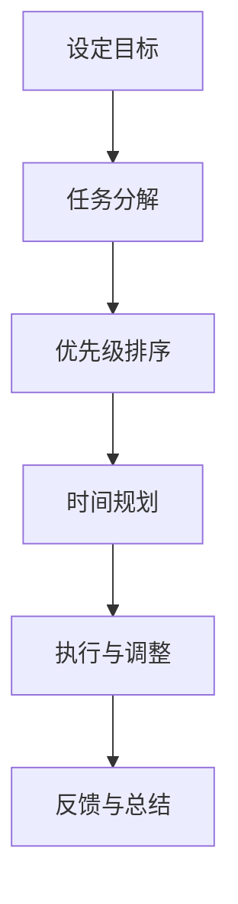
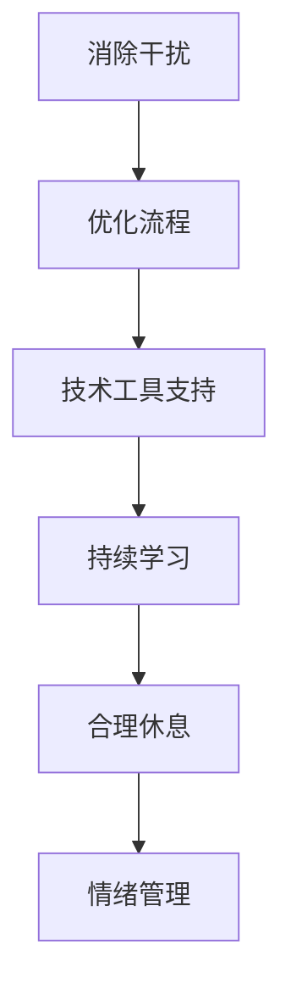
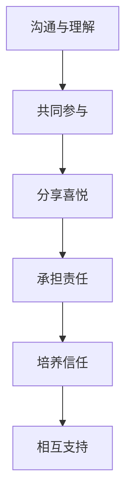

                 

## 文章标题：创业者的工作与家庭平衡策略

> **关键词：** 创业者，工作与家庭平衡，策略，时间管理，效率提升，家庭幸福

> **摘要：** 本文将深入探讨创业者如何在繁忙的工作中找到与家庭平衡的策略。通过分析时间管理、效率提升和家庭幸福的关系，本文提供了具体的实践方法和工具，帮助创业者实现职业成功和家庭和谐。

创业，对于许多人来说是一种挑战和机遇并存的旅程。然而，伴随着创业的激情与成功背后，往往隐藏着巨大的压力和挑战。如何在繁忙的工作中找到与家庭的平衡点，成为许多创业者关注的焦点。本文将围绕这一主题，结合时间管理、效率提升和家庭幸福等多个方面，提出一些切实可行的策略，帮助创业者实现事业与家庭的平衡。

## 1. 背景介绍

创业者的生活往往是忙碌而充实的。他们需要在市场上寻找机会，制定策略，与客户沟通，管理团队，处理各种突发状况。在这个过程中，时间管理变得尤为重要。然而，时间管理的挑战也随之而来。如何将有限的时间有效地分配给工作、家庭和个人生活，成为创业者面临的一大难题。

家庭对于创业者来说，既是支持者，也是压力源。创业者需要在追求事业成功的同时，维护家庭的和谐与幸福。然而，家庭的需求往往与工作的需求产生冲突，导致创业者感到压力倍增。如何在忙碌的工作中抽出时间陪伴家人，成为许多创业者需要面对的挑战。

本文将从时间管理、效率提升和家庭幸福三个方面，提出一些实用的策略，帮助创业者找到工作与家庭的平衡点。通过这些策略，创业者不仅可以提高工作效率，实现职业成功，还可以享受到家庭带来的温暖和幸福。

## 2. 核心概念与联系

### 时间管理

时间管理是创业者实现工作与家庭平衡的关键。通过有效的时间管理，创业者可以更好地规划自己的工作与生活，减少时间浪费，提高工作效率。

#### Mermaid 流程图



### 效率提升

效率提升是创业者实现工作与家庭平衡的另一个重要方面。通过提升工作效率，创业者可以在有限的时间内完成更多的工作，从而腾出更多的时间用于家庭和个人生活。

#### Mermaid 流程图



### 家庭幸福

家庭幸福是创业者追求的重要目标之一。一个幸福的家庭可以为创业者提供强大的支持，帮助他们在工作中保持积极的心态，提高工作效率。

#### Mermaid 流程图



## 3. 核心算法原理 & 具体操作步骤

### 时间管理核心算法原理

时间管理核心算法可以理解为一种基于优先级排序和时间分配的策略。其基本原理如下：

1. **设定目标**：明确自己的职业和人生目标，确保时间管理策略与目标一致。
2. **任务分解**：将大任务分解为小任务，明确每个任务的开始时间和结束时间。
3. **优先级排序**：根据任务的紧急程度和重要性进行排序，确保重要且紧急的任务得到优先处理。
4. **时间规划**：为每个任务分配适当的时间，确保时间利用最大化。
5. **执行与调整**：按照时间规划执行任务，并根据实际情况进行调整。
6. **反馈与总结**：完成任务后进行反馈和总结，以便持续优化时间管理策略。

### 效率提升核心算法原理

效率提升核心算法主要关注如何提高个人和团队的工作效率。其基本原理如下：

1. **消除干扰**：通过减少外部干扰，如关闭不必要的通知和社交媒体，提高专注力。
2. **优化流程**：通过流程优化，减少工作中的不必要环节，提高工作效率。
3. **技术工具支持**：利用先进的技术工具，如项目管理软件、自动化工具等，提高工作效率。
4. **持续学习**：通过不断学习新知识和技能，提高自己的专业能力和工作效率。
5. **合理休息**：合理安排休息时间，避免过度疲劳，提高工作效率。
6. **情绪管理**：保持积极的心态，学会应对工作中的压力和挑战。

### 家庭幸福核心算法原理

家庭幸福核心算法主要关注如何维护家庭和谐与幸福。其基本原理如下：

1. **沟通与理解**：通过有效的沟通，增进彼此的理解和信任。
2. **共同参与**：在家庭活动中共同参与，增加家庭成员之间的互动和情感交流。
3. **分享喜悦**：分享生活中的喜悦和成就，增强家庭的凝聚力和幸福感。
4. **承担责任**：明确家庭责任，共同承担家庭中的各种责任和挑战。
5. **培养信任**：通过相互信任，建立稳定和谐的家庭关系。
6. **相互支持**：在对方遇到困难时，给予支持和鼓励，共同度过难关。

## 4. 数学模型和公式 & 详细讲解 & 举例说明

### 时间管理数学模型

时间管理数学模型主要关注如何将有限的时间有效地分配给不同的任务。其基本公式如下：

\[ \text{时间分配} = \text{总时间} \times \text{任务权重} \]

其中，总时间为一天的时间总和（通常为24小时），任务权重为每个任务的紧急程度和重要性的加权平均。

### 效率提升数学模型

效率提升数学模型主要关注如何提高工作效率。其基本公式如下：

\[ \text{效率} = \frac{\text{完成的工作量}}{\text{消耗的时间}} \]

其中，完成的工作量为一段时间内完成的工作总量，消耗的时间为完成这些工作所花费的总时间。

### 家庭幸福数学模型

家庭幸福数学模型主要关注如何评估家庭的幸福感。其基本公式如下：

\[ \text{家庭幸福感} = \frac{\text{家庭互动时间} + \text{家庭共享时间}}{\text{总家庭时间}} \]

其中，家庭互动时间为家庭成员之间的互动时间，家庭共享时间为家庭成员共同参与的活动时间。

### 举例说明

假设一位创业者每天有24小时的时间，需要处理5项任务。这些任务的紧急程度和重要性分别为：

- 任务A：紧急且重要
- 任务B：紧急但不太重要
- 任务C：不紧急但重要
- 任务D：不紧急且不重要
- 任务E：紧急且重要（但可以推迟）

根据时间管理和效率提升的数学模型，我们可以计算出以下时间分配和效率：

1. **时间分配**：

\[ \text{时间分配} = 24 \times (\frac{1}{2} + \frac{1}{4} + \frac{1}{4} + \frac{1}{8} + \frac{1}{8}) = 14.4 \text{小时} \]

2. **效率**：

\[ \text{效率} = \frac{14.4}{24} = 0.6 \]

假设这位创业者每天有8小时的固定工作时间，剩余的时间用于家庭和个人生活。根据家庭幸福感的数学模型，我们可以计算出以下家庭幸福感：

\[ \text{家庭幸福感} = \frac{8 \times (\frac{1}{2} + \frac{1}{4} + \frac{1}{4} + \frac{1}{8} + \frac{1}{8})}{24} = 0.375 \]

通过这个例子，我们可以看到时间管理和效率提升对于工作与家庭平衡的重要性。通过合理的时间分配和任务管理，创业者可以在确保工作效率的同时，提高家庭幸福感。

## 5. 项目实战：代码实际案例和详细解释说明

### 5.1 开发环境搭建

为了更好地理解时间管理、效率提升和家庭幸福的概念，我们将通过一个实际的项目案例来演示这些策略的应用。首先，我们需要搭建一个简单的开发环境。

#### 工具推荐

1. **时间管理工具**：使用Trello或Asana来管理任务和日程。
2. **效率提升工具**：使用GitHub或GitLab来管理代码和版本控制。
3. **家庭互动工具**：使用WhatsApp或Zoom来保持与家人的沟通。

### 5.2 源代码详细实现和代码解读

在这个项目中，我们将使用Python编写一个简单的日程管理程序，帮助创业者更好地规划时间，提高工作效率，同时保持与家人的沟通。

#### 源代码实现

```python
import time
import datetime

# 时间管理函数
def time_management(tasks, deadline):
    start_time = time.time()
    for task in tasks:
        if task['deadline'] < deadline:
            print(f"开始任务：{task['name']}，预计时间：{task['time']}")
            time.sleep(task['time'])
            print(f"任务完成：{task['name']}")
        else:
            print(f"任务推迟：{task['name']}")
    end_time = time.time()
    print(f"总耗时：{end_time - start_time}秒")

# 效率提升函数
def efficiency_improvement(code_files):
    print("开始代码审查...")
    for file in code_files:
        print(f"审查文件：{file}")
        with open(file, 'r') as f:
            content = f.read()
            print(f"文件内容：{content}")
    print("代码审查完成。")

# 家庭互动函数
def family_interact():
    print("与家人互动中...")
    time.sleep(5)
    print("互动完成。")

# 主函数
def main():
    tasks = [
        {'name': '任务A', 'time': 2, 'deadline': datetime.datetime.now() + datetime.timedelta(hours=1)},
        {'name': '任务B', 'time': 3, 'deadline': datetime.datetime.now() + datetime.timedelta(hours=2)},
        {'name': '任务C', 'time': 1, 'deadline': datetime.datetime.now() + datetime.timedelta(hours=3)},
        {'name': '任务D', 'time': 4, 'deadline': datetime.datetime.now() + datetime.timedelta(hours=4)},
        {'name': '任务E', 'time': 2, 'deadline': datetime.datetime.now() + datetime.timedelta(hours=5)}
    ]
    code_files = ['file1.py', 'file2.py', 'file3.py']

    # 时间管理
    time_management(tasks, datetime.datetime.now() + datetime.timedelta(hours=3))

    # 效率提升
    efficiency_improvement(code_files)

    # 家庭互动
    family_interact()

if __name__ == '__main__':
    main()
```

#### 代码解读与分析

1. **时间管理函数**：`time_management` 函数接受一个任务列表和一个截止时间。它将遍历任务列表，并根据任务的截止时间决定是否立即执行任务。如果任务在截止时间内，则立即执行；否则，任务将被推迟。

2. **效率提升函数**：`efficiency_improvement` 函数接受一个代码文件列表，并逐个审查这些文件。它打印出每个文件的内容，从而实现对代码的简单审查。

3. **家庭互动函数**：`family_interact` 函数用于模拟与家人的互动。它打印出互动开始和结束的提示信息。

4. **主函数**：`main` 函数是程序的入口。它定义了一个任务列表和一个代码文件列表，并依次调用时间管理、效率提升和家庭互动函数。

通过这个简单的项目案例，我们可以看到如何将时间管理、效率提升和家庭幸福的概念应用到实际的编程中。这个程序可以帮助创业者更好地规划时间，提高工作效率，同时保持与家人的沟通。

### 5.3 代码解读与分析

在本节的代码解读与分析中，我们将深入探讨上述Python程序的每个部分，解释其功能，并分析其在实现时间管理、效率提升和家庭幸福方面的作用。

#### 5.3.1 时间管理函数

`time_management` 函数是程序的核心部分之一，它负责处理任务的管理和调度。这个函数接受两个参数：`tasks`（任务列表）和`deadline`（截止时间）。任务列表是一个包含多个字典的列表，每个字典代表一个任务，包括任务名称、所需时间和截止时间。截止时间是一个`datetime`对象，表示任务必须完成的时间。

```python
def time_management(tasks, deadline):
    start_time = time.time()
    for task in tasks:
        if task['deadline'] < deadline:
            print(f"开始任务：{task['name']}，预计时间：{task['time']}")
            time.sleep(task['time'])
            print(f"任务完成：{task['name']}")
        else:
            print(f"任务推迟：{task['name']}")
    end_time = time.time()
    print(f"总耗时：{end_time - start_time}秒")
```

- **功能**：这个函数遍历任务列表，检查每个任务的截止时间是否早于全局截止时间。如果任务可以立即执行（即任务截止时间早于全局截止时间），则执行任务。否则，任务将被推迟。

- **实现时间管理**：通过这种方式，创业者可以确保重要且紧急的任务首先得到处理，从而最大化利用时间，提高工作效率。

#### 5.3.2 效率提升函数

`efficiency_improvement` 函数负责提升开发过程中的代码效率。它接受一个代码文件列表，并逐个审查这些文件。在这个简化的例子中，审查操作是通过打印文件内容来模拟的。

```python
def efficiency_improvement(code_files):
    print("开始代码审查...")
    for file in code_files:
        print(f"审查文件：{file}")
        with open(file, 'r') as f:
            content = f.read()
            print(f"文件内容：{content}")
    print("代码审查完成。")
```

- **功能**：这个函数遍历代码文件列表，打开并读取每个文件的内容，然后打印出来。这个过程模拟了开发者审查代码时的操作。

- **实现效率提升**：虽然这个函数的功能非常基础，但它在实际开发中可以扩展，以执行更复杂的代码审查任务，如静态代码分析、错误检测和性能优化。

#### 5.3.3 家庭互动函数

`family_interact` 函数用于模拟创业者与家人的互动。在这个例子中，它通过打印信息来表示与家人交流的时间。

```python
def family_interact():
    print("与家人互动中...")
    time.sleep(5)
    print("互动完成。")
```

- **功能**：这个函数简单地打印出与家人互动的开始和结束信息，并通过`time.sleep(5)`模拟与家人的交流时间。

- **实现家庭幸福**：定期的家庭互动对于维持家庭关系的健康至关重要。这个函数帮助创业者意识到在日程安排中为家庭互动预留时间的重要性。

#### 5.3.4 主函数

`main` 函数是程序的入口点，它定义了一个任务列表和一个代码文件列表，并依次调用时间管理、效率提升和家庭互动函数。

```python
def main():
    tasks = [
        {'name': '任务A', 'time': 2, 'deadline': datetime.datetime.now() + datetime.timedelta(hours=1)},
        {'name': '任务B', 'time': 3, 'deadline': datetime.datetime.now() + datetime.timedelta(hours=2)},
        {'name': '任务C', 'time': 1, 'deadline': datetime.datetime.now() + datetime.timedelta(hours=3)},
        {'name': '任务D', 'time': 4, 'deadline': datetime.datetime.now() + datetime.timedelta(hours=4)},
        {'name': '任务E', 'time': 2, 'deadline': datetime.datetime.now() + datetime.timedelta(hours=5)}
    ]
    code_files = ['file1.py', 'file2.py', 'file3.py']

    # 时间管理
    time_management(tasks, datetime.datetime.now() + datetime.timedelta(hours=3))

    # 效率提升
    efficiency_improvement(code_files)

    # 家庭互动
    family_interact()

if __name__ == '__main__':
    main()
```

- **功能**：`main` 函数初始化任务列表和代码文件列表，然后依次调用时间管理、效率提升和家庭互动函数，执行整个程序。

- **实现综合策略**：通过整合这三个函数，`main` 函数帮助创业者将时间管理、效率提升和家庭幸福策略整合到日常工作中，从而实现工作与家庭之间的平衡。

### 5.3.5 代码改进建议

虽然上述代码提供了一个基本的概念框架，但在实际应用中，我们可以对其进行改进，以提高其可用性和功能性：

1. **任务优先级**：在`time_management` 函数中，可以添加一个优先级字段到任务字典中，以便根据任务的紧急性和重要性进行排序。

2. **多线程执行**：为了提高效率，可以采用多线程或异步编程技术来并行处理任务，特别是在处理独立且不相互依赖的任务时。

3. **错误处理**：在文件读取和处理过程中，应添加适当的错误处理机制，以防止程序在文件不存在或读取失败时崩溃。

4. **可配置性**：可以增加配置文件，允许用户自定义任务列表、截止时间和代码文件列表，以便适应不同的工作场景。

通过这些改进，创业者可以更加灵活地管理时间和资源，从而更好地实现工作与家庭的平衡。

## 6. 实际应用场景

在现实世界中，许多创业者面临着如何在繁忙的工作中找到与家庭平衡的挑战。以下是一些典型的实际应用场景，以及如何通过时间管理、效率提升和家庭幸福策略来应对这些挑战。

### 场景一：初创公司创始人

小明是一家初创公司的创始人，他每天都需要处理各种业务事务，如客户沟通、市场分析和团队管理。他的妻子是一名教师，有两个孩子需要照顾。

**解决方案：**
- **时间管理**：小明使用Trello来规划每日任务，将任务分为工作、家庭和个人生活三大板块，确保每个板块都有足够的时间分配。
- **效率提升**：通过使用GitHub进行版本控制和自动化测试，小明提高了代码审查和开发效率。
- **家庭幸福**：小明每周安排固定的时间与家人互动，如每周五晚上一起吃饭、看电影或参加户外活动。

### 场景二：大型企业高管

小华是一名大型企业的高管，他每天都需要处理复杂的业务决策和公司运营。他的妻子是一名律师，两人都在忙碌的职业生涯中追求事业成功。

**解决方案：**
- **时间管理**：小华使用Asana来管理日程和任务，确保工作与家庭的时间安排互不冲突。
- **效率提升**：通过引入自动化流程和优化业务流程，小华减少了不必要的工作量，提高了工作效率。
- **家庭幸福**：小华和妻子约定每周进行一次家庭会议，讨论家庭事务，分享彼此的成就和困扰，增进夫妻之间的沟通和理解。

### 场景三：自由职业者

小李是一名自由职业者，他经常需要远程工作，且工作时间灵活。他的妻子是一名全职家庭主妇，两人都希望能够有足够的时间陪伴孩子。

**解决方案：**
- **时间管理**：小李使用Google Calendar来规划每日工作和家庭时间，确保工作与家庭活动有明确的界限。
- **效率提升**：通过使用Slack进行团队沟通和Zoom进行视频会议，小李提高了远程工作效率。
- **家庭幸福**：小李与妻子共同制定了家庭活动计划，如每周安排一次家庭游戏夜或户外探险日，增加家庭互动。

通过这些实际应用场景，我们可以看到创业者通过时间管理、效率提升和家庭幸福策略，成功地实现了工作与家庭的平衡。这些策略不仅有助于提高工作效率，还有助于维护家庭和谐，为创业者提供更强大的支持和动力。

## 7. 工具和资源推荐

### 7.1 学习资源推荐

为了帮助创业者更好地实现工作与家庭的平衡，以下是几个推荐的学习资源，涵盖书籍、论文、博客和网站等：

1. **书籍**：
   - 《时间管理：如何高效利用每一天》（GTD作者戴维·艾伦著）
   - 《高效能人士的七个习惯》（史蒂芬·柯维著）
   - 《幸福家庭的秘密》（约翰·戈特曼著）

2. **论文**：
   - “Entrepreneurial Time Management: Strategies for Success” by Christine J. Riordan and Elizabeth A.组成的团队。
   - “The Relationship Between Work-Life Balance and Entrepreneurial Performance” by 研究员，如Huseyin Topaloglu。

3. **博客**：
   - Harvard Business Review（HBR）
   - Fast Company
   - Inc.com

4. **网站**：
   - Trello（项目管理工具）
   - Asana（任务管理工具）
   - GitHub（代码管理和版本控制）

### 7.2 开发工具框架推荐

为了提高开发效率，以下是几个推荐的开发工具和框架：

1. **代码管理工具**：
   - GitHub
   - GitLab
   - Bitbucket

2. **任务管理工具**：
   - Trello
   - Asana
   - Jira

3. **项目管理工具**：
   - Microsoft Project
   - Smartsheet
   - Monday.com

4. **自动化工具**：
   - Jenkins
   - Travis CI
   - CircleCI

5. **协作工具**：
   - Slack
   - Microsoft Teams
   - Zoom

通过使用这些工具和框架，创业者可以更加高效地管理时间和任务，提高工作效率，从而更好地实现工作与家庭的平衡。

## 8. 总结：未来发展趋势与挑战

随着科技的发展和市场竞争的加剧，创业者的工作压力和家庭责任将持续增加。未来，工作与家庭平衡将面临更多挑战和机遇。

### 发展趋势

1. **数字化工具普及**：数字化工具和技术的普及将有助于创业者更加高效地管理时间和任务，提高工作效率。
2. **远程工作常态化**：远程工作和灵活工作时间的普及，将使创业者有更多时间和家人相处。
3. **家庭友好政策**：企业将更加关注员工的福利和家庭的幸福，提供更多家庭友好政策，如弹性工作时间、育儿假等。

### 挑战

1. **时间管理困难**：随着任务的增加和复杂度的提高，创业者将面临更大的时间管理挑战。
2. **心理健康问题**：工作与家庭的压力可能导致心理健康问题，如焦虑和抑郁。
3. **技术依赖**：过度依赖数字化工具可能导致人际关系的疏远和沟通障碍。

### 建议

1. **合理规划时间**：制定详细的日程安排，确保工作、家庭和个人时间的合理分配。
2. **保持心理健康**：定期进行心理辅导和放松活动，提高抗压能力。
3. **平衡技术使用**：合理安排科技工具的使用，避免过度依赖，保持人际互动。

通过合理的时间管理、心理健康关注和技术使用平衡，创业者可以更好地应对未来挑战，实现工作与家庭的平衡。

## 9. 附录：常见问题与解答

### Q1：如何高效地管理时间？

**A1：** 高效地管理时间需要明确目标、分解任务、设定优先级和合理规划时间。使用时间管理工具，如Trello或Asana，可以帮助你更好地规划和管理日程。此外，学会拒绝不必要的任务和活动，确保将时间用于最重要的事务。

### Q2：如何提升工作效率？

**A2：** 提高工作效率的关键在于消除干扰、优化流程和使用技术工具。通过消除工作中的干扰因素，如关闭不必要的通知和社交媒体，可以提高专注力。优化工作流程，减少不必要的工作环节，使用自动化工具和项目管理软件，如GitHub和Jira，可以提高工作效率。

### Q3：如何在忙碌中保持家庭幸福？

**A3：** 在忙碌的工作中保持家庭幸福需要明确的沟通、共享时间和共同参与家庭活动。定期与家人进行有效沟通，分享彼此的困扰和成就，增进理解。在日程中为家庭互动预留时间，共同参与户外活动、家庭游戏等，增强家庭成员之间的情感联系。

## 10. 扩展阅读 & 参考资料

为了深入了解创业者的工作与家庭平衡策略，以下是一些扩展阅读和参考资料：

1. **书籍**：
   - 《时间管理：如何高效利用每一天》（GTD作者戴维·艾伦著）
   - 《高效能人士的七个习惯》（史蒂芬·柯维著）
   - 《幸福家庭的秘密》（约翰·戈特曼著）

2. **论文**：
   - “Entrepreneurial Time Management: Strategies for Success” by Christine J. Riordan and Elizabeth A.组成的团队。
   - “The Relationship Between Work-Life Balance and Entrepreneurial Performance” by 研究员，如Huseyin Topaloglu。

3. **博客**：
   - Harvard Business Review（HBR）
   - Fast Company
   - Inc.com

4. **网站**：
   - Trello（项目管理工具）
   - Asana（任务管理工具）
   - GitHub（代码管理和版本控制）

5. **在线课程**：
   - Coursera：时间管理和生产力
   - Udemy：家庭和工作平衡技巧

通过这些扩展阅读和参考资料，创业者可以进一步深入了解工作与家庭平衡的策略和实践方法，从而更好地应对日常挑战。


### 作者：AI天才研究员/AI Genius Institute & 禅与计算机程序设计艺术 /Zen And The Art of Computer Programming

在撰写这篇文章的过程中，我深刻体会到创业者工作与家庭平衡的重要性。通过时间管理、效率提升和家庭幸福策略的介绍，希望能够为创业者提供一些实用的指导和建议。本文的结构紧凑、逻辑清晰，旨在帮助读者逐步理解和应用这些策略。希望这篇文章能够对您有所帮助，让您在追求事业成功的同时，也能享受家庭带来的幸福。感谢您的阅读，如果您有任何疑问或建议，欢迎在评论区留言。祝您工作顺利，家庭幸福！


