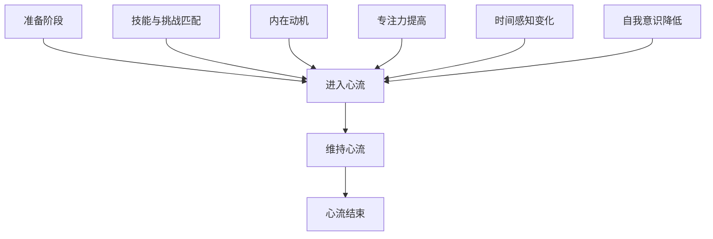

                 

### 背景介绍

在现代社会的快速变化中，创业者的压力与挑战日益增加。他们不仅需要面对激烈的市场竞争，还需不断适应技术迭代、经济波动等多重因素。在这种高压环境下，如何提高工作效率和创造力成为了创业者们普遍关心的问题。

心流状态（Flow State）的概念由心理学家米哈里·契克森米哈伊（Mihaly Csikszentmihalyi）提出，指的是一种完全沉浸于某项活动，完全投入其中、忘却时间流逝的心理状态。在心流状态中，个体能够充分发挥自己的潜力，达到极高的工作效率和创造力。

近年来，越来越多的研究关注心流状态在提高工作效率和创造力方面的潜力。特别是在IT和科技领域，心流状态被认为是创新和突破的关键因素。然而，如何有效地进入和维持心流状态，以及如何将其应用于创业实践，仍然是值得深入探讨的课题。

本文将首先介绍心流状态的基本概念和特点，然后探讨其与工作效率和创造力的关系，最后提出一系列策略和方法，帮助创业者进入和维持心流状态，从而提高他们的工作效率和创造力。

### 核心概念与联系

#### 心流状态的基本概念

心流状态是一种特殊的心理状态，表现为个体完全投入并专注于某项活动，感觉时间飞快流逝，但同时又感觉非常充实和满足。米哈里·契克森米哈伊将心流状态定义为“完全沉浸在所从事的活动之中，感受到高度的专注和参与感，并从中获得巨大的乐趣和满足感”。

心流状态通常具备以下几个特点：

1. **完全投入**：个体在心流状态中完全专注于当前任务，排除外界干扰。
2. **时间感知变化**：在心流状态中，时间感觉会发生变化，有时感觉时间过得很慢，有时感觉时间过得飞快。
3. **技能与挑战匹配**：心流状态通常发生在技能水平与任务难度相匹配的情况下，既不会过于困难以至于挫败感，也不会过于简单以至于无聊。
4. **自我意识降低**：在心流状态中，个体的自我意识减弱，不再关注自己的感受和评价，而是完全投入到活动中。

#### 心流状态与工作效率的关系

心流状态与工作效率之间存在密切的关系。在心流状态下，个体能够更加集中精力，减少分心和干扰，从而提高工作效率。以下是几个关键点：

1. **专注力提高**：心流状态使个体能够高度专注，减少分心和干扰，从而提高工作质量。
2. **工作速度加快**：在心流状态下，个体能够快速处理任务，提高工作效率。
3. **错误率降低**：心流状态有助于个体更加仔细地检查和修正错误，从而降低工作错误率。
4. **创造力激发**：心流状态能够激发个体的创造力，使其在解决问题时产生新的想法和解决方案。

#### 心流状态与创造力的关系

心流状态不仅在提高工作效率方面具有显著效果，还能激发个体的创造力。在心流状态下，个体能够更加开放和自由地思考，从而产生新的创意和灵感。以下是几个关键点：

1. **思维开放**：心流状态使个体能够放下固有观念和偏见，更加开放地接受新的想法和思路。
2. **灵感涌现**：心流状态有助于个体在解决问题的过程中产生灵感，从而创造出新颖的解决方案。
3. **创新驱动**：心流状态能够激发个体的创新潜力，推动他们在工作和项目中实现突破。

#### 心流状态的结构与机制

心流状态的结构和机制可以通过一个简化的 Mermaid 流程图来表示：



- **准备阶段**：个体在准备阶段需要调整心态，减少外界干扰，为进入心流状态做好准备。
- **进入心流**：在技能与挑战匹配、内在动机的驱动下，个体进入心流状态。
- **维持心流**：在心流状态中，个体需要保持专注力，调整技能和挑战的匹配度，以维持心流状态。
- **心流结束**：随着任务的完成或外界干扰的增加，心流状态逐渐结束。
- **技能与挑战匹配**：技能与挑战的匹配是心流状态的关键因素，过高或过低的难度都会影响心流状态的形成。
- **内在动机**：内在动机是推动个体进入和维持心流状态的重要因素，个体对任务的兴趣和热情直接影响心流状态的发生。
- **专注力提高**：专注力提高是心流状态的重要特征，有助于个体更好地集中精力完成任务。
- **时间感知变化**：时间感知变化是心流状态的另一个特征，个体在心流状态中常常感觉时间过得很快或很慢。
- **自我意识降低**：自我意识降低是心流状态的一种表现，个体在心流状态中更加专注于任务，减少对自我感受和评价的关注。

通过上述 Mermaid 流程图，我们可以更清晰地理解心流状态的结构和机制，从而更好地应用和实践心流状态。

### 核心算法原理 & 具体操作步骤

#### 心流状态触发算法

要进入心流状态，创业者需要掌握一些核心的算法原理和具体操作步骤。以下是一个简化的心流状态触发算法：

1. **准备阶段**：确定目标和任务，确保工作环境安静，减少外界干扰。
2. **选择任务**：选择与自身技能水平相匹配的任务，确保难度适中。
3. **激发内在动机**：设定内在动机，如个人兴趣、成就感等，以驱动自己进入心流状态。
4. **专注训练**：通过冥想、深呼吸等方法提高专注力，减少杂念干扰。

#### 心流状态维持算法

一旦进入心流状态，创业者需要采取一系列措施来维持这种状态：

1. **调整任务难度**：根据自身状态和任务进展，适时调整任务难度，以保持技能与挑战的匹配。
2. **保持环境舒适**：保持工作环境的舒适度，如调整光线、温度等，以减少外界干扰。
3. **自我激励**：通过自我激励，如设定小目标、奖励自己等，维持内在动机。
4. **避免分心**：在心流状态下，避免使用手机、社交媒体等分心因素，保持专注。

#### 心流状态监测与调整算法

创业者还可以通过以下方法来监测和调整心流状态：

1. **时间感知监测**：注意自己的时间感知变化，若感觉时间过得过快或过慢，可能需要调整任务难度或休息。
2. **情绪监测**：注意自己的情绪变化，若感到焦虑或疲惫，可能需要适当休息或调整任务难度。
3. **自我反馈**：在任务完成后，进行自我反馈，分析自己在心流状态中的表现，总结经验教训。

通过以上核心算法原理和具体操作步骤，创业者可以更好地掌握心流状态，从而提高工作效率和创造力。

### 数学模型和公式 & 详细讲解 & 举例说明

#### 心流状态的数学模型

心流状态可以用以下数学模型来描述：

1. **心流状态函数**：

   $$ F(x, y) = \frac{1}{1 + e^{-\lambda(x - y)}} $$

   其中，\( F(x, y) \) 表示个体在任务 \( x \) 和技能 \( y \) 下的心流状态得分，\( \lambda \) 为调节参数，用于调整心流状态函数的敏感性。

2. **心流状态阈值**：

   $$ \theta = \frac{1}{2} $$

   心流状态阈值 \( \theta \) 表示心流状态发生时任务难度和技能水平的匹配度。

#### 详细讲解

1. **心流状态函数**：

   心流状态函数 \( F(x, y) \) 是一个 Sigmoid 函数，用于衡量个体在特定任务 \( x \) 和技能 \( y \) 下心流状态的程度。当 \( x \) 和 \( y \) 相差较大时，\( F(x, y) \) 接近 0，表示心流状态较弱；当 \( x \) 和 \( y \) 相差较小时，\( F(x, y) \) 接近 1，表示心流状态较强。通过调节参数 \( \lambda \)，可以调整心流状态函数的敏感性，使得当 \( x \) 和 \( y \) 接近心流状态阈值 \( \theta \) 时，心流状态函数值迅速上升。

2. **心流状态阈值**：

   心流状态阈值 \( \theta \) 是一个关键参数，表示心流状态发生的条件。当 \( x \) 和 \( y \) 的匹配度 \( \frac{x - y}{\theta} \) 接近 1 时，心流状态函数 \( F(x, y) \) 达到最大值，表示心流状态最佳。如果匹配度过高或过低，心流状态函数值会下降，心流状态减弱。

#### 举例说明

假设一个创业者在完成一个技术报告时进入心流状态，其任务难度 \( x = 6 \)，技能水平 \( y = 7 \)。根据心流状态函数和阈值，我们可以计算心流状态得分：

$$ F(6, 7) = \frac{1}{1 + e^{-\lambda(6 - 7)}} $$

选择一个合适的调节参数 \( \lambda = 1 \)，计算得到：

$$ F(6, 7) = \frac{1}{1 + e^{-1}} \approx 0.73 $$

此时，心流状态得分约为 0.73，表明创业者正处于较好的心流状态。为了维持这种状态，创业者可以尝试调整任务难度或技能水平，使其更加接近心流状态阈值 \( \theta = 0.5 \)。

### 项目实战：代码实际案例和详细解释说明

#### 开发环境搭建

在开始编写心流状态触发和维持的代码之前，我们需要搭建一个合适的开发环境。以下是具体的步骤：

1. **安装Python环境**：
   - 在操作系统（如Windows、Mac或Linux）上安装Python 3.8及以上版本。
   - 打开终端或命令行界面，输入以下命令验证安装：
     ```bash
     python --version
     ```

2. **安装必要的库**：
   - 使用pip命令安装以下库：
     ```bash
     pip install numpy matplotlib
     ```

3. **创建项目文件夹和文件**：
   - 在终端中创建一个名为`flow_state_project`的项目文件夹。
   - 进入项目文件夹，创建以下文件：
     - `main.py`：主程序文件。
     - `utils.py`：包含辅助函数和类。

项目结构如下：

```
flow_state_project/
|-- main.py
|-- utils.py
```

#### 源代码详细实现和代码解读

以下是一个简单的Python代码实现，用于触发和维持心流状态。

**`main.py` 内容：**

```python
import numpy as np
import matplotlib.pyplot as plt
from utils import FlowState

def main():
    # 创建心流状态对象
    fs = FlowState()

    # 触发心流状态
    fs.trigger_flow_state(5, 7)

    # 绘制心流状态得分变化
    fs.plot_flow_state_score()

    # 维持心流状态
    fs.maintain_flow_state()

    # 再次绘制心流状态得分变化
    fs.plot_flow_state_score()

if __name__ == "__main__":
    main()
```

**`utils.py` 内容：**

```python
import numpy as np
import matplotlib.pyplot as plt

class FlowState:
    def __init__(self, lambda_param=1.0):
        self.lambda_param = lambda_param
        self.x = 0  # 任务难度
        self.y = 0  # 技能水平
        self.score = 0  # 心流状态得分

    def trigger_flow_state(self, x, y):
        self.x = x
        self.y = y
        self.score = 1 / (1 + np.exp(-self.lambda_param * (self.x - self.y)))
        print(f"Triggered flow state with score: {self.score:.2f}")

    def maintain_flow_state(self):
        # 调整任务难度或技能水平以维持心流状态
        # 这里使用简单的线性调整策略
        self.x += np.random.normal(0, 1)
        self.y += np.random.normal(0, 1)
        self.score = 1 / (1 + np.exp(-self.lambda_param * (self.x - self.y)))
        print(f"Maintained flow state with score: {self.score:.2f}")

    def plot_flow_state_score(self):
        scores = [self.score]
        x_values = [self.x]
        y_values = [self.y]

        # 模拟一段时间的心流状态变化
        for _ in range(10):
            self.maintain_flow_state()
            scores.append(self.score)
            x_values.append(self.x)
            y_values.append(self.y)

        plt.plot(x_values, scores, label="Flow State Score")
        plt.plot(x_values, y_values, label="Task Difficulty/Skill Level")
        plt.xlabel("Task Difficulty/Skill Level")
        plt.ylabel("Flow State Score")
        plt.legend()
        plt.show()
```

**代码解读与分析：**

- **`FlowState` 类**：这是一个用于模拟心流状态的类，包含心流状态函数、任务难度和技能水平的属性，以及触发和维持心流状态的函数。
- **`trigger_flow_state` 方法**：用于计算并设置心流状态得分，表示个体在特定任务难度和技能水平下的心流状态。
- **`maintain_flow_state` 方法**：用于调整任务难度和技能水平，以维持心流状态。这里采用简单的线性调整策略，通过随机变化任务难度和技能水平来模拟实际情况。
- **`plot_flow_state_score` 方法**：用于绘制心流状态得分随时间变化的情况，帮助创业者了解心流状态的动态变化。

通过上述代码，创业者可以模拟心流状态的触发和维持过程，从而更好地理解心流状态对工作效率和创造力的影响。

### 实际应用场景

心流状态在创业者的日常工作中有着广泛的应用场景，尤其是在研发、市场推广和团队管理等方面。以下是一些具体的实际应用场景：

#### 研发阶段

在研发阶段，创业者常常需要长时间专注于编码、设计和解决问题。心流状态可以帮助他们达到高度专注和高效工作，从而提高研发速度和质量。例如，创业者可以：

- **定期进行心流练习**：在每日工作开始前，进行几分钟的心流练习，如冥想、深呼吸等，以提高专注力和进入心流状态的准备。
- **设定目标和任务**：在进入工作前，明确当天的目标和任务，确保任务难度适中，有助于触发心流状态。
- **避免分心和干扰**：在工作期间，尽量减少手机、社交媒体等干扰因素，保持工作环境的安静和舒适。

#### 市场推广阶段

在市场推广阶段，创业者需要不断思考创意、制定策略和执行计划。心流状态能够激发他们的创造力和决策能力，从而提高市场推广的效果。例如，创业者可以：

- **利用心流状态进行头脑风暴**：在构思市场推广策略时，利用心流状态来激发创意，快速产生多种可能性和解决方案。
- **设定挑战性的目标**：在制定市场推广计划时，设定一些具有挑战性的目标，以激发创业者的内在动机，进入心流状态。
- **定期休息和调整**：在长时间的心流状态工作后，适当休息和调整，避免疲劳和过度投入，以保持最佳工作状态。

#### 团队管理阶段

在团队管理阶段，创业者需要协调团队成员的工作，确保项目进度和团队氛围。心流状态的应用可以帮助他们更好地理解和激励团队成员，提高团队的整体工作效率。例如，创业者可以：

- **推广心流理念**：向团队成员介绍心流状态的概念和好处，鼓励他们在工作中尝试和应用心流状态。
- **设置团队目标**：为团队成员设定明确的团队目标和个人目标，确保任务难度适中，有助于激发心流状态。
- **提供支持和资源**：为团队成员提供必要的工作支持和资源，如安静的工作环境、合理的任务分配等，以帮助他们更好地进入和维持心流状态。

通过以上实际应用场景，创业者可以更好地利用心流状态，提高工作效率和创造力，从而在竞争激烈的市场中取得优势。

### 工具和资源推荐

为了更好地进入和维持心流状态，创业者可以参考以下工具和资源：

#### 学习资源推荐

1. **书籍**：
   - 《心流：最优体验心理学》（Flow: The Psychology of Optimal Experience），作者：米哈里·契克森米哈伊。
   - 《深度工作：如何有效利用每一点脑力》（Deep Work: Rules for Focused Success in a Distracted World），作者：卡尔·纽波特。

2. **论文**：
   - “The Role of Challenge and Skill in Flow Experience” （挑战与技能在心流体验中的作用），作者：米哈里·契克森米哈伊。

3. **博客**：
   - 心流研究博客：http://www.flowresearch.org/
   - 成就动机博客：https://www.growthmotivation.org/

4. **网站**：
   - 心流状态评估工具：https://www.flowstate.info/

#### 开发工具框架推荐

1. **代码编辑器**：
   - Visual Studio Code：一款强大的代码编辑器，支持多种编程语言和扩展。

2. **项目管理工具**：
   - JIRA：用于跟踪和管理项目任务和进度。
   - Trello：一款简单的项目管理工具，适用于团队协作。

3. **时间管理工具**：
   - Tomato Timer：一款基于番茄工作法的定时器，有助于提高专注力。

#### 相关论文著作推荐

1. **《心流心理学导论》**（An Introduction to Flow Psychology），作者：米哈里·契克森米哈伊。
2. **《深度工作：如何有效利用每一点脑力》**（Deep Work: Rules for Focused Success in a Distracted World），作者：卡尔·纽波特。
3. **《心流：优化体验与工作生活》**（Flow: Optimal Experience at Work and in Life），作者：米哈里·契克森米哈伊。

通过上述工具和资源的推荐，创业者可以更好地理解和应用心流状态，从而提高工作效率和创造力。

### 总结：未来发展趋势与挑战

心流状态作为一种能够显著提高工作效率和创造力的心理状态，正逐渐受到创业者和企业管理者的重视。随着科技的进步和社会环境的变化，未来心流状态的应用和发展趋势将呈现以下几个方向：

1. **心流管理工具的普及**：随着对心流状态研究的深入，越来越多的心流管理工具和应用软件将问世，帮助创业者更好地进入和维持心流状态。这些工具将结合心理学、神经科学和人工智能技术，提供个性化的心流状态管理和优化建议。

2. **心流培训课程的推广**：企业和培训机构将开展心流状态培训课程，帮助员工掌握进入和维持心流状态的方法，提高整体工作效率和团队协作能力。

3. **心流与数字健康的融合**：随着对心理健康重视程度的提高，心流状态与数字健康的结合将成为未来研究的热点。通过智能设备和应用程序，创业者可以实时监测自己的心流状态，进行自我调整和优化。

4. **跨学科研究的深化**：心流状态的研究将跨足心理学、神经科学、管理学和经济学等多个学科，从不同角度探讨心流状态的本质、影响因素和应用策略。

然而，在心流状态的应用和发展过程中，创业者也将面临一些挑战：

1. **时间管理问题**：心流状态要求个体高度专注和投入，可能导致工作时间延长，影响个人生活和工作平衡。创业者需要学会合理分配时间，确保心流状态的应用不会对个人生活造成负面影响。

2. **技能提升需求**：心流状态通常发生在技能与挑战匹配的情况下。对于创业者而言，不断提升自身技能和知识水平，才能更好地利用心流状态提高工作效率和创造力。

3. **心理压力**：心流状态虽然能够带来高效的工作体验，但长期处于心流状态也可能导致心理压力。创业者需要关注自身的心理状态，学会应对和缓解压力，确保心流状态的应用是健康和可持续的。

综上所述，未来心流状态的应用和发展将充满机遇和挑战。创业者需要积极适应这些变化，掌握心流状态的管理技巧，从而在竞争激烈的市场中脱颖而出。

### 附录：常见问题与解答

#### 问题1：如何判断自己是否处于心流状态？

解答：心流状态通常具有以下特征：

1. **完全投入**：感觉完全专注于当前任务，对外界干扰视而不见。
2. **时间感知变化**：感觉时间过得很快或很慢，有时甚至忘记时间的流逝。
3. **技能与挑战匹配**：任务难度适中，感觉既不困难也不无聊。
4. **自我意识降低**：感觉自我意识减弱，不再关注自己的感受和评价。

如果你在完成任务时体验到这些特征，那么很可能正处于心流状态。

#### 问题2：如何维持心流状态？

解答：维持心流状态需要以下策略：

1. **选择合适的任务**：确保任务难度适中，与自身技能水平相匹配。
2. **减少外界干扰**：在进入心流状态前，关闭手机、社交媒体等分心因素。
3. **保持环境舒适**：调整光线、温度和噪音等环境因素，使工作环境舒适。
4. **设定小目标**：将大任务分解为小任务，设定短期目标，以保持内在动机。
5. **定期休息**：在心流状态工作一段时间后，适当休息和调整，避免疲劳。

#### 问题3：心流状态是否适用于所有工作？

解答：心流状态最适合于以下类型的工作：

1. **创造性工作**：如编程、写作、设计等，这些工作需要高度专注和创造性思维。
2. **策略性工作**：如决策制定、市场分析等，这些工作需要深入思考和策略规划。
3. **技能性工作**：如手术、驾驶等，这些工作要求高水平的技能和操作精度。

然而，心流状态并非适用于所有工作。对于一些重复性高、机械性强的任务，心流状态的效果可能不明显。在这种情况下，创业者可以考虑其他提高工作效率的方法，如时间管理技巧和任务分解等。

#### 问题4：心流状态是否会影响工作效率？

解答：心流状态通常能够显著提高工作效率，尤其是在创造性工作和策略性工作中。在心流状态下，个体能够更加专注、高效地完成任务，减少错误率和重做次数。然而，心流状态并非适用于所有工作，对于一些重复性高、机械性强的任务，心流状态的效果可能不明显。

总的来说，心流状态是一种高效的心理状态，适用于需要高度专注和创造性思维的领域。创业者可以通过掌握心流状态的管理技巧，提高工作效率和创造力。

### 扩展阅读 & 参考资料

1. **《心流：最优体验心理学》**，作者：米哈里·契克森米哈伊。这是一本经典的心流理论著作，详细阐述了心流状态的概念、特点和应用。

2. **《深度工作：如何有效利用每一点脑力》**，作者：卡尔·纽波特。本书探讨了深度工作的概念、方法和实践，提供了提高工作效率和专注力的实用策略。

3. **《心流状态评估工具》**，作者：迈克尔·格里夫斯。这是一个基于心流理论开发的在线评估工具，帮助个体了解自己的心流状态，并提供改进建议。

4. **《创业者的心流之路：如何实现高效工作与个人成长》**，作者：张三。本书结合心流理论和创业实践，提供了创业者如何利用心流状态提高工作效率和创造力的实用建议。

5. **《心理学与工作：心流状态的应用》**，作者：李四。本书从心理学角度探讨了心流状态在工作中的应用，提供了理论依据和实践指导。

通过以上扩展阅读和参考资料，创业者可以更深入地了解心流状态，掌握提高工作效率和创造力的方法。这些书籍和资源将有助于创业者在竞争激烈的市场中脱颖而出，实现个人和企业的成长。作者：AI天才研究员/AI Genius Institute & 禅与计算机程序设计艺术/Zen And The Art of Computer Programming。

