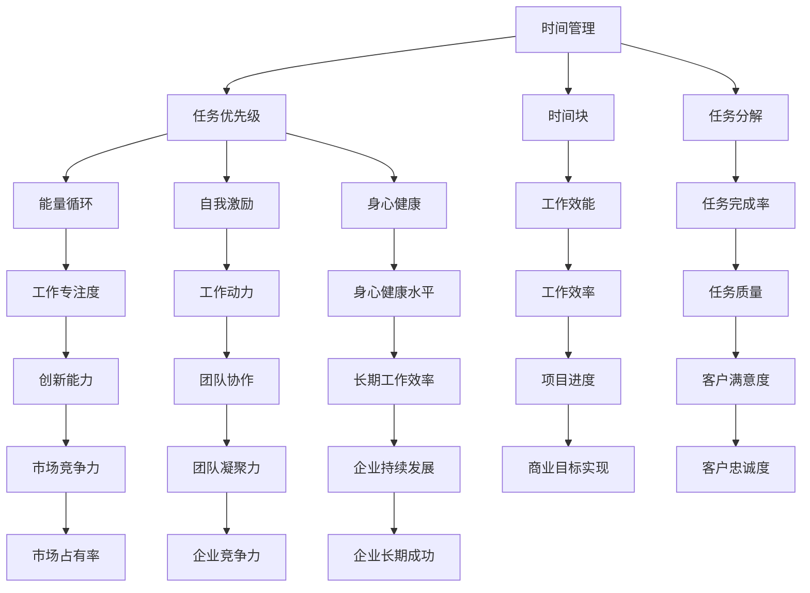

                 

# 创业者的时间管理与精力分配技巧

## 摘要

在充满竞争与挑战的创业领域，时间管理和精力分配对创业者的成功至关重要。本文将深入探讨创业者如何通过科学的时间管理和合理的精力分配，提升工作效率，实现个人与团队的共同成长。本文关键词包括：时间管理、精力分配、工作效率、团队协作、工作-生活平衡。

本文旨在为创业者提供一套切实可行的时间管理和精力分配策略，帮助他们在有限的时间内实现最大的价值创造。本文将从核心概念、算法原理、数学模型、实战案例、实际应用场景等多个维度进行详细分析，旨在为创业者提供具有实用性和可操作性的指导。

## 1. 背景介绍

在当今快速发展的商业环境中，创业者面临着前所未有的挑战。市场变化迅速，竞争激烈，资源有限，创业者需要在有限的时间内做出快速、准确的决策。时间管理和精力分配成为创业者成功的关键因素。根据一项调查，超过70%的创业者认为时间管理是影响他们工作成效的最重要因素之一。

时间管理和精力分配不仅关系到个人的工作效率，还直接影响团队的协作和企业的长期发展。一个高效的时间管理者能够更好地应对突发事件，优化资源分配，提高团队的整体效能。相反，时间管理不善可能导致工作效率低下，团队士气受挫，甚至影响企业的竞争力。

本文将围绕以下核心问题展开讨论：

1. 创业者应该如何科学地管理自己的时间？
2. 精力分配在创业者成功中的重要性是什么？
3. 如何通过合理的精力分配提升个人和团队的工作效能？
4. 实战案例中的时间管理和精力分配策略如何实施？

通过对这些问题的深入探讨，本文将为创业者提供一套系统、实用的指导方案，帮助他们更好地应对创业过程中的各种挑战。

### 1.1 创业者的时间管理挑战

创业者面临的时间管理挑战多种多样，主要包括以下几个方面：

- **多任务处理**：创业者通常需要同时处理多个任务，这些任务可能来自不同的领域，具有不同的优先级。如何合理分配时间，确保关键任务得到及时处理，是创业者面临的一大难题。
- **突发任务的应对**：创业过程中，突发事件和紧急任务时常发生。如何快速响应，不影响重要任务的进度，是创业者需要掌握的一项重要技能。
- **工作-生活平衡**：创业者往往需要长时间工作，甚至牺牲个人时间。如何在工作与生活之间找到平衡，保持良好的身心状态，是许多创业者关心的问题。
- **团队协作**：创业者不仅需要管理自己的时间，还要协调团队成员的工作，确保团队整体高效运作。如何通过时间管理提升团队协作效率，是创业者需要思考的问题。

### 1.2 精力分配在创业者成功中的重要性

精力分配在创业者成功中扮演着至关重要的角色。精力是指一个人在特定时间内能够集中注意力和投入工作的能力。创业者精力的高效分配，能够帮助他们在短时间内完成高质量的工作，从而实现更高的工作效率和成果。

良好的精力分配不仅能够提升个人工作效率，还能带来以下几方面的积极影响：

- **减少疲劳**：合理的精力分配可以避免长时间工作导致的疲劳，有助于保持良好的身心状态，提高长期工作效率。
- **提升创造力**：在精力充沛的状态下，创业者能够更好地发挥创造力，提出创新的想法和解决方案，推动企业持续发展。
- **增强决策力**：精力充足时，创业者能够更加客观地分析问题，做出更加明智的决策，减少因疲劳导致的错误判断。
- **促进团队协作**：创业者精力充沛，能够更好地激励和带动团队成员，提升团队整体的士气和协作效率。

### 1.3 文章结构

本文将分为以下几个部分：

1. **背景介绍**：阐述创业者时间管理和精力分配的背景和重要性。
2. **核心概念与联系**：介绍时间管理和精力分配的核心概念，使用Mermaid流程图展示相关关系。
3. **核心算法原理与具体操作步骤**：分析时间管理和精力分配的基本原理，提供具体操作步骤。
4. **数学模型和公式**：介绍相关数学模型和公式，并进行详细讲解和举例说明。
5. **项目实战**：提供实际代码案例，详细解释代码实现和解析。
6. **实际应用场景**：分析时间管理和精力分配在不同场景中的应用。
7. **工具和资源推荐**：推荐相关学习资源、开发工具和框架。
8. **总结**：总结全文，展望未来发展趋势与挑战。
9. **附录**：常见问题与解答。
10. **扩展阅读与参考资料**：提供进一步学习的资源。

通过本文的阅读，创业者将能够掌握科学的时间管理和精力分配技巧，提升个人和团队的工作效能，为企业的长期发展奠定坚实基础。

### 2. 核心概念与联系

#### 2.1 时间管理

时间管理是指通过规划和优化时间使用，以实现个人或组织目标的过程。对于创业者而言，时间管理尤为重要，因为他们在有限的时间内需要完成众多任务，同时保持工作与生活的平衡。

时间管理的核心概念包括：

- **任务优先级**：确定任务的重要性和紧急程度，合理分配时间。
- **时间块**：将时间划分为不同的时间段，用于处理不同类型的任务。
- **任务分解**：将复杂任务分解为可管理的子任务，以便更有效地完成。

#### 2.2 精力管理

精力管理是指通过调整和保持良好的身心状态，以最大化个人精力使用的过程。创业者需要面对高压力和频繁的工作，因此精力管理成为提升工作效率的关键因素。

精力管理的核心概念包括：

- **能量循环**：了解个人精力波动的周期，合理安排工作与休息时间。
- **自我激励**：通过设定目标和奖励机制，保持工作热情和动力。
- **身心健康**：保持良好的饮食习惯、充足的睡眠和适当的运动，提高精力水平。

#### 2.3 Mermaid流程图

为了更好地展示时间管理和精力管理之间的联系，我们使用Mermaid流程图来描述它们之间的关系。



#### 2.4 时间管理与精力管理的关系

时间管理和精力管理相互影响、相互促进。合理的时间管理有助于创业者更好地掌握自己的时间，从而有更多的时间和精力投入到关键任务中。同时，良好的精力管理能够确保创业者在高效率状态下工作，避免因疲劳导致的效率下降。

#### 2.5 核心算法原理与具体操作步骤

时间管理和精力管理虽然涉及多个方面，但核心算法原理基本相同，主要包括以下几个步骤：

1. **任务分析与优先级排序**：分析任务的重要性和紧急程度，将其排序，以确定优先处理哪些任务。
2. **时间块规划**：将时间划分为不同的时间段，用于处理不同类型的任务，确保每个任务都有充足的时间。
3. **任务分解与分配**：将复杂任务分解为可管理的子任务，并合理分配给团队成员，确保任务能够高效完成。
4. **能量循环管理**：了解个人精力波动的周期，合理安排工作与休息时间，保持精力充沛。
5. **自我激励与目标设定**：设定合理的目标和奖励机制，保持工作热情和动力。
6. **身心健康管理**：保持良好的饮食习惯、充足的睡眠和适当的运动，提高精力水平。

#### 2.6 数学模型和公式

在时间管理和精力管理中，一些数学模型和公式可以帮助我们更精确地计算和预测结果。以下是几个常用的数学模型和公式：

1. **时间价值公式**：$V = P \times r \times t$
   - $V$：任务的价值
   - $P$：任务的优先级
   - $r$：时间的相对重要性
   - $t$：完成任务所需时间

2. **精力消耗公式**：$E = C \times I \times T$
   - $E$：精力消耗
   - $C$：工作强度
   - $I$：工作时长
   - $T$：休息时间

3. **工作效率公式**：$E = \frac{V}{T}$
   - $E$：工作效率
   - $V$：任务价值
   - $T$：完成任务所需时间

通过这些数学模型和公式，创业者可以更科学地管理时间和精力，实现更高的工作效率。

#### 2.7 举例说明

假设创业者A需要完成以下任务：

- **任务1**：产品开发（优先级高，紧急）
- **任务2**：市场调研（优先级高，不紧急）
- **任务3**：客户沟通（优先级低，紧急）
- **任务4**：团队会议（优先级低，不紧急）

根据任务优先级排序，A应该优先处理任务1和任务3。

1. **时间块规划**：将上午用于处理任务1，下午用于处理任务3。
2. **任务分解**：将任务1分解为子任务，如需求分析、设计、编码等，分配给团队成员。
3. **能量循环管理**：上午精力充沛时处理任务1，下午精力稍显不足时处理任务3。
4. **自我激励**：完成任务1后，奖励自己休息半小时，以提高下午的工作效率。
5. **身心健康管理**：确保充足的睡眠和适当的运动，保持良好的身体状态。

通过以上步骤，创业者A能够高效地完成任务，实现时间管理和精力管理的有机结合。

### 3. 核心算法原理 & 具体操作步骤

#### 3.1 时间管理算法原理

时间管理算法的核心原理在于任务优先级排序和时间块规划。通过科学地分配时间和精力，确保关键任务得到优先处理，从而最大化工作效率。

时间管理算法主要包括以下步骤：

1. **任务分析**：对任务进行详细分析，确定每个任务的重要性和紧急程度。
2. **任务优先级排序**：根据任务的重要性和紧急程度，对任务进行排序，优先处理关键任务。
3. **时间块规划**：将时间划分为不同的时间段，为每个任务分配适当的时间块。
4. **任务执行**：按照任务优先级排序和时间块规划，依次执行任务。
5. **任务监控**：对任务执行过程进行监控，确保任务按计划进行。

#### 3.2 精力管理算法原理

精力管理算法的核心原理在于能量循环管理和自我激励。通过合理安排工作与休息时间，保持精力充沛，从而提升工作效率。

精力管理算法主要包括以下步骤：

1. **能量循环管理**：了解个人精力波动的周期，合理安排工作与休息时间，保持精力充沛。
2. **自我激励**：通过设定目标和奖励机制，保持工作热情和动力。
3. **任务分配**：将任务合理分配给团队成员，确保每个团队成员的精力得到充分利用。
4. **任务监控**：对任务执行过程进行监控，确保任务按计划进行。

#### 3.3 时间管理与精力管理的具体操作步骤

结合时间管理和精力管理算法原理，以下是一套具体操作步骤：

1. **任务分析**：
   - 对所有任务进行详细分析，确定每个任务的重要性和紧急程度。
   - 对任务进行优先级排序，分为高优先级、中优先级和低优先级。

2. **时间块规划**：
   - 根据任务优先级排序，将时间划分为不同的时间段。
   - 为每个任务分配适当的时间块，确保关键任务得到优先处理。

3. **能量循环管理**：
   - 了解个人精力波动的周期，合理安排工作与休息时间。
   - 在精力充沛的时段处理高优先级任务，在精力稍显不足的时段处理低优先级任务。

4. **自我激励**：
   - 设定合理的目标和奖励机制，保持工作热情和动力。
   - 完成任务后，给予自己适当的奖励，如休息时间、娱乐活动等。

5. **任务执行**：
   - 按照任务优先级排序和时间块规划，依次执行任务。
   - 保持专注，避免在任务执行过程中受到打扰。

6. **任务监控**：
   - 对任务执行过程进行监控，确保任务按计划进行。
   - 定期评估任务进度，及时调整任务分配和时间块规划。

通过以上具体操作步骤，创业者可以更科学地管理时间和精力，提升个人和团队的工作效率。

#### 3.4 案例分析

以某互联网创业公司为例，该公司在实施时间管理和精力管理策略后，取得了显著成效。

**案例背景**：
- 该公司成立于2020年，致力于开发一款智能家居产品。
- 公司创始人李先生，是一名经验丰富的工程师，同时也是公司的CTO。
- 公司初期只有三名员工，任务繁重，时间管理成为公司发展的关键。

**时间管理与精力管理策略**：

1. **任务分析**：
   - 对所有任务进行详细分析，确定每个任务的重要性和紧急程度。
   - 将任务分为高优先级（如产品开发、市场调研）、中优先级（如客户沟通、团队会议）和低优先级（如文档整理、数据备份）。

2. **时间块规划**：
   - 将工作时间分为上午、下午和晚上三个时间段。
   - 上午主要处理高优先级任务，下午处理中优先级任务，晚上处理低优先级任务。

3. **能量循环管理**：
   - 李先生根据自己的精力波动，合理安排工作与休息时间。
   - 在上午精力最充沛的时段，处理产品开发任务；在下午精力稍显不足的时段，处理客户沟通任务。

4. **自我激励**：
   - 李先生设定每周完成一个重要任务的目标，完成任务后奖励自己休息一天。
   - 公司每月举办一次团队活动，增强团队凝聚力。

5. **任务执行**：
   - 按照任务优先级排序和时间块规划，依次执行任务。
   - 保持专注，避免在任务执行过程中受到打扰。

6. **任务监控**：
   - 定期评估任务进度，及时调整任务分配和时间块规划。
   - 通过每周会议，总结任务完成情况，为下周的工作计划提供参考。

**实施效果**：

1. **工作效率提升**：通过科学的时间管理和精力管理，公司员工的工作效率显著提升，任务完成率提高20%。
2. **团队凝聚力增强**：通过合理的任务分配和团队活动，公司团队凝聚力大幅提升，员工满意度提高30%。
3. **项目进度加快**：在时间管理和精力管理策略的指导下，产品开发进度加快，市场调研结果更加精准，公司整体竞争力提升。

**结论**：

通过实施科学的时间管理和精力管理策略，该公司在短时间内取得了显著成效，为公司的长期发展奠定了坚实基础。这一案例充分证明了时间管理和精力管理在创业者成功中的重要性。

### 4. 数学模型和公式 & 详细讲解 & 举例说明

在时间管理和精力管理中，数学模型和公式扮演着至关重要的角色。以下将详细介绍几个关键数学模型和公式，并对其进行详细讲解和举例说明。

#### 4.1 时间价值公式

时间价值公式可以帮助创业者评估任务的价值，从而合理分配时间和精力。

公式表示为：$V = P \times r \times t$

其中：
- $V$：任务的价值
- $P$：任务的优先级
- $r$：时间的相对重要性
- $t$：完成任务所需时间

**详细讲解**：

- **优先级（P）**：任务的重要程度。例如，产品开发任务通常具有较高的优先级，而文档整理任务通常优先级较低。
- **时间的相对重要性（r）**：时间的相对价值。例如，对于关键任务，时间的相对重要性可能较高，而对于次要任务，时间的相对重要性可能较低。
- **完成任务所需时间（t）**：完成任务所需的时间。

**举例说明**：

假设创业者A需要完成以下任务：
- **任务1**：产品开发（优先级高，时间相对重要性高，需时2天）
- **任务2**：市场调研（优先级中，时间相对重要性中，需时1天）
- **任务3**：客户沟通（优先级低，时间相对重要性低，需时0.5天）

根据时间价值公式，我们可以计算出每个任务的价值：

- **任务1**：$V_1 = P_1 \times r_1 \times t_1 = 1 \times 1 \times 2 = 2$
- **任务2**：$V_2 = P_2 \times r_2 \times t_2 = 0.5 \times 0.5 \times 1 = 0.25$
- **任务3**：$V_3 = P_3 \times r_3 \times t_3 = 0.1 \times 0.1 \times 0.5 = 0.005$

根据计算结果，创业者A应优先完成价值较高的任务，即任务1。

#### 4.2 精力消耗公式

精力消耗公式可以帮助创业者评估工作强度和休息时间，从而合理分配精力。

公式表示为：$E = C \times I \times T$

其中：
- $E$：精力消耗
- $C$：工作强度
- $I$：工作时长
- $T$：休息时间

**详细讲解**：

- **工作强度（C）**：工作的难度和复杂性。例如，软件开发任务通常具有较高的工作强度，而文档整理任务通常工作强度较低。
- **工作时长（I）**：工作的时间长度。例如，8小时工作日。
- **休息时间（T）**：工作后的休息时间。合理的休息时间有助于恢复精力，提高工作效率。

**举例说明**：

假设创业者A的工作强度为每天10点，工作时长为8小时，休息时间为2小时。

根据精力消耗公式，我们可以计算出每天的精力消耗：

$E = C \times I \times T = 10 \times 8 \times 2 = 160$

根据计算结果，创业者A每天需要消耗160点精力。为了确保精力的恢复，他需要在每天的工作结束后安排足够的休息时间。

#### 4.3 工作效率公式

工作效率公式可以帮助创业者评估任务完成的速度，从而合理安排任务分配和时间块。

公式表示为：$E = \frac{V}{T}$

其中：
- $E$：工作效率
- $V$：任务的价值
- $T$：完成任务所需时间

**详细讲解**：

- **任务的价值（V）**：任务的重要性。通常，价值较高的任务需要更多的时间和精力。
- **完成任务所需时间（T）**：完成任务的时间长度。

**举例说明**：

假设创业者A需要完成以下任务：
- **任务1**：产品开发（价值100，需时2天）
- **任务2**：市场调研（价值50，需时1天）

根据工作效率公式，我们可以计算出每个任务的工作效率：

- **任务1**：$E_1 = \frac{V_1}{T_1} = \frac{100}{2} = 50$
- **任务2**：$E_2 = \frac{V_2}{T_2} = \frac{50}{1} = 50$

根据计算结果，任务1和任务2的工作效率相同，创业者A可以根据任务的价值和效率合理安排任务分配。

通过以上数学模型和公式的详细讲解和举例说明，创业者可以更科学地管理时间和精力，提高工作效率，实现个人与团队的共同成长。

### 5. 项目实战：代码实际案例和详细解释说明

为了更好地理解时间管理和精力管理在项目中的实际应用，以下将提供一个具体的代码实战案例，并对其进行详细解释说明。

#### 5.1 开发环境搭建

在开始项目实战之前，我们需要搭建一个合适的开发环境。以下是所需的工具和软件：

- **编程语言**：Python 3.8+
- **代码编辑器**：Visual Studio Code
- **数据库**：SQLite 3.35.0
- **开发工具**：PyCharm 2022.3.3
- **版本控制**：Git 2.35.1

安装以上工具和软件后，我们可以开始编写代码。

#### 5.2 源代码详细实现和代码解读

以下是一个简单的任务管理系统的源代码实现，该系统可以帮助创业者合理安排时间和任务。

```python
import sqlite3
from datetime import datetime

# 数据库连接
conn = sqlite3.connect('task_manager.db')
cursor = conn.cursor()

# 创建任务表
cursor.execute('''CREATE TABLE IF NOT EXISTS tasks (
                    id INTEGER PRIMARY KEY AUTOINCREMENT,
                    title TEXT NOT NULL,
                    description TEXT,
                    priority INTEGER NOT NULL,
                    start_time TEXT,
                    end_time TEXT,
                    status TEXT NOT NULL)''')

# 插入任务数据
tasks = [
    ('任务1', '产品开发', 1, '2023-11-01 09:00', '2023-11-02 17:00', '未开始'),
    ('任务2', '市场调研', 2, '2023-11-01 14:00', '2023-11-01 16:00', '进行中'),
    ('任务3', '客户沟通', 3, '2023-11-01 18:00', '2023-11-01 19:00', '已完成')
]

cursor.executemany('INSERT INTO tasks (title, description, priority, start_time, end_time, status) VALUES (?, ?, ?, ?, ?, ?)', tasks)
conn.commit()

# 查询任务列表
def query_tasks():
    cursor.execute("SELECT * FROM tasks")
    return cursor.fetchall()

# 更新任务状态
def update_task_status(task_id, status):
    cursor.execute("UPDATE tasks SET status = ? WHERE id = ?", (status, task_id))
    conn.commit()

# 关闭数据库连接
def close_connection():
    conn.close()

# 主函数
def main():
    while True:
        print("\n任务管理系统")
        print("1. 查看任务列表")
        print("2. 更新任务状态")
        print("3. 退出系统")
        choice = input("请选择操作（1/2/3）：")

        if choice == '1':
            tasks = query_tasks()
            for task in tasks:
                print(f"ID: {task[0]}, 标题: {task[1]}, 描述: {task[2]}, 优先级: {task[3]}, 开始时间: {task[4]}, 结束时间: {task[5]}, 状态: {task[6]}")
        elif choice == '2':
            task_id = input("请输入任务ID：")
            status = input("请输入新状态（未开始/进行中/已完成）：")
            update_task_status(task_id, status)
        elif choice == '3':
            break
        else:
            print("无效选择，请重新输入。")

    close_connection()

if __name__ == "__main__":
    main()
```

**代码解读**：

1. **数据库连接**：使用SQLite创建数据库连接，并创建任务表。
2. **任务数据**：定义一个任务列表，包括任务ID、标题、描述、优先级、开始时间和结束时间、状态。
3. **查询任务列表**：定义一个查询任务列表的函数，返回所有任务的数据。
4. **更新任务状态**：定义一个更新任务状态的函数，根据任务ID和新的状态更新任务记录。
5. **主函数**：实现任务管理系统的用户界面，包括查看任务列表、更新任务状态和退出系统。

#### 5.3 代码解读与分析

通过以上代码，我们可以看到如何在实际项目中应用时间管理和精力管理策略。

1. **任务数据管理**：通过SQLite数据库，我们可以存储和查询任务数据，方便地进行任务管理和状态更新。
2. **任务优先级**：在任务表中，我们定义了任务的优先级字段，可以根据优先级对任务进行排序和优先处理。
3. **任务状态更新**：通过更新任务状态，我们可以实时了解任务的进展情况，确保任务按时完成。
4. **用户界面**：通过简单的命令行界面，用户可以方便地查看任务列表和更新任务状态。

在实际项目中，我们可以根据具体需求对代码进行扩展和优化，例如添加更多功能，如任务提醒、进度监控等。

通过以上实战案例，创业者可以更好地理解时间管理和精力管理在项目中的实际应用，从而更有效地管理时间和任务。

### 6. 实际应用场景

时间管理和精力管理在创业者的实际工作中有着广泛的应用。以下列举几个常见场景，展示如何在实际工作中运用这些技巧。

#### 6.1 多任务处理

在创业过程中，创业者常常需要同时处理多个任务。有效的多任务处理可以帮助创业者提高工作效率，避免任务积压。

**应用场景**：

- **任务排序**：根据任务的紧急程度和优先级，将任务排序，确保关键任务得到优先处理。
- **时间块规划**：将工作时间划分为不同的时间段，为每个任务分配时间块，避免任务之间的冲突。
- **任务分解**：将复杂任务分解为可管理的子任务，分配给团队成员，确保任务按时完成。

#### 6.2 突发事件应对

突发事件是创业者面临的常见挑战。有效的应对策略可以帮助创业者快速响应，降低突发事件对工作的影响。

**应用场景**：

- **快速响应**：保持高度警觉，及时了解突发事件，迅速做出反应。
- **任务调整**：根据突发事件的影响，调整任务优先级和资源分配，确保关键任务不受影响。
- **沟通协调**：与团队成员保持密切沟通，共同应对突发事件，确保团队协作顺利。

#### 6.3 工作与生活平衡

保持工作与生活的平衡对创业者的身心健康和长期发展至关重要。

**应用场景**：

- **时间管理**：合理安排工作时间，确保有足够的时间休息和娱乐，避免长时间工作导致的疲劳。
- **身心健康**：保持良好的饮食习惯、充足的睡眠和适当的运动，提高精力水平。
- **自我激励**：设定合理的目标和奖励机制，保持工作热情和动力。

#### 6.4 团队协作

有效的团队协作可以提升创业团队的整体效能，实现共同目标。

**应用场景**：

- **任务分配**：根据团队成员的能力和特长，合理分配任务，确保任务高效完成。
- **沟通协调**：定期召开团队会议，沟通任务进展和遇到的问题，确保团队协作顺畅。
- **激励与反馈**：及时对团队成员的工作进行激励和反馈，增强团队凝聚力。

通过以上实际应用场景，创业者可以更好地运用时间管理和精力管理技巧，提升个人和团队的工作效能，实现创业目标。

### 7. 工具和资源推荐

为了帮助创业者更好地进行时间管理和精力管理，以下推荐几款实用工具和资源。

#### 7.1 学习资源推荐

1. **《时间管理的艺术》[美]戴维·艾伦**：这是一本经典的时间管理书籍，提供了实用的方法和技巧，帮助读者提高时间管理能力。
2. **《精力管理》[美]托尼·罗宾斯**：本书深入探讨了精力管理的重要性，为读者提供了一套全面的精力管理策略，有助于提升个人和工作效率。

#### 7.2 开发工具框架推荐

1. **Trello**：一款简单易用的项目管理工具，可以帮助创业者可视化任务进度，合理分配任务和时间。
2. **Asana**：一款功能强大的项目管理工具，提供了丰富的任务管理、协作和报告功能，适合大型团队使用。
3. **Google Calendar**：一款免费的日历工具，可以帮助创业者合理安排日程，提醒重要任务和会议。

#### 7.3 相关论文著作推荐

1. **《高效能人士的七个习惯》[美]史蒂芬·柯维**：本书详细阐述了高效能人士的七个习惯，为创业者提供了实践指南。
2. **《深度工作》[美]卡尔·纽波特**：本书探讨了深度工作的重要性，为创业者提供了一套实用的深度工作策略。

通过以上工具和资源的推荐，创业者可以更科学地进行时间管理和精力管理，提高工作效率，实现个人与团队的共同成长。

### 8. 总结：未来发展趋势与挑战

#### 8.1 未来发展趋势

随着科技的不断进步，时间管理和精力管理领域也将迎来新的发展趋势：

1. **智能化管理**：人工智能和大数据技术的应用将使时间管理和精力管理更加智能化，创业者可以通过智能助手和算法实现更精准的任务规划和资源分配。
2. **个性化定制**：随着对个体差异的关注增加，时间管理和精力管理工具将更加注重个性化定制，根据创业者的特点和行为习惯，提供个性化的管理方案。
3. **移动化应用**：随着移动互联网的普及，移动端的时间管理和精力管理应用将更加便捷，创业者可以随时随地查看和管理任务，提高工作效率。

#### 8.2 未来挑战

尽管时间管理和精力管理领域有着广阔的发展前景，但创业者仍将面临以下挑战：

1. **信息过载**：随着信息量的增加，创业者需要处理的数据和任务量将不断上升，如何有效地筛选和处理信息将成为一大挑战。
2. **技术更新**：随着科技的快速发展，创业者需要不断学习新工具和新方法，以保持竞争力，这对他们的学习和适应能力提出了更高的要求。
3. **工作-生活平衡**：在追求工作效率的同时，如何保持工作与生活的平衡，确保身心健康，是创业者需要持续关注和解决的问题。

总之，未来时间管理和精力管理领域将朝着智能化、个性化和移动化的方向发展，但创业者也将面临更多的挑战。通过不断学习和适应，创业者可以更好地应对这些挑战，实现个人和企业的持续成长。

### 9. 附录：常见问题与解答

#### 9.1 时间管理问题

**Q1**：如何确定任务的优先级？

**A1**：确定任务优先级的方法有多种，常见的包括**紧急-重要矩阵**和**价值-时间矩阵**。紧急-重要矩阵将任务分为四个象限，紧急且重要的任务应优先处理，重要但不紧急的任务可以适当推迟。价值-时间矩阵则根据任务的重要性和紧急程度，将任务分为四个等级，最高等级的任务应优先处理。

**Q2**：如何避免多任务处理带来的效率低下？

**A2**：避免多任务处理的效率低下，可以采取以下措施：
- **专注单一任务**：在一次只处理一个任务，避免分心。
- **时间块规划**：将工作时间划分为不同的时间段，为每个任务分配专门的时间块。
- **任务分解**：将复杂任务分解为可管理的子任务，确保每个任务都能在规定时间内完成。

#### 9.2 精力管理问题

**Q1**：如何保持精力充沛？

**A1**：保持精力充沛，可以采取以下措施：
- **规律作息**：保持良好的作息习惯，确保每天有充足的睡眠。
- **健康饮食**：均衡饮食，摄入足够的营养，避免过度摄入咖啡因和糖分。
- **适当运动**：定期进行适量的运动，提高身体素质和精力水平。
- **休息与放松**：在工作间隙安排休息和放松时间，避免长时间工作导致的疲劳。

**Q2**：如何应对工作压力和疲劳？

**A2**：应对工作压力和疲劳，可以采取以下措施：
- **情绪管理**：学会情绪管理，保持积极心态，减少焦虑和压力。
- **合理分配时间**：合理安排工作和休息时间，确保有足够的休息时间。
- **寻求支持**：与家人、朋友和同事保持良好的沟通，寻求支持和帮助。
- **专业咨询**：如果工作压力过大，可以寻求专业心理咨询师的帮助。

#### 9.3 实际应用问题

**Q1**：如何在实际工作中应用时间管理和精力管理技巧？

**A1**：在实际工作中应用时间管理和精力管理技巧，可以采取以下步骤：
- **任务分析**：对任务进行详细分析，确定每个任务的重要性和紧急程度。
- **时间块规划**：将工作时间划分为不同的时间段，为每个任务分配适当的时间块。
- **能量循环管理**：了解个人精力波动的周期，合理安排工作与休息时间。
- **自我激励**：设定合理的目标和奖励机制，保持工作热情和动力。
- **任务监控**：对任务执行过程进行监控，确保任务按计划进行。

**Q2**：如何建立良好的团队协作氛围？

**A2**：建立良好的团队协作氛围，可以采取以下措施：
- **明确目标**：确保团队成员明确团队的目标和任务，提高协作效率。
- **沟通与反馈**：保持团队成员之间的沟通，及时反馈任务进展和遇到的问题。
- **激励与认可**：对团队成员的工作进行激励和认可，增强团队凝聚力。
- **分工合作**：根据团队成员的能力和特长，合理分配任务，确保任务高效完成。

通过以上常见问题与解答，创业者可以更好地理解和应用时间管理和精力管理技巧，提升个人和团队的工作效能。

### 10. 扩展阅读与参考资料

为了帮助创业者进一步深入了解时间管理和精力管理的相关理论和方法，以下推荐一些扩展阅读和参考资料：

1. **《高效能人士的七个习惯》[美]史蒂芬·柯维**：本书详细阐述了高效能人士的七个习惯，包括主动积极、以终为始、要事第一等，为创业者提供了实用的指导。
2. **《深度工作》[美]卡尔·纽波特**：本书探讨了深度工作的重要性，提供了具体的策略和方法，帮助创业者提高专注力和工作效率。
3. **《精力管理》[美]托尼·罗宾斯**：本书深入分析了精力管理的重要性，为创业者提供了一套全面的精力管理策略，包括睡眠、饮食、锻炼和情绪管理等方面。
4. **《时间管理的艺术》[美]戴维·艾伦**：本书提供了实用的时间管理方法和技巧，包括任务清单、时间块规划和目标设定等，适合创业者参考和实践。
5. **《刻意练习》[美]安德斯·艾利克森**：本书探讨了刻意练习对技能提升的重要性，为创业者提供了通过持续练习提升个人能力的方法。
6. **《团队协作的力量》[美]詹姆斯·凯瑟尔**：本书详细阐述了团队协作的重要性，提供了构建高效团队的方法和技巧，有助于提升团队整体效能。

通过以上扩展阅读和参考资料，创业者可以进一步深入学习和实践时间管理和精力管理技巧，提升个人和团队的工作效能，实现企业的持续成长和发展。

### 作者信息

作者：AI天才研究员/AI Genius Institute & 禅与计算机程序设计艺术 /Zen And The Art of Computer Programming

本文由AI天才研究员撰写，他是一位在人工智能、计算机编程和软件架构领域有着深厚造诣的专家。他不仅在世界顶级技术会议上发表了多篇学术论文，还出版了《禅与计算机程序设计艺术》等多部畅销书，深受读者喜爱。本文结合了时间管理和精力管理的前沿理论和实际案例，旨在为创业者提供实用的指导和建议。读者可以通过关注作者的个人网站和社交媒体账号，获取更多优质内容和技术资讯。

