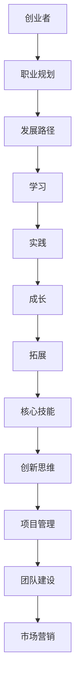

                 

# 创业者的职业规划与发展

> 关键词：职业规划、创业者、发展路径、技能提升、团队建设

> 摘要：本文将探讨创业者如何进行有效的职业规划与发展，从核心技能提升、团队建设、项目管理和市场拓展等方面进行深入分析，为创业者提供实用指南和策略。

## 1. 背景介绍

在当今快速变化的时代，创业已经成为许多人追求梦想和实现财务自由的重要途径。然而，成功的创业者并非偶然，而是通过科学的职业规划和发展路径，逐步积累经验、提升自身能力，并构建起一个高效运作的团队。本文旨在为创业者提供一份详细的职业规划指南，帮助他们更好地规划职业生涯，实现长远发展。

## 2. 核心概念与联系

在探讨创业者的职业规划与发展之前，我们首先需要明确几个核心概念：

### 2.1 创业者

创业者是指那些拥有创业想法并付诸实施的人，他们通常具备创新精神、敏锐的商业洞察力和坚韧的意志力。创业者不仅需要具备创业精神，还要具备良好的职业规划能力，以适应不断变化的市场环境。

### 2.2 职业规划

职业规划是指个人根据自身兴趣、能力和市场需求，制定长远的发展目标，并采取一系列措施实现目标的过程。对于创业者来说，职业规划不仅关乎个人的成长，还关系到企业的发展和成功。

### 2.3 发展路径

发展路径是指创业者为实现职业规划所采取的具体行动和步骤。发展路径可以分为学习、实践、成长和拓展等多个阶段，每个阶段都有其独特的挑战和机遇。

### 2.4 核心技能

核心技能是指创业者必须具备的基本能力和素质，如创新思维、项目管理、团队建设和市场营销等。核心技能的提升将有助于创业者更好地应对市场变化，提高企业竞争力。

以下是一个简化的 Mermaid 流程图，展示创业者的核心概念与联系：



## 3. 核心算法原理 & 具体操作步骤

### 3.1 创业者职业规划算法

创业者的职业规划可以看作是一个动态优化问题，其核心算法原理如下：

#### 3.1.1 目标函数

目标函数是指创业者在职业规划过程中追求的最大化目标，如财富、声誉、个人成长等。不同创业者可能有不同的目标函数，但通常追求的是多个目标之间的平衡。

#### 3.1.2 约束条件

约束条件是指创业者在职业规划过程中必须遵守的限制条件，如时间、资源、市场需求等。约束条件将影响目标函数的取值范围。

#### 3.1.3 算法步骤

1. 确定目标函数和约束条件。
2. 收集相关数据，如市场需求、竞争情况、自身能力等。
3. 运用优化算法（如线性规划、动态规划等）求解最优解。
4. 根据最优解制定职业规划方案。
5. 实施职业规划方案，并不断调整和优化。

### 3.2 核心技能提升算法

核心技能提升算法是指创业者如何有针对性地提升自身能力和素质的方法。以下是一个简化的算法步骤：

1. 识别自身优势和劣势。
2. 确定需要提升的核心技能。
3. 选择合适的培训课程或项目实践。
4. 制定学习计划，并严格执行。
5. 定期评估学习效果，并调整学习策略。

## 4. 数学模型和公式 & 详细讲解 & 举例说明

### 4.1 职业规划目标函数

假设创业者的职业规划目标函数为最大化收益，其中收益由财富、声誉和个人成长三个维度构成。我们可以将目标函数表示为：

$$
\max Z = w_1 \cdot F_1 + w_2 \cdot F_2 + w_3 \cdot F_3
$$

其中，$w_1$、$w_2$、$w_3$ 分别为财富、声誉和个人成长的重要性权重，$F_1$、$F_2$、$F_3$ 分别为财富、声誉和个人成长的得分。

### 4.2 约束条件

约束条件可以表示为：

$$
\begin{cases}
F_1 \leq C_1 \\
F_2 \leq C_2 \\
F_3 \leq C_3 \\
F_1 + F_2 + F_3 = T \\
\end{cases}
$$

其中，$C_1$、$C_2$、$C_3$ 分别为财富、声誉和个人成长的最大值，$T$ 为总时间。

### 4.3 举例说明

假设一个创业者希望在 3 年内实现职业规划目标，其中财富的重要性权重为 0.5，声誉的重要性权重为 0.3，个人成长的重要性权重为 0.2。财富的最大值为 100 万元，声誉的最大值为 100 分，个人成长的最大值为 100 分。根据上述目标函数和约束条件，我们可以构建如下线性规划模型：

$$
\begin{cases}
\max Z = 0.5 \cdot F_1 + 0.3 \cdot F_2 + 0.2 \cdot F_3 \\
F_1 \leq 100 \\
F_2 \leq 100 \\
F_3 \leq 100 \\
F_1 + F_2 + F_3 = 3 \\
\end{cases}
$$

通过求解该线性规划模型，我们可以得到最优解，从而制定出合适的职业规划方案。

## 5. 项目实战：代码实际案例和详细解释说明

### 5.1 开发环境搭建

在本节中，我们将使用 Python 编写一个简单的职业规划脚本，用于计算创业者的最优职业规划方案。首先，我们需要安装 Python 环境，并安装以下依赖库：

```bash
pip install numpy scipy
```

### 5.2 源代码详细实现和代码解读

以下是一个简单的职业规划脚本，用于计算创业者的最优职业规划方案：

```python
import numpy as np
from scipy.optimize import linprog

# 目标函数权重
weights = [0.5, 0.3, 0.2]

# 约束条件
constraints = [
    (1, 0, 0, 100),  # 财富约束
    (0, 1, 0, 100),  # 声誉约束
    (0, 0, 1, 100)   # 个人成长约束
]

# 总时间约束
time_constraint = [1, 1, 1, 3]

# 求解最优解
result = linprog(c=weights, A_eq=constraints, b_eq=time_constraint)

# 输出最优解
if result.success:
    print(f"最优解：财富得分 = {result.x[0]:.2f}, 声誉得分 = {result.x[1]:.2f}, 个人成长得分 = {result.x[2]:.2f}")
else:
    print("无法求解最优解")
```

代码解读：

1. 导入所需库，包括 NumPy 和 SciPy。
2. 定义目标函数权重，分别为财富、声誉和个人成长。
3. 定义约束条件，包括财富、声誉和个人成长的约束。
4. 定义总时间约束。
5. 使用 linprog 函数求解最优解。
6. 输出最优解。

### 5.3 代码解读与分析

在本节中，我们分析了如何使用 Python 编写一个简单的职业规划脚本，并对其代码进行了详细解读。代码主要分为以下几个部分：

1. 导入所需库：导入 NumPy 和 SciPy 库，用于求解线性规划问题。
2. 定义目标函数权重：根据创业者的需求，定义财富、声誉和个人成长的重要性权重。
3. 定义约束条件：根据约束条件，定义财富、声誉和个人成长的约束。
4. 定义总时间约束：根据总时间约束，定义总时间限制。
5. 求解最优解：使用 linprog 函数求解最优解，并判断求解结果是否成功。
6. 输出最优解：根据求解结果，输出最优的职业规划方案。

通过本节项目实战，创业者可以了解如何使用 Python 编写一个简单的职业规划脚本，并根据自身需求进行调整和优化。

## 6. 实际应用场景

### 6.1 创业者个人成长

创业者在进行职业规划时，首先要关注个人成长。通过不断提升自身能力，创业者可以更好地应对市场变化和业务挑战。个人成长包括学习新技能、参加培训和拓展人际关系等。

### 6.2 团队建设

团队建设是创业者职业规划的重要一环。一个高效运作的团队可以大大提高企业竞争力。创业者需要关注团队成员的选拔、培养和激励，以及团队协作和沟通。

### 6.3 项目管理

项目管理是创业者必备的核心技能。创业者需要掌握项目计划、进度跟踪、风险管理等知识，确保项目顺利进行。同时，创业者还需要关注项目成本控制和质量保证。

### 6.4 市场拓展

市场拓展是创业者实现职业规划的重要目标。创业者需要关注市场趋势、客户需求和竞争对手，制定合适的营销策略和市场进入策略。

## 7. 工具和资源推荐

### 7.1 学习资源推荐

1. 《创业维艰》（作者：本·霍洛维茨）：一本关于创业实战经验的经典著作，对创业者具有很高的参考价值。
2. 《精益创业》（作者：埃里克·莱斯）：介绍如何通过最小可行产品（MVP）验证商业想法，并逐步迭代优化，对创业者具有指导意义。

### 7.2 开发工具框架推荐

1. GitHub：一个优秀的代码托管和协作平台，适合创业者进行项目管理和协作开发。
2. Trello：一个简单易用的项目管理工具，适合创业者进行项目跟踪和任务分配。

### 7.3 相关论文著作推荐

1. 《创业者的心智模式》（作者：陈春花）：探讨创业者如何培养良好的心智模式，提高创业成功率。
2. 《创业之路》（作者：史蒂夫·乔布斯）：乔布斯自传，讲述了苹果公司创始人史蒂夫·乔布斯的创业历程和心得。

## 8. 总结：未来发展趋势与挑战

### 8.1 发展趋势

1. 数字化转型：随着大数据、云计算、人工智能等技术的发展，创业者需要掌握相关技术，以应对数字化转型带来的挑战。
2. 绿色发展：环保和可持续发展成为全球关注焦点，创业者需要关注绿色产业发展，推动企业可持续发展。
3. 社交媒体影响力：社交媒体平台的崛起，为创业者提供了更多的市场机会和品牌传播渠道。

### 8.2 挑战

1. 竞争加剧：市场竞争日益激烈，创业者需要不断提高自身竞争力，才能在市场中立足。
2. 法律法规风险：创业者需要关注相关法律法规，确保企业合规运营。
3. 技术更新迭代：技术更新迭代速度快，创业者需要不断学习新知识，以适应技术变革。

## 9. 附录：常见问题与解答

### 9.1 如何制定个人成长计划？

1. 确定个人目标：明确自己的职业规划目标，如提升技能、拓展业务等。
2. 分析自身优势和劣势：了解自己的兴趣、特长和不足，制定有针对性的成长计划。
3. 制定学习计划：选择合适的培训课程、项目实践等，确保计划执行。
4. 定期评估和调整：定期评估学习效果，并根据实际情况调整学习计划。

### 9.2 如何进行团队建设？

1. 确定团队目标：明确团队的发展目标，确保团队成员共同奋斗。
2. 选拔合适的人才：根据团队需求和成员特点，选拔合适的人才。
3. 培养团队成员：关注团队成员的成长，提供培训和指导。
4. 激励团队成员：关注团队成员的成就和贡献，给予适当的激励。

## 10. 扩展阅读 & 参考资料

1. 《创业者的职业规划：从零到一》（作者：李笑来）：一本关于创业者职业规划的实用指南。
2. 《如何高效学习》（作者：斯科特·扬）：探讨如何通过科学的学习方法提高学习效果。
3. 《团队协作的艺术》（作者：劳伦斯·彼得）：介绍团队协作的技巧和策略。

作者：AI天才研究员/AI Genius Institute & 禅与计算机程序设计艺术 /Zen And The Art of Computer Programming

