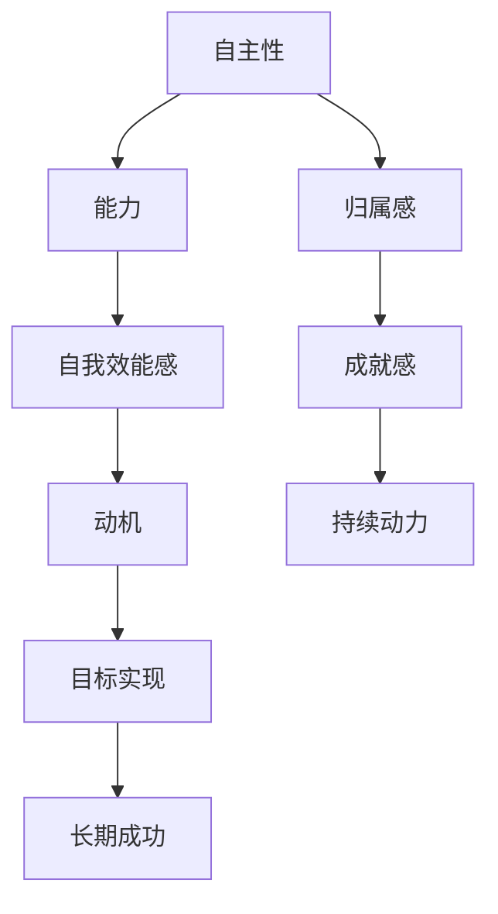
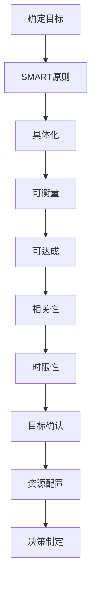
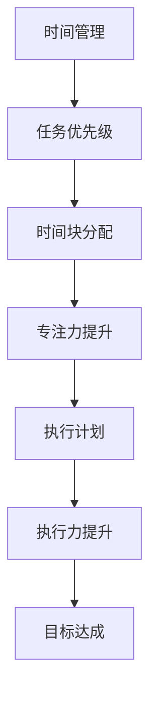
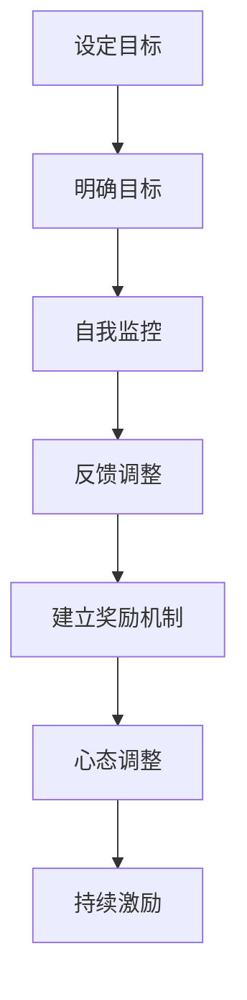
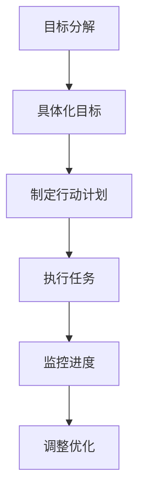
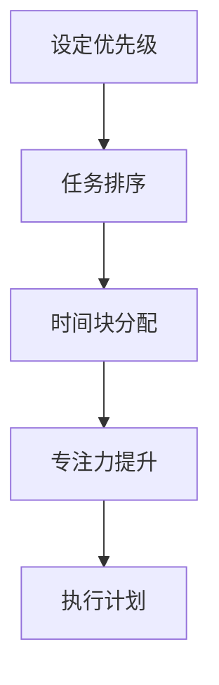

                 

# 创业者的自我激励与目标实现策略

## 关键词
创业、自我激励、目标实现、策略、方法论

## 摘要
本文将深入探讨创业者的自我激励与目标实现策略。通过对心理学、行为科学和成功创业案例的分析，文章提出了一个系统化的方法，帮助创业者克服内在和外部的挑战，保持激情和动力，实现长远目标。我们将探讨自我激励的原理、创业目标的设定与调整、时间管理和执行力提升等关键领域，并结合具体案例和工具，为创业者提供实用的指导。

## 1. 背景介绍

创业，是一场没有退路的探险，它不仅需要敏锐的市场洞察力和创新思维，更需要强大的自我激励和坚定的执行力。在竞争激烈的市场中，创业者常常面临着诸多挑战：资金压力、市场波动、技术难题，甚至心理上的自我怀疑和焦虑。因此，自我激励和目标实现成为决定创业成败的关键因素。

自我激励是指个体在缺乏外部激励的情况下，通过自我驱动力来激发自己的潜能，实现目标的过程。这种内在动力不仅能够帮助创业者克服困难，保持持续的热情和动力，还能提高决策质量和创新思维。目标实现策略则是指通过科学的方法和工具，将长远目标分解为具体可行的行动步骤，并制定合理的计划和监控机制，以确保目标的达成。

本文将围绕自我激励和目标实现的策略展开讨论，旨在为创业者提供一套实用的方法论，帮助他们在创业的道路上持续前进，最终实现自己的梦想。

## 2. 核心概念与联系

### 2.1 自我激励的原理

自我激励的本质是个体内在动机的激发和维持。心理学家德西和瑞恩（Deci & Ryan）提出了自我决定理论，认为自我激励源于三个基本心理需求：自主性、能力和归属感。具体来说：

- **自主性**：个体需要感受到自己的行为是由自己的意志和选择驱动的，而不是被他人强制或外部压力所迫。
- **能力**：个体需要相信自己的能力和技能，能够成功地完成任务，从而获得成就感和自我效能感的提升。
- **归属感**：个体需要与他人建立联系和归属感，感受到自己的行为得到他人的认可和支持。

为了更好地理解自我激励的原理，我们可以通过以下Mermaid流程图展示其核心概念和联系：



### 2.2 创业目标的设定与调整

创业目标是指创业者在创业过程中所要达成的具体目标和期望。一个明确的创业目标能够为创业者提供方向感和动力，有助于资源的最优配置和决策的制定。然而，创业环境的不确定性和复杂性使得目标设定和调整成为一项关键任务。

创业目标的设定需要遵循SMART原则，即具体（Specific）、可衡量（Measurable）、可达成（Achievable）、相关（Relevant）和时限性（Time-bound）。以下是一个符合SMART原则的创业目标示例：

- **具体**：实现某项产品的市场占有率达到10%。
- **可衡量**：通过市场份额调研和销售数据来衡量目标实现情况。
- **可达成**：基于现有资源和市场分析，目标设定在一年内实现。
- **相关**：提高市场份额与公司的整体战略目标一致。
- **时限性**：设定具体的时间节点，如每季度进行一次市场评估。

以下是一个创业目标设定的Mermaid流程图：



### 2.3 时间管理和执行力提升

创业过程中，时间管理和执行力是确保目标实现的关键。时间管理是指通过合理安排时间，提高工作效率，确保重要任务优先完成的过程。执行力是指个体将计划和目标转化为具体行动的能力。

以下是一个结合时间管理和执行力提升的Mermaid流程图：



## 3. 核心算法原理 & 具体操作步骤

### 3.1 自我激励策略

自我激励的策略可以从以下几个方面入手：

1. **设定明确的个人目标**：根据自我决定理论，设定具有挑战性但可实现的目标，能够激发内在动机。
2. **自我监控和反馈**：通过定期自我评估和反馈，了解自己的进步和不足，及时调整策略。
3. **建立奖励机制**：为自己设定奖励，当达到某个里程碑时给予自己奖励，增强持续动力。
4. **培养积极心态**：通过正念练习、感恩日记等方式，培养积极心态，提高应对困难的能力。

以下是一个具体的自我激励操作步骤：



### 3.2 目标实现策略

目标实现的策略可以分为以下步骤：

1. **目标分解**：将长远目标分解为具体的短期目标，确保每个目标都是具体、可衡量的。
2. **制定行动计划**：为每个目标制定详细的行动计划，包括任务分解、资源调配和时间规划。
3. **执行与监控**：按照行动计划执行任务，并定期监控进度，确保目标按时完成。
4. **调整与优化**：根据实际情况调整目标和行动计划，确保目标的实现。

以下是一个目标实现的具体操作步骤：



### 3.3 时间管理和执行力提升策略

时间管理和执行力提升的策略包括以下几个方面：

1. **设定优先级**：根据任务的重要性和紧急性，设定任务优先级，确保重要任务优先完成。
2. **时间块分配**：将工作时间划分为若干时间块，每个时间块专注于一项任务，提高专注力和工作效率。
3. **培养专注力**：通过冥想、专注力训练等方式，提高自己的专注力和抗干扰能力。
4. **执行计划**：按照执行计划，严格执行任务，避免拖延和干扰。

以下是一个时间管理和执行力提升的具体操作步骤：



## 4. 数学模型和公式 & 详细讲解 & 举例说明

### 4.1 自我激励的数学模型

自我激励的数学模型可以从以下几个公式入手：

1. **动机-能力模型**：

   动机（M）= 自主性（A）× 能力（C）

   这个模型表明，自我激励的程度取决于自主性和能力的乘积。自主性越高，能力越强，自我激励水平越高。

2. **成就感-归属感模型**：

   成就感（E）= 成就目标（T）× 归属感（B）

   这个模型表明，成就感取决于成功完成目标的能力和与他人的联系。成功完成目标的能力越强，归属感越强，成就感越高。

### 4.2 目标实现的数学模型

目标实现的数学模型可以从以下几个公式入手：

1. **目标实现率**：

   目标实现率（R）= 完成任务数（C）÷ 计划任务数（P）

   这个模型表明，目标实现率取决于实际完成的任务数与计划任务数的比值。

2. **时间效率**：

   时间效率（E）= 完成任务时间（T）÷ 计划时间（P）

   这个模型表明，时间效率取决于实际完成任务所需的时间与计划时间的比值。

### 4.3 举例说明

#### 自我激励的举例说明

假设一个创业者李明设定了一个目标：在三个月内完成一款新产品开发。他的自主性很高，能够自主决定开发方向和任务分配。他在开发过程中不断学习新技术，提高了自己的能力。同时，他的团队成员对他的工作非常支持，给予了他很强的归属感。根据动机-能力模型，李明的自我激励水平很高。他在完成目标的过程中，设定了每周的里程碑，并在每个里程碑完成后给予自己小奖励，如休息一天或购买一些新工具。他的成就感也很高，因为他的工作得到了团队成员和客户的认可。

#### 目标实现的举例说明

假设一个创业者张华在一个月内完成了五个市场调研任务，计划任务是十个。根据目标实现率模型，他的目标实现率是50%。但是，他在实际工作中发现，有些调研任务因为时间安排不合理而拖延，导致整体进度不理想。根据时间效率模型，他的时间效率是2/3。因此，张华需要调整自己的时间管理和任务优先级，以确保未来能够更高效地完成任务。

## 5. 项目实战：代码实际案例和详细解释说明

### 5.1 开发环境搭建

在开始项目实战之前，我们需要搭建一个适合开发的环境。以下是一个简单的开发环境搭建步骤：

1. **安装Python环境**：下载并安装Python，版本建议为3.8及以上。
2. **安装必要库**：使用pip安装一些常用库，如requests、numpy、matplotlib等。
3. **配置IDE**：选择一个适合自己的IDE，如PyCharm或Visual Studio Code，并进行基本配置。

### 5.2 源代码详细实现和代码解读

以下是一个简单的自我激励和目标实现策略的Python代码实现：

```python
import numpy as np
import matplotlib.pyplot as plt

# 动机-能力模型
def motivation(autonomy, competence):
    return autonomy * competence

# 成就感-归属感模型
def achievement(talked_about, belongingness):
    return talked_about * belongingness

# 目标实现率
def achievement_rate(completed_tasks, planned_tasks):
    return completed_tasks / planned_tasks

# 时间效率
def time_efficiency(completed_time, planned_time):
    return completed_time / planned_time

# 自我激励和目标实现示例
autonomy = 0.8
competence = 0.9
talked_about = 0.7
belongingness = 0.8
completed_tasks = 5
planned_tasks = 10
completed_time = 15
planned_time = 30

motivation_score = motivation(autonomy, competence)
achievement_score = achievement(talked_about, belongingness)
achievement_rate_score = achievement_rate(completed_tasks, planned_tasks)
time_efficiency_score = time_efficiency(completed_time, planned_time)

print("自我激励得分：", motivation_score)
print("成就感得分：", achievement_score)
print("目标实现率：", achievement_rate_score)
print("时间效率：", time_efficiency_score)

# 可视化展示
labels = ['自我激励', '成就感', '目标实现率', '时间效率']
sizes = [motivation_score, achievement_score, achievement_rate_score, time_efficiency_score]
colors = ['orange', 'yellowgreen', 'lightskyblue', 'red']
patches, texts = plt.pie(sizes, colors=colors, startangle=90)
plt.axis('equal')
plt.legend(patches, labels, loc="best")
plt.title("自我激励与目标实现指标")
plt.show()
```

这段代码首先定义了四个函数，用于计算自我激励、成就感、目标实现率和时间效率。接着，我们通过设定一些变量，模拟了一个自我激励和目标实现的场景，并打印出相关得分。最后，我们使用matplotlib库将得分可视化，帮助创业者更直观地了解自己的状态。

### 5.3 代码解读与分析

1. **动机-能力模型**：

   `motivation`函数接受两个参数：自主性和能力，返回它们的乘积。这个函数反映了自我激励的程度，自主性和能力的值越高，自我激励水平越高。

2. **成就感-归属感模型**：

   `achievement`函数接受两个参数：成就目标和归属感，返回它们的乘积。这个函数反映了成就感，成就目标和归属感的值越高，成就感越高。

3. **目标实现率**：

   `achievement_rate`函数接受两个参数：完成的任务数和计划的任务数，返回它们的比值。这个函数反映了目标实现的情况，完成的任务数越多，计划的任务数越少，目标实现率越高。

4. **时间效率**：

   `time_efficiency`函数接受两个参数：完成任务所需时间和计划时间，返回它们的比值。这个函数反映了时间利用的情况，完成任务所需时间越短，计划时间越长，时间效率越高。

通过这段代码，创业者可以了解自己在自我激励和目标实现方面的得分，并通过可视化展示，直观地了解自己的状态。这对于制定下一步行动计划和调整策略非常有帮助。

## 6. 实际应用场景

自我激励和目标实现策略在创业中的应用场景广泛，以下是一些典型的应用场景：

1. **新产品开发**：在开发新产品时，创业者需要设定明确的目标，如功能点、时间节点和资源需求。通过自我激励策略，保持团队成员的积极性和创造力，提高开发效率。

2. **市场推广**：在市场推广过程中，创业者需要设定销售目标、宣传策略和时间表。通过目标实现策略，确保各项推广活动按时完成，提高市场占有率。

3. **团队管理**：在团队管理中，创业者需要设定团队成员的目标和期望，通过自我激励策略，激发团队成员的潜力，提高团队整体执行力。

4. **融资和投资**：在融资和投资过程中，创业者需要设定融资目标和投资策略。通过目标实现策略，确保融资计划的顺利实施，提高融资成功率。

5. **持续改进**：在产品运营过程中，创业者需要持续改进产品和服务，设定改进目标和时间节点。通过自我激励策略，保持团队成员的持续动力，提高产品竞争力。

## 7. 工具和资源推荐

### 7.1 学习资源推荐

1. **书籍**：

   - 《创业维艰》（"Hard Things About Hard Things"）by Ben Horowitz
   - 《精益创业》（"The Lean Startup"）by Eric Ries

2. **论文**：

   - "The Science of Self-Discipline" by Roy F. Baumeister, Mark R. Leary, and Cody J. Wilson
   - "Goal Setting: A Motivational Theory of Goal-Directed Behavior" by Edwin A. Locke and Gary P. Latham

3. **博客**：

   - Paul Graham的博客（https://www.paulgraham.com/）
   - Jason Fried的博客（https://signalvsnoise.com/）

4. **网站**：

   - Coursera（https://www.coursera.org/）
   - edX（https://www.edx.org/）

### 7.2 开发工具框架推荐

1. **开发环境**：

   - PyCharm（https://www.jetbrains.com/pycharm/）
   - Visual Studio Code（https://code.visualstudio.com/）

2. **项目管理工具**：

   - Trello（https://trello.com/）
   - Asana（https://www.asana.com/）

3. **时间管理工具**：

   - RescueTime（https://www.rescuetime.com/）
   - Todoist（https://todoist.com/）

### 7.3 相关论文著作推荐

1. **《创业心理学》**（"Entrepreneurship and Psychology"）by Tugrul Uygun and Lars K. Söderbom
2. **《目标管理》**（"Goal Management"）by Gary P. Latham and Edward E. Locke
3. **《自我决定论》**（"Self-Determination Theory"）by Edward L. Deci and Richard M. Ryan

## 8. 总结：未来发展趋势与挑战

随着创业环境的不断变化，自我激励和目标实现策略在未来将面临新的挑战和机遇。以下是一些未来发展趋势和挑战：

1. **数字化与智能化**：随着人工智能和大数据技术的发展，创业者和团队将更加依赖数字工具和智能算法来优化自我激励和目标实现策略。
2. **个性化与适应性**：未来的自我激励和目标实现策略将更加注重个性化定制，根据个体差异和实时反馈进行调整，提高策略的适应性和效果。
3. **全球竞争与多元化**：全球化和多元化将使创业环境更加复杂，创业者需要面对不同文化和市场的挑战，需要更加灵活和创新的策略来保持竞争力。
4. **心理健康与工作生活平衡**：随着工作压力的增加，心理健康和工作生活平衡将成为创业者关注的重点，自我激励策略需要更加注重心理健康和幸福感。

## 9. 附录：常见问题与解答

### 9.1 自我激励的常见问题

1. **问题**：如何保持持续的自我激励？

   **解答**：可以通过设定小目标、定期自我评估、与他人交流和分享进展等方式来保持自我激励。

2. **问题**：自我激励与外部激励有什么区别？

   **解答**：自我激励源于个体内在动机，而外部激励则来自外部奖励和压力。两者相辅相成，但自我激励更能持久和深远地影响个体的行为。

### 9.2 目标实现的常见问题

1. **问题**：如何设定合理的目标？

   **解答**：遵循SMART原则，确保目标具体、可衡量、可达成、相关且有时限性。

2. **问题**：目标实现过程中如何应对挫折？

   **解答**：通过积极心态、自我激励和寻求支持，可以有效应对挫折和困难，保持目标的实现。

### 9.3 时间管理和执行力的常见问题

1. **问题**：如何提高时间管理效率？

   **解答**：通过设定优先级、时间块分配、避免干扰等方式，可以提高时间管理效率。

2. **问题**：如何提高执行力？

   **解答**：通过制定明确的行动计划、设定具体的执行步骤、避免拖延和及时反馈等方式，可以提高执行力。

## 10. 扩展阅读 & 参考资料

1. **《创业者的自我管理艺术》**：详细探讨创业者自我管理的方法和技巧。
2. **《目标管理实战指南》**：提供目标管理的实用方法和工具。
3. **《时间管理的艺术》**：介绍时间管理的基本原理和策略。
4. **《自我激励与目标实现》**：深入探讨自我激励的心理学原理和实践方法。
5. **《创业心理学》**：分析创业过程中心理学因素的作用。

### 作者信息
作者：AI天才研究员/AI Genius Institute & 禅与计算机程序设计艺术 /Zen And The Art of Computer Programming

