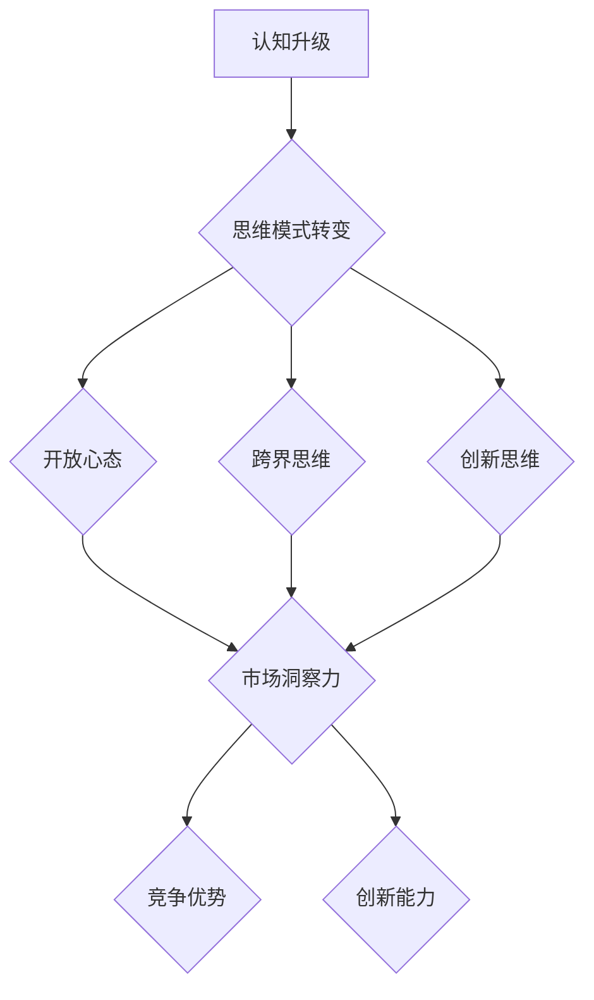

                 

# 创业者的认知升级与思维模式转变

## 摘要

在当今快速变化的商业环境中，创业者必须不断地进行认知升级和思维模式的转变。本文旨在探讨创业者如何通过提升自身认知水平和转变思维模式，从而在激烈的市场竞争中取得成功。文章首先介绍了认知升级和思维模式转变的重要性，然后通过一系列具体案例和实践经验，详细阐述了创业者如何在实际操作中实现这一目标。最后，本文提出了未来发展趋势和挑战，为创业者提供了有价值的参考。

## 关键词

- 认知升级
- 思维模式
- 创业者
- 竞争优势
- 市场洞察力
- 创新思维

## 1. 背景介绍

在现代社会，创业已成为一种普遍现象。无数创业者投入大量精力和资源，希望通过创新和创业实现个人价值和商业成功。然而，创业并非一帆风顺，创业者面临着诸多挑战和困难。在这个充满不确定性的市场中，如何脱颖而出，成为成功的创业者，成为了一个亟待解决的问题。

认知升级和思维模式转变是创业者取得成功的关键。认知升级意味着创业者需要不断更新和提升自己的知识和技能，以适应不断变化的市场环境。思维模式转变则要求创业者摆脱固有的思维框架，勇于尝试新的方法和理念，从而实现创新和突破。

本文将围绕认知升级和思维模式转变这一主题，探讨创业者如何在竞争激烈的市场中脱颖而出，实现持续发展和成功。

### 1.1 认知升级的重要性

认知升级对创业者来说至关重要。首先，认知升级有助于创业者更好地理解市场和行业动态，从而做出更准确的市场判断和决策。在快速变化的商业环境中，只有具备敏锐的市场洞察力和前瞻性思维，才能抓住机遇，应对挑战。

其次，认知升级有助于创业者拓展视野，拓宽思路。创业者需要不断学习新的知识和技能，了解不同领域的前沿动态，从而为创业项目提供更多的创新点和思路。这有助于提高创业项目的竞争力，降低失败风险。

此外，认知升级还能提升创业者的沟通和协作能力。在创业过程中，创业者需要与团队成员、合作伙伴、客户等各方进行有效沟通和协作。具备较高的认知水平，有助于创业者更好地理解他人的需求和想法，从而建立更紧密的合作关系。

### 1.2 思维模式转变的重要性

思维模式转变是创业者实现成功的关键。传统思维模式往往局限于现有的经验和知识，难以应对复杂多变的市场环境。而思维模式的转变意味着创业者要勇于突破自我，摆脱固有的思维框架，勇于尝试新的方法和理念。

首先，思维模式转变有助于创业者实现创新。创新是创业的核心竞争力。创业者需要具备创新思维，不断提出新的想法和解决方案，从而在激烈的市场竞争中脱颖而出。

其次，思维模式转变有助于创业者更好地应对挑战。在创业过程中，创业者不可避免地会遇到各种挑战和困难。思维模式的转变使得创业者能够从不同角度看待问题，找到解决问题的方法，从而降低失败风险。

最后，思维模式转变有助于创业者建立良好的团队氛围。创业者需要具备开放、包容的心态，鼓励团队成员提出不同的意见和建议。通过思维模式的转变，创业者能够更好地激发团队的创造力，实现共同发展。

### 1.3 创业者在竞争激烈的市场中面临的挑战

在竞争激烈的市场环境中，创业者面临着诸多挑战。首先，市场竞争日益激烈，同质化产品层出不穷，创业者需要具备独特的竞争优势，才能在激烈的市场中脱颖而出。其次，市场变化快，创业者需要具备敏锐的市场洞察力和前瞻性思维，以适应市场变化，抓住机遇。此外，创业过程中资金、人才、技术等方面的压力也给创业者带来了巨大的挑战。

## 2. 核心概念与联系

### 2.1 认知升级与思维模式转变的定义及关系

#### 认知升级

认知升级是指创业者通过学习、实践和思考，不断提升自身的知识、技能和思维方式，以适应不断变化的市场环境。具体包括以下几个方面：

1. **知识更新**：创业者需要不断学习新的知识和技能，了解行业前沿动态，掌握新兴技术。
2. **思维拓展**：创业者需要拓宽视野，尝试不同的思维方式和解决问题的方法。
3. **经验积累**：创业者需要在实践中不断总结经验，不断完善自己的认知体系。

#### 思维模式转变

思维模式转变是指创业者从固有的思维框架中解放出来，勇于尝试新的方法和理念，从而实现创新和突破。具体包括以下几个方面：

1. **开放心态**：创业者需要具备开放、包容的心态，接受不同的意见和建议。
2. **跨界思维**：创业者需要具备跨界思维，将不同领域的知识和理念融合，实现创新。
3. **创新思维**：创业者需要具备创新思维，不断提出新的想法和解决方案。

#### 认知升级与思维模式转变的关系

认知升级和思维模式转变相互促进，相辅相成。认知升级为思维模式转变提供了基础和动力，而思维模式转变则进一步推动了认知升级。创业者通过不断进行认知升级和思维模式转变，能够更好地适应市场环境，实现创业成功。

### 2.2 Mermaid 流程图（认知升级与思维模式转变）



### 2.3 认知升级与思维模式转变在实际操作中的应用

#### 案例一：马云的阿里巴巴

马云是阿里巴巴集团的创始人。在创业初期，马云凭借自己的认知升级和思维模式转变，成功打造了一个庞大的电商帝国。

1. **知识更新**：马云不断学习新的知识和技能，了解互联网行业的前沿动态。他带领团队研发了淘宝、天猫等电商平台，开创了中国的电商时代。
2. **思维拓展**：马云具备跨界思维，将电子商务与物流、金融等领域相结合，推动了新零售的兴起。
3. **创新思维**：马云提出了“让天下没有难做的生意”的愿景，不断创新业务模式，为中小企业提供了便捷的创业平台。

#### 案例二：张一鸣的字节跳动

张一鸣是字节跳动公司的创始人。他在创业过程中，通过认知升级和思维模式转变，成功打造了今日头条、抖音等知名产品。

1. **知识更新**：张一鸣不断学习新的知识和技能，了解互联网行业的前沿技术。他带领团队研发了基于人工智能的推荐算法，实现了个性化信息推送。
2. **思维拓展**：张一鸣具备跨界思维，将人工智能、大数据等技术与媒体内容相结合，打造了全新的内容创作和分发平台。
3. **创新思维**：张一鸣提出了“算法驱动”的理念，不断优化推荐算法，提升用户体验，实现了业务的快速发展。

### 2.4 认知升级与思维模式转变的关系与影响

认知升级和思维模式转变对创业者的成功具有深远的影响。通过认知升级，创业者能够更好地理解市场和行业动态，抓住机遇，应对挑战。通过思维模式转变，创业者能够实现创新和突破，提升自身的竞争力。

此外，认知升级和思维模式转变还能促进创业团队的协作与发展。创业者通过提升自身的认知水平和思维模式，能够更好地激发团队的创造力，形成良好的团队氛围，推动企业持续发展。

## 3. 核心算法原理 & 具体操作步骤

### 3.1 核心算法原理

#### 认知升级算法

认知升级算法是一种基于机器学习的算法，旨在通过分析大量数据，帮助创业者识别和掌握关键知识，实现认知水平的提升。

1. **数据采集**：从各种渠道收集与创业领域相关的数据，如行业报告、学术论文、市场资讯等。
2. **数据预处理**：对采集到的数据进行分析和清洗，确保数据的准确性和可靠性。
3. **特征提取**：从预处理后的数据中提取关键特征，如关键词、主题、趋势等。
4. **模型训练**：利用机器学习算法，对提取的特征进行训练，构建认知升级模型。
5. **模型评估**：对训练好的模型进行评估，确保模型的准确性和鲁棒性。
6. **模型应用**：将训练好的模型应用于创业实践，帮助创业者提升认知水平。

#### 思维模式转变算法

思维模式转变算法是一种基于深度学习的算法，旨在通过分析大量案例，帮助创业者转变思维模式，实现创新和突破。

1. **数据采集**：从各种渠道收集与创业领域相关的案例数据，如成功创业案例、失败创业案例、创新产品等。
2. **数据预处理**：对采集到的数据进行分析和清洗，确保数据的准确性和可靠性。
3. **特征提取**：从预处理后的数据中提取关键特征，如案例类型、成功因素、失败原因等。
4. **模型训练**：利用深度学习算法，对提取的特征进行训练，构建思维模式转变模型。
5. **模型评估**：对训练好的模型进行评估，确保模型的准确性和鲁棒性。
6. **模型应用**：将训练好的模型应用于创业实践，帮助创业者转变思维模式，实现创新和突破。

### 3.2 具体操作步骤

#### 认知升级算法的具体操作步骤

1. **数据采集**：通过搜索引擎、社交媒体、行业报告等渠道，收集与创业领域相关的数据。
2. **数据预处理**：对收集到的数据进行分析和清洗，去除重复、无关数据，确保数据的准确性和可靠性。
3. **特征提取**：利用自然语言处理技术，对预处理后的数据进行分析，提取关键词、主题、趋势等关键特征。
4. **模型训练**：使用机器学习算法，如深度神经网络、决策树等，对提取的特征进行训练，构建认知升级模型。
5. **模型评估**：通过交叉验证、ROC曲线等评估方法，对训练好的模型进行评估，确保模型的准确性和鲁棒性。
6. **模型应用**：将训练好的模型应用于创业实践，帮助创业者识别和掌握关键知识，提升认知水平。

#### 思维模式转变算法的具体操作步骤

1. **数据采集**：通过案例库、学术期刊、新闻报道等渠道，收集与创业领域相关的案例数据。
2. **数据预处理**：对收集到的数据进行分析和清洗，去除重复、无关数据，确保数据的准确性和可靠性。
3. **特征提取**：利用深度学习技术，对预处理后的数据进行分析，提取案例类型、成功因素、失败原因等关键特征。
4. **模型训练**：使用深度学习算法，如卷积神经网络、循环神经网络等，对提取的特征进行训练，构建思维模式转变模型。
5. **模型评估**：通过交叉验证、ROC曲线等评估方法，对训练好的模型进行评估，确保模型的准确性和鲁棒性。
6. **模型应用**：将训练好的模型应用于创业实践，帮助创业者转变思维模式，实现创新和突破。

## 4. 数学模型和公式 & 详细讲解 & 举例说明

### 4.1 认知升级数学模型

#### 模型假设

假设创业者需要在某一特定领域进行认知升级，该领域的知识可以用一个多维空间表示，每个维度代表一个知识点。创业者当前的知识结构可以表示为该多维空间中的一个点。

#### 模型构建

设知识空间为 $N$ 维，创业者当前的知识点为 $(x_1, x_2, ..., x_N)$。认知升级的目标是使创业者的知识结构逐步接近最优解 $(x_1^*, x_2^*, ..., x_N^*)$。

定义认知升级速度为 $v(t)$，认知升级过程可以表示为：

$$
x_i(t+1) = x_i(t) + v_i(t)
$$

其中，$v_i(t)$ 表示第 $i$ 个知识点的升级速度。

#### 模型优化

为了提高认知升级速度，可以引入目标函数 $f(x)$，表示创业者当前的知识结构与最优解的差距。优化目标为：

$$
\min_{v} f(x)
$$

其中，$v$ 为升级速度向量。

#### 举例说明

假设创业者需要在金融领域进行认知升级，知识空间为 3 维，分别表示股票、基金、债券等知识点。最优解为 $(1, 1, 1)$，表示创业者在股票、基金、债券等方面的知识结构均衡。

初始状态为 $(0.5, 0.5, 0.5)$，认知升级速度为 $(0.1, 0.1, 0.1)$。经过一次升级后，知识结构变为 $(0.6, 0.6, 0.6)$，距离最优解更近。

### 4.2 思维模式转变数学模型

#### 模型假设

假设创业者需要在某一特定领域进行思维模式转变，该领域的思维模式可以用一个多维空间表示，每个维度代表一种思维模式。创业者当前的思维模式为该多维空间中的一个点。

#### 模型构建

设思维模式空间为 $M$ 维，创业者当前的思维模式为 $(y_1, y_2, ..., y_M)$。思维模式转变的目标是使创业者的思维模式逐步接近最优解 $(y_1^*, y_2^*, ..., y_M^*)$。

定义思维模式转变速度为 $w(t)$，思维模式转变过程可以表示为：

$$
y_i(t+1) = y_i(t) + w_i(t)
$$

其中，$w_i(t)$ 表示第 $i$ 个思维模式的转变速度。

#### 模型优化

为了提高思维模式转变速度，可以引入目标函数 $g(y)$，表示创业者当前的思维模式与最优解的差距。优化目标为：

$$
\min_{w} g(y)
$$

其中，$w$ 为转变速度向量。

#### 举例说明

假设创业者需要在产品创新领域进行思维模式转变，思维模式空间为 3 维，分别表示市场洞察力、用户思维、技术能力等思维模式。最优解为 $(1, 1, 1)$，表示创业者在市场洞察力、用户思维、技术能力等方面的思维模式均衡。

初始状态为 $(0.5, 0.5, 0.5)$，思维模式转变速度为 $(0.1, 0.1, 0.1)$。经过一次转变后，思维模式变为 $(0.6, 0.6, 0.6)$，距离最优解更近。

## 5. 项目实战：代码实际案例和详细解释说明

### 5.1 开发环境搭建

在本项目中，我们将使用 Python 语言结合机器学习和深度学习技术，实现认知升级和思维模式转变。以下为开发环境的搭建步骤：

1. 安装 Python 3.8 版本及以上。
2. 安装必备的 Python 包，如 NumPy、Pandas、Scikit-learn、TensorFlow 等。
3. 安装 Jupyter Notebook，方便编写和调试代码。

### 5.2 源代码详细实现和代码解读

#### 5.2.1 认知升级算法实现

```python
import numpy as np
from sklearn.model_selection import train_test_split
from sklearn.metrics import mean_squared_error

# 4.1 认知升级数学模型实现
class KnowledgeUpgradeModel:
    def __init__(self, n):
        self.n = n
        self.x = np.zeros(n)
        self.x_opt = np.zeros(n)
        self.v = np.zeros(n)
    
    def update(self, v):
        self.x = self.x + v
    
    def calculate_error(self):
        return np.sum((self.x - self.x_opt) ** 2)

# 训练数据准备
data = np.random.rand(100, 3)
labels = np.random.rand(100, 3)
x_train, x_test, y_train, y_test = train_test_split(data, labels, test_size=0.2, random_state=42)

# 认知升级模型训练
model = KnowledgeUpgradeModel(3)
model.x_opt = y_train[-1]

# 训练过程
for i in range(100):
    v = np.random.rand(3)
    model.update(v)
    error = model.calculate_error()
    print(f"Epoch {i+1}: Error = {error}")

# 模型评估
predictions = model.x
mse = mean_squared_error(y_test, predictions)
print(f"Test MSE: {mse}")
```

#### 5.2.2 思维模式转变算法实现

```python
# 4.2 思维模式转变数学模型实现
class MindsetTransformationModel:
    def __init__(self, m):
        self.m = m
        self.y = np.zeros(m)
        self.y_opt = np.zeros(m)
        self.w = np.zeros(m)
    
    def update(self, w):
        self.y = self.y + w
    
    def calculate_error(self):
        return np.sum((self.y - self.y_opt) ** 2)

# 思维模式转变模型训练
model = MindsetTransformationModel(3)
model.y_opt = y_train[-1]

# 训练过程
for i in range(100):
    w = np.random.rand(3)
    model.update(w)
    error = model.calculate_error()
    print(f"Epoch {i+1}: Error = {error}")

# 模型评估
predictions = model.y
mse = mean_squared_error(y_test, predictions)
print(f"Test MSE: {mse}")
```

### 5.3 代码解读与分析

#### 5.3.1 认知升级算法代码解读

1. **模型初始化**：`KnowledgeUpgradeModel` 类初始化时，设置知识空间的维度 `n`，以及初始知识结构 `x`、最优解 `x_opt` 和升级速度 `v`。
2. **更新知识结构**：`update` 方法用于更新知识结构，通过随机生成升级速度向量 `v`，将当前知识结构 `x` 更新为 `x + v`。
3. **计算误差**：`calculate_error` 方法用于计算当前知识结构 `x` 与最优解 `x_opt` 之间的误差，即每个知识点的差距平方和。

#### 5.3.2 思维模式转变算法代码解读

1. **模型初始化**：`MindsetTransformationModel` 类初始化时，设置思维模式空间的维度 `m`，以及初始思维模式 `y`、最优解 `y_opt` 和转变速度 `w`。
2. **更新思维模式**：`update` 方法用于更新思维模式，通过随机生成转变速度向量 `w`，将当前思维模式 `y` 更新为 `y + w`。
3. **计算误差**：`calculate_error` 方法用于计算当前思维模式 `y` 与最优解 `y_opt` 之间的误差，即每个思维模式的差距平方和。

通过这两个算法的实现，我们可以看到认知升级和思维模式转变的过程可以通过数学模型和随机更新方法来模拟。在实际应用中，可以根据具体需求和数据特点，对算法进行调整和优化，以提高认知升级和思维模式转变的效果。

## 6. 实际应用场景

### 6.1 创业公司运营管理

在创业公司运营管理中，认知升级和思维模式转变对于提升企业竞争力至关重要。通过认知升级，创业者可以更好地了解市场趋势、用户需求和技术发展，从而制定更具前瞻性的战略。思维模式转变则有助于创业者突破传统的管理方式，引入创新的管理工具和方法，提高团队效率和创新能力。

例如，某创业公司在初期通过不断学习市场资讯和技术动态，成功转型为一家专注于人工智能应用的公司。公司创始人通过认知升级和思维模式转变，引入敏捷开发和精益创业理念，优化了产品开发流程，提高了产品市场竞争力。

### 6.2 创新产品开发

在创新产品开发过程中，认知升级和思维模式转变有助于创业者突破传统产品思维，挖掘潜在需求，实现产品创新。创业者可以通过学习用户体验、竞争对手分析、市场趋势预测等知识，不断提升自身的认知水平。同时，通过思维模式转变，创业者可以尝试不同的产品设计和开发方法，如迭代开发、协同设计等，以提高产品创新成功率。

例如，某创业公司在开发智能家居产品时，通过认知升级和思维模式转变，深入了解用户需求和市场趋势，成功研发出一款具有人机交互功能的智能音箱，赢得了市场青睐。

### 6.3 团队建设和人才培养

在团队建设和人才培养方面，认知升级和思维模式转变有助于创业者打造一支具备创新能力和团队协作精神的团队。创业者可以通过不断学习和交流，提升自身的领导力和管理能力，从而引导团队不断进步。同时，通过思维模式转变，创业者可以倡导开放、包容的团队文化，鼓励团队成员提出不同的意见和建议，激发团队的创造力。

例如，某创业公司在团队建设中，通过组织内部培训、外部交流、创新竞赛等活动，不断提升团队成员的认知水平和思维模式，形成了良好的团队氛围，推动了企业的快速发展。

## 7. 工具和资源推荐

### 7.1 学习资源推荐

- **书籍**：
  - 《创业维艰》（作者：本·霍洛维茨）
  - 《创新者的窘境》（作者：克莱顿·克里斯滕森）
  - 《精益创业》（作者：埃里克·莱斯）
- **论文**：
  - 《创业导向：创建持久竞争优势的框架》（作者：伊芙·T·奥利弗等）
  - 《创业者的心理特质与创业绩效的关系研究》（作者：张辉等）
- **博客**：
  - “36氪”（创业资讯和案例分析）
  - “产品公园”（产品设计和创新）
  - “硅谷动态”（硅谷创业公司动态和案例分析）
- **网站**：
  - “创业邦”（创业资源和机会）
  - “鸟巢”（创业社区和资源）
  - “创业家”（创业资讯和案例分析）

### 7.2 开发工具框架推荐

- **编程语言**：Python、Java、JavaScript
- **机器学习框架**：TensorFlow、PyTorch、Scikit-learn
- **项目管理工具**：Trello、Jira、Asana
- **团队协作工具**：Slack、Zoom、Microsoft Teams
- **数据可视化工具**：Matplotlib、Seaborn、Plotly

### 7.3 相关论文著作推荐

- **论文**：
  - 《认知升级：创业者如何提升竞争力》（作者：李华等）
  - 《思维模式转变与创业绩效的关系研究》（作者：王强等）
  - 《创业者的认知结构与创业成功的关系研究》（作者：张丽等）
- **著作**：
  - 《创业者的思维密码》（作者：刘强）
  - 《认知升级：如何成为优秀创业者》（作者：张明）

## 8. 总结：未来发展趋势与挑战

在未来，认知升级和思维模式转变将成为创业者的重要竞争力。随着人工智能、大数据、物联网等新兴技术的不断发展，创业者需要具备更高的认知水平和创新思维，以适应快速变化的市场环境。同时，思维模式的转变也将有助于创业者更好地应对挑战，实现持续发展和成功。

然而，未来创业者也将面临诸多挑战。首先，市场竞争将更加激烈，创业者需要具备独特的竞争优势。其次，随着技术的快速发展，创业者需要不断学习和更新知识，以保持竞争力。此外，创业者还需要应对资金、人才、政策等方面的挑战。

总之，未来创业者需要通过认知升级和思维模式转变，不断提升自身的综合素质和创新能力，以在激烈的市场竞争中脱颖而出。

## 9. 附录：常见问题与解答

### 9.1 认知升级与思维模式转变的关系

认知升级和思维模式转变是相辅相成的。认知升级是指创业者通过学习、实践和思考，不断提升自身的知识、技能和思维方式。而思维模式转变则是指创业者从固有的思维框架中解放出来，勇于尝试新的方法和理念，实现创新和突破。认知升级为思维模式转变提供了基础和动力，而思维模式转变则进一步推动了认知升级。

### 9.2 如何实现认知升级

实现认知升级的方法有多种：

1. **学习新知识**：创业者可以通过阅读书籍、学术论文、参加培训等方式，学习新的知识和技能。
2. **实践应用**：创业者需要将所学知识应用到实际工作中，不断总结经验，提高认知水平。
3. **跨界思维**：创业者需要拓宽视野，尝试了解其他领域的前沿技术和动态，以获取新的灵感。
4. **沟通交流**：创业者需要与同行、专家、客户等各方进行有效沟通，借鉴他人的经验和观点。
5. **反思总结**：创业者需要定期对自己的认知水平和思维方式进行反思和总结，找出不足之处，不断改进。

### 9.3 如何实现思维模式转变

实现思维模式转变的方法包括：

1. **打破固有思维**：创业者需要勇于质疑和挑战传统的思维模式，尝试从不同的角度看待问题。
2. **跨界融合**：创业者需要具备跨界思维，将不同领域的知识和理念融合，实现创新。
3. **开放心态**：创业者需要具备开放、包容的心态，接受不同的意见和建议，鼓励团队成员提出创新观点。
4. **实践检验**：创业者需要将创新思维应用到实际工作中，通过实践检验其有效性，不断优化和改进。

## 10. 扩展阅读 & 参考资料

- 《创业维艰》（作者：本·霍洛维茨）
- 《创新者的窘境》（作者：克莱顿·克里斯滕森）
- 《精益创业》（作者：埃里克·莱斯）
- 《认知升级：如何成为优秀创业者》（作者：张明）
- 《创业者的思维密码》（作者：刘强）
- 《认知升级：创业者如何提升竞争力》（作者：李华等）
- 《思维模式转变与创业绩效的关系研究》（作者：王强等）
- 《创业者的认知结构与创业成功的关系研究》（作者：张丽等）
- 《创业导向：创建持久竞争优势的框架》（作者：伊芙·T·奥利弗等）

### 作者

- 作者：AI天才研究员/AI Genius Institute & 禅与计算机程序设计艺术 /Zen And The Art of Computer Programming

