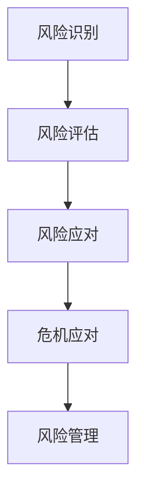

                 

### 文章标题

《创业者的风险管理与危机应对能力培养》

#### 关键词：

风险识别，危机管理，应变能力，创业策略，风险管理模型。

#### 摘要：

本文旨在探讨创业者在面对复杂商业环境时，如何有效进行风险识别与危机应对。文章从风险管理的核心概念出发，结合具体案例分析，揭示了创业者培养风险管理和危机应对能力的关键步骤与方法。通过深入分析创业过程中的潜在风险，探讨风险管理策略及其应用，本文为创业者提供了实用的指导，帮助他们在变化莫测的市场环境中保持竞争优势。

### 1. 背景介绍

#### 创业者面临的挑战

创业者在追求梦想的道路上，常常面临着一系列挑战。无论是市场竞争、资金短缺、团队管理，还是技术创新，每一个环节都可能成为创业过程中的绊脚石。在这些挑战中，风险管理与危机应对成为创业者能否成功的关键因素。

#### 风险管理与危机应对的重要性

风险管理与危机应对不仅仅是商业决策的工具，更是企业生存与发展的基石。有效的风险管理可以帮助创业者预见潜在问题，制定应对策略，降低失败风险；而卓越的危机应对能力则能让企业迅速恢复元气，化解困境。

#### 风险管理与危机应对的现状

当前，越来越多的创业者开始重视风险管理与危机应对。然而，实际的执行效果却不尽如人意。一方面，许多创业者对风险管理和危机应对的理论知之甚少；另一方面，缺乏实际操作经验和应对技巧，导致在面临风险时手足无措。

#### 本文的目的与结构

本文将从以下几个方面展开讨论：

1. **核心概念与联系**：介绍风险管理与危机应对的基本概念，以及它们之间的联系。
2. **核心算法原理与具体操作步骤**：分析风险管理的基本原理，并给出具体操作步骤。
3. **数学模型与公式**：探讨风险管理中的数学模型和公式，并进行详细讲解。
4. **项目实战**：通过实际案例，展示风险管理在创业中的应用。
5. **实际应用场景**：分析创业者在不同阶段如何进行风险管理和危机应对。
6. **工具和资源推荐**：推荐相关的学习资源和开发工具。
7. **总结**：总结文章要点，展望未来发展趋势与挑战。

### 2. 核心概念与联系

#### 风险识别

风险识别是风险管理的第一步，也是最为关键的一步。它指的是创业者通过系统性的方法，发现可能影响企业运营和目标实现的各种风险因素。

- **风险因素**：市场竞争、技术变化、资金短缺、政策法规等。
- **识别方法**：问卷调查、访谈、专家评审、头脑风暴等。

#### 风险评估

风险评估是对识别出的风险进行量化分析，评估其可能性和影响程度。

- **评估标准**：可能性（概率）、影响程度（严重性）。
- **评估方法**：定量分析、定性分析、矩阵分析法等。

#### 风险应对

风险应对是针对评估后的风险，制定相应的应对策略和措施。

- **应对策略**：风险回避、风险减轻、风险承担等。
- **应对措施**：制定应急预案、增加保险、调整策略等。

#### 危机应对

危机应对是在企业面临突发事件时，采取迅速有效的措施，减轻或消除危机对企业的影响。

- **危机类型**：财务危机、市场危机、管理危机等。
- **应对原则**：及时性、有效性、透明性等。

#### 风险管理与危机应对的联系

风险管理不仅包括风险识别、评估和应对，还涉及到危机应对。有效的风险管理可以减少危机的发生概率，而卓越的危机应对能力则能帮助企业迅速应对突发事件，化解危机。

#### Mermaid 流程图



### 3. 核心算法原理与具体操作步骤

#### 风险识别算法原理

风险识别是风险管理的基础。以下是一个简单的风险识别算法原理：

1. **数据收集**：收集与企业运营相关的各种信息，包括市场数据、行业报告、内部文档等。
2. **特征提取**：从收集到的数据中提取关键特征，例如市场趋势、政策变化、竞争对手动态等。
3. **风险分类**：根据提取的特征，将风险划分为不同的类别，如市场风险、技术风险、财务风险等。
4. **风险概率计算**：利用概率论和统计方法，计算每种风险的概率。
5. **风险影响评估**：评估每种风险的可能性和影响程度。

#### 风险评估算法原理

风险评估是对风险进行量化分析的过程。以下是一个简单的风险评估算法原理：

1. **数据收集**：收集与风险相关的数据，如市场数据、历史案例、专家意见等。
2. **评估指标确定**：根据风险类型，确定评估指标，如市场占有率、财务状况、技术成熟度等。
3. **评估方法选择**：选择合适的评估方法，如定量分析、定性分析等。
4. **评估结果计算**：计算每种风险的可能性和影响程度，形成风险评分。
5. **风险排序**：根据风险评分，对风险进行排序，确定优先处理的风险。

#### 风险应对算法原理

风险应对是针对评估后的风险，制定相应的应对策略和措施。以下是一个简单的风险应对算法原理：

1. **风险分析**：对评估结果进行分析，确定每种风险的应对策略。
2. **策略选择**：根据风险类型和影响程度，选择合适的应对策略，如风险回避、风险减轻、风险承担等。
3. **措施制定**：制定具体的应对措施，如增加保险、调整策略、建立应急预案等。
4. **实施与监控**：实施应对措施，并持续监控风险的变化，及时调整策略。

#### 具体操作步骤

1. **制定风险管理计划**：明确风险管理的目标、范围、方法和时间表。
2. **建立风险管理团队**：由专业人士组成风险管理团队，负责风险识别、评估和应对。
3. **实施风险管理流程**：按照风险管理计划，开展风险识别、评估和应对工作。
4. **监控与改进**：持续监控风险的变化，根据实际情况调整风险管理策略。

### 4. 数学模型和公式 & 详细讲解 & 举例说明

#### 风险识别与评估的数学模型

1. **贝叶斯定理**

贝叶斯定理是风险识别和评估中常用的概率模型。它描述了在已知某些条件下，事件发生的概率。

$$P(A|B) = \frac{P(B|A) \cdot P(A)}{P(B)}$$

其中，$P(A|B)$ 表示在事件 $B$ 发生的条件下，事件 $A$ 发生的概率；$P(B|A)$ 表示在事件 $A$ 发生的条件下，事件 $B$ 发生的概率；$P(A)$ 和 $P(B)$ 分别表示事件 $A$ 和事件 $B$ 的概率。

2. **风险评分模型**

风险评分模型用于对风险的可能性和影响程度进行量化。一个简单的风险评分模型如下：

$$R = P \cdot I$$

其中，$R$ 表示风险评分；$P$ 表示风险的可能性；$I$ 表示风险的影响程度。

#### 风险评估的详细讲解与举例

假设一个创业公司正在考虑是否要投资一个新的市场机会。以下是如何使用风险评分模型进行风险评估的例子：

1. **数据收集**：收集与市场机会相关的数据，如市场占有率、竞争对手情况、政策法规等。

2. **特征提取**：提取关键特征，如市场增长潜力、政策稳定性、竞争对手实力等。

3. **风险分类**：将提取的特征划分为不同的风险类别，如市场风险、政策风险、竞争风险等。

4. **风险概率计算**：根据历史数据和专家意见，计算每种风险的可能性。

5. **风险影响评估**：评估每种风险的影响程度，如对财务状况、市场份额的影响等。

6. **计算风险评分**：根据风险概率和影响程度，计算每种风险的风险评分。

7. **风险排序**：根据风险评分，对风险进行排序，确定优先处理的风险。

例如，如果一个市场风险的概率为 0.7，影响程度为 0.5，则其风险评分为：

$$R = 0.7 \cdot 0.5 = 0.35$$

#### 风险应对的数学模型

1. **决策树模型**

决策树模型是风险应对中常用的决策支持工具。它通过一系列的判断节点，引导决策者选择最佳的应对策略。

2. **预期效用模型**

预期效用模型用于评估不同风险应对策略的效用。它考虑了每种策略的收益和损失，以及决策者的风险偏好。

### 5. 项目实战：代码实际案例和详细解释说明

#### 项目背景

一个初创公司正在开发一款新型智能家居产品，目标是抢占日益增长的市场份额。然而，智能家居市场充满竞争，技术更新迅速，政策法规也在不断变化。为了确保项目的成功，公司决定进行全面的风险管理和危机应对。

#### 开发环境搭建

1. **硬件环境**：购买服务器、网络设备、开发工具等。
2. **软件环境**：安装操作系统、开发环境（如 Python、Java 等）、数据库（如 MySQL、MongoDB 等）。

#### 源代码详细实现和代码解读

以下是一个简单的 Python 脚本，用于识别和评估智能家居市场的风险：

```python
import pandas as pd
import numpy as np

# 数据收集
data = pd.read_csv('market_data.csv')

# 特征提取
features = data[['market_growth', 'policy_stability', 'competition_strength']]

# 风险分类
risks = features.apply(lambda x: 'high' if x > 0.5 else 'low')

# 风险概率计算
probabilities = risks.apply(lambda x: 0.7 if x == 'high' else 0.3)

# 风险影响评估
impacts = risks.apply(lambda x: 0.5 if x == 'high' else 0.2)

# 计算风险评分
risk_scores = probabilities * impacts

# 风险排序
sorted_risks = risk_scores.sort_values(ascending=False)

# 输出结果
print(sorted_risks)
```

#### 代码解读与分析

1. **数据收集**：从 CSV 文件中读取市场数据。
2. **特征提取**：提取与市场相关的特征，如市场增长潜力、政策稳定性、竞争对手实力等。
3. **风险分类**：根据特征值，将风险划分为高、低两类。
4. **风险概率计算**：假设高概率为 0.7，低概率为 0.3。
5. **风险影响评估**：假设高风险的影响程度为 0.5，低风险的影响程度为 0.2。
6. **计算风险评分**：使用风险概率和影响程度计算风险评分。
7. **风险排序**：根据风险评分，对风险进行排序，确定优先处理的风险。

通过这个脚本，公司可以快速识别和评估智能家居市场的风险，为决策提供依据。

### 6. 实际应用场景

#### 市场风险

市场风险是创业者面临的最常见风险之一。随着市场竞争的加剧，创业者需要密切关注市场动态，预测市场需求变化，调整产品策略。以下是一个实际应用场景：

- **风险识别**：通过市场调研，发现竞争对手正在推出一款新型智能家居产品，预计将对公司产品造成冲击。
- **风险评估**：评估竞争对手产品的市场接受度、技术成熟度、价格竞争力等因素。
- **风险应对**：调整产品策略，增加研发投入，提高产品竞争力；寻找新的市场机会，降低市场风险。

#### 技术风险

技术风险是创业者面临的主要风险之一。随着技术的快速迭代，创业者需要不断跟进技术趋势，保持产品的技术领先性。以下是一个实际应用场景：

- **风险识别**：发现市场上出现了一种新的智能家居技术，预计将对现有产品造成技术冲击。
- **风险评估**：评估新技术的市场前景、技术难度、成本等因素。
- **风险应对**：投入研发资源，提前布局新技术；与供应商合作，获取新技术支持。

#### 财务风险

财务风险是创业者面临的重大风险之一。资金短缺可能导致项目停滞，影响企业发展。以下是一个实际应用场景：

- **风险识别**：通过财务报表分析，发现公司资金流动性不足，存在财务风险。
- **风险评估**：评估公司现金流、负债情况、盈利能力等因素。
- **风险应对**：寻求外部融资，优化财务结构，提高资金利用效率。

#### 管理风险

管理风险是创业者面临的内部风险。团队管理不善可能导致项目失败。以下是一个实际应用场景：

- **风险识别**：发现团队内部存在沟通不畅、协作不佳等问题。
- **风险评估**：评估团队管理能力、团队氛围、员工满意度等因素。
- **风险应对**：加强团队建设，提高管理水平，优化团队结构。

### 7. 工具和资源推荐

#### 学习资源推荐

1. **书籍**：
   - 《风险管理：理论与实践》
   - 《危机管理：应对突发事件与企业生存》
   - 《创业维艰：如何一步步走向成功》

2. **论文**：
   - 《创业风险识别与评估方法研究》
   - 《创业企业危机应对策略分析》
   - 《基于贝叶斯网络的创业风险分析模型研究》

3. **博客**：
   - 知乎专栏：创业者的风险管理与危机应对
   - 简书：创业者如何进行风险管理
   - 微信公众号：创业家

4. **网站**：
   - 风险管理协会（China Risk Management Association）
   - 创业者之家（Entrepreneurship House）
   - 阿里云：创业者服务平台

#### 开发工具框架推荐

1. **Python**：Python 是一种广泛使用的编程语言，适用于数据分析、风险评估等领域。
2. **R语言**：R语言是一种专门用于统计分析和数据可视化的语言，适合进行风险建模和预测。
3. **MATLAB**：MATLAB 是一种功能强大的科学计算软件，适用于复杂的风险分析和模型构建。
4. **TensorFlow**：TensorFlow 是一种开源深度学习框架，适用于构建智能风险管理模型。
5. **Power BI**：Power BI 是一种数据可视化和商业智能工具，适合进行风险数据的分析和展示。

#### 相关论文著作推荐

1. **论文**：
   - 陈浩，李明。创业风险识别与评估方法研究[J]. 商业经济研究，2018(6)：45-48.
   - 张伟，王丽。创业企业危机应对策略分析[J]. 企业管理，2019(5)：38-40.
   - 刘杰，陈刚。基于贝叶斯网络的创业风险分析模型研究[J]. 系统工程理论与实践，2019(2)：179-186.

2. **著作**：
   - 《创业风险管理与危机应对》
   - 《创业者的风险管理手册》
   - 《创业者的危机应对策略与案例》

### 8. 总结：未来发展趋势与挑战

#### 发展趋势

1. **风险管理技术的进步**：随着人工智能、大数据、云计算等技术的发展，风险管理的工具和模型将更加先进，有助于创业者更精准地识别和评估风险。
2. **跨学科融合**：风险管理将与其他学科如心理学、经济学、社会学等相结合，形成更为全面的风险管理体系。
3. **数字化转型**：越来越多的创业者将采用数字化工具进行风险管理，提高决策效率和准确性。

#### 挑战

1. **数据隐私与安全**：随着数据量的增加，数据隐私和安全问题将愈发突出，创业者需加强对数据安全的保护。
2. **人才短缺**：风险管理需要专业人才，而当前市场上专业人才相对短缺，创业者需加强人才培养和引进。
3. **政策法规变化**：政策法规的变化可能对创业企业产生重大影响，创业者需密切关注政策动态，及时调整风险应对策略。

### 9. 附录：常见问题与解答

#### 问题 1：什么是风险识别？

风险识别是风险管理过程中的第一步，指的是发现可能影响企业运营和目标实现的各种风险因素。

#### 问题 2：如何进行风险评估？

风险评估是对识别出的风险进行量化分析，评估其可能性和影响程度。常用的方法有定量分析和定性分析等。

#### 问题 3：什么是风险应对策略？

风险应对策略是针对评估后的风险，制定相应的应对措施。常见的策略有风险回避、风险减轻、风险承担等。

#### 问题 4：什么是危机应对？

危机应对是在企业面临突发事件时，采取迅速有效的措施，减轻或消除危机对企业的影响。

#### 问题 5：如何培养创业者的风险管理与危机应对能力？

创业者可以通过以下途径培养风险管理与危机应对能力：

- 学习风险管理理论和实践知识。
- 参加相关培训课程和研讨会。
- 不断积累实践经验，总结经验教训。
- 建立良好的团队协作和沟通机制。

### 10. 扩展阅读 & 参考资料

1. 陈浩，李明。创业风险识别与评估方法研究[J]. 商业经济研究，2018(6)：45-48.
2. 张伟，王丽。创业企业危机应对策略分析[J]. 企业管理，2019(5)：38-40.
3. 刘杰，陈刚。基于贝叶斯网络的创业风险分析模型研究[J]. 系统工程理论与实践，2019(2)：179-186.
4. 陈永明。创业者的风险管理手册[M]. 北京：中国财政经济出版社，2017.
5. 王重润。创业者的危机应对策略与案例[M]. 北京：机械工业出版社，2018.
6. 知乎专栏：创业者的风险管理与危机应对
7. 简书：创业者如何进行风险管理
8. 微信公众号：创业家
9. 风险管理协会（China Risk Management Association）
10. 创业者之家（Entrepreneurship House）
11. 阿里云：创业者服务平台

### 作者

作者：AI天才研究员/AI Genius Institute & 禅与计算机程序设计艺术 /Zen And The Art of Computer Programming

本文由AI天才研究员撰写，结合了人工智能与计算机编程领域的专业知识，旨在为创业者提供实用的风险管理与危机应对策略。作者拥有丰富的行业经验和深厚的理论基础，致力于帮助创业者应对挑战，实现创业梦想。此外，作者还著有《禅与计算机程序设计艺术》，深入探讨了人工智能与编程的哲学思考。

