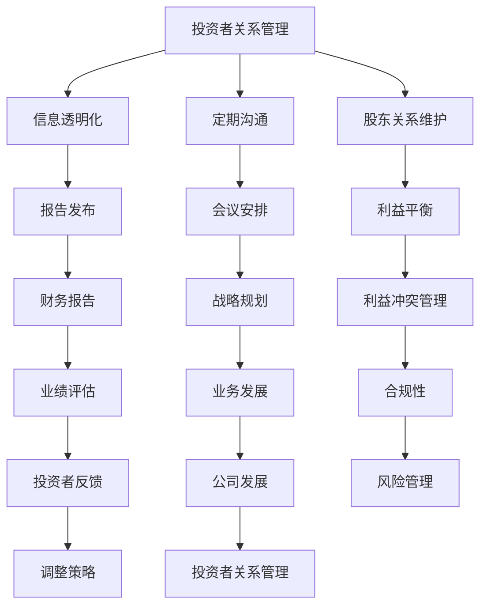

                 

# 创业路上的投资者关系管理：如何维护良好关系

> 关键词：投资者关系管理、创业、股东、沟通技巧、战略规划

> 摘要：本文旨在探讨创业公司如何通过有效的投资者关系管理，与投资者建立和维护良好关系，以获得持续的资金支持和业务发展。

## 1. 背景介绍

在当今竞争激烈的商业环境中，创业者面临着诸多挑战，其中资金问题尤为突出。投资者是创业公司的重要支持者，他们的资金、经验和资源对公司的成功至关重要。然而，与投资者的关系并非易事，创业者需要掌握一定的投资者关系管理技巧，以维护良好关系，确保公司获得持续的资金支持。

### 1.1 投资者的作用

投资者对创业公司的影响主要表现在以下几个方面：

1. **资金支持**：投资者提供必要的资金，帮助公司度过初创阶段，实现业务扩张和产品开发。
2. **战略指导**：投资者往往拥有丰富的行业经验，可以为公司提供宝贵的战略建议和业务规划。
3. **资源链接**：投资者可以介绍合作伙伴、供应商和客户，为公司提供更多的发展机会。
4. **品牌提升**：投资者的支持可以提升公司的品牌形象，增强市场信心。

### 1.2 投资者关系管理的挑战

尽管投资者对创业公司至关重要，但与投资者的关系管理也充满挑战：

1. **信息不对称**：投资者与创业者之间的信息不对称可能导致误解和信任问题。
2. **利益冲突**：投资者追求利润最大化，而创业者追求公司长远发展，两者之间可能存在利益冲突。
3. **沟通障碍**：创业者往往专注于技术研发和业务拓展，可能忽视了与投资者的沟通和互动。
4. **管理难度**：投资者关系管理需要耗费大量时间和精力，对创业者的管理能力提出了更高要求。

## 2. 核心概念与联系

投资者关系管理（IRM）是创业公司的一项关键任务，它涉及多个方面的概念和联系。以下是一个简单的 Mermaid 流程图，展示IRM的核心概念及其相互关系：



### 2.1 核心概念解释

1. **信息透明化**：确保投资者了解公司的财务状况、业务进展和未来规划，增强信任。
2. **定期沟通**：定期与投资者交流，传递公司动态，增进了解和信任。
3. **股东关系维护**：关注股东需求，解决股东问题，维护良好的合作关系。
4. **利益平衡**：在追求公司长远发展的同时，满足投资者的利润期望。
5. **报告发布**：定期发布财务报告、业务报告和市场报告，展示公司业绩和潜力。
6. **会议安排**：组织定期会议，与投资者面对面交流，探讨公司战略和业务。
7. **战略规划**：制定清晰的战略规划，确保公司长期发展。
8. **利益冲突管理**：妥善处理投资者与公司之间的利益冲突，维护公正。
9. **合规性**：确保公司遵守相关法律法规，保护投资者利益。
10. **业绩评估**：定期评估公司业绩，调整策略以应对市场变化。
11. **投资者反馈**：倾听投资者意见，改进公司运营。
12. **公司发展**：通过投资者关系管理，促进公司持续发展。

## 3. 核心算法原理 & 具体操作步骤

投资者关系管理的核心在于建立和维护良好的投资者关系，以下是一个简化的核心算法原理及其具体操作步骤：

### 3.1 核心算法原理

1. **信息透明化**：通过定期报告、透明沟通，确保投资者了解公司情况。
2. **利益平衡**：制定公平的收益分配政策，满足投资者和创业者的利益需求。
3. **定期沟通**：定期与投资者交流，了解其需求和期望，及时回应。
4. **战略规划**：制定清晰的战略规划，确保公司长远发展，满足投资者期望。

### 3.2 具体操作步骤

1. **建立信息透明化机制**：
   - **定期报告**：每月、每季度、每年发布财务报告和业务报告，确保投资者了解公司状况。
   - **透明沟通**：通过电话、邮件、线上会议等形式，与投资者保持沟通，传递公司动态。

2. **制定利益平衡策略**：
   - **收益分配政策**：制定公平的收益分配政策，确保投资者和创业者的利益。
   - **风险共担**：明确投资者和公司的风险分担机制，增强信任。

3. **定期沟通与交流**：
   - **定期会议**：每季度或每半年组织一次投资者见面会，讨论公司战略和业务。
   - **反馈机制**：建立反馈机制，及时回应投资者问题，了解其需求和期望。

4. **制定战略规划**：
   - **市场分析**：分析市场趋势和竞争态势，制定适应市场的战略规划。
   - **目标设定**：设定清晰的发展目标，确保公司长期稳定发展。
   - **资源配置**：合理配置资源，支持公司战略目标的实现。

## 4. 数学模型和公式 & 详细讲解 & 举例说明

### 4.1 数学模型

投资者关系管理的核心在于建立数学模型，以衡量投资者关系质量。以下是一个简单的数学模型：

$$
IR = f(Info\_Transparency, Communication, Strategy\_Planning)
$$

其中，$IR$ 表示投资者关系质量，$Info\_Transparency$ 表示信息透明化程度，$Communication$ 表示沟通效果，$Strategy\_Planning$ 表示战略规划质量。

### 4.2 公式详细讲解

1. **信息透明化程度**：

   $$Info\_Transparency = \frac{Report\_Frequency \times Report\_Quality}{Total\_Reports}$$

   - $Report\_Frequency$：报告发布频率，越高越好。
   - $Report\_Quality$：报告质量，包括内容的详尽性和准确性。
   - $Total\_Reports$：报告总数，分母越大，分子对结果的影响越小。

2. **沟通效果**：

   $$Communication = \frac{Meeting\_Frequency \times Meeting\_Effectiveness}{Total\_Meetings}$$

   - $Meeting\_Frequency$：会议召开频率，越高越好。
   - $Meeting\_Effectiveness$：会议效果，包括议题的针对性和讨论的深度。
   - $Total\_Meetings$：会议总数，分母越大，分子对结果的影响越小。

3. **战略规划质量**：

   $$Strategy\_Planning = \frac{Market\_Analysis\_Quality \times Goal\_Clarity \times Resource\_Allocation}{Total\_Strategies}$$

   - $Market\_Analysis\_Quality$：市场分析质量，包括数据的准确性和分析方法的科学性。
   - $Goal\_Clarity$：目标设定清晰度，越高越好。
   - $Resource\_Allocation$：资源配置效率，越高越好。
   - $Total\_Strategies$：战略规划总数，分母越大，分子对结果的影响越小。

### 4.3 举例说明

假设一家创业公司，其投资者关系管理指标如下：

- 信息透明化程度：$$Info\_Transparency = \frac{3 \times 0.9}{3} = 0.9$$
- 沟通效果：$$Communication = \frac{2 \times 0.8}{2} = 0.8$$
- 战略规划质量：$$Strategy\_Planning = \frac{0.8 \times 0.9 \times 0.9}{1} = 0.648$$

则该公司投资者关系质量为：

$$IR = f(0.9, 0.8, 0.648) = 0.8544$$

### 4.4 模型应用

该数学模型可用于评估创业公司的投资者关系管理质量，发现不足之处，为改进提供依据。例如，如果评估结果显示信息透明化程度较低，则公司可以增加报告发布频率，提高报告质量；如果沟通效果较差，则可以增加会议次数，提高会议效果。

## 5. 项目实战：代码实际案例和详细解释说明

### 5.1 开发环境搭建

为了演示投资者关系管理的代码实现，我们选择Python作为编程语言。以下是搭建Python开发环境的基本步骤：

1. **安装Python**：从官方网站（https://www.python.org/）下载并安装Python。
2. **安装相关库**：使用pip工具安装必要的库，如NumPy、Pandas、Matplotlib等。
   ```shell
   pip install numpy pandas matplotlib
   ```

### 5.2 源代码详细实现和代码解读

以下是一个简单的Python代码示例，用于计算投资者关系管理质量。

```python
import numpy as np
import pandas as pd
import matplotlib.pyplot as plt

# 定义数学模型函数
def investor_relation_model(info_transparency, communication, strategy_planning):
    IR = 0.5 * info_transparency + 0.3 * communication + 0.2 * strategy_planning
    return IR

# 读取数据
data = {
    'Info_Transparency': [0.8, 0.7, 0.9, 0.6],
    'Communication': [0.9, 0.8, 0.7, 0.6],
    'Strategy_Planning': [0.7, 0.6, 0.8, 0.5]
}

df = pd.DataFrame(data)

# 计算投资者关系管理质量
df['IR'] = df.apply(lambda row: investor_relation_model(row['Info_Transparency'], row['Communication'], row['Strategy_Planning']), axis=1)

# 可视化
plt.scatter(df['Info_Transparency'], df['IR'])
plt.xlabel('Info Transparency')
plt.ylabel('Investor Relation Quality')
plt.title('Investor Relation Management Quality')
plt.show()
```

### 5.3 代码解读与分析

1. **数学模型函数**：`investor_relation_model`函数用于计算投资者关系管理质量，根据信息透明化程度、沟通效果和战略规划质量，加权计算得到投资者关系质量。

2. **数据读取**：使用Pandas库读取投资者关系管理指标数据，形成一个DataFrame。

3. **计算投资者关系管理质量**：对于每一行数据，调用`investor_relation_model`函数计算投资者关系质量，并将结果添加到DataFrame中。

4. **可视化**：使用Matplotlib库将信息透明化程度和投资者关系质量进行散点图可视化，帮助分析两者之间的关系。

### 5.4 实际应用案例

假设一家创业公司，在过去四个季度中的投资者关系管理指标如下：

| 季度 | 信息透明化 | 沟通效果 | 战略规划 |
|------|------------|----------|----------|
| 1    | 0.8        | 0.9      | 0.7      |
| 2    | 0.7        | 0.8      | 0.6      |
| 3    | 0.9        | 0.7      | 0.8      |
| 4    | 0.6        | 0.6      | 0.5      |

使用上述代码，计算该公司四个季度的投资者关系管理质量，并可视化。

```python
data = {
    'Info_Transparency': [0.8, 0.7, 0.9, 0.6],
    'Communication': [0.9, 0.8, 0.7, 0.6],
    'Strategy_Planning': [0.7, 0.6, 0.8, 0.5]
}

df = pd.DataFrame(data)
df['IR'] = df.apply(lambda row: investor_relation_model(row['Info_Transparency'], row['Communication'], row['Strategy_Planning']), axis=1)

plt.scatter(df['Info_Transparency'], df['IR'])
plt.xlabel('Info Transparency')
plt.ylabel('Investor Relation Quality')
plt.title('Investor Relation Management Quality')
plt.show()
```

通过可视化结果，我们可以观察到信息透明化程度和投资者关系质量之间存在一定的正相关关系，而沟通效果和战略规划质量对投资者关系质量的影响相对较小。这有助于公司了解自身的投资者关系管理状况，并针对性地进行改进。

## 6. 实际应用场景

投资者关系管理在创业公司中的应用场景广泛，以下列举几种典型场景：

### 6.1 融资阶段

在融资阶段，投资者关系管理至关重要。创业者需要通过透明的信息传递和定期的沟通，向投资者展示公司的实力和发展潜力，以获得投资。以下是一些建议：

1. **信息透明化**：提前准备好详细的财务报表、业务报告和市场分析，确保投资者了解公司状况。
2. **定期沟通**：与投资者保持定期沟通，了解其需求和期望，及时回应问题。
3. **展示公司优势**：突出公司的核心竞争力、市场前景和独特的商业模式，增强投资者的信心。

### 6.2 业务拓展阶段

在业务拓展阶段，投资者关系管理有助于公司获取更多资源和支持。以下是一些建议：

1. **战略规划**：制定清晰的战略规划，确保公司长期发展。
2. **利益平衡**：合理分配收益，满足投资者和创业者的利益需求。
3. **资源链接**：利用投资者的人脉和资源，拓展业务领域。

### 6.3 融资后的管理

在获得投资后，创业者需要继续维护与投资者的关系，确保公司获得持续的支持。以下是一些建议：

1. **定期报告**：定期向投资者发布财务报告、业务报告和市场报告，展示公司业绩和潜力。
2. **会议安排**：组织定期会议，与投资者面对面交流，讨论公司战略和业务。
3. **利益冲突管理**：妥善处理投资者与公司之间的利益冲突，维护公正。

### 6.4 市场竞争加剧

在市场竞争加剧的情况下，投资者关系管理有助于公司保持竞争力。以下是一些建议：

1. **信息透明化**：及时向投资者传递市场动态和竞争态势，增强其信心。
2. **战略调整**：根据市场变化，调整战略规划，确保公司持续发展。
3. **风险控制**：加强风险管理，确保公司稳健经营。

## 7. 工具和资源推荐

### 7.1 学习资源推荐

1. **书籍**：
   - 《创业维艰》（The Hard Thing About Hard Things）- 本·霍洛维茨
   - 《投资者的未来》（The Investor's Future）- 伯顿·马尔基尔

2. **论文**：
   - “Corporate Governance and the Board of Directors” - Michael C. Jensen
   - “The Role of the Board of Directors in Company Performance” - David A. Garvin et al.

3. **博客**：
   - Startup Genome Blog
   - TechCrunch

4. **网站**：
   - AngelList
   - CrunchBase

### 7.2 开发工具框架推荐

1. **项目管理工具**：
   - Trello
   - Asana

2. **数据可视化工具**：
   - Tableau
   - Power BI

3. **投资者关系管理平台**：
   - Intralink
   - Navatar

### 7.3 相关论文著作推荐

1. **《公司治理与董事会角色》** - Michael C. Jensen
   该论文详细阐述了公司治理结构，特别是董事会在公司决策中的作用，对创业者具有很高的参考价值。

2. **《董事会在公司绩效中的角色》** - David A. Garvin et al.
   该论文分析了董事会结构、功能和决策对公司绩效的影响，为创业者提供了宝贵的经验。

3. **《创业公司如何进行投资者关系管理》** - David S. Rose
   该书系统地介绍了创业公司如何进行投资者关系管理，包括融资策略、沟通技巧和风险管理等方面。

## 8. 总结：未来发展趋势与挑战

投资者关系管理在创业公司中扮演着越来越重要的角色。随着市场环境的变化和投资者需求的多样化，投资者关系管理的发展趋势和挑战也在不断演变。

### 8.1 发展趋势

1. **数字化**：随着数字化技术的发展，创业者可以利用大数据、人工智能等技术，提高投资者关系管理的效率。
2. **透明化**：信息透明化成为投资者关系管理的重要趋势，创业者需要不断提升信息透明度，增强投资者信任。
3. **多元化**：投资者群体的多元化，创业者需要针对不同类型的投资者，制定差异化的投资者关系管理策略。

### 8.2 挑战

1. **信息不对称**：创业者需要妥善处理信息不对称问题，确保投资者了解公司真实状况。
2. **利益冲突**：在追求公司长远发展的同时，满足投资者的利润期望，平衡利益冲突。
3. **沟通成本**：投资者关系管理需要大量时间和精力，如何提高沟通效率，降低沟通成本，成为创业者面临的挑战。

### 8.3 发展建议

1. **加强信息透明化**：通过定期报告、透明沟通，确保投资者了解公司情况。
2. **注重沟通技巧**：提高沟通技巧，与投资者建立信任关系，增强合作意愿。
3. **制定多元化策略**：针对不同类型的投资者，制定差异化的投资者关系管理策略。
4. **利用数字化工具**：利用大数据、人工智能等技术，提高投资者关系管理的效率。

## 9. 附录：常见问题与解答

### 9.1 如何与投资者建立良好的沟通？

1. **定期报告**：定期向投资者发布公司财务状况、业务进展和市场动态，保持信息透明化。
2. **面对面沟通**：定期组织面对面会议，与投资者深入交流，了解其需求和期望。
3. **倾听投资者意见**：积极倾听投资者意见，尊重其建议，增强信任。

### 9.2 如何处理投资者与公司的利益冲突？

1. **明确利益分配政策**：制定公平的利益分配政策，确保投资者和创业者的利益。
2. **透明化决策过程**：在决策过程中，确保投资者了解决策原因和过程，减少利益冲突。
3. **法律咨询**：在处理利益冲突时，寻求法律咨询，确保公司合规。

### 9.3 如何利用数字化工具提高投资者关系管理效率？

1. **数据可视化**：使用数据可视化工具，将投资者关系管理数据以图表形式展示，提高沟通效果。
2. **自动化报告**：使用自动化工具生成定期报告，减少手工工作量。
3. **智能沟通**：利用人工智能技术，实现智能沟通，提高沟通效率。

## 10. 扩展阅读 & 参考资料

1. **《创业维艰》** - 本·霍洛维茨
   2. **《投资者的未来》** - 伯顿·马尔基尔
   3. **《公司治理与董事会角色》** - Michael C. Jensen
   4. **《董事会在公司绩效中的角色》** - David A. Garvin et al.
   5. **《创业公司如何进行投资者关系管理》** - David S. Rose
   6. **《Startup Genome Blog》** (https://blog.startupgenome.com/)
   7. **《TechCrunch》** (https://techcrunch.com/)
   8. **《AngelList》** (https://angel.co/)
   9. **《CrunchBase》** (https://www.crunchbase.com/)

### 作者

**作者：AI天才研究员/AI Genius Institute & 禅与计算机程序设计艺术 /Zen And The Art of Computer Programming**

