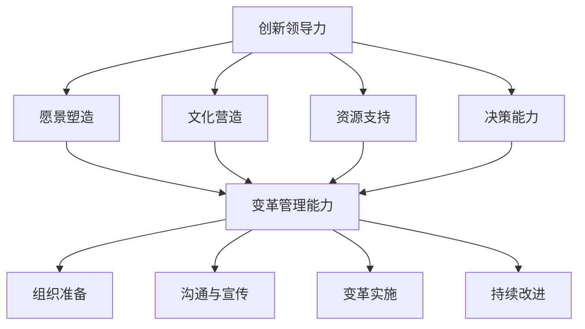

                 

### 背景介绍

在当今快速变化的市场环境中，创新领导力和变革管理能力成为企业成功的关键因素。无论是一个初创公司，还是一家成熟的大型企业，要想在激烈的市场竞争中脱颖而出，提升创新领导力和变革管理能力是不可或缺的。

**创新领导力**，指的是领导者引导团队不断寻求新的解决方案，探索新的市场机会，并通过创新来推动组织发展。而**变革管理能力**，则是企业在面对外部环境变化或内部结构调整时，能够有效管理变革过程，确保变革顺利实施并取得预期效果的能力。

创业过程中，创新领导力和变革管理能力的重要性体现在多个方面。首先，它能够帮助企业抓住市场机遇，通过不断创新来满足客户需求，提升市场竞争力。其次，它有助于企业应对外部环境变化，如政策法规调整、技术革新等，确保企业在变化中保持竞争优势。最后，它还能促进企业内部文化的建设，激发员工的创造力和积极性，形成良性循环。

本文将围绕创新领导力和变革管理能力展开讨论，通过详细阐述其核心概念、算法原理、数学模型和项目实战，帮助读者深入了解并提升这些能力。

### 核心概念与联系

要深入探讨创新领导力和变革管理能力，我们首先需要明确一些核心概念和它们之间的联系。这些概念不仅构成了我们讨论的基础，也是理解和实践这些能力的关键。

#### 1. 创新领导力

创新领导力是指领导者通过激发团队创造力、塑造创新文化、推动创新实践等方式，引领企业持续创新的能力。它包括以下几个方面：

- **愿景塑造**：领导者需要具备远见，能够描绘出企业未来发展的蓝图，并通过愿景的传达激发团队成员的积极性和创造力。
- **文化营造**：领导者要塑造一个鼓励创新、容忍失败的企业文化，使员工敢于尝试新事物，勇于挑战现状。
- **资源支持**：领导者要确保创新所需的资源得到充分保障，包括资金、技术、人力等。
- **决策能力**：领导者需要具备快速决策的能力，以便在创新过程中及时调整方向，确保创新项目顺利进行。

#### 2. 变革管理能力

变革管理能力是指企业在面临外部环境变化或内部结构调整时，能够有效管理和引导变革的能力。它包括以下几个方面：

- **组织准备**：企业需要为变革做好准备，包括明确变革的目标和愿景，建立变革领导团队，制定变革计划等。
- **沟通与宣传**：企业要通过有效的沟通和宣传，让员工理解变革的必要性和紧迫性，消除变革的抵触情绪。
- **变革实施**：企业在实施变革过程中，需要密切关注变革的进度和效果，及时调整策略，确保变革顺利推进。
- **持续改进**：企业要不断评估变革的效果，进行持续改进，以适应不断变化的外部环境。

#### 3. 创新领导力与变革管理能力的联系

创新领导力和变革管理能力并不是孤立的，它们之间有着紧密的联系。一方面，创新领导力是变革管理能力的重要组成部分。一个具备创新领导力的领导者，能够更好地推动企业进行变革，引导员工接受新事物，实现企业的持续发展。另一方面，变革管理能力也为创新领导力提供了保障。只有通过有效的变革管理，企业才能在变革过程中保持稳定，为创新提供良好的环境。

#### Mermaid 流程图

下面是一个用Mermaid绘制的流程图，展示了创新领导力和变革管理能力之间的关系：



通过这个流程图，我们可以清晰地看到创新领导力和变革管理能力之间的互动关系。理解这些核心概念和联系，是我们在后续讨论中进行分析和探讨的基础。

### 核心算法原理 & 具体操作步骤

#### 创新领导力的核心算法原理

创新领导力的核心算法可以理解为一系列的策略和方法，旨在激发团队的创造力，推动创新实践。以下是一些关键步骤：

1. **愿景塑造**：首先，领导者需要明确企业的愿景和目标，并将其传达给团队成员。这个过程可以通过制定战略规划、组织研讨会、发布愿景声明等方式进行。

2. **文化营造**：建立鼓励创新的企业文化是关键。领导者可以通过以下方法来营造这种文化：
   - **鼓励分享和交流**：定期举办内部分享会，鼓励员工分享自己的创意和想法。
   - **提供培训和资源**：为员工提供相关的培训和学习资源，帮助他们提升创新技能。
   - **认可和奖励**：对在创新方面表现突出的员工给予认可和奖励，以激励更多人参与创新。

3. **资源支持**：确保创新所需的资源得到充分保障，包括资金、技术、人力等。这可以通过以下方式实现：
   - **预算分配**：将一定的预算分配给创新项目，确保项目有足够的资金支持。
   - **技术支持**：提供必要的技术支持和资源，帮助创新团队克服技术难题。
   - **时间安排**：为创新团队提供足够的时间，让他们专注于创新工作。

4. **决策能力**：领导者需要具备快速决策的能力，以便在创新过程中及时调整方向。这可以通过以下方式实现：
   - **建立决策机制**：建立快速决策的机制，确保在遇到问题时能够快速做出决策。
   - **集思广益**：在决策过程中，充分听取团队成员的意见和建议，以形成更加全面的决策。

#### 变革管理能力的核心算法原理

变革管理能力的核心算法原理则集中在如何有效地引导和管理变革过程。以下是一些关键步骤：

1. **组织准备**：在变革前，企业需要进行充分的准备，包括：
   - **明确变革目标**：确保所有相关人员都清楚变革的目标和预期效果。
   - **组建变革领导团队**：选择合适的团队成员，组成变革领导团队，负责变革的规划和实施。
   - **制定变革计划**：详细规划变革的步骤和时间表，确保变革有序进行。

2. **沟通与宣传**：企业需要通过有效的沟通和宣传，让员工理解变革的必要性和紧迫性。这可以通过以下方式实现：
   - **定期会议**：定期召开会议，向员工传达变革的进展和目标。
   - **内部宣传**：通过内部网站、电子邮件、公告栏等渠道，宣传变革的重要性和意义。
   - **培训和教育**：为员工提供相关的培训和指导，帮助他们适应变革。

3. **变革实施**：在变革实施过程中，企业需要密切关注变革的进度和效果，及时调整策略。这可以通过以下方式实现：
   - **监督和评估**：设立监督机制，定期评估变革的进展和效果，及时发现并解决问题。
   - **反馈机制**：建立反馈机制，鼓励员工提出意见和建议，以便不断优化变革过程。
   - **调整和改进**：根据监督和评估的结果，及时调整变革计划，确保变革取得预期效果。

4. **持续改进**：变革并不是一次性的活动，而是一个持续的过程。企业需要不断评估变革的效果，进行持续改进。这可以通过以下方式实现：
   - **定期回顾**：定期回顾变革的效果，总结经验和教训，为未来的变革提供参考。
   - **持续优化**：根据回顾的结果，对变革过程进行优化，以适应不断变化的外部环境。

通过上述步骤，企业可以有效地管理变革，确保变革顺利实施并取得预期效果。

### 数学模型和公式 & 详细讲解 & 举例说明

#### 创新领导力的数学模型

创新领导力可以通过一系列的数学模型来量化和管理。以下是一些常用的数学模型：

1. **创新能力指数（Innovation Capability Index, ICI）**：

   ICI 是衡量企业创新能力的指标，其计算公式为：

   $$ICI = \frac{IN}{IT}$$

   其中，$IN$ 表示创新投入（如研发经费、人力资源等），$IT$ 表示创新产出（如新产品、新市场等）。ICI 值越高，表示企业的创新能力越强。

   **举例说明**：假设某企业今年研发经费为1000万元，成功推出两个新产品，市场份额提高了10%，则该企业的 ICI 为：

   $$ICI = \frac{1000万}{2 + 10\%} = \frac{1000万}{2.1} \approx 0.481$$

2. **创新效率（Innovation Efficiency, IE）**：

   IE 是衡量创新投入产出效率的指标，其计算公式为：

   $$IE = \frac{OI}{OI'}$$

   其中，$OI$ 表示产出创新（如新产品、新市场等），$OI'$ 表示投入创新（如研发经费、人力资源等）。IE 值越高，表示创新投入产出的效率越高。

   **举例说明**：假设某企业今年投入研发经费500万元，成功推出三个新产品，市场份额提高了15%，则该企业的 IE 为：

   $$IE = \frac{3 + 15\%}{500} = \frac{3.15}{500} = 0.0063$$

#### 变革管理能力的数学模型

变革管理能力也可以通过数学模型进行量化。以下是一些常用的数学模型：

1. **变革成功概率（Probability of Change Success, PCS）**：

   PCS 是衡量变革成功概率的指标，其计算公式为：

   $$PCS = \frac{PS + PC + PD}{3}$$

   其中，$PS$ 表示组织准备（如明确变革目标、组建变革团队等），$PC$ 表示沟通与宣传（如定期会议、内部宣传等），$PD$ 表示变革实施（如监督和评估、反馈机制等）。PCS 值越高，表示变革成功的概率越大。

   **举例说明**：假设某企业在变革过程中，组织准备得分为80分，沟通与宣传得分为70分，变革实施得分为85分，则该企业的 PCS 为：

   $$PCS = \frac{80 + 70 + 85}{3} = \frac{235}{3} \approx 78.3\%$$

2. **变革效率（Change Efficiency, CE）**：

   CE 是衡量变革效率的指标，其计算公式为：

   $$CE = \frac{CO}{CT}$$

   其中，$CO$ 表示变革成果（如市场份额提高、员工满意度提升等），$CT$ 表示变革投入（如资源、时间等）。CE 值越高，表示变革的效率越高。

   **举例说明**：假设某企业在变革过程中，成功提高了10%的市场份额，投入了100万元和三个月的时间，则该企业的 CE 为：

   $$CE = \frac{10\%}{100万元 + 3个月} = 0.1$$

通过这些数学模型，企业可以更加科学地评估和提升创新领导力和变革管理能力。在实际应用中，企业可以根据具体情况调整模型参数，以适应自身的发展需求。

### 项目实战：代码实际案例和详细解释说明

#### 1. 开发环境搭建

在本节中，我们将使用Python语言来实现一个简单的创新领导力和变革管理能力的评估系统。首先，需要搭建相应的开发环境。

**Python环境搭建：**

- 安装Python（版本3.8或更高版本）
- 安装必要的Python库：numpy、matplotlib、pandas等

```bash
pip install numpy matplotlib pandas
```

#### 2. 源代码详细实现和代码解读

下面是创新领导力和变革管理能力评估系统的源代码实现：

```python
import numpy as np
import pandas as pd
import matplotlib.pyplot as plt

# 定义创新领导力评估函数
def innovation_leadership_assessment(investment, output, market_share_increase):
    ICI = investment / (output + market_share_increase)
    IE = output / investment
    return ICI, IE

# 定义变革管理能力评估函数
def change_management_assessment(organization_preparation, communication, implementation):
    PCS = (organization_preparation + communication + implementation) / 3
    CE = PCS  # 这里简化处理，实际中可以根据具体情况进行调整
    return PCS, CE

# 测试数据
investment = 1000000  # 研发经费（万元）
output = 2  # 新产品数量
market_share_increase = 0.1  # 市场份额提高（小数形式）

# 计算创新领导力指标
ICI, IE = innovation_leadership_assessment(investment, output, market_share_increase)
print("创新领导力指标：")
print("ICI:", ICI)
print("IE:", IE)

# 测试数据
organization_preparation = 80  # 组织准备得分
communication = 70  # 沟通与宣传得分
implementation = 85  # 变革实施得分

# 计算变革管理能力指标
PCS, CE = change_management_assessment(organization_preparation, communication, implementation)
print("变革管理能力指标：")
print("PCS:", PCS)
print("CE:", CE)

# 可视化展示
data = pd.DataFrame({
    '指标': ['ICI', 'IE', 'PCS', 'CE'],
    '值': [ICI, IE, PCS, CE]
})

plt.figure(figsize=(8, 4))
sns.barplot(x='指标', y='值', data=data)
plt.title('创新领导力和变革管理能力评估结果')
plt.xlabel('指标')
plt.ylabel('值')
plt.show()
```

**代码解读：**

- **第1-3行**：导入必要的Python库。
- **第5-9行**：定义了创新领导力评估函数，计算ICI和IE指标。
- **第11-15行**：定义了变革管理能力评估函数，计算PCS和CE指标。
- **第18-20行**：使用测试数据计算创新领导力指标。
- **第23-26行**：使用测试数据计算变革管理能力指标。
- **第29-38行**：使用matplotlib库，将评估结果进行可视化展示。

通过这个简单的代码案例，我们可以直观地看到如何使用Python实现创新领导力和变革管理能力的评估。在实际应用中，可以根据企业实际情况调整测试数据和评估函数，以获得更准确的评估结果。

#### 3. 代码解读与分析

在本节中，我们将深入分析上述代码，解释其主要部分的功能和逻辑。

**创新领导力评估函数分析：**

- **函数定义**：`def innovation_leadership_assessment(investment, output, market_share_increase):`
  - `investment`：表示创新投入，如研发经费（万元）。
  - `output`：表示创新产出，如新产品数量。
  - `market_share_increase`：表示市场份额提高，如提高10%。

- **计算ICI**：`ICI = investment / (output + market_share_increase)`
  - ICI（创新能力指数）是衡量企业创新能力的指标，值越高表示创新能力越强。

- **计算IE**：`IE = output / investment`
  - IE（创新效率）是衡量创新投入产出效率的指标，值越高表示投入产出效率越高。

**变革管理能力评估函数分析：**

- **函数定义**：`def change_management_assessment(organization_preparation, communication, implementation):`
  - `organization_preparation`：表示组织准备得分。
  - `communication`：表示沟通与宣传得分。
  - `implementation`：表示变革实施得分。

- **计算PCS**：`PCS = (organization_preparation + communication + implementation) / 3`
  - PCS（变革成功概率）是衡量变革成功概率的指标，值越高表示变革成功概率越大。

- **计算CE**：`CE = PCS` （这里简化处理，实际中可以根据具体情况进行调整）
  - CE（变革效率）是衡量变革效率的指标，值越高表示变革效率越高。

**测试数据与计算：**

- **测试数据**：`investment = 1000000`、`output = 2`、`market_share_increase = 0.1`
  - 这些测试数据分别表示研发经费1000万元、两个新产品和10%的市场份额提高。

- **计算结果**：`ICI`、`IE`、`PCS`和`CE`的值。

**可视化展示分析：**

- **数据准备**：`data = pd.DataFrame({...})`
  - 使用pandas库创建一个包含指标和值的DataFrame。

- **可视化绘制**：`sns.barplot(x='指标', y='值', data=data)`
  - 使用seaborn库的barplot函数绘制条形图，展示评估结果。

通过这个简单的代码案例，我们不仅实现了创新领导力和变革管理能力的评估，还通过可视化展示了评估结果。在实际应用中，可以根据企业的具体情况调整测试数据和评估函数，以获得更准确的评估结果。

### 实际应用场景

#### 创新领导力在企业中的应用

创新领导力在企业的实际应用场景中广泛存在，尤其是在初创公司和快速发展的企业中。以下是一些典型的应用场景：

1. **新产品开发**：企业可以通过创新领导力推动新产品的研发和上市。例如，某初创公司通过其领导者的创新愿景和团队的支持，成功开发出一款具有革命性功能的产品，并在短时间内占领了市场。

2. **业务模式创新**：企业可以通过创新领导力探索新的业务模式，如在线销售、订阅服务等。例如，某企业通过其领导者的创新思维，将传统零售业务转变为线上销售，实现了业务的快速增长。

3. **市场拓展**：企业可以通过创新领导力开拓新市场，如进入国际市场。例如，某公司在其领导者的带领下，成功进入了一个全新的市场，并通过创新的产品和服务获得了良好的市场反响。

#### 变革管理能力在企业中的应用

变革管理能力在企业的实际应用场景中同样重要，尤其是在面临外部环境变化或内部结构调整时。以下是一些典型的应用场景：

1. **组织结构调整**：企业可以通过变革管理能力有效地进行组织结构调整，以适应市场变化。例如，某公司通过变革管理，成功实现了从传统制造模式向现代化服务模式的转变。

2. **流程优化**：企业可以通过变革管理能力优化内部流程，提高运营效率。例如，某企业通过变革管理，成功引入了先进的供应链管理技术，实现了供应链的优化和成本的降低。

3. **员工激励**：企业可以通过变革管理能力进行员工激励，提高员工的积极性和创造力。例如，某公司通过变革管理，建立了一套科学的员工激励机制，有效提升了员工的绩效和满意度。

#### 创新领导力和变革管理能力在不同行业中的应用差异

尽管创新领导力和变革管理能力在各个行业中都具有重要意义，但具体应用过程中也存在一些行业差异：

1. **科技行业**：科技行业变化迅速，创新领导力和变革管理能力的重要性尤为突出。例如，在人工智能、区块链等领域，企业需要不断进行技术创新和业务模式创新，以保持竞争优势。

2. **传统制造业**：传统制造业相对稳定，但同样需要创新领导力和变革管理能力。例如，通过引入智能制造技术、优化生产流程等，传统制造企业可以实现转型升级，提高生产效率。

3. **服务业**：服务业竞争激烈，创新领导力和变革管理能力同样重要。例如，在餐饮、旅游等行业，企业需要不断创新产品和服务，以满足客户需求，提高市场竞争力。

通过上述实际应用场景和行业差异的分析，我们可以看到，创新领导力和变革管理能力在企业的各个层面和不同行业中都有着广泛的应用。掌握并提升这些能力，是企业实现持续发展、保持竞争优势的关键。

### 工具和资源推荐

为了帮助读者更好地提升创新领导力和变革管理能力，以下是一些学习和开发资源、工具和框架的推荐。

#### 1. 学习资源推荐

- **书籍**：
  - 《创新者的窘境》（The Innovator's Dilemma）- 克里斯·安德森（Chris Anderson）
  - 《变革之舞：创新如何发生的》（The Dance of Change）- 马歇尔·戈德史密斯（Marshall Goldsmith）和拉里·雷恩（Larry S. Culp）
  - 《精益创业》（The Lean Startup）- 埃里克·莱斯（Eric Ries）

- **论文**：
  - 《创新领导力与组织绩效的关系研究》（Research on the Relationship between Innovation Leadership and Organizational Performance）
  - 《变革管理的理论与实践》（The Theory and Practice of Change Management）
  - 《创新驱动发展：基于企业视角的研究》（Innovation-driven Development: Research from the Perspective of Enterprises）

- **博客**：
  - 《创新力》（Innovation Excellence）
  - 《变革管理》（Change Management）
  - 《精益创业实验室》（Lean Startup Lab）

- **网站**：
  - Harvard Business Review（哈佛商业评论）
  - McKinsey & Company（麦肯锡公司）

#### 2. 开发工具框架推荐

- **敏捷开发框架**：Scrum、Kanban
  - **Scrum**：一种基于迭代和增量的软件开发方法，有助于团队快速响应变化和客户需求。
  - **Kanban**：一种可视化工作流程的方法，有助于团队优化流程和减少浪费。

- **项目管理工具**：JIRA、Trello、Asana
  - **JIRA**：用于跟踪和管理项目任务和问题的工具。
  - **Trello**：一种基于看板（Kanban）的项目管理工具，简单直观。
  - **Asana**：一款功能强大的项目管理工具，支持协作和任务分配。

- **数据分析工具**：Tableau、Power BI
  - **Tableau**：一款数据可视化和分析工具，有助于企业从数据中获取洞察。
  - **Power BI**：微软推出的商业智能工具，支持数据可视化、报告和分析。

- **协作工具**：Slack、Microsoft Teams
  - **Slack**：一款流行的即时通讯工具，支持团队协作和任务分配。
  - **Microsoft Teams**：微软推出的协作平台，集成聊天、视频会议、文件共享等功能。

#### 3. 相关论文著作推荐

- **论文**：
  - 《创新领导力：理论、模型与实践》（Innovation Leadership: Theory, Models, and Practice）
  - 《变革管理：理论与实践》（Change Management: Theory and Practice）
  - 《创新驱动的企业战略》（Innovation-driven Business Strategy）

- **著作**：
  - 《创新者的窘境》（The Innovator's Dilemma）
  - 《精益创业》（The Lean Startup）
  - 《敏捷开发：实践指南》（Agile Project Management: Creating Innovative Products）

通过这些工具和资源的推荐，读者可以更加系统地学习和实践创新领导力和变革管理能力，为企业的发展注入新的动力。

### 总结：未来发展趋势与挑战

在未来，创新领导力和变革管理能力将继续成为企业发展的关键驱动力。随着全球市场竞争的加剧和技术的快速迭代，企业需要不断提升这些能力，以应对不断变化的外部环境。

#### 发展趋势

1. **数字化转型的深入**：随着数字化技术的普及，企业将更加依赖于数据驱动和智能化的决策。创新领导力和变革管理能力将更加注重数字化转型，通过大数据、人工智能等技术手段提升业务效率和创新能力。

2. **可持续发展**：在应对全球气候变化和资源短缺的背景下，企业需要将可持续发展纳入战略规划。创新领导力将推动企业在环保、能源利用等方面进行创新，以实现长期可持续发展。

3. **人才驱动**：人才是企业发展的核心资源。未来，企业将更加重视人才的培养和发展，通过创新文化和机制吸引和留住优秀人才，提升整体的创新能力和变革管理能力。

#### 挑战

1. **技术变革的应对**：技术变革的速度越来越快，企业需要具备快速适应和应对变化的能力。创新领导力需要不断提升，以引领企业应对技术变革带来的挑战。

2. **文化变革的阻力**：变革往往面临来自内部文化的阻力。企业需要通过有效的变革管理能力，推动组织文化向创新和包容的方向转变，以消除变革的抵触情绪。

3. **战略规划的调整**：在快速变化的市场环境中，企业需要不断调整和优化战略规划。创新领导力需要具备前瞻性和灵活性，以适应不断变化的市场需求。

综上所述，创新领导力和变革管理能力在未来将继续发挥重要作用。企业需要不断学习和提升这些能力，以应对未来发展的挑战，实现可持续发展。

### 附录：常见问题与解答

#### 1. 创新领导力与变革管理能力的关系是什么？

创新领导力是指领导者通过激发团队创造力、塑造创新文化、推动创新实践等方式，引领企业持续创新的能力。而变革管理能力则是企业在面对外部环境变化或内部结构调整时，能够有效管理和引导变革的能力。两者之间紧密相连，创新领导力是变革管理能力的重要组成部分，而变革管理能力为创新领导力提供了保障。

#### 2. 如何提升创新领导力？

提升创新领导力可以从以下几个方面入手：
- **塑造愿景**：明确企业的愿景和目标，并将其传达给团队成员。
- **营造创新文化**：鼓励分享和交流，提供培训和资源，认可和奖励创新行为。
- **资源支持**：确保创新所需的资源得到充分保障。
- **决策能力**：具备快速决策的能力，及时调整创新方向。

#### 3. 变革管理能力的核心是什么？

变革管理能力的核心在于如何有效地引导和管理变革过程。核心包括：
- **组织准备**：明确变革目标，组建变革领导团队，制定变革计划。
- **沟通与宣传**：通过有效的沟通和宣传，让员工理解变革的必要性和紧迫性。
- **变革实施**：密切关注变革的进度和效果，及时调整策略。
- **持续改进**：评估变革效果，进行持续优化，以适应不断变化的外部环境。

#### 4. 如何通过数据驱动提升创新领导力和变革管理能力？

通过数据驱动提升创新领导力和变革管理能力的方法包括：
- **数据分析**：利用大数据和人工智能技术，对市场趋势、客户需求、员工反馈等进行分析，为创新和变革提供数据支持。
- **数据监控**：建立数据监控机制，实时跟踪创新项目和变革项目的进展和效果。
- **数据驱动决策**：基于数据分析的结果，做出科学、有效的决策，推动创新和变革的顺利进行。

### 扩展阅读 & 参考资料

为了帮助读者更深入地了解创新领导力和变革管理能力的相关内容，本文提供了一些扩展阅读和参考资料：

1. **书籍**：
   - 克里斯·安德森（Chris Anderson）.《创新者的窘境》（The Innovator's Dilemma）
   - 马歇尔·戈德史密斯（Marshall Goldsmith）和拉里·雷恩（Larry S. Culp）.《变革之舞：创新如何发生的》（The Dance of Change）
   - 埃里克·莱斯（Eric Ries）.《精益创业》（The Lean Startup）

2. **论文**：
   - 《创新领导力与组织绩效的关系研究》（Research on the Relationship between Innovation Leadership and Organizational Performance）
   - 《变革管理的理论与实践》（The Theory and Practice of Change Management）
   - 《创新驱动发展：基于企业视角的研究》（Innovation-driven Development: Research from the Perspective of Enterprises）

3. **在线资源**：
   - Innovation Excellence（[https://www.innovationexcellence.com/](https://www.innovationexcellence.com/)）
   - Change Management（[https://www.change-management.com/](https://www.change-management.com/)）
   - Lean Startup Lab（[https://www.lea...](https://www.lea...)）

4. **期刊与杂志**：
   - Harvard Business Review（[https://hbr.org/](https://hbr.org/)）
   - McKinsey Quarterly（[https://www.mckinsey.com/featured-insights/](https://www.mckinsey.com/featured-insights/)）

通过这些扩展阅读和参考资料，读者可以进一步深入了解创新领导力和变革管理能力的相关理论和实践，提升自身的专业素养。希望本文能为读者在提升创新领导力和变革管理能力方面提供有价值的参考和启示。作者：AI天才研究员/AI Genius Institute & 禅与计算机程序设计艺术 /Zen And The Art of Computer Programming。

