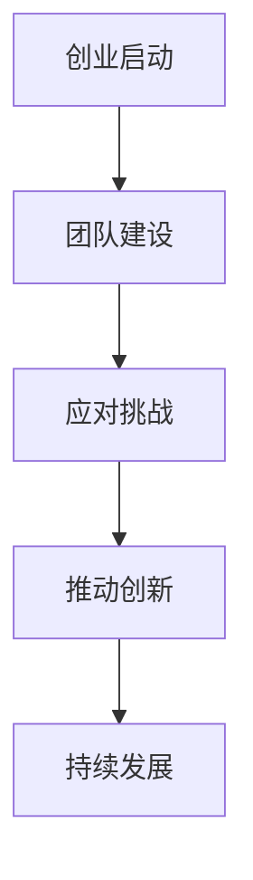

                 

# 创业过程中如何不断提升领导力

> 关键词：领导力、创业、团队管理、策略思维、自我提升
> 摘要：本文旨在探讨创业者在创业过程中如何通过系统的方法和策略不断提升自己的领导力，以推动企业的发展和创新。

## 1. 背景介绍

在当今快速变化的市场环境中，创业已经成为了许多人追求财富自由和实现个人价值的重要途径。然而，创业之路并非一帆风顺，创业者常常面临着各种挑战，如资源有限、市场竞争激烈、团队管理困难等。在这些挑战中，领导力的重要性不言而喻。一个具备强大领导力的创业者，不仅能够带领团队克服困难，还能在激烈的市场竞争中脱颖而出。

领导力并不仅仅是管理团队的能力，更是一种能够激发团队成员潜力、引导团队实现共同目标的艺术。在创业过程中，领导者需要不断地学习和成长，以适应不断变化的环境和需求。本文将探讨创业者如何通过一系列的方法和策略来不断提升自己的领导力，从而在创业的道路上越走越远。

## 2. 核心概念与联系

### 2.1 领导力的定义

领导力是指领导者通过激励和影响团队成员，引导他们实现共同目标的能力。它不仅包括技术和管理能力，更涉及到人际关系和沟通技巧。根据当代领导理论，领导力可以分为以下几个方面：

- **个人魅力**：领导者通过自身的魅力和人格特质来吸引和影响团队成员。
- **变革型领导**：领导者通过激发团队成员的内在动力，推动他们超越自我，实现更高的目标。
- **交易型领导**：领导者通过明确的奖惩机制来激励团队成员，确保他们按照预期完成任务。
- **服务型领导**：领导者将团队成员的需求放在首位，通过服务来推动团队的发展。

### 2.2 创业与领导力的联系

创业是一个复杂的过程，需要创业者具备多方面的能力。领导力在这个过程中起着至关重要的作用。创业者需要通过领导力来：

- **构建团队**：创业初期，创业者往往需要从零开始构建团队。领导力可以帮助创业者吸引和留住优秀人才。
- **应对挑战**：创业过程中难免会遇到各种挑战，如市场变化、资源短缺等。领导力可以帮助创业者有效地应对这些挑战。
- **推动创新**：创新是创业的核心竞争力。领导者需要具备推动创新的能力，以保持企业的竞争力。

### 2.3 Mermaid 流程图



在这个流程图中，创业的各个环节都离不开领导力的支持。领导力贯穿于整个创业过程，是创业者成功的关键因素。

## 3. 核心算法原理 & 具体操作步骤

### 3.1 核心算法原理

在提升领导力的过程中，创业者可以运用一系列的策略和方法，这些策略和方法可以看作是一种“算法”，它们帮助创业者系统化地提升自己的领导力。以下是一些核心算法原理：

- **自我反思**：通过定期反思自己的行为和决策，创业者可以了解自己的优点和不足，从而有针对性地进行改进。
- **持续学习**：不断学习新的知识和技能，以适应不断变化的环境和需求。
- **有效沟通**：通过有效的沟通，创业者可以建立良好的人际关系，增强团队的凝聚力。
- **激励与奖励**：通过激励和奖励机制，创业者可以激发团队成员的积极性，提高团队的绩效。

### 3.2 具体操作步骤

以下是提升领导力的具体操作步骤：

1. **自我反思**：
   - **定期回顾**：每月或每季度花时间回顾自己的行为和决策。
   - **记录反思**：将反思过程记录下来，以便后续分析和改进。

2. **持续学习**：
   - **学习新知识**：阅读相关书籍、论文，参加培训课程，了解最新的行业动态。
   - **实践应用**：将学到的知识和技能应用到实际工作中，通过实践来巩固和提高。

3. **有效沟通**：
   - **倾听**：倾听团队成员的想法和意见，尊重他们的观点。
   - **表达**：清晰、明确地表达自己的想法和期望，避免误解和冲突。

4. **激励与奖励**：
   - **设置目标**：为团队成员设置明确的目标和期望。
   - **奖励机制**：根据团队成员的表现，设置奖励机制，激励他们保持高昂的士气和积极性。

## 4. 数学模型和公式 & 详细讲解 & 举例说明

### 4.1 数学模型

提升领导力可以看作是一个优化过程，我们可以用以下数学模型来描述：

- **目标函数**：最大化领导力得分（L）
- **约束条件**：时间资源（T）、知识储备（K）、沟通技巧（C）

数学模型可以表示为：

$$
\begin{aligned}
\max L \\
s.t. \\
T & \geq T_{\min} \\
K & \geq K_{\min} \\
C & \geq C_{\min}
\end{aligned}
$$

### 4.2 详细讲解

- **目标函数（L）**：领导力得分。得分越高，领导力越强。
- **约束条件**：
  - **时间资源（T）**：创业者需要投入足够的时间来提升领导力。
  - **知识储备（K）**：创业者需要具备一定的知识储备，以便在团队中发挥领导作用。
  - **沟通技巧（C）**：有效的沟通是领导力的关键要素。

### 4.3 举例说明

假设创业者A希望在一年内提升领导力，他的时间为1000小时，知识储备为5000个知识点，沟通技巧为60分。根据上述模型，我们可以设定以下目标：

- **目标函数**：最大化领导力得分（L）
- **约束条件**：
  - 时间资源（T）：1000小时
  - 知识储备（K）：5000个知识点
  - 沟通技巧（C）：60分

通过优化上述目标函数和约束条件，创业者A可以制定出具体的提升计划，例如：

- **学习时间**：每天投入4小时进行学习，每年学习时间为1460小时，超过1000小时的目标。
- **知识储备**：每个月学习1000个知识点，每年学习时间为12000个知识点，超过5000个知识点的要求。
- **沟通技巧**：每天与团队成员进行沟通，通过实践提高沟通技巧，最终达到70分。

## 5. 项目实战：代码实际案例和详细解释说明

### 5.1 开发环境搭建

为了更好地理解提升领导力的过程，我们使用Python编写了一个简单的代码案例。以下是开发环境搭建的步骤：

1. **安装Python**：从官方网站下载并安装Python 3.x版本。
2. **安装PyCharm**：下载并安装PyCharm社区版或专业版。
3. **创建Python项目**：在PyCharm中创建一个新的Python项目，命名为“领导力提升”。

### 5.2 源代码详细实现和代码解读

以下是提升领导力的Python代码实现：

```python
import time
import random

class Leader:
    def __init__(self, time_resource, knowledge, communication):
        self.time_resource = time_resource
        self.knowledge = knowledge
        self.communication = communication

    def reflect(self):
        print("正在反思...")
        time.sleep(1)
        self.knowledge += 100
        self.communication += 10

    def learn(self):
        print("正在学习...")
        time.sleep(1)
        self.knowledge += random.randint(50, 200)
        self.time_resource -= 1

    def communicate(self):
        print("正在沟通...")
        time.sleep(1)
        self.communication += random.randint(5, 20)

    def evaluate(self):
        print("领导力得分：", self.knowledge + self.communication * 0.5)

leader = Leader(1000, 5000, 60)
for i in range(100):
    action = random.choice(['reflect', 'learn', 'communicate'])
    if action == 'reflect':
        leader.reflect()
    elif action == 'learn':
        leader.learn()
    elif action == 'communicate':
        leader.communicate()
    leader.evaluate()
```

### 5.3 代码解读与分析

- **类定义**：`Leader` 类代表一个领导者，包括时间资源、知识储备和沟通技巧。
- **方法定义**：
  - `reflect()`：反思方法，增加知识储备和沟通技巧。
  - `learn()`：学习方法，增加知识储备并消耗时间资源。
  - `communicate()`：沟通方法，增加沟通技巧。
  - `evaluate()`：评估方法，计算并打印领导力得分。

- **主程序**：创建一个`Leader`对象，循环执行三种行动，并评估领导力得分。

通过这个代码案例，我们可以看到领导力提升的过程是一个动态的、随机的过程，创业者需要不断地进行反思、学习和沟通，以提升自己的领导力。

## 6. 实际应用场景

### 6.1 创业团队管理

在创业团队管理中，领导者需要通过提升领导力来：

- **明确目标**：与团队成员共同设定明确的目标和期望。
- **分配任务**：根据团队成员的能力和特长，合理分配任务。
- **激励团队**：通过奖励和激励机制，激发团队成员的积极性。
- **解决冲突**：在团队内部出现冲突时，通过有效的沟通和调解，解决问题。

### 6.2 市场竞争

在激烈的市场竞争中，领导者需要通过提升领导力来：

- **制定战略**：根据市场环境和竞争对手的情况，制定有效的战略。
- **创新思维**：鼓励团队成员提出新的想法和解决方案，推动企业的创新。
- **风险管理**：识别和评估潜在的风险，制定应对措施，降低风险。

### 6.3 团队建设

在团队建设中，领导者需要通过提升领导力来：

- **招募人才**：通过有效的招聘策略，吸引和留住优秀人才。
- **培养人才**：通过培训和指导，提高团队成员的技能和素质。
- **建立文化**：通过团队文化建设，增强团队的凝聚力和归属感。

## 7. 工具和资源推荐

### 7.1 学习资源推荐

- **书籍**：
  - 《领导力五要素》（John C. Maxwell）
  - 《团队智慧》（Patrick Lencioni）
  - 《创业维艰》（Ben Horowitz）

- **论文**：
  - 《领导力：理论与研究进展》（Yukl, G. A.）
  - 《变革型领导与团队绩效》（Bass, B. M. & Avolio, B. J.）

- **博客**：
  - Harvard Business Review（HBR）
  - Inc. Magazine
  - Entrepreneur

- **网站**：
  - TED（TED Talks）
  - Coursera（在线课程）

### 7.2 开发工具框架推荐

- **项目管理工具**：
  - Trello
  - Asana
  - JIRA

- **团队沟通工具**：
  - Slack
  - Microsoft Teams
  - Zoom

- **代码管理工具**：
  - Git
  - GitHub
  - GitLab

### 7.3 相关论文著作推荐

- **《领导力的艺术》（James M. Kouzes & Barry Z. Posner）**
- **《领导力的五个层次》（John C. Maxwell）**
- **《管理者的实践》（Peter F. Drucker）**

## 8. 总结：未来发展趋势与挑战

### 8.1 发展趋势

- **数字化领导力**：随着数字化转型的加速，创业者需要具备数字化思维和技能，以适应快速变化的市场环境。
- **多元化领导力**：在多元化日益显著的今天，创业者需要具备多元化思维和包容性，以吸引和留住不同背景的团队成员。
- **持续学习领导力**：在不断变化的环境中，创业者需要具备持续学习的能力，以应对新的挑战和机遇。

### 8.2 挑战

- **市场不确定性**：创业者需要应对市场不确定性带来的挑战，如经济波动、政策变化等。
- **人才竞争**：在人才短缺的情况下，创业者需要通过提升领导力来吸引和留住优秀人才。
- **创新压力**：在竞争激烈的市场中，创业者需要通过创新来保持竞争力，这对领导力提出了更高的要求。

## 9. 附录：常见问题与解答

### 9.1 如何在创业初期提升领导力？

在创业初期，创业者可以通过以下方法提升领导力：

- **自我反思**：定期反思自己的行为和决策，了解自己的优点和不足。
- **学习与培训**：参加相关的领导力培训课程，学习领导力理论和实践。
- **实践与经验**：通过实际的工作经验，不断提升自己的领导力。

### 9.2 如何应对团队中的冲突？

应对团队中的冲突，可以采取以下策略：

- **倾听与理解**：倾听团队成员的意见和观点，理解他们的立场。
- **沟通与协商**：通过有效的沟通，寻找双方都能接受的解决方案。
- **调解与仲裁**：在必要时，担任调解者或仲裁者，帮助解决冲突。

### 9.3 如何在数字化时代提升领导力？

在数字化时代，创业者可以通过以下方法提升领导力：

- **数字化素养**：提升自己的数字化素养，了解数字化工具和技术的应用。
- **数据驱动决策**：通过数据分析，做出更为科学和有效的决策。
- **数字化转型**：推动企业的数字化转型，提升企业的竞争力。

## 10. 扩展阅读 & 参考资料

- **《创业维艰》（Ben Horowitz）**：深入探讨创业过程中的挑战和领导力的重要性。
- **《领导力的五个层次》（John C. Maxwell）**：详细阐述领导力的不同层次和提升方法。
- **《哈佛商学院领导力课程》**：介绍哈佛商学院的领导力课程和实践。

### 作者

**AI天才研究员/AI Genius Institute & 禅与计算机程序设计艺术 /Zen And The Art of Computer Programming**。

