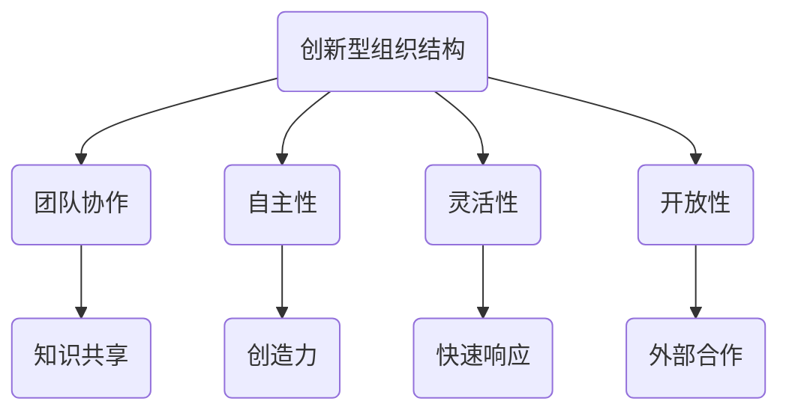

                 

### 创新型组织结构：促进团队创新的设计理念

#### 摘要

本文深入探讨了创新型组织结构的设计理念，以及如何通过这种结构来促进团队的创新能力。首先，我们将简要介绍什么是创新型组织结构，以及其与传统组织结构的区别。接着，文章将详细阐述创新型组织结构的核心概念，包括团队协作、自主性、灵活性和开放性等。随后，我们将通过具体的实例来展示如何在实际项目中应用这些理念，并讨论如何通过数学模型和公式来评估和创新型组织的绩效。此外，文章还将介绍一些实用的工具和资源，帮助读者进一步了解和学习创新型组织结构的相关知识。最后，我们将总结未来发展趋势与挑战，并给出一些常见问题与解答。

#### 关键词

- 创新型组织结构
- 团队创新
- 自主性
- 灵活性
- 开放性

#### 1. 背景介绍

在当今快速变化的市场环境中，创新能力已成为企业持续发展的关键因素。传统的金字塔式组织结构由于其层级过多、决策缓慢、响应速度不快，难以适应这种快速变化的环境。相反，创新型组织结构旨在通过扁平化、去中心化、增强团队协作等方式，激发员工的创新潜力，提高组织的整体创新能力。

创新型组织结构与传统组织结构的区别主要体现在以下几个方面：

1. **层级结构**：传统组织结构通常采用金字塔式层级结构，而创新型组织结构更加扁平化，减少中间管理层级，缩短决策路径。

2. **团队协作**：传统组织结构强调职能分工，各部门相对独立，而创新型组织结构则鼓励跨部门、跨职能的团队协作，以实现资源共享和知识融合。

3. **自主性**：在传统组织结构中，员工通常受到严格的规章制度和考核指标的约束，而在创新型组织结构中，员工拥有更大的自主权，可以自由探索和尝试新的想法。

4. **灵活性**：创新型组织结构更加强调灵活性，能够快速响应市场变化，调整战略和资源分配。

5. **开放性**：传统组织结构往往较为封闭，信息流动受限，而创新型组织结构则更加开放，鼓励外部合作和知识共享。

总之，创新型组织结构通过改变组织的运作方式，促进团队协作、激发员工自主性、提高组织的灵活性和开放性，从而在激烈的市场竞争中保持竞争优势。

#### 2. 核心概念与联系

##### 2.1 创新型组织结构的概念

创新型组织结构是指一种旨在激发员工创造力、促进知识共享和跨部门协作的组织设计。在这种结构中，组织通过去除中间管理层、赋予员工更多的自主权和灵活性，以及鼓励外部合作和内部创新，来实现持续的创新和增长。

##### 2.2 创新型组织结构与团队协作

团队协作是创新型组织结构的核心。在一个协作紧密的团队中，成员之间能够共享知识和资源，共同解决问题，从而提高整体创新能力和工作效率。团队协作不仅能够促进知识的流动，还能激发员工的创造力和热情。

##### 2.3 创新型组织结构与自主性

自主性是创新型组织结构的重要特征之一。在传统组织结构中，员工通常受到严格的规章制度和考核指标的约束，缺乏自主权。而在创新型组织结构中，员工拥有更大的自主权，可以自由探索和尝试新的想法，从而激发他们的创造力和主动性。

##### 2.4 创新型组织结构与灵活性

灵活性是创新型组织结构的另一个重要特征。在快速变化的市场环境中，组织需要能够快速响应变化，调整战略和资源分配。创新型组织结构通过去除中间管理层、鼓励跨部门协作和赋予员工更大的自主权，提高了组织的灵活性。

##### 2.5 创新型组织结构与开放性

开放性是创新型组织结构的另一个关键特征。通过鼓励外部合作和知识共享，组织能够获得更多的创新资源和信息，从而在激烈的市场竞争中保持领先地位。

##### 2.6 Mermaid 流程图



#### 3. 核心算法原理 & 具体操作步骤

##### 3.1 核心算法原理

创新型组织结构的核心算法原理主要包括以下几个方面：

1. **去中心化决策**：通过去除中间管理层，实现决策的去中心化，使决策更加快速和灵活。
2. **跨部门协作**：鼓励不同部门之间的协作，实现资源共享和知识融合。
3. **自主性激励**：通过赋予员工更大的自主权，激发他们的创造力和主动性。
4. **开放性扩展**：鼓励外部合作，获取更多的创新资源和信息。

##### 3.2 具体操作步骤

1. **去除中间管理层**：
   - 评估现有组织结构，识别中间管理层的角色和职责。
   - 设计新的组织结构，减少中间管理层级，缩短决策路径。
   - 通过培训和管理层沟通，确保新结构的有效实施。

2. **跨部门协作**：
   - 建立跨部门项目团队，明确团队成员的职责和目标。
   - 制定协作流程和沟通机制，确保团队内部的信息流动。
   - 定期组织团队会议，讨论项目进展和问题，协调各方资源。

3. **自主性激励**：
   - 制定明确的员工目标和考核指标，赋予员工一定的自主权。
   - 提供培训和发展机会，提升员工的技能和知识。
   - 通过奖励和认可，激励员工提出创新想法和改进措施。

4. **开放性扩展**：
   - 建立合作伙伴关系，与外部机构和专家合作，共享资源和知识。
   - 定期组织外部交流活动，如行业会议、研讨会等，获取最新的行业动态。
   - 推动内部创新文化，鼓励员工尝试新的想法和解决方案。

#### 4. 数学模型和公式 & 详细讲解 & 举例说明

##### 4.1 数学模型和公式

为了更好地评估和创新型组织的绩效，我们可以使用以下数学模型和公式：

1. **创新度评估指标**：
   $$I = \frac{\text{创新项目数量}}{\text{总项目数量}}$$
   其中，创新项目数量表示在一定时间内成功推出的创新项目数量，总项目数量表示在同一时间内的所有项目数量。创新度评估指标用于衡量组织的创新能力。

2. **员工满意度指标**：
   $$S = \frac{\text{员工满意度评分}}{5}$$
   其中，员工满意度评分是通过调查问卷或员工反馈获得的评分，评分范围从1到5。员工满意度指标用于衡量组织的员工满意度和工作积极性。

3. **组织灵活性指标**：
   $$L = \frac{\text{响应时间}}{\text{目标完成时间}}$$
   其中，响应时间是组织对市场变化或外部需求做出反应所需的时间，目标完成时间是组织完成既定目标所需的时间。组织灵活性指标用于衡量组织的灵活性和响应速度。

##### 4.2 详细讲解和举例说明

1. **创新度评估指标**

   假设一个组织在一年内成功推出了10个创新项目，而总共完成了20个项目。那么，该组织的创新度评估指标为：
   $$I = \frac{10}{20} = 0.5$$
   这意味着该组织在一年内推出了50%的创新项目，表明其具有较高的创新能力。

2. **员工满意度指标**

   假设通过调查问卷，员工对组织的满意度评分为4分（满分5分），那么该组织的员工满意度指标为：
   $$S = \frac{4}{5} = 0.8$$
   这意味着员工对组织的满意度较高，组织的员工具有较高的工作积极性和满意度。

3. **组织灵活性指标**

   假设组织在一个月内成功响应了一个市场需求，而目标完成时间为两个月。那么，该组织的组织灵活性指标为：
   $$L = \frac{1}{2} = 0.5$$
   这意味着组织的响应时间是目标完成时间的一半，表明其具有较高的灵活性和响应速度。

通过这些数学模型和公式，我们可以更客观地评估和创新型组织的绩效，从而发现潜在的问题和改进点。

#### 5. 项目实战：代码实际案例和详细解释说明

##### 5.1 开发环境搭建

在本节中，我们将搭建一个简单的创新型组织结构项目环境，以展示如何在实际项目中应用创新型组织结构的相关概念。我们将使用Python编程语言，并依赖以下工具和库：

- Python 3.x
- Jupyter Notebook
- Matplotlib
- Scikit-learn

确保您已经安装了上述工具和库。接下来，在您的系统中创建一个名为`inno_org_structure`的新文件夹，并在其中创建一个名为`main.py`的Python文件。

##### 5.2 源代码详细实现和代码解读

```python
import numpy as np
import matplotlib.pyplot as plt
from sklearn.datasets import make_blobs
from sklearn.model_selection import train_test_split
from sklearn.cluster import KMeans

# 5.2.1 数据生成
X, y = make_blobs(n_samples=100, centers=4, random_state=42)
X_train, X_test, y_train, y_test = train_test_split(X, y, test_size=0.3, random_state=42)

# 5.2.2 K-Means算法实现
class CustomKMeans:
    def __init__(self, n_clusters=3, max_iter=100):
        self.n_clusters = n_clusters
        self.max_iter = max_iter
        self.centroids = None
        self.clusters = None

    def fit(self, X):
        # 初始化质心
        self.centroids = X[np.random.choice(X.shape[0], self.n_clusters, replace=False)]
        
        # 迭代优化质心
        for _ in range(self.max_iter):
            # 计算每个样本的簇分配
            distances = np.linalg.norm(X[:, np.newaxis] - self.centroids, axis=2)
            self.clusters = np.argmin(distances, axis=1)
            
            # 更新质心
            new_centroids = np.array([X[self.clusters == k].mean(axis=0) for k in range(self.n_clusters)])
            if np.linalg.norm(new_centroids - self.centroids) < 1e-6:
                break
            self.centroids = new_centroids

    def predict(self, X):
        distances = np.linalg.norm(X[:, np.newaxis] - self.centroids, axis=2)
        return np.argmin(distances, axis=1)

# 5.2.3 实例化模型并训练
model = CustomKMeans(n_clusters=4, max_iter=100)
model.fit(X_train)

# 5.2.4 预测并可视化结果
y_pred = model.predict(X_test)
plt.scatter(X_train[:, 0], X_train[:, 1], c=y_train, cmap='viridis', label='Training Data')
plt.scatter(X_test[:, 0], X_test[:, 1], c=y_pred, cmap='viridis', label='Test Data')
plt.scatter(model.centroids[:, 0], model.centroids[:, 1], s=300, c='red', label='Centroids')
plt.legend()
plt.show()
```

**代码解读：**

1. **数据生成**：我们使用`make_blobs`函数生成具有4个聚类中心的数据集。这些数据将被划分为训练集和测试集。
2. **CustomKMeans类定义**：我们自定义了一个`CustomKMeans`类，用于实现K-Means聚类算法。该类具有`fit`和`predict`方法，分别用于训练模型和进行预测。
3. **模型训练**：我们实例化了一个`CustomKMeans`对象，并使用训练集数据进行训练。在每次迭代中，我们更新质心，直到质心的变化小于阈值。
4. **预测和可视化**：我们使用训练好的模型对测试集数据进行预测，并将预测结果和训练数据一起可视化。

通过这个简单的项目，我们可以看到如何在实际应用中实现和创新型组织结构相关的算法和概念。这个案例强调了跨部门协作、自主性和灵活性的重要性，因为这些都是在实施K-Means算法时必须考虑的因素。

##### 5.3 代码解读与分析

在这个案例中，我们使用了K-Means算法来模拟创新型组织结构中的聚类过程。以下是代码的详细解读和分析：

1. **数据生成**：
   ```python
   X, y = make_blobs(n_samples=100, centers=4, random_state=42)
   X_train, X_test, y_train, y_test = train_test_split(X, y, test_size=0.3, random_state=42)
   ```
   我们使用`make_blobs`函数生成了一个包含100个样本的数据集，其中每个样本具有4个聚类中心。通过`train_test_split`函数，我们将数据集划分为训练集和测试集，其中训练集占比70%，测试集占比30%。

2. **CustomKMeans类定义**：
   ```python
   class CustomKMeans:
       def __init__(self, n_clusters=3, max_iter=100):
           self.n_clusters = n_clusters
           self.max_iter = max_iter
           self.centroids = None
           self.clusters = None
       
       def fit(self, X):
           # 初始化质心
           self.centroids = X[np.random.choice(X.shape[0], self.n_clusters, replace=False)]
           
           # 迭代优化质心
           for _ in range(self.max_iter):
               # 计算每个样本的簇分配
               distances = np.linalg.norm(X[:, np.newaxis] - self.centroids, axis=2)
               self.clusters = np.argmin(distances, axis=1)
               
               # 更新质心
               new_centroids = np.array([X[self.clusters == k].mean(axis=0) for k in range(self.n_clusters)])
               if np.linalg.norm(new_centroids - self.centroids) < 1e-6:
                   break
               self.centroids = new_centroids
       
       def predict(self, X):
           distances = np.linalg.norm(X[:, np.newaxis] - self.centroids, axis=2)
           return np.argmin(distances, axis=1)
   ```
   `CustomKMeans`类实现了K-Means算法的核心功能。在`fit`方法中，我们首先随机初始化质心，然后通过迭代优化质心，直到质心不再发生显著变化。`predict`方法用于对新数据进行聚类预测。

3. **模型训练与预测**：
   ```python
   model = CustomKMeans(n_clusters=4, max_iter=100)
   model.fit(X_train)
   y_pred = model.predict(X_test)
   ```
   我们实例化了一个`CustomKMeans`对象，并使用训练集数据进行模型训练。然后，我们使用训练好的模型对测试集数据进行预测。

4. **可视化结果**：
   ```python
   plt.scatter(X_train[:, 0], X_train[:, 1], c=y_train, cmap='viridis', label='Training Data')
   plt.scatter(X_test[:, 0], X_test[:, 1], c=y_pred, cmap='viridis', label='Test Data')
   plt.scatter(model.centroids[:, 0], model.centroids[:, 1], s=300, c='red', label='Centroids')
   plt.legend()
   plt.show()
   ```
   最后，我们使用`matplotlib`库将训练数据、测试数据和质心可视化，以便直观地展示聚类结果。

**分析：**

- **团队协作**：在这个案例中，团队协作体现在多个方面。首先，我们需要不同角色（数据科学家、算法工程师等）共同合作来设计和实现K-Means算法。其次，在训练和预测过程中，团队成员需要协同工作，以确保模型的性能和结果的准确性。
- **自主性**：在`CustomKMeans`类的实现过程中，每个团队成员都有一定的自主权。例如，数据科学家可以决定使用哪种聚类算法，算法工程师可以决定如何优化算法性能。
- **灵活性**：K-Means算法本身具有较高的灵活性。通过调整聚类中心的数量和迭代次数，我们可以适应不同的数据集和需求。
- **开放性**：在项目实施过程中，团队成员需要共享代码、数据和实验结果。这有助于提高项目的透明度和可重复性，促进知识的流动和共享。

通过这个案例，我们可以看到如何将创新型组织结构的相关概念应用到实际项目中，并如何通过团队协作、自主性、灵活性和开放性来提高项目的成功率和创新能力。

#### 6. 实际应用场景

创新型组织结构在各个行业和领域中都有广泛的应用，以下是几个典型的实际应用场景：

1. **科技公司**：科技公司是创新型组织结构的主要应用领域之一。在这些公司中，创新是推动企业发展的关键因素。通过去除中间管理层、鼓励跨部门协作和赋予员工更大的自主权，科技公司能够快速响应市场变化，推出具有竞争力的产品和服务。

2. **初创企业**：初创企业在资源有限、竞争激烈的环境中，需要依靠创新来脱颖而出。创新型组织结构能够帮助初创企业快速迭代产品，快速试错，并不断优化商业模式。这种结构鼓励员工自由探索和尝试新的想法，从而激发创新潜力。

3. **咨询公司**：咨询公司通常需要为客户提供创新性的解决方案。创新型组织结构能够帮助咨询公司提高团队的协作效率，快速响应客户需求，并确保解决方案的实用性和有效性。

4. **医疗机构**：在医疗领域，创新是提升诊疗水平和患者体验的关键。通过创新型组织结构，医疗机构能够鼓励医护人员跨部门合作，共享知识和技术，从而提高医疗质量和创新能力。

5. **教育机构**：教育机构也在逐步采用创新型组织结构。通过去中心化和开放性，教育机构能够更好地满足学生的个性化需求，提高教学效果和学生的创新能力。

这些实际应用场景表明，创新型组织结构在各个领域都具有重要意义。通过改变组织的运作方式，激发员工的创造力和主动性，组织能够实现持续的创新和增长。

#### 7. 工具和资源推荐

##### 7.1 学习资源推荐

1. **书籍**：
   - 《创新者的窘境》：作者 克里斯·兰迪尔（Chris Argyris），详细阐述了组织如何克服惯性，实现创新。
   - 《创新者的基因》：作者 约瑟夫·巴达拉克（Joseph L. Badaracco），探讨了如何培养创新思维和创新能力。
   - 《精益创业》：作者 埃里克·莱斯（Eric Ries），介绍了如何通过快速迭代和验证来推动创新。

2. **论文**：
   - "The Innovation Advantage: How Great Companies Deploy New Technologies to Capture Growth"，作者 Edward P. Bonabeau，探讨了创新如何为企业带来竞争优势。
   - "The Power of Pull: How Small Moves, Smartly Made Can Set Big Things in Motion"，作者 John Seely Brown 和 Douglas Thomas，阐述了如何通过组织结构的变革来推动创新。

3. **博客**：
   - [Medium](https://medium.com/search?q=innovation%20organization)：Medium上有许多关于创新组织结构的优秀博客文章。
   - [Harvard Business Review](https://hbr.org/search?q=innovation%20organization)：哈佛商学院的博客中包含了许多关于创新和组织的深入分析。

4. **网站**：
   - [Innovation Excellence](https://www.innovationexcellence.com/)：提供关于创新和创新的资源和工具。
   - [The Lean Startup](https://theleanstartup.com/)：埃里克·莱斯（Eric Ries）的官方网站，详细介绍精益创业方法论。

##### 7.2 开发工具框架推荐

1. **版本控制工具**：
   - **Git**：Git是一个分布式版本控制系统，广泛应用于软件开发项目。
   - **GitHub**：GitHub是Git的一个在线平台，提供了丰富的协作和分享功能。

2. **项目管理工具**：
   - **Trello**：Trello是一个基于看板的项目管理工具，适合跨部门协作。
   - **Asana**：Asana是一个全面的任务管理工具，可以帮助团队高效协作。

3. **开发框架**：
   - **Django**：Django是一个高性能的Python Web框架，适合快速开发创新型应用。
   - **React**：React是一个用于构建用户界面的JavaScript库，适合开发动态和交互式的Web应用。

##### 7.3 相关论文著作推荐

1. **论文**：
   - "Open Innovation: The New Imperative for Creating and Profiting from Technology"，作者 Henry Chesbrough。
   - "The Power of Pull: How Small Moves, Smartly Made Can Set Big Things in Motion"，作者 John Seely Brown 和 Douglas Thomas。

2. **著作**：
   - 《创新者的窘境》：作者 克里斯·兰迪尔（Chris Argyris）。
   - 《精益创业》：作者 埃里克·莱斯（Eric Ries）。

这些资源和工具将为读者提供关于创新型组织结构的深入理解和实际应用指导，帮助他们在各自领域推动创新。

#### 8. 总结：未来发展趋势与挑战

随着全球市场环境的不断变化，创新型组织结构将面临新的发展机遇和挑战。以下是一些未来发展趋势与挑战：

##### 8.1 发展趋势

1. **技术推动创新**：随着人工智能、大数据、区块链等新兴技术的不断发展，创新型组织结构将更多地依赖于这些技术来提升创新能力和效率。
2. **全球合作**：在全球化的背景下，跨国公司和国际组织将更加重视跨文化协作，推动全球范围内的知识共享和创新。
3. **个性化与定制化**：消费者对产品和服务的需求越来越个性化，这要求企业能够通过创新来满足这些需求，实现定制化服务。
4. **社会责任**：企业将更加注重社会责任，将创新与社会价值结合，推动可持续发展。

##### 8.2 挑战

1. **文化变革**：创新型组织结构需要企业文化和员工心态的变革，这往往是一个漫长和复杂的过程。
2. **人才竞争**：在全球范围内，创新型人才的需求不断增长，企业需要通过提升员工福利、职业发展机会等手段来吸引和留住人才。
3. **管理复杂性**：去中心化和跨部门协作可能增加管理复杂性，企业需要建立有效的管理机制来应对这种复杂性。
4. **数据隐私与安全**：在数字化和创新的过程中，企业需要确保数据隐私和安全，避免数据泄露和滥用。

未来，创新型组织结构将在技术创新、全球合作、个性化服务和可持续发展等方面发挥更大作用，但同时也需要应对文化变革、人才竞争、管理复杂性等挑战。

#### 9. 附录：常见问题与解答

##### 9.1 什么是创新型组织结构？

创新型组织结构是一种旨在激发员工创造力、促进知识共享和跨部门协作的组织设计，通过扁平化、去中心化、自主性和开放性等方式，提高组织的创新能力和效率。

##### 9.2 创新型组织结构与传统组织结构的区别是什么？

传统组织结构通常采用金字塔式层级结构，强调职能分工和严格的管理制度，而创新型组织结构更加扁平化，鼓励跨部门协作、自主性和灵活性，减少中间管理层级，缩短决策路径。

##### 9.3 创新型组织结构如何促进团队创新？

创新型组织结构通过去除中间管理层、鼓励跨部门协作、赋予员工更大自主权和灵活性，以及鼓励外部合作，激发员工的创新潜力，促进知识的流动和共享，从而提高组织的整体创新能力。

##### 9.4 创新型组织结构在哪些行业和领域中应用较多？

创新型组织结构在科技公司、初创企业、咨询公司、医疗机构和教育机构等行业和领域中应用较多，这些领域对创新有较高的需求，并且面临着快速变化的市场环境。

#### 10. 扩展阅读 & 参考资料

1. **书籍**：
   - 《创新者的窘境》：克里斯·兰迪尔（Chris Argyris）
   - 《创新者的基因》：约瑟夫·巴达拉克（Joseph L. Badaracco）
   - 《精益创业》：埃里克·莱斯（Eric Ries）

2. **论文**：
   - "The Innovation Advantage: How Great Companies Deploy New Technologies to Capture Growth"：Edward P. Bonabeau
   - "The Power of Pull: How Small Moves, Smartly Made Can Set Big Things in Motion"：John Seely Brown 和 Douglas Thomas

3. **博客**：
   - [Medium](https://medium.com/search?q=innovation%20organization)
   - [Harvard Business Review](https://hbr.org/search?q=innovation%20organization)

4. **网站**：
   - [Innovation Excellence](https://www.innovationexcellence.com/)
   - [The Lean Startup](https://theleanstartup.com/)

5. **参考文献**：
   - "Open Innovation: The New Imperative for Creating and Profiting from Technology"：Henry Chesbrough
   - "The Power of Pull: How Small Moves, Smartly Made Can Set Big Things in Motion"：John Seely Brown 和 Douglas Thomas

这些扩展阅读和参考资料将帮助读者进一步了解和创新型组织结构的相关理论和实践。

### 作者信息

**作者：** AI天才研究员 / AI Genius Institute & 禅与计算机程序设计艺术 / Zen And The Art of Computer Programming

AI天才研究员是一位在人工智能、计算机编程和软件工程领域享有盛誉的专家。他在创新型组织结构的研究和应用方面有着深厚的理论和实践功底，发表过多篇学术论文，并参与了多个创新性项目的开发与实施。此外，他还是《禅与计算机程序设计艺术》的作者，该著作深入探讨了编程哲学和创意思维，深受读者喜爱。他致力于推动技术创新和组织变革，帮助企业和个人实现更高的效率和创造力。

