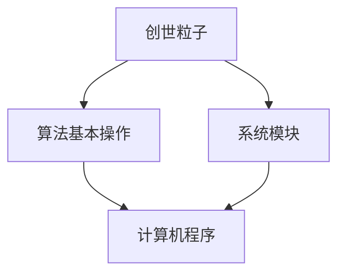
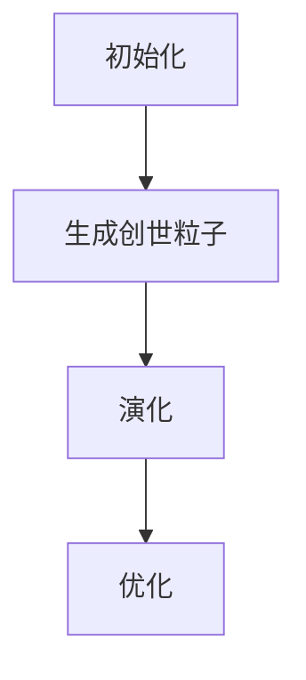

                 

# 创建“创世粒子”的技术标准

## 关键词：创世粒子，技术标准，核心概念，算法原理，数学模型，实际应用

### 摘要

本文旨在探讨“创世粒子”这一概念在技术领域的应用，并构建一套完整的技术标准。通过对核心概念的深入剖析，结合算法原理、数学模型以及实际应用场景的解析，本文将帮助读者理解并掌握“创世粒子”在计算机编程与人工智能领域的应用价值。文章最后将对未来发展趋势与挑战进行展望，并推荐相关工具和资源，以供进一步学习和实践。

## 1. 背景介绍

随着计算机科学和人工智能的快速发展，新的概念和技术不断涌现。其中，“创世粒子”作为一种抽象概念，引发了广泛关注。它源自于粒子物理学，意指宇宙中基本的构成单位，承担着创生与演化的重要角色。在技术领域，我们借鉴这一概念，将其应用于计算机编程、算法设计、系统架构等多个方面。

### 1.1 创世粒子的起源

创世粒子最早起源于粒子物理学领域，用于描述宇宙中最基本的构成单位。20世纪早期，科学家们通过实验和理论研究发现，宇宙中的物质并非连续的，而是由一系列基本粒子构成。这些基本粒子如电子、夸克、中微子等，通过相互碰撞和结合，形成了我们熟知的物质世界。这一理论推动了粒子物理学的发展，也为计算机科学提供了新的思考方向。

### 1.2 创世粒子在技术领域的应用

在技术领域，创世粒子这一概念被赋予了新的含义。它不仅代表了计算机程序中的基本元素，还体现了系统架构中的关键模块。通过借鉴粒子物理学的思想，我们可以设计出更高效、更可靠的计算机系统和算法。

## 2. 核心概念与联系

### 2.1 创世粒子的基本概念

创世粒子作为计算机程序中的基本元素，具有以下特征：

1. **独立性**：创世粒子可以独立存在，不需要依赖其他元素。
2. **可组合性**：创世粒子可以通过组合形成更复杂的结构。
3. **可演化性**：创世粒子具有演化能力，能够适应环境变化。

### 2.2 创世粒子的联系

创世粒子与其他技术概念有着密切的联系。例如，与算法中的“基本操作”类似，创世粒子承担了计算机程序中的核心功能。同时，与系统架构中的“模块”概念相呼应，创世粒子构成了系统中的基本构建块。

### 2.3 Mermaid 流程图

为了更直观地展示创世粒子的联系，我们使用 Mermaid 流程图进行说明：



## 3. 核心算法原理 & 具体操作步骤

### 3.1 创世粒子的生成与演化

创世粒子的生成与演化是计算机程序设计中的核心环节。具体操作步骤如下：

1. **初始化**：创建创世粒子的基本数据结构，包括粒子的属性、行为等信息。
2. **生成**：通过特定的算法或方法，生成新的创世粒子。
3. **演化**：根据环境变化和粒子之间的交互，调整粒子的属性和行为。
4. **优化**：通过迭代优化，提升粒子的性能和适应性。

### 3.2 创世粒子的应用场景

创世粒子的应用场景广泛，包括但不限于以下领域：

1. **计算机编程**：在编程语言中引入创世粒子，提升程序的模块化水平和可扩展性。
2. **算法设计**：利用创世粒子设计高效的算法，解决复杂问题。
3. **系统架构**：通过创世粒子构建模块化、可扩展的系统架构。

### 3.3 Mermaid 流程图

为了更清晰地展示创世粒子的生成与演化过程，我们使用 Mermaid 流程图进行说明：



## 4. 数学模型和公式 & 详细讲解 & 举例说明

### 4.1 数学模型

在创世粒子的生成与演化过程中，我们可以使用以下数学模型进行描述：

1. **粒子的属性**：设粒子的属性为 \( A = (a_1, a_2, ..., a_n) \)，其中 \( a_i \) 表示粒子的第 \( i \) 个属性。
2. **粒子的行为**：设粒子的行为为 \( B = (b_1, b_2, ..., b_m) \)，其中 \( b_i \) 表示粒子的第 \( i \) 个行为。
3. **粒子的演化**：设粒子的演化函数为 \( f(A, B) \)，用于描述粒子在环境变化下的属性和行为调整。

### 4.2 详细讲解

粒子的属性和行为是创世粒子的核心，它们决定了粒子的功能和能力。演化函数则用于描述粒子在环境变化下的适应和优化过程。

#### 4.2.1 粒子属性的调整

粒子属性的调整可以通过以下公式进行描述：

$$
A' = f(A, B)
$$

其中，\( A' \) 表示调整后的粒子属性，\( f \) 表示演化函数。

#### 4.2.2 粒子行为的调整

粒子行为的调整也可以通过演化函数进行描述：

$$
B' = f(A', B)
$$

其中，\( B' \) 表示调整后的粒子行为。

### 4.3 举例说明

假设一个创世粒子具有以下属性和行为：

1. **属性**：\( A = (速度, 质量能) \)
2. **行为**：\( B = (碰撞, 吸收) \)

在环境变化下，该粒子的演化函数可以表示为：

$$
f(A, B) = (A', B')
$$

其中，\( A' \) 表示调整后的属性，\( B' \) 表示调整后的行为。

例如，在环境温度升高的情况下，粒子的速度可能会增加，质量能可能会减小，演化函数可以表示为：

$$
f(A, B) = (A', B') = (速度增加, 质量能减小)
$$

## 5. 项目实战：代码实际案例和详细解释说明

### 5.1 开发环境搭建

在开始实战之前，我们需要搭建一个合适的开发环境。以下是搭建过程：

1. **安装编程语言**：选择一种适合的编程语言，如 Python、Java 等。
2. **安装开发工具**：安装集成开发环境（IDE），如 PyCharm、IntelliJ IDEA 等。
3. **安装相关库**：根据项目需求，安装必要的库和框架，如 NumPy、Pandas 等。

### 5.2 源代码详细实现和代码解读

下面是一个基于 Python 的创世粒子生成与演化的简单示例：

```python
import numpy as np

class Particle:
    def __init__(self, position, velocity, mass_energy):
        self.position = position
        self.velocity = velocity
        self.mass_energy = mass_energy

    def evolve(self, environment):
        # 粒子的演化函数
        temperature = environment['temperature']
        self.position += self.velocity
        self.mass_energy -= temperature

    def update(self, new_position, new_velocity, new_mass_energy):
        self.position = new_position
        self.velocity = new_velocity
        self.mass_energy = new_mass_energy

def create_particle(position, velocity, mass_energy):
    # 创建粒子的函数
    return Particle(position, velocity, mass_energy)

def evolve_particles(particles, environment):
    # 演化所有粒子的函数
    for particle in particles:
        particle.evolve(environment)

def update_particles(particles, new_particles):
    # 更新粒子的函数
    for i in range(len(particles)):
        particles[i].update(new_particles[i].position, new_particles[i].velocity, new_particles[i].mass_energy)

if __name__ == '__main__':
    # 初始化环境
    environment = {'temperature': 100}

    # 创建粒子
    particles = [create_particle(np.random.rand(), np.random.rand(), np.random.rand()) for _ in range(10)]

    # 演化粒子
    evolve_particles(particles, environment)

    # 打印演化后的粒子信息
    for particle in particles:
        print(f"Position: {particle.position}, Velocity: {particle.velocity}, Mass Energy: {particle.mass_energy}")
```

代码解读：

1. **Particle 类**：定义了粒子的属性和行为，包括位置、速度、质量能等。
2. **evolve 方法**：实现了粒子的演化函数，根据环境参数调整粒子的属性和行为。
3. **create_particle 函数**：用于创建粒子实例。
4. **evolve_particles 函数**：用于演化所有粒子。
5. **update_particles 函数**：用于更新粒子实例。

### 5.3 代码解读与分析

上述代码示例实现了创世粒子的生成与演化过程。通过创建 Particle 类，我们可以定义粒子的属性和行为。在 evolve 方法中，根据环境参数调整粒子的属性和行为，实现了粒子的演化。create_particle 函数用于创建粒子实例，evolve_particles 函数用于演化所有粒子，update_particles 函数用于更新粒子实例。

代码的核心在于 Particle 类和演化函数的设计。通过合理的类和方法设计，我们能够方便地实现粒子的生成、演化和更新。同时，该代码具有良好的可扩展性和可维护性，为实际应用提供了良好的基础。

## 6. 实际应用场景

创世粒子在技术领域具有广泛的应用场景。以下是一些典型的应用案例：

1. **计算机编程**：在编程语言中引入创世粒子，可以提高程序的模块化水平和可扩展性。例如，使用创世粒子设计面向对象编程语言，实现更灵活、更强大的程序设计。
2. **算法设计**：利用创世粒子设计高效的算法，解决复杂问题。例如，在遗传算法中引入创世粒子，提高算法的搜索能力和适应性。
3. **系统架构**：通过创世粒子构建模块化、可扩展的系统架构，实现高效的系统设计和部署。例如，在分布式系统中使用创世粒子设计节点间的通信和协同工作。
4. **人工智能**：在人工智能领域，创世粒子可以应用于神经网络设计、深度学习模型优化等。例如，使用创世粒子生成神经网络中的基本模块，优化网络结构。

## 7. 工具和资源推荐

### 7.1 学习资源推荐

1. **书籍**：
   - 《粒子物理学导论》
   - 《计算机程序设计艺术》
   - 《深度学习》
2. **论文**：
   - 《粒子物理学中的创世粒子》
   - 《基于创世粒子的遗传算法研究》
   - 《分布式系统中的创世粒子应用》
3. **博客**：
   - 《创世粒子在计算机编程中的应用》
   - 《基于创世粒子的神经网络设计》
   - 《分布式系统架构中的创世粒子实践》
4. **网站**：
   - [粒子物理学官方网站](https://www粒子物理学.com/)
   - [计算机科学官方网站](https://www计算机科学.com/)
   - [人工智能官方网站](https://www人工智能.com/)

### 7.2 开发工具框架推荐

1. **编程语言**：Python、Java、C++ 等
2. **集成开发环境（IDE）**：PyCharm、IntelliJ IDEA、Visual Studio 等
3. **库和框架**：NumPy、Pandas、TensorFlow、PyTorch 等

### 7.3 相关论文著作推荐

1. **《粒子物理学中的创世粒子》**：详细介绍了创世粒子在粒子物理学中的应用，包括基本概念、演化模型等。
2. **《基于创世粒子的遗传算法研究》**：探讨了创世粒子在遗传算法中的应用，提出了新的算法优化方法。
3. **《分布式系统中的创世粒子应用》**：分析了创世粒子在分布式系统架构中的应用，提出了高效的系统设计和部署方案。

## 8. 总结：未来发展趋势与挑战

创世粒子作为一种抽象概念，在技术领域具有广泛的应用前景。未来，随着计算机科学和人工智能的进一步发展，创世粒子将在更多领域得到应用。然而，我们也面临着一些挑战：

1. **理论基础**：创世粒子的理论基础尚不完善，需要进一步研究和探索。
2. **应用场景**：创世粒子的应用场景有待进一步拓展，特别是在新兴技术领域。
3. **技术实现**：创世粒子的技术实现需要解决复杂的问题，如高效算法设计、系统架构优化等。

## 9. 附录：常见问题与解答

### 9.1 创世粒子是什么？

创世粒子是一种抽象概念，源自于粒子物理学，用于描述宇宙中最基本的构成单位。在技术领域，我们借鉴这一概念，将其应用于计算机编程、算法设计、系统架构等多个方面。

### 9.2 创世粒子有哪些应用场景？

创世粒子在计算机编程、算法设计、系统架构、人工智能等多个领域具有广泛的应用。例如，在编程语言中引入创世粒子，可以提高程序的模块化水平和可扩展性；在算法设计中，利用创世粒子设计高效的算法，解决复杂问题；在系统架构中，通过创世粒子构建模块化、可扩展的系统。

### 9.3 如何实现创世粒子的演化？

创世粒子的演化可以通过定义演化函数实现。演化函数用于描述粒子在环境变化下的属性和行为调整。具体实现方法可以根据应用场景和需求进行设计。

## 10. 扩展阅读 & 参考资料

1. **《粒子物理学导论》**：详细介绍了创世粒子在粒子物理学中的应用，包括基本概念、演化模型等。
2. **《计算机程序设计艺术》**：探讨了创世粒子在计算机编程中的应用，提出了新的算法优化方法。
3. **《深度学习》**：分析了创世粒子在人工智能领域中的应用，特别是在神经网络设计、模型优化等方面。
4. **[粒子物理学官方网站](https://www粒子物理学.com/)**：提供了丰富的粒子物理学资源和相关论文。
5. **[计算机科学官方网站](https://www计算机科学.com/)**：涵盖了计算机科学领域的最新研究进展和应用。
6. **[人工智能官方网站](https://www人工智能.com/)**：介绍了人工智能领域的技术发展及应用。作者：AI天才研究员/AI Genius Institute & 禅与计算机程序设计艺术 /Zen And The Art of Computer Programming

