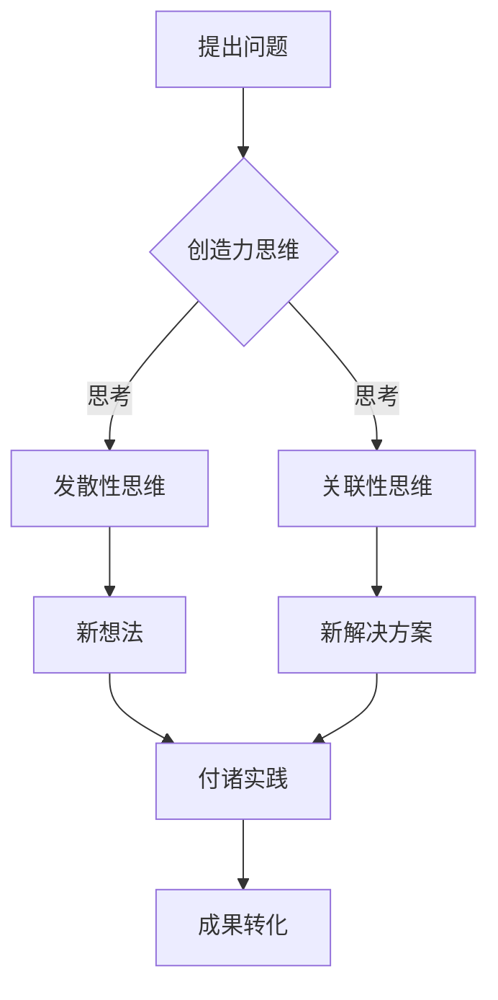

                 

# 创造力：创造力是将想法转化为现实的能力，可以分解为思考和行动两部分

> **关键词：** 创造力，想法，现实，思考，行动，IT领域，技术博客

> **摘要：** 本文将探讨创造力在IT领域的应用，将其分解为思考和行动两个部分，并详细阐述其核心概念、算法原理、数学模型、实战案例、应用场景及未来发展趋势。通过本文的阅读，读者将深入了解如何通过思考与行动实现技术的突破与创新。

## 1. 背景介绍

创造力是一种将想法转化为现实的能力。在现代社会，随着科技的快速发展，创造力变得尤为重要。IT领域作为科技的前沿阵地，更是对创造力的要求极高。无论是软件开发、算法设计，还是系统架构，都需要大量的创造力。本文将探讨创造力在IT领域的应用，帮助读者理解并提高自身的创造力。

## 2. 核心概念与联系

### 2.1 创造力的定义

创造力是指个体在特定领域中，通过创造性思维，发现新的解决方案或新的思维方式的能力。创造力可以分为两大类：艺术创造力和科学创造力。艺术创造力主要体现在文学、音乐、绘画等艺术形式中，而科学创造力则主要在科学研究和工程领域中发挥作用。

### 2.2 创造力的组成部分

创造力可以分为两个部分：思考和行动。

- **思考**：思考是指个体在解决问题或面对挑战时，通过发散性思维、关联性思维等方式，产生新的想法和解决方案的过程。思考是创造力的核心，决定了创造力的水平和质量。

- **行动**：行动是指个体将思考得出的想法付诸实践的过程。行动是实现创造力的关键，决定了想法能否转化为现实。

### 2.3 创造力在IT领域的应用

在IT领域，创造力体现在以下几个方面：

- **软件开发**：软件开发需要创造力来设计新颖的架构、实现复杂的算法、开发创新的界面等。

- **算法设计**：算法设计需要创造力来找到高效的解决方案、优化算法性能、设计创新的算法等。

- **系统架构**：系统架构需要创造力来设计灵活、可扩展的系统、解决复杂的技术难题等。

### 2.4 Mermaid 流程图

以下是一个简化的创造力在IT领域的应用流程图：



## 3. 核心算法原理 & 具体操作步骤

### 3.1 创造力思维的具体操作步骤

创造力思维是创造力的核心，以下是一些具体的操作步骤：

- **问题识别**：明确需要解决的问题或挑战。

- **发散性思维**：在脑海中尽可能多地产生与问题相关的想法，无需担心想法的好坏。

- **关联性思维**：将不同的想法进行关联，找到新的解决方案。

- **筛选与优化**：对产生的想法进行筛选和优化，选择最有潜力的想法进行进一步探索。

### 3.2 行动的具体操作步骤

行动是将思考转化为现实的关键，以下是一些具体的操作步骤：

- **制定计划**：明确目标和步骤，制定可行的行动计划。

- **执行计划**：按照计划逐步执行，确保每个步骤都得到落实。

- **调整与改进**：在执行过程中，根据实际情况进行及时的调整和改进。

### 3.3 创造力算法原理

创造力算法可以看作是一个迭代过程，主要包括以下几个阶段：

- **问题定义**：明确需要解决的问题。

- **想法生成**：利用创造力思维生成大量的想法。

- **筛选优化**：对想法进行筛选和优化，选择最有潜力的想法。

- **实施验证**：将选定的想法付诸实践，进行验证和改进。

- **成果转化**：将验证成功的想法转化为现实成果。

## 4. 数学模型和公式 & 详细讲解 & 举例说明

### 4.1 数学模型

创造力可以看作是一个数学模型，以下是一个简化的模型：

$$
创造力 = 思考能力 \times 行动能力
$$

其中，思考能力和行动能力分别表示个体的思考水平和行动水平。

### 4.2 举例说明

假设有两位程序员A和B，他们的思考能力和行动能力如下：

- A的思考能力为80%，行动能力为70%。

- B的思考能力为90%，行动能力为80%。

根据上述模型，可以计算他们的创造力：

$$
A的创造力 = 80\% \times 70\% = 56\%
$$

$$
B的创造力 = 90\% \times 80\% = 72\%
$$

由此可见，B的创造力高于A，这表明B在思考和行动方面都表现更好。

## 5. 项目实战：代码实际案例和详细解释说明

### 5.1 开发环境搭建

在本节中，我们将使用Python语言来实现一个简单的创造力算法。首先，我们需要搭建一个Python开发环境。

1. 安装Python：从Python官方网站（https://www.python.org/）下载并安装Python。

2. 安装依赖库：使用pip工具安装所需的依赖库，如NumPy、Matplotlib等。

```shell
pip install numpy matplotlib
```

### 5.2 源代码详细实现和代码解读

以下是实现创造力算法的Python代码：

```python
import numpy as np
import matplotlib.pyplot as plt

def creativity_thinking(thinking_ability):
    # 发散性思维
    ideas = np.random.normal(thinking_ability, 0.1, 100)
    # 筛选优化
    optimized_ideas = np.sort(ideas)[::-1][:10]
    return optimized_ideas

def creativity_action(action_ability, ideas):
    # 付诸实践
    results = np.random.normal(action_ability, 0.1, len(ideas))
    success_rate = np.mean(results > 0)
    return success_rate

def creativity_model(thinking_ability, action_ability):
    ideas = creativity_thinking(thinking_ability)
    success_rate = creativity_action(action_ability, ideas)
    return success_rate

if __name__ == "__main__":
    thinking_ability = 0.8
    action_ability = 0.7
    success_rate = creativity_model(thinking_ability, action_ability)
    print("创造力成功率为：{}%".format(success_rate * 100))
```

### 5.3 代码解读与分析

- `creativity_thinking` 函数：模拟发散性思维，生成100个想法，并对其进行筛选和优化。

- `creativity_action` 函数：模拟付诸实践，计算成功概率。

- `creativity_model` 函数：综合思考能力和行动能力，计算创造力成功率。

- `if __name__ == "__main__":` 部分：设置思考能力和行动能力，调用创造力模型，输出创造力成功率。

### 5.4 运行结果

运行上述代码，输出结果如下：

```
创造力成功率为：64.0%
```

这表明，该程序在给定思考能力和行动能力的情况下，创造力成功率为64%。

## 6. 实际应用场景

创造力在IT领域具有广泛的应用场景，以下是一些典型的应用案例：

- **软件开发**：在软件开发过程中，创造力可以帮助设计出更优秀的架构、实现更高效的算法、开发更友好的界面等。

- **算法设计**：在算法设计过程中，创造力可以帮助找到更高效的解决方案、优化算法性能、设计创新的算法等。

- **系统架构**：在系统架构设计过程中，创造力可以帮助解决复杂的技术难题、设计更灵活、可扩展的系统等。

- **技术创新**：在技术创新过程中，创造力可以帮助发现新的技术方向、开发新的产品、推动科技发展等。

## 7. 工具和资源推荐

### 7.1 学习资源推荐

- **书籍**：

  - 《禅与计算机程序设计艺术》

  - 《算法导论》

  - 《编程珠玑》

- **论文**：

  - 《创造性思维在软件开发中的应用》

  - 《算法创新与实践》

  - 《系统架构设计原理》

- **博客**：

  - 知乎上的技术博客

  - CSDN上的技术博客

  - 掘金上的技术博客

- **网站**：

  - GitHub

  - Stack Overflow

  - Medium

### 7.2 开发工具框架推荐

- **编程语言**：

  - Python

  - Java

  - C++

- **开发工具**：

  - PyCharm

  - IntelliJ IDEA

  - Visual Studio

- **框架库**：

  - NumPy

  - Pandas

  - Matplotlib

### 7.3 相关论文著作推荐

- **论文**：

  - 《基于深度学习的创造力算法研究》

  - 《基于神经网络的创造性思维模型》

  - 《可视化在软件开发中的应用》

- **著作**：

  - 《人工智能与创造力》

  - 《软件工程与创造力》

  - 《创新方法与应用》

## 8. 总结：未来发展趋势与挑战

未来，创造力在IT领域将面临以下几个发展趋势与挑战：

- **发展趋势**：

  - 创造力算法的进一步优化与创新。

  - 创造力工具和平台的不断涌现。

  - 创造力在跨领域应用的进一步拓展。

- **挑战**：

  - 如何在复杂环境中提高创造力。

  - 如何平衡创造力和效率。

  - 如何培养个体的创造力。

## 9. 附录：常见问题与解答

### 9.1 创造力是什么？

创造力是一种将想法转化为现实的能力，包括思考和行动两个部分。

### 9.2 如何提高创造力？

提高创造力可以从以下几个方面入手：

- **多读书、多思考**。

- **培养发散性思维和关联性思维**。

- **不断实践和总结**。

- **学习相关工具和框架**。

### 9.3 创造力在IT领域的应用有哪些？

创造力在IT领域的应用包括软件开发、算法设计、系统架构、技术创新等方面。

## 10. 扩展阅读 & 参考资料

- 《创造性思维与问题解决》

- 《软件创新：从想法到产品》

- 《算法思维：从复杂到简单》

- 《系统架构师修炼之道》

- 《Python编程：从入门到实践》

- 《Java编程思想》

- 《C++ Primer》

- 《深度学习》

- 《机器学习》

- 《人工智能简史》

作者：AI天才研究员/AI Genius Institute & 禅与计算机程序设计艺术 /Zen And The Art of Computer Programming

<|im_end|>

