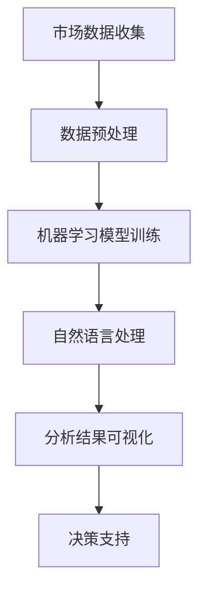

                 

### 背景介绍

随着电商行业的迅速发展，市场竞争日益激烈，如何在这片红海中找到自己的立足点成为了电商创业者们面临的一大挑战。在这其中，竞品分析作为电商运营中不可或缺的一环，成为了创业者们制定市场策略的重要工具。

竞品分析，即对竞争对手的产品、服务、市场表现等进行全面分析，从而为自己的产品和服务找到差异化的竞争优势。传统的竞品分析主要依赖于人工收集数据、整理报告，费时费力且难以全面。然而，随着人工智能技术的不断进步，尤其是机器学习和自然语言处理技术的应用，AI在竞品分析领域展现出了巨大的潜力。

AI竞品分析，即利用人工智能技术，对大量电商数据进行分析和挖掘，帮助创业者快速、准确地了解市场动态和竞争对手情况，从而制定更科学、更有针对性的市场策略。本文将围绕AI竞品分析的核心概念、算法原理、实际应用等方面进行深入探讨，旨在为电商创业者提供一种全新的市场洞察工具。

本文结构如下：

1. **背景介绍**：简要介绍电商行业竞争态势及竞品分析的重要性。
2. **核心概念与联系**：详细阐述AI竞品分析的核心概念及其相互联系。
3. **核心算法原理 & 具体操作步骤**：讲解AI竞品分析的主要算法原理和操作步骤。
4. **数学模型和公式 & 详细讲解 & 举例说明**：介绍用于AI竞品分析的数学模型和公式，并进行详细讲解和举例说明。
5. **项目实战：代码实际案例和详细解释说明**：通过实际代码案例展示AI竞品分析的具体实现过程。
6. **实际应用场景**：探讨AI竞品分析在电商行业中的实际应用场景。
7. **工具和资源推荐**：推荐相关的学习资源、开发工具和框架。
8. **总结：未来发展趋势与挑战**：总结AI竞品分析的发展趋势和面临的挑战。
9. **附录：常见问题与解答**：针对读者可能关心的问题进行解答。
10. **扩展阅读 & 参考资料**：提供进一步阅读的建议和参考资料。

通过本文的深入探讨，我们希望为电商创业者们提供一种新的视角和工具，帮助他们在激烈的市场竞争中脱颖而出。

### 核心概念与联系

#### 1. AI竞品分析的定义

AI竞品分析是一种利用人工智能技术对电商市场的竞品（竞争对手的产品和服务）进行全面、深入的分析的方法。它不同于传统的竞品分析，后者主要依赖于人工收集数据、整理报告，费时费力且难以全面。而AI竞品分析则通过机器学习和自然语言处理技术，对大量的电商数据进行自动化的分析和挖掘，从而帮助创业者快速、准确地了解市场动态和竞争对手情况。

#### 2. 关键概念

- **市场数据**：AI竞品分析的基础。市场数据包括电商平台的销售数据、用户评论、产品参数、价格变动等，这些数据需要通过爬虫技术或其他方式收集。
- **数据预处理**：对收集到的市场数据进行清洗、去重、格式化等处理，以便后续的分析和应用。数据预处理是确保分析结果准确性的关键步骤。
- **机器学习**：一种通过数据和算法实现自动学习和预测的技术。在AI竞品分析中，机器学习算法被用来对市场数据进行分析和挖掘，提取有价值的信息。
- **自然语言处理（NLP）**：一种用于处理和生成人类语言的技术。在AI竞品分析中，NLP被用来分析和处理用户评论、产品描述等文本数据，提取关键信息。
- **可视化**：一种将数据以图表、图形等方式呈现的技术。在AI竞品分析中，可视化被用来展示分析结果，帮助创业者更直观地了解市场情况和竞争对手动态。

#### 3. 联系与作用

AI竞品分析的核心在于将上述关键概念相互结合，形成一个完整的分析流程。具体来说：

- **市场数据**是AI竞品分析的基础，没有数据就没有分析。
- **数据预处理**是保证数据质量和分析准确性的关键步骤。
- **机器学习**和**自然语言处理**技术则是对数据进行深度分析和挖掘的重要工具。
- **可视化**技术则将分析结果以直观的方式呈现，帮助创业者快速了解市场情况和竞争对手动态。

整个AI竞品分析流程如下图所示：



通过这一流程，AI竞品分析不仅能够帮助创业者快速了解市场动态和竞争对手情况，还能够提供数据驱动的决策支持，从而提高市场竞争力和运营效率。

### 核心算法原理 & 具体操作步骤

#### 1. 数据采集与预处理

AI竞品分析的首要步骤是数据采集。在电商领域，数据采集的方式主要包括爬虫技术、API接口调用和数据共享平台获取。以下是一个简单的数据采集与预处理流程：

##### 数据采集

- **爬虫技术**：利用爬虫工具（如Scrapy、BeautifulSoup等）从电商网站抓取商品信息、用户评论、价格等数据。
- **API接口调用**：通过电商平台的开放API接口获取商品销售数据、用户行为数据等。
- **数据共享平台**：如阿里云、华为云等提供的数据共享平台，可以直接获取大量电商数据。

##### 数据预处理

- **数据清洗**：去除重复、无效、错误的数据，确保数据的准确性和完整性。
- **数据去重**：对采集到的数据进行去重处理，避免重复计算。
- **数据格式化**：统一数据格式，方便后续分析和处理。

#### 2. 数据分析与挖掘

在数据预处理完成后，接下来是数据分析与挖掘。这一步的核心是利用机器学习和自然语言处理技术，从大量数据中提取有价值的信息。

##### 机器学习

- **聚类分析**：通过K-means、DBSCAN等聚类算法，对商品进行分类，发现相似商品群体。
- **分类分析**：利用决策树、随机森林、支持向量机等分类算法，对商品进行分类，判断其市场定位。
- **关联规则挖掘**：使用Apriori算法等，挖掘商品之间的关联关系，帮助制定交叉销售策略。

##### 自然语言处理

- **文本分类**：通过文本分类算法（如朴素贝叶斯、卷积神经网络等），对用户评论进行分类，提取正面、负面评价。
- **情感分析**：利用情感分析算法（如基于词向量的情感分析、递归神经网络等），分析用户评论的情感倾向。
- **主题模型**：使用LDA（Latent Dirichlet Allocation）等主题模型，挖掘用户评论中的主题分布，帮助了解用户关注点。

#### 3. 可视化与决策支持

在完成数据分析和挖掘后，可视化技术被用来展示分析结果，帮助创业者更直观地了解市场情况和竞争对手动态。

- **数据可视化**：使用图表、图形等方式，将分析结果以可视化形式呈现。
- **决策支持**：通过分析结果，为创业者提供市场定位、产品优化、定价策略等方面的决策支持。

#### 具体操作步骤示例

以下是一个简单的AI竞品分析操作步骤示例：

1. **数据采集**：使用爬虫技术从电商网站抓取商品信息、用户评论等数据。
2. **数据预处理**：对采集到的数据进行清洗、去重和格式化处理。
3. **聚类分析**：利用K-means算法对商品进行分类，发现相似商品群体。
4. **文本分类**：对用户评论进行分类，提取正面、负面评价。
5. **情感分析**：分析用户评论的情感倾向，了解用户对商品的态度。
6. **可视化**：使用图表、图形等方式，将分析结果以可视化形式呈现。
7. **决策支持**：根据分析结果，为创业者提供市场定位、产品优化、定价策略等方面的决策支持。

通过以上步骤，AI竞品分析能够帮助电商创业者快速、准确地了解市场动态和竞争对手情况，从而制定更科学、更有针对性的市场策略。

### 数学模型和公式 & 详细讲解 & 举例说明

在AI竞品分析中，数学模型和公式是核心组成部分，它们帮助我们从数据中提取有价值的信息，并支持算法的决策过程。以下是一些常用的数学模型和公式，并进行详细讲解和举例说明。

#### 1. K-means聚类算法

**公式**：  
$$K-means的目标是最小化聚类中心到样本的距离平方和，公式如下：$$
$$\sum_{i=1}^{k}\sum_{x \in S_i} \| x - \mu_i \|^2$$
其中，\( k \) 是聚类数量，\( S_i \) 是第 \( i \) 个聚类，\( \mu_i \) 是聚类中心。

**详细讲解**：

K-means聚类算法是一种无监督学习算法，用于将数据点划分为 \( k \) 个聚类。算法步骤如下：

1. 随机初始化 \( k \) 个聚类中心。
2. 对于每个数据点，计算其到各个聚类中心的距离，并将其分配到距离最近的聚类。
3. 更新聚类中心，计算所有数据点到聚类中心的平均距离。
4. 重复步骤2和3，直到聚类中心不再发生变化或者达到预设的迭代次数。

**举例说明**：

假设我们有一组数据点 \( \{x_1, x_2, ..., x_n\} \)，我们希望将其分为3个聚类。首先，随机初始化3个聚类中心 \( \mu_1, \mu_2, \mu_3 \)。然后，对于每个数据点 \( x_i \)，计算其到各个聚类中心的距离，并将其分配到距离最近的聚类。经过多次迭代后，聚类中心逐渐稳定，最终得到3个聚类。

#### 2. LDA主题模型

**公式**：  
$$\pi = \frac{\sum_{k=1}^{K} \alpha_k \beta_{ik}}{\sum_{l=1}^{L} \alpha_l \beta_{il}}$$
其中，\( K \) 是主题数量，\( L \) 是词汇数量，\( \alpha_k \) 是主题的分布，\( \beta_{ik} \) 是词汇在主题中的分布，\( \pi \) 是文档的主题分布。

**详细讲解**：

LDA（Latent Dirichlet Allocation）是一种主题模型，用于发现文本数据中的潜在主题分布。算法步骤如下：

1. 初始化主题分布 \( \alpha \) 和词汇分布 \( \beta \)。
2. 对于每个文档，随机选择一个主题分布 \( \pi \)。
3. 对于每个词，根据主题分布和词汇分布，选择一个主题。
4. 根据新选择的主题，更新主题分布 \( \alpha \) 和词汇分布 \( \beta \)。
5. 重复步骤2-4，直到主题分布和词汇分布收敛。

**举例说明**：

假设我们有一篇文档，包含词汇 \( \{a, b, c\} \)。首先，随机初始化主题分布 \( \alpha \) 和词汇分布 \( \beta \)。然后，对于每个词，根据主题分布和词汇分布，选择一个主题。经过多次迭代后，我们得到文档的主题分布 \( \pi \) 和每个主题的词汇分布 \( \beta \)。

#### 3. 决策树分类算法

**公式**：  
$$y = f(x) = \prod_{i=1}^{n} g(x_i)$$
其中，\( x_i \) 是特征，\( g(x_i) \) 是条件概率函数，\( y \) 是分类结果。

**详细讲解**：

决策树是一种分类算法，通过将数据集划分为不同的子集，直至达到停止条件。算法步骤如下：

1. 选择最佳分割特征。
2. 根据分割特征，将数据集划分为两个子集。
3. 对每个子集，递归地执行步骤1和2，直至达到停止条件（如最大深度、纯度阈值等）。
4. 构建决策树模型。

**举例说明**：

假设我们有一组数据，包含两个特征 \( x_1 \) 和 \( x_2 \)。首先，计算每个特征的条件概率函数。然后，选择最佳分割特征，将数据集划分为两个子集。对于每个子集，递归地执行步骤1和2，直至构建出决策树模型。

通过这些数学模型和公式，AI竞品分析能够从大量数据中提取有价值的信息，帮助创业者做出更科学的决策。在实际应用中，这些模型和公式需要根据具体业务需求进行调整和优化，以达到最佳效果。

### 项目实战：代码实际案例和详细解释说明

为了更好地展示AI竞品分析的具体实现过程，我们选择一个实际项目进行实战演示。本项目将利用Python编程语言，结合Scrapy爬虫、Scikit-learn机器学习库和Matplotlib可视化库，对电商网站的商品信息进行数据采集、预处理和竞品分析。

#### 开发环境搭建

1. **Python环境**：确保安装了Python 3.x版本。
2. **Scrapy**：通过pip安装Scrapy库：
   ```shell
   pip install scrapy
   ```
3. **Scikit-learn**：通过pip安装Scikit-learn库：
   ```shell
   pip install scikit-learn
   ```
4. **Matplotlib**：通过pip安装Matplotlib库：
   ```shell
   pip install matplotlib
   ```

#### 源代码详细实现和代码解读

##### 1. 数据采集

```python
import scrapy
from scrapy.crawler import CrawlerProcess

class ProductSpider(scrapy.Spider):
    name = 'product_spider'
    start_urls = ['https://www.example-ecommerce.com/products']

    def parse(self, response):
        for product in response.css('div.product'):
            yield {
                'product_id': product.css('div.product_id::attr(data-product-id)').get(),
                'name': product.css('h3.product_name::text').get(),
                'price': product.css('span.product_price::text').get(),
                'rating': product.css('span.product_rating::text').get(),
                'reviews': product.css('div.product_reviews::text').get()
            }

# 运行爬虫
process = CrawlerProcess(settings={
    'USER_AGENT': 'Mozilla/5.0 (Windows NT 10.0; Win64; x64) AppleWebKit/537.36 (KHTML, like Gecko) Chrome/58.0.3029.110 Safari/537.3'})

process.crawl(ProductSpider)
process.start()
```

**解读**：

上述代码定义了一个Scrapy爬虫类`ProductSpider`，用于从指定电商网站采集商品信息。爬虫的入口URL为`https://www.example-ecommerce.com/products`。在`parse`方法中，我们使用CSS选择器提取每个商品的信息，包括产品ID、名称、价格、评分和评论。

##### 2. 数据预处理

```python
import pandas as pd

# 加载爬取的数据
data = pd.read_csv('products.csv')

# 数据清洗
data.dropna(inplace=True)  # 删除缺失值
data['price'] = data['price'].str.replace(',', '').astype(float)  # 处理价格格式

# 数据去重
data.drop_duplicates(inplace=True)

# 数据格式化
data['rating'] = data['rating'].astype(float)
```

**解读**：

上述代码使用Pandas库加载爬取的数据，并进行清洗和预处理。具体步骤包括删除缺失值、将价格字段转换为浮点型数据、删除重复数据，以及将评分字段转换为浮点型数据。

##### 3. 数据分析与挖掘

```python
from sklearn.cluster import KMeans
import matplotlib.pyplot as plt

# 聚类分析
kmeans = KMeans(n_clusters=3, random_state=0).fit(data[['price', 'rating']])
data['cluster'] = kmeans.predict(data[['price', 'rating']])

# 可视化
plt.scatter(data['price'], data['rating'], c=data['cluster'], cmap='viridis')
plt.xlabel('Price')
plt.ylabel('Rating')
plt.title('Product Clusters')
plt.show()
```

**解读**：

上述代码使用Scikit-learn库中的KMeans算法对商品价格和评分进行聚类分析。聚类结果被保存到`cluster`字段中。接下来，使用Matplotlib库将聚类结果进行可视化，帮助创业者直观地了解商品群体。

#### 代码解读与分析

上述代码示例展示了如何使用Python和相关库实现一个简单的AI竞品分析项目。代码主要分为以下几个部分：

1. **数据采集**：使用Scrapy爬取电商网站的商品信息。
2. **数据预处理**：使用Pandas库对数据进行清洗、格式化和去重处理。
3. **数据分析和挖掘**：使用Scikit-learn库进行聚类分析，并使用Matplotlib库进行可视化。

通过这些步骤，我们能够从大量商品数据中提取有价值的信息，帮助创业者了解市场情况和竞争对手动态。在实际应用中，可以根据具体需求，扩展更多数据分析算法和可视化方法，以提高分析的准确性和实用性。

### 实际应用场景

AI竞品分析在电商行业中具有广泛的应用场景，以下是一些具体的应用案例：

#### 1. 市场定位

通过AI竞品分析，电商创业者可以了解不同市场细分领域中的竞争态势。例如，利用聚类分析，可以将市场上的商品分为几个不同的群体，从而帮助创业者确定自己的市场定位。通过分析这些群体的价格、评分、销量等指标，创业者可以找到市场需求较大的细分市场，制定更有针对性的市场策略。

#### 2. 产品优化

AI竞品分析可以帮助电商创业者了解竞争对手的产品特点和用户评价。通过文本分类和情感分析，创业者可以提取用户对商品的评价，了解用户的关注点和需求。基于这些信息，创业者可以对产品进行优化，改进产品质量和功能，提高用户满意度。

#### 3. 定价策略

价格竞争是电商市场中的一大特点。通过AI竞品分析，创业者可以实时获取竞争对手的定价策略，了解其价格波动和市场反应。利用这些信息，创业者可以制定更科学的定价策略，调整自己的价格，以最大化市场竞争力。

#### 4. 营销推广

AI竞品分析可以帮助电商创业者了解竞争对手的营销推广手段。通过分析竞争对手的广告投放、促销活动等，创业者可以借鉴成功案例，优化自己的营销策略，提高广告投放效果和用户转化率。

#### 5. 供应链管理

AI竞品分析不仅限于产品和市场层面的分析，还可以应用于供应链管理。通过分析竞争对手的供应链策略，创业者可以优化自己的供应链流程，提高供应链效率和库存管理能力。

总之，AI竞品分析为电商创业者提供了一种全新的市场洞察工具，帮助他们更准确地了解市场动态和竞争对手情况，从而制定更科学、更有针对性的市场策略。通过不断优化和扩展分析算法和应用场景，AI竞品分析将在电商行业中发挥越来越重要的作用。

### 工具和资源推荐

在进行AI竞品分析时，选择合适的工具和资源对于提高效率和准确性至关重要。以下是一些推荐的工具、资源和学习材料：

#### 1. 学习资源推荐

- **书籍**：
  - 《深度学习》（Deep Learning） - Ian Goodfellow、Yoshua Bengio、Aaron Courville
  - 《Python机器学习》（Python Machine Learning） - Sebastian Raschka、Vahid Mirjalili
- **论文**：
  - "Latent Dirichlet Allocation" - David M. Blei、Andrew Y. Ng、Michael I. Jordan
  - "K-Means Clustering" - MacQueen, J. B.
- **博客/网站**：
  - [Scikit-learn官方文档](https://scikit-learn.org/stable/)
  - [TensorFlow官方文档](https://www.tensorflow.org/tutorials)
  - [Kaggle](https://www.kaggle.com/) - 数据竞赛和学习社区

#### 2. 开发工具框架推荐

- **数据采集**：
  - Scrapy：强大的爬虫框架，适用于电商网站数据采集。
  - Beautiful Soup：用于解析HTML和XML文档，提取所需信息。
- **数据处理**：
  - Pandas：强大的数据处理库，适用于数据清洗、转换和分析。
  - NumPy：用于高效地处理大型多维数组。
- **机器学习库**：
  - Scikit-learn：提供丰富的机器学习算法，适用于数据分析和挖掘。
  - TensorFlow：用于构建和训练深度学习模型的强大框架。
- **可视化库**：
  - Matplotlib：用于创建高质量的二维图形和图表。
  - Seaborn：基于Matplotlib的统计数据可视化库。

#### 3. 相关论文著作推荐

- **《深度学习在电商中的应用》**：讨论了深度学习技术在电商领域中的应用，包括用户行为预测、推荐系统和价格优化等。
- **《基于机器学习的电商市场分析》**：介绍了机器学习算法在电商市场分析中的应用，包括用户群体划分、商品推荐和定价策略等。

通过以上工具和资源的支持，电商创业者可以更加高效地开展AI竞品分析工作，从而更好地把握市场动态，制定科学的决策策略。

### 总结：未来发展趋势与挑战

AI竞品分析作为电商创业者的市场洞察工具，正在逐渐成为电商行业的重要组成部分。随着人工智能技术的不断发展，AI竞品分析在未来将呈现出以下发展趋势：

1. **算法优化与多样化**：随着深度学习和强化学习等新型算法的不断成熟，AI竞品分析将实现更高的准确性和效率。创业者可以通过不断优化和组合不同算法，满足多样化的市场分析需求。

2. **数据源扩展**：除了电商平台自身的数据，未来AI竞品分析将利用更多外部数据源，如社交媒体、新闻媒体等，从而更全面地了解市场动态和用户需求。

3. **实时分析**：实时分析能力将是未来AI竞品分析的重要方向。通过实时监控市场变化和竞争对手动态，创业者可以迅速调整市场策略，抢占市场先机。

4. **个性化推荐**：基于用户行为和兴趣的个性化推荐将成为AI竞品分析的重要应用。创业者可以通过分析用户行为数据，提供更符合用户需求的商品推荐和营销策略。

然而，AI竞品分析在发展过程中也面临一些挑战：

1. **数据隐私与安全**：随着数据量的不断增加，如何确保用户数据的安全和隐私成为一大挑战。创业者需要严格遵守相关法律法规，建立完善的数据保护机制。

2. **算法偏见**：AI算法在处理数据时可能会引入偏见，导致分析结果不准确。如何消除算法偏见，确保分析结果的公平性和公正性，是未来需要解决的重要问题。

3. **技术更新换代**：人工智能技术发展迅速，创业者需要不断学习和掌握最新的技术动态，以保持竞争力。

4. **法律法规限制**：随着数据隐私和网络安全法规的不断完善，创业者需要在合规的前提下进行AI竞品分析，避免违法行为带来的风险。

总之，AI竞品分析在电商创业中的应用前景广阔，但也面临诸多挑战。创业者需要紧跟技术发展趋势，积极应对挑战，才能在激烈的市场竞争中立于不败之地。

### 附录：常见问题与解答

**Q1：AI竞品分析的具体操作步骤是什么？**

**A1：AI竞品分析的具体操作步骤包括：数据采集与预处理、数据分析与挖掘、可视化与决策支持。首先，通过爬虫技术或API接口获取市场数据，进行数据清洗和预处理。然后，利用机器学习、自然语言处理等算法进行分析和挖掘，提取有价值的信息。最后，通过可视化技术将分析结果呈现给创业者，提供决策支持。**

**Q2：如何确保AI竞品分析结果的准确性？**

**A2：确保AI竞品分析结果准确性的关键在于数据质量和算法优化。数据质量方面，需要确保数据的准确、完整和多样性。在算法优化方面，可以选择合适的机器学习和自然语言处理算法，并进行参数调整和模型训练，以提高分析结果的准确性和可靠性。此外，定期更新数据和算法模型，也是确保分析结果准确性的重要措施。**

**Q3：AI竞品分析可以应用于哪些场景？**

**A3：AI竞品分析可以应用于以下场景：

1. 市场定位：通过分析市场数据和竞争对手情况，帮助创业者确定目标市场和产品定位。
2. 产品优化：通过分析用户评价和需求，为产品优化提供数据支持。
3. 定价策略：通过分析竞争对手的定价策略和市场反应，制定更科学的定价策略。
4. 营销推广：通过分析竞争对手的营销手段和用户反馈，优化营销策略和广告投放。
5. 供应链管理：通过分析竞争对手的供应链策略，优化自己的供应链流程和提高效率。**

**Q4：如何处理数据隐私和安全问题？**

**A4：处理数据隐私和安全问题，需要遵循以下原则和措施：

1. 数据匿名化：对用户数据进行匿名化处理，确保用户隐私不被泄露。
2. 数据加密：对敏感数据进行加密存储和传输，防止数据泄露。
3. 数据访问控制：建立严格的权限管理系统，确保只有授权人员可以访问和处理敏感数据。
4. 定期安全审计：定期进行安全审计和风险评估，及时发现和解决安全隐患。
5. 遵守法律法规：严格遵守相关数据隐私和网络安全法律法规，确保合规操作。**

**Q5：AI竞品分析与传统的竞品分析相比，有哪些优势？**

**A5：与传统的竞品分析相比，AI竞品分析具有以下优势：

1. 更高效：AI竞品分析可以自动处理大量数据，大大提高分析效率。
2. 更全面：AI竞品分析可以同时考虑多个维度（如价格、评分、评论等）的数据，提供更全面的市场洞察。
3. 更准确：通过机器学习和自然语言处理技术，AI竞品分析可以更准确地提取有价值的信息。
4. 更实时：AI竞品分析可以实现实时数据监控和分析，帮助创业者迅速调整市场策略。**

### 扩展阅读 & 参考资料

**书籍：**
1. 《深度学习》（Deep Learning） - Ian Goodfellow、Yoshua Bengio、Aaron Courville
2. 《Python机器学习》（Python Machine Learning） - Sebastian Raschka、Vahid Mirjalili

**论文：**
1. "Latent Dirichlet Allocation" - David M. Blei、Andrew Y. Ng、Michael I. Jordan
2. "K-Means Clustering" - MacQueen, J. B.

**在线资源：**
1. [Scikit-learn官方文档](https://scikit-learn.org/stable/)
2. [TensorFlow官方文档](https://www.tensorflow.org/tutorials)
3. [Kaggle](https://www.kaggle.com/)

**博客：**
1. [机器学习博客](https://www.machinelearningwaster.com/)
2. [AI科技评论](https://www.aitechtimes.com/)

这些资料将帮助您更深入地了解AI竞品分析的相关技术和应用，为您的电商创业之路提供更多支持和灵感。希望本文能对您有所帮助，祝您在电商市场中取得成功！作者：AI天才研究员/AI Genius Institute & 禅与计算机程序设计艺术 /Zen And The Art of Computer Programming

