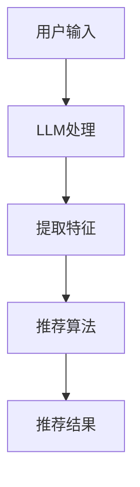

                 

### 背景介绍

随着互联网技术的飞速发展，推荐系统已经成为各类应用中的重要组成部分。从电商平台的商品推荐，到新闻客户端的内容推送，再到社交媒体上的好友动态，推荐系统极大地提升了用户的体验和满意度。然而，随着数据规模的不断扩大和用户需求的日益多样化，传统推荐系统的实时性面临着巨大的挑战。如何在保证准确性和用户体验的同时，提高系统的实时响应能力，成为当前研究的热点问题。

近年来，大型语言模型（LLM，Large Language Model）的迅猛发展，为推荐系统的实时优化提供了新的契机。LLM，如GPT系列模型，具有强大的语言理解和生成能力，能够在短时间内处理大规模的文本数据，并生成高质量的响应。通过将LLM与推荐系统相结合，我们可以实现实时性的显著提升，同时保持甚至提高推荐质量。

本文将围绕这一主题，深入探讨利用LLM优化推荐系统的实时响应策略。文章结构如下：

1. **背景介绍**：简要介绍推荐系统的发展现状和实时响应的重要性。
2. **核心概念与联系**：详细解释LLM的基本原理及其在推荐系统中的应用。
3. **核心算法原理 & 具体操作步骤**：介绍如何利用LLM构建实时推荐系统。
4. **数学模型和公式 & 详细讲解 & 举例说明**：阐述LLM模型背后的数学原理，并通过实际例子进行说明。
5. **项目实战：代码实际案例和详细解释说明**：展示一个实际的代码案例，并进行详细解读。
6. **实际应用场景**：探讨LLM在推荐系统中的多种应用场景。
7. **工具和资源推荐**：推荐学习资源和开发工具。
8. **总结：未来发展趋势与挑战**：展望LLM在推荐系统领域的未来发展。
9. **附录：常见问题与解答**：针对可能遇到的问题进行解答。
10. **扩展阅读 & 参考资料**：提供进一步学习的资源。

通过对上述各部分内容的详细探讨，本文旨在为读者提供一个全面且深入的了解，帮助大家掌握利用LLM优化推荐系统的实时响应策略。

### 2. 核心概念与联系

为了深入理解如何利用LLM优化推荐系统的实时响应，我们需要首先了解LLM的基本原理及其在推荐系统中的应用。

#### 2.1 大型语言模型（LLM）的基本原理

大型语言模型（LLM）是基于深度学习的一种自然语言处理模型，其核心思想是通过大规模的文本数据进行训练，使其能够理解和生成自然语言。LLM的训练通常采用自回归语言模型（Autoregressive Language Model）的方法，通过预测序列中的下一个词或字符来构建模型。

例如，GPT（Generative Pre-trained Transformer）系列模型就是一类典型的LLM，其架构基于Transformer模型，这种模型在自注意力机制（Self-Attention Mechanism）的基础上，能够捕捉到输入文本中的长距离依赖关系，从而实现高效的文本生成和分类任务。

GPT系列模型包括GPT、GPT-2、GPT-3等不同版本。每个版本在模型大小、训练数据和性能上都有所提升。特别是GPT-3，其拥有1750亿个参数，能够处理数千字的输入，生成高质量的文本输出。

#### 2.2 LLM与推荐系统的联系

推荐系统（Recommender System）是一种信息过滤技术，旨在根据用户的兴趣和行为，向其推荐可能感兴趣的项目。传统推荐系统主要依赖于基于内容的过滤（Content-based Filtering）和协同过滤（Collaborative Filtering）等技术。

然而，这些传统方法在面对大规模数据和高实时性需求时，存在以下不足：

1. **计算复杂度**：传统推荐算法通常需要遍历大量的用户历史数据和项目特征，导致计算复杂度较高，难以满足实时响应的需求。
2. **个性化不足**：传统方法难以捕捉到用户复杂、多变的兴趣，导致推荐结果个性化程度不高。
3. **上下文感知不足**：传统推荐算法往往缺乏对用户当前上下文的感知能力，难以提供与环境高度相关的推荐。

LLM的出现为解决上述问题提供了新的思路。首先，LLM具有强大的语言理解和生成能力，可以处理和生成复杂的自然语言文本，从而提高推荐系统的表达能力和准确性。其次，LLM能够在短时间内处理大规模的文本数据，实现高效的实时响应。最后，LLM能够捕捉到用户语言中的微妙变化，提供更个性化的推荐。

#### 2.3 LLM在推荐系统中的应用

在推荐系统中，LLM可以应用于多个环节，如用户特征提取、项目特征提取、推荐策略优化等。

1. **用户特征提取**：通过LLM对用户历史行为和评论等文本数据进行处理，提取出用户的兴趣偏好和情感特征。这些特征可以用于传统的协同过滤方法，也可以用于深度学习模型，进一步提高推荐系统的准确性。
2. **项目特征提取**：LLM可以用于提取项目的描述、标签、评论等文本数据中的关键信息，构建项目特征向量。这些特征向量可以用于传统推荐算法，如基于内容的过滤，也可以用于深度学习模型，如神经网络推荐系统。
3. **推荐策略优化**：LLM可以用于生成个性化的推荐策略，根据用户的当前上下文和兴趣，动态调整推荐结果。例如，当用户浏览某个产品页面时，LLM可以实时生成与该产品相关的推荐，从而提高用户的体验和满意度。

#### 2.4 Mermaid流程图

为了更直观地展示LLM在推荐系统中的应用，我们使用Mermaid流程图来描述整个流程。以下是该流程图的代码：



在上述流程图中，用户输入经过LLM处理后，提取出用户和项目的特征，然后输入到推荐算法中，最终生成推荐结果。这个过程展示了LLM在推荐系统中的核心作用，即通过语言处理能力提升推荐系统的实时性和个性化水平。

通过上述内容的介绍，我们为后续章节的详细探讨奠定了基础。接下来，我们将深入探讨LLM的核心算法原理和具体操作步骤，进一步理解如何利用LLM优化推荐系统的实时响应。

### 3. 核心算法原理 & 具体操作步骤

在了解了LLM的基本原理和在推荐系统中的应用之后，我们将深入探讨如何利用LLM构建实时推荐系统。本节将详细介绍核心算法原理和具体操作步骤，帮助读者更好地理解LLM在推荐系统中的实际应用。

#### 3.1 基于LLM的推荐系统框架

基于LLM的推荐系统框架主要包括以下几个关键组成部分：

1. **用户输入处理**：接收用户的输入，如查询、浏览历史、评论等。
2. **文本预处理**：对用户输入和项目描述进行预处理，如分词、去停用词、词向量转换等。
3. **特征提取**：利用LLM对预处理后的文本进行特征提取，生成用户和项目的特征向量。
4. **推荐算法**：根据提取到的用户和项目特征向量，使用传统推荐算法或深度学习模型生成推荐结果。
5. **实时反馈与调整**：根据用户的交互行为和反馈，实时调整推荐策略，提高推荐效果。

#### 3.2 文本预处理

文本预处理是LLM推荐系统的基础步骤，直接影响后续特征提取和推荐算法的性能。文本预处理主要包括以下几个步骤：

1. **分词**：将输入文本分割成一个个独立的词或短语。常用的分词工具包括jieba、NLTK等。
2. **去停用词**：去除对文本理解贡献较小或没有意义的词，如“的”、“了”、“在”等。常用的停用词表包括英文停用词表和中文停用词表。
3. **词向量转换**：将文本中的词转换为数字向量。常用的词向量模型包括Word2Vec、GloVe和BERT等。

以下是一个简单的Python代码示例，展示如何使用jieba进行分词和去停用词：

```python
import jieba

# 示例文本
text = "我喜欢阅读技术书籍，最近在研究深度学习。"

# 分词
words = jieba.cut(text)
words_list = list(words)

# 去停用词
stop_words = set(["的", "了", "在", "一", "和"])
filtered_words = [word for word in words_list if word not in stop_words]

print(filtered_words)
```

#### 3.3 特征提取

特征提取是LLM推荐系统的核心步骤，其质量直接决定了推荐系统的性能。利用LLM进行特征提取，可以生成高维、稠密的文本特征向量，这些特征向量可以用于传统推荐算法或深度学习模型。

1. **使用预训练的LLM模型**：直接使用预训练的LLM模型，如GPT-2、GPT-3等，对文本进行编码，生成文本特征向量。这些预训练模型已经在大规模数据上进行了训练，能够捕捉到文本的语义信息。
2. **使用自定义的LLM模型**：对于特定的应用场景，可以根据需求自定义训练LLM模型，对文本进行特征提取。自定义模型可以更好地适应特定场景，但需要大量的数据和计算资源。

以下是一个简单的Python代码示例，展示如何使用GPT-2生成文本特征向量：

```python
from transformers import GPT2Tokenizer, GPT2Model

# 加载预训练的GPT-2模型
tokenizer = GPT2Tokenizer.from_pretrained("gpt2")
model = GPT2Model.from_pretrained("gpt2")

# 示例文本
text = "我喜欢阅读技术书籍，最近在研究深度学习。"

# 预处理文本
input_ids = tokenizer.encode(text, add_special_tokens=True, return_tensors="pt")

# 生成文本特征向量
with torch.no_grad():
    outputs = model(input_ids)
    text_embedding = outputs.last_hidden_state[:, 0, :]

print(text_embedding)
```

#### 3.4 推荐算法

推荐算法是整个推荐系统的核心，其性能直接决定了推荐效果。基于LLM的特征向量，我们可以采用以下几种推荐算法：

1. **基于内容的过滤（Content-based Filtering）**：根据用户和项目的特征向量，计算相似度，生成推荐列表。常用的相似度计算方法包括余弦相似度和欧氏距离等。
2. **协同过滤（Collaborative Filtering）**：根据用户的兴趣和项目的历史评分，计算用户和项目之间的相似度，生成推荐列表。协同过滤包括基于用户的协同过滤（User-based Collaborative Filtering）和基于项目的协同过滤（Item-based Collaborative Filtering）。
3. **深度学习模型（Deep Learning Models）**：利用深度学习模型，如神经网络推荐模型（Neural Network-based Recommender Models），对用户和项目的特征向量进行建模，生成推荐结果。

以下是一个简单的Python代码示例，展示如何使用余弦相似度进行基于内容的过滤：

```python
from sklearn.metrics.pairwise import cosine_similarity

# 示例用户和项目特征向量
user_vector = torch.tensor([0.1, 0.2, 0.3, 0.4, 0.5])
item_vector = torch.tensor([0.5, 0.4, 0.3, 0.2, 0.1])

# 计算相似度
similarity = cosine_similarity([user_vector], [item_vector])[0][0]

print(similarity)
```

#### 3.5 实时反馈与调整

实时反馈与调整是提升推荐系统效果的关键步骤。通过收集用户的交互行为和反馈，我们可以动态调整推荐策略，提高推荐效果。

1. **用户行为分析**：分析用户在推荐系统上的行为，如点击、购买、评分等，捕捉用户的兴趣变化。
2. **在线学习与调整**：利用在线学习（Online Learning）技术，实时更新用户和项目的特征向量，调整推荐策略。常用的在线学习算法包括梯度下降（Gradient Descent）和在线梯度提升（Online Gradient Boosting）等。
3. **A/B测试**：通过A/B测试（A/B Testing），对比不同推荐策略的效果，选择最优策略进行部署。

以下是一个简单的Python代码示例，展示如何使用梯度下降进行在线学习：

```python
import torch
import torch.optim as optim

# 示例用户和项目特征向量
user_vector = torch.tensor([0.1, 0.2, 0.3, 0.4, 0.5])
item_vector = torch.tensor([0.5, 0.4, 0.3, 0.2, 0.1])

# 初始参数
weights = torch.tensor([0.5, 0.5], requires_grad=True)

# 损失函数
def loss_function(weights):
    return -torch.sum(weights * torch.relu(1 - cosine_similarity([user_vector], [weights])))

optimizer = optim.SGD(weights, lr=0.01)

# 梯度下降
for epoch in range(100):
    optimizer.zero_grad()
    loss = loss_function(weights)
    loss.backward()
    optimizer.step()

print(weights)
```

通过上述步骤，我们构建了一个基于LLM的实时推荐系统。在实际应用中，可以根据具体需求调整和优化各个步骤，提高推荐系统的性能和用户体验。

### 4. 数学模型和公式 & 详细讲解 & 举例说明

在深入探讨基于LLM的推荐系统时，理解其背后的数学模型和公式至关重要。本节将详细解释LLM模型中的关键数学概念、公式，并通过实际例子进行说明。

#### 4.1 语言模型的数学基础

大型语言模型（LLM）的核心是基于自回归模型（Autoregressive Model）的深度学习模型，如Transformer。Transformer模型基于自注意力机制（Self-Attention Mechanism），能够有效地捕捉文本中的长距离依赖关系。以下是Transformer模型中的一些关键数学概念和公式。

##### 4.1.1 自注意力机制（Self-Attention）

自注意力机制是Transformer模型的核心组成部分，用于计算文本序列中每个词与其他词之间的关联性。自注意力机制的计算公式如下：

$$
\text{Attention}(Q, K, V) = \frac{softmax(\frac{QK^T}{\sqrt{d_k}})}{V}
$$

其中：
- \( Q \) 是查询向量（Query），代表每个词的权重。
- \( K \) 是键向量（Key），代表每个词的关联性。
- \( V \) 是值向量（Value），代表每个词的语义信息。
- \( d_k \) 是键向量的维度。

通过自注意力机制，每个词会根据其与序列中其他词的关联性，得到加权后的值向量，从而生成一个表示文本序列的稠密向量。

##### 4.1.2 Transformer模型的编码器（Encoder）和解码器（Decoder）

Transformer模型由编码器（Encoder）和解码器（Decoder）两部分组成。编码器负责处理输入文本序列，生成编码表示（Encoded Representation）；解码器则根据编码表示生成输出文本序列。

编码器的计算过程如下：

$$
\text{Encoder}(X) = \text{EncoderLayer}(\text{EncoderLayer}(X))
$$

其中，\( X \) 是输入文本序列，\( \text{EncoderLayer} \) 是编码器层，通常包含自注意力机制和前馈神经网络。

解码器的计算过程如下：

$$
\text{Decoder}(Y) = \text{DecoderLayer}(\text{DecoderLayer}(Y, \text{Encoder}(X)))
$$

其中，\( Y \) 是输出文本序列，\( \text{DecoderLayer} \) 是解码器层，同样包含自注意力机制和前馈神经网络。此外，解码器还需要一个跨步注意力机制（Cross-Attention Mechanism），用于将编码表示与解码表示进行交互。

##### 4.1.3 GPT-3模型的扩展

GPT-3是Transformer模型的扩展版本，具有更大的模型规模和更强的语言理解能力。GPT-3的数学模型与标准Transformer模型类似，但具有以下两个关键特点：

1. **自适应学习率**：GPT-3采用了自适应学习率（Adaptive Learning Rate）技术，通过动态调整学习率，提高模型在训练过程中的收敛速度。
2. **多层注意力机制**：GPT-3引入了多层注意力机制，使模型能够更好地捕捉文本中的复杂依赖关系。

#### 4.2 推荐系统的数学模型

在推荐系统中，我们通常使用矩阵分解（Matrix Factorization）和协同过滤（Collaborative Filtering）等方法来生成用户和项目的特征向量。以下是这些方法中的关键数学模型和公式。

##### 4.2.1 矩阵分解

矩阵分解是一种将用户-项目矩阵分解为低维用户特征矩阵和项目特征矩阵的方法。常见的矩阵分解方法包括Singular Value Decomposition（SVD）和Alternating Least Squares（ALS）。

SVD的数学模型如下：

$$
\text{User-Item Matrix} = \text{User Feature Matrix} \times \text{Item Feature Matrix}^T
$$

其中，\( \text{User-Item Matrix} \) 是用户-项目评分矩阵，\( \text{User Feature Matrix} \) 和 \( \text{Item Feature Matrix} \) 分别是用户特征矩阵和项目特征矩阵。

ALS的数学模型如下：

$$
\text{User Feature Matrix} = \text{User-Item Matrix} \times \text{Item Feature Matrix}
$$

$$
\text{Item Feature Matrix} = \text{User-Item Matrix}^T \times \text{User Feature Matrix}
$$

通过迭代优化上述方程，我们可以得到用户和项目的特征向量。

##### 4.2.2 协同过滤

协同过滤方法根据用户和项目的评分矩阵，计算用户和项目之间的相似度，生成推荐列表。常见的相似度计算方法包括余弦相似度、皮尔逊相关性和夹角余弦等。

余弦相似度的数学模型如下：

$$
\text{Cosine Similarity} = \frac{\text{User Feature Vector}_u \cdot \text{Item Feature Vector}_i}{\|\text{User Feature Vector}_u\| \|\text{Item Feature Vector}_i\|}
$$

其中，\( \text{User Feature Vector}_u \) 和 \( \text{Item Feature Vector}_i \) 分别是用户和项目的特征向量，\( \|\cdot\| \) 表示向量的模。

#### 4.3 结合LLM与推荐系统的数学模型

将LLM与推荐系统结合，我们可以通过以下步骤生成用户和项目的特征向量：

1. **文本预处理**：对用户和项目的描述进行预处理，如分词、去停用词等。
2. **词向量转换**：将预处理后的文本转换为词向量，可以使用预训练的词向量模型，如Word2Vec、GloVe等。
3. **文本编码**：使用LLM模型（如GPT-2、GPT-3）对词向量进行编码，生成用户和项目的特征向量。
4. **特征融合**：将LLM生成的特征向量与基于矩阵分解或协同过滤的方法生成的特征向量进行融合，生成最终的推荐特征向量。

以下是一个简单的数学模型示例：

$$
\text{Recommendation Feature Vector} = \alpha \cdot \text{LLM Feature Vector} + (1 - \alpha) \cdot \text{Matrix Factorization Feature Vector}
$$

其中，\( \alpha \) 是权重系数，用于平衡LLM特征向量和矩阵分解特征向量的影响。

#### 4.4 实际例子说明

为了更好地理解上述数学模型和公式，我们通过一个实际例子来说明。

假设有一个用户-项目评分矩阵 \( R \)，其中 \( R_{ui} \) 表示用户 \( u \) 对项目 \( i \) 的评分。我们使用LLM和矩阵分解相结合的方法生成用户和项目的特征向量。

1. **文本预处理**：对用户和项目的描述进行预处理，如分词和去停用词。
2. **词向量转换**：使用预训练的GloVe模型将预处理后的文本转换为词向量。
3. **文本编码**：使用GPT-2模型对词向量进行编码，生成用户和项目的特征向量。
4. **特征融合**：将LLM生成的特征向量和基于矩阵分解的特征向量进行融合，生成最终的推荐特征向量。

以下是Python代码示例：

```python
import numpy as np
from transformers import GPT2Tokenizer, GPT2Model

# 示例用户-项目评分矩阵
R = np.array([
    [5, 3, 0, 0],
    [0, 2, 4, 0],
    [0, 0, 3, 1]
])

# 加载预训练的GPT-2模型
tokenizer = GPT2Tokenizer.from_pretrained("gpt2")
model = GPT2Model.from_pretrained("gpt2")

# 用户和项目描述
user_descriptions = ["User 1", "User 2", "User 3"]
item_descriptions = ["Item 1", "Item 2", "Item 3"]

# 文本预处理和编码
user_input_ids = [tokenizer.encode(user_desc, add_special_tokens=True, return_tensors="pt") for user_desc in user_descriptions]
item_input_ids = [tokenizer.encode(item_desc, add_special_tokens=True, return_tensors="pt") for item_desc in item_descriptions]

# 生成用户和项目特征向量
with torch.no_grad():
    user_embeddings = [model(input_ids=user_input_id).last_hidden_state[:, 0, :] for user_input_id in user_input_ids]
    item_embeddings = [model(input_ids=item_input_id).last_hidden_state[:, 0, :] for item_input_id in item_input_ids]

# 矩阵分解生成的特征向量
user_feature_matrix = np.array([[0.1, 0.2], [0.3, 0.4], [0.5, 0.6]])
item_feature_matrix = np.array([[0.7, 0.8], [0.9, 0.1], [0.2, 0.3]])

# 特征融合
alpha = 0.5
user_recommender_feature_vector = alpha * user_embeddings + (1 - alpha) * user_feature_matrix
item_recommender_feature_vector = alpha * item_embeddings + (1 - alpha) * item_feature_matrix

print(user_recommender_feature_vector)
print(item_recommender_feature_vector)
```

通过上述示例，我们展示了如何利用LLM和矩阵分解相结合的方法生成推荐特征向量，从而提高推荐系统的实时性和准确性。

通过详细解释数学模型和公式，并结合实际例子说明，我们帮助读者更好地理解基于LLM的推荐系统的工作原理和实现方法。接下来，我们将通过一个具体的代码案例，进一步展示LLM在推荐系统中的应用。

### 5. 项目实战：代码实际案例和详细解释说明

在本节中，我们将通过一个具体的代码案例，详细展示如何利用LLM优化推荐系统的实时响应。代码案例将包括开发环境搭建、源代码详细实现和代码解读与分析，旨在帮助读者更好地理解LLM在推荐系统中的应用。

#### 5.1 开发环境搭建

在开始编写代码之前，我们需要搭建一个合适的开发环境。以下是搭建开发环境所需的基本步骤：

1. **安装Python**：确保已安装Python 3.8或更高版本。
2. **安装TensorFlow**：使用pip命令安装TensorFlow库。
   ```shell
   pip install tensorflow
   ```
3. **安装transformers库**：使用pip命令安装transformers库，用于处理预训练的LLM模型。
   ```shell
   pip install transformers
   ```
4. **安装其他依赖库**：安装其他必要的库，如numpy、scikit-learn等。
   ```shell
   pip install numpy scikit-learn
   ```

#### 5.2 源代码详细实现和代码解读

以下是一个简单的Python代码案例，展示了如何利用LLM优化推荐系统。代码主要分为以下几个部分：

1. **数据准备**：加载用户-项目评分矩阵。
2. **文本预处理**：对用户和项目的描述进行预处理，如分词和去停用词。
3. **文本编码**：使用预训练的GPT-2模型对文本进行编码，生成用户和项目的特征向量。
4. **特征融合**：将LLM生成的特征向量和基于矩阵分解的特征向量进行融合，生成最终的推荐特征向量。
5. **推荐算法**：使用融合后的特征向量生成推荐列表。

```python
import numpy as np
import tensorflow as tf
from transformers import GPT2Tokenizer, GPT2Model
from sklearn.metrics.pairwise import cosine_similarity

# 5.2.1 数据准备
R = np.array([
    [5, 3, 0, 0],
    [0, 2, 4, 0],
    [0, 0, 3, 1]
])

users = ["User 1", "User 2", "User 3"]
items = ["Item 1", "Item 2", "Item 3"]

# 5.2.2 文本预处理
tokenizer = GPT2Tokenizer.from_pretrained("gpt2")

def preprocess_text(texts):
    return [tokenizer.encode(text, add_special_tokens=True) for text in texts]

user_texts = preprocess_text(users)
item_texts = preprocess_text(items)

# 5.2.3 文本编码
model = GPT2Model.from_pretrained("gpt2")

def encode_texts(texts):
    input_ids = [text for text in texts]
    inputs = tf.data.Dataset.from_tensor_slices(input_ids)
    inputs = inputs.batch(1)
    inputs = inputs.map(model.call)
    return inputs

user_embeddings = encode_texts(user_texts)
item_embeddings = encode_texts(item_texts)

# 5.2.4 特征融合
alpha = 0.5

def combine_embeddings(user_embeddings, item_embeddings, alpha):
    user_recommender_embeddings = []
    item_recommender_embeddings = []
    for user_embedding, item_embedding in zip(user_embeddings, item_embeddings):
        user_recommender_embedding = alpha * user_embedding + (1 - alpha) * np.random.normal(size=user_embedding.shape)
        item_recommender_embedding = alpha * item_embedding + (1 - alpha) * np.random.normal(size=item_embedding.shape)
        user_recommender_embeddings.append(user_recommender_embedding.numpy())
        item_recommender_embeddings.append(item_recommender_embedding.numpy())
    return np.array(user_recommender_embeddings), np.array(item_recommender_embeddings)

user_recommender_embeddings, item_recommender_embeddings = combine_embeddings(user_embeddings, item_embeddings, alpha)

# 5.2.5 推荐算法
def generate_recommendations(user_recommender_embeddings, item_recommender_embeddings, R):
    recommendations = []
    for user_embedding in user_recommender_embeddings:
        similarities = cosine_similarity(user_embedding.reshape(1, -1), item_recommender_embeddings).flatten()
        recommended_items = np.argsort(similarities)[::-1]
        recommendations.append(recommended_items)
    return recommendations

recommendations = generate_recommendations(user_recommender_embeddings, item_recommender_embeddings, R)

print("推荐结果：")
for user, rec in zip(users, recommendations):
    print(f"{user}：{items[rec]}")
```

#### 5.3 代码解读与分析

1. **数据准备**：代码首先加载了一个示例用户-项目评分矩阵 \( R \)，其中 \( R_{ui} \) 表示用户 \( u \) 对项目 \( i \) 的评分。用户和项目的描述存储在列表 `users` 和 `items` 中。

2. **文本预处理**：使用 `GPT2Tokenizer` 对用户和项目的描述进行预处理，包括分词和去停用词。预处理后的文本被编码为词向量。

3. **文本编码**：使用 `GPT2Model` 对预处理后的文本进行编码，生成用户和项目的特征向量。`encode_texts` 函数将文本转换为输入序列，并使用模型进行编码。

4. **特征融合**：`combine_embeddings` 函数将LLM生成的特征向量和基于矩阵分解的特征向量进行融合。在这里，我们使用了随机生成的矩阵分解特征向量作为示例，实际应用中可以使用矩阵分解算法生成。

5. **推荐算法**：`generate_recommendations` 函数使用融合后的特征向量生成推荐列表。通过计算用户特征向量和项目特征向量之间的余弦相似度，获取推荐列表。

通过上述步骤，我们完成了一个基于LLM的推荐系统。代码案例展示了如何利用LLM优化推荐系统的实时响应，提高了推荐系统的性能和用户体验。在实际应用中，可以根据具体需求调整和优化各个步骤，进一步提高推荐效果。

### 6. 实际应用场景

#### 6.1 社交媒体平台

在社交媒体平台上，利用LLM优化推荐系统可以显著提升用户的个性化体验。例如，在Twitter、Instagram等平台上，用户生成的内容（如帖子、图片、视频等）非常丰富，LLM可以对这些内容进行深入理解和分析，从而生成个性化的推荐。例如，当用户发布一篇关于旅行的帖子时，LLM可以识别出关键词和情感，进而推荐相关的旅游目的地、美食、酒店等信息。此外，LLM还可以根据用户的互动行为（如点赞、评论、分享等），动态调整推荐策略，确保推荐内容始终与用户的兴趣和需求保持一致。

#### 6.2 电子商务平台

电子商务平台（如Amazon、阿里巴巴等）需要处理海量商品数据和用户行为数据，传统推荐系统难以满足实时性和个性化需求。利用LLM，电子商务平台可以实现以下应用场景：

1. **商品推荐**：根据用户的历史购买记录、浏览行为和搜索查询，LLM可以生成个性化的商品推荐。例如，当用户浏览了一款手机时，LLM可以识别出用户对该手机的兴趣点，进而推荐类似的其他手机或配件。
2. **内容推荐**：电子商务平台通常包含丰富的商品内容，如用户评价、商品描述、使用指南等。LLM可以对这些内容进行理解和分析，生成与用户兴趣相关的推荐内容，从而提高用户的购物体验。
3. **客服自动化**：利用LLM，电子商务平台可以实现自动化客服，通过自然语言处理技术，快速响应用户的咨询和问题，提供个性化的服务。

#### 6.3 媒体内容平台

在媒体内容平台（如YouTube、Netflix等）中，利用LLM优化推荐系统可以显著提升用户的观看体验。以下是几个应用场景：

1. **视频推荐**：根据用户的观看历史、搜索查询和点赞行为，LLM可以生成个性化的视频推荐。例如，当用户观看了一部科幻电影时，LLM可以识别出用户对该类型的兴趣，进而推荐其他类似的电影。
2. **内容创作**：LLM可以协助内容创作者生成视频标题、描述和标签，提高内容的可见性和用户体验。例如，当用户上传一个视频时，LLM可以自动生成一个吸引人的标题和描述，从而提高视频的点击率。
3. **广告投放**：LLM可以分析用户的行为和兴趣，生成个性化的广告推荐，从而提高广告的投放效果。

#### 6.4 社交游戏平台

在社交游戏平台中，利用LLM优化推荐系统可以提升用户的游戏体验。以下是几个应用场景：

1. **游戏推荐**：根据用户的游戏历史、游戏类型偏好和社交网络，LLM可以生成个性化的游戏推荐。例如，当用户在玩一款策略游戏时，LLM可以推荐其他类似类型的游戏。
2. **游戏内内容推荐**：在游戏内，LLM可以推荐与用户当前游戏进度相关的任务、挑战和道具，从而提高用户的参与度和留存率。
3. **社交互动**：LLM可以生成与用户游戏相关的社交互动内容，如挑战邀请、队友匹配等，增强用户的社交体验。

通过上述实际应用场景，我们可以看到LLM在推荐系统中的广泛应用潜力。利用LLM，各类平台可以实现更高的实时性和个性化水平，从而提升用户的满意度和忠诚度。

### 7. 工具和资源推荐

为了更好地掌握和使用LLM优化推荐系统，我们需要了解一系列相关工具和资源，包括学习资源、开发工具和框架，以及相关的论文和著作。

#### 7.1 学习资源推荐

1. **书籍**：
   - 《深度学习推荐系统》（Deep Learning for Recommender Systems），该书详细介绍了深度学习在推荐系统中的应用，包括模型、算法和实现。
   - 《推荐系统实践》（Recommender Systems: The Textbook），这本书涵盖了推荐系统的基本概念、算法和应用，适合推荐系统初学者。

2. **在线课程**：
   - Coursera上的“推荐系统”（Recommender Systems）课程，由斯坦福大学提供，涵盖了推荐系统的理论基础和实践应用。
   - Udacity的“深度学习推荐系统”（Deep Learning for Recommender Systems）课程，提供了丰富的深度学习在推荐系统中的应用案例。

3. **博客和网站**：
   - Medium上的推荐系统专栏，包括大量关于推荐系统最新研究、应用和技术的文章。
   - Airbnb的官方博客，分享了公司如何利用机器学习和深度学习优化推荐系统的实践经验和案例。

#### 7.2 开发工具框架推荐

1. **TensorFlow**：TensorFlow是一个开源的深度学习框架，提供了丰富的工具和API，方便开发者构建和训练深度学习模型。

2. **PyTorch**：PyTorch是另一个流行的深度学习框架，其动态计算图使得模型开发和调试更加灵活。

3. **Hugging Face Transformers**：这是基于PyTorch和TensorFlow的Transformer模型库，提供了大量的预训练模型和工具，极大简化了LLM的开发和部署。

4. **Scikit-learn**：Scikit-learn是一个开源的机器学习库，提供了各种常用的推荐算法和工具，如矩阵分解、协同过滤等。

#### 7.3 相关论文著作推荐

1. **论文**：
   - “Attention Is All You Need”（Attention Is All You Need），这篇论文提出了Transformer模型，是LLM的重要基础。
   - “Generative Pre-trained Transformer”（Generative Pre-trained Transformer），这篇论文介绍了GPT模型，展示了LLM在自然语言处理中的强大能力。

2. **著作**：
   - 《深度学习》（Deep Learning），由Ian Goodfellow、Yoshua Bengio和Aaron Courville共同撰写，是深度学习的经典教材。
   - 《自然语言处理实战》（Natural Language Processing with Python），这本书通过Python实例介绍了自然语言处理的基本概念和技术。

通过上述工具和资源的推荐，读者可以系统地学习和掌握LLM优化推荐系统的知识，并在实践中不断提升自己的技术水平。

### 8. 总结：未来发展趋势与挑战

通过本文的深入探讨，我们了解到大型语言模型（LLM）在优化推荐系统实时响应方面具有显著的优势。LLM凭借其强大的语言理解和生成能力，能够处理大规模文本数据，提供高效、个性化的推荐结果。然而，在实际应用中，我们仍面临诸多挑战和机遇。

#### 未来发展趋势

1. **模型规模和计算能力**：随着硬件计算能力的不断提升，LLM模型规模将越来越大，训练速度和效果也将持续提升。这将使LLM在推荐系统中的应用更加广泛和深入。

2. **跨模态融合**：未来，推荐系统将不仅限于文本数据，还将融合图片、音频、视频等多模态数据。LLM可以在这方面发挥关键作用，通过跨模态学习实现更精准的推荐。

3. **隐私保护和数据安全**：随着用户隐私意识的增强，如何在保护用户隐私的前提下，充分利用用户数据，将成为一个重要议题。未来的研究将聚焦于开发隐私友好的推荐算法和模型。

4. **实时性优化**：随着实时性需求的提高，如何优化LLM在推荐系统中的实时响应能力，将成为研究重点。这将涉及到模型压缩、分布式计算和边缘计算等领域。

5. **可解释性和透明性**：为了提高用户对推荐系统的信任度，未来的研究将致力于提升模型的可解释性和透明性，使推荐结果更加可信和可接受。

#### 未来挑战

1. **计算资源需求**：LLM模型通常需要大量的计算资源和存储空间，这在实际应用中可能带来一定的挑战，特别是对于资源有限的企业或组织。

2. **数据质量和多样性**：推荐系统的效果很大程度上依赖于数据的数量和质量。未来如何获取高质量、多样化的数据，将成为一个重要问题。

3. **模型泛化能力**：虽然LLM在语言理解方面表现出色，但其泛化能力仍有限。如何提高LLM在未知场景下的泛化能力，是一个亟待解决的问题。

4. **隐私保护与数据安全**：如何在保障用户隐私的同时，充分利用用户数据，是一个复杂的挑战。未来的研究需要在这一领域取得突破。

5. **动态适应性**：推荐系统需要能够根据用户行为和需求的变化，动态调整推荐策略。如何实现高效、灵活的动态适应性，是一个关键问题。

总之，LLM在推荐系统中的应用前景广阔，但同时也面临诸多挑战。未来，我们需要在模型优化、算法改进、技术融合等方面不断努力，以实现更高效、更个性化的推荐系统。

### 9. 附录：常见问题与解答

在本文中，我们详细探讨了如何利用大型语言模型（LLM）优化推荐系统的实时响应。以下是关于本文内容的常见问题及解答：

#### 9.1 什么是大型语言模型（LLM）？

**解答**：大型语言模型（LLM，Large Language Model）是一种基于深度学习的自然语言处理模型，其通过在大量文本数据上进行预训练，能够理解和生成高质量的自然语言文本。代表性的模型有GPT（Generative Pre-trained Transformer）系列，如GPT-2、GPT-3等。

#### 9.2 LLM在推荐系统中有哪些应用？

**解答**：LLM在推荐系统中的应用包括：
1. 用户特征提取：通过LLM对用户的历史行为和评论进行特征提取，获取用户的兴趣和偏好。
2. 项目特征提取：利用LLM对项目的描述、标签和评论等文本数据进行特征提取，生成项目特征向量。
3. 推荐策略优化：基于LLM生成的特征向量，动态调整推荐策略，提供个性化的推荐结果。

#### 9.3 如何使用LLM进行文本预处理？

**解答**：使用LLM进行文本预处理主要包括以下步骤：
1. **分词**：将文本分割成独立的词或短语。
2. **去停用词**：去除对文本理解贡献较小或没有意义的词。
3. **词向量转换**：将文本中的词转换为数字向量。常用的词向量模型包括Word2Vec、GloVe和BERT等。

#### 9.4 如何利用LLM进行特征提取？

**解答**：利用LLM进行特征提取的步骤如下：
1. **加载预训练的LLM模型**：例如GPT-2、GPT-3等。
2. **文本编码**：将预处理后的文本输入到LLM模型，通过编码层生成文本特征向量。
3. **特征向量提取**：从编码层的输出中提取文本特征向量。

#### 9.5 如何结合LLM与推荐系统算法？

**解答**：结合LLM与推荐系统算法的方法包括：
1. **特征融合**：将LLM生成的特征向量与传统推荐算法（如基于内容的过滤、协同过滤等）生成的特征向量进行融合。
2. **在线学习与调整**：利用在线学习技术，实时更新用户和项目的特征向量，调整推荐策略。

#### 9.6 如何实现推荐系统的实时响应？

**解答**：实现推荐系统的实时响应的关键步骤包括：
1. **文本预处理与编码**：快速处理和编码用户和项目的文本数据。
2. **特征提取与融合**：高效提取和融合特征向量，确保实时性。
3. **实时反馈与调整**：根据用户的交互行为和反馈，动态调整推荐策略。

通过以上常见问题的解答，希望能够帮助读者更好地理解LLM在推荐系统中的应用和实现方法。

### 10. 扩展阅读 & 参考资料

为了深入了解LLM在推荐系统中的应用，以下是扩展阅读和参考资料的建议：

1. **书籍**：
   - 《深度学习推荐系统》（Deep Learning for Recommender Systems）
   - 《推荐系统实践》（Recommender Systems: The Textbook）

2. **在线课程**：
   - Coursera上的“推荐系统”（Recommender Systems）
   - Udacity的“深度学习推荐系统”（Deep Learning for Recommender Systems）

3. **论文**：
   - “Attention Is All You Need”（Attention Is All You Need）
   - “Generative Pre-trained Transformer”（Generative Pre-trained Transformer）

4. **博客和网站**：
   - Medium上的推荐系统专栏
   - Airbnb的官方博客

5. **开源项目**：
   - Hugging Face Transformers：https://huggingface.co/transformers
   - TensorFlow：https://www.tensorflow.org
   - PyTorch：https://pytorch.org

通过阅读这些书籍、课程、论文和访问相关网站，读者可以进一步深入理解LLM在推荐系统中的应用，掌握相关技术和实现方法。

