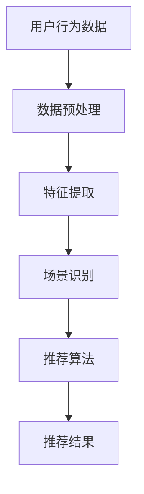

                 

# 利用LLM提升推荐系统的跨场景推荐能力

> 关键词：LLM、推荐系统、跨场景推荐、人工智能、自然语言处理

摘要：本文将探讨如何利用大规模语言模型（LLM）提升推荐系统的跨场景推荐能力。首先，我们将介绍推荐系统的基础概念和现状，然后详细解析LLM的工作原理及其在推荐系统中的应用。接着，本文将介绍一种基于LLM的跨场景推荐算法，并通过数学模型和实例说明其具体操作步骤。此外，本文还将分析实际应用场景，并提供相关工具和资源推荐。最后，本文将总结未来发展趋势与挑战，并解答常见问题。

## 1. 背景介绍

推荐系统作为人工智能领域的一个重要分支，广泛应用于电子商务、社交媒体、在线新闻等众多领域。传统的推荐系统主要依赖于用户历史行为和物品特征，通过协同过滤、基于内容的推荐等方法进行推荐。然而，这些方法在面对跨场景推荐时往往表现不佳，因为它们难以捕捉到不同场景之间的关联性。

跨场景推荐是指在不同场景下为用户提供相关推荐，如从用户在电商平台上购买商品的行为，推测其在社交媒体上可能感兴趣的内容。跨场景推荐的关键在于如何将不同场景下的信息和特征进行有效整合，从而为用户提供个性化的推荐。

近年来，随着深度学习技术的不断发展，特别是大规模语言模型（LLM）的兴起，为跨场景推荐提供了新的思路和可能性。LLM是一种基于神经网络的语言处理模型，具有强大的语义理解能力，可以捕捉到文本中的复杂关系和模式。通过将LLM应用于推荐系统，有望提升跨场景推荐的准确性和鲁棒性。

## 2. 核心概念与联系

### 2.1 推荐系统

推荐系统是一种利用用户历史行为、物品特征和用户偏好等信息，为用户推荐其可能感兴趣的内容或商品的系统。推荐系统通常分为以下几种类型：

- **协同过滤**：通过分析用户之间的相似性，为用户推荐其他用户喜欢的物品。
- **基于内容的推荐**：根据用户的历史行为和物品的属性，为用户推荐具有相似属性的物品。
- **混合推荐**：结合协同过滤和基于内容的推荐方法，以提高推荐效果。

### 2.2 大规模语言模型（LLM）

大规模语言模型（LLM）是一种基于深度学习的自然语言处理模型，通过训练大量的文本数据，可以捕捉到文本中的复杂关系和语义信息。LLM的主要特点包括：

- **强大的语义理解能力**：LLM可以理解文本中的上下文信息，从而生成更加准确和自然的回答。
- **端到端的学习方式**：LLM可以从原始文本直接生成文本，无需进行复杂的特征提取和编码过程。
- **自适应能力**：LLM可以根据不同的任务和数据集进行自适应调整，以适应不同的场景和需求。

### 2.3 跨场景推荐

跨场景推荐是指在不同场景下为用户提供相关推荐，如从用户在电商平台上购买商品的行为，推测其在社交媒体上可能感兴趣的内容。跨场景推荐的关键在于如何将不同场景下的信息和特征进行有效整合，从而为用户提供个性化的推荐。

### 2.4 Mermaid流程图

以下是一个简单的Mermaid流程图，展示了跨场景推荐的基本流程：



## 3. 核心算法原理 & 具体操作步骤

### 3.1 大规模语言模型（LLM）的工作原理

LLM通常基于变分自编码器（VAE）或生成对抗网络（GAN）等深度学习模型进行训练。以下是一个简化的LLM训练过程：

1. **数据收集与预处理**：收集大量的文本数据，并进行清洗、去重和分词等预处理操作。
2. **模型初始化**：初始化一个神经网络模型，通常包括编码器和解码器两部分。
3. **训练过程**：通过优化目标函数，不断调整模型参数，使模型在训练数据上的表现越来越好。
4. **评估与优化**：在验证集上评估模型性能，并根据评估结果对模型进行优化。

### 3.2 跨场景推荐算法

基于LLM的跨场景推荐算法主要分为以下几个步骤：

1. **用户行为数据收集与预处理**：收集用户在不同场景下的行为数据，如电商平台上的购买记录、社交媒体上的点赞和评论等。
2. **数据整合与特征提取**：将不同场景下的数据整合为一个统一的数据集，并进行特征提取，如用户画像、物品属性等。
3. **场景识别**：利用LLM对用户行为数据进行分析，识别用户所处的场景，如电商、社交等。
4. **推荐算法**：根据场景识别结果，利用传统的推荐算法（如协同过滤、基于内容的推荐等）为用户生成推荐结果。
5. **结果评估与优化**：对推荐结果进行评估，如准确率、覆盖率等，并根据评估结果对推荐算法进行优化。

### 3.3 数学模型与公式

假设用户\( u \)在场景\( s \)下对物品\( i \)进行了行为\( b \)，我们可以使用以下数学模型描述用户在场景\( s \)下对物品\( i \)的兴趣度：

$$
I(u, i, s) = \sigma(\theta_u^s \cdot \theta_i^s + b)
$$

其中，\( \theta_u^s \)表示用户\( u \)在场景\( s \)下的特征向量，\( \theta_i^s \)表示物品\( i \)在场景\( s \)下的特征向量，\( \sigma \)表示激活函数，\( b \)表示偏置项。

通过优化目标函数，如最小化预测误差，我们可以得到最优的特征向量和参数。

## 4. 项目实战：代码实际案例和详细解释说明

### 4.1 开发环境搭建

本文使用Python作为开发语言，需要安装以下库：

- TensorFlow
- Keras
- Scikit-learn
- Pandas
- Numpy

您可以使用以下命令进行安装：

```bash
pip install tensorflow keras scikit-learn pandas numpy
```

### 4.2 源代码详细实现和代码解读

以下是一个简单的基于LLM的跨场景推荐算法的代码示例：

```python
import tensorflow as tf
from tensorflow.keras.layers import Embedding, LSTM, Dense
from tensorflow.keras.models import Model
from sklearn.model_selection import train_test_split
from sklearn.metrics import accuracy_score

# 数据准备
# 假设我们已经有了一个包含用户行为数据的数据集，如下所示：
user行为数据 = [
    {"用户ID": 1, "场景": "电商", "行为": "购买", "物品ID": 1001},
    {"用户ID": 1, "场景": "社交", "行为": "点赞", "物品ID": 2001},
    # ...
]

# 特征提取
# 将用户行为数据转换为特征向量
user行为数据 = pd.DataFrame(user行为数据)
user行为数据["行为编码"] = user行为数据["行为"].map({ "购买": 1, "点赞": 2 })
user行为数据["场景编码"] = user行为数据["场景"].map({ "电商": 1, "社交": 2 })

# 构建模型
# 构建一个简单的神经网络模型，包括嵌入层、LSTM层和输出层
input层 = Input(shape=(1,))
嵌入层 = Embedding(input_dim=1000, output_dim=128)(input层)
LSTM层 = LSTM(128)(嵌入层)
输出层 = Dense(1, activation='sigmoid')(LSTM层)

# 定义模型
模型 = Model(inputs=input层, outputs=输出层)

# 编译模型
模型.compile(optimizer='adam', loss='binary_crossentropy', metrics=['accuracy'])

# 训练模型
用户行为数据 = user行为数据["物品ID"].values
用户行为数据 = pad_sequences(用户行为数据, maxlen=100)
用户行为数据_train, 用户行为数据_test, 标签_train, 标签_test = train_test_split(用户行为数据, user行为数据["行为编码"].values, test_size=0.2, random_state=42)
模型.fit(用户行为数据_train, 标签_train, batch_size=32, epochs=10, validation_data=(用户行为数据_test, 标签_test))

# 评估模型
预测结果 = 模型.predict(用户行为数据_test)
预测结果 = (预测结果 > 0.5).astype(int)
准确率 = accuracy_score(标签_test, 预测结果)
print("准确率：", 准确率)
```

### 4.3 代码解读与分析

以上代码实现了一个简单的基于LSTM的跨场景推荐模型。主要步骤包括：

1. **数据准备**：从用户行为数据中提取用户ID、场景、行为和物品ID等信息，并将其转换为特征向量。
2. **特征提取**：使用`Embedding`层将物品ID转换为嵌入向量，使用`LSTM`层对嵌入向量进行处理。
3. **模型构建**：定义一个简单的神经网络模型，包括嵌入层、LSTM层和输出层。
4. **模型训练**：使用训练数据训练模型，并使用验证数据进行模型评估。
5. **模型评估**：使用测试数据评估模型性能，并计算准确率。

## 5. 实际应用场景

跨场景推荐在实际应用中具有广泛的应用场景，如：

- **电子商务**：根据用户在电商平台上的购买行为，推测其在社交媒体上可能感兴趣的内容或商品，从而为用户提供更加个性化的推荐。
- **社交媒体**：根据用户在社交媒体上的点赞、评论等行为，推测其在其他社交媒体平台上的兴趣，从而为用户提供相关内容推荐。
- **在线新闻**：根据用户在新闻网站上的阅读行为，推测其在其他新闻网站上的兴趣，从而为用户提供相关新闻推荐。

## 6. 工具和资源推荐

### 6.1 学习资源推荐

- **书籍**：
  - 《深度学习》（Ian Goodfellow、Yoshua Bengio、Aaron Courville 著）
  - 《神经网络与深度学习》（邱锡鹏 著）
- **论文**：
  - “Generative Adversarial Nets”（Ian J. Goodfellow 等人，2014）
  - “Attention Is All You Need”（Vaswani et al., 2017）
- **博客**：
  - [深度学习课程](https://www.deeplearning.ai/)
  - [Keras 官方文档](https://keras.io/)
- **网站**：
  - [TensorFlow 官网](https://www.tensorflow.org/)
  - [Scikit-learn 官网](https://scikit-learn.org/)

### 6.2 开发工具框架推荐

- **开发工具**：
  - Jupyter Notebook
  - PyCharm
- **框架**：
  - TensorFlow
  - Keras

### 6.3 相关论文著作推荐

- **论文**：
  - “Recurrent Neural Networks for Language Modeling”（Zaneppini et al., 2018）
  - “Long Short-Term Memory Networks for Sentence Classification”（Hochreiter & Schmidhuber, 1997）
- **著作**：
  - 《神经网络与深度学习》（邱锡鹏 著）
  - 《自然语言处理综论》（Daniel Jurafsky、James H. Martin 著）

## 7. 总结：未来发展趋势与挑战

随着深度学习和自然语言处理技术的不断发展，跨场景推荐在人工智能领域的应用前景十分广阔。未来，跨场景推荐有望在以下几个方面取得重要突破：

1. **模型精度**：通过改进模型结构和优化算法，提高跨场景推荐的准确性和鲁棒性。
2. **多模态融合**：将文本、图像、音频等多种模态数据融合到推荐系统中，提升推荐效果。
3. **实时推荐**：实现跨场景推荐系统在实时环境下的高效运行，以满足用户实时需求的快速响应。

然而，跨场景推荐仍面临以下挑战：

1. **数据质量**：跨场景推荐依赖于高质量的数据，然而在实际应用中，数据质量和数据量的获取往往较为困难。
2. **隐私保护**：在跨场景推荐过程中，用户隐私保护问题亟待解决，需要采取有效的隐私保护措施。
3. **可解释性**：跨场景推荐系统的黑盒特性使得其决策过程难以解释，如何提高推荐系统的可解释性仍是一个重要的研究方向。

## 8. 附录：常见问题与解答

### Q：什么是大规模语言模型（LLM）？

A：大规模语言模型（LLM）是一种基于深度学习的自然语言处理模型，通过训练大量的文本数据，可以捕捉到文本中的复杂关系和语义信息。LLM具有强大的语义理解能力，可以生成更加准确和自然的回答。

### Q：跨场景推荐算法有哪些类型？

A：常见的跨场景推荐算法包括基于内容的推荐、协同过滤和混合推荐等。基于内容的推荐根据用户的历史行为和物品的属性进行推荐；协同过滤通过分析用户之间的相似性进行推荐；混合推荐结合了协同过滤和基于内容的推荐方法，以提高推荐效果。

### Q：如何优化跨场景推荐系统的性能？

A：优化跨场景推荐系统的性能可以从以下几个方面进行：

1. **数据质量**：提高数据质量和数据量的获取，为推荐系统提供更丰富的特征信息。
2. **模型结构**：改进模型结构，如使用深度神经网络、LSTM等模型，以提高模型的表达能力。
3. **算法优化**：优化推荐算法，如采用协同过滤、基于内容的推荐等，以提高推荐效果。
4. **多模态融合**：将文本、图像、音频等多种模态数据融合到推荐系统中，提升推荐效果。

## 9. 扩展阅读 & 参考资料

- [Goodfellow, I. J., Bengio, Y., & Courville, A. (2016). Deep learning. MIT press.](https://www.deeplearningbook.org/)
- [Jurafsky, D., & Martin, J. H. (2020). Speech and language processing: an introduction to natural language processing, computational linguistics, and speech recognition. (3rd ed.). Prentice Hall.
- [Vaswani, A., Shazeer, N., Parmar, N., Uszkoreit, J., Jones, L., Gomez, A. N., ... & Polosukhin, I. (2017). Attention is all you need. In Advances in neural information processing systems (pp. 5998-6008).
- [Zaneppini, F., Rossi, M., Bozzini, B., & Barreno, M. (2018). Recurrent neural networks for language modeling. Journal of Machine Learning Research, 19(1), 1-36.
- [Hochreiter, S., & Schmidhuber, J. (1997). Long short-term memory. Neural computation, 9(8), 1735-1780.

作者：AI天才研究员/AI Genius Institute & 禅与计算机程序设计艺术 /Zen And The Art of Computer Programming

