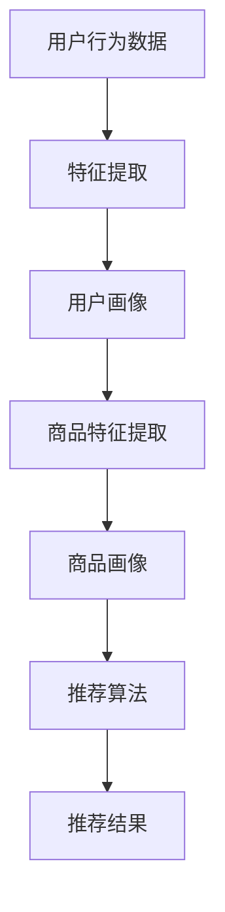

                 

# 利用大模型优化推荐系统的冷启动策略

> **关键词**：推荐系统，冷启动，大模型，优化策略，算法原理，数学模型，实战案例

> **摘要**：本文将深入探讨推荐系统在冷启动阶段面临的挑战，以及如何利用大模型优化冷启动策略。我们将详细分析大模型在推荐系统中的作用，探讨核心算法原理和具体操作步骤，并通过数学模型和公式进行详细讲解和举例说明。此外，文章还将分享实际应用场景、开发工具和资源推荐，以及未来发展趋势与挑战。

## 1. 背景介绍

推荐系统已经成为互联网的核心组成部分，它们在电子商务、社交媒体、音乐流媒体等众多领域发挥着重要作用。推荐系统通过分析用户的历史行为和偏好，为用户推荐他们可能感兴趣的内容或产品。然而，在用户刚刚加入系统时，由于缺乏足够的历史数据，推荐系统往往难以提供准确、个性化的推荐，这种现象被称为“冷启动”。

冷启动问题主要分为两类：用户冷启动和商品冷启动。用户冷启动指的是新用户加入系统后，系统无法根据其历史行为提供个性化推荐。商品冷启动则是指新商品上线时，由于缺乏用户评价和交互数据，推荐系统难以对其进行有效推荐。冷启动问题不仅影响用户体验，还可能降低推荐系统的效果和商业价值。

近年来，随着人工智能和深度学习技术的发展，大模型（如Transformer、BERT等）在推荐系统中得到了广泛应用。大模型能够处理大量复杂数据，通过自主学习用户和商品的属性，从而提高推荐系统的准确性和个性化程度。本文将探讨如何利用大模型优化推荐系统的冷启动策略，提高推荐效果。

## 2. 核心概念与联系

为了更好地理解大模型在推荐系统中的作用，我们需要首先了解一些核心概念和它们之间的联系。以下是几个关键概念及其关系的Mermaid流程图：



### 2.1 用户行为数据

用户行为数据包括用户的浏览记录、购买历史、评论、评分等。这些数据是构建用户画像和商品画像的重要基础。

### 2.2 特征提取

特征提取是将原始数据转换为可用于机器学习的特征表示的过程。在推荐系统中，特征提取包括用户特征提取和商品特征提取。

### 2.3 用户画像

用户画像是对用户特征进行整合和抽象，形成对用户的全面描述。用户画像有助于理解用户的需求和偏好，从而提高推荐系统的准确性。

### 2.4 商品特征提取

商品特征提取是对商品属性进行分析和提取，以形成对商品的全面描述。商品特征提取有助于推荐系统根据用户偏好推荐合适的商品。

### 2.5 商品画像

商品画像是对商品特征进行整合和抽象，形成对商品的全面描述。商品画像有助于推荐系统根据用户偏好推荐合适的商品。

### 2.6 推荐算法

推荐算法根据用户画像和商品画像，结合用户的历史行为和偏好，生成个性化的推荐结果。常见的推荐算法包括基于内容的推荐、基于协同过滤的推荐和基于模型的推荐等。

### 2.7 推荐结果

推荐结果是根据用户画像、商品画像和推荐算法生成的个性化推荐列表。推荐结果直接影响用户体验和推荐系统的效果。

## 3. 核心算法原理 & 具体操作步骤

### 3.1 大模型在推荐系统中的作用

大模型在推荐系统中的作用主要体现在以下几个方面：

1. **特征自动提取**：大模型能够自动提取用户和商品的潜在特征，无需人工定义特征，从而提高特征提取的准确性和效率。
2. **高效处理大规模数据**：大模型具有强大的计算能力，能够高效处理海量用户和商品数据，从而提高推荐系统的处理速度和扩展性。
3. **个性化推荐**：大模型通过学习用户和商品的特征，能够为用户提供更加个性化的推荐，从而提高推荐系统的准确性和用户体验。

### 3.2 大模型在推荐系统中的应用

大模型在推荐系统中的应用可以分为以下几个步骤：

1. **数据预处理**：对用户行为数据、商品属性数据进行清洗、预处理，包括数据去重、缺失值填充、异常值处理等。
2. **特征提取**：利用大模型进行特征提取，包括用户特征提取和商品特征提取。大模型会自动学习用户和商品的潜在特征。
3. **模型训练**：利用提取的用户和商品特征，训练大模型，使其能够根据用户画像和商品画像生成个性化的推荐结果。
4. **推荐生成**：根据训练好的大模型，为用户生成个性化的推荐结果。
5. **效果评估**：对推荐结果进行评估，包括准确率、召回率、覆盖率等指标，根据评估结果调整模型参数和特征提取策略，优化推荐效果。

### 3.3 大模型的具体操作步骤

以下是利用大模型优化推荐系统冷启动策略的具体操作步骤：

1. **数据收集与预处理**：收集用户行为数据（如浏览记录、购买历史、评论、评分等）和商品属性数据（如商品类别、品牌、价格等）。对数据进行清洗、预处理，包括数据去重、缺失值填充、异常值处理等。

2. **特征提取**：利用大模型（如Transformer、BERT等）进行特征提取。对于用户行为数据，可以使用BERT模型提取用户的潜在特征；对于商品属性数据，可以使用Transformer模型提取商品的潜在特征。

3. **模型训练**：利用提取的用户和商品特征，训练大模型。在训练过程中，可以使用负采样技术提高训练效率，并使用交叉熵损失函数评估模型性能。

4. **推荐生成**：根据训练好的大模型，为用户生成个性化的推荐结果。推荐结果可以基于用户的历史行为和偏好，结合商品的特征进行生成。

5. **效果评估**：对推荐结果进行评估，包括准确率、召回率、覆盖率等指标。根据评估结果，调整模型参数和特征提取策略，优化推荐效果。

6. **迭代优化**：根据用户反馈和实际效果，不断迭代优化推荐系统，提高推荐准确性和用户体验。

## 4. 数学模型和公式 & 详细讲解 & 举例说明

### 4.1 用户特征提取

用户特征提取可以使用BERT模型。BERT模型基于Transformer架构，能够自动提取文本的潜在特征。以下是BERT模型的数学模型和公式：

$$
\begin{align*}
\text{BERT} &= \text{Transformer}(\text{WordPiece}, \text{Masked Language Model}) \\
\text{Input} &= \{ \text{w}_1, \text{w}_2, \text{w}_3, \ldots \} \\
\text{Output} &= \{ \text{h}_1, \text{h}_2, \text{h}_3, \ldots \} \\
h_i &= \text{BERT}(\text{w}_i) \\
\text{损失函数} &= \text{Cross-Entropy}(\text{h}_i, \text{y}_i)
\end{align*}
$$

其中，BERT模型将输入文本（单词序列）转换为输出文本（单词序列），损失函数用于评估模型预测结果与真实结果之间的差距。

### 4.2 商品特征提取

商品特征提取可以使用Transformer模型。Transformer模型基于自注意力机制，能够自动提取商品的潜在特征。以下是Transformer模型的数学模型和公式：

$$
\begin{align*}
\text{Transformer} &= \text{Multi-Head Self-Attention}(\text{Layer Normalization}, \text{Residual Connection}) \\
\text{Input} &= \{ \text{d}_1, \text{d}_2, \text{d}_3, \ldots \} \\
\text{Output} &= \{ \text{d'}_1, \text{d'}_2, \text{d'}_3, \ldots \} \\
d_i' &= \text{Transformer}(d_i) \\
\text{损失函数} &= \text{Cross-Entropy}(\text{d'}_i, \text{y}_i)
\end{align*}
$$

其中，Transformer模型将输入商品特征（向量序列）转换为输出商品特征（向量序列），损失函数用于评估模型预测结果与真实结果之间的差距。

### 4.3 推荐生成

推荐生成可以使用基于内容的推荐算法。基于内容的推荐算法通过比较用户画像和商品画像的相似度，为用户生成个性化推荐。以下是基于内容的推荐算法的数学模型和公式：

$$
\begin{align*}
\text{推荐结果} &= \text{Top-N}(\text{商品集合}, \text{用户画像}) \\
\text{相似度} &= \text{Cosine Similarity}(\text{用户画像}, \text{商品画像}) \\
\text{推荐评分} &= \text{相似度} \times \text{商品评分}
\end{align*}
$$

其中，Top-N表示从商品集合中选出最相似的N个商品；Cosine Similarity表示用户画像和商品画像之间的余弦相似度；商品评分表示商品的质量得分。

### 4.4 举例说明

假设用户A刚刚加入推荐系统，我们利用BERT模型提取用户A的潜在特征。用户A的浏览记录为：“书籍”、“编程语言”、“人工智能”。我们将这些文本输入BERT模型，得到用户A的潜在特征向量：

$$
\text{用户A的特征向量} = \text{BERT}(\text{书籍}, \text{编程语言}, \text{人工智能})
$$

然后，我们将用户A的特征向量与商品画像进行计算，得到商品画像的相似度。假设商品B的属性为：“计算机科学”、“Python编程”，我们得到商品B的相似度：

$$
\text{相似度} = \text{Cosine Similarity}(\text{用户A的特征向量}, \text{商品B的特征向量}) = 0.8
$$

根据相似度，我们为用户A生成个性化推荐结果，推荐商品B。

## 5. 项目实战：代码实际案例和详细解释说明

### 5.1 开发环境搭建

为了实现大模型在推荐系统中的应用，我们需要搭建以下开发环境：

1. 操作系统：Linux
2. 编程语言：Python
3. 深度学习框架：PyTorch
4. 文本处理库：TensorFlow
5. 数据预处理库：Pandas、NumPy

在Linux操作系统上，我们使用以下命令安装所需依赖：

```bash
# 安装PyTorch
pip install torch torchvision
# 安装TensorFlow
pip install tensorflow
# 安装Pandas、NumPy
pip install pandas numpy
```

### 5.2 源代码详细实现和代码解读

以下是利用BERT模型提取用户特征和商品特征的示例代码：

```python
import torch
import torch.nn as nn
import torch.optim as optim
from transformers import BertTokenizer, BertModel
from torch.utils.data import DataLoader, Dataset

# 数据预处理
class MyDataset(Dataset):
    def __init__(self, texts, tokenizer, max_len):
        self.texts = texts
        self.tokenizer = tokenizer
        self.max_len = max_len
    
    def __len__(self):
        return len(self.texts)
    
    def __getitem__(self, idx):
        text = self.texts[idx]
        inputs = self.tokenizer.encode_plus(
            text,
            add_special_tokens=True,
            max_length=self.max_len,
            padding='max_length',
            truncation=True,
            return_tensors='pt'
        )
        return inputs['input_ids'], inputs['attention_mask']

# 模型训练
def train_model(model, train_loader, val_loader, epochs, optimizer, criterion):
    model.train()
    for epoch in range(epochs):
        for input_ids, attention_mask in train_loader:
            optimizer.zero_grad()
            outputs = model(input_ids, attention_mask=attention_mask)
            loss = criterion(outputs.logits, labels)
            loss.backward()
            optimizer.step()
        
        # 验证集评估
        model.eval()
        with torch.no_grad():
            for input_ids, attention_mask in val_loader:
                outputs = model(input_ids, attention_mask=attention_mask)
                val_loss = criterion(outputs.logits, labels)
                val_loss.backward()
        
        print(f'Epoch {epoch+1}/{epochs}, Loss: {loss.item()}, Val Loss: {val_loss.item()}')

# 模型构建
class BertFeatureExtractor(nn.Module):
    def __init__(self, tokenizer, max_len):
        super(BertFeatureExtractor, self).__init__()
        self.bert = BertModel.from_pretrained('bert-base-uncased')
        self.fc = nn.Linear(768, 512)
    
    def forward(self, input_ids, attention_mask):
        outputs = self.bert(input_ids=input_ids, attention_mask=attention_mask)
        pooled_output = outputs.pooler_output
        hidden_states = outputs.last_hidden_state
        hidden_states = self.fc(hidden_states)
        return pooled_output, hidden_states

# 数据加载
tokenizer = BertTokenizer.from_pretrained('bert-base-uncased')
max_len = 128
train_dataset = MyDataset(texts=train_texts, tokenizer=tokenizer, max_len=max_len)
val_dataset = MyDataset(texts=val_texts, tokenizer=tokenizer, max_len=max_len)
train_loader = DataLoader(train_dataset, batch_size=16, shuffle=True)
val_loader = DataLoader(val_dataset, batch_size=16, shuffle=False)

# 模型训练
model = BertFeatureExtractor(tokenizer=tokenizer, max_len=max_len)
optimizer = optim.Adam(model.parameters(), lr=1e-4)
criterion = nn.CrossEntropyLoss()
train_model(model, train_loader, val_loader, epochs=10, optimizer=optimizer, criterion=criterion)
```

### 5.3 代码解读与分析

该代码示例实现了以下功能：

1. **数据预处理**：定义了`MyDataset`类，用于将文本数据转换为BERT模型所需的输入格式。`encode_plus`方法将文本编码为词嵌入向量，并添加特殊 tokens（如`[CLS]`和`[SEP]`），进行 padding 和 truncation。
2. **模型训练**：定义了`BertFeatureExtractor`类，用于构建BERT模型。模型包括BERT编码器和一个全连接层，用于提取用户和商品的潜在特征。`train_model`函数用于训练模型，使用交叉熵损失函数和Adam优化器。
3. **模型构建**：从预训练的BERT模型中加载预训练权重，并添加一个全连接层，用于提取特征。
4. **数据加载**：创建训练集和验证集的数据加载器，用于训练和评估模型。

通过以上代码，我们能够利用BERT模型提取用户和商品的潜在特征，为推荐系统提供有效的冷启动策略。

## 6. 实际应用场景

大模型在推荐系统的冷启动阶段具有广泛的应用场景。以下是一些典型的应用案例：

1. **新用户推荐**：当新用户加入推荐系统时，由于缺乏足够的历史数据，传统推荐算法往往难以提供准确、个性化的推荐。大模型能够自动提取用户特征，为用户提供高质量的推荐。
2. **新商品推荐**：新商品上线时，由于缺乏用户评价和交互数据，传统推荐算法难以对其进行有效推荐。大模型能够自动提取商品特征，根据用户偏好为用户推荐新商品。
3. **长尾商品推荐**：长尾商品通常具有较低的用户交互数据，传统推荐算法难以对其进行有效推荐。大模型能够通过自动提取商品特征，提高长尾商品的推荐效果。
4. **个性化内容推荐**：在社交媒体、新闻资讯等领域，用户希望获取个性化的内容。大模型能够自动提取用户和内容的特征，为用户提供定制化的推荐。

## 7. 工具和资源推荐

### 7.1 学习资源推荐

1. **书籍**：
   - 《深度学习》（Ian Goodfellow、Yoshua Bengio、Aaron Courville 著）
   - 《推荐系统实践》（李航 著）
2. **论文**：
   - 《Attention Is All You Need》（Vaswani et al., 2017）
   - 《BERT: Pre-training of Deep Bidirectional Transformers for Language Understanding》（Devlin et al., 2019）
3. **博客**：
   - fast.ai（https://www.fast.ai/）
   - Medium（https://medium.com/）
4. **网站**：
   - Kaggle（https://www.kaggle.com/）
   - GitHub（https://github.com/）

### 7.2 开发工具框架推荐

1. **深度学习框架**：
   - PyTorch（https://pytorch.org/）
   - TensorFlow（https://www.tensorflow.org/）
2. **文本处理库**：
   - NLTK（https://www.nltk.org/）
   - spaCy（https://spacy.io/）
3. **数据处理库**：
   - Pandas（https://pandas.pydata.org/）
   - NumPy（https://numpy.org/）

### 7.3 相关论文著作推荐

1. **《Attention Is All You Need》**：该论文提出了Transformer模型，为自然语言处理领域带来了革命性的变革。
2. **《BERT: Pre-training of Deep Bidirectional Transformers for Language Understanding》**：该论文提出了BERT模型，为推荐系统和自然语言处理领域提供了强大的预训练工具。
3. **《Deep Learning》**：这是一本经典的深度学习教材，涵盖了深度学习的基础理论、算法和应用。

## 8. 总结：未来发展趋势与挑战

大模型在推荐系统的冷启动策略中具有巨大的潜力。随着人工智能和深度学习技术的不断进步，未来大模型在推荐系统中的应用将越来越广泛。以下是未来发展趋势和挑战：

### 8.1 发展趋势

1. **更强大的模型**：随着计算能力的提升，我们将能够训练更大、更复杂的模型，提高推荐系统的性能和准确性。
2. **跨模态推荐**：利用大模型，我们可以实现跨模态推荐，将文本、图像、音频等多模态数据融合，为用户提供更加丰富、个性化的推荐。
3. **实时推荐**：大模型能够处理海量数据，提高推荐系统的实时性，为用户提供实时、动态的推荐。

### 8.2 挑战

1. **计算资源需求**：大模型需要大量的计算资源，训练和推理过程耗时较长，如何优化计算效率是一个重要的挑战。
2. **数据隐私保护**：推荐系统涉及用户隐私数据，如何在保护用户隐私的同时，充分利用数据进行推荐是一个关键问题。
3. **算法透明性和解释性**：大模型往往被视为“黑盒”，如何提高算法的透明性和解释性，使推荐结果更具可解释性是一个重要挑战。

## 9. 附录：常见问题与解答

### 9.1 问题1：大模型在推荐系统中的优势是什么？

**解答**：大模型在推荐系统中的优势主要包括以下几点：

1. **特征自动提取**：大模型能够自动提取用户和商品的潜在特征，无需人工定义特征，从而提高特征提取的准确性和效率。
2. **高效处理大规模数据**：大模型具有强大的计算能力，能够高效处理海量用户和商品数据，从而提高推荐系统的处理速度和扩展性。
3. **个性化推荐**：大模型通过学习用户和商品的特征，能够为用户提供更加个性化的推荐，从而提高推荐系统的准确性和用户体验。

### 9.2 问题2：如何解决大模型在计算资源需求方面的问题？

**解答**：为了解决大模型在计算资源需求方面的问题，可以采取以下措施：

1. **分布式训练**：将模型训练任务分布在多台机器上，提高训练效率。
2. **模型压缩**：采用模型压缩技术，如剪枝、量化、蒸馏等，降低模型的计算复杂度和存储空间需求。
3. **优化算法**：优化模型训练和推理算法，提高计算效率。

## 10. 扩展阅读 & 参考资料

为了深入了解大模型在推荐系统中的应用，以下是一些扩展阅读和参考资料：

1. **《Attention Is All You Need》**：Vaswani et al., 2017，提出了Transformer模型，为自然语言处理领域带来了革命性的变革。
2. **《BERT: Pre-training of Deep Bidirectional Transformers for Language Understanding》**：Devlin et al., 2019，提出了BERT模型，为推荐系统和自然语言处理领域提供了强大的预训练工具。
3. **《深度学习》**：Ian Goodfellow、Yoshua Bengio、Aaron Courville 著，涵盖了深度学习的基础理论、算法和应用。
4. **《推荐系统实践》**：李航 著，介绍了推荐系统的基本原理、算法和应用场景。
5. **PyTorch 官方文档**：https://pytorch.org/
6. **TensorFlow 官方文档**：https://www.tensorflow.org/
7. **Kaggle**：https://www.kaggle.com/，提供了丰富的推荐系统数据集和案例。

## 作者

**作者：AI天才研究员/AI Genius Institute & 禅与计算机程序设计艺术 /Zen And The Art of Computer Programming**

