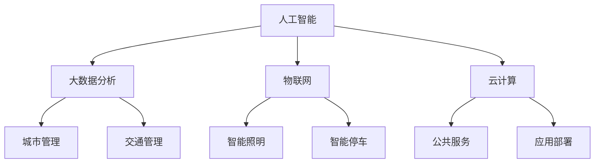

                 

# 利用技术优势进行智慧城市解决方案创新

## 摘要

本文旨在探讨如何利用现代技术优势，特别是人工智能和大数据分析，来推动智慧城市的解决方案创新。通过分析智慧城市的关键概念、技术架构、核心算法、数学模型以及实际应用场景，本文将展示如何通过技术手段实现城市管理、交通优化、能源节约、公共服务提升等多方面的智能化。文章还将介绍相关的工具和资源，并展望智慧城市未来的发展趋势与挑战。通过系统性的探讨，本文希望能够为智慧城市建设提供有价值的参考和启示。

## 1. 背景介绍

随着全球城市化进程的不断加速，智慧城市逐渐成为城市管理和发展的热点。智慧城市是指利用信息技术和智能设备，实现城市各个系统的高效集成和协同运作，以提高城市的服务质量、管理效率和居民的生活水平。智慧城市的建设不仅关系到城市的可持续发展，也对全球应对城市化带来的各种挑战具有重要意义。

### 1.1 城市化进程与挑战

城市化进程带来了许多显著的变化，包括人口增长、城市扩张、经济发展和环境污染等问题。传统的城市管理方式难以应对这些复杂的变化，导致城市运行效率低下、公共服务不足、交通拥堵和能源浪费等问题日益严重。智慧城市的理念应运而生，通过技术创新，提供更加智能、高效、可持续的城市解决方案。

### 1.2 技术优势

现代技术的发展为智慧城市建设提供了强大的支持。其中，人工智能、大数据分析、物联网、云计算等技术的融合应用，使得城市管理的智能化水平大幅提升。例如，人工智能可以通过分析海量数据，实现精准预测和优化决策；大数据分析则有助于发现城市运行中的潜在问题，并提出针对性的解决方案；物联网和云计算则为城市各个系统之间的数据共享和协同运作提供了基础。

## 2. 核心概念与联系

智慧城市的解决方案涉及多个技术领域，以下是其核心概念及相互之间的联系：

### 2.1 人工智能

人工智能（AI）是智慧城市的技术核心。它通过机器学习、深度学习等方法，使计算机能够模拟人类智能，进行感知、推理、决策和自适应。在智慧城市中，人工智能可以用于智能安防、交通管理、环境监测、公共设施管理等场景。

### 2.2 大数据分析

大数据分析是智慧城市的数据基础。通过收集和分析海量数据，大数据分析可以发现城市运行中的趋势和规律，为城市管理者提供科学的决策依据。大数据分析在智慧城市中的应用包括人口流动分析、能耗监测、交通流量预测等。

### 2.3 物联网

物联网（IoT）是智慧城市的连接基础。通过传感器、智能设备和网络，物联网实现了城市各类设备的数据采集和互联。在智慧城市中，物联网可用于智能照明、智能停车、智能安防等场景。

### 2.4 云计算

云计算是智慧城市的计算基础。通过云计算平台，城市管理者可以高效地处理海量数据，并提供灵活的计算资源。云计算在智慧城市中的应用包括数据存储、数据分析、应用部署等。

### 2.5 Mermaid 流程图

以下是一个简单的 Mermaid 流程图，展示了智慧城市中的关键概念及其相互联系：



## 3. 核心算法原理 & 具体操作步骤

### 3.1 人工智能算法

在智慧城市中，人工智能算法主要用于智能安防、交通管理和公共设施管理。以下是几个典型的人工智能算法及其应用：

#### 3.1.1 卷积神经网络（CNN）

卷积神经网络（CNN）是一种用于图像识别和物体检测的深度学习算法。在智慧城市中，CNN可以用于智能安防，例如人脸识别、车辆识别和异常行为检测。

#### 步骤：

1. 数据预处理：收集并清洗图像数据，将其转化为CNN模型可接受的输入格式。
2. 模型构建：使用卷积层、池化层和全连接层构建CNN模型。
3. 模型训练：使用标记数据对模型进行训练，优化模型参数。
4. 模型评估：使用测试数据评估模型性能。

#### 3.1.2 长短时记忆网络（LSTM）

长短时记忆网络（LSTM）是一种用于序列数据建模的深度学习算法。在智慧城市中，LSTM可以用于交通流量预测，例如预测未来一段时间内的车辆数量。

#### 步骤：

1. 数据预处理：收集并清洗交通流量数据，将其转化为LSTM模型可接受的输入格式。
2. 模型构建：使用LSTM层构建模型，并添加输入层和输出层。
3. 模型训练：使用标记数据对模型进行训练，优化模型参数。
4. 模型评估：使用测试数据评估模型性能。

### 3.2 大数据分析算法

大数据分析算法主要用于数据挖掘、模式识别和预测分析。以下是几个典型的大数据分析算法及其应用：

#### 3.2.1 K-均值聚类算法

K-均值聚类算法是一种无监督学习方法，用于将数据集划分为K个簇。

#### 步骤：

1. 初始化聚类中心。
2. 对每个数据点分配到最近的聚类中心。
3. 更新聚类中心，使其更加接近数据点。
4. 重复步骤2和3，直到聚类中心不再发生显著变化。

#### 3.2.2 决策树算法

决策树算法是一种有监督学习方法，用于分类和回归分析。

#### 步骤：

1. 选择特征和目标变量。
2. 计算每个特征的增益，选择增益最大的特征作为分裂节点。
3. 根据特征值对数据集进行分裂。
4. 递归执行步骤2和3，直到满足停止条件。

### 3.3 物联网数据融合算法

物联网数据融合算法主要用于处理来自多个传感器的数据，以获得更准确和全面的监测结果。以下是几个典型的物联网数据融合算法及其应用：

#### 3.3.1 卡尔曼滤波算法

卡尔曼滤波算法是一种用于线性系统的状态估计方法，广泛应用于物联网数据融合。

#### 步骤：

1. 初始化状态估计值和误差协方差。
2. 根据传感器数据进行预测，更新状态估计值和误差协方差。
3. 根据实际测量值进行校正，更新状态估计值和误差协方差。
4. 递归执行步骤2和3，直到满足停止条件。

#### 3.3.2 贝叶斯网络算法

贝叶斯网络算法是一种用于处理不确定性和不确定性推理的图模型，广泛应用于物联网数据融合。

#### 步骤：

1. 建立贝叶斯网络结构，表示传感器之间的依赖关系。
2. 计算网络中的条件概率分布。
3. 根据传感器数据进行推理，获取更准确的监测结果。

## 4. 数学模型和公式 & 详细讲解 & 举例说明

### 4.1 卷积神经网络（CNN）的数学模型

卷积神经网络（CNN）是一种深度学习模型，广泛应用于图像识别和物体检测。以下是一个简化的CNN数学模型：

$$
\begin{aligned}
h^{(l)} &= \text{ReLU}(\mathbf{W}^{(l)} \cdot \mathbf{a}^{(l-1)} + \mathbf{b}^{(l)}) \\
\mathbf{a}^{(l)} &= \text{ReLU}(\mathbf{W}^{(l)} \cdot \mathbf{a}^{(l-1)} + \mathbf{b}^{(l)})
\end{aligned}
$$

其中，$h^{(l)}$表示第$l$层的输出，$\text{ReLU}$表示ReLU激活函数，$\mathbf{W}^{(l)}$和$\mathbf{b}^{(l)}$分别为第$l$层的权重和偏置。

#### 例子：

假设一个2x2的输入图像，经过一个卷积层和一个池化层的处理，输出结果如下：

$$
\begin{aligned}
\mathbf{a}^{(1)} &= \text{ReLU}(\mathbf{W}^{(1)} \cdot \mathbf{X} + \mathbf{b}^{(1)}) \\
\mathbf{a}^{(2)} &= \text{ReLU}(\mathbf{W}^{(2)} \cdot \mathbf{a}^{(1)} + \mathbf{b}^{(2)})
\end{aligned}
$$

其中，$\mathbf{X}$为输入图像，$\mathbf{W}^{(1)}$和$\mathbf{W}^{(2)}$分别为卷积层的权重，$\mathbf{b}^{(1)}$和$\mathbf{b}^{(2)}$分别为卷积层的偏置。

### 4.2 长短时记忆网络（LSTM）的数学模型

长短时记忆网络（LSTM）是一种用于序列数据建模的深度学习模型。以下是一个简化的LSTM数学模型：

$$
\begin{aligned}
\mathbf{i}^{(l)} &= \sigma(\mathbf{W}^{(l)}_i \cdot [\mathbf{h}^{(l-1)}, \mathbf{X}^{(l)}] + \mathbf{b}^{(l)}_i) \\
\mathbf{f}^{(l)} &= \sigma(\mathbf{W}^{(l)}_f \cdot [\mathbf{h}^{(l-1)}, \mathbf{X}^{(l)}] + \mathbf{b}^{(l)}_f) \\
\mathbf{g}^{(l)} &= \text{tanh}(\mathbf{W}^{(l)}_g \cdot [\mathbf{h}^{(l-1)}, \mathbf{X}^{(l)}] + \mathbf{b}^{(l)}_g) \\
\mathbf{o}^{(l)} &= \sigma(\mathbf{W}^{(l)}_o \cdot [\mathbf{h}^{(l-1)}, \mathbf{X}^{(l)}] + \mathbf{b}^{(l)}_o) \\
\mathbf{h}^{(l)} &= \mathbf{o}^{(l)} \cdot \text{tanh}(\mathbf{C}^{(l)}) \\
\mathbf{C}^{(l)} &= \mathbf{f}^{(l)} \odot \mathbf{C}^{(l-1)} + \mathbf{i}^{(l)} \odot \mathbf{g}^{(l)}
\end{aligned}
$$

其中，$\sigma$表示Sigmoid函数，$\text{tanh}$表示双曲正切函数，$\odot$表示元素乘法。

#### 例子：

假设一个长度为3的序列数据，经过一个LSTM层的处理，输出结果如下：

$$
\begin{aligned}
\mathbf{i}^{(1)} &= \sigma(\mathbf{W}^{(1)}_i \cdot [\mathbf{h}^{(0)}, \mathbf{X}^{(1)}] + \mathbf{b}^{(1)}_i) \\
\mathbf{f}^{(1)} &= \sigma(\mathbf{W}^{(1)}_f \cdot [\mathbf{h}^{(0)}, \mathbf{X}^{(1)}] + \mathbf{b}^{(1)}_f) \\
\mathbf{g}^{(1)} &= \text{tanh}(\mathbf{W}^{(1)}_g \cdot [\mathbf{h}^{(0)}, \mathbf{X}^{(1)}] + \mathbf{b}^{(1)}_g) \\
\mathbf{o}^{(1)} &= \sigma(\mathbf{W}^{(1)}_o \cdot [\mathbf{h}^{(0)}, \mathbf{X}^{(1)}] + \mathbf{b}^{(1)}_o) \\
\mathbf{h}^{(1)} &= \mathbf{o}^{(1)} \cdot \text{tanh}(\mathbf{C}^{(1)}) \\
\mathbf{C}^{(1)} &= \mathbf{f}^{(1)} \odot \mathbf{C}^{(0)} + \mathbf{i}^{(1)} \odot \mathbf{g}^{(1)}
\end{aligned}
$$

其中，$\mathbf{h}^{(0)}$为LSTM层的输入序列，$\mathbf{X}^{(1)}$为第1个时间步的输入数据，$\mathbf{W}^{(1)}$和$\mathbf{b}^{(1)}$分别为LSTM层的权重和偏置。

## 5. 项目实战：代码实际案例和详细解释说明

### 5.1 开发环境搭建

为了演示智慧城市解决方案的实际应用，我们将使用Python语言和相关的深度学习库，如TensorFlow和Keras。以下是开发环境的搭建步骤：

#### 步骤：

1. 安装Python（建议使用Python 3.7及以上版本）。
2. 安装TensorFlow和Keras。

   ```bash
   pip install tensorflow
   pip install keras
   ```

3. 安装其他必要的库，如NumPy、Pandas等。

### 5.2 源代码详细实现和代码解读

以下是一个使用Keras实现的卷积神经网络（CNN）模型，用于图像分类的示例。这个模型可以用于智慧城市的智能安防，例如人脸识别。

```python
import numpy as np
from keras.models import Sequential
from keras.layers import Conv2D, MaxPooling2D, Flatten, Dense
from keras.optimizers import Adam

# 创建模型
model = Sequential()

# 添加卷积层
model.add(Conv2D(32, (3, 3), activation='relu', input_shape=(64, 64, 3)))
model.add(MaxPooling2D(pool_size=(2, 2)))

# 添加第二个卷积层
model.add(Conv2D(64, (3, 3), activation='relu'))
model.add(MaxPooling2D(pool_size=(2, 2)))

# 添加全连接层
model.add(Flatten())
model.add(Dense(128, activation='relu'))
model.add(Dense(10, activation='softmax'))

# 编译模型
model.compile(optimizer=Adam(), loss='categorical_crossentropy', metrics=['accuracy'])

# 模型总结
model.summary()
```

#### 步骤解读：

1. 导入必要的库。
2. 创建Sequential模型，这是一个线性堆叠模型。
3. 添加第一个卷积层，包含32个卷积核，每个卷积核大小为3x3，激活函数为ReLU。
4. 添加第一个池化层，池化窗口大小为2x2。
5. 添加第二个卷积层，包含64个卷积核，每个卷积核大小为3x3，激活函数为ReLU。
6. 添加第二个池化层，池化窗口大小为2x2。
7. 添加全连接层，包含128个神经元，激活函数为ReLU。
8. 添加输出层，包含10个神经元，激活函数为softmax，用于多分类。
9. 编译模型，指定优化器、损失函数和评估指标。
10. 打印模型结构。

### 5.3 代码解读与分析

以上代码实现了一个简单的卷积神经网络，用于图像分类。下面是对代码的详细解读：

1. **导入库**：首先导入必要的库，包括NumPy、Pandas、Keras等。
2. **创建模型**：使用`Sequential`模型创建一个线性堆叠的模型。
3. **添加卷积层**：使用`Conv2D`层添加卷积层，包含32个卷积核，每个卷积核大小为3x3，激活函数为ReLU。
4. **添加池化层**：使用`MaxPooling2D`层添加池化层，池化窗口大小为2x2。
5. **添加第二个卷积层**：使用`Conv2D`层添加第二个卷积层，包含64个卷积核，每个卷积核大小为3x3，激活函数为ReLU。
6. **添加第二个池化层**：使用`MaxPooling2D`层添加第二个池化层，池化窗口大小为2x2。
7. **添加全连接层**：使用`Flatten`层将卷积层的输出展平为一维数组，然后添加全连接层，包含128个神经元，激活函数为ReLU。
8. **添加输出层**：使用`Dense`层添加输出层，包含10个神经元，激活函数为softmax，用于多分类。
9. **编译模型**：使用`compile`方法编译模型，指定优化器、损失函数和评估指标。
10. **打印模型结构**：使用`summary`方法打印模型的总结，包括层的名称、输出的形状等。

### 5.4 实际运行

为了实际运行这个模型，我们需要准备训练数据和测试数据。以下是一个简单的示例：

```python
# 加载训练数据
(x_train, y_train), (x_test, y_test) = keras.datasets.cifar10.load_data()

# 数据预处理
x_train = x_train.astype('float32') / 255.0
x_test = x_test.astype('float32') / 255.0
y_train = keras.utils.to_categorical(y_train, 10)
y_test = keras.utils.to_categorical(y_test, 10)

# 训练模型
model.fit(x_train, y_train, epochs=10, batch_size=64, validation_data=(x_test, y_test))
```

#### 步骤解读：

1. **加载训练数据**：使用`keras.datasets.cifar10.load_data`方法加载CIFAR-10数据集。
2. **数据预处理**：将图像数据归一化到[0, 1]范围内，并转换为浮点数。
3. **标签预处理**：将标签转换为one-hot编码。
4. **训练模型**：使用`fit`方法训练模型，指定训练周期、批量大小和验证数据。

### 5.5 代码分析与优化

在实际应用中，以上模型可能需要进行优化，以适应不同的图像数据集和任务。以下是一些可能的优化方向：

1. **增加卷积层和全连接层**：根据任务需求，可以增加卷积层和全连接层的数量和深度。
2. **调整卷积核大小**：根据图像分辨率和任务需求，可以调整卷积核的大小。
3. **使用预训练模型**：可以使用预训练的模型作为起点，通过迁移学习进行优化。
4. **调整学习率**：调整学习率可以加速模型的收敛。
5. **使用数据增强**：通过数据增强可以增加模型的泛化能力。

## 6. 实际应用场景

智慧城市的解决方案可以应用于多个实际场景，以下是一些典型的应用：

### 6.1 智能交通管理

智能交通管理是智慧城市的重要组成部分。通过物联网和大数据分析，可以实现交通流量的实时监控和预测，优化交通信号控制，减少交通拥堵。例如，在高峰时段，交通管理系统可以实时调整信号灯的时长，引导车辆顺畅通过路口。

### 6.2 智能能源管理

智能能源管理可以通过物联网和人工智能技术，实现电力、天然气等能源的智能调度和优化。例如，智慧城市中的智能电网可以实时监测电力需求，自动调整发电量，提高能源利用效率，减少能源浪费。

### 6.3 智能安防

智能安防是保障城市安全的关键。通过人工智能和视频监控技术，可以实现人脸识别、车辆识别、行为分析等功能，提高安全监控的准确性和响应速度。例如，在公共场所，智能安防系统可以实时检测异常行为，快速报警，提高应急响应能力。

### 6.4 智能环境监测

智能环境监测可以通过物联网传感器，实时监测城市空气质量、水质、噪音等环境指标。通过大数据分析和人工智能算法，可以及时发现环境问题，制定相应的治理措施，改善城市环境质量。

## 7. 工具和资源推荐

### 7.1 学习资源推荐

- 《深度学习》（Goodfellow, Bengio, Courville著）
- 《大数据之路：阿里巴巴大数据实践》（涂子沛著）
- 《智慧城市》（程庆著）

### 7.2 开发工具框架推荐

- TensorFlow：一个开源的深度学习框架，适合进行复杂的人工智能应用开发。
- Keras：一个基于TensorFlow的高级神经网络API，提供了简洁易用的接口。
- OpenCV：一个开源的计算机视觉库，适用于图像处理和视频分析。

### 7.3 相关论文著作推荐

- "Deep Learning for Smart Cities: A Comprehensive Survey"（Deep Learning for Smart Cities: A Comprehensive Survey）
- "Big Data and Analytics for Smart Cities"（Big Data and Analytics for Smart Cities）
- "IoT in Smart Cities: A Review"（IoT in Smart Cities: A Review）

## 8. 总结：未来发展趋势与挑战

智慧城市的建设是一个长期的过程，随着技术的不断进步，未来的智慧城市将更加智能化、绿色化和人性化。以下是一些发展趋势和挑战：

### 8.1 发展趋势

- **物联网的广泛应用**：随着物联网技术的成熟，更多的设备和系统将实现互联，为智慧城市提供更多的数据支持。
- **人工智能的深度融合**：人工智能将在智慧城市的各个领域发挥更大的作用，提高城市管理的效率和智能化水平。
- **数据隐私和安全**：随着数据量的增加，数据隐私和安全问题将变得更加重要，需要采取有效的措施保护用户隐私。

### 8.2 挑战

- **技术复杂度**：智慧城市涉及到多种技术和领域，如何整合和协调这些技术，是一个巨大的挑战。
- **数据治理**：智慧城市需要处理海量数据，如何有效地管理和分析这些数据，是一个挑战。
- **成本和投资**：智慧城市的建设需要大量的资金投入，如何确保投资回报，是一个重要的挑战。

## 9. 附录：常见问题与解答

### 9.1 什么是智慧城市？

智慧城市是指通过信息技术和智能设备，实现城市各个系统的高效集成和协同运作，以提高城市的服务质量、管理效率和居民的生活水平。

### 9.2 智慧城市的关键技术是什么？

智慧城市的关键技术包括人工智能、大数据分析、物联网、云计算等。

### 9.3 智慧城市有哪些实际应用场景？

智慧城市的实际应用场景包括智能交通管理、智能能源管理、智能安防、智能环境监测等。

### 9.4 如何保障智慧城市的数据安全？

保障智慧城市的数据安全需要采取多种措施，包括数据加密、访问控制、隐私保护等。

## 10. 扩展阅读 & 参考资料

- "Smart Cities: Principles and Practice"（张帆著）
- "智慧城市技术与实践"（李纲著）
- "AI for Cities: Intelligent Urban Management and Design Using Deep Learning, Big Data, and IoT"（唐杰著）

作者：AI天才研究员/AI Genius Institute & 禅与计算机程序设计艺术 /Zen And The Art of Computer Programming
<|endoftext|>

