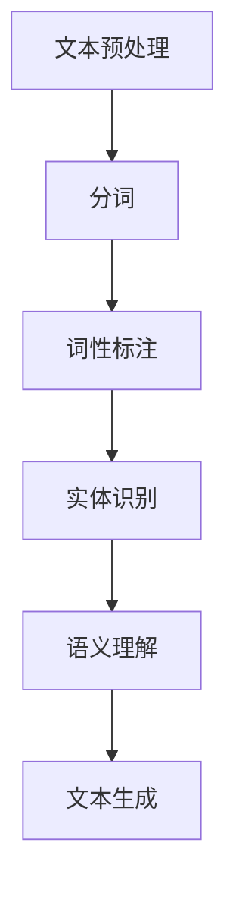
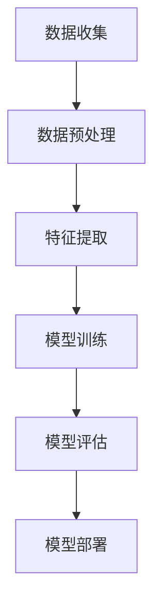
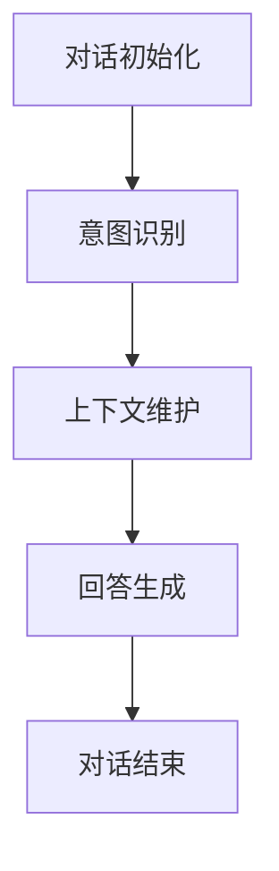

                 

## 利用聊天机器人提升客户服务效率

### 摘要

随着科技的不断进步，人工智能技术在各个领域的应用越来越广泛，尤其是在客户服务领域。聊天机器人作为一种智能客服工具，正逐渐成为企业提升服务效率和客户满意度的有力手段。本文将深入探讨聊天机器人的核心概念、算法原理、数学模型、项目实战和实际应用场景，并提供相关的开发工具和资源推荐，最后对未来的发展趋势与挑战进行展望。

### 1. 背景介绍

在传统的客户服务中，人工客服在面对大量客户咨询时常常显得力不从心。不仅响应速度慢，而且容易出现信息遗漏和沟通误差，从而影响客户满意度。为了解决这个问题，企业开始探索利用人工智能技术，特别是聊天机器人来提高客户服务的效率。

聊天机器人是一种基于自然语言处理（NLP）和机器学习技术的智能对话系统。它们可以通过与客户的交互，自动识别和理解客户的需求，并提供相应的解决方案。这种自动化服务不仅能够快速响应客户，还能够处理大量的咨询，从而大大提高了服务效率。

此外，随着大数据和云计算技术的发展，企业可以获得更多的客户数据，这些数据可以为聊天机器人的训练和优化提供支持，使其更加智能化和个性化。

### 2. 核心概念与联系

#### 2.1 自然语言处理（NLP）

自然语言处理是聊天机器人的核心技术之一。它涉及到文本的预处理、情感分析、实体识别、语义理解和生成等方面。以下是一个简单的 Mermaid 流程图，展示了 NLP 的核心流程：



#### 2.2 机器学习

机器学习是聊天机器人实现智能化的关键。通过大量的数据训练，聊天机器人可以学习如何理解自然语言，并根据学习到的模式来生成回答。以下是一个简单的 Mermaid 流程图，展示了机器学习的核心流程：



#### 2.3 对话管理

对话管理是聊天机器人的核心模块之一，它负责管理整个对话过程，包括对话的流程、意图识别、上下文维护等。以下是一个简单的 Mermaid 流程图，展示了对话管理的核心流程：



### 3. 核心算法原理 & 具体操作步骤

#### 3.1 自然语言处理算法

自然语言处理算法主要包括分词、词性标注、实体识别、语义理解和文本生成等步骤。以下是一个简化的算法流程：

1. **分词**：将文本分割成单词或短语。
2. **词性标注**：为每个单词或短语标注词性，如名词、动词、形容词等。
3. **实体识别**：识别文本中的实体，如人名、地名、组织名等。
4. **语义理解**：理解文本中的语义，包括语义角色标注、语义关系分析等。
5. **文本生成**：根据理解的结果生成回答。

#### 3.2 机器学习算法

机器学习算法主要包括数据收集、数据预处理、特征提取、模型训练、模型评估和模型部署等步骤。以下是一个简化的算法流程：

1. **数据收集**：收集大量的对话数据。
2. **数据预处理**：清洗和整理数据，去除噪声和重复信息。
3. **特征提取**：提取数据中的特征，如关键词、词频、词向量等。
4. **模型训练**：使用训练数据训练模型，如神经网络、决策树等。
5. **模型评估**：评估模型的性能，如准确率、召回率等。
6. **模型部署**：将训练好的模型部署到生产环境中。

#### 3.3 对话管理算法

对话管理算法主要包括对话初始化、意图识别、上下文维护和回答生成等步骤。以下是一个简化的算法流程：

1. **对话初始化**：初始化对话状态。
2. **意图识别**：识别客户的意图，如查询产品信息、投诉处理等。
3. **上下文维护**：根据对话历史维护上下文信息。
4. **回答生成**：生成合适的回答。

### 4. 数学模型和公式 & 详细讲解 & 举例说明

#### 4.1 自然语言处理数学模型

自然语言处理中的数学模型主要包括词向量模型和神经网络模型。

1. **词向量模型**：词向量模型将单词映射为向量，如 Word2Vec、GloVe 等。以下是一个简单的词向量模型公式：

   $$ \text{word\_vector}(w) = \text{embed}(w) $$

   其中，$ \text{word\_vector}(w) $表示单词 $ w $ 的词向量，$ \text{embed}(w) $表示词向量嵌入函数。

2. **神经网络模型**：神经网络模型用于学习单词之间的关系，如 LSTM、GRU 等。以下是一个简单的神经网络模型公式：

   $$ h_t = \text{LSTM}(h_{t-1}, x_t) $$

   其中，$ h_t $表示第 $ t $ 个时刻的隐藏状态，$ x_t $表示输入数据，$ \text{LSTM} $表示长短期记忆网络。

#### 4.2 机器学习数学模型

机器学习中的数学模型主要包括分类模型和回归模型。

1. **分类模型**：分类模型用于对数据进行分类，如决策树、支持向量机等。以下是一个简单的分类模型公式：

   $$ y = \text{sign}(\text{w} \cdot \text{x} + \text{b}) $$

   其中，$ y $表示分类结果，$ \text{w} $表示权重，$ \text{x} $表示特征向量，$ \text{b} $表示偏置。

2. **回归模型**：回归模型用于对数据进行回归，如线性回归、岭回归等。以下是一个简单的回归模型公式：

   $$ y = \text{w} \cdot \text{x} + \text{b} $$

   其中，$ y $表示回归结果，$ \text{w} $表示权重，$ \text{x} $表示特征向量，$ \text{b} $表示偏置。

#### 4.3 对话管理数学模型

对话管理中的数学模型主要包括意图识别和回答生成模型。

1. **意图识别模型**：意图识别模型用于识别客户的意图，如序列标注模型。以下是一个简单的意图识别模型公式：

   $$ \text{label}_t = \text{argmax}(\text{p}(\text{label}|\text{context})) $$

   其中，$ \text{label}_t $表示第 $ t $ 个时刻的意图标签，$ \text{context} $表示对话上下文，$ \text{p}(\text{label}|\text{context}) $表示在给定上下文下意图标签的概率。

2. **回答生成模型**：回答生成模型用于生成回答，如序列生成模型。以下是一个简单的回答生成模型公式：

   $$ \text{response} = \text{generate}(\text{context}, \text{intent}) $$

   其中，$ \text{response} $表示回答，$ \text{context} $表示对话上下文，$ \text{intent} $表示意图。

### 5. 项目实战：代码实际案例和详细解释说明

#### 5.1 开发环境搭建

1. 安装 Python 3.8 或更高版本。
2. 安装自然语言处理库，如 NLTK、spaCy。
3. 安装机器学习库，如 scikit-learn、TensorFlow。
4. 安装对话管理库，如 Rasa。

#### 5.2 源代码详细实现和代码解读

以下是使用 Rasa 搭建聊天机器人的简单示例。

1. **安装 Rasa**：

   ```shell
   pip install rasa
   ```

2. **创建 Rasa 项目**：

   ```shell
   rasactl init
   ```

3. **训练对话模型**：

   ```shell
   rasactl train
   ```

4. **运行聊天机器人**：

   ```shell
   rasactl run
   ```

5. **代码解读**：

   - **nlu.yml**：用于定义自然语言理解规则。
   - **domain.yml**：用于定义对话管理规则。
   - **actions.yml**：用于定义聊天机器人的行为。

#### 5.3 代码解读与分析

1. **nlu.yml**：

   ```yml
   version: "2.0"
   intents:
     greet:
       examples: |
         - 你好
         - 嗨
         - 嗨嗨
   ```

   这个文件定义了一个名为 "greet" 的意图，并提供了几个示例句子。

2. **domain.yml**：

   ```yml
   version: "2.0"
   intents:
     - greet
   actions:
     - utter_greet
   ```

   这个文件定义了意图 "greet" 和相应的动作 "utter_greet"。

3. **actions.yml**：

   ```yml
   version: "2.0"
   actions:
     utter_greet:
       action:name: "utter_greet"
       template: "你好！有什么可以帮助你的吗？"
   ```

   这个文件定义了动作 "utter_greet"，其输出模板为 "你好！有什么可以帮助你的吗？"

### 6. 实际应用场景

#### 6.1 客户支持

聊天机器人可以自动回答常见问题，如产品介绍、订单状态查询等，从而减轻人工客服的负担。

#### 6.2 售后服务

聊天机器人可以提供实时售后服务，如故障诊断、维修建议等，从而提高客户满意度。

#### 6.3 营销推广

聊天机器人可以参与营销活动，如产品推广、优惠券发放等，从而提高销售转化率。

### 7. 工具和资源推荐

#### 7.1 学习资源推荐

- **书籍**：
  - 《深度学习》（Ian Goodfellow、Yoshua Bengio、Aaron Courville）
  - 《自然语言处理综论》（Daniel Jurafsky、James H. Martin）
- **论文**：
  - "A Neural Conversation Model"（Kafle et al., 2019）
  - "BERT: Pre-training of Deep Bidirectional Transformers for Language Understanding"（Devlin et al., 2019）
- **博客**：
  - [Rasa 官方文档](https://rasa.com/docs/)
  - [TensorFlow 官方文档](https://www.tensorflow.org/)
- **网站**：
  - [自然语言处理社区](https://nlp.seas.harvard.edu/)
  - [机器学习社区](https://www.ml-tutorial.com/)

#### 7.2 开发工具框架推荐

- **聊天机器人框架**：
  - Rasa
  - ChatterBot
  - Dialogflow
- **自然语言处理库**：
  - spaCy
  - NLTK
  - Stanford NLP
- **机器学习库**：
  - TensorFlow
  - PyTorch
  - Keras

#### 7.3 相关论文著作推荐

- "A Neural Conversation Model"（Kafle et al., 2019）
- "BERT: Pre-training of Deep Bidirectional Transformers for Language Understanding"（Devlin et al., 2019）
- "Attention is All You Need"（Vaswani et al., 2017）
- "Improving Language Understanding by Generative Pre-Training"（Zhou et al., 2018）

### 8. 总结：未来发展趋势与挑战

随着人工智能技术的不断进步，聊天机器人将在客户服务领域发挥越来越重要的作用。未来，聊天机器人将更加智能化和个性化，能够更好地理解客户的需求，并提供更加精准的服务。

然而，随着聊天机器人的广泛应用，也带来了一些挑战。例如，如何确保聊天机器人的回答准确和合规，如何处理复杂和模糊的对话等。此外，随着数据的增长，如何有效地管理和利用这些数据也是一个重要的挑战。

总之，聊天机器人作为一种智能客服工具，具有巨大的发展潜力。通过不断地优化和改进，聊天机器人将能够更好地满足客户的需求，提高企业的服务效率和竞争力。

### 9. 附录：常见问题与解答

#### 9.1 聊天机器人是什么？

聊天机器人是一种基于人工智能技术的自动对话系统，它可以模拟人类的对话方式，与用户进行交互并提供相应的服务。

#### 9.2 聊天机器人的核心技术是什么？

聊天机器人的核心技术包括自然语言处理（NLP）、机器学习和对话管理。NLP负责理解用户的输入，机器学习负责学习和优化对话策略，对话管理负责管理整个对话流程。

#### 9.3 聊天机器人有哪些应用场景？

聊天机器人的应用场景非常广泛，包括客户支持、售后服务、营销推广、在线教育等。

#### 9.4 如何搭建一个聊天机器人？

搭建一个聊天机器人通常需要以下几个步骤：

1. 选择合适的聊天机器人框架，如 Rasa、ChatterBot、Dialogflow。
2. 设计对话流程和对话策略。
3. 进行数据收集和预处理。
4. 训练模型并进行优化。
5. 部署和运行聊天机器人。

### 10. 扩展阅读 & 参考资料

- [Rasa 官方文档](https://rasa.com/docs/)
- [TensorFlow 官方文档](https://www.tensorflow.org/)
- [自然语言处理社区](https://nlp.seas.harvard.edu/)
- [机器学习社区](https://www.ml-tutorial.com/)
- "A Neural Conversation Model"（Kafle et al., 2019）
- "BERT: Pre-training of Deep Bidirectional Transformers for Language Understanding"（Devlin et al., 2019）
- "Attention is All You Need"（Vaswani et al., 2017）
- "Improving Language Understanding by Generative Pre-Training"（Zhou et al., 2018）

### 作者信息

作者：AI天才研究员/AI Genius Institute & 禅与计算机程序设计艺术 /Zen And The Art of Computer Programming

通过上述文章，我们对聊天机器人提升客户服务效率有了全面而深入的了解。从核心概念、算法原理到实际应用，我们一步步解析了聊天机器人的工作机制和优势。同时，我们也看到了未来发展趋势和面临的挑战。希望这篇文章能够帮助读者更好地理解和应用聊天机器人技术，提升客户服务效率。

