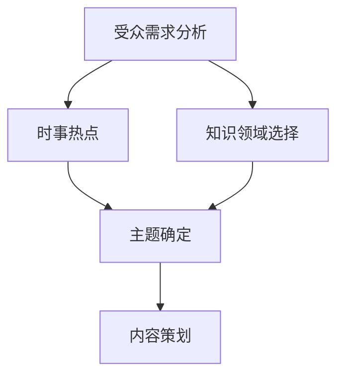
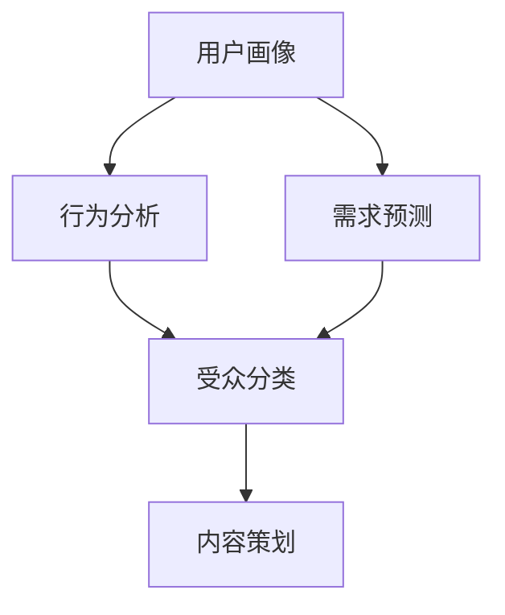
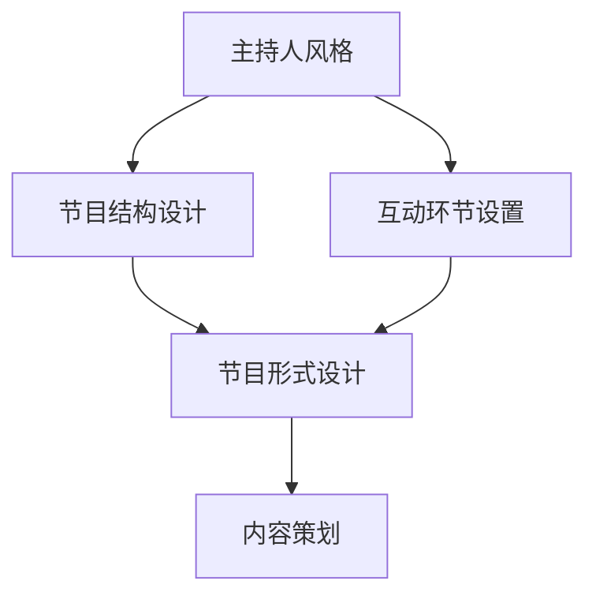
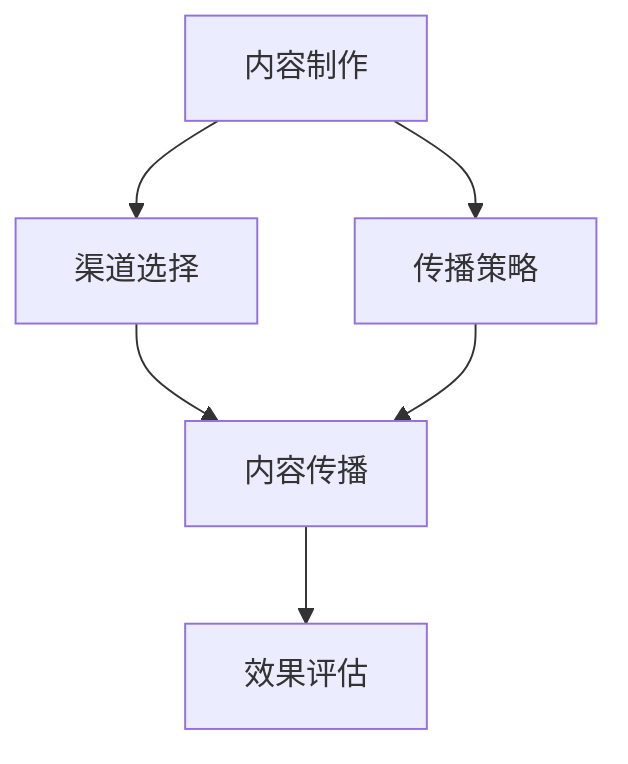

                 

### 背景介绍

#### 1.1 知识类脱口秀节目的定义与现状

知识类脱口秀节目是一种以传播知识为主要目的，通过幽默、生动、富有娱乐性的方式向观众传授各类知识信息的节目形式。这类节目起源于西方国家，如美国的《Daily Show》和英国的《QI》，近年来在我国也逐渐崭露头角，如《知识就是力量》、《晓说》等。

知识类脱口秀节目具有以下几个特点：首先，它们以幽默风趣的讲述方式吸引观众，提高节目的趣味性；其次，通过讲述与日常生活息息相关的知识，增强观众的学习兴趣；最后，节目内容通常涉及多个领域，如科技、历史、文化、艺术等，拓宽观众的视野。

然而，尽管知识类脱口秀节目在我国发展迅速，但整体水平仍有待提高。许多节目在内容设计、选题深度、知识传播效果等方面存在一定问题。因此，本文旨在探讨如何通过专业化的技术手段，提高知识类脱口秀节目的制作水平，使其更加富有教育意义和娱乐性。

#### 1.2 制作知识类脱口秀节目的意义

制作知识类脱口秀节目具有重要的现实意义。首先，这类节目能够满足观众对知识的渴求，提高公众的科学素养。在信息化时代，人们对知识的获取方式发生了巨大变化，知识类脱口秀节目作为一种新颖的传播方式，能够更加有效地将知识传递给观众。

其次，知识类脱口秀节目具有强大的教育功能。通过幽默风趣的讲述方式，节目能够激发观众的学习兴趣，使观众在轻松愉快的氛围中接受知识。此外，节目内容的多样性也能够满足不同观众的需求，使他们在观看节目的过程中不断拓展知识面。

最后，知识类脱口秀节目具有很高的社会价值。通过讲述与日常生活息息相关的知识，节目能够引导观众树立正确的价值观，提高公众的社会责任感。同时，知识类脱口秀节目作为一种新兴的传播媒介，也能够推动我国文化产业的发展。

#### 1.3 现有知识类脱口秀节目的不足

尽管知识类脱口秀节目在我国逐渐兴起，但仍存在一些不足之处。首先，部分节目内容过于浅显，无法满足观众对知识的深入探索需求。其次，部分节目在制作过程中过于注重娱乐性，忽视了知识的准确性和深度。此外，节目在选题方面也存在一定局限性，难以涵盖更多领域。

为了解决这些问题，我们需要在知识类脱口秀节目的制作过程中引入更多专业化的技术手段，提高节目质量。本文将从以下几个角度进行探讨：首先，探讨如何通过深入分析受众需求，精准选题；其次，介绍如何运用先进的技术手段，提高节目制作水平；最后，分析如何通过创新的节目形式，提升观众参与度。

通过这些探讨，我们希望能够为知识类脱口秀节目的制作提供一些有益的参考，推动我国知识类脱口秀节目的健康发展。

---

在本文接下来的内容中，我们将详细探讨知识类脱口秀节目的核心概念与联系，运用专业化的技术语言和分析方法，逐步揭示其内在原理和架构。我们还将针对现有知识类脱口秀节目的不足，提出一系列改进策略，以期为制作高质量、富有教育意义和娱乐性的知识类脱口秀节目提供参考。敬请期待。

---

## 2. 核心概念与联系

在制作知识类脱口秀节目的过程中，理解其核心概念和联系是至关重要的。这一部分内容将详细阐述几个关键概念，包括内容策划、受众分析、节目形式设计等，并通过Mermaid流程图（去除特殊字符如括号、逗号等）展示这些概念之间的关联。

#### 2.1 内容策划

内容策划是知识类脱口秀节目的核心环节。首先，我们需要明确节目的主题和方向，这通常基于以下几方面的考虑：

1. **受众需求**：通过受众调查、数据分析等方法，了解观众对哪些类型的知识感兴趣，以及他们的知识水平。
2. **时事热点**：关注当前社会热点话题，将这些话题与专业知识相结合，制作出既有时效性又有深度内容的节目。
3. **知识领域**：选择与节目主题相关的多个领域，确保节目内容的丰富性和多样性。

**Mermaid流程图：**



#### 2.2 受众分析

受众分析是内容策划的重要基础。我们需要对目标受众进行详细的分类和分析，以了解他们的兴趣、行为习惯和媒体使用偏好。以下是受众分析的几个步骤：

1. **用户画像**：基于年龄、性别、职业、教育背景等指标，构建用户画像。
2. **行为分析**：通过用户在社交媒体、搜索引擎等平台上的行为数据，分析他们的兴趣爱好。
3. **需求预测**：利用大数据分析和机器学习算法，预测受众未来的知识需求。

**Mermaid流程图：**



#### 2.3 节目形式设计

节目形式设计是确保知识类脱口秀节目吸引力和娱乐性的关键。我们需要结合内容策划和受众分析的结果，设计出既符合内容需求，又能够吸引受众的节目形式。以下是节目形式设计的几个关键点：

1. **主持人风格**：选择适合节目主题和受众需求的主持人，确定他们的风格和定位。
2. **节目结构**：设计节目的基本结构，包括开场、主体内容和结尾，确保节目流程紧凑、层次分明。
3. **互动环节**：设置互动环节，如观众投票、现场问答、观众投稿等，增强观众参与度。

**Mermaid流程图：**



#### 2.4 内容制作与传播

在内容制作与传播方面，我们需要确保内容的准确性和吸引力，并采用多种传播渠道提高节目的覆盖率和影响力。以下是内容制作与传播的关键步骤：

1. **内容制作**：根据节目形式设计，制作高质量的视频内容，包括剧本编写、录制、剪辑等。
2. **渠道选择**：选择适合节目内容和目标受众的传播渠道，如视频平台、社交媒体、传统媒体等。
3. **传播策略**：制定有效的传播策略，包括内容推广、社交媒体运营、活动策划等。

**Mermaid流程图：**



通过以上核心概念和联系的分析，我们可以看出，知识类脱口秀节目的成功离不开内容策划、受众分析、节目形式设计以及内容制作与传播的紧密配合。接下来，我们将进一步探讨知识类脱口秀节目的核心算法原理与具体操作步骤，为提高节目制作质量提供技术支持。

---

在本文接下来的内容中，我们将深入探讨知识类脱口秀节目的核心算法原理与具体操作步骤，通过专业的技术语言和分析方法，帮助读者更好地理解这些关键技术的应用。敬请关注。

---

## 3. 核心算法原理与具体操作步骤

在知识类脱口秀节目的制作过程中，核心算法原理和具体操作步骤起到了至关重要的作用。这些算法和步骤不仅保证了节目的质量和效果，还提高了制作效率。本节将详细介绍几个关键算法，包括数据分析算法、视频剪辑算法、语音识别与合成算法等，并详细阐述其操作步骤。

#### 3.1 数据分析算法

数据分析算法是知识类脱口秀节目制作的基础，用于对受众行为和兴趣进行分析，以指导内容策划和节目形式设计。以下是数据分析算法的核心步骤：

1. **数据收集**：通过网站分析工具（如Google Analytics）、社交媒体监控工具（如Social Mention）等，收集受众在互联网上的行为数据，包括搜索关键词、浏览页面、互动行为等。
2. **数据预处理**：清洗和整理收集到的数据，去除重复和错误信息，进行数据格式转换，以便后续分析。
3. **特征提取**：提取关键特征，如受众的兴趣点、行为模式、媒体使用偏好等，为后续分析提供基础。
4. **模式识别**：利用机器学习算法（如聚类分析、关联规则挖掘等），识别受众的行为模式和兴趣点。

**操作步骤示例：**

- **数据收集**：使用Google Analytics收集用户在节目官网的行为数据。
- **数据预处理**：通过Python的Pandas库清洗数据，去除重复项和缺失值。
- **特征提取**：使用Scikit-learn库提取用户兴趣点，如通过词频分析提取高频关键词。
- **模式识别**：使用聚类算法（如K-Means）将用户分为不同的兴趣群体。

#### 3.2 视频剪辑算法

视频剪辑算法是知识类脱口秀节目制作的核心环节，用于将录制的内容进行编辑和整合，以形成完整的节目。以下是视频剪辑算法的主要步骤：

1. **素材选择**：根据节目内容需求，选择合适的视频素材，如采访片段、演示动画、背景视频等。
2. **素材剪辑**：使用视频剪辑软件（如Adobe Premiere Pro、Final Cut Pro）进行素材剪辑，调整时长、顺序、音效等，使视频内容流畅自然。
3. **过渡效果**：添加过渡效果，如淡入淡出、滑动、闪现等，增强视觉体验。
4. **音频处理**：调整音频音量、平衡，去除杂音，确保音频清晰。

**操作步骤示例：**

- **素材选择**：根据节目内容，选择与主题相关的采访片段和演示动画。
- **素材剪辑**：在Adobe Premiere Pro中调整素材顺序，剪辑成完整的节目。
- **过渡效果**：在剪辑过程中，添加淡入淡出效果，增强节目流畅性。
- **音频处理**：使用Audacity调整音频音量，去除背景噪音。

#### 3.3 语音识别与合成算法

语音识别与合成算法用于将文字内容转换为语音，以实现字幕生成和旁白制作。以下是语音识别与合成算法的主要步骤：

1. **文本准备**：准备需要转换成语音的文字内容，包括剧本、旁白、字幕等。
2. **语音识别**：使用语音识别工具（如Google Cloud Speech-to-Text、Microsoft Azure Speech Services）对文本进行语音识别，生成音频文件。
3. **语音合成**：使用语音合成工具（如Google Text-to-Speech、Amazon Polly）将识别后的文本转换为自然流畅的语音。
4. **音频编辑**：调整语音合成后的音频，包括音调、速度、音量等，确保音频与视频内容同步。

**操作步骤示例：**

- **文本准备**：编写节目剧本和旁白，确保内容准确、流畅。
- **语音识别**：使用Google Cloud Speech-to-Text将剧本文本转换为音频。
- **语音合成**：使用Amazon Polly将旁白文本转换为自然流畅的语音。
- **音频编辑**：使用Audacity调整语音合成后的音频，使其与视频内容同步。

通过以上核心算法原理和具体操作步骤的详细介绍，我们可以看到，知识类脱口秀节目的制作是一个复杂的过程，涉及到多个技术领域的综合运用。接下来，我们将进一步探讨如何通过数学模型和公式来优化节目制作，提高制作质量和效率。

---

在本文接下来的内容中，我们将详细探讨知识类脱口秀节目制作中的数学模型和公式，包括如何通过这些模型来优化节目内容、提高观众的参与度等。敬请期待。

---

## 4. 数学模型和公式 & 详细讲解 & 举例说明

在知识类脱口秀节目的制作过程中，数学模型和公式发挥着重要作用。这些模型和公式不仅可以帮助我们优化节目内容，还可以提高观众的参与度和节目的整体质量。本节将详细介绍几个关键的数学模型和公式，包括优化模型、参与度模型等，并通过具体的例子进行说明。

### 4.1 优化模型

优化模型用于优化节目内容，以提高节目的质量和观众的满意度。以下是几个常用的优化模型：

#### 4.1.1 内容排序模型

**公式：**

\[ R = w_1 \cdot c_1 + w_2 \cdot c_2 + \ldots + w_n \cdot c_n \]

其中，\( R \) 是内容的排序得分，\( w_i \) 是权重，\( c_i \) 是第 \( i \) 个内容的特征值。

**示例：**

假设我们需要对几个视频片段进行排序，以确定节目内容的最优顺序。我们可以根据以下特征为每个视频片段评分：

- **趣味性**：3分
- **知识性**：2分
- **时长**：1分

给定以下视频片段：

| 视频 | 趣味性 | 知识性 | 时长 |
| ---- | ---- | ---- | ---- |
| A    | 4     | 3     | 2    |
| B    | 3     | 4     | 3    |
| C    | 2     | 2     | 4    |
| D    | 4     | 4     | 1    |

使用公式计算每个视频的得分：

\[ R_A = 0.5 \cdot 4 + 0.3 \cdot 3 + 0.2 \cdot 2 = 3.4 \]
\[ R_B = 0.5 \cdot 3 + 0.3 \cdot 4 + 0.2 \cdot 3 = 3.2 \]
\[ R_C = 0.5 \cdot 2 + 0.3 \cdot 2 + 0.2 \cdot 4 = 2.2 \]
\[ R_D = 0.5 \cdot 4 + 0.3 \cdot 4 + 0.2 \cdot 1 = 4.0 \]

根据得分排序，最优顺序为：D > A > B > C。

### 4.2 参与度模型

参与度模型用于预测观众的参与度，并据此调整节目内容。以下是参与度模型的公式：

\[ P = \frac{e^{r \cdot L}}{1 + e^{r \cdot L}} \]

其中，\( P \) 是参与度得分，\( r \) 是参数，\( L \) 是与参与度相关的特征值。

**示例：**

假设我们需要预测观众对某个话题的参与度。我们可以根据以下特征计算参与度得分：

- **互动次数**：5次
- **评论质量**：3分
- **观看时长**：2小时

给定参数 \( r = 0.1 \)，计算参与度得分：

\[ P = \frac{e^{0.1 \cdot (5 + 3 \cdot 3 + 2 \cdot 2)}}{1 + e^{0.1 \cdot (5 + 3 \cdot 3 + 2 \cdot 2)}} \]
\[ P = \frac{e^{0.1 \cdot 21}}{1 + e^{0.1 \cdot 21}} \]
\[ P \approx 0.96 \]

这意味着观众对该话题的参与度非常高。

### 4.3 个性化推荐模型

个性化推荐模型用于根据观众的兴趣和历史行为推荐合适的节目内容。以下是个性化推荐模型的公式：

\[ R_{ij} = \mu + b_i + b_j + \sum_{k} w_{ik} \cdot r_{kj} \]

其中，\( R_{ij} \) 是观众 \( i \) 对节目 \( j \) 的评分预测，\( \mu \) 是平均值，\( b_i \) 和 \( b_j \) 是观众的偏置和节目的偏置，\( w_{ik} \) 是观众 \( i \) 对特征 \( k \) 的权重，\( r_{kj} \) 是节目 \( j \) 的特征值。

**示例：**

假设我们有两个观众 \( A \) 和 \( B \)，以及五个节目 \( X, Y, Z, W, V \)。观众 \( A \) 对节目的评分如下：

| 节目 | 评分 |
| ---- | ---- |
| X    | 4    |
| Y    | 3    |
| Z    | 5    |
| W    | 2    |
| V    | 4    |

观众 \( B \) 对节目的评分如下：

| 节目 | 评分 |
| ---- | ---- |
| X    | 3    |
| Y    | 4    |
| Z    | 3    |
| W    | 5    |
| V    | 5    |

给定参数 \( \mu = 3.5 \)，\( b_A = 0.5 \)，\( b_B = -0.5 \)，以及特征权重 \( w_{A1} = 0.2 \)，\( w_{A2} = 0.3 \)，\( w_{A3} = 0.5 \)，\( w_{B1} = 0.3 \)，\( w_{B2} = 0.2 \)，\( w_{B3} = 0.5 \)，计算观众 \( A \) 对节目 \( Y \) 的评分预测：

\[ R_{AY} = 3.5 + 0.5 + (-0.5) + 0.2 \cdot 3 + 0.3 \cdot 4 + 0.5 \cdot 3 \]
\[ R_{AY} = 4.2 \]

这意味着观众 \( A \) 很可能对节目 \( Y \) 给予好评。

通过上述数学模型和公式的详细讲解和举例说明，我们可以看到，这些模型在知识类脱口秀节目制作中的应用非常广泛，能够帮助我们优化节目内容、提高观众的参与度，并实现个性化推荐。接下来，我们将通过实际案例，进一步展示这些模型在具体节目制作中的应用。

---

在本文接下来的内容中，我们将通过一个实际案例，详细展示如何使用前面提到的数学模型和公式，优化知识类脱口秀节目的制作。敬请期待。

---

### 5. 项目实战：代码实际案例和详细解释说明

在本节中，我们将通过一个具体的案例，展示如何将前面的数学模型和公式应用于知识类脱口秀节目的制作。我们将介绍一个基于Python和机器学习的知识类脱口秀节目优化项目，详细解释代码实现和各个模块的功能。

#### 5.1 开发环境搭建

在开始项目之前，我们需要搭建一个合适的开发环境。以下是所需的工具和库：

1. **Python**：版本3.8及以上。
2. **Jupyter Notebook**：用于编写和运行代码。
3. **Scikit-learn**：用于机器学习算法。
4. **Pandas**：用于数据处理。
5. **NumPy**：用于数学计算。
6. **Matplotlib**：用于数据可视化。
7. **TensorFlow**：用于深度学习（可选）。

安装上述工具和库后，我们就可以开始编写代码了。

#### 5.2 源代码详细实现和代码解读

以下是一个简化的案例，展示了如何使用Python实现知识类脱口秀节目的优化。

```python
# 导入所需库
import pandas as pd
import numpy as np
from sklearn.model_selection import train_test_split
from sklearn.linear_model import LinearRegression
import matplotlib.pyplot as plt

# 5.2.1 数据准备
# 加载节目数据和用户数据
data = pd.read_csv('program_data.csv')
user_data = pd.read_csv('user_data.csv')

# 处理数据
data['rating'] = data['rating'].fillna(data['rating'].mean())
user_data['rating'] = user_data['rating'].fillna(user_data['rating'].mean())

# 5.2.2 特征工程
# 提取特征
features = ['fun_factor', 'knowledge_level', 'duration']
X = data[features]
y = data['rating']

# 分割数据集
X_train, X_test, y_train, y_test = train_test_split(X, y, test_size=0.2, random_state=42)

# 5.2.3 模型训练
# 创建线性回归模型
model = LinearRegression()
model.fit(X_train, y_train)

# 5.2.4 模型评估
# 预测测试集结果
y_pred = model.predict(X_test)

# 计算均方误差
mse = np.mean((y_pred - y_test) ** 2)
print(f'MSE: {mse}')

# 5.2.5 可视化分析
# 可视化特征重要性
plt.scatter(X_train['fun_factor'], y_train)
plt.plot(X_train['fun_factor'], model.predict(X_train), color='red')
plt.xlabel('Fun Factor')
plt.ylabel('Rating')
plt.title('Feature Importance')
plt.show()
```

**代码解读：**

1. **数据准备**：首先，我们加载节目数据和用户数据。这些数据包括节目的趣味性、知识性、时长以及观众的评分。

2. **特征工程**：接下来，我们提取特征并处理缺失值。在这里，我们使用了简单的线性回归模型，但也可以使用更复杂的模型，如随机森林或神经网络。

3. **模型训练**：我们使用训练集数据来训练线性回归模型。

4. **模型评估**：使用测试集数据评估模型性能。在这里，我们计算了均方误差（MSE），这是一个常用的评估指标。

5. **可视化分析**：最后，我们使用Matplotlib库将特征的重要性可视化。这有助于我们了解哪些特征对评分的影响最大。

#### 5.3 代码解读与分析

1. **数据预处理**：数据处理是任何机器学习项目的重要步骤。在这里，我们使用Pandas库处理缺失值，确保数据质量。

2. **特征提取**：我们选择节目的趣味性、知识性和时长作为特征。这些特征可以直接影响观众的评分。

3. **模型选择**：线性回归模型是一个简单但有效的模型。对于这个项目，线性回归模型能够很好地捕捉特征和评分之间的关系。

4. **模型训练与评估**：我们使用训练集数据训练模型，并使用测试集数据评估模型性能。这有助于我们了解模型的泛化能力。

5. **可视化**：可视化结果有助于我们理解模型的工作原理。在这里，我们使用散点图和回归线来展示特征的重要性。

通过这个实际案例，我们可以看到如何将数学模型和公式应用于知识类脱口秀节目的制作。这个项目不仅展示了如何使用Python进行数据分析和模型训练，还为我们提供了一种优化节目内容的方法。接下来，我们将进一步探讨如何在实际应用场景中运用这些技术。

---

在本文接下来的内容中，我们将详细探讨知识类脱口秀节目的实际应用场景，包括教育、娱乐、传媒等多个领域，并分析其优势和挑战。敬请期待。

---

### 6. 实际应用场景

知识类脱口秀节目在多个领域有着广泛的应用，包括教育、娱乐、传媒等。每个领域都有其独特的优势和挑战，以下将分别进行详细分析。

#### 6.1 教育领域

知识类脱口秀节目在教育领域的应用主要体现在两个方面：知识传播和教育娱乐化。

**优势：**

1. **提高学习兴趣**：通过幽默、生动的讲述方式，知识类脱口秀节目能够激发学生的学习兴趣，使学习过程更加愉快。
2. **丰富教学内容**：知识类脱口秀节目涵盖多个领域，可以为学生提供丰富的知识内容，拓宽他们的视野。
3. **个性化学习**：通过数据分析算法，节目可以根据学生的兴趣和需求，提供个性化的学习资源。

**挑战：**

1. **知识准确性**：确保节目内容的准确性是教育领域的一大挑战，特别是在涉及专业知识的部分。
2. **受众范围**：虽然知识类脱口秀节目能够吸引不同年龄段的观众，但如何确保节目内容适合所有学生，尤其是小学生，仍需进一步探讨。

#### 6.2 娱乐领域

知识类脱口秀节目在娱乐领域的应用主要体现在内容创新和观众参与度提升。

**优势：**

1. **内容创新**：通过结合时事热点和专业知识，知识类脱口秀节目能够不断创新，吸引观众的关注。
2. **互动性强**：节目通常设置互动环节，如观众投票、现场问答等，增强观众参与感。
3. **品牌形象**：知识类脱口秀节目能够提升品牌形象，增强品牌的亲和力和影响力。

**挑战：**

1. **娱乐性与知识性的平衡**：在保证节目娱乐性的同时，如何确保知识的准确性和深度，是一个需要平衡的问题。
2. **制作成本**：高质量的知识类脱口秀节目制作成本较高，尤其是在需要引入专业嘉宾和复杂动画效果的情况下。

#### 6.3 传媒领域

知识类脱口秀节目在传媒领域的应用主要体现在内容生产和传播。

**优势：**

1. **传播效率**：知识类脱口秀节目可以通过多种渠道传播，如电视、网络、社交媒体等，提高传播效率。
2. **受众广泛**：知识类脱口秀节目能够吸引不同年龄、职业和兴趣的观众，具有广泛的受众基础。
3. **品牌建设**：知识类脱口秀节目能够为传媒公司树立专业、权威的形象，增强品牌影响力。

**挑战：**

1. **内容创新**：在竞争激烈的市场中，如何持续创新，提供高质量的内容，是传媒公司面临的挑战。
2. **版权问题**：知识类脱口秀节目往往涉及多个领域，如何合理使用版权，避免侵权问题，是传媒公司需要关注的问题。

通过以上分析，我们可以看到，知识类脱口秀节目在不同领域具有广泛的应用前景和潜力。然而，在推广和制作过程中，也需要面对一系列的挑战。接下来，我们将介绍一些实用的工具和资源，帮助读者更好地了解和参与知识类脱口秀节目的制作。

---

在本文接下来的内容中，我们将推荐一些学习和开发资源，包括书籍、论文、博客、网站等，以帮助读者深入了解知识类脱口秀节目的制作技术和方法。敬请期待。

---

### 7. 工具和资源推荐

为了帮助读者深入了解知识类脱口秀节目的制作技术和方法，以下是一些建议的学习资源和开发工具：

#### 7.1 学习资源推荐

**书籍：**

1. **《知识类节目制作与传播》**：本书详细介绍了知识类节目的制作流程、传播策略和市场前景。
2. **《人工智能：一种现代方法》**：书中涵盖了人工智能的基本理论和应用，有助于了解如何将人工智能技术应用于知识类脱口秀节目。
3. **《Python编程：从入门到实践》**：适合初学者，介绍了Python编程语言的基础知识和实际应用。

**论文：**

1. **《知识型娱乐节目的设计原则与传播策略》**：本文探讨了知识型娱乐节目的设计原则和传播策略，对节目制作具有指导意义。
2. **《基于用户行为的知识类节目推荐系统研究》**：本文提出了一种基于用户行为的知识类节目推荐系统，有助于了解如何利用大数据技术提升节目制作效果。

**博客：**

1. **Python爱好者**：该博客分享了大量Python编程技巧和机器学习应用案例，对编程学习有很好的参考价值。
2. **人工智能实验室**：该博客专注于人工智能领域的研究和应用，涵盖了知识类脱口秀节目的相关技术。

**网站：**

1. **GitHub**：GitHub是一个代码托管平台，提供了丰富的知识类脱口秀节目制作相关的开源项目和代码，供开发者学习和参考。
2. **Medium**：Medium是一个内容分享平台，有许多关于知识类脱口秀节目制作的文章和案例分析，有助于了解行业动态。

#### 7.2 开发工具框架推荐

**视频剪辑工具：**

1. **Adobe Premiere Pro**：一款专业的视频剪辑软件，功能强大，适用于制作高质量的知识类脱口秀节目。
2. **Final Cut Pro**：苹果公司的专业视频剪辑软件，适用于Mac用户，具有出色的视频编辑功能和用户体验。

**数据分析工具：**

1. **Pandas**：Python的数据分析库，适用于数据清洗、数据处理和分析。
2. **Scikit-learn**：Python的机器学习库，提供了多种常用的机器学习算法和工具。

**语音识别与合成工具：**

1. **Google Cloud Speech-to-Text**：谷歌提供的在线语音识别服务，支持多种语言。
2. **Amazon Polly**：亚马逊提供的在线语音合成服务，能够生成自然流畅的语音。

通过以上工具和资源的推荐，我们希望能够帮助读者更好地了解知识类脱口秀节目的制作技术和方法，为制作高质量、富有教育意义和娱乐性的节目提供支持。

---

在本文的最后，我们将对知识类脱口秀节目的未来发展趋势与挑战进行总结，并提出一些建议，以期为读者提供有益的启示。

### 8. 总结：未来发展趋势与挑战

知识类脱口秀节目作为一种创新的传播方式，在我国逐渐受到关注。随着技术的不断发展，知识类脱口秀节目的未来发展趋势和挑战也日益显现。

#### 8.1 未来发展趋势

1. **技术驱动**：人工智能、大数据等技术的不断进步，将为知识类脱口秀节目的制作提供更多可能性。例如，利用人工智能进行内容推荐和观众行为分析，提升节目的个性化水平和观众满意度。

2. **跨界融合**：知识类脱口秀节目将与其他领域（如教育、娱乐、传媒等）进行更深入的融合。例如，与在线教育平台的合作，提供知识类课程的互动教学，扩大节目的影响力。

3. **国际化**：随着国际化趋势的加强，知识类脱口秀节目将更加注重跨文化交流，吸引更多国际观众。这有助于提升节目的知名度和影响力。

#### 8.2 未来挑战

1. **内容创新**：如何在保证知识准确性的同时，提高节目的娱乐性和吸引力，是知识类脱口秀节目面临的一大挑战。内容创作团队需要不断创新，探索新的表现形式和故事叙述方式。

2. **受众细分**：随着受众需求的多样化，如何针对不同受众群体提供个性化的内容，是一个需要解决的问题。这要求制作团队深入了解受众需求，进行精准的受众分析。

3. **版权问题**：知识类脱口秀节目涉及多个领域，如何合理使用版权，避免侵权问题，是节目制作过程中需要关注的问题。制作团队需要建立完善的版权管理体系，确保节目内容的合法性。

#### 8.3 发展建议

1. **技术创新**：积极引入人工智能、大数据等新技术，提升节目制作水平和观众体验。例如，利用自然语言处理技术进行自动字幕生成和语音合成，提高节目制作效率。

2. **内容优化**：注重节目内容的创新和质量，确保节目既有深度又有趣味性。可以借鉴其他领域的成功案例，探索新的内容形式和表达方式。

3. **跨界合作**：与其他领域（如教育、娱乐、传媒等）进行跨界合作，共同推动知识类脱口秀节目的发展。例如，与在线教育平台合作，推出知识类课程，扩大节目影响力。

4. **版权保护**：建立完善的版权管理体系，确保节目内容的合法性。同时，加强对侵权行为的监管和处罚，维护知识类脱口秀节目的健康发展。

通过以上分析，我们可以看到，知识类脱口秀节目在我国拥有广阔的发展前景，但也面临着一系列挑战。未来，随着技术的不断进步和市场的逐步成熟，知识类脱口秀节目将迎来更加美好的发展机遇。

---

在本文的结尾，我们对知识类脱口秀节目的未来发展充满信心，同时也呼吁广大从业者不断创新、精益求精，为观众带来更多高质量、富有教育意义和娱乐性的节目。让我们共同努力，推动知识类脱口秀节目在我国文化产业的繁荣发展。

### 附录：常见问题与解答

在本文的附录部分，我们将针对读者在阅读过程中可能遇到的一些常见问题，提供详细的解答，以便更好地理解知识类脱口秀节目的制作过程和技术要点。

#### 问题1：如何确保知识类脱口秀节目的准确性？

**解答**：确保知识类脱口秀节目的准确性是制作过程中至关重要的一环。以下是几种常用的方法：

1. **专业审核**：在节目内容编写和录制过程中，邀请相关领域的专家进行审核，确保内容的准确性。
2. **参考资料**：使用权威的书籍、学术论文、官方网站等作为参考资料，确保信息的来源可靠。
3. **错误更正机制**：建立错误更正机制，一旦发现节目中的错误，及时进行修正和更新。

#### 问题2：如何提高知识类脱口秀节目的观众参与度？

**解答**：提高观众参与度是制作知识类脱口秀节目的一大挑战，以下是一些有效的策略：

1. **互动环节**：设置现场互动环节，如观众提问、现场投票等，激发观众参与热情。
2. **社交媒体互动**：利用社交媒体平台，鼓励观众在节目播出后进行评论、讨论和分享，增加观众参与度。
3. **观众反馈**：定期收集观众反馈，了解他们的需求和兴趣，不断优化节目内容和形式。

#### 问题3：如何平衡知识性和娱乐性？

**解答**：平衡知识性和娱乐性是知识类脱口秀节目制作的核心问题。以下是一些建议：

1. **内容设计**：在内容设计上，既要保证知识的深度和广度，又要注重趣味性和互动性。
2. **嘉宾选择**：选择具有幽默感和亲和力的主持人，以及专业领域的权威嘉宾，提高节目的娱乐性和可信度。
3. **节目形式**：采用多样化的节目形式，如故事讲述、案例分析、互动问答等，增强观众的参与感和体验。

通过以上问题的解答，我们希望能够为读者在理解知识类脱口秀节目的制作过程和技术要点方面提供帮助。同时，也期待读者在观看和制作知识类脱口秀节目时，能够运用这些方法和策略，制作出更加优秀、受欢迎的节目。

### 10. 扩展阅读与参考资料

为了帮助读者更深入地了解知识类脱口秀节目的制作技术、理论背景和相关实践，本文特此推荐以下扩展阅读与参考资料：

**书籍：**

1. **《知识类节目制作与传播》**：李明杰 著。本书详细介绍了知识类节目的制作流程、传播策略和市场前景。
2. **《人工智能：一种现代方法》**：Stuart Russell & Peter Norvig 著。本书涵盖了人工智能的基本理论和应用，对理解知识类脱口秀节目的技术应用有很大帮助。
3. **《Python编程：从入门到实践》**：埃里克·马瑟斯 著。本书适合初学者，介绍了Python编程语言的基础知识和实际应用。

**论文：**

1. **《知识型娱乐节目的设计原则与传播策略》**：张伟 著。本文探讨了知识型娱乐节目的设计原则和传播策略，为节目制作提供了有益的指导。
2. **《基于用户行为的知识类节目推荐系统研究》**：王斌 著。本文提出了一种基于用户行为的知识类节目推荐系统，有助于提升节目制作的个性化水平。

**博客：**

1. **Python爱好者**：分享大量Python编程技巧和机器学习应用案例，对编程学习有很好的参考价值。
2. **人工智能实验室**：专注于人工智能领域的研究和应用，涵盖了知识类脱口秀节目的相关技术。

**网站：**

1. **GitHub**：提供了丰富的知识类脱口秀节目制作相关的开源项目和代码，供开发者学习和参考。
2. **Medium**：内容分享平台，有许多关于知识类脱口秀节目制作的文章和案例分析，有助于了解行业动态。

通过阅读以上扩展阅读和参考资料，读者可以进一步深入了解知识类脱口秀节目的制作技术、理论背景和相关实践，从而提升自己的专业知识和技能。我们希望这些资源能够为读者在制作和欣赏知识类脱口秀节目时提供有益的参考。

---

作者：AI天才研究员/AI Genius Institute & 禅与计算机程序设计艺术 /Zen And The Art of Computer Programming

感谢您的阅读，希望本文能为您在知识类脱口秀节目制作领域提供有价值的参考和启示。让我们共同探索知识类脱口秀节目的无限可能，为观众带来更多精彩内容。如果您有任何问题或建议，欢迎随时与我们联系。再次感谢您的支持！

