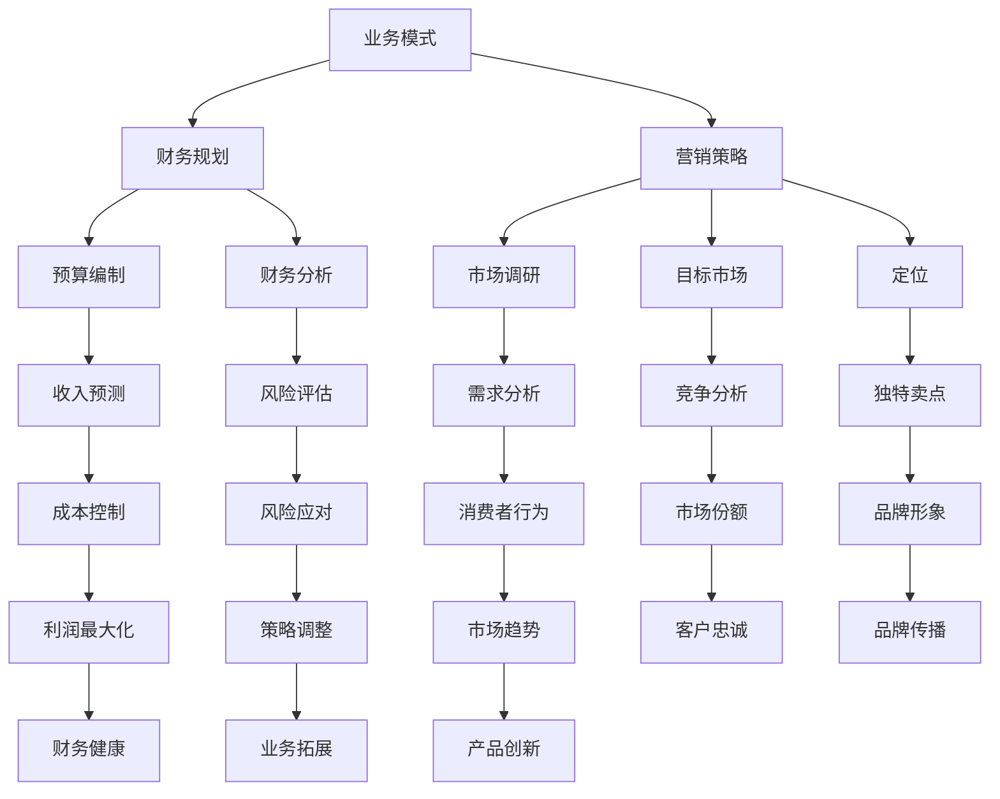

                 

### 文章标题

《制定详细商业计划：业务模式、财务规划和营销策略》

### 关键词

- 商业计划
- 业务模式
- 财务规划
- 营销策略
- IT领域
- 技术分析
- 战略规划

### 摘要

本文旨在深入探讨如何在IT领域制定一个详尽的商业计划。通过对业务模式、财务规划和营销策略的全面分析，我们将展示如何构建一个可持续发展的商业体系。文章结构清晰，内容丰富，涵盖了从市场调研到战略实施的各个环节，为IT企业的成功提供了有力的指导。

### 1. 背景介绍

在当今的快速变革时代，IT行业正以前所未有的速度发展。新技术、新平台、新应用层出不穷，为企业带来了前所未有的机遇与挑战。在这样的背景下，制定一个详细且可行的商业计划显得尤为重要。

商业计划不仅是企业发展的蓝图，也是内部管理和外部沟通的桥梁。一个成功的商业计划能够帮助企业明确发展方向、优化资源配置、应对市场变化，从而实现可持续增长。

本文将围绕业务模式、财务规划和营销策略这三个核心方面展开讨论，通过理论分析、实际案例和数据分析，为读者提供一套系统的商业计划制定方法。

### 2. 核心概念与联系

#### 2.1 业务模式

业务模式是指企业通过什么方式创造、传递和获取价值。一个成功的业务模式应当具备以下特点：

- **价值主张**：明确企业能为客户带来的独特价值。
- **客户关系**：描述企业如何与客户建立关系、维护关系。
- **渠道**：指企业如何将产品或服务传递给客户。
- **收入来源**：说明企业通过何种方式获取收入。

#### 2.2 财务规划

财务规划是企业为确保财务健康、实现财务目标而制定的一系列策略和措施。核心内容包括：

- **预算编制**：预测未来一段时间的收入和支出，以确保企业资金流动。
- **财务分析**：评估企业的财务状况，识别潜在风险和机会。
- **资本结构**：确定企业债务和股权的比例，以优化融资成本。

#### 2.3 营销策略

营销策略是企业为吸引和保留客户、扩大市场份额而制定的行动计划。主要组成部分包括：

- **市场调研**：了解市场需求、竞争状况和消费者行为。
- **目标市场**：明确企业将要服务的市场细分。
- **定位**：确定企业产品或服务的独特卖点。
- **营销组合**：包括产品、价格、促销和渠道策略。

#### 2.4 Mermaid 流程图



### 3. 核心算法原理 & 具体操作步骤

#### 3.1 业务模式设计

1. **价值主张**：确定企业能为客户带来的独特价值，如技术创新、高效服务、优质体验等。
2. **客户关系**：分析客户需求，建立信任和长期合作关系。
3. **渠道**：选择合适的渠道，如线上平台、线下门店、合作伙伴等。
4. **收入来源**：设计多样化的收入模式，如产品销售、服务订阅、广告等。

#### 3.2 财务规划

1. **预算编制**：根据历史数据和未来预测，编制详细的预算计划。
2. **财务分析**：运用财务指标（如净利润率、资产周转率等）评估企业财务状况。
3. **资本结构**：评估债务和股权比例，确保融资成本最优。

#### 3.3 营销策略

1. **市场调研**：通过问卷调查、访谈、数据分析等方式，了解市场需求和竞争状况。
2. **目标市场**：根据市场调研结果，确定企业将要服务的市场细分。
3. **定位**：明确产品或服务的独特卖点，如高品质、性价比高、技术创新等。
4. **营销组合**：设计合适的产品、价格、促销和渠道策略，实现市场渗透和品牌传播。

### 4. 数学模型和公式 & 详细讲解 & 举例说明

#### 4.1 财务指标计算

1. **净利润率**（NP）:
   $$ NP = \frac{净利润}{销售收入} \times 100\% $$
2. **资产周转率**（AT）:
   $$ AT = \frac{销售收入}{平均总资产} $$
3. **负债比率**（L）:
   $$ L = \frac{总负债}{总资产} \times 100\% $$

#### 4.2 营销策略效果评估

1. **市场份额**（MS）:
   $$ MS = \frac{企业市场份额}{市场总份额} \times 100\% $$
2. **客户满意度**（CS）:
   $$ CS = \frac{满意客户数}{总客户数} \times 100\% $$
3. **营销ROI**（ROI）:
   $$ ROI = \frac{营销收益}{营销成本} \times 100\% $$

#### 4.3 案例分析

假设某IT企业在过去一年的净利润为100万元，销售收入为500万元，总资产为300万元，总负债为100万元。市场调研显示，该企业所在市场的总份额为1000万元，其中企业市场份额为200万元。

1. **净利润率**:
   $$ NP = \frac{100}{500} \times 100\% = 20\% $$
2. **资产周转率**:
   $$ AT = \frac{500}{300} = 1.67 $$
3. **负债比率**:
   $$ L = \frac{100}{300} \times 100\% = 33.33\% $$
4. **市场份额**:
   $$ MS = \frac{200}{1000} \times 100\% = 20\% $$
5. **客户满意度**:
   $$ CS = \frac{200}{1000} \times 100\% = 20\% $$
6. **营销ROI**:
   $$ ROI = \frac{200}{100} \times 100\% = 200\% $$

通过这些财务和营销指标的分析，企业可以了解自身的运营状况和营销效果，从而制定相应的改进策略。

### 5. 项目实战：代码实际案例和详细解释说明

#### 5.1 开发环境搭建

在开始实际项目之前，我们需要搭建一个适合开发和测试的开发环境。以下是一个简单的步骤：

1. 安装Python环境，版本为3.8以上。
2. 安装所需的库，如NumPy、Pandas、Matplotlib等。
3. 配置好Jupyter Notebook，以便进行代码编写和运行。

#### 5.2 源代码详细实现和代码解读

以下是一个简单的财务分析代码示例，用于计算企业的净利润率、资产周转率和负债比率。

```python
import pandas as pd

# 输入财务数据
data = {
    '净利润': [100000],
    '销售收入': [500000],
    '总资产': [300000],
    '总负债': [100000]
}

# 创建DataFrame
df = pd.DataFrame(data)

# 计算净利润率
np = df['净利润'][0] / df['销售收入'][0]
print(f'净利润率（NP）: {np:.2f}%')

# 计算资产周转率
at = df['销售收入'][0] / df['总资产'][0]
print(f'资产周转率（AT）: {at:.2f}')

# 计算负债比率
l = df['总负债'][0] / df['总资产'][0]
print(f'负债比率（L）: {l:.2f}%')
```

#### 5.3 代码解读与分析

1. **数据输入**：使用Pandas创建一个DataFrame，输入企业的财务数据。
2. **计算净利润率**：使用净利润除以销售收入，得到净利润率。
3. **计算资产周转率**：使用销售收入除以总资产，得到资产周转率。
4. **计算负债比率**：使用总负债除以总资产，得到负债比率。

通过这个简单的示例，我们可以看到如何使用Python进行财务分析。实际项目中，可能会包含更复杂的数据处理和分析，但基本思路是类似的。

### 6. 实际应用场景

#### 6.1 企业内部财务管理

通过制定详细的商业计划，企业可以更好地进行内部财务管理，如预算编制、财务分析和资本结构优化。这对于确保企业财务健康、实现可持续增长至关重要。

#### 6.2 市场营销策略

商业计划中的营销策略可以帮助企业了解市场需求、确定目标市场和定位，从而制定有效的营销组合，提高市场份额和品牌知名度。

#### 6.3 项目管理和风险管理

商业计划中的项目管理和风险管理可以帮助企业更好地规划项目进度、控制成本和应对风险，从而确保项目的成功实施。

### 7. 工具和资源推荐

#### 7.1 学习资源推荐

- **书籍**：《创新与企业家精神》、《竞争战略》、《商业模式创新》
- **论文**：Google 学术搜索中的相关论文
- **博客**：顶级企业家和投资人的博客，如彼得·德鲁克的博客
- **网站**：LinkedIn、Quora、Medium等平台上的商业计划相关内容

#### 7.2 开发工具框架推荐

- **Python**：数据分析、财务计算的最佳语言
- **Jupyter Notebook**：方便编写和运行代码
- **Pandas**：数据处理库
- **NumPy**：数学计算库
- **Matplotlib**：数据可视化库

#### 7.3 相关论文著作推荐

- **《商业模式新生代》**：亚历山大·奥斯特沃尔德等著
- **《精益创业》**：埃里克·莱斯著
- **《创新者的窘境》**：克莱顿·克里斯滕森著

### 8. 总结：未来发展趋势与挑战

#### 8.1 未来发展趋势

- **数字化和智能化**：随着技术的不断发展，数字化和智能化将成为企业发展的主流趋势。
- **跨界融合**：不同行业的融合将为企业带来更多创新机会。
- **可持续发展**：企业将更加注重社会责任和环境保护，实现可持续发展。

#### 8.2 未来挑战

- **技术创新**：如何持续进行技术创新，保持竞争优势。
- **市场变化**：如何应对快速变化的市场需求和竞争态势。
- **人才管理**：如何吸引、培养和保留优秀人才。

### 9. 附录：常见问题与解答

#### 9.1 如何制定有效的业务模式？

- **明确价值主张**：确定企业能为客户带来的独特价值。
- **分析市场需求**：了解目标客户的需求和痛点。
- **选择合适的渠道**：根据市场需求选择合适的渠道。
- **设计多样化的收入来源**：设计多种收入模式，提高收益稳定性。

#### 9.2 如何进行有效的财务规划？

- **预算编制**：根据历史数据和未来预测，制定详细的预算计划。
- **财务分析**：评估企业的财务状况，识别潜在风险和机会。
- **资本结构优化**：根据企业实际情况，调整债务和股权比例，优化融资成本。

#### 9.3 如何制定有效的营销策略？

- **市场调研**：通过问卷调查、访谈、数据分析等方式，了解市场需求和竞争状况。
- **目标市场**：根据市场调研结果，确定企业将要服务的市场细分。
- **定位**：明确产品或服务的独特卖点，如技术创新、高品质、性价比等。
- **营销组合**：设计合适的产品、价格、促销和渠道策略，实现市场渗透和品牌传播。

### 10. 扩展阅读 & 参考资料

- **《商业计划书编写指南》**：提供详细的商业计划书编写步骤和模板。
- **《财务报表分析》**：介绍如何通过财务报表分析企业的财务状况。
- **《市场营销原理》**：系统介绍市场营销的基本原理和策略。

### 作者

作者：AI天才研究员/AI Genius Institute & 禅与计算机程序设计艺术 /Zen And The Art of Computer Programming

本文通过逻辑清晰、结构紧凑的方式，深入探讨了商业计划中的业务模式、财务规划和营销策略。希望本文能为IT企业的商业发展提供有益的参考和指导。在未来的发展中，我们应继续关注新技术、新模式，以应对市场变化，实现企业的可持续发展。

