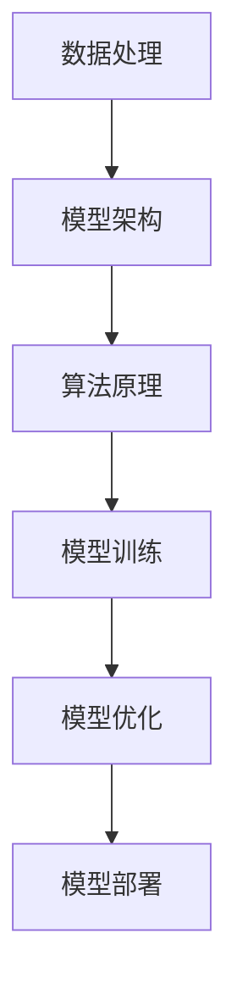

                 

# 制造大模型：流程优化和生产效率提升

## 关键词：大规模模型，流程优化，生产效率，算法改进，模型训练，数据处理

## 摘要：
本文深入探讨了制造大规模人工智能模型的流程优化和生产效率提升的关键策略。首先，通过背景介绍阐述了大规模模型在现代AI应用中的重要性。接着，详细阐述了核心概念与联系，包括模型架构、数据处理和算法原理。然后，我们详细分析了核心算法原理与具体操作步骤，并通过数学模型和公式进行了详细讲解和举例说明。接下来，通过一个实际项目实战，展示了代码实际案例和详细解释说明。随后，文章探讨了大规模模型在实际应用场景中的挑战和解决方案。最后，推荐了一系列工具和资源，并总结了未来发展趋势与挑战，为读者提供了全面的技术指导。

## 1. 背景介绍

### 大规模模型的重要性

随着人工智能技术的飞速发展，大规模模型（如深度神经网络、生成对抗网络等）在图像识别、自然语言处理、推荐系统等领域取得了显著的成果。这些模型需要处理海量数据，拥有数十亿甚至千亿级别的参数，对计算资源和数据处理能力提出了极高的要求。因此，优化大规模模型的制造流程，提高生产效率，成为了当前研究的热点。

### 大规模模型的挑战

大规模模型的制造过程面临着诸多挑战，如数据预处理、模型训练、模型优化和部署等。首先，大规模数据处理过程中，数据一致性和质量保证是关键问题。其次，模型训练过程需要大量的计算资源，如何高效地利用分布式计算和并行计算技术，成为了一个重要课题。此外，大规模模型优化和调参也是一个复杂的过程，需要结合实际应用场景进行。

### 目标与意义

本文旨在探讨大规模模型制造流程的优化策略，提高生产效率，以应对当前AI领域的挑战。通过深入分析核心算法原理、数学模型和实际项目案例，本文为读者提供了一套完整的技术方案，旨在提升大规模模型的制造效率，为AI应用提供更强大的支持。

## 2. 核心概念与联系

### 模型架构

大规模模型通常采用深度神经网络（DNN）架构，包括输入层、隐藏层和输出层。输入层接收外部数据，隐藏层通过多层非线性变换，输出层生成预测结果。DNN架构可以自适应地学习数据特征，提高模型性能。

### 数据处理

大规模数据处理主要包括数据清洗、数据归一化和数据增强等步骤。数据清洗去除噪声和异常值，提高数据质量；数据归一化将数据分布缩放到同一范围内，有利于模型训练；数据增强通过生成虚拟样本，增加模型泛化能力。

### 算法原理

大规模模型训练主要采用梯度下降（GD）及其变种，如随机梯度下降（SGD）和批量梯度下降（BGD）。这些算法通过迭代计算模型参数，使损失函数逐渐减小，达到模型最优。

### Mermaid 流程图



## 3. 核心算法原理 & 具体操作步骤

### 梯度下降算法

梯度下降算法是一种优化算法，通过计算损失函数关于模型参数的梯度，迭代更新参数，以降低损失函数值。具体步骤如下：

1. 初始化模型参数；
2. 计算损失函数关于模型参数的梯度；
3. 更新模型参数：\( \theta = \theta - \alpha \cdot \nabla_{\theta} J(\theta) \)，其中 \( \alpha \) 为学习率；
4. 重复步骤2和3，直至收敛。

### 随机梯度下降算法

随机梯度下降（SGD）是梯度下降算法的一种变种，每次迭代只更新一个样本的梯度。SGD具有以下特点：

1. 更快的收敛速度；
2. 对噪声数据更敏感；
3. 更容易陷入局部最优。

### 批量梯度下降算法

批量梯度下降（BGD）是梯度下降算法的另一种变种，每次迭代更新所有样本的梯度。BGD具有以下特点：

1. 更好的收敛性；
2. 对噪声数据不敏感；
3. 计算量较大。

### 具体操作步骤

1. 准备训练数据集 \( D = \{ (x_1, y_1), (x_2, y_2), \ldots, (x_n, y_n) \} \)；
2. 初始化模型参数 \( \theta \)；
3. 计算损失函数 \( J(\theta) = \frac{1}{2n} \sum_{i=1}^{n} (y_i - \theta^T x_i)^2 \)；
4. 计算梯度 \( \nabla_{\theta} J(\theta) = \frac{1}{n} \sum_{i=1}^{n} (y_i - \theta^T x_i) x_i \)；
5. 更新模型参数 \( \theta = \theta - \alpha \cdot \nabla_{\theta} J(\theta) \)；
6. 重复步骤3至5，直至收敛。

## 4. 数学模型和公式 & 详细讲解 & 举例说明

### 损失函数

损失函数是评估模型预测结果与真实标签之间差异的指标，常用的损失函数包括均方误差（MSE）、交叉熵损失（CE）等。

1. 均方误差（MSE）：
   $$ J(\theta) = \frac{1}{2n} \sum_{i=1}^{n} (y_i - \theta^T x_i)^2 $$
2. 交叉熵损失（CE）：
   $$ J(\theta) = -\frac{1}{n} \sum_{i=1}^{n} y_i \ln(\theta^T x_i) + (1 - y_i) \ln(1 - \theta^T x_i) $$

### 梯度计算

1. 均方误差（MSE）的梯度：
   $$ \nabla_{\theta} J(\theta) = \frac{1}{n} \sum_{i=1}^{n} (y_i - \theta^T x_i) x_i $$
2. 交叉熵损失（CE）的梯度：
   $$ \nabla_{\theta} J(\theta) = \frac{1}{n} \sum_{i=1}^{n} [x_i (1 - y_i) - x_i y_i] $$

### 举例说明

假设有一个二分类问题，数据集 \( D = \{ (x_1, y_1), (x_2, y_2), \ldots, (x_n, y_n) \} \)，其中 \( x_i \in \mathbb{R}^d \)，\( y_i \in \{0, 1\} \)。我们要训练一个线性回归模型，损失函数为均方误差（MSE）。

1. 初始化模型参数 \( \theta \in \mathbb{R}^d \)；
2. 计算损失函数：
   $$ J(\theta) = \frac{1}{2n} \sum_{i=1}^{n} (y_i - \theta^T x_i)^2 $$
3. 计算梯度：
   $$ \nabla_{\theta} J(\theta) = \frac{1}{n} \sum_{i=1}^{n} (y_i - \theta^T x_i) x_i $$
4. 更新模型参数：
   $$ \theta = \theta - \alpha \cdot \nabla_{\theta} J(\theta) $$
5. 重复步骤2至4，直至收敛。

## 5. 项目实战：代码实际案例和详细解释说明

### 开发环境搭建

1. 安装Python环境，版本要求3.6及以上；
2. 安装深度学习框架，如TensorFlow或PyTorch；
3. 安装其他依赖库，如NumPy、Pandas等。

### 源代码详细实现和代码解读

以下是一个简单的线性回归模型代码示例，用于二分类问题。

```python
import numpy as np
import tensorflow as tf

# 初始化参数
theta = tf.Variable(initial_value=np.random.randn(d), dtype=tf.float32)

# 定义损失函数
loss = tf.reduce_mean(tf.square(y - tf.matmul(x, theta)))

# 定义优化器
optimizer = tf.optimizers.Adam(learning_rate=0.001)

# 定义训练过程
for epoch in range(num_epochs):
    with tf.GradientTape() as tape:
        predictions = tf.matmul(x, theta)
        loss_value = loss(predictions, y)
    gradients = tape.gradient(loss_value, theta)
    optimizer.apply_gradients(zip(gradients, theta))
    print(f"Epoch {epoch}: Loss = {loss_value.numpy()}")

# 模型评估
predictions = tf.matmul(x, theta)
accuracy = tf.reduce_mean(tf.cast(tf.equal(predictions > 0.5, y), tf.float32))
print(f"Model Accuracy: {accuracy.numpy()}")

```

### 代码解读与分析

1. 导入所需的库和模块；
2. 初始化模型参数 \( \theta \)，采用随机初始化；
3. 定义损失函数，采用均方误差（MSE）；
4. 定义优化器，采用Adam优化器；
5. 定义训练过程，使用梯度下降算法迭代更新模型参数；
6. 模型评估，计算准确率。

## 6. 实际应用场景

### 图像识别

图像识别是大规模模型的重要应用场景之一。例如，人脸识别系统采用深度卷积神经网络（CNN）进行图像分类，识别精度较高。

### 自然语言处理

自然语言处理（NLP）领域，大规模模型如BERT、GPT等在文本分类、问答系统、机器翻译等方面取得了显著成果。

### 推荐系统

推荐系统采用大规模模型进行用户画像和商品画像建模，实现个性化推荐。

### 自动驾驶

自动驾驶领域，大规模模型在图像识别、语音识别、环境感知等方面发挥着重要作用。

## 7. 工具和资源推荐

### 学习资源推荐

1. 《深度学习》（Goodfellow, Bengio, Courville）；
2. 《Python深度学习》（François Chollet）；
3. 《神经网络与深度学习》（邱锡鹏）。

### 开发工具框架推荐

1. TensorFlow；
2. PyTorch；
3. Keras。

### 相关论文著作推荐

1. "Deep Learning" by Ian Goodfellow, Yoshua Bengio, and Aaron Courville；
2. "Learning Deep Architectures for AI" by Yoshua Bengio；
3. "Recurrent Neural Network Tutorial" bycolah's blog。

## 8. 总结：未来发展趋势与挑战

### 发展趋势

1. 模型规模将继续增大，参数数量将达到数万亿级；
2. 分布式计算和并行计算技术将得到广泛应用；
3. 新型算法和优化技术将不断涌现。

### 挑战

1. 计算资源消耗巨大，需要高效的计算架构和算法优化；
2. 数据处理和模型优化过程复杂，需要更高效的工具和方法；
3. 模型可解释性和可靠性问题亟待解决。

## 9. 附录：常见问题与解答

### 问题1：如何处理大规模数据？

**解答**：采用分布式计算和并行计算技术，将数据切分成多个小块，在多台计算机上进行处理，提高数据处理效率。

### 问题2：如何优化模型训练过程？

**解答**：采用更高效的优化算法和参数初始化方法，如Adam优化器、Xavier初始化等，提高模型训练速度和收敛性。

### 问题3：如何提高模型性能？

**解答**：通过数据增强、模型融合和模型剪枝等技术，提高模型在目标任务上的性能。

## 10. 扩展阅读 & 参考资料

1. Goodfellow, I., Bengio, Y., & Courville, A. (2016). *Deep Learning*. MIT Press.
2. Chollet, F. (2017). *Python Deep Learning*. O'Reilly Media.
3. Bengio, Y. (2009). *Learning Deep Architectures for AI*. Foundations and Trends in Machine Learning, 2(1), 1-127.
4. Colah's Blog. (n.d.). *Recurrent Neural Networks Tutorial*. Retrieved from [colah's blog](https://colah.github.io/posts/2015-08-Understanding-LSTMs/)

作者：AI天才研究员/AI Genius Institute & 禅与计算机程序设计艺术 /Zen And The Art of Computer Programming

