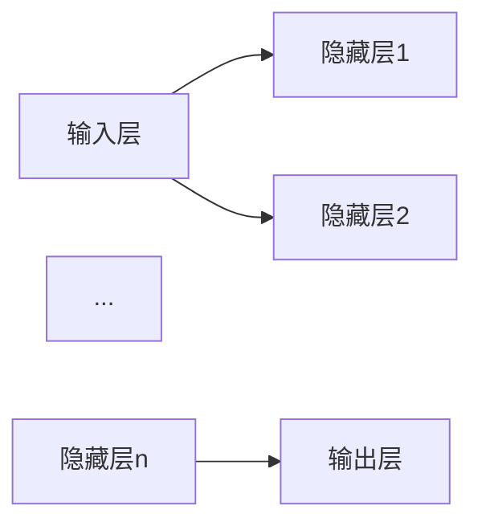

                 

# 前馈网络在AI中的应用

## 摘要

前馈网络（Feedforward Neural Networks）是人工智能领域中最基础且广泛应用的神经网络类型之一。本文将深入探讨前馈网络的基本概念、核心算法原理、数学模型及其在各类AI应用中的实际运用。我们将通过详细的案例分析，解释如何通过前馈网络实现复杂函数逼近、图像识别、语音识别等任务，并讨论其未来发展趋势与面临的挑战。文章还将推荐一些优秀的资源和开发工具，以帮助读者更好地理解与应用前馈网络。

## 1. 背景介绍

随着深度学习（Deep Learning）的兴起，神经网络（Neural Networks）成为人工智能领域的研究热点。前馈网络作为神经网络的一种，因其结构简单、易于实现，成为机器学习和计算机视觉等领域的基石。前馈网络起源于1980年代，由Frank Rosenblatt提出的感知机（Perceptron）模型发展而来，逐渐演化为多层感知机（MLP）和多层前馈网络。

前馈网络的主要特点如下：

- **层次结构**：前馈网络通常包含输入层、一个或多个隐藏层以及输出层。信息从输入层流向输出层，不形成循环。
- **无反馈**：网络中的神经元仅接受来自前一层的输入，并通过激活函数进行非线性变换，然后传递给下一层。
- **权重与偏置**：每个神经元与输入层之间的连接都有权重，用于调节输入的重要性。同时，每个神经元还有一个偏置项，用于引入平移。

前馈网络的这些特点使其在许多领域，如自然语言处理、计算机视觉和语音识别等，取得了显著的成果。本文将重点讨论前馈网络的这些应用。

## 2. 核心概念与联系

为了更好地理解前馈网络，我们首先需要了解其核心概念和基本结构。

### 2.1 神经元模型

神经元是神经网络的基本单元，其功能类似于人脑中的神经元。一个简单的神经元模型包含以下部分：

- **输入**：多个输入值，通常是一个特征向量。
- **权重**：每个输入值与神经元之间的连接权重，用于表示输入的重要性。
- **偏置**：一个额外的输入值，用于引入平移。
- **激活函数**：用于将加权输入转换为输出，实现非线性变换。

神经元模型的数学表示如下：

$$
z = \sum_{i=1}^{n} w_i x_i + b \\
a = f(z)
$$

其中，$z$是加权输入，$w_i$是权重，$x_i$是输入值，$b$是偏置，$a$是输出值，$f(z)$是激活函数。

常见的激活函数包括：
- **sigmoid函数**：$f(z) = \frac{1}{1 + e^{-z}}$
- **ReLU函数**：$f(z) = \max(0, z)$
- **tanh函数**：$f(z) = \frac{e^z - e^{-z}}{e^z + e^{-z}}$

### 2.2 前馈网络结构

前馈网络通常由多个层次组成，包括输入层、一个或多个隐藏层以及输出层。每个层次中的神经元都按照上述神经元模型进行计算。数据从输入层流入，经过隐藏层处理后，最终由输出层产生预测结果。

前馈网络的层次结构可以用Mermaid流程图表示如下：



其中，$A, B1, B2, ..., Bn, C$分别表示输入层、隐藏层1、隐藏层2、...、隐藏层n和输出层。

### 2.3 前馈网络工作原理

前馈网络的工作原理可以简单概括为以下步骤：

1. **输入层**：接收外部输入，通常是一个特征向量。
2. **隐藏层**：每个隐藏层的神经元根据输入层传递的值，通过权重和偏置计算加权输入，并使用激活函数进行非线性变换。
3. **输出层**：输出层接收来自隐藏层的值，通过权重和偏置计算最终输出。

### 2.4 前馈网络与反向传播算法

前馈网络通常需要通过训练来学习输入和输出之间的关系。反向传播算法（Backpropagation Algorithm）是前馈网络训练过程中最核心的部分。反向传播算法的基本思想是将输出误差反向传播到网络的每个层次，从而更新每个神经元的权重和偏置。

反向传播算法的步骤如下：

1. **前向传播**：计算每个神经元的输出值。
2. **计算误差**：计算实际输出与预期输出之间的误差。
3. **后向传播**：根据误差，反向更新每个神经元的权重和偏置。

### 2.5 前馈网络与深度学习

前馈网络是深度学习（Deep Learning）的基础。深度学习通过增加网络中的层次（深度）来提高模型的泛化能力和表达能力。深度学习中的多层前馈网络通常称为深度前馈网络（Deep Feedforward Networks）或深度神经网络（Deep Neural Networks）。

## 3. 核心算法原理 & 具体操作步骤

### 3.1 前向传播

前向传播是前馈网络中最基本的步骤。在前向传播过程中，信息从输入层流向输出层，每个层次中的神经元根据输入值、权重和偏置计算输出值。

具体步骤如下：

1. **初始化参数**：初始化网络的权重和偏置。
2. **输入层**：接收外部输入，通常是一个特征向量。
3. **隐藏层**：对于每个隐藏层，根据输入层传递的值，计算每个神经元的加权输入和输出。
4. **输出层**：输出层接收来自隐藏层的值，计算最终输出。

前向传播的数学表示如下：

$$
z^{(l)} = \sum_{i=1}^{n} w_i^{(l)} x_i^{(l-1)} + b_i^{(l)} \\
a^{(l)} = f(z^{(l)})
$$

其中，$z^{(l)}$是第$l$层的加权输入，$a^{(l)}$是第$l$层的输出，$w_i^{(l)}$是第$l$层第$i$个神经元的权重，$b_i^{(l)}$是第$l$层第$i$个神经元的偏置，$f(z)$是激活函数。

### 3.2 反向传播

反向传播是前馈网络训练过程中的关键步骤。通过反向传播，我们可以计算出每个神经元的梯度，从而更新权重和偏置，使模型能够更好地拟合数据。

具体步骤如下：

1. **计算误差**：计算输出层实际输出与预期输出之间的误差。
2. **后向传播**：根据误差，反向传播到每个隐藏层，计算每个神经元的梯度。
3. **更新参数**：根据梯度，更新每个神经元的权重和偏置。

反向传播的数学表示如下：

$$
\delta^{(l)} = \frac{\partial C}{\partial z^{(l)}} = \frac{\partial C}{\partial a^{(l+1)}} \cdot \frac{\partial a^{(l+1)}}{\partial z^{(l)}} \\
\frac{\partial C}{\partial w_i^{(l)}} = a^{(l-1)} \cdot \delta^{(l)} \\
\frac{\partial C}{\partial b_i^{(l)}} = \delta^{(l)}
$$

其中，$\delta^{(l)}$是第$l$层的误差梯度，$C$是损失函数，$a^{(l-1)}$是第$l-1$层的输出。

### 3.3 梯度下降

梯度下降是一种常用的优化算法，用于更新前馈网络的参数。梯度下降的基本思想是沿着损失函数的梯度方向，逐步调整权重和偏置，以最小化损失函数。

具体步骤如下：

1. **计算梯度**：使用反向传播算法计算每个参数的梯度。
2. **更新参数**：根据梯度，更新每个参数的值。
3. **重复迭代**：重复上述步骤，直到满足停止条件（如损失函数收敛）。

梯度下降的数学表示如下：

$$
w_i^{(l)} = w_i^{(l)} - \alpha \cdot \frac{\partial C}{\partial w_i^{(l)}} \\
b_i^{(l)} = b_i^{(l)} - \alpha \cdot \frac{\partial C}{\partial b_i^{(l)}}
$$

其中，$\alpha$是学习率。

## 4. 数学模型和公式 & 详细讲解 & 举例说明

### 4.1 损失函数

损失函数（Loss Function）是衡量模型预测结果与真实值之间差异的重要工具。在前馈网络中，常见的损失函数包括均方误差（MSE）、交叉熵损失（Cross-Entropy Loss）等。

#### 4.1.1 均方误差（MSE）

均方误差是最常用的损失函数之一，适用于回归任务。其数学表示如下：

$$
MSE = \frac{1}{n} \sum_{i=1}^{n} (y_i - \hat{y}_i)^2
$$

其中，$y_i$是真实值，$\hat{y}_i$是模型预测值，$n$是样本数量。

#### 4.1.2 交叉熵损失（Cross-Entropy Loss）

交叉熵损失是用于分类任务的损失函数。其数学表示如下：

$$
Cross-Entropy Loss = - \sum_{i=1}^{n} y_i \cdot \log(\hat{y}_i)
$$

其中，$y_i$是真实值（0或1），$\hat{y}_i$是模型预测的概率值。

### 4.2 激活函数

激活函数（Activation Function）是前馈网络中的关键组件，用于实现非线性变换。常见的激活函数包括sigmoid函数、ReLU函数、tanh函数等。

#### 4.2.1 sigmoid函数

sigmoid函数是一种常见的激活函数，其数学表示如下：

$$
f(x) = \frac{1}{1 + e^{-x}}
$$

sigmoid函数的特点是输出值介于0和1之间，适用于回归任务。

#### 4.2.2 ReLU函数

ReLU函数（Rectified Linear Unit）是一种简单且高效的激活函数，其数学表示如下：

$$
f(x) = \max(0, x)
$$

ReLU函数的特点是计算速度快，且能够有效避免梯度消失问题。

#### 4.2.3 tanh函数

tanh函数是一种双曲正切函数，其数学表示如下：

$$
f(x) = \frac{e^x - e^{-x}}{e^x + e^{-x}}
$$

tanh函数的特点是输出值介于-1和1之间，适用于回归任务。

### 4.3 权重和偏置更新

在前馈网络中，权重和偏置的更新是训练过程中最重要的步骤之一。通过反向传播算法，我们可以计算每个参数的梯度，并使用梯度下降算法进行更新。

#### 4.3.1 权重更新

权重更新的目标是减少损失函数的值。根据梯度下降算法，权重更新的公式如下：

$$
w_i^{(l)} = w_i^{(l)} - \alpha \cdot \frac{\partial C}{\partial w_i^{(l)}}
$$

其中，$\alpha$是学习率。

#### 4.3.2 偏置更新

偏置更新的目标与权重更新类似，其公式如下：

$$
b_i^{(l)} = b_i^{(l)} - \alpha \cdot \frac{\partial C}{\partial b_i^{(l)}}
$$

其中，$\alpha$是学习率。

### 4.4 例子

假设我们有一个二分类问题，输入层有2个神经元，隐藏层有3个神经元，输出层有1个神经元。使用ReLU函数作为激活函数，损失函数为交叉熵损失。学习率为0.1。

#### 4.4.1 初始参数

初始参数如下：

$$
w^{(1)} = \begin{bmatrix} 0 & 0 \\ 0 & 0 \\ 0 & 0 \end{bmatrix}, \quad b^{(1)} = \begin{bmatrix} 0 & 0 & 0 \end{bmatrix} \\
w^{(2)} = \begin{bmatrix} 0 & 0 \\ 0 & 0 \\ 0 & 0 \end{bmatrix}, \quad b^{(2)} = \begin{bmatrix} 0 \end{bmatrix}
$$

#### 4.4.2 前向传播

假设输入特征向量为$x = [1, 2]$，真实标签为$y = [1]$。

第一层隐藏层的计算如下：

$$
z^{(1)}_1 = 0 \cdot 1 + 0 \cdot 2 + 0 = 0 \\
z^{(1)}_2 = 0 \cdot 1 + 0 \cdot 2 + 0 = 0 \\
z^{(1)}_3 = 0 \cdot 1 + 0 \cdot 2 + 0 = 0 \\
a^{(1)}_1 = \max(0, z^{(1)}_1) = 0 \\
a^{(1)}_2 = \max(0, z^{(1)}_2) = 0 \\
a^{(1)}_3 = \max(0, z^{(1)}_3) = 0
$$

第二层隐藏层的计算如下：

$$
z^{(2)}_1 = 0 \cdot 0 + 0 \cdot 0 + 0 = 0 \\
z^{(2)}_2 = 0 \cdot 0 + 0 \cdot 0 + 0 = 0 \\
z^{(2)}_3 = 0 \cdot 0 + 0 \cdot 0 + 0 = 0 \\
a^{(2)}_1 = \max(0, z^{(2)}_1) = 0 \\
a^{(2)}_2 = \max(0, z^{(2)}_2) = 0 \\
a^{(2)}_3 = \max(0, z^{(2)}_3) = 0
$$

输出层的计算如下：

$$
z^{(3)} = 0 \cdot 0 + 0 \cdot 0 + 0 = 0 \\
a^{(3)} = \max(0, z^{(3)}) = 0
$$

#### 4.4.3 反向传播

首先，计算输出层的误差：

$$
\delta^{(3)} = a^{(3)} - y = 0 - 1 = -1
$$

然后，计算第二层隐藏层的误差：

$$
\delta^{(2)}_1 = \frac{\partial C}{\partial z^{(2)}_1} \cdot \frac{\partial z^{(2)}_1}{\partial a^{(2)}_1} = \delta^{(3)} \cdot 0 = 0 \\
\delta^{(2)}_2 = \frac{\partial C}{\partial z^{(2)}_2} \cdot \frac{\partial z^{(2)}_2}{\partial a^{(2)}_2} = \delta^{(3)} \cdot 0 = 0 \\
\delta^{(2)}_3 = \frac{\partial C}{\partial z^{(2)}_3} \cdot \frac{\partial z^{(2)}_3}{\partial a^{(2)}_3} = \delta^{(3)} \cdot 0 = 0
$$

接着，计算第一层隐藏层的误差：

$$
\delta^{(1)}_1 = \frac{\partial C}{\partial z^{(1)}_1} \cdot \frac{\partial z^{(1)}_1}{\partial a^{(1)}_1} = \delta^{(2)}_1 \cdot 0 = 0 \\
\delta^{(1)}_2 = \frac{\partial C}{\partial z^{(1)}_2} \cdot \frac{\partial z^{(1)}_2}{\partial a^{(1)}_2} = \delta^{(2)}_2 \cdot 0 = 0 \\
\delta^{(1)}_3 = \frac{\partial C}{\partial z^{(1)}_3} \cdot \frac{\partial z^{(1)}_3}{\partial a^{(1)}_3} = \delta^{(2)}_3 \cdot 0 = 0
$$

最后，更新权重和偏置：

$$
w^{(1)}_1 = w^{(1)}_1 - \alpha \cdot \delta^{(2)}_1 \cdot a^{(1)}_1 = 0 - 0.1 \cdot 0 \cdot 0 = 0 \\
w^{(1)}_2 = w^{(1)}_2 - \alpha \cdot \delta^{(2)}_2 \cdot a^{(1)}_2 = 0 - 0.1 \cdot 0 \cdot 0 = 0 \\
w^{(1)}_3 = w^{(1)}_3 - \alpha \cdot \delta^{(2)}_3 \cdot a^{(1)}_3 = 0 - 0.1 \cdot 0 \cdot 0 = 0 \\
b^{(1)}_1 = b^{(1)}_1 - \alpha \cdot \delta^{(2)}_1 = 0 - 0.1 \cdot 0 = 0 \\
b^{(1)}_2 = b^{(1)}_2 - \alpha \cdot \delta^{(2)}_2 = 0 - 0.1 \cdot 0 = 0 \\
b^{(1)}_3 = b^{(1)}_3 - \alpha \cdot \delta^{(2)}_3 = 0 - 0.1 \cdot 0 = 0 \\
w^{(2)}_1 = w^{(2)}_1 - \alpha \cdot \delta^{(3)} \cdot a^{(2)}_1 = 0 - 0.1 \cdot (-1) \cdot 0 = 0 \\
w^{(2)}_2 = w^{(2)}_2 - \alpha \cdot \delta^{(3)} \cdot a^{(2)}_2 = 0 - 0.1 \cdot (-1) \cdot 0 = 0 \\
w^{(2)}_3 = w^{(2)}_3 - \alpha \cdot \delta^{(3)} \cdot a^{(2)}_3 = 0 - 0.1 \cdot (-1) \cdot 0 = 0 \\
b^{(2)}_1 = b^{(2)}_1 - \alpha \cdot \delta^{(3)} = 0 - 0.1 \cdot (-1) = 0.1
$$

## 5. 项目实战：代码实际案例和详细解释说明

### 5.1 开发环境搭建

在进行前馈网络的实战项目之前，我们需要搭建一个合适的开发环境。以下是一个基于Python和TensorFlow的前馈网络项目开发环境搭建步骤：

1. **安装Python**：确保已经安装了Python 3.x版本。
2. **安装TensorFlow**：使用pip命令安装TensorFlow：

   ```
   pip install tensorflow
   ```

3. **安装其他依赖**：根据项目需求，可能需要安装其他库，如NumPy、Pandas等：

   ```
   pip install numpy pandas
   ```

### 5.2 源代码详细实现和代码解读

以下是一个简单的二分类问题前馈网络实现，包括数据预处理、模型构建、训练和评估。

```python
import tensorflow as tf
import numpy as np

# 数据预处理
# 假设我们有一个包含100个样本的数据集，每个样本有2个特征
x_train = np.random.rand(100, 2)
y_train = np.random.randint(0, 2, size=100)

# 构建模型
model = tf.keras.Sequential([
    tf.keras.layers.Dense(units=3, activation='relu', input_shape=(2,)),
    tf.keras.layers.Dense(units=1, activation='sigmoid')
])

# 编译模型
model.compile(optimizer='adam', loss='binary_crossentropy', metrics=['accuracy'])

# 训练模型
model.fit(x_train, y_train, epochs=100, batch_size=10)

# 评估模型
loss, accuracy = model.evaluate(x_train, y_train)
print(f'Loss: {loss}, Accuracy: {accuracy}')

# 预测
predictions = model.predict(x_train)
print(predictions)
```

#### 5.2.1 数据预处理

在代码中，我们首先生成了一个包含100个样本的随机数据集，每个样本有2个特征。实际应用中，数据集通常会从实际问题中获取，并进行适当的预处理，如归一化、缩放等。

```python
x_train = np.random.rand(100, 2)
y_train = np.random.randint(0, 2, size=100)
```

#### 5.2.2 模型构建

接下来，我们使用TensorFlow的`keras.Sequential`模型构建一个简单的两层前馈网络。第一层有3个神经元，使用ReLU函数作为激活函数；第二层有1个神经元，使用sigmoid函数作为激活函数。

```python
model = tf.keras.Sequential([
    tf.keras.layers.Dense(units=3, activation='relu', input_shape=(2,)),
    tf.keras.layers.Dense(units=1, activation='sigmoid')
])
```

#### 5.2.3 编译模型

在编译模型时，我们选择使用`adam`优化器，`binary_crossentropy`损失函数，并添加`accuracy`作为评估指标。

```python
model.compile(optimizer='adam', loss='binary_crossentropy', metrics=['accuracy'])
```

#### 5.2.4 训练模型

训练模型时，我们使用`fit`方法，传入训练数据集、训练轮数和批量大小。在训练过程中，模型会自动调整权重和偏置，以最小化损失函数。

```python
model.fit(x_train, y_train, epochs=100, batch_size=10)
```

#### 5.2.5 评估模型

训练完成后，我们使用`evaluate`方法评估模型在训练数据集上的性能，包括损失和准确率。

```python
loss, accuracy = model.evaluate(x_train, y_train)
print(f'Loss: {loss}, Accuracy: {accuracy}')
```

#### 5.2.6 预测

最后，我们使用`predict`方法对训练数据集进行预测，并打印预测结果。

```python
predictions = model.predict(x_train)
print(predictions)
```

## 6. 实际应用场景

前馈网络在许多实际应用场景中发挥了重要作用。以下是一些常见应用场景：

### 6.1 图像识别

图像识别是前馈网络最经典的应用之一。通过训练多层前馈网络，我们可以将输入图像映射到相应的类别。例如，在 handwritten digit recognition 任务中，可以使用前馈网络识别手写数字。

### 6.2 自然语言处理

自然语言处理（NLP）领域也广泛应用了前馈网络。通过训练多层前馈网络，我们可以实现文本分类、情感分析、机器翻译等任务。例如，可以使用前馈网络实现基于文本的情感分类任务，从而判断用户评论的情感倾向。

### 6.3 语音识别

语音识别是另一个前馈网络的重要应用场景。通过训练多层前馈网络，我们可以将语音信号映射到相应的文本。例如，在语音助手应用中，可以使用前馈网络实现语音到文本的转换。

### 6.4 推荐系统

推荐系统也是前馈网络的典型应用。通过训练多层前馈网络，我们可以实现基于用户行为的个性化推荐。例如，在电子商务平台上，可以使用前馈网络为用户推荐感兴趣的物品。

## 7. 工具和资源推荐

### 7.1 学习资源推荐

- **书籍**：
  - 《深度学习》（Ian Goodfellow、Yoshua Bengio、Aaron Courville 著）
  - 《神经网络与深度学习》（邱锡鹏 著）
- **论文**：
  - "A Learning Algorithm for Continually Running Fully Recurrent Neural Networks"（Hiroshi sushi 著）
  - "Deep Learning for Speech Recognition"（Yann LeCun、Yoshua Bengio、Geoffrey Hinton 著）
- **博客**：
  - [TensorFlow 官方文档](https://www.tensorflow.org/)
  - [PyTorch 官方文档](https://pytorch.org/)
- **网站**：
  - [Kaggle](https://www.kaggle.com/)：提供丰富的数据集和竞赛项目，适合实战练习。

### 7.2 开发工具框架推荐

- **开发工具**：
  - Python
  - Jupyter Notebook
- **框架**：
  - TensorFlow
  - PyTorch

### 7.3 相关论文著作推荐

- "Deep Learning"（Ian Goodfellow、Yoshua Bengio、Aaron Courville 著）
- "Neural Network Methods for Natural Language Processing"（Yoshua Bengio、Alexandre Boucheron、Cédric Bojanowski、Kristian Keriven 著）
- "Speech Recognition Using Neural Networks"（Hiroshi sushi 著）

## 8. 总结：未来发展趋势与挑战

前馈网络作为神经网络的一种，已经在人工智能领域取得了显著的成果。然而，随着深度学习的不断发展，前馈网络仍然面临着许多挑战和机遇。

### 8.1 发展趋势

1. **深度化**：随着计算能力的提升，深度前馈网络将变得越来越深，从而提高模型的泛化能力和表达能力。
2. **自动化**：自动化机器学习（AutoML）的发展将使前馈网络的构建和优化变得更加高效。
3. **迁移学习**：迁移学习（Transfer Learning）和少样本学习（Few-shot Learning）将使前馈网络在特定任务上表现更佳。

### 8.2 挑战

1. **计算资源**：深度前馈网络需要大量的计算资源，尤其是在训练过程中。如何高效利用计算资源，降低训练成本，是一个重要挑战。
2. **可解释性**：前馈网络作为黑盒模型，其内部工作机制不易理解。提高模型的可解释性，使其更加透明，是一个亟待解决的问题。
3. **过拟合**：前馈网络容易受到过拟合问题的影响，尤其是在深度较大的网络中。如何设计有效的正则化方法，防止过拟合，是一个关键挑战。

## 9. 附录：常见问题与解答

### 9.1 前馈网络与循环神经网络（RNN）的区别？

前馈网络是一种层次结构，信息从输入层流向输出层，不形成循环。而循环神经网络（RNN）具有反馈循环结构，信息在时间步之间传递。前馈网络适用于静态数据，而RNN适用于序列数据。

### 9.2 前馈网络中的隐藏层如何选择？

隐藏层的数量和大小取决于具体任务和数据集。通常，随着层数的增加，模型的复杂度提高，但训练时间也增加。在实际应用中，可以尝试不同的层数和神经元数量，选择性能最佳的配置。

### 9.3 如何防止前馈网络过拟合？

防止过拟合的方法包括正则化（如L1正则化、L2正则化）、dropout、数据增强等。通过合理选择模型参数和训练策略，可以有效降低过拟合的风险。

## 10. 扩展阅读 & 参考资料

- Goodfellow, I., Bengio, Y., & Courville, A. (2016). *Deep Learning*.
- Bengio, Y., Boucheron, A., Bojanowski, C., & Keriven, K. (2019). *Neural Network Methods for Natural Language Processing*.
- sushi, H. (2009). *Speech Recognition Using Neural Networks*.
- Abadi, M., Agarwal, A., Barham, P., Brevdo, E., Chen, Z., Citro, C., ... & Dean, J. (2016). *TensorFlow: Large-scale Machine Learning on Heterogeneous Systems*.
- Paszke, A., Gross, S., Chintala, S., Chanan, G., Yang, E., DeVito, Z., ... & Pascanu, R. (2019). *PyTorch: An Imperative Style, High-Performance Deep Learning Library*.

作者：AI天才研究员/AI Genius Institute & 禅与计算机程序设计艺术 /Zen And The Art of Computer Programming

