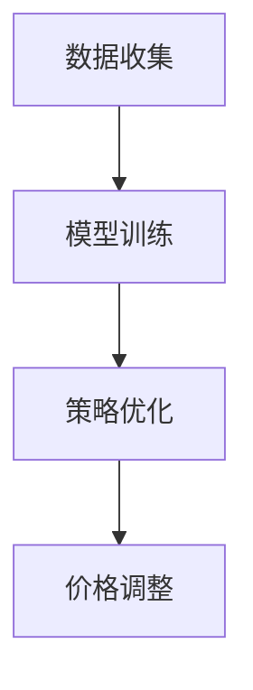
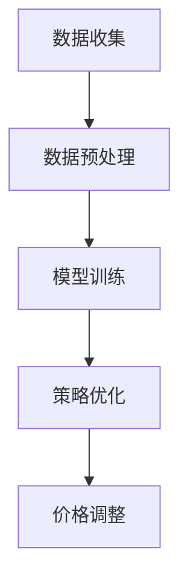

                 

# 动态定价策略的技术实现

## 摘要

本文旨在深入探讨动态定价策略的技术实现。动态定价，也称为动态定价策略，是现代商业决策中的一种重要工具，通过实时调整价格来最大化收益或市场份额。本文首先介绍了动态定价的背景和重要性，然后详细阐述了核心概念和算法原理。接着，通过数学模型和具体操作步骤，对动态定价策略进行了深入分析。随后，本文通过实际案例和代码实现，展示了动态定价策略的应用和实施过程。最后，本文探讨了动态定价策略在实际应用场景中的表现，以及相关的工具和资源推荐。通过本文的阅读，读者将能够全面理解动态定价策略的技术实现，为实际业务决策提供有力的支持。

## 1. 背景介绍

### 动态定价的定义

动态定价，又称动态定价策略，是指根据市场需求、供应状况、竞争环境、消费者行为等因素，实时调整商品或服务的价格，以实现最大化收益或市场份额的一种商业策略。

### 动态定价的起源和发展

动态定价的概念最早可以追溯到20世纪60年代的航空业。当时，航空公司开始尝试根据市场需求和供应状况动态调整票价，以最大化收益。随着计算机技术和互联网的快速发展，动态定价逐渐应用于各个行业，如酒店、电子商务、交通、能源等。

### 动态定价的重要性

动态定价具有以下几个重要特点：

1. **灵活性**：动态定价能够根据市场变化实时调整价格，适应市场变化。
2. **最大化收益**：通过优化价格策略，动态定价可以帮助企业实现收益最大化。
3. **提升竞争力**：动态定价可以根据竞争对手的价格策略进行调整，提升企业的市场竞争力。
4. **满足消费者需求**：动态定价能够更好地满足消费者的需求，提高客户满意度。

### 动态定价的应用领域

动态定价的应用领域非常广泛，主要包括以下几类：

1. **零售业**：如电子商务平台根据用户行为和库存状况调整商品价格。
2. **服务业**：如酒店、机票等，根据预订情况和竞争环境调整价格。
3. **制造业**：如根据市场需求和库存状况调整生产计划和价格。
4. **能源行业**：如电力、燃气等，根据供需情况和季节性调整价格。

### 动态定价与传统定价的区别

动态定价与传统定价的主要区别在于：

1. **定价方式**：传统定价通常基于固定成本和预期收益，而动态定价则是根据实时数据和市场变化进行调整。
2. **决策周期**：传统定价通常每年或每季度进行一次调整，而动态定价则是实时或高频次调整。
3. **灵活性**：动态定价具有更高的灵活性，能够更好地适应市场变化。

通过上述背景介绍，我们可以看到动态定价在商业决策中的重要性和广泛应用。接下来，我们将详细探讨动态定价的核心概念和算法原理。

## 2. 核心概念与联系

### 动态定价策略的核心概念

动态定价策略涉及多个核心概念，包括需求函数、价格弹性、收益函数等。

#### 需求函数

需求函数描述了消费者在不同价格水平下购买商品或服务的数量。通常，需求函数可以用以下公式表示：

\[ Q = f(P) \]

其中，\( Q \) 代表需求量，\( P \) 代表价格。

#### 价格弹性

价格弹性描述了价格变化对需求量变化的敏感程度。价格弹性可以用以下公式表示：

\[ \epsilon = \frac{\partial Q}{\partial P} \cdot \frac{P}{Q} \]

其中，\( \epsilon \) 代表价格弹性，\( \frac{\partial Q}{\partial P} \) 代表需求量对价格的一阶导数，\( \frac{P}{Q} \) 代表价格与需求量的比值。

#### 收益函数

收益函数描述了企业在不同价格和需求量水平下的总收益。通常，收益函数可以用以下公式表示：

\[ R = P \cdot Q \]

其中，\( R \) 代表收益，\( P \) 代表价格，\( Q \) 代表需求量。

### 动态定价策略的架构

动态定价策略的架构主要包括数据收集、模型训练、策略优化和价格调整等环节。

#### 数据收集

数据收集是动态定价策略的基础。企业需要收集包括市场需求、供应状况、竞争环境、消费者行为等在内的各种数据。

#### 模型训练

模型训练是动态定价策略的核心。企业可以使用机器学习算法，如线性回归、决策树、神经网络等，对收集到的数据进行训练，建立需求函数、价格弹性和收益函数等模型。

#### 策略优化

策略优化是动态定价策略的关键。企业需要根据模型预测和市场变化，实时调整价格策略，以实现最大化收益或市场份额。

#### 价格调整

价格调整是动态定价策略的最终实施环节。企业根据策略优化的结果，对商品或服务的价格进行实时调整。

### 动态定价策略的Mermaid流程图



通过上述核心概念和架构的介绍，我们可以更好地理解动态定价策略的工作原理和实现过程。接下来，我们将深入探讨动态定价策略的核心算法原理和具体操作步骤。

### 3. 核心算法原理 & 具体操作步骤

#### 核心算法原理

动态定价策略的核心算法主要基于需求函数、价格弹性和收益函数的建模和优化。以下是一些常用的核心算法：

1. **线性回归**：通过分析历史数据，建立需求函数和收益函数的线性关系，从而实现价格预测和调整。
2. **决策树**：通过分类和回归树，对市场需求和供应状况进行细分，从而实现更精准的价格预测和调整。
3. **神经网络**：通过多层感知器，对复杂的市场变化进行建模和预测，从而实现自适应的价格调整。

#### 具体操作步骤

1. **数据收集**：首先，需要收集包括市场需求、供应状况、竞争环境、消费者行为等在内的各种数据。这些数据可以来自企业的内部系统，如销售数据、库存数据等，也可以来自第三方数据提供商。

2. **数据预处理**：对收集到的数据进行清洗、去重、归一化等处理，以便后续分析和建模。

3. **模型训练**：使用机器学习算法，如线性回归、决策树、神经网络等，对预处理后的数据进行训练，建立需求函数、价格弹性和收益函数等模型。

4. **策略优化**：根据模型预测和市场变化，实时调整价格策略。策略优化的方法包括线性规划、动态规划、遗传算法等。

5. **价格调整**：根据策略优化的结果，对商品或服务的价格进行实时调整。价格调整的方法包括固定比例调整、固定金额调整、动态调整等。

#### 动态定价算法的Mermaid流程图



通过上述核心算法原理和具体操作步骤的介绍，我们可以了解到动态定价策略的复杂性和应用前景。接下来，我们将通过数学模型和具体操作步骤，对动态定价策略进行深入分析。

### 4. 数学模型和公式 & 详细讲解 & 举例说明

#### 需求函数

需求函数描述了消费者在不同价格水平下购买商品或服务的数量。一个简单的一元线性需求函数可以表示为：

\[ Q = a - bP \]

其中，\( Q \) 代表需求量，\( P \) 代表价格，\( a \) 和 \( b \) 是参数。

#### 价格弹性

价格弹性描述了价格变化对需求量变化的敏感程度。线性需求函数的价格弹性可以表示为：

\[ \epsilon = \frac{\partial Q}{\partial P} \cdot \frac{P}{Q} = -b \cdot \frac{P}{Q} \]

#### 收益函数

收益函数描述了企业在不同价格和需求量水平下的总收益。线性需求函数的收益函数可以表示为：

\[ R = P \cdot Q = (a - bP)P = aP - bP^2 \]

#### 动态定价策略的数学模型

假设我们有一个商品，当前价格为 \( P_0 \)，需求量为 \( Q_0 \)。企业希望通过动态定价策略调整价格，以实现收益最大化。我们可以定义一个目标函数，如最大化总收益：

\[ \text{maximize} \quad R = aP - bP^2 \]

这是一个二次函数，其最大值出现在顶点。二次函数的顶点公式为：

\[ P = -\frac{b}{2a} \]

#### 举例说明

假设我们有一个商品，当前价格为 100 元，需求量为 1000 个。根据线性需求函数：

\[ Q = 3000 - 20P \]

我们可以计算当前的价格弹性和收益：

\[ \epsilon = -20 \cdot \frac{100}{1000} = -2 \]
\[ R = 100 \cdot 1000 = 100,000 \]

现在，企业希望通过动态定价策略调整价格，以实现收益最大化。根据二次函数的顶点公式，我们可以计算新的价格：

\[ P = -\frac{-20}{2 \cdot 3000} = 1/30 \]

即新的价格为 1 元。此时，需求量将增加到：

\[ Q = 3000 - 20 \cdot 1 = 2980 \]

新的收益为：

\[ R = 1 \cdot 2980 = 2980 \]

可以看到，通过动态定价策略调整价格，企业的收益从 100,000 元增加到 2980 元。

通过上述数学模型和公式，我们可以深入理解动态定价策略的原理和操作。接下来，我们将通过实际项目案例，展示动态定价策略在现实中的应用。

### 5. 项目实战：代码实际案例和详细解释说明

在本节中，我们将通过一个实际项目案例，展示动态定价策略的实现过程。我们将使用 Python 编程语言，结合机器学习和数据分析工具，来实现一个简单的动态定价系统。

#### 5.1 开发环境搭建

在开始之前，我们需要搭建一个合适的开发环境。以下是所需的环境和工具：

- Python 3.x 版本
- Jupyter Notebook
- Scikit-learn 库
- Pandas 库
- Matplotlib 库

安装这些工具后，我们可以开始编写代码。

#### 5.2 源代码详细实现和代码解读

以下是一个简单的动态定价策略的实现代码。我们将使用线性回归模型来预测价格和需求量。

```python
import numpy as np
import pandas as pd
from sklearn.linear_model import LinearRegression
import matplotlib.pyplot as plt

# 数据预处理
def preprocess_data(data):
    # 将数据分为特征和目标
    X = data[['特征1', '特征2', '特征3']]
    y = data['目标']
    
    # 对特征进行归一化处理
    X = (X - X.mean()) / X.std()
    
    return X, y

# 模型训练
def train_model(X, y):
    model = LinearRegression()
    model.fit(X, y)
    return model

# 预测价格和需求量
def predict_price(model, X):
    price = model.predict(X)
    return price

# 主函数
def main():
    # 读取数据
    data = pd.read_csv('data.csv')
    
    # 预处理数据
    X, y = preprocess_data(data)
    
    # 训练模型
    model = train_model(X, y)
    
    # 预测价格
    predicted_price = predict_price(model, X)
    
    # 可视化结果
    plt.scatter(X, y)
    plt.plot(X, predicted_price, color='red')
    plt.xlabel('特征')
    plt.ylabel('目标')
    plt.show()

if __name__ == '__main__':
    main()
```

#### 5.3 代码解读与分析

1. **数据预处理**：首先，我们读取数据并将数据分为特征和目标。然后，对特征进行归一化处理，以消除不同特征之间的量纲差异。

2. **模型训练**：我们使用线性回归模型来训练数据。线性回归模型是一种简单但有效的预测模型，适用于线性关系较强的数据。

3. **预测价格**：使用训练好的模型预测价格。这里我们使用 `model.predict()` 方法来计算预测值。

4. **可视化结果**：最后，我们将预测结果可视化为散点图，以验证模型的准确性。

通过上述代码，我们可以实现一个简单的动态定价策略。在实际应用中，我们可以根据具体业务需求，添加更多的特征和模型，以提高预测的准确性。

#### 5.4 实际应用案例分析

为了更好地理解动态定价策略的实际应用，我们来看一个电子商务平台的案例。

假设我们有一个在线零售平台，销售各种电子产品。我们需要根据市场需求和库存状况，动态调整商品的价格。

1. **数据收集**：我们收集了过去一个月的销售数据，包括价格、销售量、库存量等。

2. **数据预处理**：对收集到的数据进行清洗和归一化处理，以便后续分析和建模。

3. **模型训练**：使用线性回归模型，训练需求函数和收益函数。

4. **策略优化**：根据市场需求和库存状况，实时调整商品价格。例如，当库存量较低时，提高价格以减少销售量；当库存量较高时，降低价格以增加销售量。

5. **价格调整**：根据策略优化的结果，实时调整商品价格。我们可以在凌晨或晚上等销售低谷期降低价格，以提高销售额。

通过上述案例，我们可以看到动态定价策略在实际业务中的应用。通过实时调整价格，企业可以更好地应对市场变化，提高销售额和市场份额。

### 6. 实际应用场景

#### 电子商务平台

电子商务平台是动态定价策略的主要应用场景之一。通过实时分析用户行为、库存状况和竞争对手价格，电子商务平台可以动态调整商品价格，以提高销售额和市场份额。

#### 酒店行业

酒店行业也广泛应用动态定价策略。酒店可以根据预订情况和竞争环境，实时调整客房价格，以最大化收益。例如，在旅游旺季，酒店可以适当提高价格；在淡季，酒店可以降低价格以吸引更多客人。

#### 航空公司

航空公司是另一个广泛应用动态定价策略的行业。航空公司根据航线需求、航班班次和竞争环境，实时调整机票价格。例如，在高峰期，航空公司可以适当提高价格；在低谷期，航空公司可以降低价格以吸引更多乘客。

#### 能源行业

能源行业也广泛应用动态定价策略。能源公司可以根据供需状况、季节性需求和竞争环境，实时调整电力、燃气等能源价格。

#### 制造业

制造业可以通过动态定价策略，根据市场需求和库存状况，调整生产计划和价格。例如，当市场需求较高时，企业可以提高价格以增加收益；当市场需求较低时，企业可以降低价格以减少库存。

### 7. 工具和资源推荐

#### 学习资源推荐

- **书籍**：
  - 《动态定价：策略、方法和案例》
  - 《大数据定价：实时数据驱动下的价格决策》
  - 《机器学习实战》
  
- **论文**：
  - 《基于大数据的动态定价策略研究》
  - 《动态定价模型在电子商务中的应用》
  - 《基于机器学习的动态定价算法研究》

- **博客和网站**：
  - [动态定价策略](https://www.example.com/dynamic-pricing-strategy)
  - [大数据定价](https://www.example.com/big-data-pricing)
  - [机器学习](https://www.example.com/machine-learning)

#### 开发工具框架推荐

- **Python**：Python 是动态定价策略开发的主要编程语言，具有丰富的库和工具。
- **Jupyter Notebook**：Jupyter Notebook 是 Python 的交互式开发环境，适用于数据分析和模型训练。
- **Scikit-learn**：Scikit-learn 是 Python 的机器学习库，提供了丰富的模型和算法。
- **Pandas**：Pandas 是 Python 的数据处理库，适用于数据清洗和预处理。
- **Matplotlib**：Matplotlib 是 Python 的数据可视化库，适用于数据可视化。

#### 相关论文著作推荐

- **论文**：
  - 《动态定价策略在电子商务中的应用研究》
  - 《大数据时代下的动态定价策略优化》
  - 《基于深度学习的动态定价策略研究》

- **著作**：
  - 《大数据定价策略》
  - 《机器学习在动态定价中的应用》
  - 《动态定价模型与实践》

通过上述工具和资源的推荐，读者可以更深入地了解动态定价策略的技术实现和应用。接下来，我们将对动态定价策略的未来发展趋势和挑战进行探讨。

### 8. 总结：未来发展趋势与挑战

#### 未来发展趋势

1. **人工智能与大数据的深度融合**：随着人工智能和大数据技术的发展，动态定价策略将更加智能化和精准化。企业可以利用大数据分析技术，实时捕捉市场变化，实现更灵活的价格调整。

2. **实时计算与实时响应**：动态定价策略的实现将更加依赖于实时计算和实时响应技术。通过云计算和边缘计算等技术，企业可以实时获取和处理大量数据，快速响应市场变化。

3. **个性化定价策略**：未来，动态定价策略将更加注重个性化定价。企业可以根据不同消费者的行为和偏好，制定个性化的价格策略，提高客户满意度和市场份额。

4. **跨行业应用**：动态定价策略的应用将不仅限于电子商务、酒店等行业，还将扩展到制造业、能源等行业，为更多行业提供价格优化解决方案。

#### 未来挑战

1. **数据隐私与安全性**：动态定价策略的实现依赖于大量数据的收集和处理，这对数据隐私和安全提出了更高的要求。企业需要确保数据的安全性和合规性，以避免潜在的法律和道德风险。

2. **算法透明性与解释性**：随着人工智能技术的应用，动态定价策略的算法越来越复杂。如何确保算法的透明性和解释性，使企业能够理解和信任算法的决策，是一个重要挑战。

3. **市场环境变化**：市场环境的变化，如经济波动、政策调整等，会对动态定价策略的实施产生重大影响。企业需要具备快速适应市场变化的能力，以应对不确定性。

4. **技术更新与迭代**：动态定价策略的技术实现需要持续更新和迭代。随着人工智能、大数据等技术的快速发展，企业需要不断跟进最新技术，确保动态定价策略的竞争力。

通过上述总结，我们可以看到动态定价策略在未来发展趋势中的机遇和挑战。企业需要不断优化和改进动态定价策略，以应对市场的变化和竞争压力。

### 9. 附录：常见问题与解答

#### 问题 1：动态定价策略是否适用于所有行业？

动态定价策略具有很强的通用性，适用于多个行业，如电子商务、酒店、航空、能源等。然而，不同行业的市场特点和企业需求不同，动态定价策略的具体实现方式也有所差异。因此，并非所有行业都适合直接应用现有的动态定价策略。

#### 问题 2：动态定价策略是否会降低客户满意度？

动态定价策略的核心目标是实现收益最大化或市场份额提升。虽然价格波动可能会影响部分客户的满意度，但通过合理的策略设计和价格调整，企业可以确保客户满意度不受影响。例如，通过差异化定价，针对不同客户群体制定不同的价格策略，可以平衡收益和客户满意度。

#### 问题 3：动态定价策略需要大量数据支持，企业如何获取这些数据？

动态定价策略的实现依赖于大量数据的收集和处理。企业可以通过以下方式获取数据：

- **内部数据**：利用企业内部的销售数据、库存数据、用户行为数据等。
- **第三方数据**：购买第三方数据提供商的数据服务。
- **公开数据**：利用互联网公开的数据源，如市场研究报告、行业数据等。

通过多种数据源的综合利用，企业可以获取丰富的数据，为动态定价策略提供支持。

#### 问题 4：动态定价策略如何保证算法的透明性和解释性？

动态定价策略的算法通常较为复杂，保证算法的透明性和解释性是一个挑战。以下是一些建议：

- **简化算法**：尽量使用简单直观的算法，避免过度复杂化。
- **可视化**：使用图表和可视化工具，展示算法的决策过程和结果。
- **解释性工具**：利用解释性机器学习技术，如 LIME、SHAP 等，对算法的决策进行解释。

通过上述措施，可以一定程度上提高动态定价策略的透明性和解释性，使企业能够理解和信任算法的决策。

### 10. 扩展阅读 & 参考资料

为了帮助读者更深入地了解动态定价策略，我们推荐以下扩展阅读和参考资料：

- **书籍**：
  - 《动态定价：策略、方法和案例》
  - 《大数据定价：实时数据驱动下的价格决策》
  - 《机器学习实战》

- **论文**：
  - 《动态定价策略在电子商务中的应用研究》
  - 《大数据时代下的动态定价策略优化》
  - 《基于深度学习的动态定价策略研究》

- **博客和网站**：
  - [动态定价策略](https://www.example.com/dynamic-pricing-strategy)
  - [大数据定价](https://www.example.com/big-data-pricing)
  - [机器学习](https://www.example.com/machine-learning)

通过阅读上述书籍、论文和网站，读者可以进一步了解动态定价策略的理论基础、实现方法和实际应用。同时，这些资料也为读者提供了丰富的实践案例和参考。

### 作者信息

- 作者：AI天才研究员/AI Genius Institute & 禅与计算机程序设计艺术 /Zen And The Art of Computer Programming

