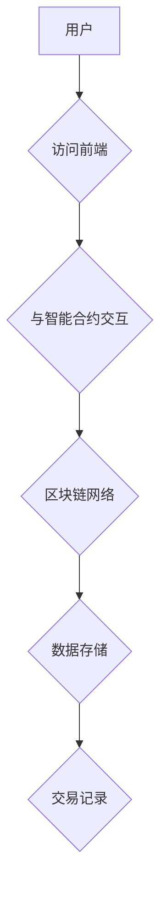

                 

# 区块链开发者的创业新趋势：去中心化应用与价值重构

## 摘要

本文将探讨区块链技术在创业领域的新趋势，重点分析去中心化应用（DApps）的发展与价值重构。通过逐步阐述区块链的核心概念、去中心化技术的应用场景，以及实际案例中的具体实现，本文旨在为区块链开发者提供创业方向和策略。同时，文章还将推荐相关学习资源和开发工具，以帮助开发者更好地把握这一新兴领域。

## 1. 背景介绍

区块链技术，作为一种分布式账本技术，自2008年比特币的诞生以来，迅速引起了全球范围内的关注。区块链通过去中心化的方式，实现了数据的可信存储和传输，为解决传统中心化系统中存在的信任问题提供了新的解决方案。随着技术的不断成熟，区块链逐渐从金融领域扩展到其他行业，如供应链管理、物联网、身份验证等。

近年来，去中心化应用（DApps）的概念逐渐兴起。DApps利用区块链技术，实现了去中心化的应用部署和运行，为用户提供了更加透明、安全、自主的服务。去中心化应用的出现，不仅改变了传统互联网的应用模式，也为创业者提供了全新的商业模式和机会。

## 2. 核心概念与联系

### 2.1 区块链技术概述

区块链是一种分布式数据库技术，通过多个节点共同维护一个账本，确保数据的不可篡改性和一致性。区块链由多个区块组成，每个区块包含一定数量的交易记录，区块之间通过加密算法连接，形成链式结构。区块链的关键特性包括：

- **去中心化**：区块链不依赖于中心化的机构或服务器，所有节点都有平等的权限。
- **不可篡改**：一旦数据被记录在区块链上，就几乎无法被篡改。
- **透明性**：区块链上的所有交易记录都是公开的，任何用户都可以查看。

### 2.2 去中心化应用（DApps）

去中心化应用（DApps）是运行在区块链上的应用，其核心特征是去中心化和开放性。DApps通常由前端、后端和智能合约三部分组成：

- **前端**：用户界面，用户与DApp交互的入口。
- **后端**：存储和处理用户数据，通常与区块链网络连接。
- **智能合约**：基于区块链的自动化协议，用于执行特定的业务逻辑。

### 2.3 Mermaid 流程图



在上面的流程图中，用户通过前端访问DApp，与智能合约交互，然后通过区块链网络进行数据存储和交易记录。

## 3. 核心算法原理 & 具体操作步骤

### 3.1 区块链共识算法

区块链的共识算法是确保多个节点达成一致的关键机制。常见的共识算法包括：

- **工作量证明（PoW）**：通过计算耗费大量工作量的难题来竞争记账权。
- **权益证明（PoS）**：根据节点持有的代币数量和抵押情况来分配记账权。
- **委托权益证明（DPoS）**：通过投票机制选择出多个超级节点，由超级节点进行记账。

### 3.2 智能合约编写

智能合约是区块链上的自动化协议，用于执行特定的业务逻辑。智能合约通常使用Solidity等编程语言编写。以下是一个简单的智能合约示例：

```solidity
pragma solidity ^0.8.0;

contract HelloWorld {
    string public message;

    constructor(string memory initMessage) {
        message = initMessage;
    }

    function updateMessage(string memory newMessage) public {
        message = newMessage;
    }
}
```

在这个示例中，我们创建了一个简单的智能合约，用于存储和更新一条消息。

### 3.3 DApp 部署与运行

部署DApp的过程包括以下步骤：

1. **编写前端**：使用HTML、CSS、JavaScript等技术，构建用户界面。
2. **编写后端**：使用Web3.js等库，实现与区块链网络的交互。
3. **编写智能合约**：在区块链网络上部署智能合约。
4. **前端与后端集成**：将前端和后端连接起来，实现完整的DApp。

## 4. 数学模型和公式 & 详细讲解 & 举例说明

### 4.1 工作量证明（PoW）

工作量证明（PoW）算法的核心是一个加密难题，需要大量的计算资源来解决。以下是PoW算法的基本原理：

1. **随机数生成**：每个节点生成一个随机数。
2. **哈希计算**：将随机数和区块链当前区块的头部信息进行哈希计算。
3. **难度调整**：根据网络设定的难度目标，调整随机数，直到哈希值满足要求。

举例说明：

假设当前区块的头部信息为`block_header`，网络设定的难度目标为`difficulty`，我们需要找到一个随机数`nonce`，使得哈希值满足以下条件：

$$
SHA-256(block_header + nonce) \leq difficulty
$$

### 4.2 权益证明（PoS）

权益证明（PoS）算法的核心是节点持有的代币数量和抵押情况。以下是PoS算法的基本原理：

1. **权益计算**：每个节点根据其持有的代币数量和抵押情况计算权益值。
2. **权益分配**：根据节点的权益值，分配记账权。
3. **惩罚机制**：如果节点作弊，将扣除其抵押的代币。

举例说明：

假设节点A持有100个代币，抵押了50个代币，节点B持有200个代币，抵押了100个代币。根据权益计算公式：

$$
权益值 = \frac{代币数量 \times 抵押率}{总抵押代币数量}
$$

节点A的权益值为：

$$
权益值_A = \frac{100 \times 0.5}{100 + 50} = 0.333
$$

节点B的权益值为：

$$
权益值_B = \frac{200 \times 0.5}{100 + 50} = 0.667
$$

因此，节点B拥有更高的记账权。

## 5. 项目实战：代码实际案例和详细解释说明

### 5.1 开发环境搭建

在进行DApp开发之前，需要搭建以下开发环境：

1. **Node.js**：用于编写前端和后端代码。
2. **Truffle**：用于部署和管理智能合约。
3. **Ganache**：用于创建本地区块链网络。

### 5.2 源代码详细实现和代码解读

以下是一个简单的DApp示例，用于实现一个投票系统：

```javascript
// contracts/Voting.sol
pragma solidity ^0.8.0;

contract Voting {
    mapping(address => bool) public voted;
    string[] public candidates;

    constructor(string[] memory initCandidates) {
        candidates = initCandidates;
    }

    function vote(uint256 candidateIndex) public {
        require(!voted[msg.sender], "Already voted");
        require(candidateIndex < candidates.length, "Invalid candidate index");
        voted[msg.sender] = true;
        // 更新投票结果
    }
}
```

在这个示例中，我们创建了一个名为`Voting`的智能合约，用于管理投票。合约中定义了一个映射`voted`，用于记录已经投票的用户。`candidates`数组用于存储候选人名称。`vote`函数用于处理投票逻辑。

### 5.3 代码解读与分析

1. **pragma**：指定编译器版本。
2. **mapping**：用于定义一个映射类型，用于存储键值对。
3. **public**：表示这个变量可以被外部访问。
4. **constructor**：合约构造函数，用于初始化候选人名称。
5. **require**：用于执行条件判断，如果条件不满足，抛出错误。
6. **voted[msg.sender]**：表示当前用户的投票状态。
7. **candidates.length**：表示候选人的总数。

## 6. 实际应用场景

去中心化应用（DApps）在多个领域都展现了巨大的潜力，以下是一些实际应用场景：

1. **金融领域**：去中心化金融（DeFi）应用，如借贷、交易、资产管理等，正在改变传统金融行业的运作方式。
2. **供应链管理**：通过区块链技术，可以实现供应链的透明化和可追溯性，提高供应链的效率。
3. **身份验证**：去中心化身份验证（ DID）技术，可以保护用户的隐私，同时确保身份的准确性。
4. **游戏行业**：去中心化游戏（DeFi）提供了全新的游戏体验，玩家可以真正拥有和管理自己的虚拟资产。
5. **物联网**：通过区块链技术，可以实现物联网设备的安全通信和智能合约的自动化执行。

## 7. 工具和资源推荐

### 7.1 学习资源推荐

- **《区块链技术指南》**：李笑来 著
- **《智能合约开发实战》**：刘志鹏 著
- **《区块链：从数字货币到企业应用》**：陈伟 著

### 7.2 开发工具框架推荐

- **Truffle**：智能合约开发框架，用于部署和管理智能合约。
- **Web3.js**：JavaScript库，用于与区块链网络交互。
- **Ganache**：本地区块链网络创建工具，用于测试智能合约。

### 7.3 相关论文著作推荐

- **《比特币：一种点对点的电子现金系统》**：中本聪 著
- **《以太坊：智能合约与去中心化应用》**：Vitalik Buterin 著

## 8. 总结：未来发展趋势与挑战

区块链技术作为去中心化技术的代表，正在不断改变我们的世界。未来，随着技术的不断成熟和应用的不断拓展，去中心化应用（DApps）有望在多个领域实现突破。然而，这一领域也面临着诸多挑战，如性能瓶颈、隐私保护、法律监管等。区块链开发者需要持续学习和探索，以应对未来的机遇和挑战。

## 9. 附录：常见问题与解答

### 9.1 区块链与比特币的关系

区块链技术是比特币的基础技术，比特币是区块链的一个应用实例。区块链技术不仅可以用于比特币，还可以应用于其他领域，如供应链管理、物联网等。

### 9.2 去中心化应用（DApps）的优势

去中心化应用（DApps）具有以下优势：

- **透明性**：所有交易记录都是公开的，用户可以随时查看。
- **安全性**：通过区块链技术，确保数据的不可篡改性。
- **自主性**：用户可以自主控制数据和资产，无需依赖中心化机构。

### 9.3 区块链技术的性能瓶颈

区块链技术的性能瓶颈主要在于共识算法。现有的共识算法，如工作量证明（PoW），需要大量的计算资源，导致网络性能较低。未来，需要研究更高效、更安全的共识算法，以提高区块链的性能。

## 10. 扩展阅读 & 参考资料

- **《区块链技术指南》**：李笑来 著
- **《智能合约开发实战》**：刘志鹏 著
- **《区块链：从数字货币到企业应用》**：陈伟 著
- **《比特币：一种点对点的电子现金系统》**：中本聪 著
- **《以太坊：智能合约与去中心化应用》**：Vitalik Buterin 著
- **Truffle 官网**：[https://www.trufflesuite.com/](https://www.trufflesuite.com/)
- **Web3.js 官网**：[https://web3js.readthedocs.io/en/v1.2.6/](https://web3js.readthedocs.io/en/v1.2.6/)
- **Ganache 官网**：[https://github.com/trufflesuite/ganache](https://github.com/trufflesuite/ganache)

### 作者

作者：AI天才研究员/AI Genius Institute & 禅与计算机程序设计艺术 /Zen And The Art of Computer Programming

