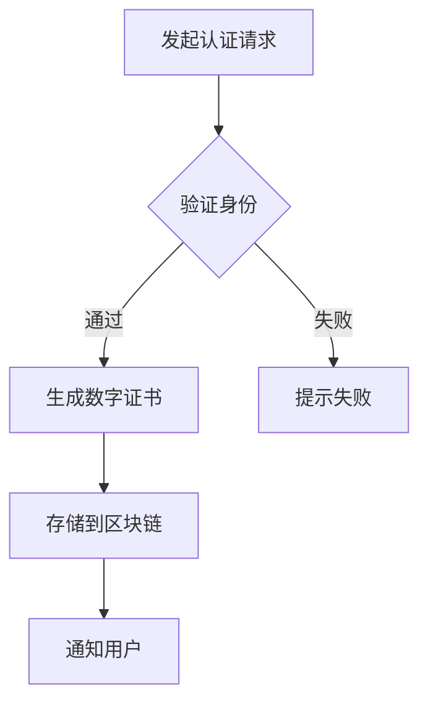

                 

# 区块链数字证书认证：教育信息的创新验证方式

> **关键词：** 区块链，数字证书，教育认证，数据验证，加密技术，智能合约

> **摘要：** 本文旨在探讨区块链技术在教育领域中的应用，特别是数字证书认证的创新验证方式。通过分析区块链的核心概念、算法原理、数学模型及实际应用案例，我们旨在为读者呈现一个全面而深入的理解，并探讨其未来发展趋势与挑战。

## 1. 背景介绍

在教育领域，验证学生的学术成就和身份真实性一直是一个长期存在的问题。传统的验证方式依赖于第三方机构，存在诸如数据篡改、信息泄露等安全隐患。随着信息技术的发展，尤其是区块链技术的崛起，数字证书认证作为一种新兴的验证方式逐渐受到关注。

区块链技术具有去中心化、不可篡改、透明度高等特点，这些特性使得它在教育认证领域具有广泛的应用前景。通过区块链，教育机构可以为学生颁发数字证书，确保证书的真实性和唯一性，从而解决了传统验证方式中的诸多问题。

本文将围绕区块链数字证书认证展开，详细探讨其核心概念、算法原理、数学模型、实际应用案例以及未来发展趋势。

## 2. 核心概念与联系

### 2.1 区块链

区块链是一种分布式数据库技术，其核心特点包括去中心化、不可篡改和透明度。在区块链中，数据被分散存储在多个节点上，每个节点都保存一份完整的账本。当一个新的区块被创建并添加到链上时，所有节点都会验证区块的有效性，确保数据的一致性和安全性。

### 2.2 数字证书

数字证书是一种用于验证用户身份和保证数据完整性的技术。它通过公钥加密和数字签名实现，具有高安全性和可信度。在教育领域，数字证书可以用来验证学生的身份、学术成就等信息。

### 2.3 智能合约

智能合约是一种自动执行、控制和文档化的合同。它在区块链平台上运行，当满足特定条件时自动执行预定的操作。在教育认证中，智能合约可以用于自动验证学生的证书信息，确保证书的发放和验证过程透明、高效。

### 2.4 Mermaid 流程图

下面是区块链数字证书认证的 Mermaid 流程图：



## 3. 核心算法原理 & 具体操作步骤

### 3.1 加密算法

数字证书的生成依赖于加密算法，包括公钥加密和数字签名。公钥加密用于确保数据在传输过程中的安全性，而数字签名用于验证数据的完整性和真实性。

### 3.2 智能合约实现

智能合约是区块链数字证书认证的核心，它负责验证用户身份、生成数字证书、存储和分发证书信息。以下是智能合约的主要步骤：

1. 用户发起认证请求。
2. 智能合约验证用户身份。
3. 如果验证通过，智能合约生成数字证书。
4. 智能合约将证书信息存储到区块链。
5. 智能合约通知用户证书已生成。

### 3.3 数据存储和查询

区块链作为分布式数据库，存储了所有数字证书的信息。用户可以通过区块链查询自己的证书信息，确保证书的真实性。

## 4. 数学模型和公式 & 详细讲解 & 举例说明

### 4.1 密码学基础

在区块链数字证书认证中，密码学是确保数据安全的核心。以下是几个关键密码学概念：

#### 公钥加密

$$
加密：c = E_{pk}(m)
$$

$$
解密：m = D_{sk}(c)
$$

其中，$m$ 是原始消息，$c$ 是加密后的消息，$pk$ 是公钥，$sk$ 是私钥。

#### 数字签名

$$
签名：s = S_{sk}(m)
$$

$$
验证：v = V_{pk}(m, s)
$$

其中，$s$ 是签名，$v$ 是验证结果。

### 4.2 智能合约逻辑

智能合约的数学模型包括以下部分：

1. **身份验证：** 使用哈希函数验证用户身份。
2. **证书生成：** 使用公钥加密和数字签名生成证书。
3. **数据存储：** 使用区块链存储证书信息。
4. **证书查询：** 使用哈希函数和区块链查询证书信息。

### 4.3 举例说明

假设有一个学生李华，想要获取其大学学位证书的数字认证。以下是具体的操作步骤：

1. **身份验证：** 李华使用其公钥加密身份信息，并发送给认证机构。
2. **证书生成：** 认证机构使用李华提供的身份信息，以及智能合约验证李华的学术成就，生成数字证书。
3. **证书存储：** 数字证书存储到区块链上，并由所有节点验证。
4. **证书查询：** 李华可以通过区块链查询其证书信息，确保证书的真实性。

## 5. 项目实战：代码实际案例和详细解释说明

### 5.1 开发环境搭建

在开始编写代码之前，我们需要搭建一个适合开发的区块链环境。以下是搭建步骤：

1. 安装Node.js。
2. 安装Truffle框架。
3. 创建一个新的Truffle项目。
4. 安装Ganache用于本地测试网络。

### 5.2 源代码详细实现和代码解读

以下是一个简单的智能合约示例，用于验证学生的身份并生成数字证书：

```solidity
// SPDX-License-Identifier: MIT
pragma solidity ^0.8.0;

contract Certificate {
    // 学生信息结构体
    struct Student {
        string id;
        string name;
        string university;
        string degree;
        bool certified;
    }

    // 学生信息映射
    mapping(string => Student) public students;

    // 添加学生信息
    function addStudent(
        string memory _id,
        string memory _name,
        string memory _university,
        string memory _degree
    ) public {
        students[_id] = Student({
            id: _id,
            name: _name,
            university: _university,
            degree: _degree,
            certified: false
        });
    }

    // 认证学生信息
    function certifyStudent(string memory _id) public {
        require(students[_id].certified == false, "Already certified");
        students[_id].certified = true;
    }

    // 查询学生证书
    function getCertificate(string memory _id) public view returns (string memory) {
        require(students[_id].certified == true, "Not certified");
        return "Degree Certificate for " + students[_id].name;
    }
}
```

### 5.3 代码解读与分析

1. **Student 结构体：** 用于存储学生的基本信息，包括学号、姓名、大学、学位和是否已认证。
2. **addStudent 函数：** 添加新的学生信息到区块链。
3. **certifyStudent 函数：** 将学生的认证状态设置为已认证。
4. **getCertificate 函数：** 返回学生的数字证书。

通过这个简单的示例，我们可以看到如何使用智能合约实现区块链数字证书认证。

## 6. 实际应用场景

区块链数字证书认证在教育领域的应用场景广泛，以下是几个典型案例：

1. **学历验证：** 学生可以通过区块链查询自己的学历证书，确保其真实性。
2. **课程证书：** 教育机构可以为学生颁发数字证书，证明其完成特定课程的学习。
3. **学术认证：** 研究人员和学者可以使用区块链验证其学术成果和荣誉。
4. **考试认证：** 考试机构可以通过区块链验证考生的考试结果，确保考试公正性。

## 7. 工具和资源推荐

### 7.1 学习资源推荐

- **书籍：** 《区块链技术指南》、《智能合约：从入门到精通》
- **论文：** 《区块链：一种分布式数据存储和点对点传输协议》、《智能合约：安全性分析》
- **博客：** 区块链技术社区、智能合约开发教程
- **网站：** Etherscan、Truffle、Ganache

### 7.2 开发工具框架推荐

- **开发工具：** Truffle、Hardhat
- **框架：** Web3.js、EVM-WASM
- **区块链平台：** Ethereum、Hyperledger Fabric

### 7.3 相关论文著作推荐

- **《区块链技术与应用》**：详细介绍了区块链的核心技术和应用场景。
- **《智能合约设计与开发》**：深入探讨了智能合约的设计原则和开发技巧。
- **《区块链安全攻防》**：分析了区块链系统的安全威胁和防护措施。

## 8. 总结：未来发展趋势与挑战

区块链数字证书认证具有巨大的潜力，但其发展也面临着诸多挑战。未来，随着技术的不断进步，区块链数字证书认证有望在教育、金融、医疗等领域得到更广泛的应用。

然而，要实现这一目标，还需要解决以下挑战：

1. **性能和可扩展性：** 区块链系统需要提高性能，以支持大规模的数据处理。
2. **安全性：** 需要加强对区块链系统的攻击防范，确保数据的安全。
3. **隐私保护：** 在确保数据真实性的同时，要保护用户的隐私。
4. **法律法规：** 需要完善相关的法律法规，规范区块链数字证书认证的应用。

## 9. 附录：常见问题与解答

### 9.1 区块链与数字证书的关系是什么？

区块链与数字证书结合，可以提供一种去中心化的、不可篡改的验证方式。区块链确保了数字证书的存储和分发过程的安全和透明，而数字证书则用于验证用户身份和数据的真实性。

### 9.2 区块链数字证书认证有哪些优势？

区块链数字证书认证具有以下优势：

1. **去中心化：** 不依赖于第三方机构，提高了数据的安全性和可信度。
2. **不可篡改：** 一旦数据上链，就无法篡改，确保了数据的真实性。
3. **透明度：** 所有数据都公开透明，便于审计和查询。
4. **高效便捷：** 可以快速验证用户身份和证书信息，提高了办事效率。

## 10. 扩展阅读 & 参考资料

- **《区块链技术指南》**：详细介绍了区块链的基础知识和技术细节。
- **《智能合约：从入门到精通》**：讲解了智能合约的设计、开发和应用。
- **《区块链安全攻防》**：分析了区块链系统的安全威胁和防护措施。
- **Ethereum 官方文档**：提供了关于Ethereum区块链和智能合约的详细指南。

## 作者信息

**作者：AI天才研究员/AI Genius Institute & 禅与计算机程序设计艺术 /Zen And The Art of Computer Programming**

