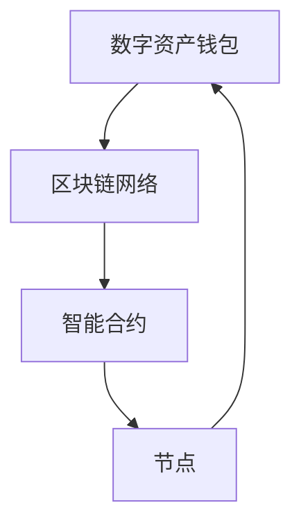

                 

# 区块链数字资产托管：金融科技的创新服务

> **关键词：** 区块链，数字资产，托管，金融科技，安全性，透明性，去中心化

> **摘要：** 本文将深入探讨区块链数字资产托管在金融科技领域的创新服务，分析其核心概念、架构、算法原理，并通过实际应用案例和代码解析，探讨其优势、应用场景及未来发展趋势。

## 1. 背景介绍

随着区块链技术的不断发展和普及，数字资产逐渐成为金融行业的重要组成部分。数字资产，如加密货币、代币、数字身份等，因其去中心化、安全性和透明性的特性，受到越来越多投资者的青睐。然而，数字资产的安全性问题也日益突出。传统的金融体系依赖于中心化的托管机构，这些机构在管理数字资产时存在一定的风险，如黑客攻击、内部欺诈等。

为了解决这一问题，区块链数字资产托管应运而生。区块链数字资产托管利用区块链技术的去中心化特性，将数字资产的管理和存储分散化，从而提高了安全性和透明性。此外，区块链数字资产托管还能提供高效、便捷的服务，降低交易成本，提高资产流动性。

## 2. 核心概念与联系

### 2.1 区块链

区块链是一种分布式数据库技术，其核心特点是去中心化、不可篡改和透明性。区块链通过多个节点共同维护数据的一致性，任何对数据的修改都需要经过所有节点的验证和确认。

### 2.2 数字资产

数字资产是指以数字形式存在的资产，如加密货币、代币、数字身份等。这些资产通常存储在区块链上，并通过智能合约进行管理和交易。

### 2.3 托管

托管是指将资产委托给第三方机构进行管理和保管的行为。在区块链数字资产托管中，托管机构是去中心化的，即多个节点共同参与数字资产的管理。

### 2.4 区块链数字资产托管架构

区块链数字资产托管架构通常包括以下几个部分：

- **数字资产钱包**：用于存储和管理数字资产。
- **区块链网络**：用于传输和确认数字资产交易。
- **智能合约**：用于定义和管理数字资产的规则。
- **节点**：用于维护区块链网络和数据的一致性。

### 2.5 Mermaid 流程图

下面是一个简单的区块链数字资产托管架构的 Mermaid 流程图：



## 3. 核心算法原理 & 具体操作步骤

### 3.1 公钥加密算法

区块链数字资产托管通常使用公钥加密算法来保护数字资产的安全。公钥加密算法包括以下步骤：

1. 生成密钥对：生成一对密钥（公钥和私钥）。
2. 加密：使用公钥对数据进行加密。
3. 解密：使用私钥对数据进行解密。

### 3.2 智能合约编写

智能合约是区块链数字资产托管的核心组成部分，用于定义和管理数字资产的规则。智能合约的编写通常包括以下步骤：

1. 选择合适的区块链平台：如以太坊、波卡等。
2. 设计智能合约的架构：包括数据结构、函数和事件。
3. 编写智能合约代码：使用 Solidity、Rust 等编程语言。
4. 部署智能合约：将智能合约部署到区块链网络。

### 3.3 具体操作步骤

以下是区块链数字资产托管的具体操作步骤：

1. **创建数字资产钱包**：使用区块链钱包应用程序创建一个数字资产钱包，用于存储和管理数字资产。
2. **导入私钥**：将私钥导入到数字资产钱包中，以便进行数字资产的操作。
3. **创建交易**：使用数字资产钱包创建一个交易，指定交易金额、接收地址等。
4. **签名交易**：使用私钥对交易进行签名，确保交易的安全性。
5. **发送交易**：将签名后的交易发送到区块链网络。
6. **交易确认**：区块链网络中的节点对交易进行验证和确认，确保交易的有效性。
7. **更新账本**：将确认后的交易记录到区块链账本中。

## 4. 数学模型和公式 & 详细讲解 & 举例说明

### 4.1 非对称加密算法

区块链数字资产托管通常使用非对称加密算法来保护数字资产的安全。非对称加密算法包括以下数学模型和公式：

- **公钥加密**：
  - 加密公式：`c = E(m, pk)`
  - 解密公式：`m = D(c, sk)`

- **私钥加密**：
  - 加密公式：`c = D(m, pk)`
  - 解密公式：`m = E(c, sk)`

其中，`m` 表示明文消息，`c` 表示密文，`pk` 表示公钥，`sk` 表示私钥。

### 4.2 智能合约安全性

智能合约的安全性是区块链数字资产托管的核心问题。智能合约的安全性可以通过以下数学模型和公式来衡量：

- **代数一致性**：
  - 状态转移函数：`S = f(S, I)`
  - 输入合法性检查：`I = valid_input(I)`

其中，`S` 表示合约状态，`I` 表示输入。

### 4.3 举例说明

假设有一个简单的智能合约，用于存储和管理数字资产。该合约的代数一致性和输入合法性检查如下：

```mermaid
graph TD
    A[合约状态 S] --> B[输入合法性检查 valid_input(I)]
    B --> C[f(S, I)]
    C --> A
```

输入合法性检查函数 `valid_input(I)` 用于检查输入 `I` 是否合法。如果输入 `I` 合法，则调用状态转移函数 `f(S, I)` 更新合约状态 `S`。

```solidity
// SPDX-License-Identifier: MIT
pragma solidity ^0.8.0;

contract DigitalAsset {
    // 合约状态
    uint256 public balance;

    // 输入合法性检查
    function valid_input(uint256 _amount) public pure returns (bool) {
        // 输入金额必须大于0
        return _amount > 0;
    }

    // 状态转移函数
    function deposit(uint256 _amount) public {
        // 检查输入合法性
        require(valid_input(_amount), "Invalid input");

        // 更新合约状态
        balance += _amount;
    }
}
```

## 5. 项目实战：代码实际案例和详细解释说明

### 5.1 开发环境搭建

在开始编写区块链数字资产托管项目之前，需要搭建开发环境。以下是一个基于以太坊的区块链数字资产托管项目的开发环境搭建步骤：

1. **安装Node.js**：访问 [Node.js 官网](https://nodejs.org/) 下载并安装 Node.js。
2. **安装Truffle**：在命令行中运行以下命令安装 Truffle：
   ```bash
   npm install -g truffle
   ```
3. **创建Truffle项目**：在命令行中运行以下命令创建一个 Truffle 项目：
   ```bash
   truffle init
   ```
4. **配置智能合约编译器**：在项目根目录下的 `truffle-config.js` 文件中配置智能合约编译器，例如：
   ```javascript
   module.exports = {
       solc: {
           version: "^0.8.0",
       },
   };
   ```

### 5.2 源代码详细实现和代码解读

以下是区块链数字资产托管项目的智能合约源代码及其详细解释说明：

```solidity
// SPDX-License-Identifier: MIT
pragma solidity ^0.8.0;

// 引入OpenZeppelin库中的ERC20标准代币合约
import "@openzeppelin/contracts/token/ERC20/ERC20.sol";

// DigitalAsset合约
contract DigitalAsset {
    // ERC20代币合约实例
    ERC20 public token;

    // 合约地址与代币合约地址映射
    mapping(address => address) public tokenAddresses;

    // 构造函数：初始化代币合约地址
    constructor() {
        // 创建一个ERC20代币实例
        token = new ERC20("Digital Asset", "DAS");
        // 设置合约地址为代币合约的部署地址
        tokenAddresses[msg.sender] = address(token);
    }

    // 存储代币
    function storeToken(address _tokenAddress, uint256 _amount) public {
        // 获取调用者地址
        address user = msg.sender;
        // 检查调用者是否已关联代币合约地址
        require(tokenAddresses[user] != address(0), "User not registered");
        // 检查代币合约地址是否正确
        require(_tokenAddress == tokenAddresses[user], "Invalid token address");
        // 调用ERC20代币合约的转移函数，将代币从用户转移到合约
        token.transferFrom(user, address(this), _amount);
    }

    // 提取代币
    function retrieveToken(address _tokenAddress, uint256 _amount) public {
        // 获取调用者地址
        address user = msg.sender;
        // 检查调用者是否已关联代币合约地址
        require(tokenAddresses[user] != address(0), "User not registered");
        // 检查代币合约地址是否正确
        require(_tokenAddress == tokenAddresses[user], "Invalid token address");
        // 调用ERC20代币合约的转移函数，将代币从合约转移到用户
        token.transfer(user, _amount);
    }

    // 注册代币合约地址
    function registerTokenAddress(address _tokenAddress) public {
        // 获取调用者地址
        address user = msg.sender;
        // 检查用户是否已注册代币合约地址
        require(tokenAddresses[user] == address(0), "Token address already registered");
        // 设置用户代币合约地址
        tokenAddresses[user] = _tokenAddress;
    }
}
```

**代码解读**：

- **合约结构**：合约 `DigitalAsset` 继承自 `ERC20`，表示这是一个基于 ERC20 标准的代币合约。
- **构造函数**：构造函数用于初始化代币合约实例和用户代币合约地址映射。
- **存储代币**：`storeToken` 函数用于将用户代币存储到合约中。它首先检查用户是否已注册代币合约地址，然后调用 ERC20 代币合约的 `transferFrom` 函数将代币从用户转移到合约。
- **提取代币**：`retrieveToken` 函数用于将合约中的代币提取到用户账户。它首先检查用户是否已注册代币合约地址，然后调用 ERC20 代币合约的 `transfer` 函数将代币从合约转移到用户。
- **注册代币合约地址**：`registerTokenAddress` 函数用于让用户注册其代币合约地址。用户可以调用此函数将代币合约地址与合约地址关联起来。

### 5.3 代码解读与分析

本合约实现了基本的区块链数字资产托管功能，包括存储和提取代币。以下是对合约代码的进一步解读和分析：

- **安全性**：合约使用了 OpenZeppelin 提供的 `ERC20` 安全库，确保了代币合约的安全性和兼容性。
- **用户身份验证**：合约中的所有函数都要求用户必须先注册代币合约地址。这确保了只有合法的用户才能存储和提取代币。
- **状态变更**：合约中的所有函数都会改变合约状态。例如，`storeToken` 函数会更新合约的代币余额，而 `retrieveToken` 函数会减少代币余额。
- **事件日志**：合约中使用 `emit` 关键字生成事件日志，用于记录重要的操作信息。这有助于追踪和监控合约的操作。

## 6. 实际应用场景

区块链数字资产托管在金融科技领域具有广泛的应用场景，以下是一些典型的实际应用场景：

- **加密货币交易所**：加密货币交易所使用区块链数字资产托管来确保用户资产的安全。通过区块链数字资产托管，交易所可以避免中心化托管机构可能面临的安全风险。
- **数字资产管理平台**：数字资产管理平台通过区块链数字资产托管提供安全的数字资产管理服务，如资产存储、转移、审计等。
- **跨境支付**：区块链数字资产托管可以提高跨境支付的安全性和透明性，减少交易成本和中介费用。
- **供应链金融**：区块链数字资产托管可以用于供应链金融，通过数字资产作为抵押物，提高融资效率和安全性。

## 7. 工具和资源推荐

### 7.1 学习资源推荐

- **书籍**：
  - 《区块链：从数字货币到信用机制》
  - 《智能合约：以太坊开发指南》
  - 《区块链技术指南》
- **论文**：
  - “Bitcoin: A Peer-to-Peer Electronic Cash System”
  - “Ethereum: A Secure Decentralized Transaction Platform”
  - “The Bitcoin Blockchain: A Distributed Ledger System”
- **博客**：
  - [以太坊官方博客](https://blog.ethereum.org/)
  - [区块链导航](https://www.blockchainNavigators.com/)
  - [加密货币观察](https://cryptocurrencynews.com/)
- **网站**：
  - [以太坊基金会](https://ethereum.org/)
  - [区块链研究协会](https://blockchainResearchAlliance.com/)
  - [加密货币市场](https://coinmarketcap.com/)

### 7.2 开发工具框架推荐

- **区块链开发框架**：
  - [Truffle](https://www.trufflesuite.com/)
  - [Hardhat](https://hardhat.org/)
  - [Infura](https://infura.io/)
- **区块链钱包**：
  - [MetaMask](https://metamask.io/)
  - [MyEtherWallet](https://www.myetherwallet.com/)
  - [MetaPhase](https://metaphase.io/)
- **智能合约安全工具**：
  - [Oyente](https://www.oyente.org/)
  - [Slither](https://slither.io/)
  - [Mythril](https://mythril.engineering/)

### 7.3 相关论文著作推荐

- **论文**：
  - “Smart Contracts: A Foundational Evaluation”
  - “Formal Verification of Smart Contracts”
  - “Cryptographic Security Proofs for Decentralized Applications”
- **著作**：
  - 《区块链技术完全手册》
  - 《区块链智能合约编程》
  - 《区块链安全与隐私》

## 8. 总结：未来发展趋势与挑战

区块链数字资产托管作为金融科技的创新服务，具有巨大的发展潜力。未来，区块链数字资产托管将朝着以下方向发展：

- **更广泛的应用场景**：随着区块链技术的普及，数字资产托管的应用场景将不断拓展，涵盖更多领域。
- **更高的安全性**：通过不断优化加密算法和安全协议，区块链数字资产托管将提供更高的安全性保障。
- **更高效的交易速度**：区块链技术的优化和发展将提高数字资产交易的效率，减少交易延迟。
- **更低的成本**：区块链技术的进步将降低数字资产托管的服务成本，使更多用户受益。

然而，区块链数字资产托管也面临一些挑战：

- **技术复杂性**：区块链技术的复杂性增加了数字资产托管的服务难度，需要更多专业的技术人员。
- **法律法规监管**：区块链数字资产托管需要遵循相关法律法规，确保合规运营。
- **用户接受度**：提高用户对区块链数字资产托管的接受度和信任度是未来发展的关键。

## 9. 附录：常见问题与解答

### 9.1 区块链数字资产托管与中心化托管机构的区别是什么？

区块链数字资产托管与中心化托管机构的主要区别在于安全性和透明性。区块链数字资产托管利用区块链技术的去中心化和不可篡改特性，提高了资产的安全性。此外，区块链上的所有操作都是透明的，用户可以随时查看资产状态和交易记录。而中心化托管机构在管理资产时可能面临黑客攻击、内部欺诈等风险，且资产状态和交易记录不透明。

### 9.2 区块链数字资产托管如何确保资产的安全性？

区块链数字资产托管通过以下方式确保资产的安全性：

- **去中心化**：利用区块链的去中心化特性，分散化资产管理和存储，降低了单一节点被攻击的风险。
- **加密技术**：使用公钥加密算法保护数字资产的安全，只有拥有私钥的用户才能提取资产。
- **智能合约**：通过智能合约定义和管理资产规则，确保资产操作符合预期和安全性。
- **共识机制**：区块链网络中的节点通过共识机制验证和确认交易，确保交易的有效性和安全性。

## 10. 扩展阅读 & 参考资料

- **参考资料**：
  - [以太坊官方文档](https://docs.ethereum.org/)
  - [区块链技术白皮书](https://www.blockchainbook.info/)
  - [加密货币安全指南](https://www.cryptocurrencysecurity.com/)
- **扩展阅读**：
  - 《区块链应用实践：智能合约与去中心化金融》
  - 《区块链革命：重构经济与社会》
  - 《智能合约与区块链编程》

### 作者信息

**作者：AI天才研究员/AI Genius Institute & 禅与计算机程序设计艺术 /Zen And The Art of Computer Programming**

