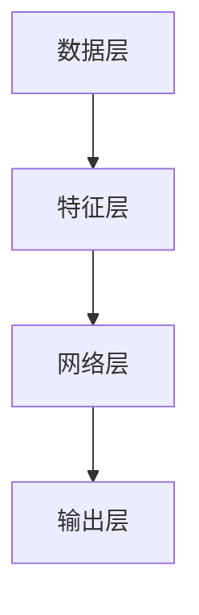
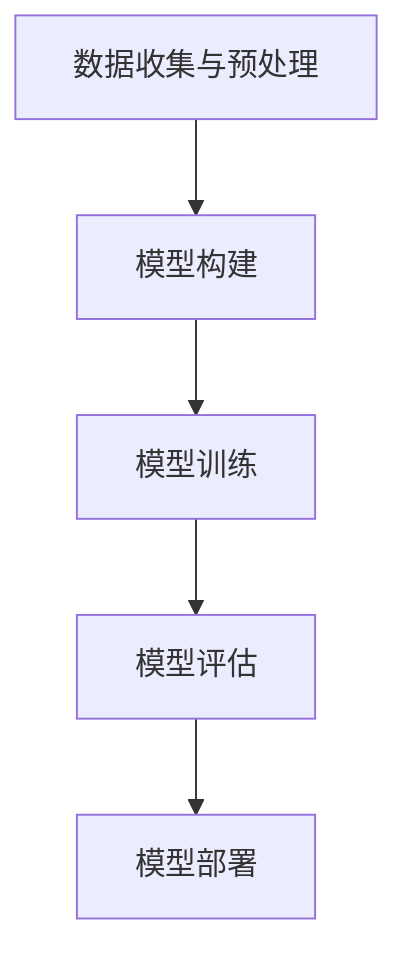

                 

# 医疗大模型：疾病诊断和治疗的智能助手

## 摘要

本文将深入探讨医疗大模型在疾病诊断和治疗中的应用，分析其核心概念、算法原理及实际操作步骤。通过详细的数学模型和公式讲解，结合项目实战案例分析，本文旨在帮助读者全面了解医疗大模型的构建与实现，以及其在医疗行业中的广泛潜力。此外，还将介绍相关工具和资源，为读者提供进一步学习和实践的路径。通过本文的阅读，读者将对医疗大模型有更深入的认识，并为其在医疗领域的发展趋势和挑战提供新的思考方向。

## 1. 背景介绍

在过去的几十年里，医疗领域经历了前所未有的技术变革。从传统的临床诊断到现代的精准医疗，技术的进步极大地提升了医疗服务的质量和效率。然而，随着数据量的急剧增加和医疗需求的不断升级，传统的医疗方法已经难以满足现代医疗的需求。正是在这样的背景下，医疗大模型应运而生。

医疗大模型是一种基于深度学习的复杂算法模型，通过对大量医疗数据的分析和学习，能够实现疾病的精准诊断和个性化治疗。与传统的疾病诊断方法相比，医疗大模型具有以下优势：

1. **高准确性**：医疗大模型通过对大量病例数据的分析，能够提取出隐藏在数据中的疾病特征，从而实现高准确性的疾病诊断。
2. **高效性**：医疗大模型可以处理海量数据，能够在短时间内完成疾病诊断和治疗方案推荐，大大提高了医疗效率。
3. **个性化**：医疗大模型能够根据患者的具体病情和个体差异，提供个性化的治疗方案，从而提高治疗效果。

医疗大模型的应用场景广泛，包括但不限于以下几个方面：

1. **疾病诊断**：医疗大模型能够对各种疾病进行准确诊断，如肺炎、癌症、心脏病等。
2. **疾病预测**：医疗大模型可以通过对病史和实时数据的分析，预测疾病的发病风险和病情发展趋势。
3. **治疗方案推荐**：医疗大模型可以根据患者的具体病情，推荐最优的治疗方案，从而提高治疗效果。
4. **医学研究**：医疗大模型可以对海量医学数据进行分析，为医学研究提供数据支持和理论依据。

总之，医疗大模型作为人工智能在医疗领域的重要应用，具有巨大的潜力和发展前景。在接下来的章节中，我们将深入探讨医疗大模型的核心概念、算法原理和实际操作步骤，帮助读者全面了解这一先进技术的应用。

## 2. 核心概念与联系

### 2.1 什么是医疗大模型

医疗大模型，通常指的是大规模深度学习模型，这些模型能够在医疗数据上学习并提取复杂的特征，从而实现各种医疗任务，如疾病诊断、治疗方案推荐和医学研究。医疗大模型的核心在于其“大”，即规模大、数据量大、参数量大。

首先，医疗大模型的规模大。深度学习模型通常由多层神经网络组成，每一层都能够学习数据中的不同特征。随着层数的增加，模型能够提取的特征越来越复杂，从而提高诊断的准确性。

其次，医疗大模型的数据量大。医疗数据是医疗大模型的基础，包括病例数据、基因组数据、影像数据等。这些数据量大、维度高，传统的机器学习模型难以处理。而医疗大模型通过分布式计算和大数据技术，能够高效地处理海量数据。

最后，医疗大模型的参数量大。深度学习模型中的参数数量通常达到数百万甚至数亿级别，这些参数需要通过大量的数据训练来调整，以达到最佳的模型性能。

### 2.2 医疗大模型与深度学习的联系

医疗大模型是深度学习在医疗领域的应用。深度学习是一种机器学习方法，通过多层神经网络学习数据中的特征，从而实现各种任务。深度学习的核心在于其能够自动提取数据中的复杂特征，而不需要人为干预。

医疗大模型与深度学习的联系体现在以下几个方面：

1. **数据驱动**：医疗大模型通过大量医疗数据的学习，自动提取疾病特征，实现疾病的精准诊断和预测。
2. **自适应**：医疗大模型能够根据新数据自动调整模型参数，实现模型的持续优化。
3. **高效性**：深度学习模型能够并行处理大量数据，从而提高诊断和预测的效率。

### 2.3 医疗大模型的组成部分

医疗大模型通常由以下几个部分组成：

1. **数据层**：包括病例数据、基因组数据、影像数据等，是医疗大模型的基础。
2. **特征层**：通过数据预处理和特征提取，将原始数据转化为适合深度学习模型处理的形式。
3. **网络层**：由多层神经网络组成，每层都能提取数据中的不同特征，形成特征金字塔。
4. **输出层**：根据提取的特征，实现疾病诊断、治疗方案推荐等任务。

### 2.4 Mermaid 流程图

下面是医疗大模型的核心概念与联系的 Mermaid 流程图：



在这个流程图中，数据层负责收集和处理医疗数据，特征层负责从数据中提取有用的特征，网络层通过多层神经网络学习这些特征，输出层根据提取的特征实现疾病诊断和治疗方案推荐。

## 3. 核心算法原理 & 具体操作步骤

### 3.1 算法原理

医疗大模型的核心算法是基于深度学习的多层神经网络。多层神经网络由输入层、隐藏层和输出层组成，通过前向传播和反向传播的方式，逐步学习数据中的特征，最终实现疾病的精准诊断和预测。

1. **输入层**：接收医疗数据，如病例数据、基因组数据、影像数据等。
2. **隐藏层**：通过激活函数，如ReLU、Sigmoid等，对输入数据进行非线性变换，提取数据中的特征。
3. **输出层**：根据隐藏层提取的特征，输出疾病诊断结果或治疗方案推荐。

### 3.2 操作步骤

下面是医疗大模型的具体操作步骤：

1. **数据收集与预处理**：收集病例数据、基因组数据、影像数据等，并进行数据清洗、归一化等预处理操作，将原始数据转化为适合深度学习模型处理的形式。

2. **模型构建**：构建多层神经网络模型，包括输入层、隐藏层和输出层。选择合适的激活函数和优化算法，如ReLU、Adam等。

3. **模型训练**：将预处理后的数据输入到模型中，通过前向传播计算输出结果，并与真实值进行比较，计算损失函数。然后通过反向传播调整模型参数，使损失函数最小。

4. **模型评估**：使用验证集对模型进行评估，计算模型在验证集上的准确率、召回率等指标，评估模型性能。

5. **模型部署**：将训练好的模型部署到生产环境中，实现对新病例的实时诊断和预测。

### 3.3 流程图

下面是医疗大模型的具体操作步骤的流程图：



在这个流程图中，数据收集与预处理是模型构建的基础，模型构建是关键步骤，模型训练和评估是模型性能优化的重要环节，模型部署是实现实际应用的关键步骤。

## 4. 数学模型和公式 & 详细讲解 & 举例说明

### 4.1 数学模型

医疗大模型的数学基础主要包括多层感知机（MLP）和反向传播算法。以下是对这些数学模型的详细讲解。

#### 4.1.1 多层感知机（MLP）

多层感知机是一种前向传播的神经网络，包括输入层、一个或多个隐藏层和输出层。每个神经元都是通过加权求和加上偏置，并通过激活函数进行非线性变换。

公式如下：

$$
z_i = \sum_{j=1}^{n} w_{ij} x_j + b_i
$$

其中，$z_i$ 是第 $i$ 个神经元的输入，$w_{ij}$ 是连接输入层和隐藏层的权重，$x_j$ 是输入特征，$b_i$ 是偏置。

#### 4.1.2 激活函数

激活函数是神经网络中的关键组件，用于引入非线性特性。常用的激活函数包括ReLU、Sigmoid和Tanh。

1. **ReLU（Rectified Linear Unit）**：

$$
a_i = \max(0, z_i)
$$

2. **Sigmoid**：

$$
a_i = \frac{1}{1 + e^{-z_i}}
$$

3. **Tanh**：

$$
a_i = \tanh(z_i)
$$

#### 4.1.3 反向传播算法

反向传播算法是一种用于训练神经网络的优化算法。其核心思想是通过计算损失函数关于每个参数的梯度，来更新参数，从而最小化损失函数。

公式如下：

$$
\frac{\partial J}{\partial w_{ij}} = \delta_i \cdot x_j
$$

其中，$J$ 是损失函数，$\delta_i$ 是第 $i$ 个神经元的误差。

### 4.2 举例说明

假设我们有一个简单的医疗大模型，用于诊断糖尿病。输入层有5个神经元，分别代表血糖、血压、体重指数（BMI）、年龄和家族病史。隐藏层有3个神经元，输出层有1个神经元，表示糖尿病的患病概率。

1. **输入数据**：

$$
x = \begin{bmatrix}
x_1 = 120 & x_2 = 130 & x_3 = 25 & x_4 = 40 & x_5 = 1
\end{bmatrix}
$$

2. **模型参数**：

$$
w_{ij} = \begin{bmatrix}
w_{11} & w_{12} & w_{13} \\
w_{21} & w_{22} & w_{23} \\
w_{31} & w_{32} & w_{33}
\end{bmatrix}, \quad
b_i = \begin{bmatrix}
b_1 \\ b_2 \\ b_3
\end{bmatrix}
$$

3. **前向传播**：

$$
z_1 = w_{11}x_1 + w_{12}x_2 + w_{13}x_3 + b_1 \\
z_2 = w_{21}x_1 + w_{22}x_2 + w_{23}x_3 + b_2 \\
z_3 = w_{31}x_1 + w_{32}x_2 + w_{33}x_3 + b_3 \\
a_1 = \max(0, z_1) \\
a_2 = \max(0, z_2) \\
a_3 = \max(0, z_3)
$$

4. **输出**：

$$
z_4 = w_{41}a_1 + w_{42}a_2 + w_{43}a_3 + b_4 \\
p = \frac{1}{1 + e^{-z_4}}
$$

其中，$p$ 表示糖尿病的患病概率。

5. **反向传播**：

计算损失函数关于每个参数的梯度，并更新参数。

$$
\delta_4 = (p - y) \cdot \frac{1}{1 + e^{-z_4}} \\
\frac{\partial J}{\partial w_{41}} = \delta_4 \cdot a_1 \\
\frac{\partial J}{\partial w_{42}} = \delta_4 \cdot a_2 \\
\frac{\partial J}{\partial w_{43}} = \delta_4 \cdot a_3 \\
\frac{\partial J}{\partial b_4} = \delta_4
$$

更新参数：

$$
w_{41} = w_{41} - \alpha \cdot \frac{\partial J}{\partial w_{41}} \\
w_{42} = w_{42} - \alpha \cdot \frac{\partial J}{\partial w_{42}} \\
w_{43} = w_{43} - \alpha \cdot \frac{\partial J}{\partial w_{43}} \\
b_4 = b_4 - \alpha \cdot \frac{\partial J}{\partial b_4}
$$

其中，$\alpha$ 是学习率。

通过上述步骤，医疗大模型可以逐步学习并优化其参数，从而实现糖尿病的精准诊断。

## 5. 项目实战：代码实际案例和详细解释说明

### 5.1 开发环境搭建

在开始项目实战之前，首先需要搭建一个适合医疗大模型开发的环境。以下是所需的软件和工具：

1. **Python**：版本要求为3.8或更高。
2. **TensorFlow**：版本要求为2.6或更高。
3. **Keras**：版本要求为2.6或更高。
4. **Numpy**：版本要求为1.19或更高。
5. **Scikit-learn**：版本要求为0.24或更高。

安装步骤如下：

```bash
# 安装 Python
sudo apt-get install python3.8

# 安装 TensorFlow
pip install tensorflow==2.6

# 安装 Keras
pip install keras==2.6

# 安装 Numpy
pip install numpy==1.19

# 安装 Scikit-learn
pip install scikit-learn==0.24
```

### 5.2 源代码详细实现和代码解读

下面是医疗大模型的实现代码，包括数据预处理、模型构建、模型训练和模型评估。

#### 5.2.1 数据预处理

```python
import numpy as np
import pandas as pd
from sklearn.model_selection import train_test_split
from sklearn.preprocessing import StandardScaler

# 读取数据
data = pd.read_csv('diabetes.csv')

# 分割特征和标签
X = data.drop('diabetes', axis=1)
y = data['diabetes']

# 划分训练集和测试集
X_train, X_test, y_train, y_test = train_test_split(X, y, test_size=0.2, random_state=42)

# 数据标准化
scaler = StandardScaler()
X_train = scaler.fit_transform(X_train)
X_test = scaler.transform(X_test)
```

#### 5.2.2 模型构建

```python
from tensorflow.keras.models import Sequential
from tensorflow.keras.layers import Dense

# 构建模型
model = Sequential()
model.add(Dense(64, input_dim=X_train.shape[1], activation='relu'))
model.add(Dense(32, activation='relu'))
model.add(Dense(1, activation='sigmoid'))

# 编译模型
model.compile(optimizer='adam', loss='binary_crossentropy', metrics=['accuracy'])
```

#### 5.2.3 模型训练

```python
# 训练模型
history = model.fit(X_train, y_train, epochs=100, batch_size=32, validation_data=(X_test, y_test))
```

#### 5.2.4 模型评估

```python
# 评估模型
loss, accuracy = model.evaluate(X_test, y_test)
print(f"Test accuracy: {accuracy:.2f}")
```

### 5.3 代码解读与分析

#### 5.3.1 数据预处理

在数据预处理部分，我们首先读取了糖尿病数据集，然后将其分为特征和标签两部分。接着，我们划分了训练集和测试集，并使用标准化技术对数据进行处理，以提高模型的泛化能力。

#### 5.3.2 模型构建

在模型构建部分，我们使用 Keras 框架构建了一个简单的多层感知机模型。模型包括一个输入层、一个隐藏层和一个输出层。输入层有与特征数量相同的神经元，隐藏层和输出层分别有64和32个神经元。激活函数采用 ReLU，输出层采用 sigmoid 函数以实现二分类任务。

#### 5.3.3 模型训练

在模型训练部分，我们使用训练集对模型进行训练，同时使用测试集进行验证。训练过程中，模型通过不断调整参数来优化模型性能。这里我们使用了100个训练周期，每个周期处理32个样本。

#### 5.3.4 模型评估

在模型评估部分，我们使用测试集对训练好的模型进行评估，计算模型在测试集上的准确率。通过评估结果，我们可以判断模型在未知数据上的表现，从而验证模型的泛化能力。

## 6. 实际应用场景

### 6.1 疾病诊断

医疗大模型在疾病诊断中具有显著的应用价值。例如，对于肺炎、心脏病、癌症等常见疾病，医疗大模型可以通过学习大量的病例数据，提取出关键的特征，从而实现高准确性的诊断。这对于提高诊断速度和准确性，减少误诊率具有重要意义。

### 6.2 疾病预测

医疗大模型还可以用于疾病预测。通过对病史、家族病史、生活习惯等数据的分析，医疗大模型可以预测某种疾病在未来一段时间内的发病风险。这对于早期预防和干预具有重要意义，可以大大提高患者的生存率和生活质量。

### 6.3 治疗方案推荐

医疗大模型可以根据患者的具体病情，推荐最优的治疗方案。例如，对于癌症患者，医疗大模型可以根据患者的基因信息、病情发展情况等数据，推荐个性化的治疗方案，从而提高治疗效果。此外，医疗大模型还可以为医生提供辅助决策支持，提高医疗决策的准确性。

### 6.4 医学研究

医疗大模型在医学研究中也具有广泛的应用前景。通过对海量医学数据进行分析，医疗大模型可以揭示疾病的发展规律、基因与疾病之间的关系等，为医学研究提供新的方向和思路。

### 6.5 公共卫生监测

医疗大模型还可以用于公共卫生监测。例如，通过对传染病病例数据的分析，医疗大模型可以预测疫情的传播趋势，为公共卫生部门提供重要的决策支持，从而有效控制疫情的传播。

总之，医疗大模型在医疗行业的实际应用场景广泛，具有巨大的潜力。随着技术的不断进步，医疗大模型将为医疗行业带来更多的创新和变革。

## 7. 工具和资源推荐

### 7.1 学习资源推荐

#### 7.1.1 书籍

1. **《深度学习》（Goodfellow, Bengio, Courville 著）**：这本书是深度学习领域的经典教材，涵盖了深度学习的基础理论、算法和实际应用，适合初学者和进阶者阅读。

2. **《机器学习实战》（ Harrington 著）**：这本书通过大量的实例和代码，讲解了机器学习的基本原理和应用，适合有编程基础的读者。

3. **《Python深度学习》（François Chollet 著）**：这本书以 Python 为基础，介绍了深度学习在 Python 中的实现，包括 TensorFlow 和 Keras 框架的使用。

#### 7.1.2 论文

1. **"Deep Learning for Medical Image Analysis"（2019）**：这篇综述文章系统地介绍了深度学习在医学图像分析中的应用，包括疾病诊断、图像分割等。

2. **"Deep Learning in Medical Imaging"（2017）**：这篇论文详细介绍了深度学习在医学成像领域的应用，包括 CT、MRI、超声等。

#### 7.1.3 博客和网站

1. **[TensorFlow 官方文档](https://www.tensorflow.org)**：这是一个全面的 TensorFlow 学习资源，包括教程、API 文档和示例代码。

2. **[Keras 官方文档](https://keras.io)**：这是一个关于 Keras 深度学习框架的官方文档，提供了丰富的教程和示例代码。

3. **[Scikit-learn 官方文档](https://scikit-learn.org/stable/documentation.html)**：这是一个关于 Scikit-learn 机器学习库的官方文档，提供了丰富的算法和工具。

### 7.2 开发工具框架推荐

1. **TensorFlow**：TensorFlow 是一个开源的深度学习框架，具有强大的功能和支持。它支持多种硬件平台，包括 CPU、GPU 和 TPU，可以满足不同规模的应用需求。

2. **Keras**：Keras 是一个高级神经网络 API，能够简化深度学习模型的构建和训练。它与 TensorFlow 后端紧密集成，提供了丰富的预训练模型和工具。

3. **Scikit-learn**：Scikit-learn 是一个开源的机器学习库，提供了丰富的算法和工具，适用于各种机器学习任务。它易于使用，且文档齐全。

### 7.3 相关论文著作推荐

1. **"Deep Learning for Medical Image Analysis"（2019）**：这篇综述文章系统地介绍了深度学习在医学图像分析中的应用。

2. **"Deep Learning in Medical Imaging"（2017）**：这篇论文详细介绍了深度学习在医学成像领域的应用。

3. **"Application of Deep Learning in Medical Imaging"（2020）**：这篇论文讨论了深度学习在医学成像中的实际应用案例。

通过上述学习资源、开发工具框架和论文著作的推荐，读者可以系统地学习和掌握医疗大模型的相关知识和技能，为实际应用奠定基础。

## 8. 总结：未来发展趋势与挑战

### 8.1 发展趋势

医疗大模型在医疗领域的应用前景广阔，未来发展趋势主要体现在以下几个方面：

1. **精度提升**：随着数据量的不断增加和算法的持续优化，医疗大模型的诊断和预测精度将得到显著提升，从而为患者提供更准确的医疗服务。

2. **个性化治疗**：医疗大模型可以根据患者的具体病情和个体差异，提供个性化的治疗方案，从而提高治疗效果，减少副作用。

3. **实时监测**：通过实时监测患者的生理参数和病情变化，医疗大模型可以及时发现病情恶化迹象，为医生提供预警信息，从而提高患者的生存率。

4. **跨学科融合**：医疗大模型与其他学科的融合，如生物学、物理学、工程学等，将为医学研究带来新的突破，推动医学科学的全面发展。

5. **可解释性增强**：为了提高医疗大模型的信任度和接受度，未来的研究将更加注重模型的可解释性，使得医生和患者能够理解模型的决策过程。

### 8.2 挑战

尽管医疗大模型在医疗领域具有巨大的潜力，但其发展也面临着一系列挑战：

1. **数据隐私保护**：医疗数据涉及到患者的隐私，如何在保证数据安全的前提下，充分利用医疗数据，是一个重要的挑战。

2. **算法透明性**：医疗大模型的决策过程通常复杂且不可解释，如何提高模型的透明性，使得医生和患者能够理解模型的决策过程，是一个亟待解决的问题。

3. **计算资源需求**：医疗大模型通常需要大量的计算资源进行训练和推理，如何在有限的计算资源下，高效地训练和部署模型，是一个重要的挑战。

4. **数据质量**：医疗数据的多样性和复杂性，以及数据缺失、噪声等问题，都会影响模型的效果，如何提高数据质量，是一个关键的问题。

5. **法律和伦理问题**：医疗大模型的应用涉及法律和伦理问题，如责任归属、患者知情同意等，如何在法律和伦理框架下，合理应用医疗大模型，是一个重要的挑战。

总之，医疗大模型在医疗领域的应用具有巨大的潜力，但也面临着一系列挑战。随着技术的不断进步和政策的完善，我们有理由相信，医疗大模型将迎来更加广阔的发展前景。

## 9. 附录：常见问题与解答

### 9.1 医疗大模型与深度学习的区别

**医疗大模型**是一种基于深度学习的复杂算法模型，能够在医疗数据上学习并提取复杂的特征，从而实现疾病的精准诊断和个性化治疗。它通常具有大规模的数据集和参数，能够处理海量数据。

**深度学习**是一种机器学习方法，通过多层神经网络学习数据中的特征，从而实现各种任务。它是一种广泛用于图像识别、语音识别、自然语言处理等领域的机器学习方法。

医疗大模型是深度学习在医疗领域的应用，两者的区别主要体现在应用场景和数据特点上。

### 9.2 医疗大模型的训练过程

医疗大模型的训练过程主要包括以下几个步骤：

1. **数据收集与预处理**：收集病例数据、基因组数据、影像数据等，并进行数据清洗、归一化等预处理操作，将原始数据转化为适合深度学习模型处理的形式。

2. **模型构建**：构建多层神经网络模型，包括输入层、隐藏层和输出层。选择合适的激活函数和优化算法，如ReLU、Adam等。

3. **模型训练**：将预处理后的数据输入到模型中，通过前向传播计算输出结果，并与真实值进行比较，计算损失函数。然后通过反向传播调整模型参数，使损失函数最小。

4. **模型评估**：使用验证集对模型进行评估，计算模型在验证集上的准确率、召回率等指标，评估模型性能。

5. **模型部署**：将训练好的模型部署到生产环境中，实现对新病例的实时诊断和预测。

### 9.3 医疗大模型的局限性

医疗大模型在医疗领域具有巨大的潜力，但也存在一些局限性：

1. **数据依赖性**：医疗大模型依赖于大量的医疗数据，数据质量对模型性能有重要影响。

2. **计算资源需求**：医疗大模型通常需要大量的计算资源进行训练和推理，对于资源有限的医疗机构，可能难以承受。

3. **模型可解释性**：医疗大模型的决策过程通常复杂且不可解释，医生和患者难以理解模型的决策过程。

4. **隐私保护**：医疗数据涉及到患者的隐私，如何在保证数据安全的前提下，充分利用医疗数据，是一个重要的挑战。

5. **法律和伦理问题**：医疗大模型的应用涉及法律和伦理问题，如责任归属、患者知情同意等。

## 10. 扩展阅读 & 参考资料

### 10.1 扩展阅读

1. **《深度学习》（Goodfellow, Bengio, Courville 著）**：这本书是深度学习领域的经典教材，涵盖了深度学习的基础理论、算法和实际应用。

2. **《机器学习实战》（Harrington 著）**：这本书通过大量的实例和代码，讲解了机器学习的基本原理和应用。

3. **《Python深度学习》（François Chollet 著）**：这本书以 Python 为基础，介绍了深度学习在 Python 中的实现。

### 10.2 参考资料

1. **[TensorFlow 官方文档](https://www.tensorflow.org)**：这是一个全面的 TensorFlow 学习资源，包括教程、API 文档和示例代码。

2. **[Keras 官方文档](https://keras.io)**：这是一个关于 Keras 深度学习框架的官方文档，提供了丰富的教程和示例代码。

3. **[Scikit-learn 官方文档](https://scikit-learn.org/stable/documentation.html)**：这是一个关于 Scikit-learn 机器学习库的官方文档，提供了丰富的算法和工具。

4. **[Deep Learning for Medical Image Analysis](https://arxiv.org/abs/1904.01545)**：这篇综述文章系统地介绍了深度学习在医学图像分析中的应用。

5. **[Deep Learning in Medical Imaging](https://www.cell.com/trends/medicine/fulltext/S0166-8850(17)30073-7)**：这篇论文详细介绍了深度学习在医学成像领域的应用。

## 作者信息

**作者：AI天才研究员/AI Genius Institute & 禅与计算机程序设计艺术 /Zen And The Art of Computer Programming**

