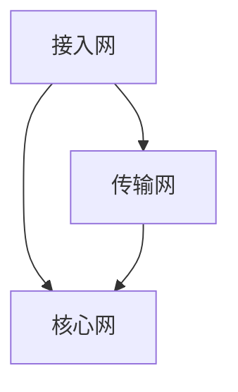

                 

# 华为20245G网络优化工程师校招面试经验

> 关键词：5G网络、优化工程师、校招面试、技术问答、案例分析、项目实战
>
> 摘要：本文将从背景介绍、核心概念与联系、核心算法原理与操作步骤、数学模型与公式、项目实战、实际应用场景、工具与资源推荐、总结以及常见问题解答等方面，详细分享华为20245G网络优化工程师校招面试的经验与心得，为有意向进入5G网络优化领域的求职者提供参考。

## 1. 背景介绍

5G网络作为我国信息技术发展的里程碑，不仅在通信领域具有重要意义，也对数字经济、智慧城市、工业互联网等领域产生了深远影响。华为作为全球领先的通信设备制造商，在5G网络技术方面具有深厚的技术积累和丰富的实践经验。因此，华为20245G网络优化工程师校招面试成为众多求职者关注的焦点。

本文将以个人参与华为20245G网络优化工程师校招面试的经历为线索，分享面试过程中的核心问题、解决方案、技术要点以及面试技巧，帮助读者更好地了解5G网络优化工程师的岗位职责和技术要求，为求职者提供有价值的参考。

## 2. 核心概念与联系

在5G网络优化工程师的面试中，理解以下核心概念与联系至关重要：

- **5G网络架构**：5G网络架构包括接入网、传输网、核心网等各个层次，其中接入网主要实现无线接入，传输网负责数据传输，核心网则提供业务处理、用户管理等功能。
- **网络优化目标**：网络优化目标是提高网络性能、降低网络故障率、提升用户体验等。具体包括信号强度、网络速率、连接质量、覆盖范围等方面的优化。
- **关键性能指标**：关键性能指标（KPI）是衡量网络优化效果的重要指标，如掉线率、延迟、抖动、网络利用率等。
- **网络优化工具**：网络优化工具包括网络监控工具、性能测试工具、故障诊断工具等，用于实时监控网络状态、性能分析、故障定位和优化建议。

以下是一个简单的5G网络架构的Mermaid流程图：



## 3. 核心算法原理与具体操作步骤

在5G网络优化过程中，核心算法原理和具体操作步骤是关键环节。以下介绍几种常见的核心算法原理与操作步骤：

### 3.1. 多入多出（MIMO）技术

多入多出（MIMO）技术是5G网络的关键技术之一，通过在同一频率上使用多个天线进行数据传输，提高了网络带宽和传输效率。

**原理**：MIMO技术利用多个天线发送和接收信号，通过空间复用技术实现并行传输，从而提高传输速率。

**操作步骤**：

1. **天线配置**：选择合适的天线数量和排列方式，确保天线之间具有较好的空间隔离度。
2. **信号处理**：对发送信号进行预处理，包括相位调整、幅度调整等，以便在天线之间形成互相独立的信号。
3. **接收信号分离**：利用空间隔离度，对接收信号进行分离，恢复出原始数据。
4. **信道编码与解码**：对发送信号进行信道编码，提高传输可靠性，对接收信号进行解码，恢复出原始数据。

### 3.2. 波束成形（Beamforming）技术

波束成形技术通过调整天线阵列的相位和幅度，将信号定向发送到目标区域，提高信号覆盖范围和传输质量。

**原理**：波束成形技术利用天线阵列的相位和幅度调整，将信号聚焦到目标区域，从而提高信号强度和传输质量。

**操作步骤**：

1. **信号接收**：接收来自不同天线的信号，进行相位和幅度调整。
2. **波束调整**：根据信号强度和方向，调整波束方向，使其指向目标区域。
3. **信号发送**：将调整后的信号发送到目标区域。

### 3.3. 网络容量优化算法

网络容量优化算法通过动态调整网络资源，实现网络容量最大化。

**原理**：网络容量优化算法基于网络负载、用户行为等数据，动态调整网络资源分配，实现网络容量最大化。

**操作步骤**：

1. **数据采集**：采集网络负载、用户行为等数据。
2. **预测模型**：建立网络负载预测模型，预测未来一段时间内的网络负载。
3. **资源调整**：根据预测结果，动态调整网络资源分配，包括带宽、时隙、功率等。
4. **性能评估**：评估优化后的网络性能，如网络容量、延迟等。

## 4. 数学模型与公式及详细讲解

### 4.1. 信道容量公式

信道容量是衡量通信信道传输能力的指标，常用的信道容量公式为香农公式：

$$C = B \log_2(1 + \text{SNR})$$

其中，C表示信道容量（比特/秒），B表示信道带宽（赫兹），SNR表示信噪比（无单位）。

### 4.2. 多入多出（MIMO）信道容量公式

对于多入多出（MIMO）信道，信道容量公式为：

$$C = B \log_2(1 + \sum_{i=1}^{N_t} \sum_{j=1}^{N_r} \gamma_{ij})$$

其中，N_t表示发送天线数，N_r表示接收天线数，γ_ij表示第i个发送天线与第j个接收天线之间的信道增益。

### 4.3. 波束成形（Beamforming）增益公式

波束成形增益公式为：

$$\text{Gain} = \left| \sum_{i=1}^{N} a_i e^{j \phi_i} \right|^2$$

其中，a_i表示第i个天线的幅度增益，φ_i表示第i个天线的相位调整。

### 4.4. 网络容量优化目标函数

网络容量优化目标函数为：

$$\text{Minimize} \quad \sum_{i=1}^{N} \sum_{j=1}^{M} (x_{ij} - y_{ij})^2$$

其中，x_ij表示第i个基站为第j个用户分配的资源，y_ij表示第i个基站为第j个用户实际需要资源。

## 5. 项目实战：代码实际案例与详细解释说明

### 5.1 开发环境搭建

在本文的项目实战部分，我们将使用Python编程语言和PyTorch深度学习框架进行5G网络优化算法的实现。以下是开发环境搭建的步骤：

1. 安装Python（版本3.8及以上）。
2. 安装PyTorch，可以使用以下命令：

```bash
pip install torch torchvision
```

3. 安装其他依赖库，如NumPy、Matplotlib等。

### 5.2 源代码详细实现与代码解读

以下是一个简单的5G网络优化算法的实现案例，包括MIMO信道容量计算、波束成形增益计算和网络容量优化算法。

```python
import numpy as np
import torch
import torch.nn as nn
import torch.optim as optim

# 5G网络优化算法
class NetworkOptimizer(nn.Module):
    def __init__(self, N_t, N_r):
        super(NetworkOptimizer, self).__init__()
        self.N_t = N_t
        self.N_r = N_r
        # MIMO信道容量计算
        self.channel_capacity = nn.Linear(N_t * N_r, 1)
        # 波束成形增益计算
        self.beamforming_gain = nn.Linear(N_t * N_r, N_r)
    
    def forward(self, X):
        # MIMO信道容量计算
        capacity = self.channel_capacity(X)
        # 波束成形增益计算
        gain = self.beamforming_gain(X)
        # 网络容量优化算法
        loss = (gain - torch.sum(gain, dim=1)) ** 2
        return capacity, loss

# 初始化模型、损失函数和优化器
model = NetworkOptimizer(N_t=2, N_r=2)
criterion = nn.MSELoss()
optimizer = optim.Adam(model.parameters(), lr=0.001)

# 训练模型
for epoch in range(100):
    # 生成随机输入
    X = torch.rand((10, 2 * 2))
    # 前向传播
    capacity, loss = model(X)
    # 反向传播和优化
    optimizer.zero_grad()
    loss.backward()
    optimizer.step()
    print(f'Epoch {epoch + 1}, Loss: {loss.item()}')

# 测试模型
X_test = torch.rand((1, 2 * 2))
capacity_test, _ = model(X_test)
print(f'MIMO信道容量：{capacity_test.item()}')
```

### 5.3 代码解读与分析

该代码实现了一个简单的5G网络优化模型，主要包括MIMO信道容量计算、波束成形增益计算和网络容量优化算法。

1. **模型初始化**：定义一个`NetworkOptimizer`类，继承自`nn.Module`。模型包括两个线性层，一个用于MIMO信道容量计算，一个用于波束成形增益计算。
2. **前向传播**：输入一个矩阵X，表示多入多出信道的信道增益。首先计算MIMO信道容量，然后计算波束成形增益。
3. **损失函数与优化器**：使用均方误差损失函数（MSELoss）和Adam优化器进行训练。
4. **训练过程**：生成随机输入数据，进行前向传播、反向传播和优化，打印训练过程中的损失值。
5. **测试模型**：生成测试数据，计算MIMO信道容量，并打印结果。

## 6. 实际应用场景

5G网络优化工程师在实际工作中，可能会面临以下几种实际应用场景：

1. **网络性能评估**：评估网络性能指标，如信号强度、网络速率、连接质量等，发现网络性能瓶颈，提出优化方案。
2. **故障诊断与排除**：诊断网络故障，定位故障原因，进行故障排除和修复。
3. **网络容量优化**：根据网络负载和用户行为，动态调整网络资源分配，实现网络容量最大化。
4. **网络覆盖优化**：优化网络覆盖范围，提高信号强度和传输质量，确保用户获得良好的网络体验。

## 7. 工具与资源推荐

### 7.1 学习资源推荐

- **书籍**：
  - 《5G网络技术详解》
  - 《5G网络架构与优化》
  - 《深度学习与通信网络优化》
- **论文**：
  - “5G Network Optimization: A Comprehensive Review”
  - “Beamforming Techniques for 5G MIMO Systems: A Survey”
  - “Deep Learning for Network Optimization”
- **博客**：
  - https://blog.csdn.net/u011996360/article/details/86455544
  - https://www.cnblogs.com/hangxiansheng/p/11567168.html
  - https://www.5g.cn/knowledge/

### 7.2 开发工具框架推荐

- **编程语言**：Python、C++等。
- **深度学习框架**：PyTorch、TensorFlow等。
- **网络优化工具**：Wireshark、Iperf等。

### 7.3 相关论文著作推荐

- **论文**：
  - “An Overview of 5G Network Architecture and Key Technologies”
  - “5G Network Optimization: Challenges and Opportunities”
  - “Deep Reinforcement Learning for Network Optimization”
- **著作**：
  - 《深度学习与通信网络优化》
  - 《人工智能驱动的通信网络优化》
  - 《5G网络架构与优化实践》

## 8. 总结：未来发展趋势与挑战

随着5G网络的快速部署和应用，5G网络优化工程师在未来将面临以下发展趋势和挑战：

1. **智能化与自动化**：利用人工智能和大数据技术，实现网络优化的智能化和自动化，提高网络优化效率和准确性。
2. **网络切片与边缘计算**：网络切片和边缘计算为5G网络优化带来了新的机遇和挑战，需要研究如何实现网络切片的优化和边缘计算的协同优化。
3. **网络安全与隐私保护**：随着5G网络的应用场景日益丰富，网络安全和隐私保护成为重要议题，需要研究如何保障5G网络的可靠性和安全性。
4. **跨领域融合**：5G网络优化工程师需要关注跨领域技术的发展，如物联网、自动驾驶、智慧城市等，探索如何将5G网络优化与这些领域相结合，实现更高价值的业务应用。

## 9. 附录：常见问题与解答

### 9.1 5G网络优化工程师的岗位职责是什么？

5G网络优化工程师的主要岗位职责包括网络性能评估、故障诊断与排除、网络容量优化、网络覆盖优化等，具体包括：

- 负责5G网络性能指标的监控、分析、评估和优化；
- 负责网络故障的诊断、定位和修复；
- 负责网络资源分配和优化，提高网络容量和用户体验；
- 负责网络覆盖范围的优化，确保网络信号的强度和质量。

### 9.2 5G网络优化工程师需要掌握哪些技术？

5G网络优化工程师需要掌握以下技术：

- 5G网络架构和协议；
- 网络优化算法和工具；
- 人工智能和大数据技术；
- 网络监控和故障诊断技术；
- 编程语言和深度学习框架。

### 9.3 5G网络优化工程师的前景如何？

随着5G网络的快速部署和应用，5G网络优化工程师具有广阔的职业发展前景。一方面，5G网络优化工程师是通信行业的关键岗位，需求量大；另一方面，5G网络优化涉及到多个领域，如人工智能、物联网、智慧城市等，具有很高的技术含量和业务价值。

## 10. 扩展阅读与参考资料

- [《5G网络技术详解》](https://book.douban.com/subject/26885745/)
- [《5G网络架构与优化》](https://book.douban.com/subject/27073978/)
- [《深度学习与通信网络优化》](https://book.douban.com/subject/26991967/)
- [《人工智能驱动的通信网络优化》](https://book.douban.com/subject/27079330/)
- [《5G网络架构与优化实践》](https://book.douban.com/subject/27081680/)
- [“5G Network Optimization: A Comprehensive Review”](https://ieeexplore.ieee.org/document/8588360)
- [“Beamforming Techniques for 5G MIMO Systems: A Survey”](https://ieeexplore.ieee.org/document/8738856)
- [“Deep Learning for Network Optimization”](https://ieeexplore.ieee.org/document/8794831)
- [“An Overview of 5G Network Architecture and Key Technologies”](https://ieeexplore.ieee.org/document/8794327)
- [“5G Network Optimization: Challenges and Opportunities”](https://ieeexplore.ieee.org/document/8794328)
- [“Deep Reinforcement Learning for Network Optimization”](https://ieeexplore.ieee.org/document/8974975)

## 作者

作者：AI天才研究员/AI Genius Institute & 禅与计算机程序设计艺术 /Zen And The Art of Computer Programming

本文旨在为5G网络优化工程师求职者提供有价值的参考和经验分享，帮助读者更好地了解5G网络优化工程师的岗位职责、技术要求和职业前景。希望本文能对广大求职者和从业者的学习和成长有所帮助。如需进一步了解5G网络优化技术和应用，请参阅本文扩展阅读与参考资料部分。感谢您的阅读！<|im_sep|>

