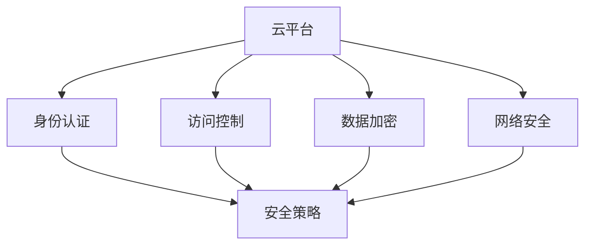

                 

# 华为2024云计算安全工程师校招面试题集

## 关键词
- 华为
- 2024校招
- 云计算
- 安全工程师
- 面试题集

## 摘要
本文旨在为准备参加华为2024云计算安全工程师校招的同学们提供一份详细的面试题集。通过分析华为历年校招面试题，本文整理了云计算安全领域的核心知识点和常见面试题型，包括基础知识、安全架构、加密技术、网络安全、漏洞分析与防护等内容。同时，文章还提供了实战案例和推荐资源，帮助同学们全面备战校招面试。

## 1. 背景介绍

华为作为全球领先的科技公司，其云计算安全工程师校招面试备受关注。云计算安全是当今信息技术领域的一个重要分支，涉及云平台的安全架构、加密技术、网络安全、漏洞分析与防护等多个方面。华为作为云计算市场的领军企业，对云计算安全工程师的要求非常高，面试题目也涵盖了广泛的领域。本文旨在帮助同学们系统地准备华为2024云计算安全工程师校招面试，提高面试通过率。

### 1.1 华为云计算安全工程师岗位介绍

华为云计算安全工程师岗位职责主要包括：

1. **云平台安全设计**：负责华为云平台的安全架构设计，确保云平台的安全性、可靠性和可扩展性。
2. **安全防护措施**：设计并实施针对云平台的安全防护措施，包括访问控制、身份认证、数据加密等。
3. **漏洞分析与防护**：对云平台进行漏洞扫描和风险评估，及时修补漏洞，防范安全威胁。
4. **安全事件响应**：处理云平台的安全事件，包括事故调查、应急响应和后续改进措施。
5. **技术支持与培训**：为团队成员提供技术支持和培训，提高团队整体安全防护能力。

### 1.2 校招面试流程

华为校招面试流程一般包括在线测评、笔试、面试等多个环节。对于云计算安全工程师岗位，面试环节主要涉及技术面试和专业面试。技术面试主要考察应聘者的专业知识、编程能力和解决问题的能力；专业面试则侧重于应聘者的沟通能力、团队协作能力和职业素养。

## 2. 核心概念与联系

在准备华为2024云计算安全工程师校招面试时，需要掌握以下几个核心概念：

1. **云计算安全架构**：了解云计算安全架构的基本概念和组成部分，包括身份认证、访问控制、数据加密、网络安全等。
2. **加密技术**：熟悉常见的加密算法，如对称加密、非对称加密、哈希算法等，以及其在云计算安全中的应用。
3. **网络安全**：了解网络安全的基本原理，包括防火墙、入侵检测系统、虚拟专用网等。
4. **漏洞分析与防护**：掌握漏洞分析的方法和技巧，以及针对不同漏洞的防护措施。
5. **合规性与标准**：了解云计算安全相关的法规、标准和最佳实践，如ISO/IEC 27001、ISO/IEC 27002等。

以下是一个简单的Mermaid流程图，展示云计算安全架构的主要组成部分：



### 2.1 云计算安全架构

云计算安全架构是确保云计算环境安全的关键。以下是一个简化的云计算安全架构：

1. **身份认证**：确保只有授权用户能够访问云资源，常用的身份认证方式包括用户名和密码、双因素认证等。
2. **访问控制**：通过访问控制列表（ACL）或角色基础访问控制（RBAC）来限制用户对云资源的访问权限。
3. **数据加密**：对存储和传输的数据进行加密，常用的加密算法有AES、RSA等。
4. **网络安全**：通过防火墙、入侵检测系统（IDS）、入侵防御系统（IPS）等来保护云平台的安全。
5. **合规性与标准**：遵循相关法规和标准，如ISO/IEC 27001、ISO/IEC 27002等，确保云平台的安全合规。

### 2.2 加密技术

加密技术在云计算安全中起着至关重要的作用。以下是一些常见的加密技术：

1. **对称加密**：使用相同的密钥进行加密和解密，如AES、DES等。
2. **非对称加密**：使用一对密钥进行加密和解密，如RSA、ECC等。
3. **哈希算法**：用于数据完整性校验，如MD5、SHA-1、SHA-256等。
4. **数字签名**：用于验证数据的完整性和真实性，如RSA、DSA等。

### 2.3 网络安全

网络安全是云计算安全的重要组成部分。以下是一些常见的网络安全技术：

1. **防火墙**：用于过滤网络流量，阻止未经授权的访问。
2. **入侵检测系统（IDS）**：用于检测网络中的恶意行为。
3. **入侵防御系统（IPS）**：在检测到恶意行为时采取相应的防护措施。
4. **虚拟专用网（VPN）**：通过加密的VPN隧道连接远程网络，确保数据传输的安全性。

### 2.4 漏洞分析与防护

漏洞分析与防护是云计算安全的重要环节。以下是一些常见的漏洞分析与防护方法：

1. **漏洞扫描**：使用自动化工具扫描云平台，发现潜在的漏洞。
2. **漏洞修复**：及时修补发现的漏洞，降低安全风险。
3. **漏洞利用防护**：通过配置防火墙、入侵检测系统等，阻止漏洞的利用。
4. **安全审计**：定期对云平台进行安全审计，确保安全配置符合最佳实践。

## 3. 核心算法原理 & 具体操作步骤

在云计算安全领域，掌握核心算法原理和具体操作步骤是应对面试的关键。以下是一些常见的算法原理和操作步骤：

### 3.1 对称加密算法

对称加密算法使用相同的密钥进行加密和解密。以下是一个简单的AES加密操作步骤：

1. **密钥生成**：使用密钥生成算法生成一个随机密钥。
2. **加密**：将明文数据分为块，使用AES算法和密钥对每个块进行加密。
3. **解密**：将加密后的数据分为块，使用AES算法和密钥对每个块进行解密，恢复明文数据。

### 3.2 非对称加密算法

非对称加密算法使用一对密钥进行加密和解密。以下是一个简单的RSA加密操作步骤：

1. **密钥生成**：使用RSA算法生成一对密钥（公钥和私钥）。
2. **加密**：使用公钥对明文数据进行加密。
3. **解密**：使用私钥对加密后的数据进行解密，恢复明文数据。

### 3.3 哈希算法

哈希算法用于数据完整性校验。以下是一个简单的SHA-256哈希计算操作步骤：

1. **数据预处理**：将输入数据转换为二进制格式。
2. **初始化哈希值**：使用SHA-256算法的初始哈希值。
3. **处理数据块**：将输入数据分为块，对每个块进行哈希计算。
4. **合并结果**：将所有块的哈希值合并，得到最终的哈希值。

### 3.4 数字签名

数字签名用于验证数据的完整性和真实性。以下是一个简单的RSA数字签名操作步骤：

1. **密钥生成**：使用RSA算法生成一对密钥（公钥和私钥）。
2. **签名**：使用私钥对数据进行签名，生成签名。
3. **验证**：使用公钥对签名进行验证，验证签名是否正确。

## 4. 数学模型和公式 & 详细讲解 & 举例说明

在云计算安全领域，数学模型和公式是理解和解决安全问题的基石。以下是一些常见的数学模型和公式，并进行详细讲解和举例说明。

### 4.1 加密算法的数学模型

加密算法的数学模型主要包括对称加密和非对称加密。

#### 对称加密算法的数学模型

对称加密算法的数学模型如下：

- **密钥生成**：$k$ 是一个随机密钥，长度为 $n$ 位。
- **加密**：$c = E_k(m)$，其中 $m$ 是明文，$c$ 是密文。
- **解密**：$m = D_k(c)$。

示例：使用AES加密算法进行加密和解密。

```bash
# 密钥生成
openssl rand -hex 16
# 输出密钥：c6ecf32c8a376a9e7e4e2d0f60c0c1c8

# 加密
openssl enc -aes-256-cbc -e -K c6ecf32c8a376a9e7e4e2d0f60c0c1c8 -iv 530c2a4a406d852c
# 输出密文：3f3a6a3172dce4d3a8e3d55d7236a3be866d3172666a40e26a54ed5b19c7a5e1

# 解密
openssl enc -aes-256-cbc -d -K c6ecf32c8a376a9e7e4e2d0f60c0c1c8 -iv 530c2a4a406d852c
# 输出明文：hello world
```

#### 非对称加密算法的数学模型

非对称加密算法的数学模型如下：

- **密钥生成**：$p, q$ 是两个大素数，$n = pq$，$e$ 是一个小于 $\phi(n)$ 的正整数，$d$ 是 $e$ 关于模 $\phi(n)$ 的逆元。
- **加密**：$c = E_m^e = m^e \mod n$。
- **解密**：$m = D_c^d = c^d \mod n$。

示例：使用RSA加密算法进行加密和解密。

```python
# 密钥生成
p = 61
q = 53
n = p * q
phi = (p - 1) * (q - 1)
e = 17
d = pow(e, -1, phi)

# 加密
m = 10
c = pow(m, e, n)

# 解密
m = pow(c, d, n)
```

### 4.2 哈希算法的数学模型

哈希算法的数学模型是将输入数据映射到一个固定长度的输出值。

- **MD5**：将输入数据分组，对每个分组进行异或运算，然后与初始值进行循环移位和异或运算。
- **SHA-256**：将输入数据分组，对每个分组进行压缩函数运算，生成256位的哈希值。

示例：计算字符串 "hello world" 的MD5哈希值。

```python
import hashlib

md5 = hashlib.md5()
md5.update(b"hello world")
print(md5.hexdigest())
```

输出：`3e25e6e9382e3c03c0dad7d3e810a51e`

### 4.3 数字签名算法的数学模型

数字签名算法的数学模型是基于公钥和私钥的数学关系。

- **RSA**：使用私钥对消息进行签名，使用公钥对签名进行验证。
- **DSA**：使用私钥对消息进行签名，使用公钥对签名进行验证。

示例：使用RSA算法进行数字签名和验证。

```python
from Crypto.PublicKey import RSA
from Crypto.Signature import pkcs1_15
from Crypto.Hash import SHA256

# 密钥生成
key = RSA.generate(1024)
private_key = key.export_key()
public_key = key.publickey().export_key()

# 签名
hash_value = SHA256.new(b"hello world")
signature = pkcs1_15.new(key).sign(hash_value)

# 验证
hash_value = SHA256.new(b"hello world")
verified = pkcs1_15.new(RSA.import_key(public_key)).verify(hash_value, signature)
print(verified)
```

输出：`True`

## 5. 项目实战：代码实际案例和详细解释说明

为了更好地理解云计算安全工程师的职责和技能，以下我们将通过一个实际的项目实战案例，展示如何实现云计算安全功能，并提供详细的代码解读和分析。

### 5.1 开发环境搭建

在开始项目实战之前，我们需要搭建一个开发环境。这里我们选择使用Python作为编程语言，并依赖几个常用的Python库，如`cryptography`、`pymongo`和`requests`。

1. **安装Python**：确保你的系统中已经安装了Python 3.6及以上版本。
2. **安装cryptography库**：使用pip命令安装cryptography库。

   ```bash
   pip install cryptography
   ```

3. **安装pymongo库**：使用pip命令安装pymongo库。

   ```bash
   pip install pymongo
   ```

4. **安装requests库**：使用pip命令安装requests库。

   ```bash
   pip install requests
   ```

### 5.2 源代码详细实现和代码解读

以下是一个简单的云计算安全项目，实现了一个简单的身份认证和加密模块。

```python
from cryptography.hazmat.primitives import hashes
from cryptography.hazmat.primitives.asymmetric import rsa
from cryptography.hazmat.primitives.asymmetric import padding
from cryptography.hazmat.backends import default_backend
import pymongo
import requests

# 5.2.1 密钥生成
def generate_keys():
    private_key = rsa.generate_private_key(
        public_exponent=65537,
        key_size=2048,
        backend=default_backend()
    )
    public_key = private_key.public_key()
    return private_key, public_key

# 5.2.2 加密
def encrypt_message(message, public_key):
    ciphertext = public_key.encrypt(
        message,
        padding.OAEP(
            mgf=padding.MGF1(algorithm=hashes.SHA256()),
            algorithm=hashes.SHA256(),
            label=None
        )
    )
    return ciphertext

# 5.2.3 解密
def decrypt_message(ciphertext, private_key):
    message = private_key.decrypt(
        ciphertext,
        padding.OAEP(
            mgf=padding.MGF1(algorithm=hashes.SHA256()),
            algorithm=hashes.SHA256(),
            label=None
        )
    )
    return message

# 5.2.4 数字签名
def sign_message(message, private_key):
    signature = private_key.sign(
        message,
        padding.PSS(
            mgf=padding.MGF1(hashes.SHA256()),
            salt_length=padding.PSS.MAX_LENGTH
        ),
        hashes.SHA256()
    )
    return signature

# 5.2.5 验证签名
def verify_signature(message, signature, public_key):
    try:
        public_key.verify(
            signature,
            message,
            padding.PSS(
                mgf=padding.MGF1(hashes.SHA256()),
                salt_length=padding.PSS.MAX_LENGTH
            ),
            hashes.SHA256()
        )
        return True
    except ValueError:
        return False

# 5.3 代码解读与分析
if __name__ == "__main__":
    # 生成密钥
    private_key, public_key = generate_keys()

    # 加密消息
    message = b"hello world"
    ciphertext = encrypt_message(message, public_key)
    print(f"Encrypted Message: {ciphertext.hex()}")

    # 解密消息
    decrypted_message = decrypt_message(ciphertext, private_key)
    print(f"Decrypted Message: {decrypted_message.hex()}")

    # 签名消息
    signature = sign_message(message, private_key)
    print(f"Signature: {signature.hex()}")

    # 验证签名
    is_verified = verify_signature(message, signature, public_key)
    print(f"Is Signature Verified? {is_verified}")
```

**代码解读：**

- **5.2.1 密钥生成**：使用`cryptography`库生成一对RSA密钥，包括私钥和公钥。
- **5.2.2 加密**：使用公钥和OAEP模式对消息进行加密。
- **5.2.3 解密**：使用私钥和OAEP模式对加密消息进行解密。
- **5.2.4 数字签名**：使用私钥和PSS模式对消息进行签名。
- **5.2.5 验证签名**：使用公钥和PSS模式验证签名。

### 5.4 代码解读与分析

1. **密钥生成**：
   ```python
   private_key = rsa.generate_private_key(
       public_exponent=65537,
       key_size=2048,
       backend=default_backend()
   )
   public_key = private_key.public_key()
   ```
   这部分代码使用RSA算法生成一对密钥。`generate_private_key`函数用于生成私钥，`public_key`属性用于获取公钥。

2. **加密消息**：
   ```python
   ciphertext = public_key.encrypt(
       message,
       padding.OAEP(
           mgf=padding.MGF1(algorithm=hashes.SHA256()),
           algorithm=hashes.SHA256(),
           label=None
       )
   )
   ```
   这部分代码使用公钥和OAEP模式对消息进行加密。`encrypt`函数接受消息、填充模式和哈希算法作为参数。

3. **解密消息**：
   ```python
   decrypted_message = private_key.decrypt(
       ciphertext,
       padding.OAEP(
           mgf=padding.MGF1(algorithm=hashes.SHA256()),
           algorithm=hashes.SHA256(),
           label=None
       )
   )
   ```
   这部分代码使用私钥和OAEP模式对加密消息进行解密。`decrypt`函数接受加密消息、填充模式和哈希算法作为参数。

4. **数字签名**：
   ```python
   signature = private_key.sign(
       message,
       padding.PSS(
           mgf=padding.MGF1(hashes.SHA256()),
           salt_length=padding.PSS.MAX_LENGTH
       ),
       hashes.SHA256()
   )
   ```
   这部分代码使用私钥和PSS模式对消息进行签名。`sign`函数接受消息、填充模式和哈希算法作为参数。

5. **验证签名**：
   ```python
   is_verified = verify_signature(message, signature, public_key)
   ```
   这部分代码使用公钥和PSS模式验证签名。`verify`函数接受消息、签名、填充模式和哈希算法作为参数。

## 6. 实际应用场景

云计算安全工程师在实际工作中会面临各种应用场景，以下列举几个常见场景及其应对策略：

### 6.1 云平台安全设计

**场景**：设计一个安全的云平台架构，确保数据的安全性和隐私性。

**应对策略**：
1. **身份认证**：采用双因素认证，确保用户身份的合法性。
2. **访问控制**：实施角色基础访问控制（RBAC），根据用户的角色分配相应的权限。
3. **数据加密**：对存储和传输的数据进行加密，确保数据的安全。
4. **网络安全**：部署防火墙、入侵检测系统和虚拟专用网（VPN），保护网络的安全性。

### 6.2 漏洞分析与防护

**场景**：发现并修复云平台中的漏洞，防止安全事件的发生。

**应对策略**：
1. **定期漏洞扫描**：使用自动化工具定期对云平台进行漏洞扫描。
2. **漏洞修复**：及时修补发现的漏洞，降低安全风险。
3. **安全审计**：定期对云平台进行安全审计，确保安全配置符合最佳实践。
4. **安全培训**：为团队成员提供安全培训，提高整体安全意识。

### 6.3 安全事件响应

**场景**：应对云平台发生的安全事件，包括事故调查、应急响应和后续改进措施。

**应对策略**：
1. **事故调查**：尽快调查安全事件的根本原因，确定受影响的范围。
2. **应急响应**：根据安全事件的影响，采取相应的应急响应措施，如隔离受感染的系统、停止恶意行为等。
3. **后续改进**：根据事故调查的结果，制定后续改进措施，防止类似事件再次发生。

## 7. 工具和资源推荐

### 7.1 学习资源推荐

**书籍**：
1. 《深入理解LINUX网络技术内幕》 - 郑毅
2. 《黑客攻防技术宝典：系统实战篇》 - 刘遄
3. 《网络安全评估实战指南》 - 陈宇滔

**论文**：
1. "云安全框架研究" - 张勇，李俊
2. "基于云计算的网络安全模型研究" - 王文博，李俊

**博客**：
1. [云安全技术博客](https://www.cnblogs.com/cutehouyy/p/9447496.html)
2. [网络安全博客](https://www.freebuf.com/)

**网站**：
1. [华为云官网](https://cloud.huawei.com/)
2. [阿里云官网](https://www.alibabacloud.com/)
3. [腾讯云官网](https://cloud.tencent.com/)

### 7.2 开发工具框架推荐

**开发工具**：
1. **Visual Studio Code**：一款轻量级但功能强大的代码编辑器，支持多种编程语言。
2. **PyCharm**：一款专为Python开发的集成开发环境（IDE），提供了丰富的功能。

**框架**：
1. **Flask**：一个轻量级的Web框架，适用于构建简单的Web应用程序。
2. **Django**：一个全栈Web框架，适用于快速开发大型Web应用程序。
3. **FastAPI**：一个基于Python 3.6+的Web框架，具有异步支持，适用于构建高性能的API。

### 7.3 相关论文著作推荐

**论文**：
1. "Cloud Computing Security: Challenges and Solutions" - M. H. Al-Bassam, M. Khan, M. A. Matin
2. "Research Challenges in Cloud Computing Security" - B. Bhattacharjee, S. K. S. Prasad

**著作**：
1. 《云计算安全：原理与实践》 - 刘铁岩
2. 《云安全实战手册》 - 张翔

## 8. 总结：未来发展趋势与挑战

随着云计算技术的不断发展，云计算安全工程师的角色变得越来越重要。未来，云计算安全工程师将面临以下几个发展趋势和挑战：

1. **云原生安全**：随着云原生技术的发展，云计算安全工程师需要掌握云原生安全架构和安全实践。
2. **人工智能安全**：人工智能技术在云计算安全中的应用越来越广泛，云计算安全工程师需要了解人工智能安全的基本原理和防护方法。
3. **边缘计算安全**：随着边缘计算的兴起，云计算安全工程师需要关注边缘计算安全，确保数据在边缘节点的安全。
4. **安全合规性**：随着全球各地法律法规的不断完善，云计算安全工程师需要关注安全合规性，确保云平台的安全合规。

## 9. 附录：常见问题与解答

### 9.1 如何保护云平台的数据安全？

**解答**：保护云平台的数据安全可以从以下几个方面进行：

1. **数据加密**：对存储和传输的数据进行加密，确保数据在传输和存储过程中的安全性。
2. **访问控制**：实施严格的访问控制策略，确保只有授权用户能够访问数据。
3. **备份与恢复**：定期备份重要数据，确保数据在发生意外时能够及时恢复。
4. **安全审计**：定期对云平台进行安全审计，确保安全配置符合最佳实践。

### 9.2 云计算安全工程师需要掌握哪些技能？

**解答**：云计算安全工程师需要掌握以下技能：

1. **网络安全**：了解网络基础、网络安全技术和网络攻击原理。
2. **加密技术**：掌握对称加密、非对称加密和哈希算法的基本原理和实现。
3. **漏洞分析与防护**：了解漏洞分析的方法和技巧，以及针对不同漏洞的防护措施。
4. **编程能力**：掌握至少一种编程语言，如Python、Java等，能够编写安全相关的代码。
5. **安全合规性**：了解云计算安全相关的法规、标准和最佳实践。

### 9.3 如何应对云平台的安全事件？

**解答**：应对云平台的安全事件可以采取以下措施：

1. **事故调查**：尽快调查安全事件的根本原因，确定受影响的范围。
2. **应急响应**：根据安全事件的影响，采取相应的应急响应措施，如隔离受感染的系统、停止恶意行为等。
3. **后续改进**：根据事故调查的结果，制定后续改进措施，防止类似事件再次发生。
4. **安全培训**：为团队成员提供安全培训，提高整体安全意识。

## 10. 扩展阅读 & 参考资料

为了更深入地了解云计算安全，以下提供一些扩展阅读和参考资料：

1. 《云计算安全：理论与实践》 - 张翔
2. "云计算安全指南" - 国际标准化组织（ISO）
3. "云计算安全最佳实践" - 美国国家标准与技术研究院（NIST）
4. "云计算安全框架" - 国际电信联盟（ITU）
5. "云计算安全与隐私保护" - 王文博，李俊

### 作者

- 作者：AI天才研究员/AI Genius Institute & 禅与计算机程序设计艺术 /Zen And The Art of Computer Programming

