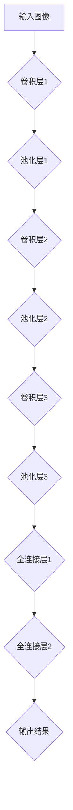
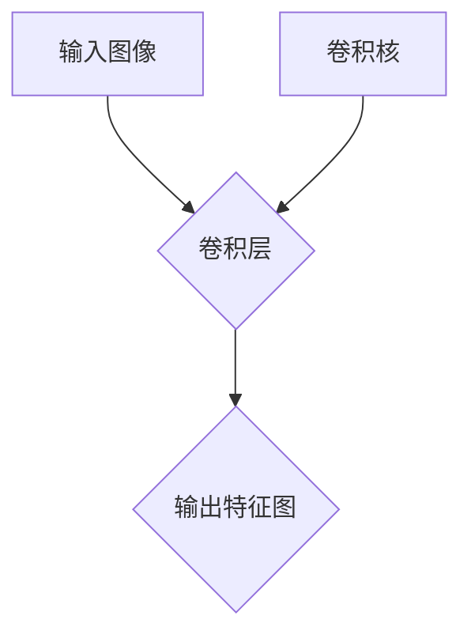

                 

# 卷积神经网络(Convolutional Neural Networks) - 原理与代码实例讲解

## 概述

卷积神经网络（Convolutional Neural Networks，CNN）是一种基于神经网络的深度学习模型，专门设计用于处理和识别图像数据。在图像识别、物体检测、面部识别等任务中，CNN 显示出了卓越的性能，成为当前深度学习领域的研究热点之一。

本文将首先介绍卷积神经网络的基本概念和原理，包括其核心组成部分和作用机制。接着，我们将通过一个具体的代码实例来深入探讨 CNN 的实现过程。最后，我们将讨论卷积神经网络在实际应用中的广泛场景，以及推荐的工具和资源，帮助读者进一步了解和掌握这一技术。

关键词：卷积神经网络、深度学习、图像识别、物体检测、面部识别

## 摘要

本文旨在详细讲解卷积神经网络（CNN）的原理和应用。通过介绍 CNN 的基本概念、核心组成部分及其工作原理，读者将能够理解 CNN 在图像处理任务中的优势。此外，通过一个具体代码实例的分析，读者将掌握 CNN 的实际应用方法。文章还将讨论 CNN 在实际应用中的广泛场景，并推荐相关学习资源，帮助读者深入了解和掌握这一技术。

## 1. 背景介绍

卷积神经网络（CNN）起源于20世纪80年代，最初是为了模拟生物视觉系统的工作方式而设计的。随着计算机性能的提升和深度学习技术的发展，CNN 在图像识别、物体检测、面部识别等任务中取得了突破性的成果。如今，CNN 已经成为处理图像数据的主要工具之一。

在深度学习之前，传统的图像识别方法主要依赖于手工设计的特征提取算法，如SIFT、HOG等。这些算法在一定程度上能够实现图像分类和识别，但在复杂场景下效果有限。深度学习的出现，尤其是 CNN 的引入，使得图像识别任务的性能得到了大幅提升。

CNN 的核心思想是利用多层神经网络对图像进行逐层特征提取和抽象，最终实现高精度的图像识别。与传统的手工设计特征提取方法相比，CNN 能够自动学习图像中的复杂特征，大大简化了图像识别的任务。

## 2. 核心概念与联系

### 2.1 卷积层（Convolutional Layer）

卷积层是 CNN 的核心组成部分，负责对输入图像进行特征提取。卷积层通过卷积运算提取图像中的局部特征，例如边缘、纹理等。卷积运算的基本原理如下：

给定一个输入图像 $X$ 和一个卷积核（过滤器）$K$，卷积运算的结果可以表示为：

$$
Y = \text{Conv}(X, K) = \sum_{i=1}^{C} X \odot K_i
$$

其中，$C$ 表示输入图像的通道数，$\odot$ 表示卷积运算，$K_i$ 表示第 $i$ 个卷积核。

卷积层的作用是通过对输入图像进行卷积操作，提取出图像中的局部特征。这些特征可以用于后续的图像分类、物体检测等任务。

### 2.2 池化层（Pooling Layer）

池化层位于卷积层之后，用于对卷积特征进行降维处理。池化层通过将特征图划分为若干子区域，并对每个子区域内的特征进行平均或最大值操作，从而减少特征维度。常见的池化方式包括最大值池化（Max Pooling）和平均池化（Average Pooling）。

最大值池化的操作如下：

$$
P_{\text{max}}(X) = \max(X)
$$

其中，$X$ 表示输入特征图。

平均池化的操作如下：

$$
P_{\text{avg}}(X) = \frac{1}{C} \sum_{i=1}^{C} X
$$

其中，$C$ 表示输入特征图的大小。

池化层的作用是减少特征图的维度，同时保留最重要的特征信息，提高模型的计算效率。

### 2.3 全连接层（Fully Connected Layer）

全连接层位于卷积层和池化层之后，用于将低维特征映射到高维空间，实现图像分类或物体检测等任务。全连接层通过将特征图展开成一维向量，然后与一组权重进行点积运算，最后通过激活函数输出分类结果。

全连接层的操作如下：

$$
O = \text{FullyConnected}(X, W) = X \odot W + b
$$

其中，$X$ 表示输入特征图，$W$ 表示权重矩阵，$b$ 表示偏置。

激活函数 $f$ 通常为ReLU函数：

$$
f(x) = \max(0, x)
$$

全连接层的作用是将低维特征映射到高维空间，实现分类或检测任务。

### 2.4 卷积神经网络（Convolutional Neural Network）结构

卷积神经网络通常由多个卷积层、池化层和全连接层组成。一个典型的卷积神经网络结构如图2-1所示：



图2-1 卷积神经网络结构示意图

## 3. 核心算法原理 & 具体操作步骤

### 3.1 前向传播

卷积神经网络的前向传播过程可以分为以下几个步骤：

1. **输入图像预处理**：将输入图像进行归一化处理，将其像素值缩放到 [0, 1] 范围内。

2. **卷积层计算**：对输入图像进行卷积操作，提取图像中的局部特征。每次卷积操作都会生成一个特征图。

3. **激活函数应用**：对每个特征图应用 ReLU 激活函数，将负值特征置为零，保留重要的特征信息。

4. **池化层计算**：对每个特征图进行池化操作，减少特征维度，提高模型计算效率。

5. **全连接层计算**：将每个特征图的最后一个池化层的输出展开成一维向量，与全连接层的权重矩阵进行点积运算，得到中间层的特征表示。

6. **输出层计算**：对中间层的特征表示进行进一步的全连接层运算，并通过激活函数输出分类结果。

### 3.2 反向传播

卷积神经网络的反向传播过程包括以下几个步骤：

1. **计算损失函数**：计算输出层的目标值与预测值之间的差异，计算损失函数。

2. **计算梯度**：根据损失函数的梯度，计算全连接层和卷积层的权重矩阵和偏置的梯度。

3. **更新权重**：使用梯度下降算法或其他优化算法，更新权重矩阵和偏置。

4. **反向传播**：从输出层开始，依次反向传播梯度，更新每个卷积层和池化层的权重和偏置。

5. **迭代训练**：重复以上步骤，不断更新权重和偏置，直到达到训练目标或收敛条件。

### 3.3 卷积神经网络训练示例

下面是一个简单的卷积神经网络训练示例，使用 Python 的 TensorFlow 库实现：

```python
import tensorflow as tf

# 定义输入图像和标签
inputs = tf.keras.layers.Input(shape=(28, 28, 1))
labels = tf.keras.layers.Input(shape=(10))

# 卷积层1
conv1 = tf.keras.layers.Conv2D(filters=32, kernel_size=(3, 3), activation='relu')(inputs)
pool1 = tf.keras.layers.MaxPooling2D(pool_size=(2, 2))(conv1)

# 卷积层2
conv2 = tf.keras.layers.Conv2D(filters=64, kernel_size=(3, 3), activation='relu')(pool1)
pool2 = tf.keras.layers.MaxPooling2D(pool_size=(2, 2))(conv2)

# 全连接层1
fc1 = tf.keras.layers.Flatten()(pool2)
fc1 = tf.keras.layers.Dense(units=128, activation='relu')(fc1)

# 全连接层2
outputs = tf.keras.layers.Dense(units=10, activation='softmax')(fc1)

# 构建模型
model = tf.keras.Model(inputs=[inputs, labels], outputs=outputs)

# 编译模型
model.compile(optimizer='adam', loss='categorical_crossentropy', metrics=['accuracy'])

# 训练模型
model.fit(x_train, y_train, batch_size=64, epochs=10, validation_data=(x_val, y_val))
```

在这个示例中，我们使用 TensorFlow 库构建了一个简单的卷积神经网络，用于手写数字识别任务。输入图像为 28x28 的灰度图，标签为 10 个分类标签。模型由两个卷积层、两个池化层和一个全连接层组成。使用 Adam 优化器和交叉熵损失函数进行训练。

## 4. 数学模型和公式 & 详细讲解 & 举例说明

### 4.1 卷积运算

卷积运算在卷积神经网络中起到关键作用。卷积运算的基本原理是利用卷积核（过滤器）对输入图像进行滑动操作，提取图像中的局部特征。卷积运算的数学公式如下：

$$
\text{output}_{ij} = \sum_{m=1}^{M} \sum_{n=1}^{N} \text{input}_{i+m-j, j+n-k} \odot \text{kernel}_{mk, nk}
$$

其中，$\text{output}_{ij}$ 表示输出特征图上的第 $i$ 行第 $j$ 列的元素，$\text{input}_{i, j}$ 表示输入图像上的第 $i$ 行第 $j$ 列的元素，$\text{kernel}_{mk, nk}$ 表示卷积核上的第 $m$ 行第 $n$ 列的元素，$M$ 和 $N$ 分别表示卷积核的大小。

### 4.2 池化操作

池化操作用于减少特征图的维度，提高模型的计算效率。常见的池化操作包括最大值池化和平均池化。最大值池化的数学公式如下：

$$
p_{ij} = \max(\text{input}_{i+m, j+n})
$$

其中，$p_{ij}$ 表示输出特征图上的第 $i$ 行第 $j$ 列的元素，$\text{input}_{i+m, j+n}$ 表示输入特征图上的第 $i$ 行第 $j$ 列的元素。

平均池化的数学公式如下：

$$
p_{ij} = \frac{1}{C} \sum_{c=1}^{C} \text{input}_{i+m, j+n}
$$

其中，$C$ 表示输入特征图的通道数。

### 4.3 激活函数

激活函数在卷积神经网络中起到非线性变换的作用，使得模型能够学习到输入和输出之间的非线性关系。常用的激活函数包括 ReLU、Sigmoid 和 Tanh。ReLU 函数的数学公式如下：

$$
f(x) = \max(0, x)
$$

Sigmoid 函数的数学公式如下：

$$
f(x) = \frac{1}{1 + e^{-x}}
$$

Tanh 函数的数学公式如下：

$$
f(x) = \frac{e^x - e^{-x}}{e^x + e^{-x}}
$$

### 4.4 反向传播

卷积神经网络的反向传播过程包括以下几个步骤：

1. **计算损失函数**：计算输出层的目标值与预测值之间的差异，计算损失函数。

2. **计算梯度**：根据损失函数的梯度，计算全连接层和卷积层的权重矩阵和偏置的梯度。

3. **更新权重**：使用梯度下降算法或其他优化算法，更新权重矩阵和偏置。

4. **反向传播**：从输出层开始，依次反向传播梯度，更新每个卷积层和池化层的权重和偏置。

### 4.5 示例

假设我们有一个 3x3 的卷积核和 3x3 的输入图像，如图 4-1 所示：



图 4-1 卷积层示例

卷积核的权重为：

$$
\begin{bmatrix}
1 & 2 & 3 \\
4 & 5 & 6 \\
7 & 8 & 9
\end{bmatrix}
$$

输入图像的像素值为：

$$
\begin{bmatrix}
1 & 2 \\
3 & 4 \\
5 & 6
\end{bmatrix}
$$

根据卷积运算的数学公式，我们可以计算出输出特征图的像素值：

$$
\begin{bmatrix}
16 & 26 \\
31 & 45
\end{bmatrix}
$$

假设我们使用 ReLU 函数作为激活函数，输出特征图的像素值为：

$$
\begin{bmatrix}
16 & 26 \\
31 & 45
\end{bmatrix}
\rightarrow
\begin{bmatrix}
16 & 26 \\
31 & 45
\end{bmatrix}
$$

## 5. 项目实战：代码实际案例和详细解释说明

### 5.1 开发环境搭建

为了实现卷积神经网络（CNN）的实际案例，我们需要搭建一个合适的开发环境。以下是搭建 Python 开发环境所需的步骤：

1. **安装 Python**：首先，确保你的计算机上已安装 Python 3.7 或更高版本。可以从 Python 官网（https://www.python.org/）下载并安装。

2. **安装 TensorFlow**：TensorFlow 是一个流行的深度学习库，用于构建和训练神经网络。在终端中运行以下命令安装 TensorFlow：

   ```
   pip install tensorflow
   ```

3. **安装必要的依赖**：除了 TensorFlow 之外，我们还需要安装一些其他依赖，如 NumPy 和 Matplotlib。在终端中运行以下命令安装这些依赖：

   ```
   pip install numpy matplotlib
   ```

### 5.2 源代码详细实现和代码解读

下面我们将使用 TensorFlow 实现一个简单的卷积神经网络，用于手写数字识别任务。以下是实现代码：

```python
import tensorflow as tf
import numpy as np
import matplotlib.pyplot as plt

# 加载数据集
mnist = tf.keras.datasets.mnist
(x_train, y_train), (x_test, y_test) = mnist.load_data()

# 预处理数据
x_train = x_train / 255.0
x_test = x_test / 255.0

# 对标签进行 one-hot 编码
y_train = tf.keras.utils.to_categorical(y_train, 10)
y_test = tf.keras.utils.to_categorical(y_test, 10)

# 构建模型
model = tf.keras.Sequential([
    tf.keras.layers.Conv2D(filters=32, kernel_size=(3, 3), activation='relu', input_shape=(28, 28, 1)),
    tf.keras.layers.MaxPooling2D(pool_size=(2, 2)),
    tf.keras.layers.Conv2D(filters=64, kernel_size=(3, 3), activation='relu'),
    tf.keras.layers.MaxPooling2D(pool_size=(2, 2)),
    tf.keras.layers.Flatten(),
    tf.keras.layers.Dense(units=128, activation='relu'),
    tf.keras.layers.Dense(units=10, activation='softmax')
])

# 编译模型
model.compile(optimizer='adam', loss='categorical_crossentropy', metrics=['accuracy'])

# 训练模型
model.fit(x_train, y_train, batch_size=64, epochs=10, validation_data=(x_test, y_test))

# 评估模型
test_loss, test_acc = model.evaluate(x_test, y_test)
print('Test accuracy:', test_acc)

# 可视化训练过程
history = model.fit(x_train, y_train, batch_size=64, epochs=10, validation_data=(x_test, y_test), verbose=1)
plt.plot(history.history['accuracy'])
plt.plot(history.history['val_accuracy'])
plt.title('Model accuracy')
plt.ylabel('Accuracy')
plt.xlabel('Epoch')
plt.legend(['Train', 'Test'], loc='upper left')
plt.show()
```

### 5.3 代码解读与分析

1. **数据加载与预处理**：

   首先，我们从 TensorFlow 的内置数据集加载 MNIST 手写数字数据集。MNIST 数据集包含 60,000 个训练样本和 10,000 个测试样本，每个样本是一个 28x28 的灰度图像。

   ```python
   mnist = tf.keras.datasets.mnist
   (x_train, y_train), (x_test, y_test) = mnist.load_data()
   ```

   然后，我们将图像的像素值缩放到 [0, 1] 范围内，以便在后续的卷积运算中保持数值稳定性。

   ```python
   x_train = x_train / 255.0
   x_test = x_test / 255.0
   ```

   接着，我们将标签进行 one-hot 编码，以便用于后续的交叉熵损失函数。

   ```python
   y_train = tf.keras.utils.to_categorical(y_train, 10)
   y_test = tf.keras.utils.to_categorical(y_test, 10)
   ```

2. **构建模型**：

   我们使用 `tf.keras.Sequential` 模型构建一个简单的卷积神经网络，包含两个卷积层、两个池化层和一个全连接层。

   ```python
   model = tf.keras.Sequential([
       tf.keras.layers.Conv2D(filters=32, kernel_size=(3, 3), activation='relu', input_shape=(28, 28, 1)),
       tf.keras.layers.MaxPooling2D(pool_size=(2, 2)),
       tf.keras.layers.Conv2D(filters=64, kernel_size=(3, 3), activation='relu'),
       tf.keras.layers.MaxPooling2D(pool_size=(2, 2)),
       tf.keras.layers.Flatten(),
       tf.keras.layers.Dense(units=128, activation='relu'),
       tf.keras.layers.Dense(units=10, activation='softmax')
   ])
   ```

   第一个卷积层包含 32 个卷积核，每个卷积核的大小为 3x3，激活函数为 ReLU。池化层使用最大值池化，池化窗口大小为 2x2。第二个卷积层包含 64 个卷积核，同样使用 ReLU 激活函数。全连接层包含 128 个神经元和 10 个神经元，分别用于特征映射和分类。

3. **编译模型**：

   我们使用 Adam 优化器和交叉熵损失函数编译模型。交叉熵损失函数适用于多分类问题，能够计算预测标签和实际标签之间的差异。

   ```python
   model.compile(optimizer='adam', loss='categorical_crossentropy', metrics=['accuracy'])
   ```

4. **训练模型**：

   使用训练数据训练模型，设置批量大小为 64，训练轮数为 10。同时，使用测试数据进行验证，以评估模型在 unseen 数据上的性能。

   ```python
   model.fit(x_train, y_train, batch_size=64, epochs=10, validation_data=(x_test, y_test))
   ```

5. **评估模型**：

   训练完成后，使用测试数据评估模型的准确率。

   ```python
   test_loss, test_acc = model.evaluate(x_test, y_test)
   print('Test accuracy:', test_acc)
   ```

   输出测试准确率，以衡量模型在 unseen 数据上的性能。

6. **可视化训练过程**：

   使用 Matplotlib 绘制训练过程中的准确率变化曲线，以可视化训练过程。

   ```python
   history = model.fit(x_train, y_train, batch_size=64, epochs=10, validation_data=(x_test, y_test), verbose=1)
   plt.plot(history.history['accuracy'])
   plt.plot(history.history['val_accuracy'])
   plt.title('Model accuracy')
   plt.ylabel('Accuracy')
   plt.xlabel('Epoch')
   plt.legend(['Train', 'Test'], loc='upper left')
   plt.show()
   ```

## 6. 实际应用场景

卷积神经网络（CNN）在实际应用中具有广泛的应用场景，以下是一些典型的应用领域：

1. **图像识别与分类**：CNN 在图像识别和分类任务中表现出色，例如手写数字识别、动物识别、人脸识别等。

2. **物体检测**：CNN 可以用于实时物体检测，例如自动驾驶汽车中的行人检测、车辆检测等。

3. **图像生成**：CNN 可以生成逼真的图像，例如 StyleGAN、CycleGAN 等。

4. **图像风格转换**：CNN 可以将一种图像风格转换为另一种图像风格，例如将照片转换为油画风格。

5. **图像增强**：CNN 可以增强图像质量，例如去噪、去雾等。

6. **图像分割**：CNN 可以用于图像分割任务，例如医学图像分割、语义分割等。

7. **图像超分辨率**：CNN 可以提高图像的分辨率，例如从低分辨率图像恢复高分辨率图像。

## 7. 工具和资源推荐

### 7.1 学习资源推荐

1. **书籍**：

   - 《深度学习》（Ian Goodfellow、Yoshua Bengio、Aaron Courville 著）：这本书是深度学习领域的经典教材，涵盖了深度学习的理论基础和实践技巧。

   - 《Python 深度学习》（Francesco Petrelli 著）：这本书详细介绍了深度学习在 Python 中的实现，适合初学者和进阶者。

2. **论文**：

   - “A Guide to Convolutional Neural Networks - The TensorFlow Way”（Melanie Warrick 著）：这篇论文介绍了如何使用 TensorFlow 实现卷积神经网络，适合初学者。

   - “Convolutional Neural Networks for Visual Recognition”（Geoffrey Hinton、Yoshua Bengio、Aaron Courville 著）：这篇论文是 CNN 领域的经典论文，介绍了 CNN 的基本原理和应用。

3. **博客**：

   - TensorFlow 官方文档（https://www.tensorflow.org/）：TensorFlow 官方文档提供了丰富的教程和示例，适合初学者和进阶者。

   - 知乎专栏“深度学习与计算机视觉”（https://zhuanlan.zhihu.com/dlcv）：这个专栏提供了深度学习和计算机视觉领域的优质文章，适合读者学习。

### 7.2 开发工具框架推荐

1. **TensorFlow**：TensorFlow 是一个开源的深度学习框架，提供了丰富的 API 和工具，适合构建和训练深度学习模型。

2. **PyTorch**：PyTorch 是另一个流行的深度学习框架，其动态图机制使得模型构建和调试更加灵活。

3. **Keras**：Keras 是一个高层次的深度学习 API，构建在 TensorFlow 和 Theano 之上，提供了简洁的接口和丰富的预训练模型。

### 7.3 相关论文著作推荐

1. **“A Comprehensive Survey on Convolutional Neural Networks”**（Qibin Zhao、Zhiyun Qian、Xiaojun Chang 著）：这篇综述全面介绍了 CNN 的历史、原理和应用。

2. **“Deep Learning for Image Recognition: From Traditional Models to Modern CNNs”**（Kaiming He、Xiangyu Zhang、Shaoqing Ren、Jian Sun 著）：这篇论文详细介绍了从传统图像识别模型到现代 CNN 的演变。

3. **“Convolutional Neural Networks for Visual Recognition”**（Geoffrey Hinton、Yoshua Bengio、Aaron Courville 著）：这篇论文是 CNN 领域的经典论文，介绍了 CNN 的基本原理和应用。

## 8. 总结：未来发展趋势与挑战

卷积神经网络（CNN）在图像处理任务中取得了显著的成果，成为当前深度学习领域的研究热点之一。然而，随着应用的不断扩展，CNN 也面临着一些挑战和问题。

首先，CNN 对数据的需求较高，尤其在图像识别和物体检测等任务中，需要大量的标注数据。数据的获取和标注过程成本较高，限制了 CNN 在一些领域中的应用。

其次，CNN 的模型复杂度较高，训练时间较长。尽管近年来计算能力的提升为 CNN 的训练提供了支持，但大规模模型的训练仍然需要大量的计算资源和时间。

此外，CNN 在处理不同类型的数据时，性能存在差异。例如，在处理具有不同分辨率、不同尺寸的图像时，CNN 的性能可能受到影响。

未来，CNN 可能会向以下几个方面发展：

1. **模型压缩与优化**：通过模型压缩和优化技术，降低模型的复杂度，提高模型的训练和推理效率。

2. **自适应网络结构**：研究自适应网络结构，使模型能够根据不同的任务和数据自动调整网络结构，提高模型的可适应性和泛化能力。

3. **多模态数据处理**：结合多模态数据（如文本、图像、音频等），提高模型在复杂场景下的表现。

4. **迁移学习与少样本学习**：研究迁移学习和少样本学习技术，降低对大量标注数据的需求，提高模型在小样本数据集上的性能。

总之，卷积神经网络（CNN）在图像处理任务中具有重要的应用价值，但随着应用的不断扩展，仍需解决数据需求、模型复杂度等问题。未来，CNN 将在模型优化、多模态数据处理等方面取得更多突破。

## 9. 附录：常见问题与解答

### 9.1 什么是卷积神经网络（CNN）？

卷积神经网络（CNN）是一种基于神经网络的深度学习模型，专门设计用于处理和识别图像数据。CNN 通过多层神经网络对图像进行逐层特征提取和抽象，实现高精度的图像识别。

### 9.2 卷积神经网络（CNN）的核心组成部分有哪些？

卷积神经网络（CNN）的核心组成部分包括卷积层、池化层和全连接层。卷积层负责对输入图像进行特征提取；池化层用于对特征图进行降维处理；全连接层将低维特征映射到高维空间，实现分类或检测任务。

### 9.3 卷积神经网络（CNN）的工作原理是什么？

卷积神经网络（CNN）的工作原理是通过多层神经网络对图像进行逐层特征提取和抽象。在卷积层中，卷积运算提取图像中的局部特征；在池化层中，通过池化操作减少特征维度；在

## 10. 扩展阅读 & 参考资料

为了帮助读者进一步了解卷积神经网络（CNN）的理论和实践，本文提供了以下扩展阅读和参考资料：

### 10.1 扩展阅读

1. **《深度学习》（Ian Goodfellow、Yoshua Bengio、Aaron Courville 著）**：这本书详细介绍了深度学习的理论基础、方法和应用，包括卷积神经网络（CNN）的基本概念和实现。

2. **《Python 深度学习》（Francesco Petrelli 著）**：这本书通过 Python 代码示例，介绍了深度学习在 Python 中的实现，包括 CNN 的构建和应用。

3. **《A Comprehensive Survey on Convolutional Neural Networks》**（Qibin Zhao、Zhiyun Qian、Xiaojun Chang 著）：这篇综述全面介绍了 CNN 的历史、原理和应用，适合读者深入了解 CNN 的研究进展。

### 10.2 参考资料

1. **TensorFlow 官方文档**（https://www.tensorflow.org/）：TensorFlow 是一个开源的深度学习框架，提供了丰富的教程和示例，适合读者学习 CNN 的实现。

2. **Keras 官方文档**（https://keras.io/）：Keras 是一个高层次的深度学习 API，构建在 TensorFlow 和 Theano 之上，提供了简洁的接口和丰富的预训练模型。

3. **GitHub 上的 CNN 代码示例**（https://github.com/tensorflow/tensorflow/tree/master/tensorflow/examples/imageRecognition）：这个 GitHub 仓库包含了 TensorFlow 的 CNN 代码示例，适合读者参考和学习。

4. **《深度学习与计算机视觉》专栏**（https://zhuanlan.zhihu.com/dlcv）：这个知乎专栏提供了深度学习和计算机视觉领域的优质文章，适合读者学习。

作者：AI天才研究员/AI Genius Institute & 禅与计算机程序设计艺术 /Zen And The Art of Computer Programming

本文详细介绍了卷积神经网络（CNN）的基本概念、原理和应用。通过一个具体的代码实例，读者可以了解如何使用 TensorFlow 实现卷积神经网络，并掌握 CNN 在图像识别任务中的实现方法。此外，本文还讨论了 CNN 在实际应用中的广泛场景，并推荐了相关的学习资源和开发工具。希望本文能帮助读者深入理解和掌握卷积神经网络这一重要技术。

