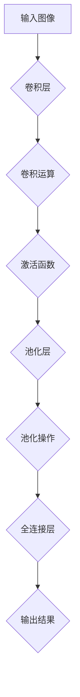

                 

# 卷积神经网络CNN的原理、经典架构与在图像识别中的应用

## 关键词：卷积神经网络（CNN）、图像识别、深度学习、神经网络架构、算法原理、数学模型、实战案例

## 摘要：
本文将深入探讨卷积神经网络（CNN）的原理、经典架构以及其在图像识别领域的应用。通过逐步分析推理，我们将揭示CNN如何通过其独特的结构和工作机制，在图像处理和识别中取得了显著的成效。本文旨在为读者提供一个全面且易于理解的指南，帮助他们掌握CNN的核心概念、数学基础以及实际应用。

## 1. 背景介绍

### 1.1 卷积神经网络的发展历程
卷积神经网络（Convolutional Neural Network，CNN）是深度学习领域中的一种重要模型，起源于1980年代。最初，CNN被用于模式识别和图像处理任务。随着计算能力的提升和大数据的涌现，CNN在图像识别、目标检测和视频分析等领域取得了显著进展。特别是在2012年，由Alex Krizhevsky等人提出的AlexNet在ImageNet图像识别挑战赛中取得了突破性成绩，这标志着CNN进入了一个新的发展阶段。

### 1.2 图像识别的挑战
图像识别是计算机视觉领域中的一个核心问题，其挑战在于如何从图像中提取有用的信息，并对其进行分类。传统的图像识别方法，如SIFT和HOG等，通常依赖于手工设计的特征，这种方法具有一定的局限性。深度学习技术的发展，特别是CNN的出现，为图像识别带来了新的机遇。CNN通过其特有的层次结构和非线性变换，能够自动学习图像中的高层次特征，从而在图像识别任务中取得了优异的性能。

### 1.3 CNN在图像识别中的应用
CNN在图像识别中具有广泛的应用。例如，在人脸识别、物体检测和图像分类等任务中，CNN都能够发挥重要作用。通过训练大量的参数，CNN能够识别出图像中的复杂模式，从而实现高度自动化的图像分析。

## 2. 核心概念与联系

### 2.1 神经网络基础
神经网络是一种模拟生物神经系统的计算模型。在神经网络中，信息通过一系列的神经元进行传递和处理。每个神经元都与多个其他神经元相连，并通过对输入信号进行加权求和，然后通过激活函数进行非线性变换，从而产生输出。

### 2.2 卷积运算
卷积运算是一种特殊的线性运算，常用于图像处理和特征提取。在CNN中，卷积层通过卷积运算从输入图像中提取特征。卷积运算的核心在于通过滑动窗口（也称为卷积核或滤波器）在图像上滑动，并与窗口内的像素值进行点积运算。这个过程中，窗口的大小、步长和滤波器的参数都是可调的。

### 2.3 池化操作
池化操作是CNN中的一种降维操作，通常用于减少数据的维度和计算复杂度。池化操作通过在一个区域内的像素值进行最大值或平均值运算，从而生成一个较小的特征图。池化操作有助于增强网络的鲁棒性，并减少过拟合的风险。

### 2.4 Mermaid流程图
以下是CNN核心概念与联系的Mermaid流程图：



## 3. 核心算法原理 & 具体操作步骤

### 3.1 卷积层的原理与操作步骤
卷积层是CNN的核心组件，负责从输入图像中提取特征。具体操作步骤如下：

1. **初始化卷积核参数**：卷积层的参数包括卷积核（滤波器）的权重和偏置。通常，这些参数通过随机初始化。
2. **卷积运算**：将卷积核在输入图像上滑动，并与窗口内的像素值进行点积运算。每个卷积核提取图像中的一部分特征。
3. **应用激活函数**：通过激活函数（如ReLU）对卷积运算的结果进行非线性变换，增强模型的表达能力。
4. **生成特征图**：卷积运算的结果形成一个特征图，特征图的尺寸取决于卷积核的大小、步长和输入图像的尺寸。

### 3.2 池化层的原理与操作步骤
池化层用于减少特征图的尺寸，具体操作步骤如下：

1. **选择池化方式**：常见的池化方式有最大池化和平均池化。
2. **定义窗口大小和步长**：窗口大小和步长决定了池化操作的覆盖范围和步进方式。
3. **执行池化操作**：在每个窗口内选择最大值或平均值，生成新的特征图。

### 3.3 全连接层的原理与操作步骤
全连接层用于将特征图转换为最终输出，具体操作步骤如下：

1. **初始化权重和偏置**：全连接层的权重和偏置通过随机初始化。
2. **计算输出**：将特征图的所有像素值展平成一维向量，与全连接层的权重进行矩阵乘法，然后加上偏置项。
3. **应用激活函数**：通过激活函数（如softmax）对输出结果进行分类。

## 4. 数学模型和公式 & 详细讲解 & 举例说明

### 4.1 卷积运算的数学模型

卷积运算的数学模型可以表示为：

$$
(C_{ij}^{(l)}) = \sum_{k=1}^{K} w_{ik}^{(l)} C_{kj}^{(l-1)} + b_{j}^{(l)}
$$

其中，$C_{ij}^{(l)}$ 表示第$l$层的第$i$个卷积核在第$j$个位置的特征值，$w_{ik}^{(l)}$ 表示第$l$层的第$i$个卷积核的第$k$个权重，$C_{kj}^{(l-1)}$ 表示第$l-1$层的第$k$个特征图在第$j$个位置的特征值，$b_{j}^{(l)}$ 表示第$l$层的第$j$个偏置。

### 4.2 激活函数的数学模型

常见的激活函数有ReLU、Sigmoid和softmax等。以ReLU为例，其数学模型为：

$$
a_i^{(l)} = \max(0, z_i^{(l)})
$$

其中，$a_i^{(l)}$ 表示第$l$层的第$i$个神经元的激活值，$z_i^{(l)}$ 表示第$l$层的第$i$个神经元的输入值。

### 4.3 全连接层的数学模型

全连接层的数学模型可以表示为：

$$
y_i^{(l)} = \sum_{j=1}^{n} w_{ij}^{(l)} a_j^{(l-1)} + b_i^{(l)}
$$

其中，$y_i^{(l)}$ 表示第$l$层的第$i$个神经元的输出值，$w_{ij}^{(l)}$ 表示第$l$层的第$i$个神经元的权重，$a_j^{(l-1)}$ 表示第$l-1$层的第$j$个神经元的输出值，$b_i^{(l)}$ 表示第$l$层的第$i$个神经元的偏置。

### 4.4 举例说明

假设我们有一个2x2的输入图像，通过一个3x3的卷积核进行卷积运算，激活函数为ReLU。以下是具体的操作步骤：

1. **初始化卷积核和偏置**：

   $$
   w_1 = \begin{bmatrix}
   1 & 0 \\
   1 & 0
   \end{bmatrix}, \quad b_1 = 0
   $$
   
   $$
   w_2 = \begin{bmatrix}
   0 & 1 \\
   0 & 1
   \end{bmatrix}, \quad b_2 = 0
   $$

2. **卷积运算**：

   $$
   C_1 = \begin{bmatrix}
   1 & 0 \\
   1 & 0
   \end{bmatrix} \cdot \begin{bmatrix}
   1 & 1 \\
   0 & 0
   \end{bmatrix} + 0 = \begin{bmatrix}
   1 & 1 \\
   1 & 1
   \end{bmatrix}
   $$

   $$
   C_2 = \begin{bmatrix}
   0 & 1 \\
   0 & 1
   \end{bmatrix} \cdot \begin{bmatrix}
   1 & 1 \\
   0 & 0
   \end{bmatrix} + 0 = \begin{bmatrix}
   0 & 0 \\
   0 & 0
   \end{bmatrix}
   $$

3. **应用激活函数ReLU**：

   $$
   C_1' = \begin{bmatrix}
   1 & 1 \\
   1 & 1
   \end{bmatrix}, \quad C_2' = \begin{bmatrix}
   0 & 0 \\
   0 & 0
   \end{bmatrix}
   $$

## 5. 项目实战：代码实际案例和详细解释说明

### 5.1 开发环境搭建

在开始实战之前，我们需要搭建一个合适的开发环境。这里，我们使用Python和TensorFlow作为主要的编程语言和深度学习框架。

1. 安装Python：

   $$
   pip install python
   $$

2. 安装TensorFlow：

   $$
   pip install tensorflow
   $$

### 5.2 源代码详细实现和代码解读

以下是使用TensorFlow实现一个简单的CNN模型的代码示例：

```python
import tensorflow as tf
from tensorflow.keras import datasets, layers, models

# 加载和预处理数据
(train_images, train_labels), (test_images, test_labels) = datasets.cifar10.load_data()
train_images, test_images = train_images / 255.0, test_images / 255.0

# 构建CNN模型
model = models.Sequential()
model.add(layers.Conv2D(32, (3, 3), activation='relu', input_shape=(32, 32, 3)))
model.add(layers.MaxPooling2D((2, 2)))
model.add(layers.Conv2D(64, (3, 3), activation='relu'))
model.add(layers.MaxPooling2D((2, 2)))
model.add(layers.Conv2D(64, (3, 3), activation='relu'))
model.add(layers.Flatten())
model.add(layers.Dense(64, activation='relu'))
model.add(layers.Dense(10, activation='softmax'))

# 编译模型
model.compile(optimizer='adam',
              loss='sparse_categorical_crossentropy',
              metrics=['accuracy'])

# 训练模型
model.fit(train_images, train_labels, epochs=10, batch_size=64)

# 评估模型
test_loss, test_acc = model.evaluate(test_images, test_labels)
print(f'Test accuracy: {test_acc}')
```

### 5.3 代码解读与分析

1. **加载和预处理数据**：

   ```python
   (train_images, train_labels), (test_images, test_labels) = datasets.cifar10.load_data()
   train_images, test_images = train_images / 255.0, test_images / 255.0
   ```

   这段代码首先加载CIFAR-10数据集，并进行归一化处理，将图像的像素值范围从0到255缩放到0到1。

2. **构建CNN模型**：

   ```python
   model = models.Sequential()
   model.add(layers.Conv2D(32, (3, 3), activation='relu', input_shape=(32, 32, 3)))
   model.add(layers.MaxPooling2D((2, 2)))
   model.add(layers.Conv2D(64, (3, 3), activation='relu'))
   model.add(layers.MaxPooling2D((2, 2)))
   model.add(layers.Conv2D(64, (3, 3), activation='relu'))
   model.add(layers.Flatten())
   model.add(layers.Dense(64, activation='relu'))
   model.add(layers.Dense(10, activation='softmax'))
   ```

   这段代码构建了一个简单的CNN模型。模型包括两个卷积层，每个卷积层后接一个最大池化层，然后是一个全连接层。最后，通过softmax层进行分类。

3. **编译模型**：

   ```python
   model.compile(optimizer='adam',
                 loss='sparse_categorical_crossentropy',
                 metrics=['accuracy'])
   ```

   这段代码编译了模型，指定了优化器、损失函数和评价指标。

4. **训练模型**：

   ```python
   model.fit(train_images, train_labels, epochs=10, batch_size=64)
   ```

   这段代码使用训练数据训练模型，指定了训练轮数和批量大小。

5. **评估模型**：

   ```python
   test_loss, test_acc = model.evaluate(test_images, test_labels)
   print(f'Test accuracy: {test_acc}')
   ```

   这段代码使用测试数据评估模型，并打印测试准确率。

## 6. 实际应用场景

### 6.1 人脸识别
人脸识别是CNN在图像识别领域的典型应用之一。通过训练大量的参数，CNN能够从图像中准确识别出人脸。在实际应用中，人脸识别被广泛应用于安全系统、社交媒体和智能手机等场景。

### 6.2 物体检测
物体检测是另一个重要的应用场景。CNN通过检测图像中的物体边界，实现实时物体识别。例如，自动驾驶汽车使用CNN进行道路和交通标志的检测，以提高驾驶安全性。

### 6.3 图像分类
图像分类是CNN的另一个核心应用。通过训练模型，CNN能够将图像分类到不同的类别。例如，在医疗领域，CNN可以用于病理图像的分类，辅助医生进行疾病诊断。

## 7. 工具和资源推荐

### 7.1 学习资源推荐

- **书籍**：
  - 《深度学习》（Goodfellow, Bengio, Courville）
  - 《Python深度学习》（François Chollet）
- **论文**：
  - “A Comprehensive Collection of Convolutional Neural Network Architectures for Image Recognition”（Redmon et al., 2015）
- **博客**：
  - [TensorFlow官网文档](https://www.tensorflow.org/tutorials/convolutional)
  - [Keras官方文档](https://keras.io/models/convolutional/)
- **网站**：
  - [CIFAR-10数据集](https://www.cs.toronto.edu/~kriz/cifar.html)

### 7.2 开发工具框架推荐

- **深度学习框架**：
  - TensorFlow
  - Keras
  - PyTorch
- **编程语言**：
  - Python
  - R
- **机器学习库**：
  - scikit-learn
  - Pandas

### 7.3 相关论文著作推荐

- **论文**：
  - “LeNet: Convolutional Neural Networks for Handwritten Digit Recognition”（LeCun et al., 1998）
  - “AlexNet: Image Classification with Deep Convolutional Neural Networks”（Krizhevsky et al., 2012）
  - “Very Deep Convolutional Networks for Large-Scale Image Recognition”（Simonyan & Zisserman, 2014）
- **著作**：
  - 《深度学习》（Goodfellow, Bengio, Courville）

## 8. 总结：未来发展趋势与挑战

### 8.1 发展趋势

- **模型压缩**：随着计算资源的限制，模型压缩和加速成为未来研究的重要方向。压缩模型能够减少存储和计算需求，从而提高CNN的应用效率。
- **迁移学习**：迁移学习是利用预训练模型在新任务上快速获得良好性能的方法。未来，迁移学习将有助于减少模型训练时间和计算成本。
- **自适应学习**：自适应学习是CNN的一个新兴研究方向，旨在使模型能够根据不同的数据分布和任务需求自动调整学习策略。

### 8.2 挑战

- **数据隐私**：随着深度学习在各个领域的应用，数据隐私问题日益突出。如何保护用户隐私，确保数据安全，是未来需要关注的重要问题。
- **模型解释性**：深度学习模型通常被认为是“黑箱”，其内部工作机制不透明。提高模型的可解释性，使其能够被用户理解和信任，是一个重要挑战。
- **泛化能力**：深度学习模型容易在训练数据上过拟合，泛化能力较弱。如何提高模型的泛化能力，使其能够适应不同的数据分布和任务，是一个亟待解决的问题。

## 9. 附录：常见问题与解答

### 9.1 问题1：什么是卷积神经网络（CNN）？
卷积神经网络（CNN）是一种深度学习模型，专门用于处理具有网格结构的数据，如图像和语音。CNN通过卷积层、池化层和全连接层等结构，自动学习数据中的特征，并在图像识别、目标检测等任务中表现出色。

### 9.2 问题2：CNN如何工作？
CNN通过卷积层从输入图像中提取特征，并通过池化层减小数据维度。然后，特征通过全连接层进行分类。在整个过程中，模型通过反向传播算法不断调整参数，优化模型性能。

### 9.3 问题3：CNN在图像识别中有哪些应用？
CNN在图像识别中具有广泛的应用，如人脸识别、物体检测、图像分类等。通过训练大量的参数，CNN能够识别图像中的复杂模式，实现高度自动化的图像分析。

## 10. 扩展阅读 & 参考资料

- **扩展阅读**：
  - 《卷积神经网络：原理、实践与算法》（于金才）
  - 《深度学习实战：基于Python的应用》（Aurélien Géron）
- **参考资料**：
  - [CIFAR-10数据集](https://www.cs.toronto.edu/~kriz/cifar.html)
  - [TensorFlow官网](https://www.tensorflow.org/)
  - [Keras官方文档](https://keras.io/)
  - [PyTorch官网](https://pytorch.org/)

### 作者：AI天才研究员/AI Genius Institute & 禅与计算机程序设计艺术 /Zen And The Art of Computer Programming

