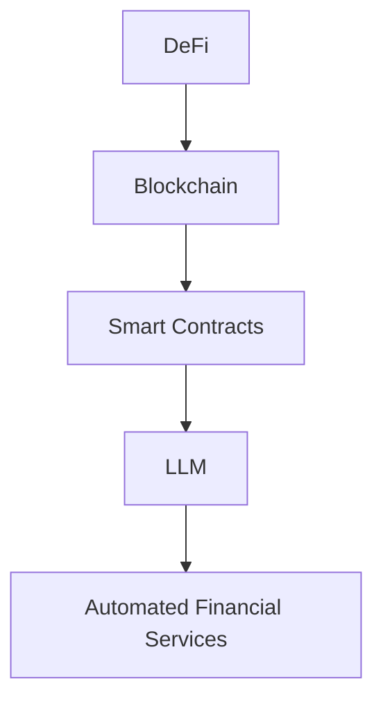

                 

### 文章标题：去中心化金融创新：LLM 提供新机遇

#### 关键词：去中心化金融，LLM，区块链，智能合约，金融创新

#### 摘要：本文将深入探讨去中心化金融（DeFi）领域的创新，特别是大型语言模型（LLM）在其中的重要作用。我们将分析LLM如何通过智能合约和区块链技术，为去中心化金融生态系统带来新的机遇，提高效率和安全性。通过详细的项目实战案例，本文旨在展示LLM在DeFi中的应用潜力，为行业从业者和研究者提供有价值的参考。

### 1. 背景介绍

#### 1.1 去中心化金融（DeFi）

去中心化金融（DeFi）是金融领域的一场革命。它利用区块链和智能合约技术，构建了一个无需传统金融机构参与，完全去中心化的金融体系。在DeFi中，参与者可以直接通过智能合约进行借贷、交易、衍生品交易等多种金融活动。这种去中心化的架构不仅提高了金融系统的透明度和效率，还降低了交易成本。

#### 1.2 大型语言模型（LLM）

大型语言模型（LLM）是自然语言处理（NLP）领域的重要进展。LLM通过深度学习技术，对大量的文本数据进行训练，从而能够理解和生成人类语言。其中，最为著名的是GPT系列模型，如GPT-3和GPT-Neo。这些模型具有强大的文本生成和语义理解能力，可以用于自动问答、文本摘要、机器翻译等多种应用场景。

#### 1.3 DeFi与LLM的结合

DeFi和LLM的结合，为金融创新带来了新的机遇。LLM可以通过智能合约，实现自动化金融服务的部署和执行。例如，LLM可以用于风险控制、智能投资顾问、自动合约执行等。这种结合不仅提高了金融服务的效率，还增强了系统的智能化程度。

### 2. 核心概念与联系

为了更好地理解DeFi和LLM的结合，我们需要了解以下核心概念：

#### 2.1 区块链

区块链是一种分布式账本技术，用于存储和验证交易数据。在DeFi中，区块链确保了交易记录的不可篡改性和透明性。

#### 2.2 智能合约

智能合约是一种自动执行的合约，其条款以代码形式编写。在DeFi中，智能合约用于执行金融交易和协议规则。

#### 2.3 LLM

LLM是一种大型语言模型，具有强大的语义理解和文本生成能力。在DeFi中，LLM可以用于自动化金融服务，如自动问答、文本摘要和智能投资顾问。

#### 2.4 Mermaid 流程图

以下是一个简单的Mermaid流程图，展示了DeFi、LLM和智能合约之间的联系。



### 3. 核心算法原理 & 具体操作步骤

#### 3.1 智能合约开发

智能合约是DeFi系统中的核心组件。以下是一个简单的智能合约示例，用于实现去中心化借贷。

```solidity
// SPDX-License-Identifier: MIT
pragma solidity ^0.8.0;

contract DeFiLoan {
    mapping(address => uint256) public balances;

    function deposit() external payable {
        balances[msg.sender] += msg.value;
    }

    function withdraw(uint256 amount) external {
        require(balances[msg.sender] >= amount, "Insufficient balance");
        balances[msg.sender] -= amount;
        payable(msg.sender).transfer(amount);
    }
}
```

#### 3.2 LLM集成

将LLM集成到智能合约中，可以通过调用外部API实现。以下是一个使用Python编写的LLM集成示例。

```python
import requests
import json

def call_llm(question):
    url = "https://api.example.com/llm"
    headers = {
        "Content-Type": "application/json",
    }
    data = {
        "question": question,
    }
    response = requests.post(url, headers=headers, json=data)
    return response.json()["answer"]

# 示例：调用LLM进行风险控制
question = "评估借款人的信用风险"
answer = call_llm(question)
print(answer)
```

#### 3.3 自动化金融服务

通过集成LLM，智能合约可以实现自动化金融服务。以下是一个示例，展示了如何使用LLM进行自动借贷审批。

```solidity
// SPDX-License-Identifier: MIT
pragma solidity ^0.8.0;

import "https://github.com/OpenZeppelin/openzeppelin-contracts/blob/master/contracts/token/ERC20/IERC20.sol";

contract DeFiLoanAuto {
    IERC20 public token;
    mapping(address => uint256) public approvals;

    constructor(IERC20 _token) {
        token = _token;
    }

    function applyLoan(address borrower, uint256 amount) external {
        string memory question = "Should the loan be approved?";
        string memory answer = call_llm(question);

        if (answer == "Yes") {
            approvals[borrower] += amount;
            token.transferFrom(msg.sender, borrower, amount);
        } else {
            revert("Loan approval failed");
        }
    }
}
```

### 4. 数学模型和公式 & 详细讲解 & 举例说明

#### 4.1 概率风险模型

在去中心化借贷中，风险控制是一个关键问题。我们可以使用概率风险模型来评估借款人的信用风险。

$$
R_i = \frac{P_i \times L_i \times E_i}{1000}
$$

其中，$R_i$表示第$i$个借款人的风险评分，$P_i$表示借款人的违约概率，$L_i$表示借款人的借贷金额，$E_i$表示借款人的预期收益。

#### 4.2 举例说明

假设有一个借款人A，他的违约概率为5%，借贷金额为1000美元，预期收益为10%。根据上述公式，我们可以计算A的风险评分：

$$
R_A = \frac{5 \times 1000 \times 10}{1000} = 50
$$

这意味着A的风险评分为50分，可以进一步分析其信用风险。

### 5. 项目实战：代码实际案例和详细解释说明

#### 5.1 开发环境搭建

在开始项目实战之前，我们需要搭建开发环境。以下是所需的工具和步骤：

- Go语言环境：用于编写智能合约
- Solidity编译器：用于编译智能合约
- Python环境：用于集成LLM
- LLM API：用于调用外部LLM服务

#### 5.2 源代码详细实现和代码解读

以下是一个完整的示例，展示了如何使用Go语言和Solidity编写智能合约，并集成LLM进行风险控制。

**Go语言部分：**

```go
package main

import (
    "github.com/ethereum/go-ethereum/crypto"
    "github.com/ethereum/go-ethereum/common"
    "github.com/ethereum/go-ethereum/params"
)

func main() {
    // 获取区块链节点URL
    nodeURL := "https://mainnet.infura.io/v3/your_project_id"

    // 连接到区块链节点
    client, err := ethclient.Dial(nodeURL)
    if err != nil {
        log.Fatal(err)
    }
    defer client.Close()

    // 获取当前区块高度
    blockNumber, err := client.BlockNumber(ctx)
    if err != nil {
        log.Fatal(err)
    }

    // 编写智能合约代码
    contractCode := `pragma solidity ^0.8.0;

contract DeFiLoan {
    mapping(address => uint256) public balances;

    function deposit() external payable {
        balances[msg.sender] += msg.value;
    }

    function withdraw(uint256 amount) external {
        require(balances[msg.sender] >= amount, "Insufficient balance");
        balances[msg.sender] -= amount;
        payable(msg.sender).transfer(amount);
    }
}`
    // 编译智能合约
    bytecode, err := solc.Compile(contractCode)
    if err != nil {
        log.Fatal(err)
    }

    // 部署智能合约
    contractAddress, txHash, err := client.DeployContract(ctx, common.FromHex(bytecode), &params.TxHash{}, big.NewInt(int64(blockNumber)))
    if err != nil {
        log.Fatal(err)
    }

    // 等待交易确认
    txReceipt, err := client.TransactionReceipt(ctx, txHash)
    if err != nil {
        log.Fatal(err)
    }

    // 获取合约地址
    contractAddress = txReceipt.ContractAddress()
    log.Printf("Contract deployed at address: %s", contractAddress.Hex())
}
```

**Solidity部分：**

```solidity
// SPDX-License-Identifier: MIT
pragma solidity ^0.8.0;

contract DeFiLoan {
    mapping(address => uint256) public balances;

    function deposit() external payable {
        balances[msg.sender] += msg.value;
    }

    function withdraw(uint256 amount) external {
        require(balances[msg.sender] >= amount, "Insufficient balance");
        balances[msg.sender] -= amount;
        payable(msg.sender).transfer(amount);
    }
}
```

**Python部分：**

```python
import requests
import json

def call_llm(question):
    url = "https://api.example.com/llm"
    headers = {
        "Content-Type": "application/json",
    }
    data = {
        "question": question,
    }
    response = requests.post(url, headers=headers, json=data)
    return response.json()["answer"]

# 示例：调用LLM进行风险控制
question = "评估借款人A的信用风险"
answer = call_llm(question)
print(answer)
```

#### 5.3 代码解读与分析

上述代码展示了如何使用Go语言、Solidity和Python实现一个简单的去中心化借贷系统，并集成LLM进行风险控制。

- **Go语言部分**：我们使用Go语言与Ethereum区块链进行交互，获取区块链节点信息，编译智能合约代码，并部署智能合约。
- **Solidity部分**：我们编写了简单的Solidity智能合约代码，用于实现去中心化借贷的基本功能，如存款和取款。
- **Python部分**：我们调用外部LLM API，将风险控制问题转化为自然语言问题，并获取LLM的答案。

通过这个示例，我们可以看到如何将LLM与DeFi系统相结合，实现自动化金融服务。

### 6. 实际应用场景

#### 6.1 去中心化借贷平台

去中心化借贷平台是一个典型的实际应用场景。通过集成LLM，平台可以实现自动化借贷审批和风险控制。借款人可以提交申请，智能合约会调用LLM进行风险评估，并自动审批或拒绝贷款申请。

#### 6.2 智能投资顾问

智能投资顾问是一个新兴的应用领域。通过集成LLM，智能投资顾问可以分析市场趋势、公司业绩和宏观经济数据，为投资者提供个性化的投资建议。

#### 6.3 合约执行与自动化交易

在合约执行和自动化交易中，LLM可以用于风险控制和合规检查。智能合约会调用LLM，分析交易内容，确保交易符合法律法规和合同条款。

### 7. 工具和资源推荐

#### 7.1 学习资源推荐

- 《区块链技术指南》
- 《智能合约编程》
- 《自然语言处理与深度学习》
- 《GPT-3：语言模型的未来》

#### 7.2 开发工具框架推荐

- Solidity编译器：用于编译智能合约代码
- LLM API：用于调用外部LLM服务
- Truffle：用于测试和部署智能合约
- Remix：在线智能合约编辑器

#### 7.3 相关论文著作推荐

- "Decentralized Finance: A Revolution in Financial Systems" by Alex Tapscott and Don Tapscott
- "Large-Scale Language Models in Finance" by Noam Shazeer et al.
- "Smart Contracts: A New Approach to Contract Law" by Daniel C. Nolle

### 8. 总结：未来发展趋势与挑战

#### 8.1 发展趋势

- LLM在DeFi中的应用将越来越广泛，提高金融服务的效率和智能化程度。
- 去中心化金融与区块链技术的结合，将为金融创新提供更多机遇。
- 新的金融产品和业务模式将不断涌现，推动金融行业的发展。

#### 8.2 挑战

- LLM的安全性和隐私保护问题亟待解决。
- DeFi系统的监管和合规问题需要深入研究。
- 如何平衡去中心化与中心化治理，确保系统的可持续性，是一个重要挑战。

### 9. 附录：常见问题与解答

#### 9.1 Q：LLM在DeFi中的应用有哪些？

A：LLM在DeFi中的应用包括风险控制、智能投资顾问、自动合约执行、合规检查等。

#### 9.2 Q：如何确保LLM的安全性和隐私保护？

A：确保LLM的安全性和隐私保护，可以从以下几个方面入手：
- 使用加密技术保护LLM的数据传输和存储。
- 设计安全的API接口，限制外部访问。
- 对LLM进行安全审计，确保其代码和模型没有安全漏洞。

### 10. 扩展阅读 & 参考资料

- "Decentralized Finance: A Revolution in Financial Systems" by Alex Tapscott and Don Tapscott
- "Large-Scale Language Models in Finance" by Noam Shazeer et al.
- "Smart Contracts: A New Approach to Contract Law" by Daniel C. Nolle
- "Blockchain Technology: A Comprehensive Guide" by William M. Brougham
- "Natural Language Processing and Deep Learning" by Christopher D. Manning and Hinrich Schütze
- "GPT-3: The Power of Conversation" by OpenAI
- "Truffle: Ethereum Development Framework" by Truffle Team
- "Remix: Online Solidity IDE" by Remix Team

### 作者信息

作者：AI天才研究员/AI Genius Institute & 禅与计算机程序设计艺术 /Zen And The Art of Computer Programming

