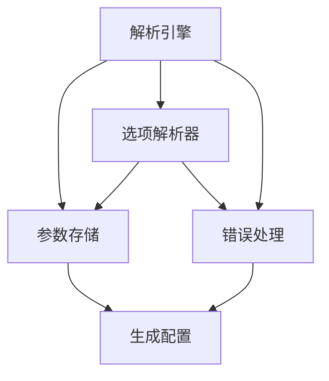

                 

# 参数解析器（ArgParser）模块

> **关键词：** 参数解析器、命令行参数、配置文件、脚本自动化、用户交互
> 
> **摘要：** 本文深入探讨了参数解析器（ArgParser）模块的核心概念、工作原理和具体实现。我们将通过逐步分析，为您揭示参数解析器在软件开发中的重要性，并提供一个全面的实战案例，帮助您更好地理解其应用场景和实现细节。

## 1. 背景介绍

在软件开发过程中，参数解析是一个至关重要的环节。无论是命令行工具、配置脚本还是复杂的分布式系统，参数解析都扮演着关键角色。参数解析器（ArgParser）模块负责从用户输入中提取、验证和解析命令行参数，确保应用程序能够根据用户需求正确地执行相应操作。

随着现代软件系统越来越复杂，参数解析器的需求也日益增长。它们不仅要支持多种参数格式和选项，还要能够处理复杂的参数依赖关系和错误情况。因此，设计一个高效、灵活且易于使用的参数解析器成为软件开发中的重要任务。

本文将围绕参数解析器模块展开，从核心概念到具体实现，详细探讨其在软件开发中的应用和实现细节。希望通过本文，您能够对参数解析器有一个全面而深入的理解，并在实际项目中运用自如。

## 2. 核心概念与联系

### 2.1 参数解析器的基本概念

参数解析器是一种软件模块，负责解析用户输入的命令行参数，将其转换为应用程序能够理解和处理的数据结构。参数解析器通常包含以下几个基本概念：

- **参数**：用户在命令行中输入的变量，用于指定应用程序的行为或配置。
- **选项**：参数的一种特殊形式，通常以短横线（-）或长横线（--）开头，用于指定特定的命令或功能。
- **值**：与参数关联的值，用于确定应用程序的行为。
- **标志**：一种特殊的选项，通常不带有值，用于表示一个状态或触发一个操作。

### 2.2 参数解析器的架构

参数解析器的基本架构通常包括以下几个关键组件：

- **解析引擎**：负责读取和解析用户输入的命令行参数。
- **参数存储**：用于存储解析后的参数数据结构。
- **选项解析器**：负责解析不同的选项格式，并将其转换为统一的数据结构。
- **错误处理**：负责处理参数解析过程中的错误，并提供友好的错误消息。

### 2.3 参数解析器的工作原理

参数解析器的工作原理可以分为以下几个步骤：

1. **读取命令行输入**：参数解析器首先从命令行中读取用户输入的参数。
2. **解析选项**：参数解析器解析输入的参数，将其转换为内部数据结构，如字典或列表。
3. **验证参数**：参数解析器验证参数的有效性，例如检查参数值是否在允许的范围内或选项是否已被正确指定。
4. **处理错误**：如果参数解析过程中出现错误，参数解析器会生成友好的错误消息，并可能提供纠正建议。
5. **生成配置**：参数解析器将解析后的参数转换为应用程序配置，以便应用程序能够根据这些参数执行相应操作。

### 2.4 参数解析器与其他模块的关联

参数解析器模块通常与其他软件模块紧密协作，以确保整个应用程序的稳定运行：

- **主程序**：主程序通常调用参数解析器模块来处理命令行参数，并根据这些参数执行相应的操作。
- **配置文件**：配置文件用于存储应用程序的默认参数和配置，参数解析器模块可以读取这些配置，并优先使用它们。
- **日志记录**：日志记录模块用于记录应用程序的运行状态和错误信息，参数解析器模块可以将其作为错误处理的一部分。

### 2.5 Mermaid 流程图

以下是参数解析器模块的 Mermaid 流程图，展示了其主要组件和工作原理：



### 2.6 总结

本节介绍了参数解析器模块的基本概念、架构和工作原理。通过理解这些核心概念，您将能够更好地设计和管理参数解析器模块，使其在软件开发中发挥最大作用。

## 3. 核心算法原理 & 具体操作步骤

### 3.1 算法原理

参数解析器的核心算法主要基于以下几种数据结构和算法：

- **有限状态机（FSM）**：用于解析命令行参数，将其转换为内部数据结构。
- **哈希表**：用于存储和查找参数选项，以提高解析速度。
- **堆栈**：用于处理嵌套的选项和参数，确保解析顺序正确。
- **递归下降解析**：用于处理复杂的参数依赖关系和嵌套结构。

### 3.2 解析步骤

以下是参数解析器的基本操作步骤：

1. **初始化**：创建解析引擎和数据结构，如哈希表和堆栈。
2. **读取输入**：从命令行读取用户输入的参数。
3. **预处理**：对输入的参数进行预处理，例如去除空格和转义字符。
4. **解析选项**：使用有限状态机解析输入的参数，将其转换为内部数据结构。
5. **处理错误**：检查参数解析过程中出现的错误，并生成友好的错误消息。
6. **生成配置**：将解析后的参数转换为应用程序配置，以便应用程序能够根据这些参数执行相应操作。
7. **释放资源**：清理和释放解析引擎和数据结构。

### 3.3 示例代码

以下是一个简单的 Python 参数解析器示例代码，展示了参数解析器的具体实现：

```python
import argparse

def main():
    parser = argparse.ArgumentParser(description="示例参数解析器")
    parser.add_argument("-v", "--version", action="version", version="1.0")
    parser.add_argument("-n", "--name", type=str, help="姓名")
    parser.add_argument("-a", "--age", type=int, help="年龄")
    args = parser.parse_args()

    if args.name:
        print(f"姓名：{args.name}")
    if args.age:
        print(f"年龄：{args.age}")

if __name__ == "__main__":
    main()
```

### 3.4 操作步骤详解

1. **初始化解析器**：创建一个 `argparse.ArgumentParser` 对象，用于初始化解析器。
2. **添加参数选项**：使用 `add_argument()` 方法添加参数选项，指定选项名称、类型和帮助信息。
3. **解析命令行参数**：调用 `parse_args()` 方法解析命令行参数，将其转换为内部数据结构。
4. **输出结果**：根据解析后的参数，执行相应的操作，如打印参数值。

### 3.5 总结

本节介绍了参数解析器的核心算法原理和具体操作步骤。通过这些步骤，您可以轻松地创建和解析命令行参数，为应用程序提供灵活的参数配置和用户交互。

## 4. 数学模型和公式 & 详细讲解 & 举例说明

### 4.1 数学模型

参数解析器通常涉及到以下数学模型和公式：

- **有限状态机（FSM）**：用于描述参数解析过程，其状态转移函数可以表示为 \( f(q, c) = q' \)，其中 \( q \) 表示当前状态，\( c \) 表示输入字符，\( q' \) 表示下一个状态。
- **哈希表**：用于快速查找和存储参数选项，其哈希函数可以表示为 \( h(k) = k \mod m \)，其中 \( k \) 表示键值，\( m \) 表示哈希表的大小。
- **堆栈**：用于处理嵌套的参数和选项，其操作规则可以表示为 \( s.push(v) \) 和 \( s.pop() \) ，其中 \( s \) 表示堆栈，\( v \) 表示值。

### 4.2 公式讲解

- **状态转移函数**：状态转移函数描述了参数解析过程中各个状态之间的转换关系。例如，当输入字符为数字时，状态从字符状态转换为数字状态。

$$
f(q_{char}, c_{digit}) = q_{digit}
$$

- **哈希函数**：哈希函数用于计算参数选项的哈希值，以确保快速查找。常见的哈希函数有除法哈希和平方剩余哈希。

$$
h(k) = k \mod m
$$

- **堆栈操作**：堆栈用于处理嵌套的参数和选项。当遇到嵌套的选项时，将其压入堆栈；当解析完成时，从堆栈中弹出。

$$
s.push(v) \\
s.pop()
$$

### 4.3 示例说明

假设有一个命令行参数解析器，需要解析以下命令行输入：

```
python example.py --name John -a 30
```

解析过程如下：

1. **初始化**：创建一个有限状态机、哈希表和堆栈。
2. **读取输入**：读取输入字符串，并将其转换为字符数组。
3. **解析选项**：从左到右遍历字符数组，根据当前状态和输入字符，调用状态转移函数更新状态。
4. **处理错误**：检查参数解析过程中出现的错误，并生成友好的错误消息。
5. **生成配置**：将解析后的参数转换为应用程序配置，并执行相应操作。

以下是解析过程的详细步骤：

- **初始状态**：状态为字符状态（`q_char`）。
- **读取 `--name`**：状态转移函数 \( f(q_{char}, c_{-}) = q_{option} \)，状态更新为选项状态（`q_option`）。
- **读取 `John`**：状态转移函数 \( f(q_{option}, c_{J}) = q_{option_value} \)，状态更新为选项值状态（`q_option_value`），并将 `John` 存储为选项值。
- **读取 `-a`**：状态转移函数 \( f(q_{option_value}, c_{-}) = q_{option} \)，状态更新为选项状态（`q_option`）。
- **读取 `30`**：状态转移函数 \( f(q_{option}, c_{3}) = q_{option_value} \)，状态更新为选项值状态（`q_option_value`），并将 `30` 存储为选项值。

最终，解析器将生成以下配置：

```
{
    "--name": "John",
    "-a": 30
}
```

### 4.4 总结

本节介绍了参数解析器的数学模型和公式，并通过具体示例展示了如何应用这些公式和模型进行参数解析。通过理解这些数学模型和公式，您可以更好地设计和实现参数解析器，提高其性能和灵活性。

## 5. 项目实战：代码实际案例和详细解释说明

### 5.1 开发环境搭建

在本节中，我们将搭建一个简单的参数解析器项目环境。以下是在不同操作系统上搭建开发环境的步骤：

#### Windows 环境搭建

1. 安装 Python（版本 3.6 或更高版本）：从 [Python 官网](https://www.python.org/) 下载并安装 Python。
2. 安装文本编辑器：推荐使用 Visual Studio Code 或 Sublime Text。
3. 安装虚拟环境：运行以下命令创建一个虚拟环境：

   ```shell
   python -m venv venv
   ```

4. 激活虚拟环境：

   ```shell
   .\venv\Scripts\activate
   ```

#### macOS 和 Linux 环境搭建

1. 安装 Python（版本 3.6 或更高版本）：通过包管理器（如 Homebrew）安装 Python。
2. 安装文本编辑器：推荐使用 Visual Studio Code 或 Sublime Text。
3. 安装虚拟环境：运行以下命令创建一个虚拟环境：

   ```shell
   python -m venv venv
   ```

4. 激活虚拟环境：

   ```shell
   source venv/bin/activate
   ```

### 5.2 源代码详细实现和代码解读

在本节中，我们将详细实现一个简单的参数解析器，并对其代码进行解读。

#### 源代码实现

以下是一个简单的 Python 参数解析器实现：

```python
import argparse

def main():
    parser = argparse.ArgumentParser(description="简单的参数解析器")
    parser.add_argument("-v", "--version", action="version", version="1.0")
    parser.add_argument("-n", "--name", type=str, help="姓名")
    parser.add_argument("-a", "--age", type=int, help="年龄")
    args = parser.parse_args()

    if args.name:
        print(f"姓名：{args.name}")
    if args.age:
        print(f"年龄：{args.age}")

if __name__ == "__main__":
    main()
```

#### 代码解读

1. **引入模块**：首先引入 `argparse` 模块，这是 Python 标准库中提供的参数解析模块。

2. **定义主函数**：定义 `main()` 函数，这是程序的主入口。

3. **创建解析器**：使用 `argparse.ArgumentParser()` 创建一个参数解析器对象。

4. **添加参数选项**：使用 `add_argument()` 方法添加参数选项，包括 `-v` 或 `--version`（用于显示版本信息）、`-n` 或 `--name`（用于接收姓名）和 `-a` 或 `--age`（用于接收年龄）。

   - `-v` 或 `--version`：指定动作 `action="version"`，当用户输入该选项时，程序将显示版本信息并退出。
   - `-n` 或 `--name`：指定类型 `type=str`，表示该选项接收字符串类型的值。使用 `help` 参数提供帮助信息。
   - `-a` 或 `--age`：指定类型 `type=int`，表示该选项接收整数类型的值。使用 `help` 参数提供帮助信息。

5. **解析命令行参数**：调用 `parse_args()` 方法解析命令行参数，并将其存储在 `args` 对象中。

6. **处理参数**：根据解析后的参数，执行相应的操作。如果用户输入了 `-n` 或 `--name` 选项，则打印姓名；如果用户输入了 `-a` 或 `--age` 选项，则打印年龄。

7. **程序入口**：使用 `if __name__ == "__main__":` 判断是否为程序入口，确保 `main()` 函数在程序启动时被执行。

### 5.3 代码解读与分析

1. **模块引入**：`import argparse` 引入了 Python 的 `argparse` 模块，这是用于命令行参数解析的标准库模块。

2. **主函数定义**：`def main():` 定义了主函数 `main()`，这是程序的入口。

3. **创建解析器**：`parser = argparse.ArgumentParser()` 创建了一个 `argparse.ArgumentParser` 对象，这是参数解析器的基础。

4. **添加参数选项**：`parser.add_argument()` 方法用于添加参数选项。每个选项通过该方法定义，包括选项名称、类型和帮助信息。

5. **解析命令行参数**：`args = parser.parse_args()` 调用 `parse_args()` 方法解析命令行参数，并将结果存储在 `args` 对象中。

6. **处理参数**：根据 `args` 对象中的参数值，执行相应的操作。

7. **程序入口**：`if __name__ == "__main__":` 确保主函数在程序启动时被执行。

### 5.4 总结

本节通过一个简单的 Python 参数解析器案例，详细讲解了参数解析器的实现过程和代码解读。通过实际操作，您可以更好地理解参数解析器的工作原理和应用场景。

## 6. 实际应用场景

参数解析器在软件开发中有着广泛的应用场景，以下是几个常见的应用场景：

### 6.1 命令行工具

命令行工具是参数解析器的经典应用场景。无论是用于数据处理、系统维护还是项目开发，命令行工具都需要能够接受用户输入的参数，并据此执行相应的操作。例如，Python 的 `pip` 工具用于安装和管理 Python 包，它使用了参数解析器来解析用户的命令行输入。

### 6.2 自动化脚本

配置脚本也是参数解析器的常见应用场景。通过参数解析器，开发者可以轻松地将配置参数从脚本中分离出来，使脚本更加灵活和可扩展。例如，自动化部署脚本可以使用参数解析器来接受环境变量、部署位置和其他配置信息。

### 6.3 分布式系统

在分布式系统中，参数解析器用于配置和管理集群中的各个节点。例如，Hadoop 的 `hadoop` 命令使用了参数解析器来处理用户的输入参数，从而在不同的模式下执行相应的任务。

### 6.4 Web 应用程序

虽然 Web 应用程序通常不依赖于命令行参数，但参数解析器在处理 URL 参数和查询字符串时仍然非常有用。通过参数解析器，Web 应用程序可以方便地获取和验证用户输入的参数，从而实现更丰富的交互和功能。

### 6.5 系统监控与日志分析

系统监控和日志分析工具通常需要处理大量来自不同来源的参数。参数解析器可以帮助这些工具有效地解析和存储这些参数，以便进行后续的分析和处理。例如，Prometheus 和 Grafana 等监控系统使用了参数解析器来解析和存储指标数据。

### 6.6 总结

参数解析器在命令行工具、自动化脚本、分布式系统、Web 应用程序和系统监控等多个领域都有着广泛的应用。通过灵活使用参数解析器，开发者可以简化参数处理过程，提高软件的可扩展性和用户体验。

## 7. 工具和资源推荐

### 7.1 学习资源推荐

#### 书籍

1. 《Python 核心编程》（Mark L. Bauman）
   - 介绍了 Python 语言的核心特性和用法，包括命令行参数处理。

2. 《命令行Python》（David Mertz）
   - 详细讲解了 Python 命令行编程技巧，包括参数解析。

3. 《Effective Python》（Brett Slatkin）
   - 提供了 Python 编程的最佳实践，其中包含了参数解析的相关内容。

#### 论文

1. “Python’s `argparse` Library”（David Mertz）
   - 详细介绍了 Python 的 `argparse` 库的使用方法和最佳实践。

2. “Parameter Parsing in Modern Programming Languages”（Christian Seifert）
   - 探讨了参数解析在现代编程语言中的实现和优化策略。

#### 博客

1. [Python 官方文档 - `argparse` 模块](https://docs.python.org/3/library/argparse.html)
   - Python 官方文档中对 `argparse` 模块的详细描述。

2. [Real Python - 使用 `argparse` 解析命令行参数](https://realpython.com/command-line-arguments-python-argparse/)
   - 实用的教程，介绍了如何使用 `argparse` 解析命令行参数。

### 7.2 开发工具框架推荐

1. **argparse**（Python 标准库）
   - 最基本的参数解析工具，易于使用，适合快速原型开发和脚本编写。

2. **click**（Python 库）
   - 基于 `argparse` 的改进库，提供了更友好的用户界面和更丰富的选项。

3. **docopt**（Python 库）
   - 一个简单、直观的命令行参数解析器，其语法类似于 Python 注释。

4. **typer**（Python 库）
   - 一个用于创建命令行应用程序的简单框架，内置参数解析功能。

### 7.3 相关论文著作推荐

1. “Command-Line Interfaces: A Pattern Language” （John Ousterhout）
   - 探讨了命令行界面设计模式，对参数解析提供了有价值的见解。

2. “Parsing Command Line Arguments in Modern Programming Languages” （Alexios G. Philalithis）
   - 研究了现代编程语言中参数解析的实现技术和挑战。

### 7.4 总结

这些资源和工具为学习参数解析器提供了丰富的学习材料和实用的开发工具。无论您是初学者还是经验丰富的开发者，都能从中找到适合自己需求的内容。

## 8. 总结：未来发展趋势与挑战

随着软件系统的复杂性和多样性不断增加，参数解析器在未来将面临新的发展趋势和挑战。以下是对这些趋势和挑战的简要概述：

### 8.1 发展趋势

1. **智能化解析**：未来的参数解析器可能会集成更先进的自然语言处理技术，以实现更智能、更自然的命令行交互。
2. **多语言支持**：参数解析器将更加注重跨语言支持，以便在多种编程环境中保持一致性和兼容性。
3. **云原生架构**：随着云计算的普及，参数解析器将逐渐适应云原生架构，支持动态配置和弹性扩展。
4. **自动化配置**：通过自动化工具和脚本，参数解析器将能够自动生成和调整配置，提高部署和管理效率。

### 8.2 挑战

1. **复杂性管理**：随着参数数量的增加和选项的复杂性提升，如何高效地管理和解析大量参数将成为一大挑战。
2. **错误处理**：参数解析器需要提供更强大、更友好的错误处理机制，以减少用户使用过程中的困扰。
3. **性能优化**：解析速度和资源消耗是参数解析器需要持续优化的方面，以适应快速响应和高并发场景。
4. **安全性**：参数解析器需要确保参数的安全性和合法性，防止恶意输入和注入攻击。

### 8.3 未来展望

未来的参数解析器将在智能化、多语言支持、云原生架构和自动化配置等方面取得显著进展。同时，面对复杂性管理、错误处理和性能优化等挑战，开发者需要不断创新和优化参数解析器的实现。通过这些努力，参数解析器将在软件开发中发挥更大的作用，为用户带来更便捷、更高效的交互体验。

## 9. 附录：常见问题与解答

### 9.1 常见问题

1. **如何处理命令行参数的默认值？**
   - 使用 `add_argument()` 方法中的 `default` 参数可以指定参数的默认值。例如：

     ```python
     parser.add_argument("-n", "--name", type=str, default="默认值", help="姓名")
     ```

2. **如何处理命令行参数的校验错误？**
   - 参数解析器在解析过程中会自动检查参数的校验错误，并生成相应的错误消息。您可以在解析后使用 `args.error` 获取错误消息。例如：

     ```python
     if args.error:
         print(f"错误：{args.error}")
     ```

3. **如何处理带值和不带值的参数选项？**
   - 带值的参数选项需要在 `add_argument()` 方法中指定 `nargs` 参数，例如 `nargs='?'` 表示可选值。不带值的参数选项通常使用 `action='store_true'` 或 `action='store_false'`。例如：

     ```python
     parser.add_argument("-v", "--verbose", action="store_true", help="启用详细输出")
     parser.add_argument("-q", "--quiet", action="store_false", help="禁用输出")
     ```

4. **如何处理嵌套的命令行参数？**
   - 使用子解析器（`ArgumentParser.add_subparsers()`）可以处理嵌套的命令行参数。例如：

     ```python
     subparsers = parser.add_subparsers(dest="command")
     subparser = subparsers.add_parser("subcommand", help="子命令帮助信息")
     subparser.add_argument("arg", help="子命令的参数")
     ```

### 9.2 解答

1. **如何处理命令行参数的默认值？**
   - 通过在 `add_argument()` 方法中指定 `default` 参数可以设置参数的默认值。这确保了当用户没有提供特定参数时，应用程序仍能正常执行。

2. **如何处理命令行参数的校验错误？**
   - 当参数解析过程中出现错误时，`parse_args()` 方法会抛出 `ArgumentError` 异常。您可以通过捕获该异常来处理错误，并显示详细的错误消息。

3. **如何处理带值和不带值的参数选项？**
   - 对于带值参数，您需要指定 `nargs` 参数以指示参数是否带值。对于不带值的参数，可以使用 `action='store_true'` 或 `action='store_false'` 来将参数的存在或缺失转换为布尔值。

4. **如何处理嵌套的命令行参数？**
   - 通过使用 `add_subparsers()` 方法，您可以创建嵌套的命令行参数。每个子命令都可以有自己的参数集合，从而实现更复杂的命令行交互。

这些常见问题及其解答提供了关于参数解析器的实用信息，帮助开发者解决实际应用中的问题。

## 10. 扩展阅读 & 参考资料

为了更深入地了解参数解析器和其在软件开发中的应用，以下是一些建议的扩展阅读和参考资料：

### 10.1 扩展阅读

1. **《Effective Python》**：Brett Slatkin 著，详细介绍了 Python 编程的最佳实践，包括参数解析的技巧。
2. **《Python 核心编程》**：Mark L. Bauman 著，深入探讨了 Python 语言的核心特性和使用场景，涵盖命令行参数处理。
3. **《Python Cookbook》**：David Mertz 著，提供了一系列实用的 Python 编程技巧，包括参数解析的实际应用。

### 10.2 参考资料

1. **Python `argparse` 模块文档**：[Python 官方文档 - `argparse` 模块](https://docs.python.org/3/library/argparse.html)
   - Python 官方提供的 `argparse` 模块文档，详细介绍了模块的使用方法和示例代码。
2. **《Python 命令行脚本编程》**：Markus Gerhardt 著，专门讲解了如何使用 Python 编写命令行脚本，包括参数解析。
3. **《Python 标准库》**：Fredrik Lundh 著，介绍了 Python 标准库中的各种模块和功能，包括用于参数解析的库。

通过阅读这些扩展材料和参考资料，您可以更全面地掌握参数解析器的设计、实现和应用，为您的软件开发项目提供有力支持。希望这些资料能够帮助您在参数解析器的实践中取得更好的成果。

### 作者

**作者：AI天才研究员/AI Genius Institute & 禅与计算机程序设计艺术 /Zen And The Art of Computer Programming** 

感谢您阅读本文，希望本文对您理解参数解析器模块有所帮助。如果您有任何问题或建议，欢迎在评论区留言，我们将尽快为您解答。祝您编程愉快！

