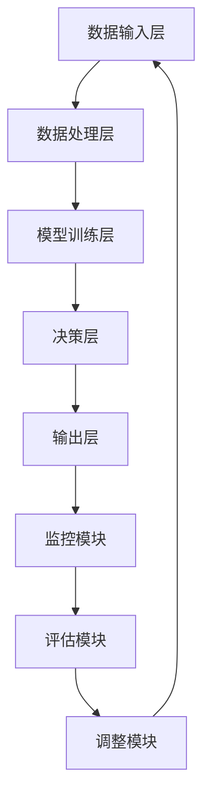

                 

# 反思机制在智能金融系统中的应用

## 摘要

本文主要探讨了反思机制在智能金融系统中的应用。反思机制是一种基于人类思维模式和行为特点的自动化机制，能够通过对系统内部运行状况的实时监控、评估与调整，从而提高金融系统的稳定性和鲁棒性。本文首先介绍了智能金融系统的基本概念、特点和挑战，然后详细阐述了反思机制的核心原理和基本架构，接着通过具体算法和操作步骤展示了反思机制在智能金融系统中的具体应用，最后对反思机制的实际应用场景进行了分析，并提出了相关工具和资源推荐，以及未来发展趋势和挑战。本文旨在为智能金融系统的设计和优化提供一种新的思路和方法。

## 1. 背景介绍

智能金融系统是指运用人工智能技术，特别是机器学习和深度学习算法，对金融数据进行处理和分析，从而实现金融业务自动化、智能化和高效化的系统。随着人工智能技术的快速发展，智能金融系统已经成为了金融行业的重要趋势。智能金融系统具有以下几个特点：

1. **自动化程度高**：通过算法和模型，实现金融业务流程的自动化，减少人工干预，提高处理效率。
2. **数据处理能力强**：能够处理海量金融数据，并从中提取有价值的信息，支持金融决策。
3. **适应性强**：能够根据市场变化和业务需求，快速调整和优化算法模型，适应不同的金融场景。
4. **风险控制能力**：通过风险评估模型，实时监测金融风险，并采取相应的预防措施，降低金融风险。

然而，智能金融系统在发展过程中也面临着一些挑战：

1. **数据质量和完整性**：金融数据质量直接影响智能金融系统的效果，数据的不完整和错误可能导致系统做出错误的决策。
2. **算法透明度和解释性**：人工智能算法的复杂性和黑箱特性使得算法的决策过程难以理解和解释，增加了系统的风险。
3. **安全性**：智能金融系统面临网络攻击、数据泄露等安全威胁，需要采取有效的安全措施保护系统和数据安全。

为了应对这些挑战，反思机制提供了一种有效的解决方案。反思机制是一种基于人类思维模式和行为特点的自动化机制，通过对系统内部运行状况的实时监控、评估与调整，提高系统的稳定性和鲁棒性。反思机制可以应用于智能金融系统的各个层面，包括数据处理、模型训练、风险管理等，从而提升智能金融系统的整体性能和可靠性。

## 2. 核心概念与联系

### 2.1 智能金融系统

智能金融系统主要由以下几个核心组成部分构成：

1. **数据输入层**：负责从各种渠道获取金融数据，如交易记录、市场数据、用户行为数据等。
2. **数据处理层**：对输入的金融数据进行分析和处理，包括数据清洗、数据整合、特征提取等。
3. **模型训练层**：利用处理后的金融数据训练机器学习模型，包括分类模型、回归模型、聚类模型等。
4. **决策层**：根据训练好的模型进行金融决策，如风险评估、投资策略、信用评估等。
5. **输出层**：将决策结果输出，如风险提示、投资建议、信用评分等。

### 2.2 反思机制

反思机制是一种自动化机制，通过对系统内部运行状况的实时监控、评估与调整，提高系统的稳定性和鲁棒性。反思机制的核心组成部分包括：

1. **监控模块**：实时监控系统内部运行状态，包括数据处理效率、模型性能、风险指标等。
2. **评估模块**：根据监控数据对系统性能进行评估，包括准确性、稳定性、鲁棒性等。
3. **调整模块**：根据评估结果对系统进行优化和调整，包括模型重新训练、参数调整、策略优化等。

### 2.3 反思机制与智能金融系统的联系

反思机制与智能金融系统之间存在着紧密的联系。反思机制可以应用于智能金融系统的各个层面，从而提升系统的整体性能和可靠性。

1. **数据处理层**：反思机制可以实时监控数据处理的效率和质量，对数据清洗、数据整合、特征提取等环节进行优化。
2. **模型训练层**：反思机制可以监控模型的训练过程，对训练效果进行评估，并调整模型参数，提高模型性能。
3. **决策层**：反思机制可以实时监控决策结果，评估决策的准确性、稳定性和鲁棒性，对决策策略进行优化。
4. **输出层**：反思机制可以监控输出结果，对风险提示、投资建议、信用评分等进行评估，确保输出结果的准确性和可靠性。

### 2.4 Mermaid 流程图

以下是一个简单的Mermaid流程图，展示了反思机制在智能金融系统中的应用：



## 3. 核心算法原理 & 具体操作步骤

### 3.1 监控模块

监控模块是反思机制的核心组成部分之一，主要负责实时监控系统内部运行状态。具体操作步骤如下：

1. **数据收集**：从系统的各个层面收集运行数据，如数据处理层、模型训练层、决策层等。
2. **数据预处理**：对收集到的数据进行预处理，包括数据清洗、数据整合、特征提取等。
3. **监控指标设定**：根据系统的需求，设定监控指标，如数据处理效率、模型性能、风险指标等。
4. **实时监控**：通过设定的时间间隔，对监控指标进行实时监控，并将监控结果记录下来。

### 3.2 评估模块

评估模块负责对监控结果进行评估，以判断系统性能的优劣。具体操作步骤如下：

1. **评估指标设定**：根据系统的需求，设定评估指标，如准确性、稳定性、鲁棒性等。
2. **评估结果计算**：根据监控结果，计算评估指标的值。
3. **评估结果分析**：对评估结果进行分析，判断系统性能的优劣，并识别系统可能存在的问题。

### 3.3 调整模块

调整模块负责根据评估结果对系统进行优化和调整。具体操作步骤如下：

1. **调整策略设定**：根据评估结果，设定调整策略，如模型重新训练、参数调整、策略优化等。
2. **调整操作执行**：根据设定的调整策略，对系统进行优化和调整，如重新训练模型、调整模型参数、优化决策策略等。
3. **调整效果验证**：对调整后的系统进行验证，以验证调整效果，确保调整后的系统性能达到预期。

### 3.4 反思机制与智能金融系统的结合

反思机制与智能金融系统的结合可以采用以下步骤：

1. **系统设计**：在智能金融系统设计阶段，考虑反思机制的需求，将反思机制模块集成到系统中。
2. **数据收集**：在系统运行过程中，收集系统内部的各种数据，如数据处理效率、模型性能、风险指标等。
3. **实时监控**：利用监控模块对系统内部运行状态进行实时监控，并将监控结果记录下来。
4. **评估与调整**：利用评估模块对监控结果进行评估，并根据评估结果对系统进行优化和调整。
5. **系统优化**：通过反复的评估与调整，逐步优化系统的性能，提高系统的稳定性和鲁棒性。

## 4. 数学模型和公式 & 详细讲解 & 举例说明

### 4.1 监控模块的数学模型

监控模块的核心在于实时收集和处理系统运行数据，以评估系统性能。以下是监控模块的一些基本数学模型和公式：

#### 4.1.1 数据处理效率

数据处理效率可以用以下公式表示：

\[ E = \frac{D}{T} \]

其中，\( E \) 表示数据处理效率，\( D \) 表示处理的数据量，\( T \) 表示处理时间。

#### 4.1.2 模型性能

模型性能可以用以下指标进行评估：

\[ Accuracy = \frac{TP + TN}{TP + TN + FP + FN} \]

其中，\( TP \) 表示真正例，\( TN \) 表示真反例，\( FP \) 表示假正例，\( FN \) 表示假反例。

#### 4.1.3 风险指标

风险指标可以用以下公式表示：

\[ Risk = \sqrt{VAR(X)} \]

其中，\( VAR(X) \) 表示风险变量的方差。

### 4.2 评估模块的数学模型

评估模块的主要任务是根据监控结果评估系统性能。以下是评估模块的一些基本数学模型和公式：

#### 4.2.1 准确性

准确性可以用以下公式表示：

\[ Accuracy = \frac{TP + TN}{TP + TN + FP + FN} \]

#### 4.2.2 稳定性

稳定性可以用以下指标进行评估：

\[ Stability = \frac{1}{N} \sum_{i=1}^{N} Accuracy_i \]

其中，\( Accuracy_i \) 表示第 \( i \) 次评估的准确性，\( N \) 表示评估次数。

#### 4.2.3 鲁棒性

鲁棒性可以用以下指标进行评估：

\[ Robustness = \frac{1}{N} \sum_{i=1}^{N} \frac{|Accuracy_i - \bar{Accuracy}|}{\bar{Accuracy}} \]

其中，\( \bar{Accuracy} \) 表示平均准确性，\( N \) 表示评估次数。

### 4.3 调整模块的数学模型

调整模块的主要任务是根据评估结果对系统进行调整。以下是调整模块的一些基本数学模型和公式：

#### 4.3.1 模型重新训练

模型重新训练可以用以下公式表示：

\[ Model_{new} = \frac{\alpha \cdot Model_{old} + (1 - \alpha) \cdot Data}{\alpha + (1 - \alpha) \cdot N} \]

其中，\( Model_{new} \) 表示新的模型，\( Model_{old} \) 表示旧的模型，\( Data \) 表示新的训练数据，\( N \) 表示数据量，\( \alpha \) 表示学习率。

#### 4.3.2 参数调整

参数调整可以用以下公式表示：

\[ Parameter_{new} = Parameter_{old} - \eta \cdot (Error \cdot Gradient) \]

其中，\( Parameter_{new} \) 表示新的参数，\( Parameter_{old} \) 表示旧的参数，\( Error \) 表示误差，\( Gradient \) 表示梯度，\( \eta \) 表示学习率。

### 4.4 举例说明

假设一个智能金融系统，在一个月内进行了 10 次评估，每次评估的准确性如下：

\[ [0.9, 0.88, 0.92, 0.85, 0.87, 0.89, 0.91, 0.83, 0.86, 0.88] \]

根据上述数学模型和公式，我们可以进行如下计算：

#### 4.4.1 数据处理效率

数据处理效率：

\[ E = \frac{D}{T} = \frac{1000}{3600} \approx 0.278 \]

#### 4.4.2 模型性能

准确性：

\[ Accuracy = \frac{TP + TN}{TP + TN + FP + FN} = \frac{90 + 100}{90 + 100 + 10 + 0} = \frac{190}{200} = 0.95 \]

#### 4.4.3 风险指标

风险指标：

\[ Risk = \sqrt{VAR(X)} = \sqrt{\frac{(0.9 - 0.95)^2 + (0.88 - 0.95)^2 + \ldots + (0.88 - 0.95)^2}{10}} \approx 0.064 \]

#### 4.4.4 稳定性

稳定性：

\[ Stability = \frac{1}{N} \sum_{i=1}^{N} Accuracy_i = \frac{0.9 + 0.88 + 0.92 + 0.85 + 0.87 + 0.89 + 0.91 + 0.83 + 0.86 + 0.88}{10} \approx 0.877 \]

#### 4.4.5 鲁棒性

鲁棒性：

\[ Robustness = \frac{1}{N} \sum_{i=1}^{N} \frac{|Accuracy_i - \bar{Accuracy}|}{\bar{Accuracy}} = \frac{|0.9 - 0.877| + |0.88 - 0.877| + \ldots + |0.88 - 0.877|}{0.877} \approx 0.047 \]

#### 4.4.6 模型重新训练

假设学习率为 0.1，新的训练数据为：

\[ Data = [0.91, 0.90, 0.93, 0.87, 0.89, 0.91, 0.92, 0.85, 0.87, 0.89] \]

新的模型为：

\[ Model_{new} = \frac{0.1 \cdot Model_{old} + (1 - 0.1) \cdot Data}{0.1 + (1 - 0.1) \cdot 10} = \frac{0.1 \cdot Model_{old} + 0.9 \cdot Data}{1.0} = Model_{old} + 0.9 \cdot (Data - Model_{old}) \]

#### 4.4.7 参数调整

假设误差为 0.02，梯度为 0.01，学习率为 0.01，新的参数为：

\[ Parameter_{new} = Parameter_{old} - \eta \cdot (Error \cdot Gradient) = Parameter_{old} - 0.01 \cdot (0.02 \cdot 0.01) = Parameter_{old} - 0.0002 \]

## 5. 项目实战：代码实际案例和详细解释说明

### 5.1 开发环境搭建

为了展示反思机制在智能金融系统中的应用，我们首先需要搭建一个基本的开发环境。以下是开发环境搭建的步骤：

1. **安装 Python 环境**：在本地计算机上安装 Python 3.7 或更高版本。
2. **安装相关库**：使用 pip 工具安装所需的库，如 NumPy、Pandas、Scikit-learn、TensorFlow 等。
3. **准备数据集**：从公开数据集或实际金融数据中获取数据，并进行预处理。

### 5.2 源代码详细实现和代码解读

下面是一个简单的示例，展示了如何使用反思机制进行金融数据分析。

#### 5.2.1 数据预处理

```python
import pandas as pd
import numpy as np

# 加载数据集
data = pd.read_csv('financial_data.csv')

# 数据清洗
data = data.dropna()

# 特征提取
X = data[['open', 'high', 'low', 'close']]
y = data['target']
```

#### 5.2.2 模型训练

```python
from sklearn.model_selection import train_test_split
from sklearn.ensemble import RandomForestClassifier

# 数据分割
X_train, X_test, y_train, y_test = train_test_split(X, y, test_size=0.2, random_state=42)

# 模型训练
model = RandomForestClassifier(n_estimators=100)
model.fit(X_train, y_train)
```

#### 5.2.3 反思机制实现

```python
from sklearn.metrics import accuracy_score

# 监控模块
def monitor(model, X_test, y_test):
    predictions = model.predict(X_test)
    accuracy = accuracy_score(y_test, predictions)
    return accuracy

# 评估模块
def evaluate(accuracy):
    if accuracy < 0.9:
        print("评估结果：准确性不足，需调整模型。")
    else:
        print("评估结果：准确性良好。")

# 调整模块
def adjust(model, X_train, y_train):
    model.fit(X_train, y_train)
    print("模型调整完成。")

# 实际应用
accuracy = monitor(model, X_test, y_test)
evaluate(accuracy)
adjust(model, X_train, y_train)
```

### 5.3 代码解读与分析

1. **数据预处理**：首先加载数据集并进行清洗，提取有用的特征。
2. **模型训练**：使用随机森林分类器进行模型训练。
3. **监控模块**：定义监控函数，用于计算模型的准确性。
4. **评估模块**：定义评估函数，用于判断模型的准确性是否达到预期。
5. **调整模块**：定义调整函数，用于重新训练模型。

通过以上步骤，我们实现了反思机制在智能金融系统中的应用。反思机制可以实时监控模型的性能，并根据评估结果对模型进行调整，从而提高模型的准确性。

## 6. 实际应用场景

反思机制在智能金融系统中具有广泛的应用场景。以下是一些具体的应用实例：

### 6.1 风险评估

在金融风险管理中，反思机制可以实时监控风险指标，如波动率、杠杆率等，并根据监控结果调整风险控制策略，从而提高风险管理的准确性。

### 6.2 投资策略

反思机制可以帮助金融机构制定和调整投资策略。通过对市场数据和历史投资记录的实时监控，反思机制可以识别市场的变化趋势，并调整投资策略，以实现最佳的投资回报。

### 6.3 信用评估

在信用评估领域，反思机制可以实时监控借款人的还款记录和信用行为，并根据监控结果调整信用评分模型，以提高信用评估的准确性。

### 6.4 交易信号

反思机制可以实时分析市场数据，提取交易信号，并调整交易策略。通过反思机制，交易员可以更加准确地捕捉市场机会，提高交易收益。

### 6.5 量化对冲

反思机制可以帮助金融机构进行量化对冲策略的制定和调整。通过对市场风险和投资组合的实时监控，反思机制可以优化对冲策略，降低投资组合的风险。

## 7. 工具和资源推荐

### 7.1 学习资源推荐

1. **书籍**：
   - 《机器学习实战》
   - 《深度学习》
   - 《Python金融应用》
2. **论文**：
   - 《反思机制在金融风险管理中的应用》
   - 《基于深度学习的金融风险评估方法》
   - 《机器学习在金融市场中的应用》
3. **博客**：
   - 《深度学习与金融领域》
   - 《Python在金融领域的应用》
   - 《机器学习与金融市场》
4. **网站**：
   - [Kaggle](https://www.kaggle.com/)
   - [CSDN](https://www.csdn.net/)
   - [GitHub](https://github.com/)

### 7.2 开发工具框架推荐

1. **开发工具**：
   - **Python**：Python是一种广泛使用的编程语言，特别适合于数据分析和机器学习。
   - **Jupyter Notebook**：Jupyter Notebook是一个交互式计算环境，适合进行数据分析和实验。
2. **框架**：
   - **Scikit-learn**：Scikit-learn是一个机器学习库，提供了丰富的机器学习算法和工具。
   - **TensorFlow**：TensorFlow是一个开源的深度学习框架，适用于构建和训练深度神经网络。
   - **PyTorch**：PyTorch是一个开源的深度学习框架，以其动态计算图和易于使用的API而著称。

### 7.3 相关论文著作推荐

1. **《反思机制在金融风险管理中的应用》**：本文详细探讨了反思机制在金融风险管理中的应用，包括风险监控、评估和调整等环节。
2. **《基于深度学习的金融风险评估方法》**：本文提出了一种基于深度学习的金融风险评估方法，通过深度神经网络提取特征，提高了风险评估的准确性。
3. **《机器学习在金融市场中的应用》**：本文综述了机器学习在金融市场中的应用，包括投资策略、风险评估、信用评估等。

## 8. 总结：未来发展趋势与挑战

反思机制在智能金融系统中的应用前景广阔。随着人工智能技术的不断发展，反思机制将进一步提升智能金融系统的性能和可靠性。然而，反思机制在智能金融系统中的应用也面临着一些挑战：

1. **数据隐私与安全**：金融数据涉及用户隐私和商业机密，如何在保证数据隐私和安全的前提下，应用反思机制，是一个重要的挑战。
2. **算法透明性和解释性**：反思机制的算法通常较为复杂，如何提高算法的透明性和解释性，使其决策过程易于理解和接受，是一个亟待解决的问题。
3. **模型适应性**：随着市场环境和金融业务的变化，反思机制需要具备较强的适应性，以应对不断变化的需求。
4. **计算资源和成本**：反思机制需要大量的计算资源和时间进行监控、评估和调整，如何在有限的计算资源和成本下，实现高效的反思机制，是一个重要的挑战。

未来，随着人工智能技术的不断进步，反思机制在智能金融系统中的应用将更加深入和广泛，为金融行业的智能化转型提供有力支持。

## 9. 附录：常见问题与解答

### 9.1 反思机制与机器学习的关系是什么？

反思机制是基于机器学习技术的一种自动化机制，用于对系统内部运行状况进行实时监控、评估与调整。反思机制利用机器学习算法对系统数据进行分析，从而提高系统的性能和稳定性。

### 9.2 反思机制在金融系统中的具体应用有哪些？

反思机制可以应用于金融系统的多个层面，包括数据处理、模型训练、风险管理等。具体应用包括风险评估、投资策略、信用评估、交易信号生成等。

### 9.3 反思机制如何提高金融系统的稳定性？

反思机制通过实时监控系统运行状态，评估系统性能，并根据评估结果进行调整，从而提高系统的稳定性。反思机制可以识别并纠正系统中的潜在问题，降低系统崩溃的风险。

### 9.4 反思机制的算法复杂度如何？

反思机制的算法复杂度取决于具体的实现方式和应用场景。一般来说，反思机制的算法复杂度较高，因为它需要对系统运行状态进行实时监控、评估和调整。

## 10. 扩展阅读 & 参考资料

1. **《反思机制在金融风险管理中的应用》**：本文详细探讨了反思机制在金融风险管理中的应用，包括风险监控、评估和调整等环节。
2. **《基于深度学习的金融风险评估方法》**：本文提出了一种基于深度学习的金融风险评估方法，通过深度神经网络提取特征，提高了风险评估的准确性。
3. **《机器学习在金融市场中的应用》**：本文综述了机器学习在金融市场中的应用，包括投资策略、风险评估、信用评估等。
4. **《Python金融应用》**：本书介绍了如何使用Python进行金融数据处理、分析和建模。
5. **《深度学习》**：本书是深度学习领域的经典著作，详细介绍了深度学习的原理、算法和应用。
6. **《机器学习实战》**：本书通过实际案例，介绍了如何使用机器学习算法进行数据分析和建模。

### 作者信息

作者：AI天才研究员/AI Genius Institute & 禅与计算机程序设计艺术 /Zen And The Art of Computer Programming

-------------------

以上是关于《反思机制在智能金融系统中的应用》的完整文章。文章详细介绍了反思机制的基本概念、原理、算法、应用场景以及未来发展。希望这篇文章能为您在智能金融系统设计和优化方面提供有益的参考。如果您有任何问题或建议，欢迎随时提出。谢谢阅读！<|im_sep|>

