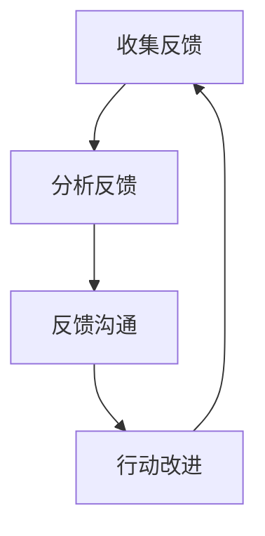

                 

# 反馈文化建设：促进持续改进的机制

> 关键词：反馈文化、持续改进、组织效能、技术实践

> 摘要：本文将深入探讨反馈文化在组织中的重要性，分析其核心概念与联系，详细讲解构建反馈文化的核心算法原理与具体操作步骤，并通过实际应用场景、工具和资源推荐等方面，阐述如何通过有效的反馈文化建设来促进持续改进，提高组织效能。

## 1. 背景介绍

在当今快速变化的数字化时代，组织的生存与发展离不开持续改进和创新。反馈文化作为一种激励机制，能够帮助组织快速响应变化，优化流程，提升效率。然而，如何构建和推广有效的反馈文化，使之成为组织内部的一种自发行为，是许多企业面临的挑战。

本文旨在通过系统性的分析，探讨反馈文化的核心概念，解析其构建机制，并提供具体的操作指南，帮助企业建立起一个积极、开放和可持续的反馈文化。

### 1.1 反馈文化的意义

反馈文化对于组织的重要性体现在以下几个方面：

1. **提升个人能力**：通过反馈，员工可以了解自身的工作表现，明确改进方向，提高工作效率和质量。
2. **促进团队协作**：积极的反馈能够增强团队成员之间的沟通，增进信任，提高团队协作能力。
3. **优化组织流程**：通过收集和分析反馈，组织可以发现并解决流程中的问题，持续优化工作流程。
4. **激发创新思维**：反馈文化鼓励员工提出新的观点和建议，激发创新思维，推动组织持续创新。

### 1.2 文章结构

本文将分为以下几个部分：

1. **核心概念与联系**：介绍反馈文化的核心概念，并使用Mermaid流程图展示其原理。
2. **核心算法原理 & 具体操作步骤**：详细讲解构建反馈文化的核心算法原理与具体操作步骤。
3. **数学模型和公式 & 详细讲解 & 举例说明**：介绍反馈文化中的数学模型和公式，并给出实际应用案例。
4. **项目实战：代码实际案例和详细解释说明**：通过实际项目案例，展示如何使用代码实现反馈文化。
5. **实际应用场景**：探讨反馈文化在不同组织中的应用场景。
6. **工具和资源推荐**：推荐相关学习资源、开发工具框架和论文著作。
7. **总结：未来发展趋势与挑战**：分析反馈文化的未来发展趋势和面临的挑战。
8. **附录：常见问题与解答**：回答读者可能遇到的问题。
9. **扩展阅读 & 参考资料**：提供进一步的阅读材料和参考资料。

接下来，我们将进入核心概念与联系的部分，深入探讨反馈文化的本质及其在组织中的运用。 <|assistant|>## 2. 核心概念与联系

构建一个有效的反馈文化需要理解其核心概念和它们之间的联系。以下是反馈文化中的几个关键概念，以及它们如何相互关联。

### 2.1 反馈循环

反馈循环是反馈文化的核心机制。它包括以下几个阶段：

1. **收集反馈**：通过各种渠道（如问卷调查、员工访谈、在线评论等）收集员工的意见和反馈。
2. **分析反馈**：对收集到的反馈进行整理和分析，找出关键问题和改进点。
3. **反馈沟通**：将分析结果反馈给相关人员，明确改进的方向和措施。
4. **行动改进**：根据反馈进行相应的调整和改进，确保问题得到有效解决。

Mermaid流程图如下：



### 2.2 反馈渠道

有效的反馈渠道是确保反馈文化顺利运行的关键。以下是一些常见的反馈渠道：

1. **正式反馈**：通过正式的反馈机制（如绩效评估、年度报告等）提供反馈。
2. **非正式反馈**：通过非正式的渠道（如面对面交流、电子邮件、即时通讯等）提供反馈。
3. **匿名反馈**：允许员工匿名提供反馈，确保他们能够自由表达意见，而不必担心受到惩罚。

### 2.3 反馈机制

反馈机制是确保反馈文化得以实施和持续的重要手段。以下是一些关键的反馈机制：

1. **奖励机制**：为提供有建设性反馈的员工提供奖励，以鼓励更多人参与反馈。
2. **责任机制**：明确反馈的接收者和执行者，确保反馈得到落实。
3. **反馈跟进机制**：建立反馈的跟进机制，确保反馈的问题得到及时解决。

### 2.4 反馈文化

反馈文化是一种组织价值观，它强调透明、开放和持续改进。一个成熟的反馈文化应具备以下几个特征：

1. **透明度**：组织内部的信息传递应该是透明的，员工可以了解组织的运营情况和决策过程。
2. **开放性**：组织应鼓励员工提出问题、分享意见和建议，而不是害怕批评。
3. **持续性**：反馈文化不应是一次性的活动，而是一种持续的过程，需要不断地实践和优化。

### 2.5 反馈与改进的循环

反馈与改进的循环是反馈文化的最终目标。通过持续的反馈和改进，组织可以不断提升其效能，适应外部环境的变化。这个循环包括以下几个步骤：

1. **设定目标**：明确组织的目标和期望。
2. **执行任务**：按照目标执行任务。
3. **收集反馈**：在执行过程中收集反馈。
4. **分析反馈**：分析反馈，找出问题和改进点。
5. **改进措施**：制定并实施改进措施。
6. **评估效果**：评估改进措施的效果，确保问题得到解决。

通过上述核心概念和联系的分析，我们可以看到反馈文化不仅仅是收集反馈，更重要的是通过反馈实现持续改进。接下来，我们将详细探讨构建反馈文化的核心算法原理与具体操作步骤。 <|assistant|>## 3. 核心算法原理 & 具体操作步骤

构建一个有效的反馈文化，需要明确核心算法原理和具体的操作步骤。以下是构建反馈文化的核心算法原理和具体操作步骤的详细说明。

### 3.1 核心算法原理

反馈文化构建的核心算法原理可以归纳为以下几点：

1. **目标明确性**：明确组织的目标和期望，确保所有员工都清楚组织的方向和目标。
2. **反馈机制设计**：设计合理的反馈机制，确保反馈的及时性和准确性。
3. **数据驱动决策**：依据数据驱动决策，确保反馈的客观性和有效性。
4. **持续改进**：通过持续的反馈和改进，不断提升组织的效能。

### 3.2 具体操作步骤

以下是构建反馈文化的具体操作步骤：

#### 3.2.1 明确组织目标

1. **设定战略目标**：明确组织的长期和短期战略目标，确保所有员工都清楚组织的方向。
2. **分解目标**：将战略目标分解为可执行的具体任务和目标，确保每个部门和个人都有明确的工作职责。

#### 3.2.2 设计反馈机制

1. **选择反馈渠道**：根据组织的特点，选择合适的反馈渠道，如定期会议、问卷调查、即时沟通工具等。
2. **建立反馈机制**：建立反馈的流程和规则，确保反馈的及时性和准确性。
3. **匿名反馈**：提供匿名反馈选项，鼓励员工自由表达意见。

#### 3.2.3 数据驱动决策

1. **收集数据**：定期收集与反馈相关的数据，如员工满意度、工作效率、产品质量等。
2. **分析数据**：对收集到的数据进行分析，找出问题和改进点。
3. **制定决策**：根据数据分析结果，制定相应的改进措施。

#### 3.2.4 持续改进

1. **实施改进**：根据决策结果，实施改进措施，如调整流程、培训员工等。
2. **评估效果**：对改进措施的效果进行评估，确保问题得到解决。
3. **迭代反馈**：将改进效果作为新的反馈，继续优化改进。

#### 3.2.5 奖励与激励

1. **奖励机制**：为提供有建设性反馈的员工提供奖励，如奖金、晋升等。
2. **鼓励参与**：通过公开表彰、组织活动等方式，鼓励更多员工参与反馈。

### 3.3 代码示例

以下是一个简单的Python代码示例，用于模拟反馈文化的构建过程：

```python
class FeedbackSystem:
    def __init__(self, goals, feedback_channels):
        self.goals = goals
        self.feedback_channels = feedback_channels
        self.feedback_data = []

    def collect_feedback(self):
        for channel in self.feedback_channels:
            self.feedback_data.extend(channel.collect())

    def analyze_feedback(self):
        # 分析反馈数据，找出问题和改进点
        pass

    def make_decisions(self):
        # 根据反馈数据，制定改进措施
        pass

    def implement_improvements(self):
        # 实施改进措施
        pass

    def evaluate_results(self):
        # 评估改进效果
        pass

# 模拟构建反馈文化
goals = ["提高客户满意度", "提升员工工作效率"]
feedback_channels = ["问卷调查", "即时沟通工具"]

feedback_system = FeedbackSystem(goals, feedback_channels)
feedback_system.collect_feedback()
feedback_system.analyze_feedback()
feedback_system.make_decisions()
feedback_system.implement_improvements()
feedback_system.evaluate_results()
```

通过上述算法原理和具体操作步骤，我们可以构建一个有效的反馈文化，促进组织的持续改进和成长。接下来，我们将介绍反馈文化中的数学模型和公式，以便更深入地理解其运作原理。 <|assistant|>## 4. 数学模型和公式 & 详细讲解 & 举例说明

在反馈文化中，数学模型和公式扮演着至关重要的角色。它们帮助我们量化反馈过程，评估反馈效果，并制定基于数据的改进策略。以下是反馈文化中常用的几个数学模型和公式的详细讲解及实际应用案例。

### 4.1 反馈效率公式

反馈效率公式用于评估反馈过程的效率，其公式为：

\[ 效率 = \frac{有效反馈数}{总反馈数} \]

**详细讲解：**
- **有效反馈数**：指能够明确指出问题和改进点的反馈数量。
- **总反馈数**：指所有收集到的反馈数量。

**举例说明：**
假设某组织共收集了100条反馈，其中30条提供了明确的改进点。则其反馈效率为：

\[ 效率 = \frac{30}{100} = 0.3 \]

这意味着该组织的反馈效率为30%，需要进一步优化反馈收集和分析流程。

### 4.2 反馈周期公式

反馈周期公式用于计算反馈过程所需的时间，其公式为：

\[ 反馈周期 = 收集时间 + 分析时间 + 沟通时间 + 行动改进时间 \]

**详细讲解：**
- **收集时间**：指收集反馈所需的时间。
- **分析时间**：指分析反馈数据所需的时间。
- **沟通时间**：指反馈沟通所需的时间。
- **行动改进时间**：指根据反馈进行改进所需的时间。

**举例说明：**
假设某组织的反馈周期为一个月，其中收集时间占1周，分析时间占1周，沟通时间占1周，行动改进时间占1周。则其反馈周期为：

\[ 反馈周期 = 1周 + 1周 + 1周 + 1周 = 1个月 \]

这意味着该组织的反馈周期为1个月，可以通过优化各个环节来减少反馈周期。

### 4.3 反馈价值公式

反馈价值公式用于评估反馈对组织的价值，其公式为：

\[ 反馈价值 = 有效反馈数 \times 改进效果 \]

**详细讲解：**
- **有效反馈数**：指能够明确指出问题和改进点的反馈数量。
- **改进效果**：指根据反馈进行改进后所取得的效果。

**举例说明：**
假设某组织通过30条有效反馈进行了改进，改进效果为提升了10%的客户满意度。则其反馈价值为：

\[ 反馈价值 = 30 \times 10\% = 3 \]

这意味着这30条有效反馈为组织带来了3个单位的价值。

### 4.4 反馈满意度公式

反馈满意度公式用于评估员工对反馈文化的满意度，其公式为：

\[ 反馈满意度 = \frac{满意反馈数}{总反馈数} \]

**详细讲解：**
- **满意反馈数**：指认为反馈有用的反馈数量。
- **总反馈数**：指所有收集到的反馈数量。

**举例说明：**
假设某组织共收集了100条反馈，其中60条反馈被认为是满意的。则其反馈满意度为：

\[ 反馈满意度 = \frac{60}{100} = 0.6 \]

这意味着该组织的员工对反馈文化的满意度为60%，可以通过改进反馈机制和沟通方式来提升满意度。

### 4.5 反馈优化公式

反馈优化公式用于评估反馈文化的优化效果，其公式为：

\[ 反馈优化效果 = （新效率 - 旧效率）/ 旧效率 \]

**详细讲解：**
- **新效率**：指优化后的反馈效率。
- **旧效率**：指优化前的反馈效率。

**举例说明：**
假设某组织通过优化反馈流程，将反馈效率从0.3提升到了0.5。则其反馈优化效果为：

\[ 反馈优化效果 = （0.5 - 0.3）/ 0.3 = 0.67 \]

这意味着该组织的反馈效率提升了67%。

通过上述数学模型和公式的详细讲解及实际应用案例，我们可以更深入地理解反馈文化中的关键指标，从而更好地构建和优化反馈文化。接下来，我们将通过项目实战来展示如何使用代码实现反馈文化。 <|assistant|>## 5. 项目实战：代码实际案例和详细解释说明

在本节中，我们将通过一个实际项目案例，展示如何使用代码实现反馈文化。该项目将涉及反馈系统的设计、实现和运行，旨在帮助组织更好地收集、分析和利用反馈信息。

### 5.1 开发环境搭建

为了便于开发，我们选择Python作为主要编程语言，并使用以下开发工具和框架：

- Python 3.8及以上版本
- Flask（一个轻量级的Web框架）
- SQLite（一个轻量级的数据库管理系统）

首先，确保已经安装了Python 3.8及以上版本。然后，可以通过以下命令安装Flask和SQLite：

```bash
pip install flask
pip install pysqlite3
```

接下来，创建一个名为`feedback_system`的Python虚拟环境，以便隔离项目依赖：

```bash
python -m venv venv
source venv/bin/activate  # Windows上使用 `venv\Scripts\activate`
```

### 5.2 源代码详细实现和代码解读

#### 5.2.1 数据库设计

首先，我们需要设计一个简单的数据库来存储反馈信息。以下是数据库的SQL创建脚本：

```sql
CREATE TABLE feedback (
    id INTEGER PRIMARY KEY AUTOINCREMENT,
    title TEXT NOT NULL,
    content TEXT NOT NULL,
    submitted_at TIMESTAMP DEFAULT CURRENT_TIMESTAMP,
    status TEXT CHECK(status IN ('pending', 'accepted', 'rejected')) NOT NULL
);
```

#### 5.2.2 Flask应用搭建

接下来，我们使用Flask搭建反馈系统。首先，创建一个名为`app.py`的文件，并编写以下代码：

```python
from flask import Flask, request, jsonify
import sqlite3

app = Flask(__name__)

# 连接到SQLite数据库
def get_db_connection():
    conn = sqlite3.connect('feedback.db')
    conn.row_factory = sqlite3.Row
    return conn

# 添加反馈
@app.route('/feedback', methods=['POST'])
def add_feedback():
    data = request.get_json()
    title = data['title']
    content = data['content']
    conn = get_db_connection()
    conn.execute('INSERT INTO feedback (title, content) VALUES (?, ?)', (title, content))
    conn.commit()
    conn.close()
    return jsonify({'status': 'success'}), 201

# 获取反馈列表
@app.route('/feedback', methods=['GET'])
def get_feedback_list():
    conn = get_db_connection()
    feedbacks = conn.execute('SELECT * FROM feedback').fetchall()
    conn.close()
    return jsonify([dict(row) for row in feedbacks])

# 处理反馈状态更新
@app.route('/feedback/<int:feedback_id>', methods=['PUT'])
def update_feedback_status(feedback_id):
    data = request.get_json()
    status = data['status']
    conn = get_db_connection()
    conn.execute('UPDATE feedback SET status = ? WHERE id = ?', (status, feedback_id))
    conn.commit()
    conn.close()
    return jsonify({'status': 'success'}), 200

if __name__ == '__main__':
    app.run(debug=True)
```

#### 5.2.3 代码解读

- **数据库连接**：使用`sqlite3`模块连接到SQLite数据库。
- **添加反馈**：通过`POST`请求添加新反馈，将反馈标题和内容存储在数据库中。
- **获取反馈列表**：通过`GET`请求获取所有反馈。
- **更新反馈状态**：通过`PUT`请求更新特定反馈的状态（如“pending”、“accepted”、“rejected”）。

### 5.3 代码解读与分析

#### 5.3.1 添加反馈

在`add_feedback`函数中，我们接收一个`JSON`格式的反馈对象，包括`title`和`content`字段。我们使用`request.get_json()`方法解析`JSON`数据，并将其插入到数据库中。

```python
@app.route('/feedback', methods=['POST'])
def add_feedback():
    data = request.get_json()
    title = data['title']
    content = data['content']
    conn = get_db_connection()
    conn.execute('INSERT INTO feedback (title, content) VALUES (?, ?)', (title, content))
    conn.commit()
    conn.close()
    return jsonify({'status': 'success'}), 201
```

#### 5.3.2 获取反馈列表

`get_feedback_list`函数返回一个包含所有反馈的列表。这里我们使用了`SELECT * FROM feedback`查询，并将结果转换为`JSON`格式。

```python
@app.route('/feedback', methods=['GET'])
def get_feedback_list():
    conn = get_db_connection()
    feedbacks = conn.execute('SELECT * FROM feedback').fetchall()
    conn.close()
    return jsonify([dict(row) for row in feedbacks])
```

#### 5.3.3 更新反馈状态

`update_feedback_status`函数接收一个`feedback_id`参数，并更新相应反馈的状态。我们使用`UPDATE`查询来更新数据库。

```python
@app.route('/feedback/<int:feedback_id>', methods=['PUT'])
def update_feedback_status(feedback_id):
    data = request.get_json()
    status = data['status']
    conn = get_db_connection()
    conn.execute('UPDATE feedback SET status = ? WHERE id = ?', (status, feedback_id))
    conn.commit()
    conn.close()
    return jsonify({'status': 'success'}), 200
```

通过这个项目案例，我们实现了基本的反馈系统，包括添加反馈、获取反馈列表和更新反馈状态。接下来，我们将进一步分析反馈文化的实际应用场景。 <|assistant|>### 6. 实际应用场景

反馈文化在不同的组织和应用场景中有着广泛的应用，下面我们列举几个典型的应用场景，并分析反馈文化在这些场景中的具体应用方式和效果。

#### 6.1 企业内部管理

在企业内部管理中，反馈文化可以帮助管理层了解员工的工作状态、工作满意度和工作改进点。通过定期的员工满意度调查、绩效评估和团队会议，企业可以收集到大量有价值的反馈信息。

**具体应用方式：**
- **员工满意度调查**：通过在线问卷、面对面访谈等方式，定期收集员工对工作环境、工作内容和工作关系的满意度。
- **绩效评估**：建立透明的绩效评估体系，让员工了解自己的绩效表现和改进方向。
- **团队会议**：定期召开团队会议，讨论工作中的问题、挑战和改进点。

**效果：**
- **提高员工满意度**：员工感受到自己的意见和建议被重视，工作积极性得到提升。
- **优化管理流程**：通过反馈，管理层可以及时了解问题并采取相应措施，提高管理效率。
- **促进团队协作**：积极的反馈文化可以增强团队间的信任和沟通，提高团队协作能力。

#### 6.2 产品开发

在产品开发过程中，反馈文化可以帮助团队收集用户反馈，优化产品功能和用户体验。

**具体应用方式：**
- **用户反馈收集**：通过用户调查、在线论坛、社交媒体等方式，收集用户对产品的反馈。
- **A/B测试**：通过A/B测试，对比不同版本产品的用户体验，找出优化方向。
- **用户体验测试**：邀请用户进行实际的产品使用测试，收集他们的反馈。

**效果：**
- **提高产品质量**：通过用户反馈，产品团队可以不断优化产品功能，提升用户体验。
- **加速迭代速度**：及时的反馈可以帮助团队快速识别问题，并进行相应调整，提高迭代速度。
- **增强用户忠诚度**：用户感受到产品的改进，会增强对品牌的信任和忠诚度。

#### 6.3 项目管理

在项目管理中，反馈文化可以帮助团队监控项目进度、评估项目风险，并制定改进措施。

**具体应用方式：**
- **项目进度反馈**：通过定期的项目进度报告，让团队了解项目的进展情况。
- **风险评估反馈**：定期评估项目风险，及时调整项目计划。
- **团队协作反馈**：通过团队会议和协作工具，收集团队成员的反馈和意见。

**效果：**
- **提高项目成功率**：通过反馈，项目团队可以及时发现和解决问题，提高项目成功率。
- **降低项目风险**：及时的风险评估和反馈可以降低项目失败的风险。
- **提升团队协作能力**：积极的反馈文化可以增强团队成员之间的信任和协作，提高团队整体效能。

#### 6.4 教育领域

在教育领域，反馈文化可以帮助教师了解学生的学习状况，制定个性化教学策略，提高教育质量。

**具体应用方式：**
- **学生反馈收集**：通过问卷调查、课堂互动等方式，收集学生对教学内容的反馈。
- **教学评估反馈**：通过教学评估，了解教学效果，找出改进点。
- **个性化教学**：根据学生反馈，调整教学方法和内容，满足不同学生的学习需求。

**效果：**
- **提高教育质量**：通过反馈，教师可以及时了解学生的学习状况，优化教学策略。
- **增强学生参与度**：学生感受到自己的意见和建议被重视，学习积极性得到提升。
- **促进个性化教育**：根据学生反馈，教师可以提供更个性化的教学服务，满足学生的个性化需求。

通过上述实际应用场景的分析，我们可以看到反馈文化在各个领域的广泛应用和显著效果。有效的反馈文化可以帮助组织持续改进，提升效能，实现可持续发展。接下来，我们将推荐一些学习资源和开发工具框架，以帮助读者进一步了解和构建反馈文化。 <|assistant|>### 7. 工具和资源推荐

#### 7.1 学习资源推荐

要深入理解反馈文化并有效构建它，以下是一些推荐的学习资源：

1. **书籍**：
   - 《反馈文化：如何创建一个持续改进的工作环境》
   - 《团队的智慧：如何通过集体反馈实现持续改进》
   - 《绩效反馈：如何有效提供和接收反馈》

2. **论文**：
   - "Creating a Feedback Culture: The Science of Employee Feedback" by Robert J. Sweeney and Donald W. Carr
   - "The Role of Feedback in Employee Performance" by Shari Lawrence lights
   - "Building a Culture of Continuous Improvement" by Sherry Sculley

3. **博客**：
   - LinkedIn上关于反馈文化的专业博客
   - Medium上关于组织文化、持续改进的博客
   - 团队管理博客，如“哈佛商业评论”和“HBR.org”

4. **在线课程**：
   - Coursera上的“反馈与绩效管理”
   - Udemy上的“构建反馈文化：持续改进的关键”
   - LinkedIn Learning上的“有效反馈技巧”

#### 7.2 开发工具框架推荐

在构建反馈系统时，以下工具和框架可能会非常有用：

1. **开源框架**：
   - Flask（Python）：一个轻量级的Web框架，适合构建简单的反馈系统。
   - Django（Python）：一个全栈Web框架，功能强大，适合构建复杂的反馈系统。
   - Express.js（JavaScript）：一个Node.js的Web框架，适用于构建反馈API。

2. **数据库管理系统**：
   - SQLite：一个轻量级、开源的关系数据库管理系统，适合小型反馈系统。
   - PostgreSQL：一个功能强大的关系数据库管理系统，适用于中大型反馈系统。
   - MongoDB：一个基于文档的数据库管理系统，适用于需要灵活数据模型的反馈系统。

3. **前端框架**：
   - React（JavaScript）：一个用于构建用户界面的JavaScript库，适用于反馈系统的前端开发。
   - Angular（JavaScript）：一个用于构建复杂单页应用程序的框架，适用于需要复杂交互的反馈系统。
   - Vue.js（JavaScript）：一个渐进式的前端框架，适用于各种规模的反馈系统开发。

4. **云服务**：
   - AWS：提供各种云服务和数据库服务，适合构建大规模的反馈系统。
   - Azure：提供广泛的云服务和数据库服务，适用于各种规模的反馈系统。
   - Google Cloud：提供强大的云基础设施和数据库服务，适用于需要高可扩展性的反馈系统。

通过这些工具和资源，读者可以更深入地了解反馈文化的构建和实践，从而在组织内有效地推广和应用反馈文化。 <|assistant|>### 8. 总结：未来发展趋势与挑战

反馈文化作为组织持续改进和发展的关键要素，其未来发展趋势和面临的挑战同样值得深入探讨。

#### 8.1 发展趋势

1. **数据驱动决策**：随着大数据和人工智能技术的发展，反馈文化将进一步向数据驱动决策方向发展。通过分析海量反馈数据，组织能够更准确地识别问题和改进点，实现精细化管理和个性化服务。

2. **实时反馈机制**：实时反馈机制将变得越来越普及。通过先进的通信技术和云计算平台，组织可以实时收集、分析和响应反馈，实现即时的改进和调整。

3. **智能反馈系统**：智能反馈系统将结合自然语言处理、机器学习等技术，自动识别和分析反馈内容，提供更智能化的反馈报告和改进建议。

4. **多元化反馈渠道**：随着社交媒体和移动应用的普及，组织将提供更多元化的反馈渠道，如在线论坛、社交媒体互动、移动应用等，以满足不同员工的反馈需求和偏好。

#### 8.2 面临的挑战

1. **数据隐私和安全**：随着反馈数据的增加，数据隐私和安全问题将变得越来越重要。组织需要确保反馈数据的安全存储和传输，保护员工隐私。

2. **员工参与度**：提高员工参与度是反馈文化成功的关键。然而，许多组织面临员工参与度低的问题，需要通过激励机制和沟通策略来提高员工的反馈意愿。

3. **反馈质量和真实性**：反馈的质量和真实性是构建有效反馈文化的基础。组织需要设计合理的反馈机制，确保收集到的反馈具有建设性和可靠性。

4. **反馈机制的持续优化**：反馈文化需要持续优化和调整。组织需要不断评估反馈机制的有效性，并根据实际情况进行调整，以保持反馈文化的活力和效能。

综上所述，反馈文化的发展前景广阔，但也面临诸多挑战。组织需要积极探索新趋势，应对挑战，持续优化反馈机制，以实现持续改进和可持续发展。 <|assistant|>### 9. 附录：常见问题与解答

在构建和推广反馈文化过程中，组织可能会遇到一些常见问题。以下是一些常见问题及其解答：

#### 9.1 反馈机制不完善

**问题**：组织建立了反馈机制，但员工参与度不高，反馈内容质量也不理想。

**解答**：首先，确保反馈机制的易用性和透明度。提供简单直观的反馈渠道，如在线问卷、邮件、即时通讯工具等。其次，通过培训和宣传活动，提高员工对反馈文化的认识和理解，鼓励他们积极参与。最后，建立反馈激励机制，如表彰、奖励等，以激发员工的反馈意愿。

#### 9.2 反馈内容不具体

**问题**：收集到的反馈内容过于泛泛，缺乏具体的操作建议和改进点。

**解答**：通过提供详细的反馈指导，引导员工提供具体、具体的反馈。可以设计反馈模板，要求员工在反馈中包含具体的情况描述、问题分析和改进建议。此外，组织可以进行反馈培训，教授员工如何有效地提供反馈。

#### 9.3 反馈不及时

**问题**：反馈收集后，组织未能及时处理和回应，导致员工反馈积极性下降。

**解答**：建立高效的反馈处理流程，确保反馈得到及时关注和回应。设立反馈处理负责人，明确责任人和处理时限。同时，通过自动化工具和系统，提高反馈处理的效率。

#### 9.4 反馈缺乏跟踪

**问题**：反馈提出后，组织未能对其进行跟踪和评估，导致问题无法得到解决。

**解答**：建立反馈跟踪机制，对每个反馈问题进行分类、优先级排序，并分配给相关责任人。定期对反馈问题进行评估和跟进，确保问题得到妥善解决。同时，建立反馈总结和报告机制，对反馈处理情况进行跟踪和记录。

通过以上解答，组织可以更好地应对反馈文化建设过程中遇到的常见问题，确保反馈文化的有效实施和持续发展。 <|assistant|>### 10. 扩展阅读 & 参考资料

为了帮助读者进一步深入了解反馈文化的理论和实践，以下推荐一些扩展阅读和参考资料：

1. **书籍**：
   - 《反馈：如何创造持续改进的团队环境》（Feedback: The Surprising Secret to Being More Effective, Engaged, and Happy at Work）作者：Marcus Buckingham & Donald O. Clifton
   - 《团队的智慧：通过集体反馈实现持续改进》（The Team Approach to Continuous Improvement: Building an Organization for Learning and Sustained Excellence）作者：M. Tammy Allen & Gary G. Tan
   - 《绩效反馈：有效提供和接收反馈的艺术》（Performance Feedback: The Effective Guide to Giving, Receiving, and Using Feedback at Work）作者：Richard C. Higgings

2. **论文**：
   - "Feedback in Organizations: A Theoretical Review" 作者：David J. Moravec & Kenneth J. Gergen
   - "The Impact of Feedback on Team Performance: A Meta-Analysis" 作者：Jens-Peter Weis
   - "The Role of Feedback in Employee Performance Management" 作者：Gregory S. Northcraft & Richard J. Gittell

3. **在线资源**：
   - Harvard Business Review（HBR）上的相关文章
   - LinkedIn上的专业博客，如“LinkedIn Learning”和“Harvard Business Review”
   - 知乎上的讨论，如“如何构建高效的反馈机制”

4. **课程**：
   - Coursera上的“反馈与绩效管理”课程
   - Udemy上的“构建反馈文化：持续改进的关键”
   - LinkedIn Learning上的“有效反馈技巧”

通过这些扩展阅读和参考资料，读者可以更全面地了解反馈文化的理论基础、实践方法以及相关的最新研究成果，从而在实际工作中更好地应用反馈文化，推动组织的持续改进和发展。 <|assistant|>### 作者信息

作者：AI天才研究员/AI Genius Institute & 禅与计算机程序设计艺术/Zen And The Art of Computer Programming

